# 7：自主AI代理基础与实现 🧠

在本节课中，我们将学习自主AI代理的核心概念、发展历程以及实现其能力的关键技术。我们将从通用人工智能（AGI）的定义出发，探讨如何利用现有的大型语言模型（LLM），通过一系列技术（如思维链、强化学习、检索增强生成等）来构建能够执行复杂任务的智能代理。

---

## 什么是自主AI代理？🤖

自主AI代理是一个能够感知环境、进行决策并执行动作以实现特定目标的系统。在深度学习时代，其架构包含传感器和执行器。而在后生成式AI时代，架构变得更加简化，传感器和执行器被抽象为“工具”，而大型语言模型（LLM）则作为其核心的“推理引擎”。

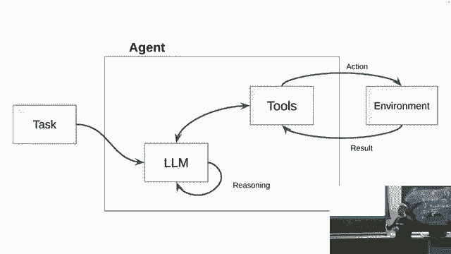

**核心架构公式**：
```
代理 = LLM（推理核心） + 工具（感知与执行接口） + 环境
```

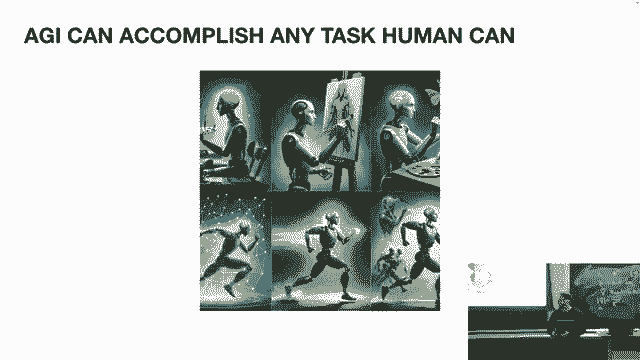

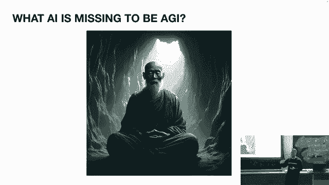

上一节我们介绍了代理的基本概念，本节中我们来看看一个更高的目标：通用人工智能（AGI）。

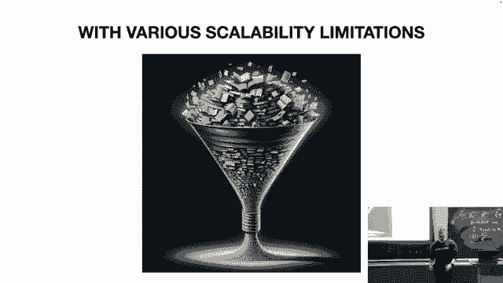

---

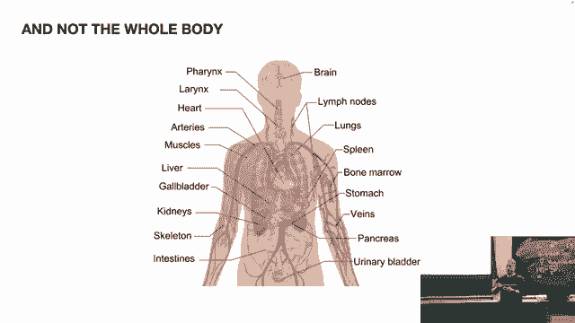

## 迈向通用人工智能（AGI）🚀

通用人工智能（AGI）指的是能够完成任何人类可以完成的任务，或在任何人类可以交互的环境中做出反应的智能系统。当前的AI，如大型语言模型，更像一个在洞穴中冥想的僧人：它拥有广泛的知识，但存在于特定的时间和环境之外，是一个静态的“快照”。

**当前LLM的局限性**：
1.  **上下文窗口限制**：像一次性给僧人太多书，它只能处理有限的信息。
2.  **缺乏环境交互**：它没有“身体”或“感官”来实时感知和影响世界。
3.  **静态知识**：其知识在训练后固定，无法持续学习新事件。

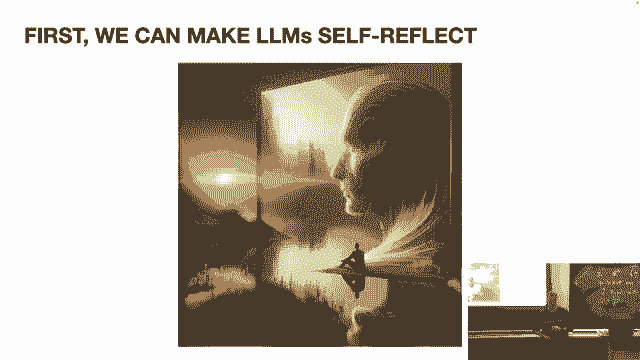

那么，我们能否利用现有的LLM技术，推动其向AGI的能力发展呢？答案是肯定的，主要有两种思路。

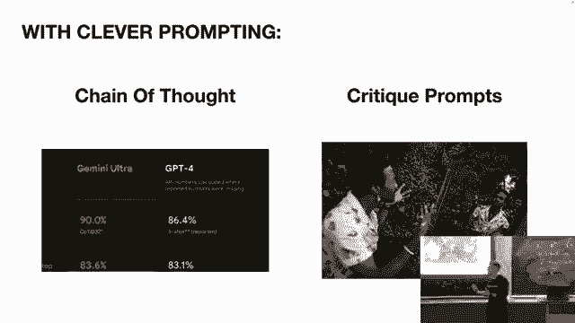

---

## 赋能LLM：从“僧人”到“行动者”🔧

一种观点认为需要彻底重新设计AI架构。但另一种更实用的软件工程思路是：**组合优于继承**。我们可以围绕现有LLM构建技术，克服其限制，赋予其新的能力。以下是几种关键技术：

### 1. 思维链与自我反思

人类是迭代思考的。我们可以赋予LLM类似的“自我反思”能力。思维链技术通过让模型基于前一步的输出进行多步推理，显著提升其复杂问题解决能力。

**代码示例（提示思路）**：
```
问题：小明有5个苹果，吃了2个，又买了3个，现在有几个？
请一步步思考。
第一步：最初有5个苹果。
第二步：吃掉2个，剩余 5 - 2 = 3 个。
第三步：又买3个，现在有 3 + 3 = 6 个。
答案：6个。
```

### 2. 持续学习与强化学习

人类从经验中持续学习。我们可以通过**强化学习来自人类反馈（RLHF）** 来微调模型。更先进的方法是**强化学习来自AI反馈（RLAIF）**，即让AI自己生成反馈数据来训练自己，这类似于人类的“睡眠学习”过程。

### 3. 检索增强生成

为了让“僧人”能获取最新、最相关的信息，我们可以给它一个“外部知识库”或“笔记本”。这就是**检索增强生成（RAG）**。它允许LLM在执行任务时，实时检索外部数据源（如数据库、最新新闻、学术论文），并将相关信息融入其生成过程中。

**RAG流程简述**：
1.  接收用户查询。
2.  从外部知识库中检索相关文档片段。
3.  将查询和检索到的片段一起输入LLM。
4.  LLM生成基于这些信息的答案。

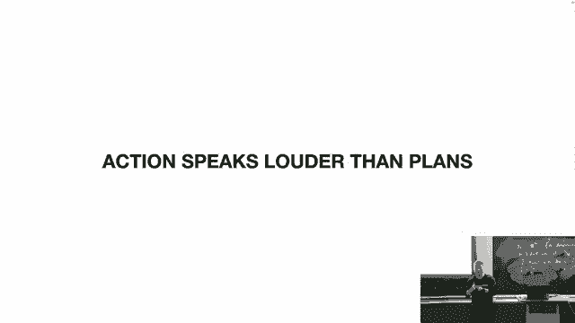

### 4. 使用工具与规划能力

LLM本身不擅长精确计算或处理结构化数据。但我们可以教它使用**工具**，比如计算器、搜索引擎API或代码解释器。然而，LLM的**长期规划能力**仍然较弱。解决之道在于将**规划与行动结合**：不需要一个完美的长期计划，只需规划好第一步行动，执行后观察结果，再重新规划下一步。**行动是最高效的环境计算**。

以下是构建强大代理所需的核心组件列表：

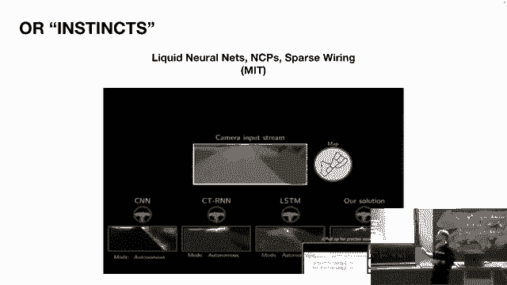

*   **自我反思**：通过思维链实现迭代推理。
*   **持续学习**：通过RLHF/RLAIF实现模型优化。
*   **外部知识**：通过RAG获取实时和特定领域信息。
*   **工具使用**：赋予模型调用外部工具的能力。
*   **行动与重规划**：在环境中执行动作，并根据反馈调整计划。

---

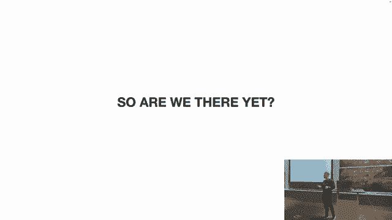

## 未来展望与挑战🔮

将上述所有组件高效地整合在一起，就能构建出功能强大、接近AGI的自主代理。但挑战依然存在：

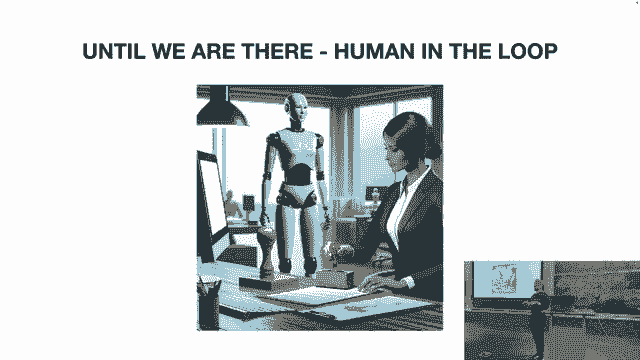

1.  **效率与成本**：当前这种架构可能非常昂贵且低效。
2.  **“肌肉记忆”与模仿学习**：未来可能需要引入基于行为的模型，让代理像人类一样通过模仿形成高效的习惯性动作，减少每一步的复杂推理。
3.  **多模态处理**：特别是高效的**视频信息处理**，对于现实世界中的自动驾驶、机器人等应用至关重要。MIT的液态神经网络等技术正在探索这一方向。
4.  **多代理协作**：未来可能会出现由多个专一AI代理组成的“公司”或社会，通过集体智能完成任务。
5.  **人机交互与信任**：在获得完全信任之前，**人类在环（Human-in-the-loop）** 的设计至关重要。我们需要设计有效的界面和流程，让人类能够监督、批准或修正AI代理的行动。

---

## 总结📝

本节课我们一起学习了自主AI代理的构建之路。我们从AGI的定义出发，分析了当前LLM的局限性。接着，我们探讨了如何通过**思维链、强化学习、检索增强生成（RAG）和工具调用**等关键技术来赋能LLM，使其具备推理、学习、获取新知识和行动的能力。最后，我们展望了未来在效率、多模态、多代理协作以及人机信任方面面临的挑战与方向。

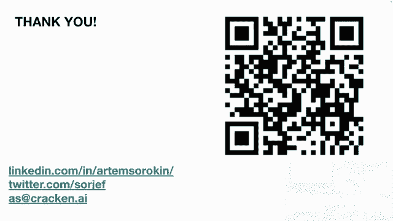

核心在于，我们已拥有实现强大智能代理的所有理论组件（特别是LLM带来的**推理能力**），剩下的问题是如何通过工程实践，将这些组件以正确、高效、可信的方式组合起来，并最终融入人类的生产和生活流程之中。