# P3：Convolutional Neural Networks - 爱可可-爱生活 - BV1jo4y1d7R6

大家好，欢迎回到MIT 6。S191！今天我们要谈论的是我最喜欢的一个。

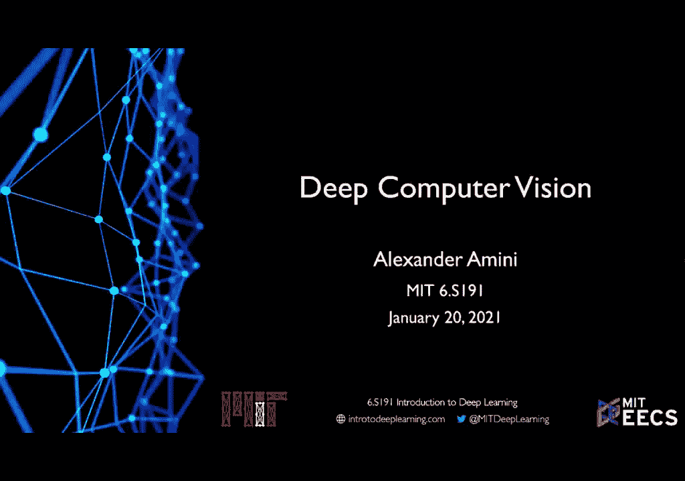

本课程的主题，这就是我们如何赋予机器视觉感，而视觉是其中之一。

我认为人类最重要的感官是视物在很多方面都非常依赖视觉，从环游世界到识别和操纵物体再到面部表情，表达和理解非常复杂的人类情感我可以肯定地说，视觉是，在日常生活中占很大比重，今天我们将学习如何使用深度学习。

建立功能强大的计算机视觉系统，并实际预测出什么位置，通过只看并且特别是只看原始视觉输入，我想认为这是一个，视觉的真正含义非常非常简单的定义，但实际上视觉非常重要，不仅仅是了解图像的含义。

还不仅仅意味着图像的含义，还要了解场景中物体的位置并真正预测，并展望未来，接下来会发生什么，以这个场景为例，我们可以建立计算机视觉算法来识别场景中的物体，例如，黄色的出租车，甚至这辆白色的卡车都在路边。

但我们需要了解的是，在不同的层面上实现真正的愿景实际上需要什么，所有这些对象，我们应该实际上应该更多地专注于黄色出租车，比白色卡车上的要好，因为此图像中有一些细微的提示，您可以，可能会捡起来。

导致我们相信这辆白色卡车可能停在了侧面，的道路是静止的，至少在未来一段时间可能不会移动，另一方面，我们正在观察黄色出租车的场景，即使它也没有移动，由于行人横穿马路而导致行进的可能性更大，它的前面。

这是非常微妙的，但实际上可以被认为是非常，我们的大脑和人类有效地将其视为理所当然，但这是一个极具挑战性的挑战，现实世界中的问题，因为在现实世界中构建真实的视觉算法，可能需要推理所有这些不同的组件。

不仅在前台，而且在，有一些非常重要的线索，我们可以像这样在背景中获取，道路灯以及远处的一些障碍物并建立这些视野，算法确实确实需要了解所有这些非常细微的细节。

深度学习正在带来令人难以置信的计算机视觉革命或发展。

算法和应用程序，从允许机器人使用视觉提示执行诸如。

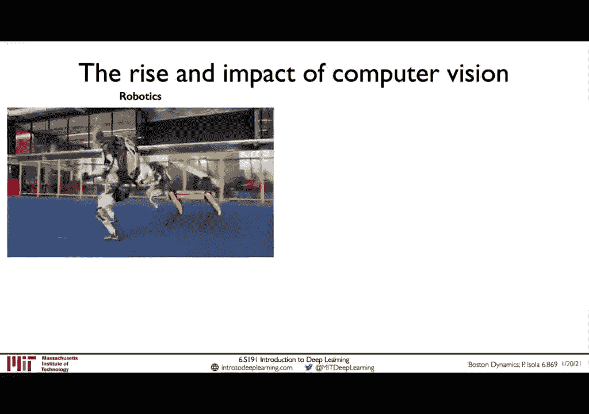

导航以及您今天在本课程中将要学习的这些算法已经变得如此。

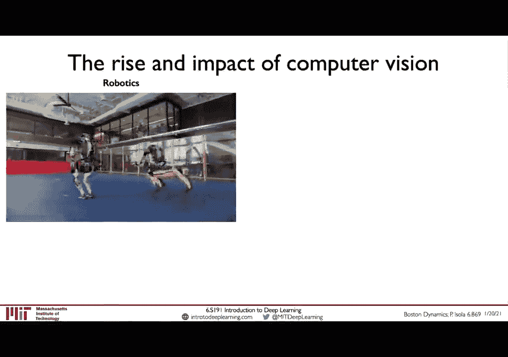

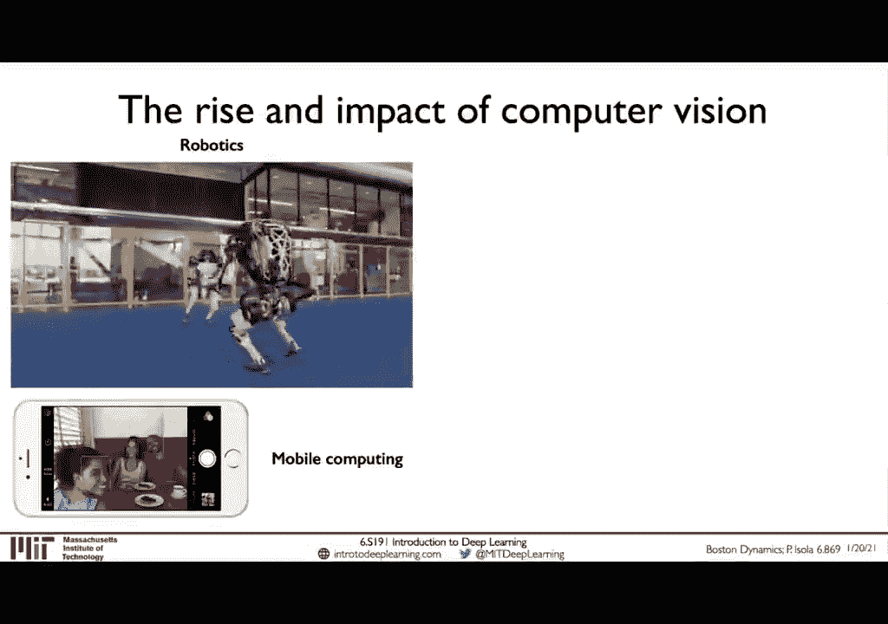

主流化并如此压缩，以至于它们都适合并在我们的每个口袋中运行。

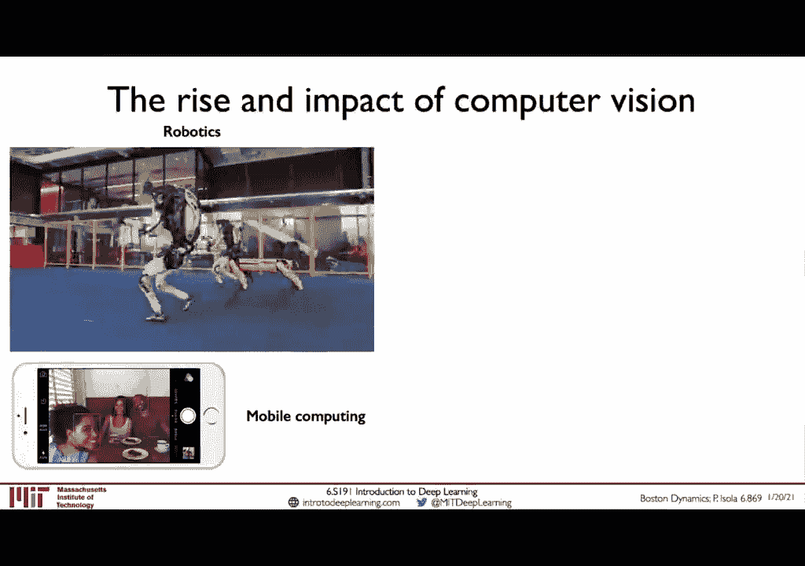

用于处理照片和视频并检测脸部的电话，以提供更大的便利。

我们还看到视觉在生物学和医学中的一些非常令人兴奋的应用。

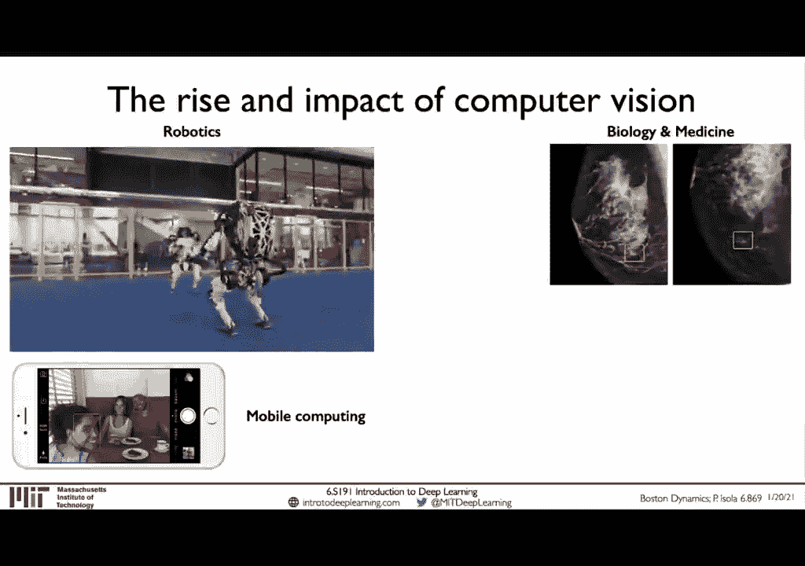

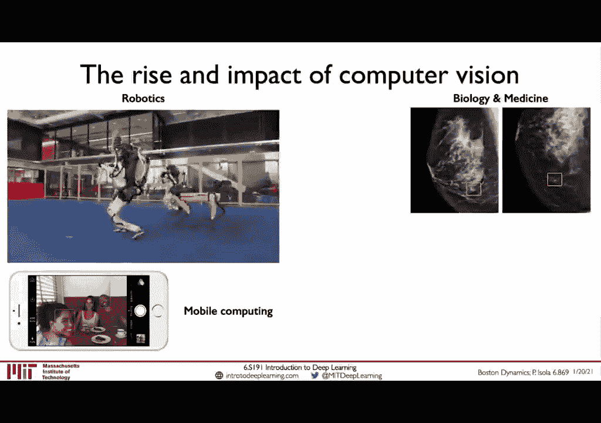

掌握极其微妙的线索并检测出癌症以及。

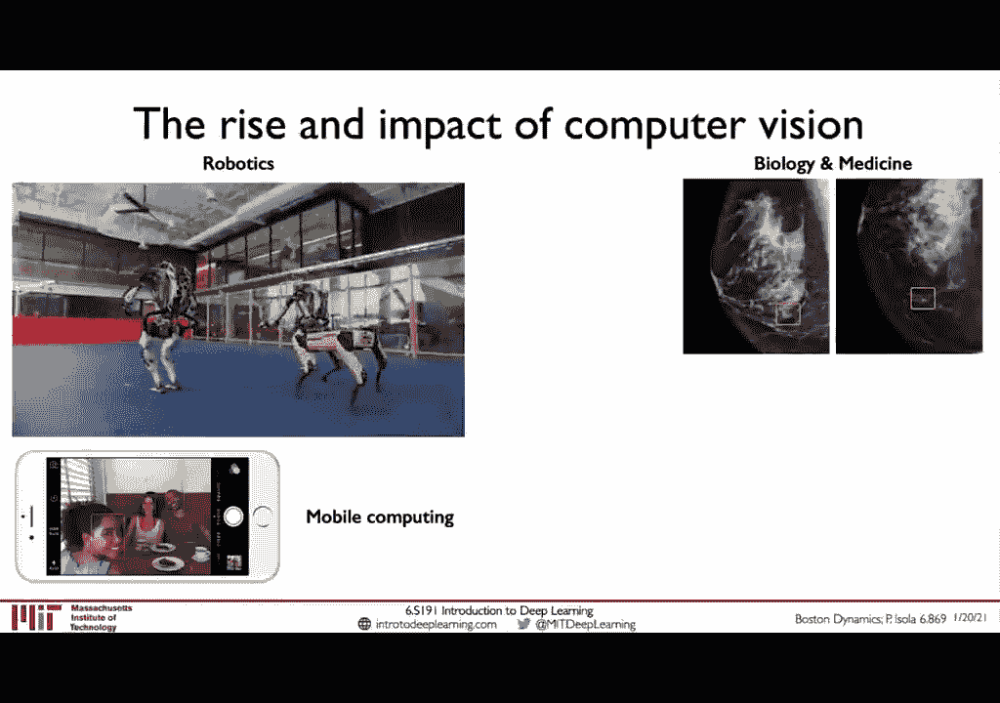

自动驾驶领域，最后是几张幻灯片，我将分享一个非常鼓舞人心的故事，您今天将要学习的算法如何也用于可访问性，为了帮助视障人士，现在的深度学习已经采用了计算机视觉，尤其是计算机，暴风雨般的视觉。

因为它能够直接从原始图像输入中学习并学会，仅通过观察大量数据进行特征提取，在计算机视觉领域流行的是面部检测和面部识别，您实际上可以在左上角或左上角看到人眼的图标，从图片上我，用于表示我们感知到的图像。

我们还可以通过神经网络，预测这些面部特征，现在深度学习已经改变了这个领域，因为它可以，机器学习或深度学习算法的创建者可以轻松地交换最终任务，给定足够的数据以在视觉和任务之间的中间学习该神经网络。

并尝试解决它，所以在这里我们执行面部检测的最终任务，但同样，最终的任务可能是在自动驾驶的背景下，在这里我们将图像，您实际上可以在右下角看到的输入，我们尝试直接学习，输出的转向控制。

并直接从这一观察结果中直接学习，汽车应该控制的场景，那么应该执行的方向盘是什么，完全端到端完成了整个控制系统，这辆车在这里是一个单一的神经，网络现在完全从数据中学到的知识。

这与大多数其他知识有很大的不同，像您这样的无人驾驶汽车公司将与Waymo和tesla et cetera见面，我们将再谈更多，关于此事，但我实际上想与您分享此剪辑，因为这是其中之一。

我们一直在实验室中建造的自动驾驶汽车，在这里我属于，而且我们还将在演讲的后面看到更多有关该内容的信息。就像我提到的那样，在医学和医疗保健领域有很多应用，在这里我们可以获取这些原始图像和患者扫描图像。

并学会检测诸如，乳腺癌，皮肤癌，现在最近是对患者的肺部进行扫描以检测covid19。

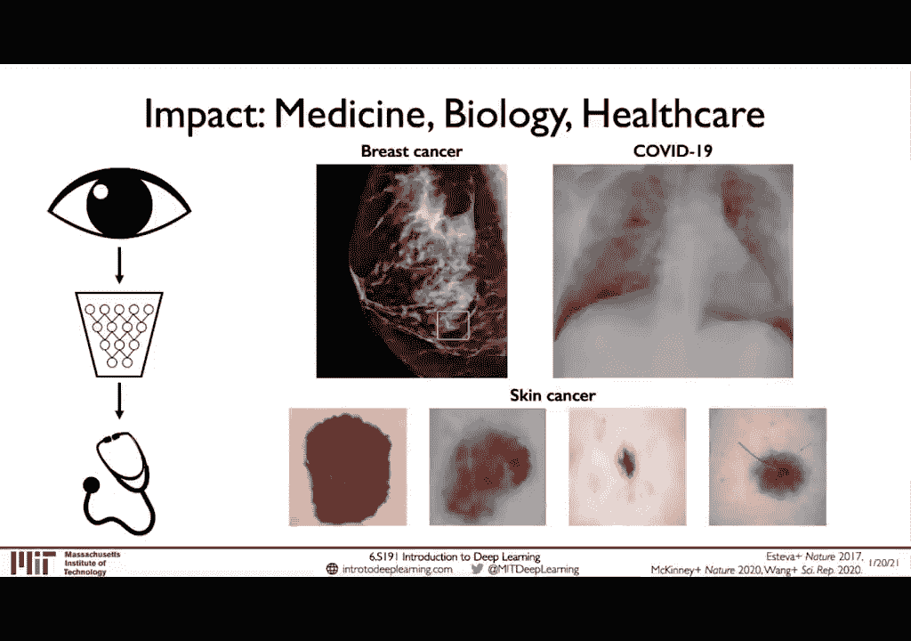

最后，我想分享这个关于如何使用计算机视觉来帮助人们的鼓舞人心的故事，视障人士，因此在此项目中，研究人员实际上制造了支持深度学习的设备，可以检测跑步路线并向视障用户提供听觉反馈，这样他们就可以运行了。

现在演示一下，让我分享一下这个非常简短的视频，我们拥有的机器学习算法可以检测到该行，并可以判断是否，线是到跑步者的左，右或中线，然后我们可以向跑步者发送信号，以指导。

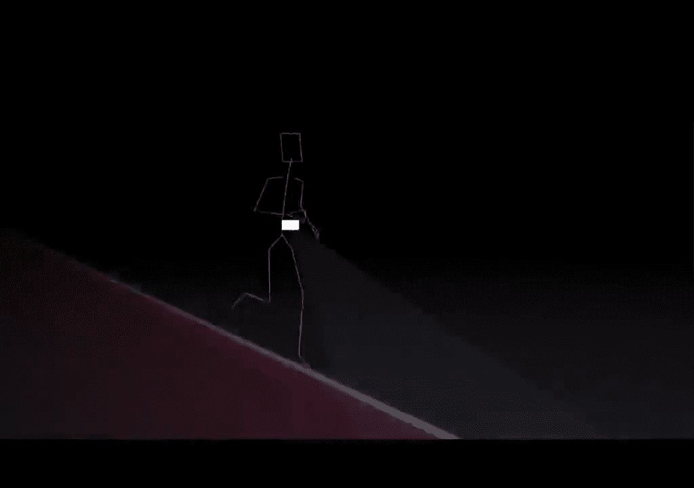

我们第一次外出时根据他们的位置来左右他们，我们什至不知道。

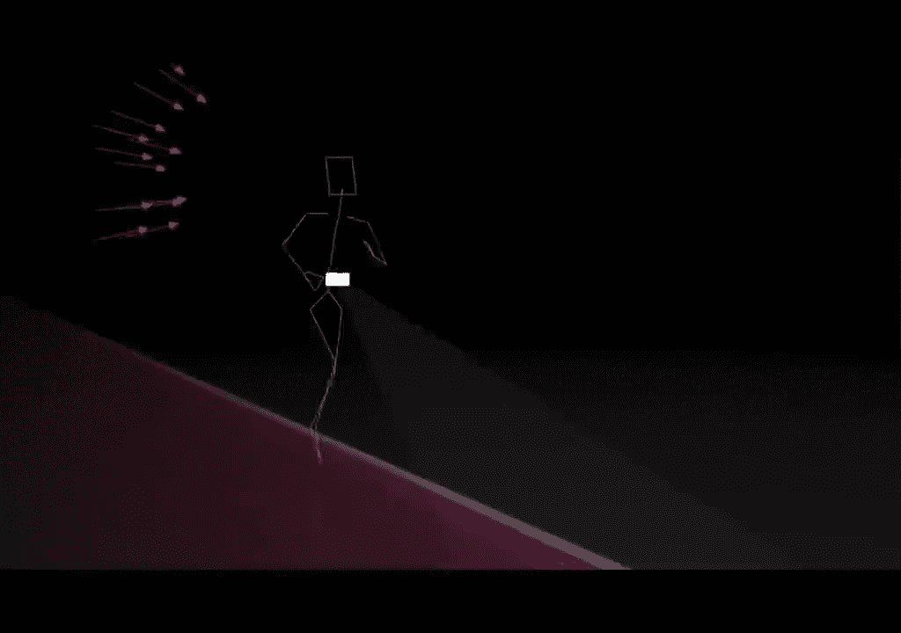

如果声音足以指导我，那么您就可以进行那种Beta测试，从人眼看，很明显认识到教导，机器学习模型要做到这一点并不是那么容易，因为您在跑步时向左和向右行走，因此，一旦您开始户外运动。

左右两侧的线就会像在摇晃一样。

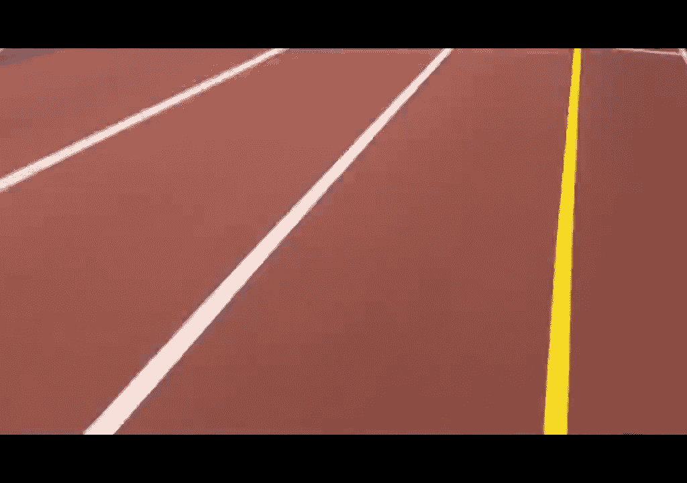

现在的光线多了很多树影飘落的落叶，还有地面上的线，可能非常狭窄，可能只有几个像素供计算机视觉模型识别，没有系绳，没有棍子，没有毛茸茸的狗，只是和自己在一起，啊，这是我几十年来第一次进行加载。

所以这些通常是我们人类视为理所当然的任务，但是对于计算机而言，看到深度学习是如何应用的，确实非常了不起，嗯，其中一些问题集中在真正做好事上，只是在这里帮助人们，视力障碍的人。

一个以前从未没有导盲犬奔跑过的人现在可以奔跑了，借助此计算机视觉系统等，独立地穿过小径，我说过，我们经常将这些任务视为理所当然，但因为每个有视力的人都很容易，让我们可以例行地做它们。

但实际上我们可以训练计算机按顺序地做它们，为此，尽管我们需要特别问自己一些非常基础的问题，源于我们如何构建可以用引号引起来的计算机，特别是a，通过计算机处理图像，到目前为止。

让我们以图像作为我们计算机站点的基本示例。

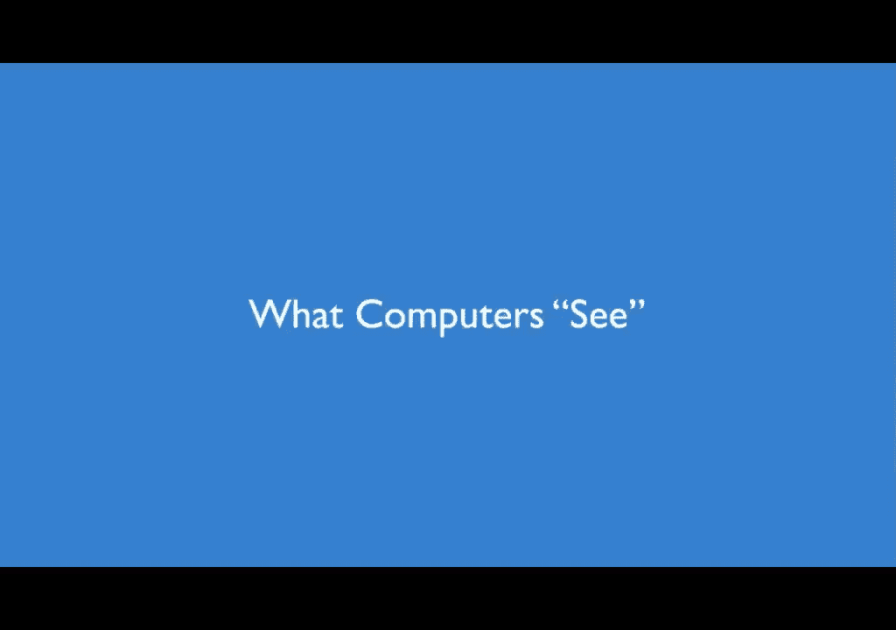

所以对于计算机图像来说，数字就是二维的，数字列表假设我们有一张图片，这是亚伯拉罕·林肯的，它只是由，这些数字中的每一个都可以用所谓的像素来表示，现在一个像素就是我在这里所说的一个数字，范围为零到一或。

在0到255之间，并且由于这是灰度图像，如果您，有一个彩色图像，您将用三个数字表示它，一个红色，一个绿色和一个蓝色通道rgb，现在计算机看到了什么，所以我们可以将该图像表示为这些图像的二维矩阵。

为图像中的每个像素编号一个数字，这就是计算机看到图像的方式，就像我说的，如果我们有一个rgb图像而不是一个灰度图像，我们可以代表这个，通过一个三维数组现在我们有三个二维数组堆叠在。

二维数组中的一个彼此对应的顶部对应于红色通道，绿色代表蓝色代表此rgb图像，现在我们有一种方法来代表，图像到计算机，我们可以开始考虑什么类型的计算机视觉算法，我们可以执行此操作。

因此有两种非常常见的学习任务类型。

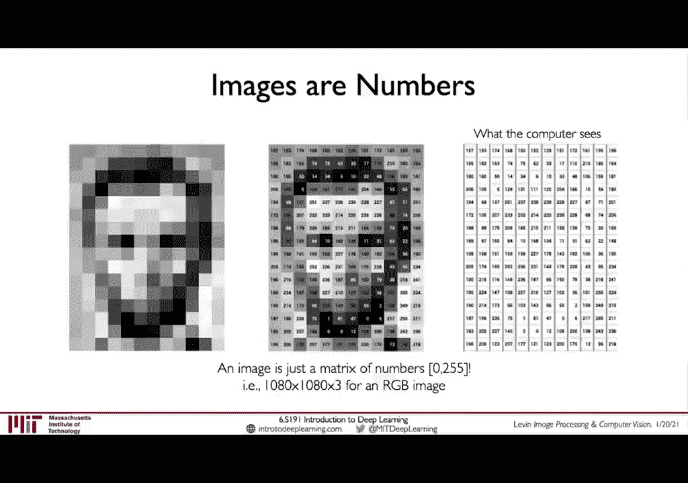

就像我们在第一和第二类中看到的那样，这是一个回归，而那些是，在回归任务中也进行分类任务，我们的输出采用连续值的形式，并且，在分类中只需要一个类标签，所以让我们首先考虑分类问题。

我们希望为每个图像预测一个标签，例如，假设我们有一个包含所有图像的数据库，我们的先例，我们想建立一个分类管道来告诉我们，该图像是哪个先例的，所以我们提供此图像，我们可以在左手看到，到我们模型的一边。

我们想输出该图像是其中任何一个的概率，该数据库所包含的特定先例，以便对这些图像进行正确分类，尽管我们的管道需要能够分辨出亚伯拉罕照片的真正独特之处，林肯与其他任何总统的照片，例如乔治·华盛顿。

杰斐逊或奥巴马。

我以另一种方式思考这些之间的差异，图像和图像分类管道在功能方面处于较高水平，确实是该特定类的特征，例如，这些特征是什么。

定义亚伯拉罕·林肯（Abraham Lincoln）现在的分类只需通过检测以下特征即可完成，给定图像，因此，如果图像中存在特定类别的特征，那么我们可以预测，非常有把握地确信该类发生的可能性很高。

所以如果我们，建立图像经典分类管道，我们的模型需要知道特征是什么，它们是什么，还有两个它需要能够检测出全新图像中的那些特征，因此，例如，如果我们要检测人脸，则可能需要识别某些特征，会是鼻子和眼睛。

而如果我们想检测汽车，我们可能会看着，图像中的某些特定内容，例如车轮牌照和前照灯，以及用于房屋和，门和窗以及台阶都是较大对象类别的特征的所有示例。

现在解决此问题的一种方法实际上是利用有关特定知识的知识。假设我们说的是人脸，因此，如果要检测人脸，可以手动定义，在图像中，我们认为这些功能是什么，并实际上使用了我们的结果，检测算法进行分类。

但这种方法实际上存在很大的问题。

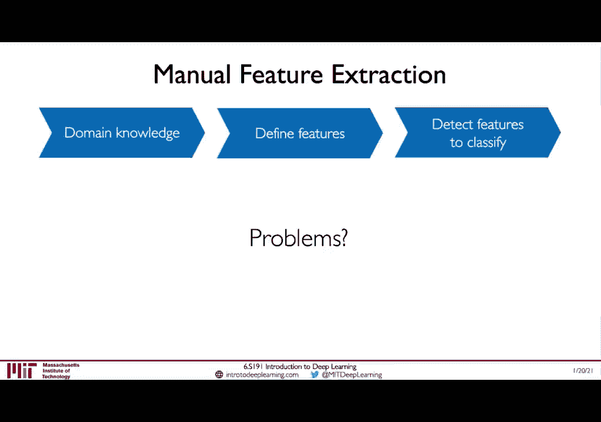

那就是图像只是亮度值数量的3d数组，每个，图像可能会有很多变化，其中包括场景中的遮挡物，照明条件和照明条件也可能会有所不同，甚至考虑同一类图像内的类内变化变化，我们的分类。

我们正在构建的管道实际上必须对所有这些类型都是不变的，的变化，但仍然需要敏感地挑选出不同的，类间的差异，因此能够区分该类独有的功能，与班级中存在的功能或该功能的变体相比，现在即使可以使用我们的管道。

也可以使用人类定义的功能，那就是如果一个人要知道这个有关的东西而陷入这个问题，他们可以先验地定义问题或手动提取并分解问题，他们想为这项特定任务检测什么功能，即使我们可以做到。

由于图像数据场景的不可思议的可变性，通常这些图像的检测，在实践中，功能仍然是一个极具挑战性的问题，因为您的检测算法需要，对所有这些不同的变体都是不变的，所以实际上不是手动，定义这些。

我们如何才能做得更好，而我们真正想要做的就是能够提取特征，并自动以分层方式检测它们在图像中的存在，这应该提醒，当我们谈到层次结构是深度学习的核心组成部分时，您将回到第一堂课。

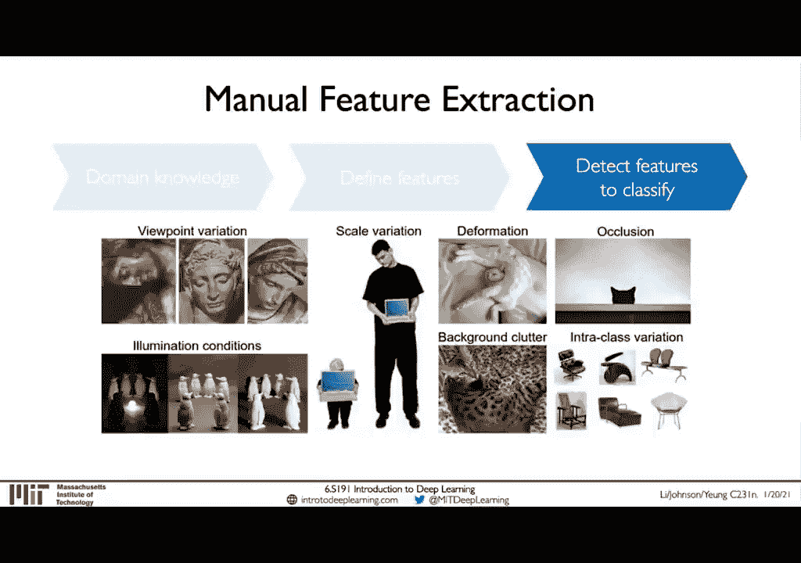

我们可以使用基于神经网络的方法直接从中学习这些视觉特征，数据并学习特征层次结构以构建图像表示，内部网络，因此再次像我们在第一堂课中看到的那样，我们可以检测到这些底层的。

功能并将它们组合在一起以构建这些中级功能，然后，在后面的层中，这些更高级别的功能可以真正执行您感兴趣的任务。

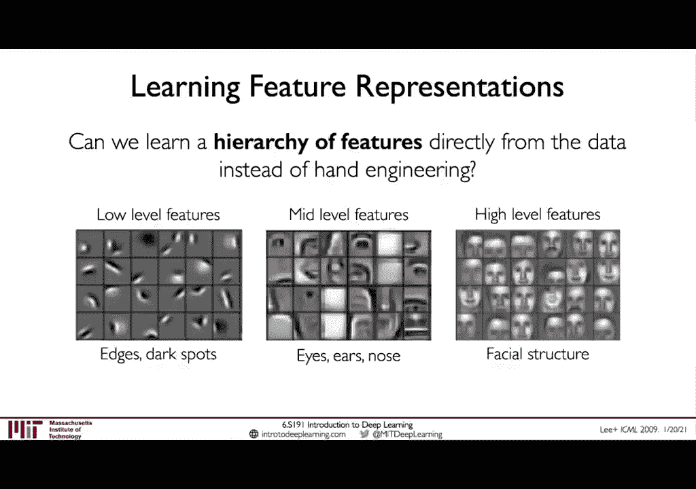

因此神经网络将使我们能够从数据中学习视觉特征的这些层次结构，如果我们，巧妙地构建它们，因此这将需要我们使用一些不同于现有结构的体系结构，在课程中到目前为止所看到的，即从第一讲到前馈的架构，密集层。

在第二讲课中是递归层，用于处理本讲课的顺序数据，将专注于另一种类型的方式，我们可以提取专门针对。

视觉领域，所以让我们回顾一下在第一堂课中学到的知识，这些完全连接的神经网络也称为密集神经网络，您可以在其中拥有多个，彼此重叠的隐藏层，每个隐藏层中的每个神经元都连接到，现在。

我们说上一层中的每个神经元都想使用一个完全连接的网络，执行图像分类，我们将尝试激励使用某种东西，首先从我们已经知道的知识开始，比这更好，我们将看到此方法的局限性，所以在这种情况下。

请记住我们的输入是这个二维图像，它是一个向量，二维向量，但是如果您将其堆叠，则可以将其折叠为一维向量，所有这些尺寸都在像素值彼此重叠的基础上，我们要做的是。

将像素值的矢量输入到与下一层中所有神经元相连的隐藏层，现在在这里，您应该已经欣赏了一些东西，那就是我们所有的空间信息，该图像中的“ had”会自动消失，这是因为自从我们将其展平以来，将二维图像变成一维。

我们现在基本上已经删除了任何空间信息，我们之前在下一层工作过，现在我们的网络必须重新学习所有这些内容，重要的空间信息，例如一个像素靠近其相邻像素，这在我们的输入中非常重要。

但是在完全连接的层中立即丢失了，所以问题是我们如何才能在模型中建立一些结构，以便能够，实际为学习过程提供信息，并为模型提供一些先验信息并提供帮助，它学习了非常复杂且庞大的输入图像，因此。

让我们保持其代表性。

我们图像的二维图像是一个像素值的二维数组，我们不，现在将其折叠成一维，这是我们可以使用空间结构的一种方式，实际是连接我们输入的补丁而不是整个输入，而只是连接输入的补丁，隐藏层中有两个神经元。

因此在从输入层到，隐藏层，但现在我们只将单个补丁中的内容连接到，现在在说下一层中的下一个神经元，实际上就是说每个神经元只会看到，在此输出神经元处，该神经元只会看到来自先前补丁的值。

它不仅会减少模型中权重的数量，而且还将使我们，利用以下事实：在图像中，空间上接近的像素可能有点相关，并且，彼此相关，这是一个事实，我们应该真正考虑到这一点，所以请注意。

仅有输入层的一小部分会影响此输出神经元，这就是，因为我们要保留这种空间关联的想法，并将其作为该体系结构的一部分。

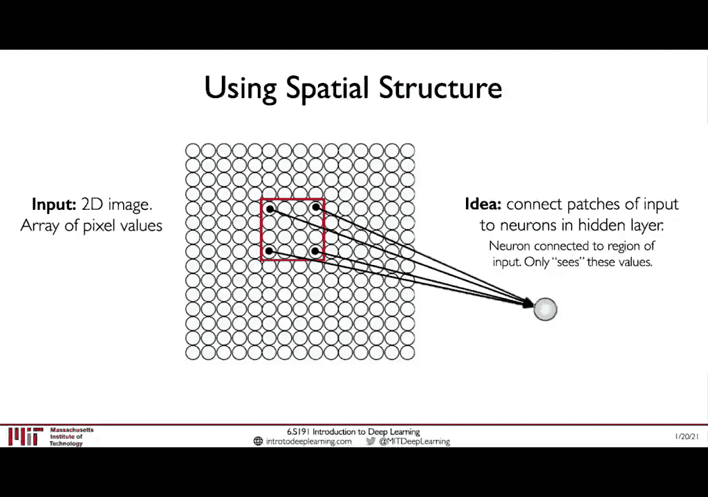

所以现在要定义整个输入中的连接，我们可以应用相同的连接原理，在我们的输入层中将其修补到后续层中的单个神经元，我们基本上可以做到这一点，通过在输入图像上滑动该补丁，每次滑动它，我们将获得一个，现在。

通过这种方式，我们可以在随后的层中添加新的输出神经元，实际上，我说的是我们输入中固有的空间结构，但请记住，我们的最终任务，不仅要保留空间结构，还要实际学习视觉特征，我们。

通过加权斑块和神经元之间的连接来做到这一点，这样我们就可以检测到，特定功能，以便每个补丁都将尝试执行该功能的检测，所以现在我们问自己：我们如何评价这个补丁，以便我们可以很好地检测到这些功能。

在实践中，有一个称为卷积的运算，我们首先考虑一下，在较高的水平上，假设我们有一个4x4的补丁或一个包含16个权重的滤镜，我们将对输入中的四个补丁应用相同的过滤器，并使用其结果。

定义下一层神经元状态的操作，因此下一层中的神经元，通过使用带有滤波器的补丁来定义单个神经元的输出，具有相等的大小和学习的权重，然后我们将移动该补丁，比方说，在这种情况下，我们有两个像素。

我们可以抓取下一个色块，从而，现在计算下一个输出神经元，这就是我们如何在非常高的水平上考虑卷积的方法。

但您可能想知道这里的卷积运算符实际上如何使我们能够，提取功能，我想通过一个非常简单的示例来使它变得非常具体。

因此，假设我们要在一组字母的黑白图像中对字母x进行分类，黑色等于负一，白色等于正一，现在进行分类显然不可能简单地将两个图像与两个矩阵进行比较，彼此说是平等的，因为我们也想对此x进行分类。

不管它是否有一些轻微的变形，如果它移动了，或者它是否扩大了旋转，或变形，我们需要构建一个对所有这些变化都比较稳健的分类器，所以我们该怎么做呢？我们想要检测定义x的特征，所以我们想要。

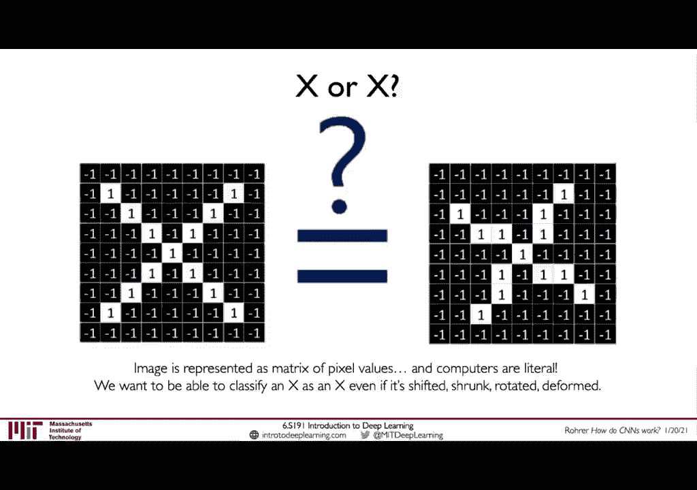

我们的模型基本上是将一个x片段的图像与实际，它应该寻找的重要部分正是我们所称的功能，如果我们的模型可以找到那些重要的特征，那些在同一位置定义x的粗糙特征，位置大致相同的位置，则可以更好地理解相似性。

即使存在这些类型的畸变，x的不同示例之间。

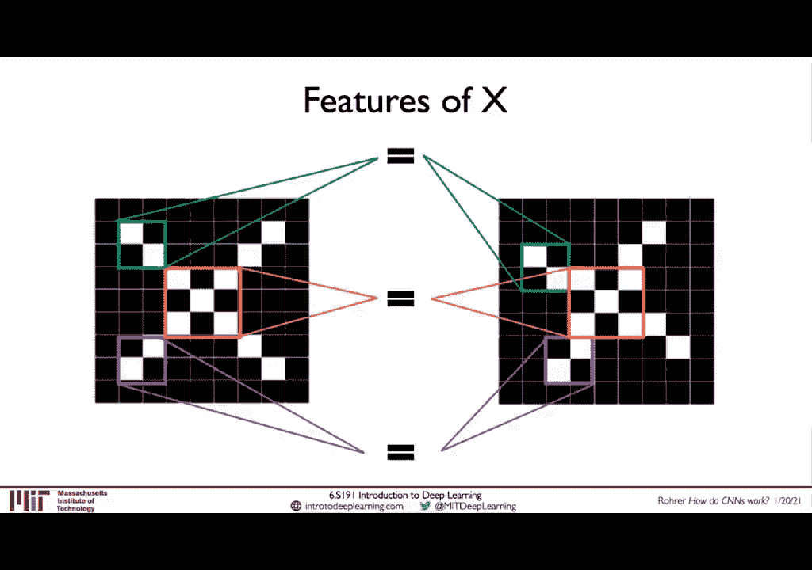

因此，我们假设每个功能都像一个微型图像，它是一个补丁，它也是一个很小的图像。排列一个小的二维值数组，我们将使用这些过滤器选择特征，在x的情况下，x的共同点，例如我们可能想要的过滤器。

注意可能代表诸如边缘上的对角线以及交叉的东西，您可以在此处的第二个补丁中看到的要点，因此我们可能希望捕获这些功能，在x的手臂和中心，以检测所有这些不同的变化，因此请注意，这些较小的过滤器矩阵如我们在。

这些最上面的行代表权重过滤器，我们将在其中使用权重过滤器，卷积运算以检测输入图像中的相应特征，因此，我们需要定义的实际上就是该卷积运算的实际方式。

看起来像以及如何在这些情况下利用这些功能（在这种情况下为三个），过滤器，以便如何检测给定的过滤器发生此过滤器的位置或此功能的位置，发生在这张图片中，而这正是卷积运算的意义所在。

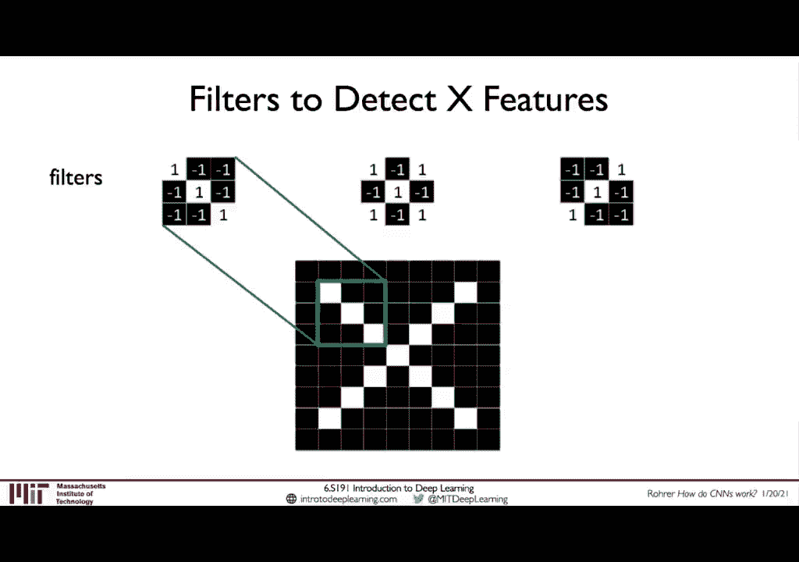

关于卷积的全部思想是保留之间的空间关系，现在，通过学习图像数据的小块小块中的图像特征来获得像素，在滤波器矩阵和输入图像的色块之间执行逐元素乘法，尺寸相同，因此，如果我们有一个3x3的补丁，我们将其与。

输入过滤器或我们的过滤器，该过滤器的大小也为3x3，并具有获悉的权重，您可以在左上角看到的过滤器的所有条目都是正数或正数，或负数，当我们将此滤镜乘以相应的绿色输入图像块时，我们逐个元素相乘。

我们实际上可以看到结果，在这个矩阵中，将所有正数乘以正数，我们将得到一个正数，将负数乘以负数也将得到正数，因此所有，我们的逐元素乘法将是所有矩阵的三乘三矩阵，现在是下一个，作为卷积运算的一部分。

步骤是将所有这些按元素乘法相加，在一起，所以我们在添加这些输出后的结果将是9。所以这意味着什么。

实际上，在我们开始之前，让我开始，另一个非常简短的示例假设我们现在要计算卷积而不是，非常大的图像，但这只是5 x 5的图像，我们这里的过滤器是3 x 3，因此。

我们可以将这三乘三滤镜滑动到整个输入图像上，然后执行，逐元素乘法，然后添加输出，让我们看一下它是什么样子。

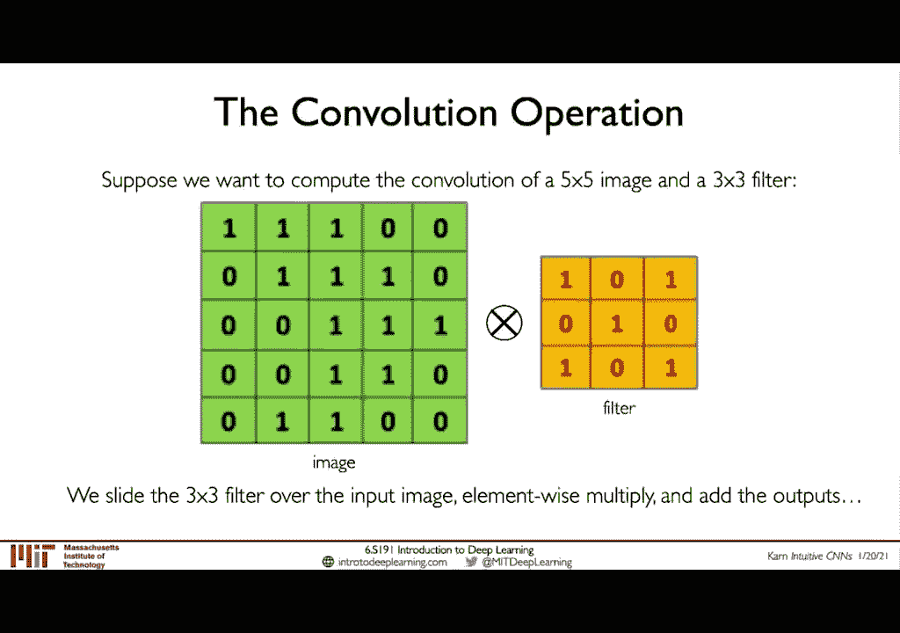

让我们首先在输入的左上角滑动此过滤器，我们可以明智地，将此过滤器的此补丁程序的条目与此补丁程序相乘，然后将它们加在一起，并，对于此部分，此三乘三滤镜放置在此图像的左上角，逐元素相加。

我们得到的神经元输出结果为4，然后我们可以将此滤镜一个接一个地滑动到下一个补丁，然后重复结果，现在第二个条目中的对应于已应用到此过滤器的激活，在这种情况下，图像的这一部分是三个。

我们可以在整个过程中继续进行此操作。

图片，直到我们完全填满此激活或功能图以及此功能为止，map确实告诉我们此过滤器激活了输入图像中的哪个位置，例如，我们看到此模式在原始输入图像中传达，该图像就是该特征图所要到达的位置，具有最高价值。

这就是我们现在已经需要最大程度地激活的地方，通过卷积运算的机制，让我们看看如何使用不同的过滤器。

用来生成特征图，所以给女人的女人画照片，给女人的照片画照片，面对这个女人的名字叫lena，使用这三个卷积滤波器的输出，可以在每张图片的右下角看到我们正在考虑的三个滤镜，通过简单地改变这些过滤器的权重。

这里的每个过滤器都有不同的权重，学会检测图像中非常不同的特征，因此我们可以学会锐化图像，通过应用这种非常特定类型的锐化滤镜，我们可以学习检测边缘。

或者我们可以通过修改这些滤镜来学会检测图像中非常强的边缘，所以这些过滤器不是学习过的过滤器，而是构造的过滤器，历史上有关开发手动工程这些滤波器的研究，但是什么是卷积。

神经网络学会要做的实际上是学习定义这些过滤器的权重，因此，网络将了解不需要检测图像中的哪些功能，边缘检测或强边缘检测，还是需要检测某些类型的边缘曲线，某些类型的几何对象等需要什么特征。

从这张图片中提取出来，并通过学习卷积滤波器，可以做到这一点。

所以我希望现在您能真正体会到卷积如何使我们能够利用，非常重要的空间结构，并使用权重集来提取非常局部的特征，图像，只需使用不同的权重集和，现在使用不同的过滤器这些保留空间结构和局部特征提取的概念。

使用卷积运算实际上是卷积神经网络的核心，用于计算机视觉任务，这就是我现在想深入了解的内容。

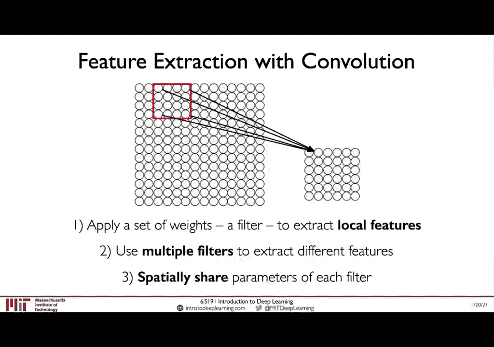

我们已经掌握了运算的数学基础，我们可以开始考虑如何利用这个操作这个卷积操作，实际构建用于计算机视觉任务的神经网络，并将整个过程与此相关联，这些网络现在已经在前几讲中介绍了学习的范式。

恰当地将其适当地命名为卷积神经网络，首先我们来看一下，在专为图像分类任务设计的cnn或卷积神经网络上。

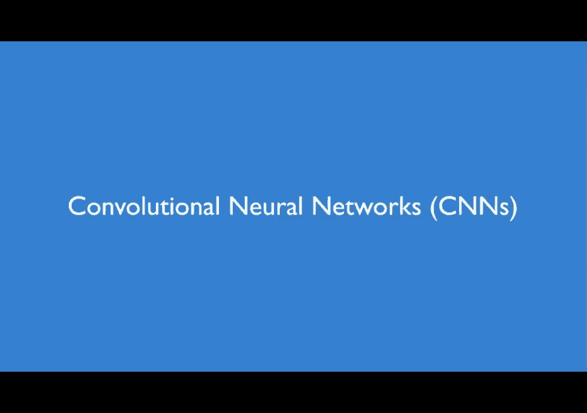

那么如何使用cnns进行分类，让我们考虑一个为目标而设计的简单cnn，直接从图像数据中学习特征，我们可以使用这些学习的特征，要将它们映射到这些图像的分类任务中，现在有三个主要组成部分。

和CNN核心的操作是第一部分，我们已经对此有所了解，在本讲座的第一部分中，这是卷积运算，它允许，就像我们之前看到的那样，我们可以生成这些特征图并检测图像中的特征，第二部分是应用非线性。

我们看到了非线性的重要性，在第一和第二讲中，以帮助我们处理我们提取的这些功能，高度非线性第三，我们需要应用某种池化操作，这是，降采样操作的另一个词，这使我们可以缩小，现在每个特征图都计算一类分数。

这是我们在定义时要执行的操作，使用我们获得的这些功能实际上执行了图像分类任务，通过卷积非线性和合并，然后将那些学习到的特征传递给，完全连接的网络或密集层，例如我们在课程的第一部分中了解到的，第一堂课。

我们可以从图像输入到班级预测输出端到端地训练该模型，使用完全连接的层和卷积层端到端，这是我们学习的一部分，卷积层每个卷积层的过滤器权重集，作为定义这些完全连接的层的权重，这些层实际上执行了我们的分类。

最后完成任务，我们将详细介绍这些操作中的每一项，以真正，分解这些卷积神经网络的基础知识和体系结构。

所以首先我们要考虑cnn的卷积运算，就像每个神经元一样，在隐藏层中，将计算其每个输入的加权总和，就像我们在，密集层，我们还需要添加一个偏差以允许我们移动激活函数，并应用一些非线性来激活它。

这样我们就可以处理非线性数据，现在，这里的真正特别之处在于保留了每个本地连接，您可以在中间看到的隐藏层中的神经元只能看到其特定区域，输入它没有看到完整的输入神经元，就像它是完全连接的一样，层。

但在这种情况下没有，每个神经元输出仅观察到非常局部连接的斑块，输入，我们对这些补丁进行加权求和，我们计算出加权和，并应用偏差，然后，应用并使用非线性激活函数激活它，这就是，在卷积层结束时剩下的要素地图。

现在我们可以定义此实际，更具体地讲，使用数学方程式进行运算我们这里剩下一个4x4的滤波器矩阵，对于隐藏层中的每个神经元，其输入是来自，上一层，我们在这种情况下应用了这套权重wi j，就像我说的是四乘四。

过滤器，我们对w中的每个元素乘以，输入x中的对应元素，我们加上了偏差，并以此非线性方式激活了它，记住我们的逐元素乘法和加法就是卷积，我们之前讨论过的运算，所以如果您查找卷积含义的定义，实际上。

它实际上是元素方式的乘法，然后是所有，结果，这实际上也定义了卷积层如何与这些思想联系起来。

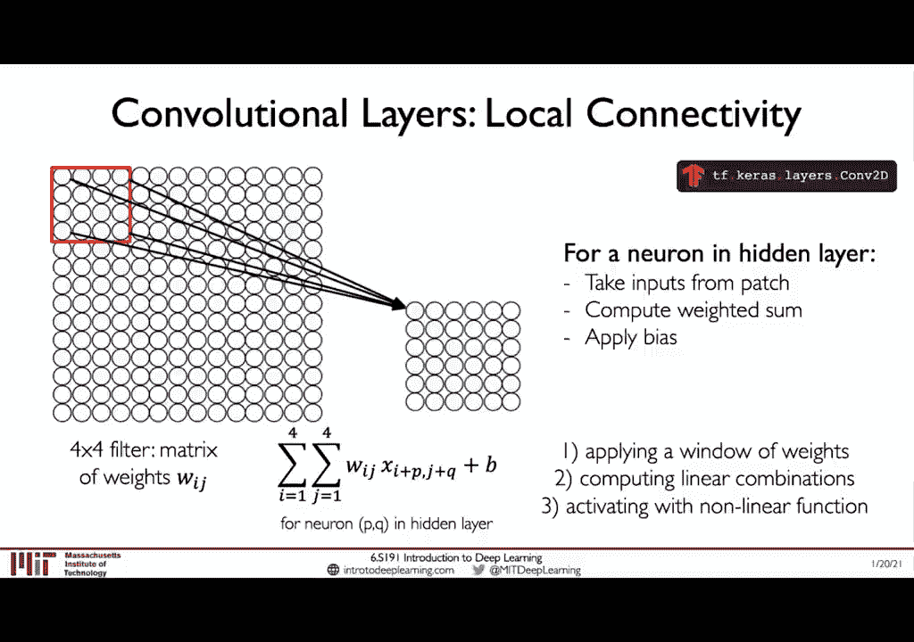

但是通过这个单一的卷积层，我们可以如何拥有多个过滤器。

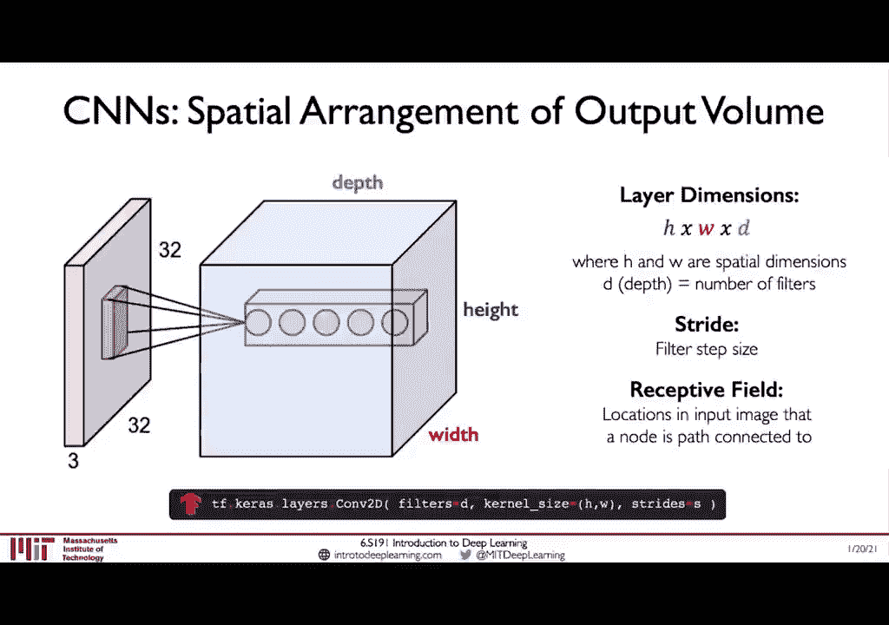

我们在上一张幻灯片中看到的是如何获取此输入图像并学习单个特征图，但实际上，我们的图像中有很多类型的特征，我们如何使用卷积层。

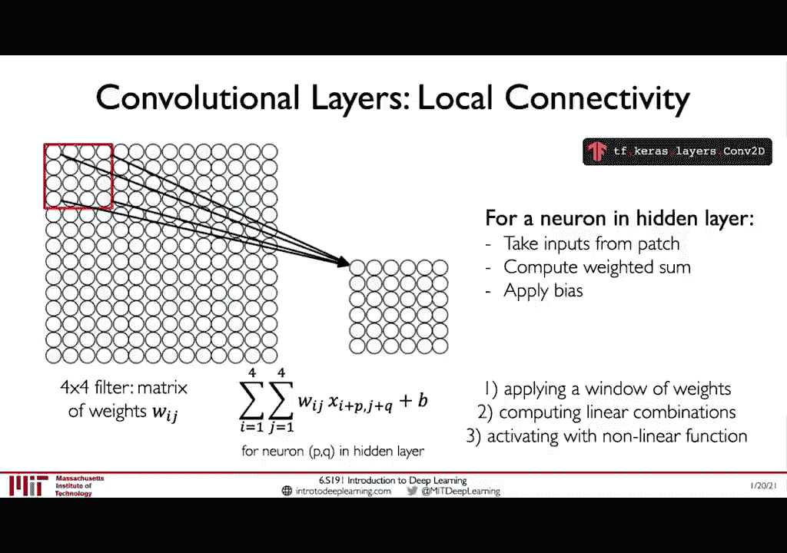

学习堆栈或许多不同类型的功能可能对执行有用，我们的任务类型，现在我们如何才能使用它来进行多特征提取，仍然是卷积，但现在具有体积尺寸，高度和宽度分别为，空间尺寸取决于输入层的尺寸，过滤器的尺寸，跨度。

步幅，每次应用过滤器时都会跳过，但我们还需要考虑一下，这些层中神经元之间的联系，即所谓的感受野，他们的输入在模型路径中在模型中的位置，它们连接到现在，这些参数实际上定义了神经元的空间排列。

在卷积层中连接，以及如何真正定义这些连接，以便输出，在这种情况下，一个卷积层的大小将具有此体积尺寸，而不是一个，我们沿着图像滑动的滤镜地图，每个滤镜都会有一定数量的滤镜，将要在图像上滑动。

并逐个计算此卷积运算，过滤每个卷积运算的结果，定义特征图，即该卷积，该过滤器将最大程度地激活，因此现在我们可以真正定义cnn是什么了。

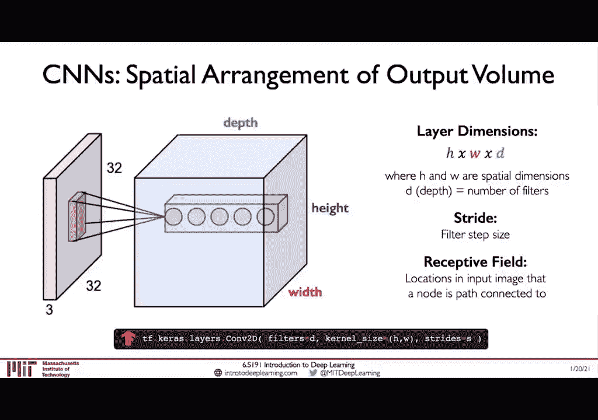

下一步实际上是在每次卷积运算之后应用该非线性，实际上需要将此非线性激活函数应用于该层的输出量，并且，就像我在第一讲中所说的，这非常相似，第二讲中我们也看到了，之所以这样做，是因为图像数据是高度非线性的。

这是图像域中的常见示例，将使用relu的激活函数，该函数是经过整流的线性单位，在像素方向上，将所有负值都替换为零并保持所有正值不变的操作，他们的价值是我们可以将其真正视为阈值运算，因此任何小于零的值。

阈值设为零负值表示对卷积的负检测，但这，非线性实际上是某种程度上的钳位，这是一个非线性运算，因此，作为我们神经网络模型的一部分，它确实满足了我们学习非线性动力学的能力。

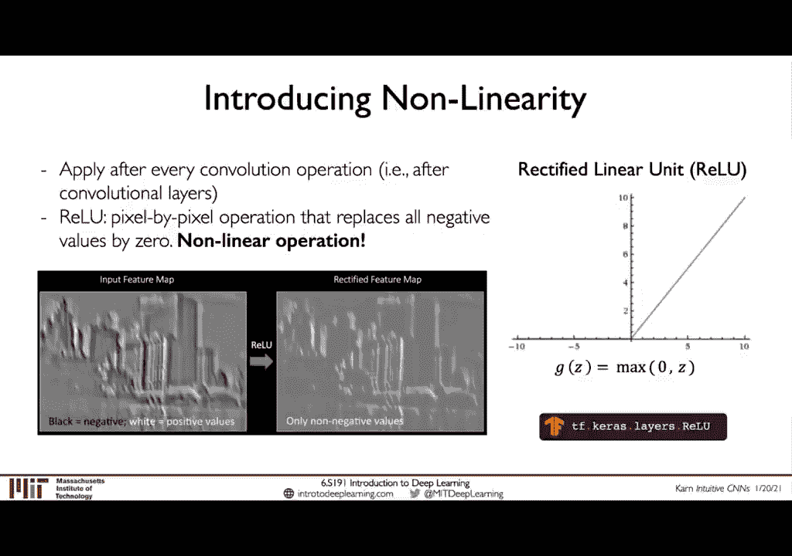

所以卷积神经网络的下一个操作是池化操作，池化是一种通常用于减少输入和维数的维数的操作。我们的特征图在仍然保留空间不变性的情况下，现在已成为一种通用技术和通用，在实践中通常使用的池类型称为最大池。

如本示例所示，max pooling实际上是超级简单和直观的，呃，只是将这两个中的最大值，通过补丁中的两个过滤器并在输入上滑动该补丁，这与卷积非常相似，但是现在，我们不再只是应用按元素的乘法和求和。

而是，将占用该补丁的最大值，因此在这种情况下，当我们将两个乘以两个补丁，滤镜并在整个图像上以2的倍数跨过该补丁，我们实际上可以将最大值，输入中的两个像素乘以两个像素，然后传播并激活到下一个神经元，现在。

我鼓励大家真正考虑我们可以执行的其他一些方式，这种类型的池化，同时仍要确保我们对采样进行下采样并保留空间不变性，在那个补丁上使用最大值是一个想法，一种非常常见的替代方法是，也取平均值称为均值池。

取平均值即可，表示执行池化操作的一种非常平滑的方法，因为您不只是，最大值，可能会受到异常值的影响，但是您正在对它求平均，或者也可以得到一个，使输出层更平滑，但它们都有优点和缺点。

所以这是卷积运算的三个运算的三个关键运算，神经网络，我想现在我们已经准备好将所有这些真正整合在一起，开始使用cnns端到端构建我们的第一个卷积神经网络，再次提醒您。

我们可以在整个过程中对这些操作进行分层，是我们要学习图像数据中存在的特征的这种层次结构，从将它们组合在一起的低级功能开始，到中级功能，然后，再次使用可用于完成任务的高级功能，现在为图像构建了一个cnn。

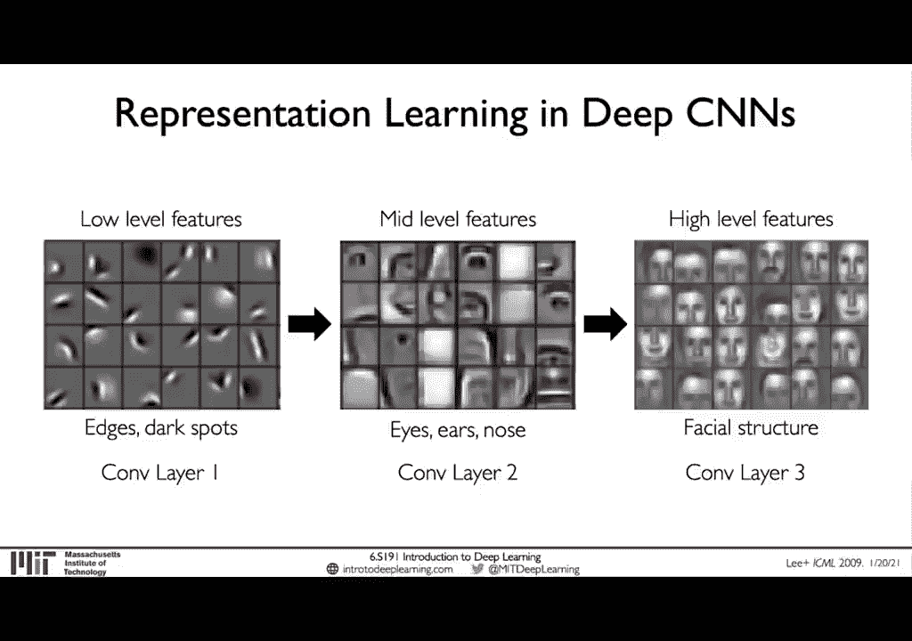

分类可以分为两部分，首先是特征学习部分，尝试学习输入图像中可用于执行特定任务的功能，该功能学习部分实际上是通过到目前为止我们已经看到的那些部分完成的，在本讲座中，卷积非线性和池化以保持空间不变性。

现在第二部分卷积层和池提供输出，这些输出对不起，第一部分是输入的高级功能，第二部分实际上是在使用，这些功能来执行分类或在这种情况下执行的任务是什么，任务是输出输入图像中存在的类概率。

因此我们将这些概率提供给，将特征输出到完全连接或密集的神经网络中以执行分类，现在可以做到这一点，我们不介意失去空间不变性，因为我们已经失望了，如此采样我们的图像，以至于它甚至不再是图像，实际上更接近于。

数字向量，我们可以直接将密集神经网络应用于该数字向量，现在它的维数也要低得多，我们可以使用，称为softmax的函数，其输出实际上表示分类概率分布，它的总和等于一，所以确实使它成为正确的分类分布。

它是其中的每个元素都严格在零和一之间，所以它们都是正数，并且确实是和，如果您的任务是图像分类，那么它非常适合第二部分。

所以现在让我们将所有这些放在一起端到端卷积神经网络看起来像什么，我们首先定义特征提取头，该头以32的卷积层开始，功能映射了3x3像素的滤镜大小，我们使用最大池化操作对其进行了下采样，池大小为2。

步幅为2。这与我们看到的结果完全相同，首先介绍了卷积运算，接下来我们将这32个特征图馈入下一个，卷积卷积和池化层的集合，现在我们从32个特征中增加，映射到64个要素地图，结果仍然缩小了图像的比例。

因此我们缩小了图像的比例，但是我们正在增加我们正在检测的功能的数量，这使我们能够，实际上在这个维空间中扩展自己，同时对空间信息进行下采样，现在，我们已经通过以下方法完成了特征提取。

现在终于有了不相关的空间信息，在这种情况下，只有两个卷积层我们可以将所有这些信息压平为一个，向量并将其馈送到我们的密集层中，并预测最后的10个输出，并请注意此处。

我们使用softmax的激活函数来确保这些输出是分类的。

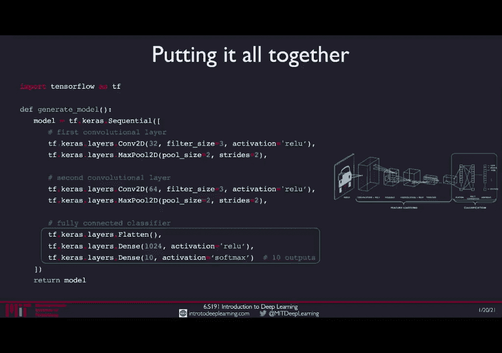

分布还不错，到目前为止，我们已经讨论了如何使用cnns进行图像分类，任务这种架构实际上是如此强大，因为它可以扩展到许多不同的任务。

不只是图像分类，其原因是您可以真正使用此功能，提取此功能的学习部分，您可以将第二部分放到第二部分，终端网络，无论您想使用什么网络，都可以将第一部分真正地看作是，功能学习部分。

第二部分作为您的任务学习部分，现在该任务是什么，完全取决于您和您的需求，这就是使这些网络真正产生的原因，非常强大，例如，我们可能要看一下不同的图像分类域。

我们可以针对诸如图像和对象之类的特定事物引入新的架构，检测语义分割，甚至可以使用图像标题之类的东西，这是我们在第二堂课中看到的一些顺序网络的输入。

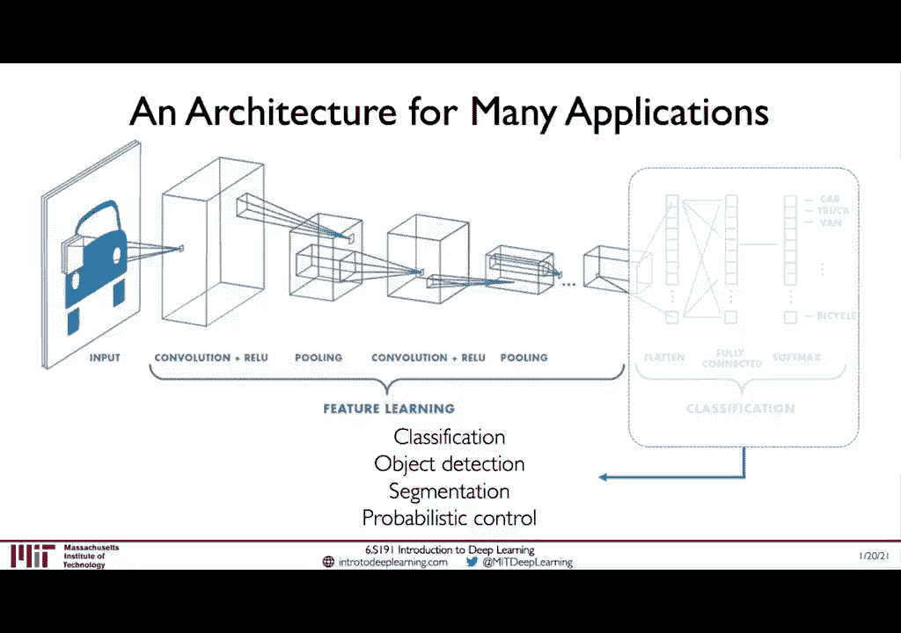

因此，让我们看一下并更深入地研究这些不同类型的任务中的每一个，例如，在分类的情况下，我们可以使用卷积神经网络，实际上，深度学习模型在医学和医疗保健领域会产生重大影响。

现在被用于分析医学图像扫描的全部输入，在自然界中发表的论文，实际上证明了cnn可以胜过专家，放射科医生直接从乳房X射线照片中检测乳腺癌，而不是给出二进制。

预测什么是癌症输出或不是癌症输出，或例如在什么类型的对象中，我们可能会说这个图像是出租车的图像，我们可能想让我们的神经网络，做一些更精细的分辨率，并告诉我们这张图片，您可以预测哪些物体，是。

实际上是绘制了一个边界框来定位此图像或将该对象定位在我们的图像中，这是一个非常困难的问题，因为我们的场景中可能有很多物体，并且它们可能是，彼此部分重叠等重叠，所以我们不仅要定位对象。

我们还希望对该对象执行分类，因此实际上比简单地困难，分类任务，因为我们仍然必须进行分类，但是我们还必须检测。

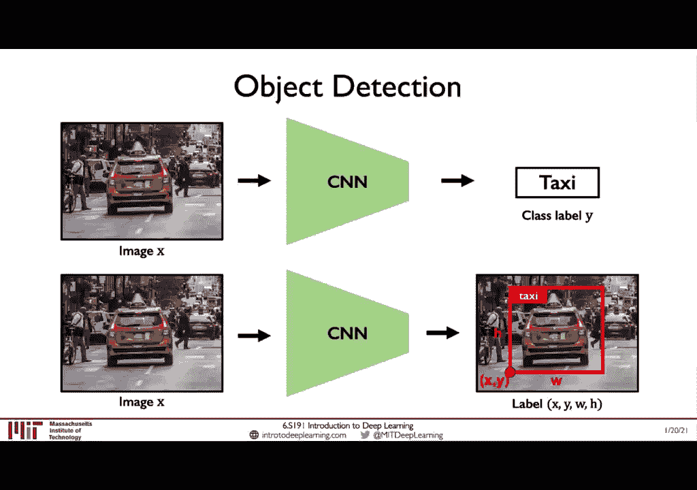

所有这些对象除了对每个对象进行分类之外，现在我们的网络还需要灵活，实际并且能够推断出，现在，如果我们有一个仅包含一个场景的场景，则该场景中的对象数量是一个动态的，一辆出租车。

它应该只在那辆出租车上输出一个边界框，边界框应告诉，我们将其中一个角的xy位置以及该边界框的高度和宽度设置为，如果我们的场景包含许多不同类型，则可以很好地定义边界框。

甚至可能具有不同类型类别的对象的数量，我们希望我们的网络能够输出，还有许多不同的输出，甚至可以灵活应对我们输入中的这种类型的差异，一个单一的网络，因此我们的网络不应只输出一个输出，或一定数量的输出。

它需要有一个灵活的范围来动态地推断出。

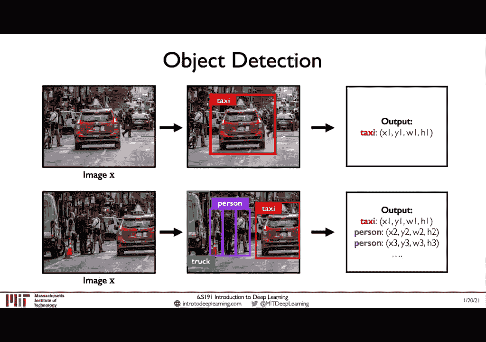

场景中的物体，所以解决这个非常复杂的问题的一种可能是幼稚的解决方案，以及如何使用cnns来做到这一点，所以我们可以做的就是从这张图片开始，让我们考虑一下，解决此问题的最简单方法是。

我们可以先放置一个随机盒，在此图像上的图像中，它有一些随机的位置，也有一个随机的大小，我们可以把那个盒子装进我们的普通图像分类网络，例如，我们在讲座的前面看到这只是拍摄一张图片，或者现在，子图像。

但它仍然是单个图像，它通过我们的网络进行馈送，现在该网络是，负责预测什么是该图像的类别，而不是进行对象检测，并且它预测，如果此框没有类，则它具有某个类，那么它就可以忽略它，然后重复此过程。

然后在场景中选择另一个框，然后将其传递给，网络来预测其类别，我们可以继续使用场景中的不同盒子来做到这一点，并保持，这样做，随着时间的推移，我们基本上可以对所有这些盒子进行许多不同的类预测。

因为它们在某种意义上是通过我们的分类网络传递的，如果这些框中的每个，我们是一个预测类，我们可以选择其中有一个类的框并将其用作框，如果找不到对象，则在哪里找到对象，我们可以简单地将其丢弃。

然后移至下一个框，因此，这口井的问题是，有太多的输入，这基本上，结果出现在盒子里，并考虑了许多盒子，它们的缩放比例也太多了，许多位置，尺寸太多，我们不可能在所有这些维度上迭代图像。

和并将其作为幼稚的溶质并将其作为我们的对象检测问题的解决方案。

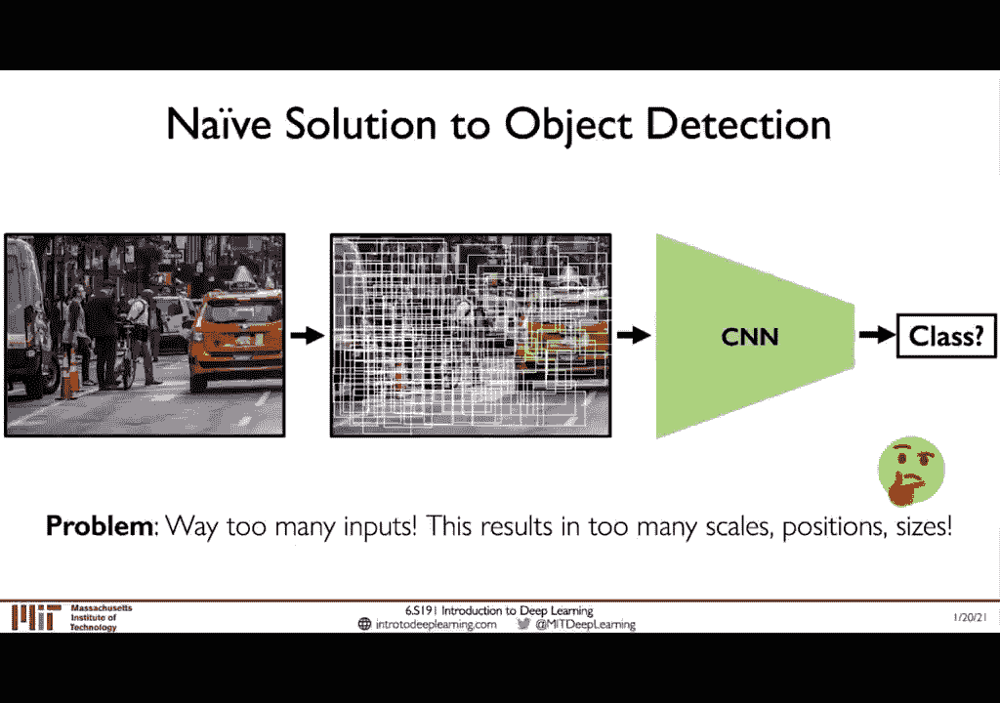

因此我们需要做得更好，而不是选择随机的框或遍历所有，我们在图像中的方框中使用简单的启发式方法来识别图像中的某些位置，可能包含有意义的对象，并使用这些对象来馈送我们的模型，但是即使通过这种区域提案的提取。

商店的其余部分仍然是准确的，同样，我们提取提案区域，并通过网络的其余部分提供给我们，然后将其扭曲到，是正确的大小，然后如果没有任何内容，则将其输入到分类网络中，框，如果存在，我们将其丢弃，然后保留它。

并说该框实际上包含此图像，但这仍然有两个非常重要的问题，我们必须考虑的一个问题是，超级超级慢我们必须将每个区域独立地馈送到模型，所以如果我们提取，在这种情况下，我们有2000个区域，我们必须在这里供餐。

我们必须运行该网络2 000次，仅针对单个图像获得答案，它也往往非常脆弱，因为在实践中，我们如何很好地完成这一地区提案？完全是基于启发式的，而不是，通过神经网络学习，它甚至更重要，也许它是。

从特征提取部分分离出来，所以我们的特征提取是学习一件，但是我们的区域提议网络或该体系结构的部分是完全分离的，因此。

该模型无法学习预测可能特定于给定任务的区域，现在，对于某些应用来说，它变得非常脆弱。实际解决并解决其中一些问题，并将其向前推进以实现目标，检测，但我想非常快速地进行操作，只是将您指向该方向。

对于那些感兴趣的人，这是实际学习这些区域的更快的rcnn方法，提出这里的想法，而不是将这张图片提供给基于启发式的反馈，或者，区域提案网络或方法，我们可以让我们的网络中的一部分经过培训以识别。

我们的图像模型的提案区域，使我们可以直接理解或，在我们的原始图像中识别出这些区域，在这些区域中我们应该探索候选斑块，为了我们的分类和我们的物体检测，现在这些区域中的每一个都是。

作为神经网络和个人的一部分，使用自己的特征提取器进行处理，或者，在他们的cnn头中，然后为每个提案提取这些特征后，我们可以，这些单个区域中每个区域的正常分类与以前非常相似，但是现在这样做的巨大优势在于。

只需要对模型进行一次正向传递，我们只有在拥有提取区域的区域建议网络后才提供此图像，并且所有这些区域都被馈送以对图像的其余部分进行分类，因此，与以前的方法相比，它超级快，因此在分类中，我们可以预测一个类。

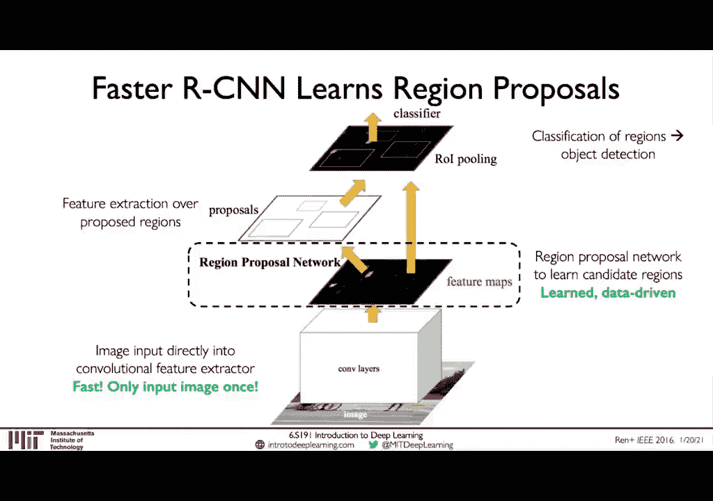

对于物体检测中模型的整个图像，我们预测了所有物体的边界框，为了定位它们并识别它们，我们可以做得比这更远，在这个想法中，我们仍然使用cnns进行预测，也可以预测此输出，但不是，预测相当粗糙的边界框。

我们可以让我们的网络在这里也进行预测，整个图像，现在的一个例子是语义分割，其中输入是rgb，图像只是正常的rgb图像，而输出将是像素级的，每个像素的概率是它属于给定类别的概率。

所以在这里您可以看到一个例子，这个例子是在草地上的一些两头牛，馈入神经网络，而神经网络实际上预示着崭新的形象，但是现在这个图像不是rgb图像，而是语义分割图像，它有可能，对于每个单个像素。

它都在进行分类问题，并且正在学习对每个单个像素进行分类，像素取决于它认为是什么类，在这里我们实际上可以看到母牛像素的情况，与草像素和天空像素分开进行分类，此输出实际上是。

使用上采样操作而非下采样操作创建的，而是使用上采样创建的，以允许，卷积解码器实际上增加了其空间尺寸，因为这些层是模拟的，您可以说一下我们在讲座前学到的普通卷积层，它们也已经在tensorflow中实现。

因此将它们放到模型中非常容易，并允许您的模型学习如何实际预测其他图像，或者代替。

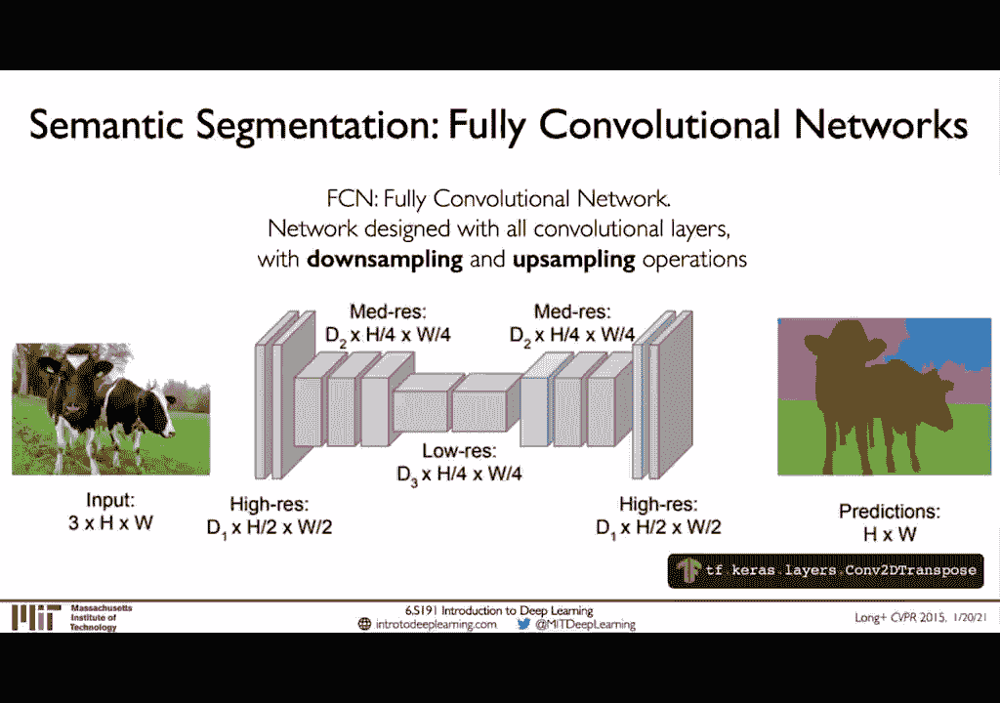

单类概率，这种语义分割思想非常强大，因为它也可以应用于医疗保健中的许多不同应用，尤其适用于在医学扫描中分割例如癌变区域或，甚至可以识别出血液中感染了疟疾等疾病的部分。

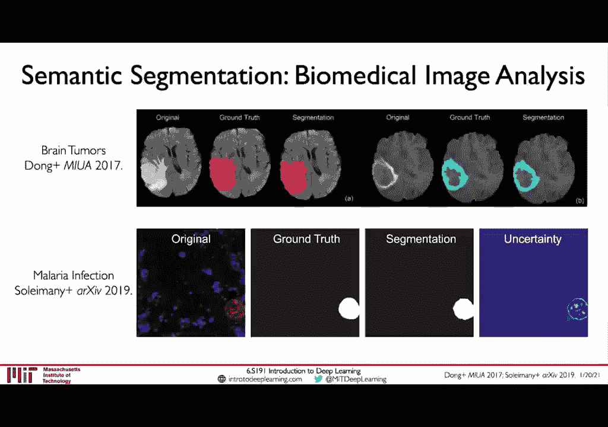

让我们在这里看到一个最后的示例，说明如何使用卷积特征提取来执行，另一个任务，该任务与我们在分类中看到的前三个任务不同，对象检测和语义分割现在我们将考虑连续的任务，用于自动驾驶汽车的机器人控制。

并直接从原始视觉数据导航，具体来说，该模型将作为输入，如您在左上角看到的那样，车辆的原始感知，例如来自汽车上的摄像头，还会看到嘈杂的街景地图表示，您可能会看到，您的智能手机上的Google地图中的示例。

它的任务是不预测分类。

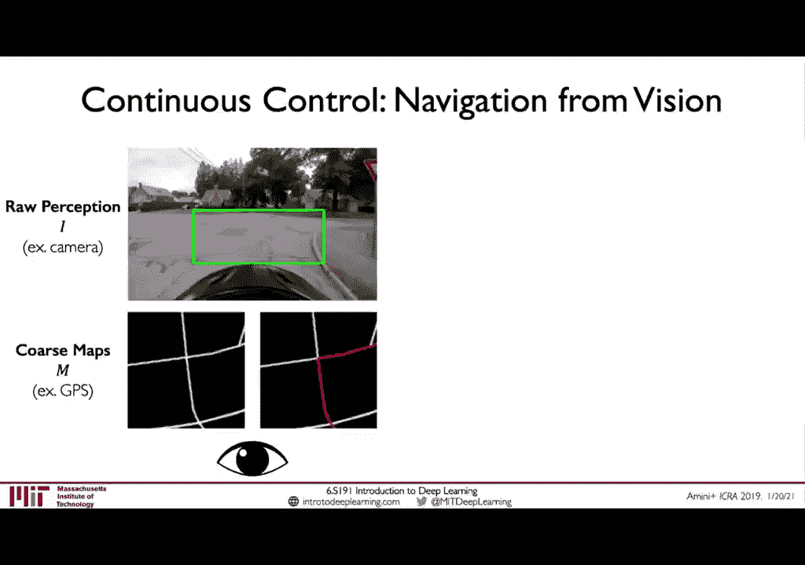

问题或物体检测，而是了解整个空间的完整概率分布，在给定情况下该车辆可能采取的所有可能的控制命令。

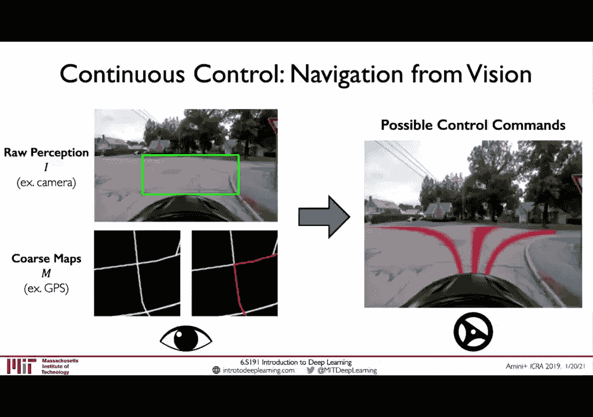

现在它是如何做到的，实际上整个模型实际上是在使用我们学到的所有知识，在今天的讲座中，可以通过将这些照相机中的每一个通过它们的末端来进行培训。专用的卷积特征提取器，然后基本上提取所有这些特征。

然后将它们串联在一起，将它们压平，然后将它们串联成一个特征，提取向量，所以一旦我们具有提取的所有特征的完整表示，从我们所有的相机和地图中，我们实际上可以使用此表示来预测，在确定控制的基础上。

将全部控制参数提供给目标的所需目的地，车辆，这种概率控制功能非常强大，因为在这里我们实际上正在学习，只是优化在任何给定时间车辆应该转向的位置上的概率分布，您实际上可以在地图上看到该概率分布的可视化。

并对其进行了简单的优化，负对数似然是此分布的负对数似然，是一个正态分布的正态混合，这几乎与您在，以及在该域中的分类，您尝试使交叉熵损失最小化，这也是对数似然优化或概率函数的负数，因此请记住。

这是由卷积层组成的，以实际执行此操作，特征提取这些与我们今天在本讲座中了解到的完全相同，以及这些平坦化的池层和串联层，以真正生成此单个，输入的表示形式和特征向量，最后在这种情况下可以预测这些输出。

该车辆应持续控制的表示形式，因此功能非常强大。

因为人类实际上可以输入所需的目的地，而端到端的cnn，输出控制命令以使车辆朝着该目的地致动，此处注意，车辆能够在接近交叉路口时成功识别并采取正确的措施，控制命令以在这些全新环境中实际导航该车辆。

在训练数据集中从未见过且从未驾驶过的东西，cnns的影响已经远远超出了这些例子，我今天在这里解释了它已经涉及到计算机视觉中的许多不同领域，特别是，我很想今天结束本讲课，看一下我们介绍的内容，今天。

我们真的涵盖了大量材料，我们涵盖了计算机视觉的基础，图像是如何，表示为亮度值的数组，以及如何使用卷积以及它们如何工作，我们看到我们可以将这些卷积构建为定义卷积的基本体系结构，神经网络。

并讨论了如何使用cnns进行分类，最后，我们讨论了如何使用这些基本功能的许多扩展和应用程序，卷积神经网络架构作为特征提取模块，然后使用它，来执行您的任务，以及有关如何实际可视化行为的一些信息。

我们的神经网络，并通过幕后了解了它在做什么，这些语义分割图的一些方法，并获得了更细粒度的视角，这些输入图像的超高分辨率分类，因此，我想结束本讲课，并指出每个人都指向下一个实验室。

今天即将到来这将是一个专门研究计算机视觉的实验室，您将非常熟悉我们今天讨论的许多算法，首先建立您的第一个卷积神经网络，然后建立这个，一些面部检测系统，并学习如何使用无监督的生成模型，例如。

将在下一个讲座中看到，以确保这些计算机视觉可以确保面部，分类算法是公平且公正的，因此请继续关注下一课。

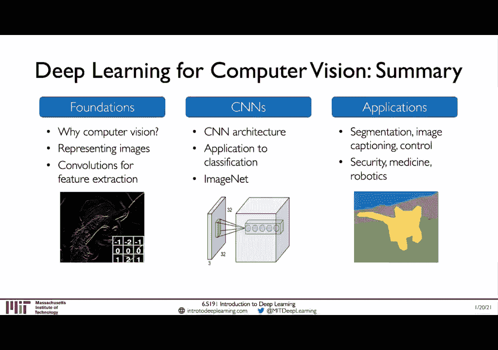