# P5：Reinforcement Learning - 爱可可-爱生活 - BV1jo4y1d7R6

(音樂)，大家好，歡迎回到Success 191，今天是個非常刺激的一天，因為我們要學習如何結合，我們近期的進步，和我們近期的進步，在深入學習中的進步，如何結合這兩個領域，來建立一些非常奇妙的應用。

以及能夠超人性的表現。

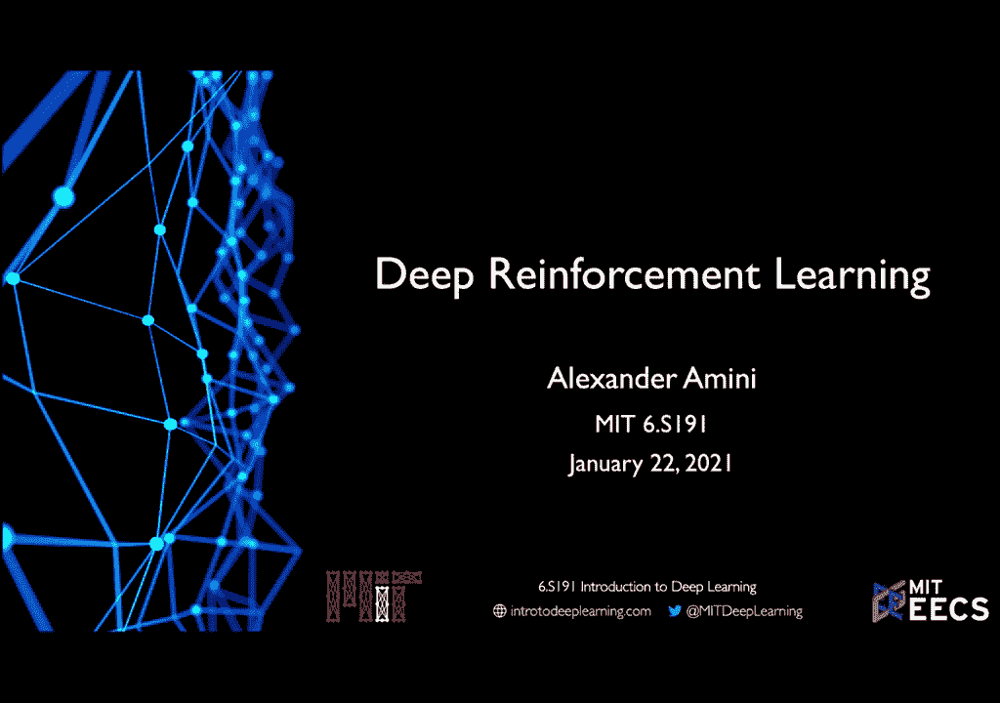

我覺得這個領域非常神奇，因為它離開了我們近期的，這個學習的原則，我們近期的深入學習，我們所看到的，已經被困在修正數據，我們可以收集或在網上獲得，在強化學習中，深入學習是放置在某個環境中，能夠探索和互動。

在那環境中，能夠學習如何達成目標，通常都是沒有人性監督或指導，這使得它非常強大，也非常靈活。

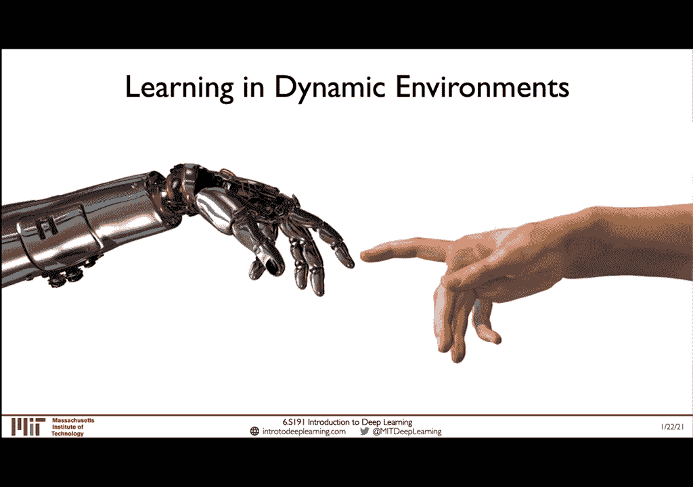

這對於機械人類，自動駕駛車，和機械人類操作，有著明顯的影響，但它也讓遊戲玩意，和策略計劃發展得非常革新，這就是真實世界和深入學習，即是實際世界之間的連結，這讓我非常興奮，我希望我接下來要展示的影片。

也能夠展示出這一點，我希望我接下來要展示出這一點，星際大戰有完美的資訊，而且可以在現實中遊玩，它還需要長期計劃，以及能夠選擇，從萬萬個可能性中取得什麼行動，我希望5-0不輸掉任何一場比賽。

但我認為最真實的目標，是4-1，他看起來比TLO更有自信，TLO之前還挺緊張的，這次房間更繁忙，他真的不知道要期待什麼，他已經在玩星際大戰，大概是五年了，我並沒有預期AI會這麼好，他做的一切都很正確。

計算過後都做得很好，我認為我在學習一些東西，這比我想像中的好，我會覺得自己是個好玩家，但我每次都輸掉了五場比賽，(掌聲)，(鈴聲)，好的，這就是TLO的例子，是如何在人類上競爭，專業的遊戲玩家。

並不是只在他們身上競爭，而是能夠達到，不得不說的超人性表現，打敗這位專業的星際大戰玩家，五場比賽，我們先從一步步走回來，看看如何在其他學習問題中，能夠達到強化學習，我們在這課程中，所見到的各種學習問題。

我們在這課程中，所探索到的最初和最具體的，學習問題，就是在學習問題中，能夠超越專業的學習，我們在第一，第二，第三堂課中，談到的這些問題，我們在這領域中，基本上是被給予了一堆數據，我們嘗試了解一條網絡。

以預測它的標籤，Y，目的就是從X到Y，從X到Y，我喜歡用很主觀的方式，來形容，如果我給你，例如說我給你一張蘋果的圖片，我想訓練一條網絡，以確定這東西是蘋果，好，我們在上一堂課中，學到的下一個類型的。

系統是不超過學習，在這情況下，我們只能夠，給予數據，沒有標籤，例如說一堆蘋果圖片，我們被迫要學習一條網絡，或是學習一種模式，代表了這一個，在數據系統的構造下的東西，所以在蘋果的情況下。

我們嘗試了解一種模式，如果我們把這兩張蘋果圖片，給我們看起來，這兩個模式，基本上是相同的，我們不知道它們是蘋果，因為我們沒有給予任何標籤，可以明顯地告訴模式，這東西是蘋果，但我們可以告訴它。

這東西也很接近，這東西，它也看到了，我們可以選擇這兩個，相同的構造來辨識，最後一部分，在RL，在強化學習中，這是今天課程，要專注的地方，我們只能夠給予數據，我們稱之為，"數位行動對比"。

數位是系統的觀察，行動是系統的行為，或是系統的行為，當它看到這些狀況時，RL的目標，與超級學習，和超級學習不同，RL的目標，是要達到，系統在這個環境中，在許多時間過程中，獲得的獎勵，再回到蘋果的例子。

對比的情況，系統應該學會，它應該吃這個東西，因為它知道，它會保持你活著，會讓你健康，你需要食物來生存，再次說，就像不超過的情況，它不知道，這個東西是蘋果，它甚至不認識，它是什麼，它只知道，在過去。

它應該吃過，然後能夠長久地生存，因為它是一塊食物，它能夠，變得健康，例如，通過這些系統的行動對比，和一些試驗和錯誤，它能夠學到這些代表，和學習這些計劃，所以今天我們要專注的，是關於第三類的學習問題。

和強化學習，所以要做到這一點，我覺得非常重要，在我們開始探索細節，和技術細節的時候，我覺得我們需要建立一些，關鍵的語言，這是非常重要的，在強化學習中，而且這會非常重要，讓我們在後面的課程中。

能夠了解到這些點，這是課程中非常重要的一部分，所以我希望我們可以，慢慢地走到這部分，讓我們在課程的最後，能夠做到最多的理解，我們開始從中心，從中心，從中心開始，來看強化學習的核心，那就是你的代表。

代表是一個，能夠在環境中做出行動的東西，它可以像是飛機，在世界上做出運輸，就像是Mario在遊戲中旋轉，強化學習中的手段，是你的代表，你可以說在現實生活中，代表是你每一個人，好嗎，下一個部分是環境。

環境只是代表，代表在生活中的世界，代表在生活中的存在，在生活中的行動，在生活中的行動，這就是兩者之間的連結，代表可以在環境中，做出行動的東西，A(t)，是在時間t，這個環境中，代表的行動，我們可以將A。

定義為行動空間，這是一個，所有的行動，一個代表可以做到的，我想說這個，雖然我覺得，有點自我解釋，行動是，或是，一個行動的列表，所有的行動，一個代表可以做到的，在環境中可以是隱密的，或是從一個行動的列表。

在這個情況下我們可以看到行動是，前進、右、後、或是，或是持續的行動，例如，環境的位置，例如是行動的數字位置，例如GPS的位置，這個代表想要去哪裡，它可以是隱密的，或是一個類似的，可能性列表，或是持續的。

在這兩種情況下，觀察，是環境，與代表的交互，代表可以觀察，環境的位置，以及它的行動，影響環境的狀態，這讓我非常喜歡，這一點，狀態其實是，一個具體的、即時的情況，當代表，找到自己的時候，例如，狀態可以是。

像是一個視覺的影像，這是你觀察的世界狀態，當你觀察它的時候，獎勵，現在也是一個，從環境的，回饋給代表，環境可以提供，回饋，來測試，代表的成功或失敗，例如，在一個遊戲中，當瑪利歐碰到一張硬幣。

代表獲得獎勵，從一個狀態下，代表會傳出，回饋，給環境，環境會回應，代表的新狀態，它能夠達到的，這會影響，該狀態，和獎勵，被收集或被扣，現在，很重要的一點，獎勵可以是，即時或延遲，基本上，你應該。

以獎勵來評估，代表的行為，但你可能不會得到獎勵，直到很晚，例如，你可能會，做很多不同的行為，然後獲得獎勵，很長一段時間，這叫做延遲獎勵，但它還是獎勵，我們也可以看看，總獎勵，這是所有獎勵的總數。

一個代表會，收集或取得，在某個時間，R(i)是獎勵在時間，R(t)，是回饋，總獎勵，從時間T，到未來，到時空無限，這可以寫出來，我們可以寫出，總數，從R(t)，到未來，所以它是將所有獎勵，加起來。

從現在到未來，然而，很常會，不僅是，總獎勵，總獎勵，而是，我們稱為償還獎勵，償還獎勵，償還獎勵，代表，Gamma，是將未來獎勵，被發現的獎勵，加起來，將償還獎勵的影響，影響到獎勵的選擇。

為什麼我們要做這個，這個方案，是由設計，來製造的，將未來獎勵，的償還獎勵，來製造，償還獎勵，的影響，我們可以，在這個方案中，將償還獎勵，加起來，將，償還獎勵，加起來，將，償還獎勵，加起來，將，償還獎勵。

加起來，償還獎勵，將，未來獎勵，被發現的獎勵，加起來，將，未來獎勵，加起來。

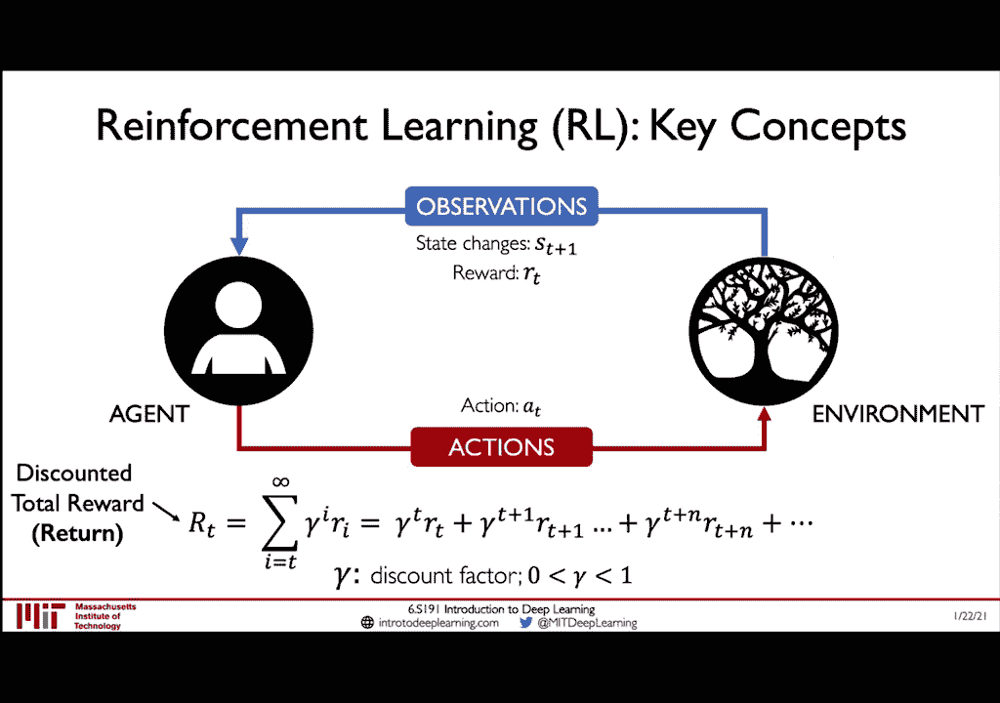

將，未來獎勵，加起來，將，將很多這些元素，加起來，這叫做Q形式，現在我們來看看，這個Q形式的定義，記住，這個償還獎勵的，總數R(t)，記住，總數R(t)，是獎勵的償還數，從，T的時間而來，現在Q形式。

是非常相似的，Q形式是一個，償還獎勵的，現時的狀態，以及當中的，狀態的行動，然後它回報，當中的，獎勵，所以，假設，當中的狀態，當中的狀態，當中的，回報，當中的，假設，我給你，這個魔法Q形式。

這其實是一個魔法功能，因為它告訴我們很多，問題的事實，如果我給你這個功能，一個Oracle，你可以連接任何狀態和行動的對比，它就會告訴你，從你的現時時間點T回報的期望，我給你這個功能，問題是。

你能否決定，你現在的狀態，最好的行動是什麼，你可以在這個功能上，進行任何的檢查，你可以這樣做，就是，你最終，想要選擇，最好的行動，但最好的行動是什麼，就是最好的回報，最高期望的回報，所以你只需要。

選擇一個最好回報的，最好的回報，那這個回報的期望，可以簡單地寫成，找到你的Q形式的ArgMax，對應所有可能的行動，在這個狀態下，簡單來說，如果我給你這個Q形式，在這個狀態下，你可以將你的狀態。

連接每一個行動，然後評估Q形式會告訴你，期望的回報，在這個狀態下，你選擇最高的Q形式，這是最好的行動，在這個狀態下，你可以建立一個政策，我們稱之為Pi(s)，來定義最好的行動，現在想像你的政策。

是一個新的功能，它會帶給你一個狀態，告訴你該做的行動，在這個狀態下，所以這個策略，給你一個Q形式來計算，你的政策，是從這個ArgMax的形式。

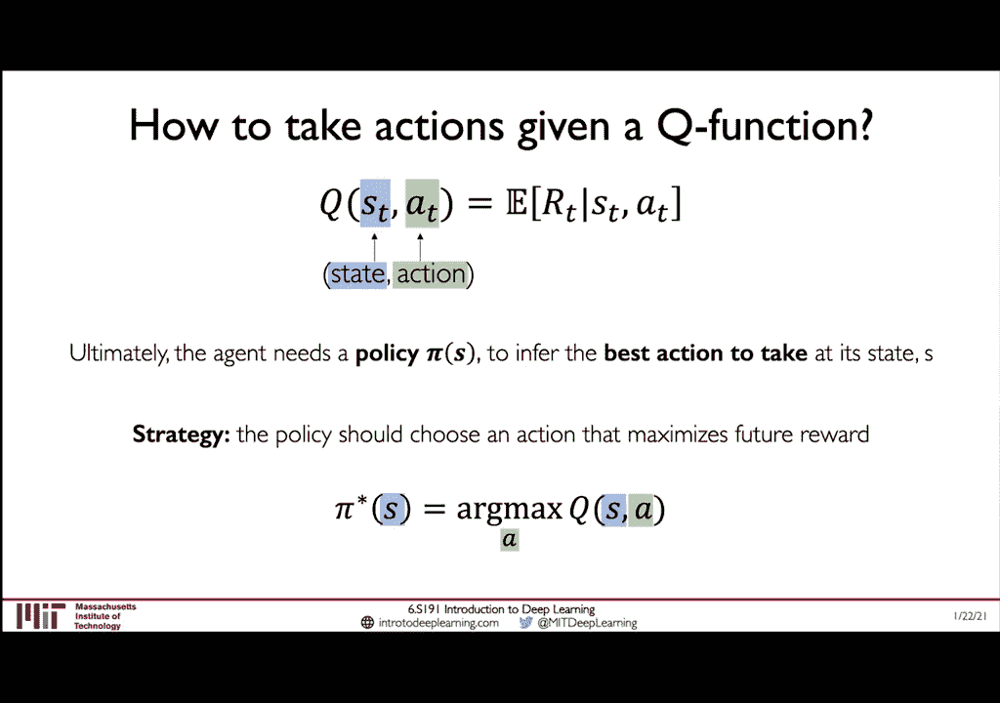

來定義你的Q形式，在這個課程中，我們將專注於，這兩個類型的，強化學習方法，分成兩個類型，其中一個會嘗試，學習這個Q形式，Q(s)，你的狀態和行動，另一個會叫做，政策學習方法，因為他們嘗試直接學習政策。

而不是用Q形式來定義政策，我們將在政策學習中，直接定義你的政策，Pi(s)，來定義該做的行動，這是一個更直接的思考方式，但首先我們將專注於，價值學習問題，以及我們可以做的Q學習。

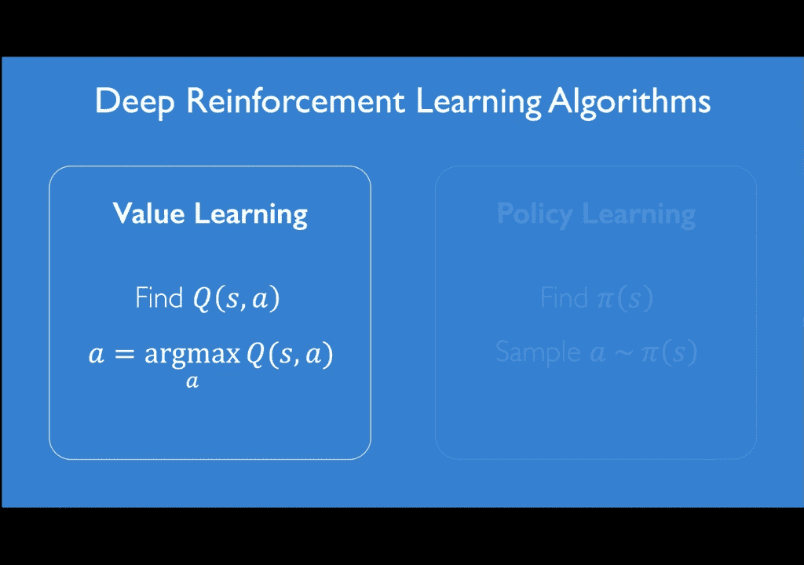

然後我們會在之後，來建立政策學習，我們先來深入研究，這個Q形式，首先我會介紹這個遊戲，在左邊是Atari Breakout，如果大家還沒看過，我會介紹一下這個遊戲的運作，這個Q值告訴我們。

我們可以預期的，回報率，在任何一個狀態，這是一個例子，在這個遊戲中，你的代理人，是這個桿子，它可以移動左或右，它有兩個動作，它也可以一直在同一個位置，所以它有三個動作，在同一個環境中，還有一個球。

它在桿子的下方，它將會擊中，然後從桿子上跳，目標，這個遊戲的目標，是移動桿子，然後擊中桿子，在最好的時間，你可以把它跳出去，擊中和破壞所有顏色的牆，每當桿子，碰到一個顏色的牆，你必須把它破壞。

因此遊戲的名字叫做破壞，目標是，擊中這些顏色，每當桿子碰到一個顏色，它就消失了。

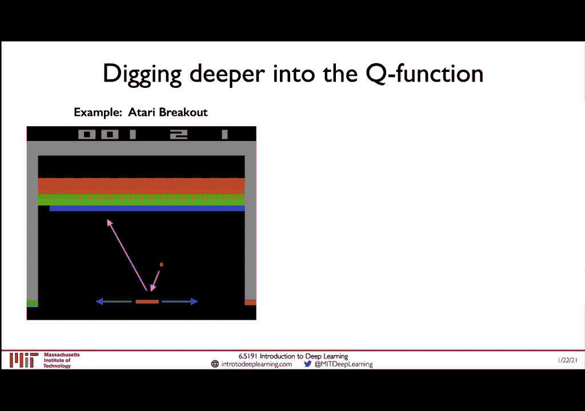

你必須一直移動，擊中桿子，Q值告訴我們，我們可以預期的回報率，在任何一個狀態，在任何一個狀態，我想要說的一點，其實有時候，我們需要用心去理解，或是用理解的方式，來猜測，一個狀態的Q值，如果我給你。

兩個狀態的對比，A和B，我會問你，哪一個對比，你覺得有更高的Q值，A的對比，我們可以看到，桿子已經在移動，桿子已經在移動，我們可以看到桿子在移動，桿子已經在移動，所以擊中了，我會問你，哪兩個對比。

你覺得會回報，最高的回報率，回報率，在我給你答案之前，我想告訴你，這兩個對比的政策，在遊戲中的樣子，而不是在看一個對比。

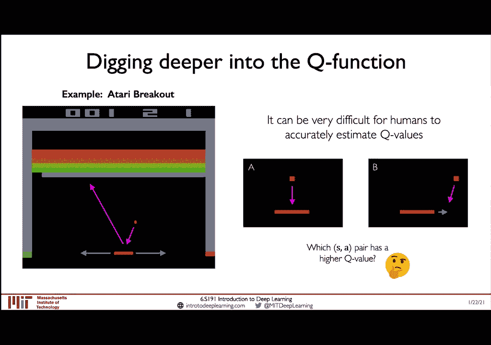

我們先來看看A的對比，A的對比是，一個比較保守的選項，它不會移動當桿子，移動向著它，我們可以看到，當它在遊戲中，它開始擊中，很多對比的部分，向著遊戲中心，它其實做得很好，它擊中了很多，顏色的對比。

但我們來看看，B的對比，B的對比其實有一點很有趣，它喜歡在桿子的角落，擊中桿子，它做這個，讓桿子可以在極端角度，在桿子的角落，擊中顏色，現在，它其實會做到極端，因為，即使桿子正朝著它，它也會移動。

讓它能夠在極端角度，擊中桿子，我們來看看，B的對比，當它在遊戲中，我們可以看到，它在擊中桿子的對比，擊中了很多顏色的對比，為什麼呢？因為當它擊中了桿子的角落，它能夠擊中很多對比，因為它能夠，在極端角度。

擊中它，當它在極端角度，它不需要擔心，因為它正在累積很多獎勵，這是一個很好的學習方式，因為它能夠，擊中遊戲，比A更快，而且也更少努力，所以回答問題，哪個對比的桿子，有更高的Q值，這就是B的對比。

但這對我來說，是一個相對不太理想的選擇，因為我預期，當桿子正朝著你，它會做出更好的行動，但這個對比，它學會了離桿子遠一點，讓它能夠回擊，並且在極端角度，擊中它，這是一個非常有趣的觀察，這對比學習。

但問題是，因為Q值很難定義，人類很難定義，正如我們之前看到的，人類不可以定義Q值，而是我們可以用，深層面網絡，來模擬這個功能，並學習它，在這個情況下，Q值是一個功能，讓我們可以定義，一個深層面網絡。

能夠得到，它所定義的，狀態和它所想做的行動，然後網絡會被訓練，來預測Q值，這只是一個數字，但問題是，我們需要在時間內，去進行進行，因為我們需要，計算這個模式的政策，如果我們想預測，這個狀態下。

最好的行動，我們需要，研究這個深層面網絡，N次，N是它能夠做出的，最多的行動，這意味著，我們需要，研究這個深層面網絡，來學習，這個模式的，狀態，而不是，研究它，的最多的行動，而是，研究它，最多的，狀態。

而不是，研究它，最多的，我們會在最後，所有檔案的最大數值檔案2到最大數值檔案3 Thrones，所以做完所有的檔案之後，根據現在你的狀態，你將得出，整個深入訊號的最佳狀態。

以及充分將收穫的檔案數據來解決的結果。以這些不同的檔案數據為例。那麼，如何讓我們來訓練這個深入訊號的軟件？我們知道我們想用這些隱藏的訊號來訓練，我們稱之為訊號值，但我們還不清楚如何訓練它。

而要做到這一點，這其實是很困難的，你可以理解為我們沒有一個訊號值的數據序列，我們只有觀察，狀態，行動，獎勵，和三分之一。所以要做到這一點，要訓練這種深入訊號的網絡，我們必須考慮，最佳的情況是什麼？

如果一個人能夠做得最好，或最佳的表現，那麼最佳的表現會是什麼樣的結果？這意味著，目標的回報會被最佳化。我們可以在這種情況下，利用這個目標的回報來作為我們的基礎，我們的數據序列，來訓練這個深入訊號的軟件。

那麼，首先，我們會形成我們預期的回報，如果我們能夠做到最佳的表現，最佳的回報是，加上我們選擇的行動，最佳化的回報，對於未來的狀態，然後我們再應用這個減少因素，所以這是我們的目標，這是我們要嘗試。

去達到的目標，就像我們嘗試，去適應，我們想要的預測，適應。但我們現在應該問，我們的網絡預測是什麼？我們的網絡預測，就像我們在這個網絡中看到的，這個網絡預測是我們對於一個狀態的行動對比的Q值。那麼。

我們可以利用這兩塊資訊，我們的預測Q值，以及我們的目標Q值，來訓練，來製造我們稱之為Q-loss。這基本上是一個中間數值錯誤的表現，在我們目標和預測的Q值之間。

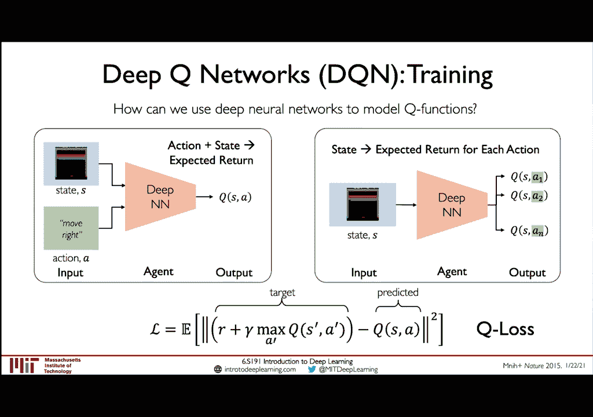

我們可以利用這些來訓練這個深入訊號的網絡。所以，總結一下，我們走進深入訊號的訓練，從頭到尾。我們的深入訊號，看到我們在進行訓練的狀態，然後，這個狀態被傳送到網絡中，然後我們嘗試將訊號的Q值。

分配為每個三個可能的行動。在這裡，我們可以在三個方式，讓網絡運作。我們可以移動到左邊，移動到右邊，或者我們可以保持在同一個位置。現在，為了確定最佳的政策，我們必須看一看每個Q值。在這個情況下。

移動到左邊，因為它看到球在移動到左邊，它看到，如果我移動到左邊一點，我可能有更高的機率擊中那球，然後繼續進行訓練。所以我的Q值，在我預計的總結，我的Q值，移動到左邊是20。反過來。

如果我保持在同一個位置，我們說，我有3的Q值，如果我移動到右邊，離球的方向遠一點，在這個情況下，因為球已經移動向我，我會有0的Q值。所以這些都是我的Q值，對於所有的可能行動。我如何計算最佳政策？

我們之前看到，最佳政策是從最佳的Q值，選擇最佳的行動來得到的。在這個情況下，我們可以看到最佳的Q值，是移動到左邊的行動1。所以我們選擇行動1，然後把這個回到遊戲引擎，然後回到環境。

然後我們會得到下一個狀態。這個過程會重複，下一個狀態會被傳送到深度智能網，我們會得到一個Q值列表，每一個可能行動的Q值，然後重複。現在，DeepMind 顯示，這些深度智能網，可以應用來解決。

一系列不同的 Atari 遊戲，不僅是 Breakout，還有很多其他的遊戲。基本上，他們只需要，以圖形來提供狀態，作為輸出，通過這些曲線層，並且由無線化和圖形運行，就像我們在第三課上學到的那樣。

在右邊，它在預測這些可能行動的，Q值。就像我們在上幾個示範中所看到的一樣，它會選擇最佳的行動來行動，在下一步，視乎最佳的行動的 Q 值，能夠達到的。然後，它會把它送回環境，來行動，並且得到下一步的狀態。

這其實非常簡單，因為儘管我認為，這非常簡單，基本上是試驗和失敗，他們在 Atari 上測試了很多遊戲，顯示了，在超過 50% 的遊戲中，他們能夠超越，人類級的表現，使用這個技術。而其他遊戲。

你可以看到的，在右邊的示範中，更加有挑戰性，但依然，再次說，就這技術的簡單性，以及它的清潔性，我認為，這對我來說是一件很棒的事。所以，儘管所有的優點，如同它的簡單性，清潔性，以及它的優雅性，我認為。

我指的是，能夠讓這個解決方案學習超人類的政策，政策可以打敗人類，甚至在一些相對簡單的任務中，有些非常重要的缺點，對於 Q 學習。首先，我們今天學到的簡單模式，這個模式只能夠處理，隱密的行動空間。

它只能夠處理，小的行動空間，我們只能夠進行，幾個可能的行動，它無法處理，持續的行動空間，所以，如果一輛自動車，想要預測它要去哪個地方，而不是預測，要去左或右或直，這些都是隱密的類別。

我們如何使用強制學習，來學習持續的行動空間？一個不是，分成盒子，但可以從某個區域，取得任何數字，來學習它能夠處理的行動空間。這是一個持續的系統，它有無限的空間，而在 Q 學習的版本中。

我們在這堂課中展示了它。它學習的彈性，也有些限制，因為它無法學習，能夠變得，複雜的政策，能夠根據，一些無可預測的，可能性分配來改變。所以，它是由 Q 系統，通過最大化的系統來計算的。

它總是會選擇最大化的，回報的行動，所以它無法從這些，複雜的政策學習。另一方面，我們將在今天課的，下一個階段，專注於政策陰影的方式，希望能夠解決。

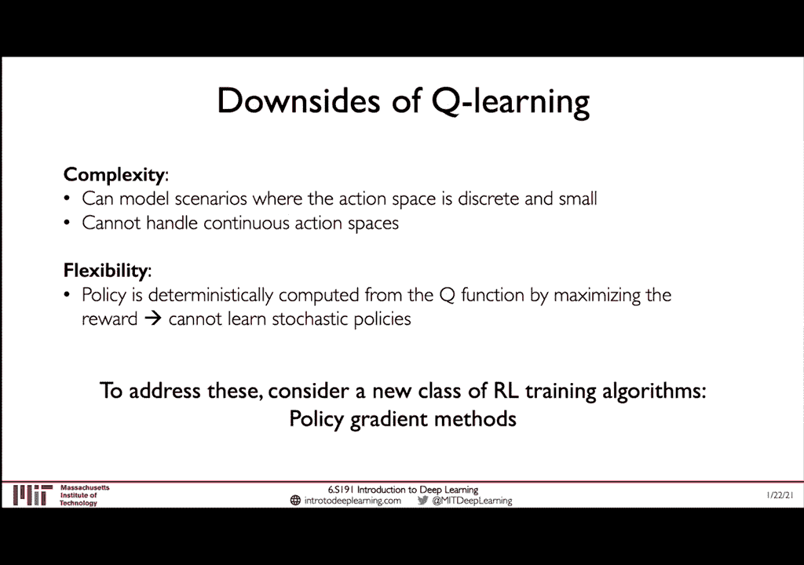

這些問題。我們進入課程中，我們看到的第一部分，和第二部分的差別，在價值學習中，我們嘗試用一條 neural network，來學習我們的 Q 價值，我們對行動的 Q 狀態。然後我們用這個 Q 價值。

來定義我們在一個狀態下，要做出最好的行動。這是我們的政策。政策學習是有點不同的，它嘗試直接學習政策，利用我們的 neural network，所以它進入一個狀態，然後嘗試直接學習政策，這會告訴我們。

我們應該做什麼行動。這比較簡單，因為這意味著我們現在，可以免費的學習行動，也就是從政策學習中學習的，政策狀態來測試。我們現在來看看，政策學習的細節如何運作。

首先我想要，從 Q 學習中，從 Q 學習中推進這個差別，因為這有一點差別，但是這對我們來說是非常重要的差別。深入 Q 網絡，想要用 Q 狀態來定義，首先，我們要預測，在某一個狀態下。

對每一個行動的 Q 價值，然後它會選擇最好的行動，在這裡最好的是由，哪個行動給予你最大 Q 價值，最大預期的回報，然後執行這個行動。政策學習中學習的關鍵思維，是在預測 Q 價值時，我們會直接對。

政策的 P 和 S 進行最佳化。所以這是政策的分配，直接控制我們該如何行動，在我們所在的現狀狀態下。所以這裡的輸出，是為了讓我們，給予我們想要的行動，在更直接的方式。輸出代表了可能性。

我們要檢驗或選擇的行動，應該是我們在這個步驟中，所做的正確行動。也就是說，它會給予我們最大的回報。所以，例如說，如果我們看到，我們預測這些可能性，這些行動的最佳行動，我們會得到一個數據，我們的政策網絡。

正在預測可能性分配，我們可以將它們分配到我們的政策中，我們可以說我們的政策，是由這個可能性分配定義的。然後來計算我們該做的行動，我們只需要從這個分配中，來做一個測試，來預測我們該做的行動。在這個情況下。

是車子往左走，就是 A1。但是，因為這是一個可能性分配，下一次我們測試，我們可能會，我們可能會在同一個位置，我們可能會測試 A2，例如說，因為它有一個非零的可能性，一個 0。1 的可能性。現在注意。

因為這是一個可能性分配，這個 P 行動的 P 給予我們的政策，必須是 1。現在，這些形式的優點是什麼？首先，我們看到的那樣，除了它是一個，更直接的方式來得到我們想要的，而不是在 Q 行動中。

使用 Q 行動來建立我們的政策，現在我們將直接地，去更改政策。除此之外，還有一個非常重要的優點，在這個形式之中，那就是它能夠，處理持續的行動空間。所以，這是一個具體的行動空間的例子。

我們在這次 Atari 遊戲中，所做的事情，是左轉，還是右轉，還是站在中間。這三個行動是具體的，這裡有一個具體的行動數字，可以被取代。比方說，這顯示了，我們的行動空間，是代表著，我應該移動的方向。

但不然，一個持續的行動空間，不僅會告訴我們方向，而是，比如說，我應該移動的真實數字是多快。這樣的問題，在數字中的可能答案中，是無限的，這可能是 1 秒左轉，半秒左轉，或任何數字速度。它也會告訴我們。

通常的方向，是通過一個加或是下方的數字。所以，如果我說，-1秒左轉，這告訴我，我應該移動到左邊，在 1 秒左轉。如果我說 +1，這告訴我，我應該移動到右邊，在 1 秒左轉。但是現在，當我們計算這個。

為一個可能性分布，我們也可以視覺到，這是一個持續的行動空間，簡單來說，我們可以視覺到，這個是一個，像是一個 Gaussian 分布，在這個情況下，但是它可以有很多種分布，你可以選擇，最適合你的問題。

分布系統。Gaussian 是一個很受歡迎的選擇，因為它的簡單性。所以，這裡，我們可以看到，移動到左邊的可能性，移動得更快的，是比移動得更快的，移動得更快的，而我們可以看到，這個分布的中心，平均的。

這個平均分布的高度，告訴我們，它應該移動得多快的，數字值，不僅是移動得多快，但是移動得多快，是多快的。現在，我們來看看，我們如何模擬，這些持續的行動空間，用一個 Policy Gradient 方式。

而不是預測，可能性的行動，在一個可能的狀態下，在這個情況下，因為我們在持續的範圍內，會有無數的行動，我們假設，我們的分布分布，其實是一個正常的 Gaussian，並將分布一個。

對於這個 Gaussian 的，平均和相反的分布，然後我們只有兩個分布，但是它能夠讓我們，描述這個可能性分布，在整個持續空間上，否則的話，它會是無數的，無數的數量的分布，所以在這個情況下，如果我們預測。

我們應該要做的，這個平均行動，是 -1，而這個差異是 0。5，我們可以看到，這個可能性分布，在左下方的，下方看起來是這樣的，它應該移動到左邊，以 -1 公里/秒的，平均速度，並且有一定的差異。

所以我們並不確定，它應該移動到左邊，以最好的速度，但是我們認為，它應該移動到左邊，所以在這個圖片中，我們可以看到，平均行動應該移到左邊，如果我們描述，這個分布是這樣的，我們可以看到，這個分布的重量。

是在數字線的，左邊，如果我們從這個分布，來做一個測試，我們可以看到，在這個情況下，我們得到的是，我們需要做的行動，在實際的速度，我們應該要做的行動，是我們需要移動，左邊 -1，以 0。

8 公里/秒的速度，所以這意味著，我們移動到左邊，以 0。8 公里/秒的速度，注意到，即使這個分布的，平均速度是 -1，我們並不被限制，在那個數字線，這是一個，持續的可能性分布，所以我們在這裡。

做一個測試，那並不是完全的，但這完全沒問題，這真的顯示了，在這個區別之間，在這個平均行動空間，和持續行動空間，這開放了很多，可能性，在我們做的應用，模擬無數的行動，再一次，就像之前。

就像這個平均行動情況，這個可能性分布，仍然有所有，可能性分布的優點，就是，這個計算的，可能性分布仍然有，1：1的可能性，所以我們可以，從中檢測，這是一個非常好的，確認能力，好，很好，那我們現在來看看。

如何這個，政策陰影的，系統，在一個具體的例子中運作，我們先來重新討論，這個整個學習循環，重新學習強制，我們在這課的，最初時看到的，我們來想想，我們可以如何使用，政策陰影的系統，我們已經介紹過。

如何訓練一個自動車，使用這個，判斷錯誤的，政策陰影的方式，所以在這個例子中，我們研究自動車，或自動車，這些元素是什麼，所以，機器人，就是我們的車，它在環境中旅行，就是，這個世界，這個路徑，它在旅行。

它有一個狀態，它是通過攝像數據，雷達數據，雷達數據等等，它得到，抱歉，它做出行動，它可以做出什麼行動，在這個情況下，行動就是，方向角角，再一次，這是一個具體的例子，一個持續的行動空間，你不需要分解。

方向角角，成為獨特的盒子，你的方向角角，是無限的，在它可以做出的，數量的可能性，它可以做出，任何的數量，在某些範圍之間，所以這是一個持續的，這是一個持續的，變數，我們在這次行動中，學習到的一些知識。

最後它得到獎勵，在距離它可以旅行前，它需要一些人類的應對，讓我們進入深入的範圍，現在我們已經，找到了所有的資料，我們如何訓練這輛車，使用 Policy-Gradient Network，在這個情況下。

我們以自動駕駛車為例，但你希望看到我們只使用這輛車，因為它比較有趣和有趣，但這也會應用到，任何一個範圍，你能夠認出，並設置問題，就像我們目前設置的問題，我們開始，從事者開始，事者是車。

我們可以把它放在路上，在路中心，下一個步驟是，讓事者開動，一開始它不太好開動，因為它會塌陷，而且它從未被訓練過，所以我們不期望它開動得很好，但這還好，因為這是強化學習，所以我們使用這個政策，直到它完結。

在這個情況下，我們會在它塌陷，或需要被訓練過的時間，標記結束，在我們稱之為，Rollout 時，我們開始錄製，所有的 State Action Pairs，抱歉。

State Action Reward Pairs，所以在每一個步驟，我們會錄製，機械人在哪裡，它在什麼狀態，它在什麼情況下行動，以及它在什麼狀態下，得到的回報，接下來的步驟，就是要把所有的。

State Action Reward Pairs，並且減少可能性，在它接受任何行動時，接近結束時的時間，所以接近崩塌時的時間，我們想減少可能性，在未來再做任何行動，同樣地，我們想增加可能性。

在開始做任何行動時，的時間，注意，我們並不確定，在第一部分的時間，有什麼好事，我們只是想像，因為崩塌在，第二部分的時間，這可能是因為，第二部分的行動，這是一個很不智慧的，系統，因為，這就是我們想像的。

它只是想要，減少可能性，在低回報時，增加可能性，在高回報時，它並不確定，哪個行動比其他更好，尤其是在開始時，因為它沒有這樣的，回報，這只是說，我們想減少，什麼不好的事，增加什麼好的事，如果我們再做。

我們可以看到，下一次，車子開了，開了一段時間，如果我們再做，我們做同樣的事，現在在這個轉變，我們減少可能性，在低回報時，增加可能性，在高回報時，我們重新開始，然後在完成時，再更新程序，再一次。

它看起來開了一段時間，我們可以再做，我們繼續做，直到它學會，跟著行車道，不墜車，我覺得這很棒，因為我們從來沒有教過這台車，什麼，我們從來沒有教過，什麼是行車道，我們從來沒有教過，什麼是行車標。

但是它學會避開行車道，避開崩潰，只要觀察，很微妙的崩潰獎勵，它觀察了很多崩潰，然後學會說，好的，我不會做任何，這些行為，發生在我崩潰的附近，只要觀察這些事，它成功避開行車道，並且在這個環境中。

長時間活下去，現在剩下的問題，是我們如何更新，我們的政策，在每個訓練的一段時間，來減少壞事件的可能性，並增加這些好的事件的可能性，或者說這些好的行為，這讓我們集中在，這項訓練的學習方法中的點4和5。

我們如何進行，學習過程，減少壞事件的可能性，並增加他們的可能性，我們來看一看，更詳細的部分，我們來看，特定的失誤功能，訓練政策的階段，然後我們會分析，為何這項功能有效，所以這個失誤，涉及到兩部分。

我想深入研究，第一項是，Log-likelihood，Log-likelihood，是我們的政策，是我們的行動的可能性，以我們的國家為例，第二項是，我們將這個，Log-likelihood。

分成總的優惠，總的優惠，抱歉，R(t)，假設我們得到很多優惠，對一個有很高的Log-likelihood，這個損失會很大，並且會強化這些行動，因為他們造成了非常好的回報，另一方面，如果優惠對一個。

有很高的可能性，它會調整這些可能性，以免將來，這個行動再次被檢驗，因為它並沒有造成，可望的回報，所以當我們插入，這個損失，到Gradient Descent Algorithm，來訓練我們的網絡。

我們可以看到，這個Policy Gradient Term，是在藍色的位置顯示的，就是這個，這個Algorithm的名字，因為它需要計算這個，Gradient 和這個Policy，這個功能的一部分。

再次強調，這個Policy Gradient Term，是由這兩部分結合的，第一是行動的可能性，第二是回報，如果行動非常正面，非常好，造成了好的回報，它會透過這個Gradient Term，去強化它。

如果行動非常可望，抱歉，不是非常可望，但它造成了好的回報，它會更加強化，所以一些之前不可能的事情，會成為可望，因為它造成了好的回報，相反的，另一方面也一樣，我想談談，我們如何可以延伸。

這些強化學習的 Algorithm，到現實生活，這是一個非常有挑戰性的問題，因為這是一個，對強化學習領域的，特別的興趣，現在，特別是現在，因為在現實世界，應用這些 Algorithm，是非常困難的。

有一個原因，或是一個主要的原因，就是這個步驟，從行政到結束，這是我提到的一個問題，但我沒有花太多時間，去分析，為什麼這麼困難，在現實世界，結束意味著，塌陷、死亡，通常都是很壞的事情，我們通常可以。

通過訓練和測試，但問題是，現代的測試器，不確定地描述現實世界，更何況，它們不能轉移到現實世界，當你使用它們，所以如果你在測試中訓練一些東西，它會在測試中有效，會在測試中有效，但當你，想要把這個政策。

轉移到現實世界，它並不太有效，現在，我們在我的實驗室，創造了一個非常酷的結果，就是在發展一台，全新的相機實驗機，特別是為了自駕駛的車，我想和大家分享，它是完全數據主流，並且能夠讓這些。

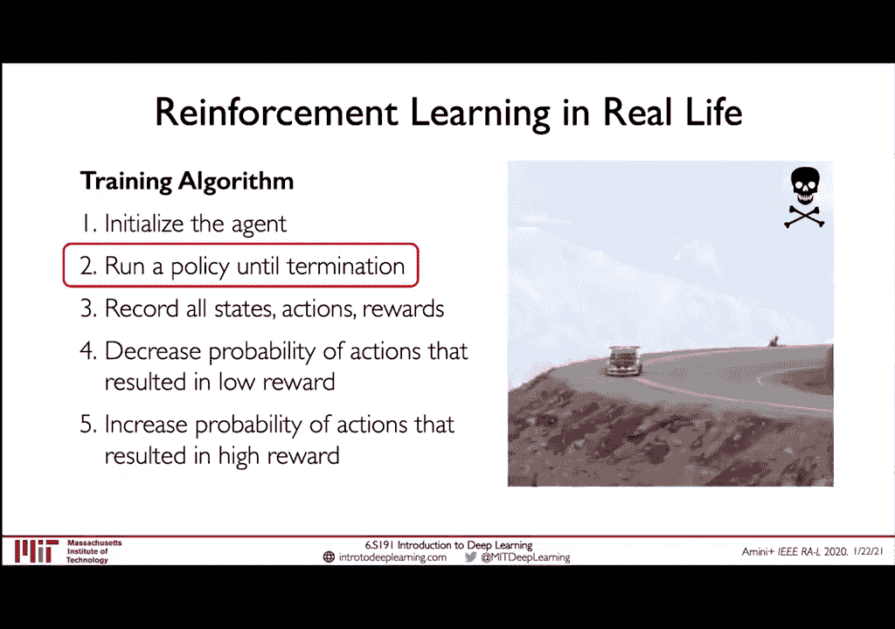

強化學習的進步，在現實世界，我們創造了一個非常酷的結果，就是在發展一台，這樣的相機實驗機，叫做Vista，它能夠讓我們使用，現實世界的數據，來模擬全新的，實體代理人在實驗中，現在，結果非常，相機實驗的。

如同你們所看到的，它能夠讓我們訓練代理人，使用強化學習，在實驗中，使用我們今天看到的方式，讓他們可以直接進行運作，沒有任何的交換學習，或是領域應用，直接進入現實世界，事實上，我們做了這個。

我們把代理人放進了，我們的模擬實驗機，訓練他們，使用了我們在這次的講座中，學到的同樣的，政策定律系統，所有的訓練，都在我們的模擬實驗機中，然後我們把這些政策，放在我們全面的，自駕駛車上，如同你們看到的。

而在我左手邊的，你們可以看到我，坐在這個車上，在車內的下方，你們可以看到我，坐在這個車上，當它駕駛到，現實世界時，完全自動，這代表了第一次，在我們發布這些結果時，第一次在自動車上，訓練人，使用RL。

完全在模擬實驗，並且能夠在現實世界，運作，這是一個非常棒的結果，所以現在我們已經，探索了價值學習的基礎，以及政策定律，強化學習的方式，我覺得現在，我們需要探索一些，我們最近看到的，非常出色的。

深入強化學習應用。

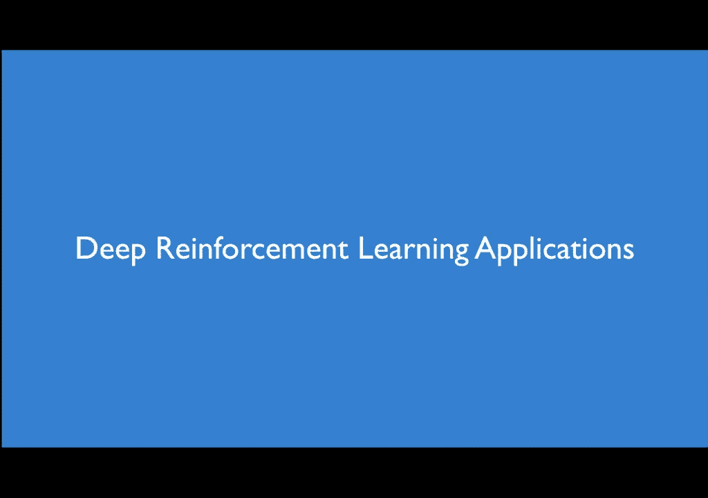

我們首先來看看，Go的遊戲，強化學習人員，被對人類冠軍，實現了當時的，仍然非常刺激的結果，首先我想先介紹一下，Go的遊戲，這是一個19x19的，範圍遊戲，遊戲由兩名玩家一起玩，他們是白色的，或黑色的。

遊戲的目標是，與對手佔用更多的，地區，雖然這個範圍，和遊戲的規則，非常簡單，但Go的問題，解決Go的問題，並且打敗，冠軍，是非常複雜的問題，因為，Go的遊戲，可以在多個地區，遇到的地區，非常多。

在多個地區，有更多的法律地區，比在宇宙上的地區更多，目標是，訓練AI，訓練一個，深入強化學習人員，可以控制Go的遊戲，不僅能打敗，現有的冠軍軟件。

也能打敗，現有的世界冠軍，2016年，Google DeepMind，就面臨了這個挑戰，幾年前，Go其實開發了，一個強化學習基礎的流程，打敗了Go冠軍玩家，這個主要的概念，非常簡單，並且跟我們今天。

所學到的一切一樣，首先，一個人工智能網絡，可以觀察到很多人工智能Go玩家，並學習模仿他們的行為，這個部分並沒有使用強化學習，而是使用監控學習，可以研究很多人工智能，然後，他們利用這些人工智能網絡。

來對抗強化學習的政策網絡，讓政策，超越人工智能人員，並且對抗自己，達成超人性的表現，此外，一個讓這項挑戰成功的技巧，就是使用這個人工智能網絡，以智能智能的智能來做指引，並預測智能的狀況，現在這個網絡。

AI可以用智能智能來幻想，不同的位置行動，它可以去評估，這些行動的效果，以這些預測的價值為例，這讓它可以穿越，並計劃它可以做的行動，以它在未來的發展方向為基礎，最後。

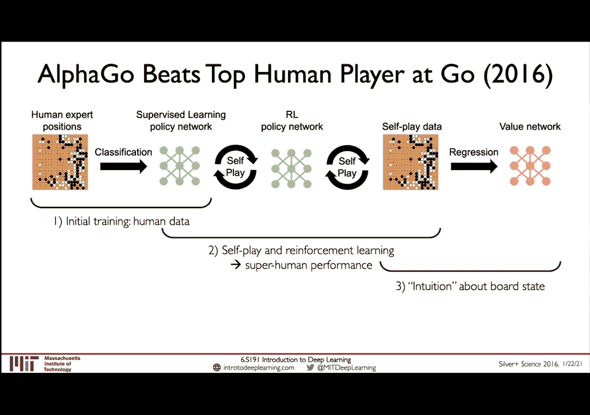

最近發佈的一項，這些方法的延伸，在2018年，叫做AlphaZero，只用自動玩，並將它集中在三個著名的遊戲之中，不僅是GO，還有桌上遊戲，手機遊戲，還有GO，在這些例子中，作者們顯示。

這些網絡不需要人工智能，而是他們從頭開始，自行去做調整，這正是一個，純粹的強化學習的方法，但它還能夠，不僅擊敗人類，也擊敗了，過去的網絡，是由人類資料進行調整，最近，只在上個月，非常最近。

這項工作的下一個進展，是由MuZero發佈的，該系統現在學會，掌握這些環境，甚至不再知道規則，我認為最好的方法，來形容MuZero，是與之前的進步，與它們的能力相比，我們已經討論過，今天，我們開始討論。

AlphaGo，這顯示了人類超人的表現，在GO上，使用自動遊戲，並預先訓練這些模式，使用人類超人資料，然後是AlphaGo Zero，這顯示了，更好的表現，可以完全自行達到，不需要預先訓練，人類超人。

而是直接從零開始學習，然後是AlphaZero，這項想法更廣闊，超越了GO遊戲，並且進入了比賽和衝擊，但仍然需要模式，了解規則，並且得到遊戲規則，以獲得他們的教訓，上個月，作者展示了，超人表現。

在超過50場比賽中，都沒有在預先知道規則的，遊戲學習方法，它需要學習，並且，學習如何，在訓練過程中，最好地玩遊戲，這非常重要，因為在許多場合，我們並沒有預先知道規則，來告訴模式，當我們處於環境中。

有時規則不明顯，規則或動態不明顯，物體可能會，不斷地互動，或是不可預測的，我們也可能處於一個環境，規則太複雜，人類無法形容，所以這個想法，學習遊戲規則，或是任務，是一個非常強大的概念，我們來簡單地。

看看這個方法，因為這是一個很棒的系統，但重點是，它實際上建立在我們今天學習的一切上，所以你應該能夠了解，每個部分的這個系統，我們開始從座位的狀態來觀察，從此時，我們預測，或是進行樹木尋找。

通過不同的可能發生的場景，我們會做一些行動，然後我們會看待，未來的可能場景，或未來的可能發生的狀態，但現在，因為我們不懂規則，網絡被迫學習，我們要學習這個尋找的模式，我們要學習，未來的可能發生的狀況。

以及它在現時的狀況下，和它所做的行動，現在，在最初的時間，這給我們一個可能性，在這次的行動中，根據它能夠得到的價值，通過這個樹木的根部，然後用這個來計劃，它應該做的下一步，這就是我們學習的，政策網絡。

但也能夠達到，這個樹木尋找的計劃，來計劃未來的發展，現在，因為這個政策網絡，它接受這個行動，並得到新的觀察，從遊戲中，然後重複這個過程，一遍又一遍，直到遊戲結束，或者遊戲結束，這就像是，我們看到的。

AlphaZero的運作，但現在，最重要的差別是，這個政策網絡，作為樹木尋找的一部分，我們可以看到，在每一個步驟中，是完全學習的，這對於這些技術，除了在硬體遊戲中，應用的方式，也非常大方。

所以在這些情況下，我們非常了解遊戲的規則，所以我們可以利用它，來訓練我們的系統，但在很多情況下，這種進步，讓我們能夠應用這些系統，去處理一些我們不懂的問題，我們需要學習的規則，來玩遊戲，或者是。

規則是很難去定義的，但在現實世界，很多有趣的情況下。

這就是這樣，所以我們來簡單地，回顧我們今天課堂學到的東西，我們開始，從深入強制學習的基礎，我們定義了，什麼是代理人，什麼是行動，什麼是環境，他們如何互相互動，在這個強制學習的循環中，我們開始從。

深入的學習問題，以及深入的循環網，來學習循環，以一個現實的交流，然後決定一個政策，選擇一個行動，能夠達到最大程度的循環，最後我們學習了，如何能夠更好地，而不是更好地，去定義循環。

而是更好地去直接定義政策，從現實的循環開始，我們看到這個有很大的影響，在持續的行動空間，Q系統，或是Q學習技術，是有些限制的，所以謝謝你來參加，這個深入強制學習課堂。

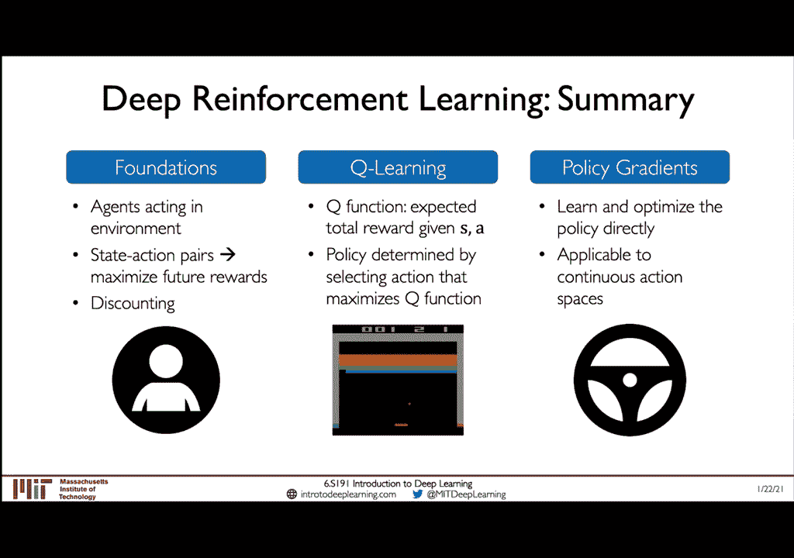

在此時，我們將在下一個課堂，專注於強制學習，你將獲得一些經驗，如何應用這些系統，來自你自己，專注於政策基礎系統，在非常簡單的例子中，例如Pong，以及更複雜的例子，你將從零開始，從零開始。

建立這個機器人，和環境的腦袋，你將能夠將很多的想法，我們今天在這次課堂中看到的，一起結合起來，所以請來GatherTown，如果你有任何問題，我們會很高興地討論，關於軟件實驗室的問題。

以及今天課堂的任何問題，所以我們期待能夠在那裡見到你。

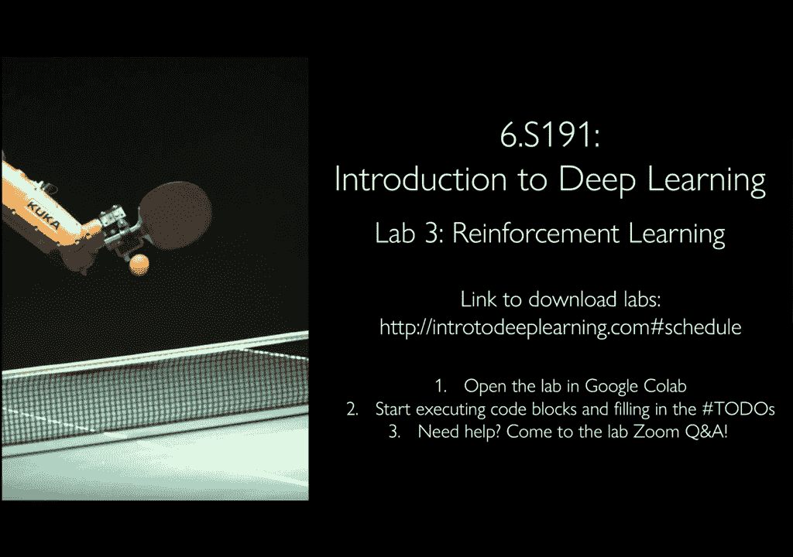

謝謝。