# P6：Deep Learning New Frontiers - 爱可可-爱生活 - BV1jo4y1d7R6

大家好，欢迎来到MIT 6。S191的第六堂课！这是我绝对的最爱之一，课程中的讲座，我们将集中讨论一些局限性，深度学习算法以及该领域的一些新兴研究前沿，在我们深入探讨技术内容之前。

需要先进行一些与课程相关和后勤的工作。

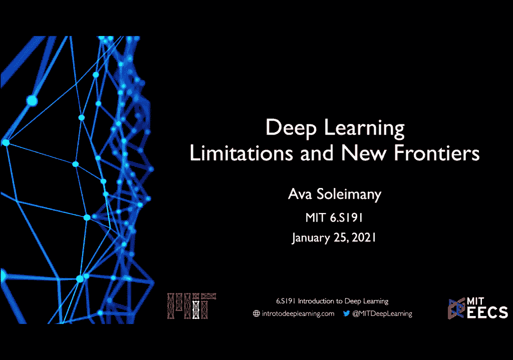

我首先要宣布的是，我们的课程具有设计的传统，并向今年参加的学生提供T恤，我们将继续以这种荣誉为荣，因此，为此，我们在画布上为所有学生准备了一张签到纸，您可以在其中指明您的，有兴趣领取T恤。

一旦您填写了该签名表，便会收到必要的信息，信息将确保通过适当的方式将T恤衫交付给您，尽快，如果在课后，如果画布已关闭并且您无法访问该注册，表格，请随时给我们发送电子邮件。

我们将找到一种将T恤衫送给您的方法。

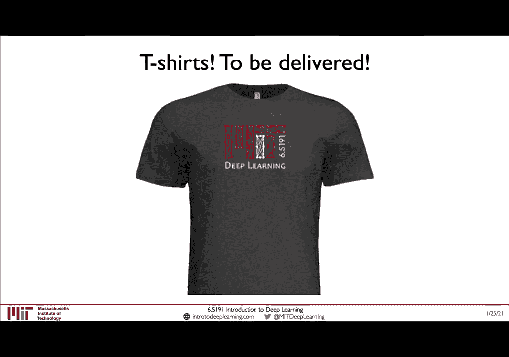

以便退后一步，并概述我们的课程安排，到目前为止，我们去过的地方和将要去的地方，前沿，我们将在明天完成强化学习的最终软件实验室的截止日期，我们将举办两场非常激动人心的热点话题演讲，并提供全新的内容。

接下来是一系列的四场客座演讲，其余时间您将有空，这周的课程继续进行您的期末项目，全班将在星期五结束，学生最后的项目介绍和提案竞赛以及我们的奖项，仪式，所以说到这些最终项目，让我们详细了解一下这些项目。

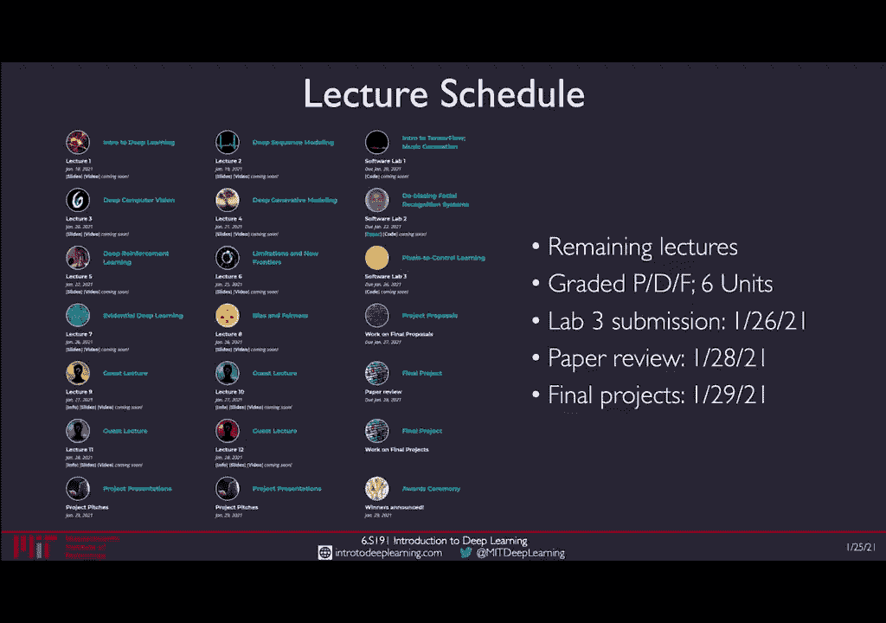

那些修读学分课程的人，有两个选择可以达到你的成绩，第一个，是一个项目建议，您将多达四人一组来开发新的，和新颖的深度学习思想或应用，我们意识到两周的时间非常短，是时候提出并实施一个项目了。

所以我们肯定会采取这个措施，然后在1月29日（星期五）进行评审时，您需要进行三分钟的简短讨论，向一组评审介绍您的项目建议，评审将颁发最终奖项，至于物流和时间安排，您将需要表明您的兴趣。

在东部时间午夜在本星期三进行演示时，需要提交幻灯片，供您在东部时间周四午夜前进行的项目建议书介绍，这些要求的提交在课程提纲和画布站点上，我们的头号优胜者将被授予奖品。

包括英伟达GPU和Google Homes，我想就最终提案演示文稿提出的要点，是为了参与并有资格获得奖品，需要同步参加，在星期五的课程中，所以1月29日星期五东部时间下午1点至3点，您需要在场。

您或您的小组需要在场才能参与最终提案，竞争满足信用要求的第二选择，是撰写深度学习论文的一页评估，评估基于，您的评论的完整性和清晰度，这将在东部时间星期四午夜之前完成，时间。

更多信息和说明也可以在画布上找到，因此。

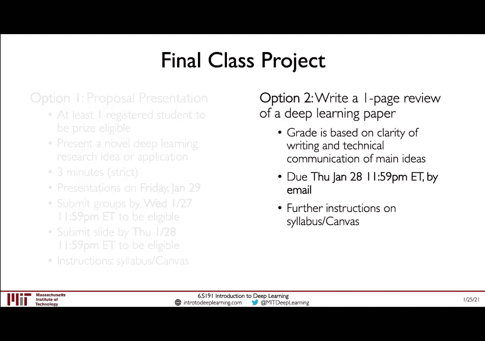

在本次演讲之后，我们将要讨论两个非常令人兴奋的热点话题，讲座，而这些讲座将集中在深度学习的发展中领域中的两个快速兴起的话题上，深度学习研究，第一个将重点介绍一系列方法。

寻求开发可实际学习和估算的算法的证据深度学习，神经网络的不确定性和第二个焦点话题将集中在机器上，学习偏见和公平，这里我们将讨论实施偏见的一些危险，社会中的算法以及实际上减轻这些不必要偏差的新兴策略。

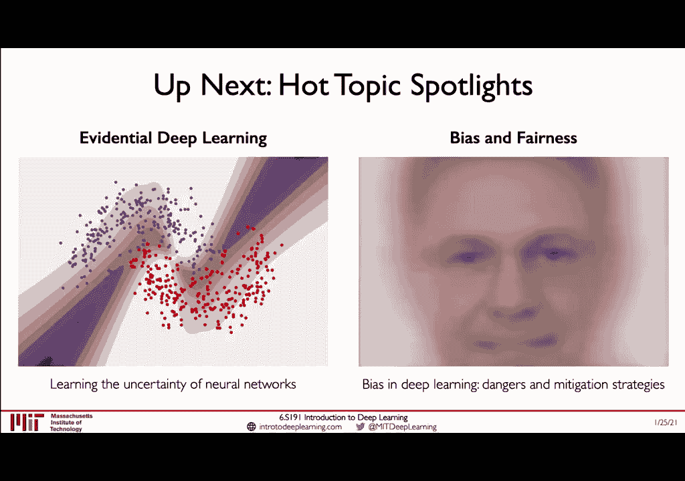

随后将进行一系列非常激动人心和令人敬畏的嘉宾演讲，来自行业和学术界的领先研究人员，特别是我们将拥有，讲座将涵盖从AI和医疗保健等各个主题的各种话题，记录用于业务应用程序和计算机视觉的分析。

我们高度高度评价，如果可以的话，鼓励您同步参加这些讲座（如果您可以在1月27日和1月参加），美国东部时间下午1点至下午3点（28日），这些主题将成为非常令人兴奋的主题，可能会延长指定软件实验室的时间。

以便我们确保我们可以进行实时质量检查，与我们出色的嘉宾演讲者没事，因此总结了物流和课程。

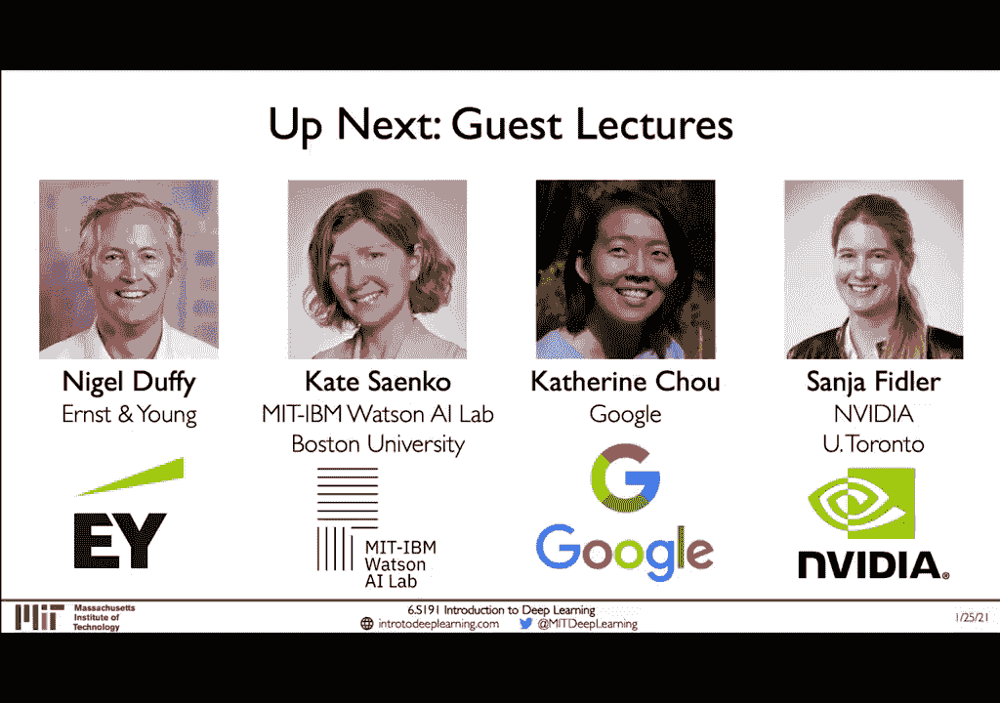

相关的公告，让我们深入了解本讲座的有趣内容和技术内容。

到目前为止，取得成功191我希望您对深度学习有深刻的了解，已经彻底改变并且正在彻底改变来自以下领域的许多不同研究领域和领域。

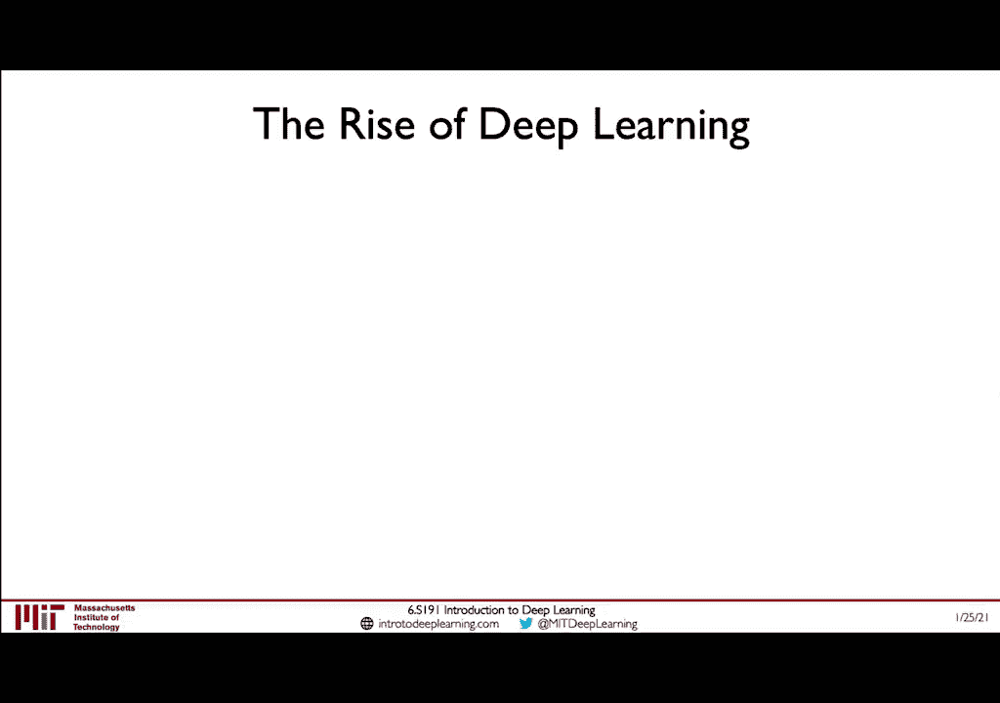

自动驾驶汽车在医学和医疗保健方面的发展，以加强学习。

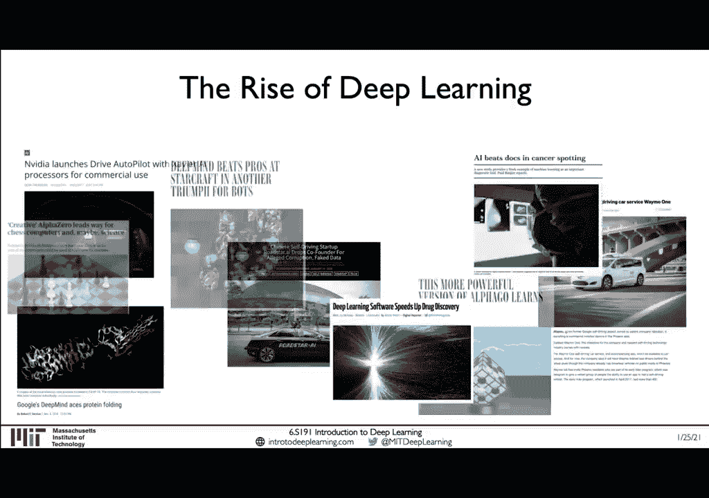

生成建模机器人技术和自然语言的各种其他应用，处理财务和安全性，并了解巨大的应用程序，深度学习的实用性和力量我希望您也已经建立了具体的理解，这些算法的实际工作方式，以及它们如何具体实现了这些进步。

回到我们一直在考虑的算法和模型的类型，处理以信号形式输入图像和其他感官数据的系统，并继续做出决定，因为输出可以是预测，也可以是，输出的检测也可能是一个动作，例如在强化学习的情况下。

在生成模型的情况下考虑了反问题，我们实际上可以，训练神经网络以产生新的数据实例，在这两种范式中，我们可以。

确实将神经网络视为功能非常强大的函数逼近器，这与，神经网络理论中长期存在的定理，即万能定理，逼近定理，它于1989年提出，在社会上引起了轰动，这个定理的普遍近似定理所说明的是，一个具有。

单个隐藏层足以将任意函数近似到任意位置，它所需要的只是一个单层，在这一课中，我们主要处理了，深度神经模型，我们彼此堆叠多个隐藏层，但这，定理完全忽略了这一事实，并说好吧，只要我们可以，我们只需要一层。

将我们的问题简化为一组输出输入和一组输出，这意味着必须存在一个，神经网络可以解决这个问题，这是一个非常强大而且非常重要的声明，但是，如果您仔细考虑这一点，我们需要注意几个警告。

首先是这个定理不能保证隐藏单位的数量，或需要解决的图层大小，这样的问题对，它也留下了一个问题，那就是我们实际上如何去做，训练这样的模型，以找到权重来支持它无法实现的架构。

关于它的任何说法都只是说它证明了这样一个网络的存在，但是据我们所知，在梯度下降的情况下，发现这些权重非常重要，这是由于，优化问题的非凸性质另一个关键的警告是该定理。

不能保证最终模型可以很好地推广到其他任务，实际上，我认为这个定理是通用逼近定理点，涉及与在人工智能中过度炒作的可能影响有关的更广泛的问题，以及，我们作为一个社区，因为学生们投入资金来促进这一领域的发展。

我认为我们在考虑和营销以及宣传这些广告时需要非常谨慎，算法，而通用逼近定理却能引起很多兴奋，这也给当时的社区带来了一种虚假的希望，那就是神经网络可以用来解决任何问题，就像你可以想象的那样。

过度炒作是非常非常非常危险的，这种过度炒作也与两个因素有关，在历史悠久的AI冬季，人工智能和神经网络的研究更加具体，放慢了很多，我认为我们仍处于爆炸性增长的阶段，为什么今天在本讲座的其余部分中。

我想重点介绍一下，我们已经学习并扩展到超出我们讨论范围的算法。

可以考虑新的研究领域，所以首先要考虑局限性。

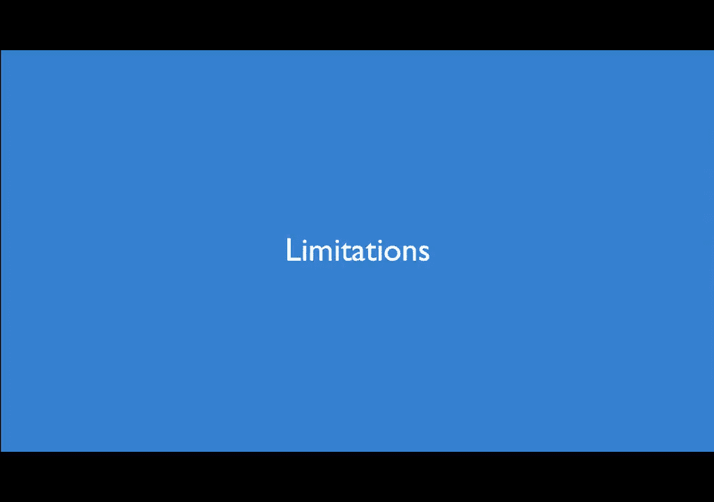

我最喜欢的之一，我认为这是最有潜力的例子之一，深度神经网络的危害和局限性来自于这篇称为理解深度的论文，神经网络需要重新考虑泛化，而他们在本文中所做的工作非常简单，实验中。

他们从数据集imagenet拍摄了图像，并且每个图像都已关联，带有一个特定的班级标签（如此处所示），他们所做的是他们在这个实验中，对于数据集中的每个图像（不是类别，而是单个图像），它们翻转了一个死角。

死亡，其中k是他们正在考虑的可能类别的数量，他们使用了这个，翻转模具以将全新标签随机分配给特定图像，这意味着这些，关于图像中实际存在的内容，相关的新标签是完全随机的，因此，例如。

可以在此处可视化重新映射，并注意这两个狗实例，已经完全映射到不同的类，所以我们完全随机化了标签。

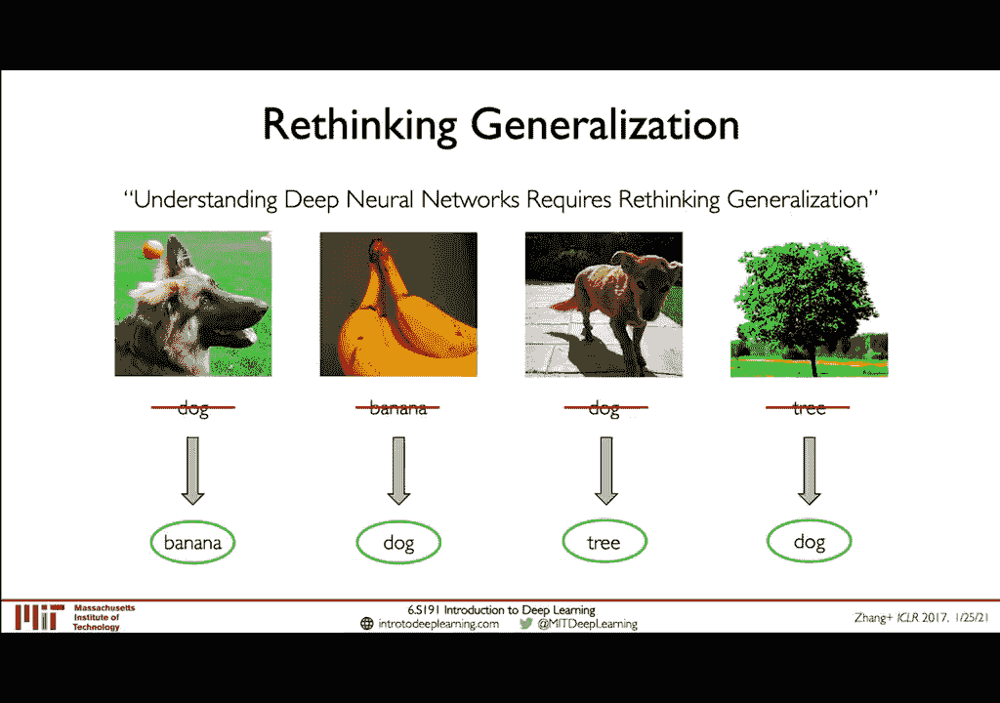

他们接下来要做的是将这个数据，这个打乱的数据拿走，并试图适应一个深层的神经。通过应用与原始图像不同程度的随机化，将图像网络连接到图像网络数据，带有不变类别标签的数据将完全随机化，如您所愿。

期望模型在测试集上的准确性独立测试集逐渐趋于零，随着数据随机性的增加，但真正有趣的是他们在观察时，他们查看了训练集上的表现，这就是他们发现的结果，他们发现，无论他们将标签随机化多少，模型都能在，训练集。

其突出之处在于与通用声明非常相似，逼近定理得出了这样的想法：深度神经网络可以完美地适合任何，即使该功能与由随机标记驱动的完全随机数据相关联。

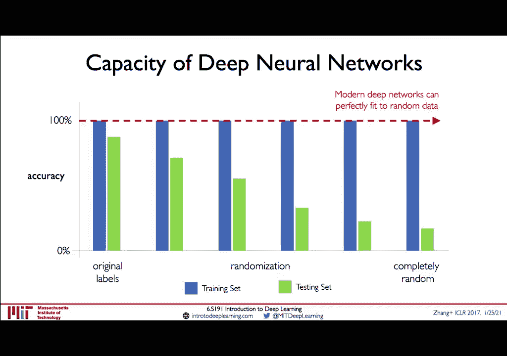

因此，画图确实将这一点带回家，我认为是考虑和理解的最佳方法，神经网络是非常好的函数逼近器和所有通用逼近，定理指出，神经网络在这一方面非常擅长，所以让我们假设在这里，一些数据点。

我们可以使用神经网络学习一个近似于此的函数，数据，这将基于对分布的最大似然估计，这些数据的意思是，如果我们给模型提供一个新的数据点（此处显示为紫色），我们可以预期我们的神经网络将为此预测最大似然估计。

数据点，并且该估计可能将取决于该函数，但是现在发生了什么，如果我将分布区域的范围扩展到现在超出域范围的范围，那么实际上，无法保证这些区域中这些区域的数据是什么样的，因此我们。

无法对我们的模型在这些区域的行为或表现做出任何陈述，这是现代深度神经网络存在的最大限制之一，所以这里对神经网络的声明做了修订，出色的功能逼近器他们真的是出色的功能逼近器，当他们拥有训练数据时。

这也引发了一个问题，即发生了什么，在这些分布范围外的区域中，网络以前从未见过培训示例，我们如何知道我们的网络何时不知道自己对所做的预测没有信心。

建立这个想法，我认为可以有一个可以被放大和夸大的概念，媒体认为深度学习基本上是炼金术，对，这是神奇的治疗方法，所有可以解决任何问题的解决方案，我的意思是它的功能真的很棒，我几乎可以肯定。

这可能是您参加本课程并吸引他们的机会，但是，你知道我们是否可以说深度学习算法就是这些，所有令人信服的解决方案都可以应用于任何任意问题或应用。

这也产生了您可以采取一些训练数据集的想法和信念，这些想法和信念适用于某些网络，架构可以改变您的学习算法并吐出出色的结果，但这根本不是深度学习的工作原理，您的模型只会与数据一样好。

就像社区里的谚语所说的那样，如果你把垃圾放进去，你将要把垃圾扔掉。我认为一个真正突出这一局限性的例子就是我要去的那个例子。现在向您展示这强调了这些神经网络系统在多大程度上取决于数据，他们接受过训练。

所以假设我们有狗的形象，我们会将其传递给，基于cnn的体系结构，我们的目标是尝试训练网络以拍摄黑白图像，并为其着色，当它传递到模型中时，这只狗的图像发生了什么，如下，仔细观察一下这个结果。

如果您发现狗的鼻子下面有，皮毛上的这个粉红色区域，如果这仅仅是，天生的狗，但为什么会这样呢，为什么我们的模型会很好地吐出这个结果。

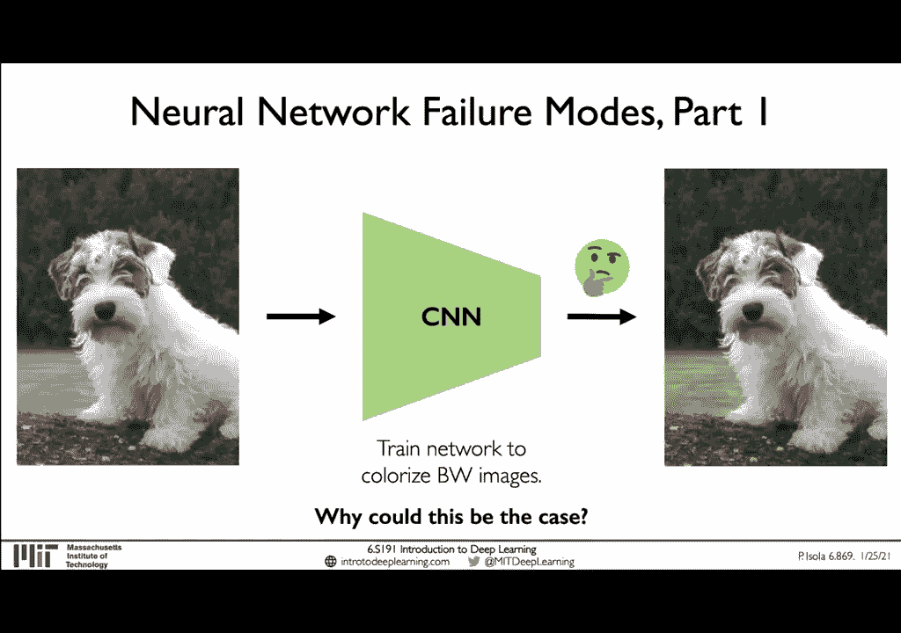

如果我们考虑可能已用于训练网络的数据，很有可能在成千上万的图像中，用来训练这种模型的狗，大多数或许多这些图像都会拥有，狗把舌头伸出来，因为那是狗的行为。

因此cnn可能已将狗嘴下方的那个区域映射为最可能是粉红色的，因此，当它看到一条狗闭上嘴时，它的舌头没有张开，它以某种方式假设，正确，或者它是建立的表示形式，它将区域映射为粉红色，重点是。

深度学习模型会根据，他们看到的数据，我认为这是一个非常关键的点，因为您外出时知道自己已经采取了，本课程，您可能对将深度学习应用于某些应用感兴趣，和您感兴趣的问题，您的模型将总是与您的数据一样好。

这也引发了一个问题，即神经网络如何处理数据实例，他们以前没有遇到过的，我认为这很突出，几年前这个臭名昭著的悲惨例子，在自动杀死驾驶员的同时自动驾驶崩溃了，事实证明。

在那次撞车事故中丧生的驾驶员实际上报告了多个，在撞车事故发生前的几周内，汽车实际上向，完全一样的障碍撞到了它，为什么它本来可以做得那么好，结果却是，代表汽车自动驾驶数据的图像，系统经过训练。

来自高速公路该区域的图像实际上缺乏新的构造，改变了最近障碍物的外观，使汽车，在崩溃之前，它遇到了一个实际上已无法分发的数据实例，并且，不知道如何处理这种情况，因为我只见过特别的熊，在这种情况下。

障碍物的特定样式和建筑会导致其悲剧性崩溃，在这种情况下，是因为神经网络故障模式导致了损失，人的生命，这表明这些失败模式指向并激发了需求，真正有系统的方式来理解深度学习模型的预测何时，换句话说。

当无法确定其预测时，就无法信任它，这是一个非常，深度学习中令人兴奋且重要的研究主题，它将成为我们研究的重点，第一个焦点话题，不确定性的概念对于部署绝对是非常重要的。

深度学习系统以及我认为安全至关重要的应用程序，诸如自动驾驶之类的东西诸如医学面部识别之类的东西，算法越来越多地与人类生活打交道，我们真的需要有原则的方法。

确保它们的鲁棒性不确定性指标在我们必须要解决的情况下也非常有用，依赖于可能不平衡或存在大量噪声的数据集，我们将在聚光灯讲座中进一步考虑这些不同的用例。

好的，在为明天的聚光灯演讲做准备之前，我想，简要概述一下我们需要哪些不确定性以及我们可以谈论哪些不确定性，在考虑深度学习算法时，让我们考虑这个分类问题，其中，我们将尝试构建一个神经网络。

以对一组固定的类的概率进行建模，因此，在这种情况下，我们尝试在猫的图像，狗的图像和，然后输出新图像中是猫还是狗的权利，请记住概率，猫和狗的总和必须等于一，所以当我们现在训练模型时会发生什么。

我们已经准备好对其进行测试，并且我们有一个图像，其中同时包含猫和狗，但网络仍然需要输出，类概率总和为1，但实际上，该图像既有猫又有狗，这是我们可以认为存在于噪声或随机性中的一个实例，数据。

如果我们在单独的猫或狗的图像上训练此模型，关于模型在不确定性之前所看到的内容，狗和猫都是吵杂的，指标可以帮助我们评估噪声，即数据固有的统计噪声，并存在于数据中，这称为数据不确定性或同构不确定性。

现在让我们考虑另一种情况，让我们使用相同的猫狗分类器并输入一个图像，一匹马再到这个分类器，输出概率将必须加到一个，但是即使网络预测该图片最有可能包含狗，我们也会，希望它对这个预测真的不很自信。

这是一个例子，我们的模型现在正在完全不经分配的图像上进行测试，因此，我们期望它对它的预测不是很自信，这种类型的不确定性与数据不确定性是另一种类型的不确定性，这就是所谓的模型不确定性或认知不确定性。

它反映了给定预测的自信程度，对于理解神经网络的泛化程度非常重要，这非常重要，地区以及他们如何报告分布外地区和，在聚光灯讲座中，您将真正深入了解不确定性估计的这些概念。

并探索一些新兴的方法来直接学习神经网络的不确定性。

我想考虑的第三种失败模式是我认为非常有趣的一种，而且也有点吓人，这就是对抗性例子的想法，这里的想法是我们以一些输入示例为例，例如这张寺庙和标准cnn的图像。

经过训练的您知道一组图像将对该特定图像进行分类，作为具有97个概率的庙宇，我们随后拍摄了该图像，并应用了一些特殊的摄动，到该图像以生成所谓的对抗性示例，例如，如果我们现在，这个同一个cnn的例子。

它不再将那个图像识别为圣殿，而是错误地将此图像归类为鸵鸟，令人难以置信，对，那么实际上实现了完整的对抗攻击的扰动是什么。

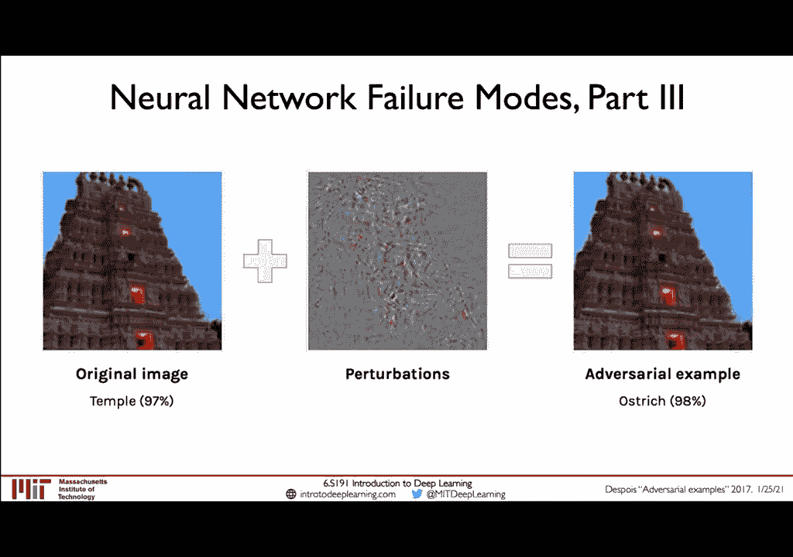

这个扰动是做什么的，请记住，当我们使用梯度下降训练神经网络时，我们的任务是取一些目标j并尝试根据给定的权重来优化该目标，w输入x和预测y，我们的目标以及我们在进行此渐变时的要求。

下降更新是指权重的微小变化如何减少损失，特别是如何，我们可以扰动这些权重以最大程度地减少损失吗？为了做到这一点，我们用固定图像x和真实标签y扰动网络，现在只有权重才能将对抗性攻击的损失降到最低。

我们现在问如何，我们修改输入图像以增加网络预测中的误差，因此我们，试图预测以某种方式扰动输入x，以便当我们固定权重w时，和真实的标签y然后我们可以增加损失函数以使网络基本跳闸。

弄错这种对抗性扰动的想法是最近由一群人提出来的。

在麻省理工学院，他设计了一种算法，可以实际上合成，对抗任何一组转换，例如旋转或颜色变化，它们，能够合成一组对这些类型相当强大的2d对抗攻击，转换的真正酷点在于，他们进一步迈出了超越2D的一步。

图像以实际合成物理对象3d对象，然后可以，曾经愚弄神经网络，这是对抗性例子的首次展示，实际上存在于现实世界中，所以这里的例子是这些3D打印的海龟，当那些乌龟的图像被对手准确地分类为步枪时。

这些乌龟的图像被错误地归类为步枪。再次拍摄这些是真实的物理对象，然后将这些图像输入，一个分类器，因此就如何保证我们提出了许多有趣的问题，深度学习算法对此类对抗攻击的鲁棒性和安全性。

可能被恶意用来扰乱依赖于深度学习算法的系统。

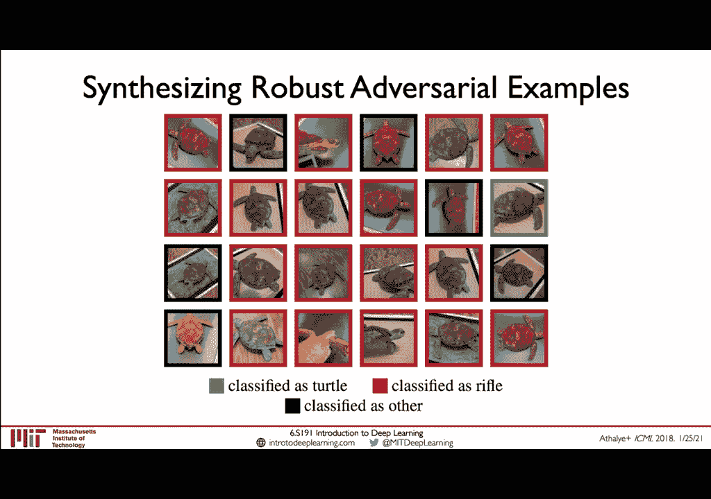

最后的限制，但可以肯定的是我想在本次讲座中介绍，但当然不能，总体而言，深度学习的最终局限性在于算法偏差的局限性，这是一个主题，并且，一个值得理所当然的问题最近引起了很多关注，这也将是。

我们第二个热门话题讲座的重点，这种算法偏差的思想围绕着，神经网络模型和人工智能系统更容易受到影响的事实，因他们的构建方式，他们对数据进行训练而产生的偏见，关键是这些偏见会导致非常真实的社会后果。

所以我们将，在明天的聚光灯下讨论这个问题，应该非常令人兴奋，所以这些仅仅是。

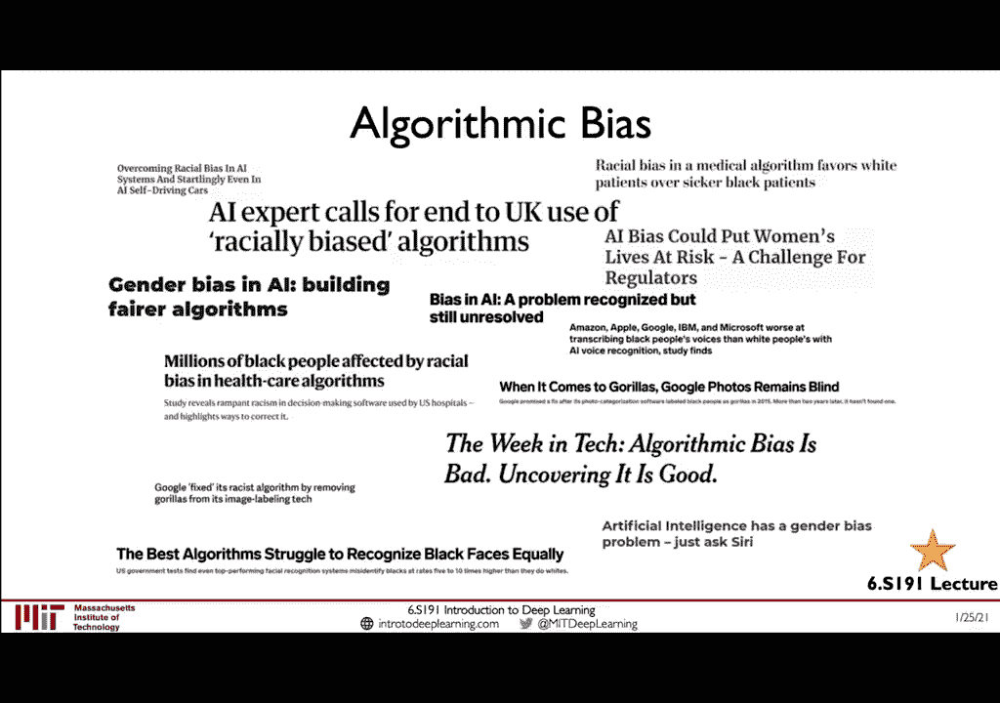

神经网络的许多局限性，但这当然不是详尽无遗的清单。

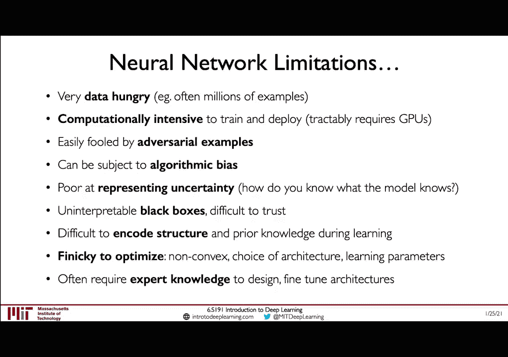

我很高兴再次强调我们将重点关注其中两个限制，下两个即将到来的焦点演讲中的不确定性和算法偏差。

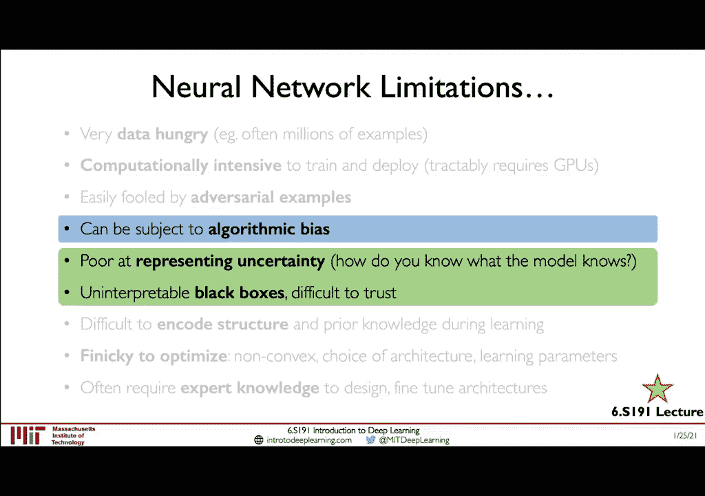

在本演讲的其余部分还可以，我想专注于正在出现的一些真正令人兴奋的深度学习新领域，旨在解决这些限制中的一些问题，特别是，神经网络被视为黑盒子系统，它们缺乏某种领域知识，并且，结构和先验知识。

最后是我们如何实际解决这个更广泛的问题，从头开始设计神经网络是否需要专业知识，以及如何为更广泛的机器学习创建更通用的管道。

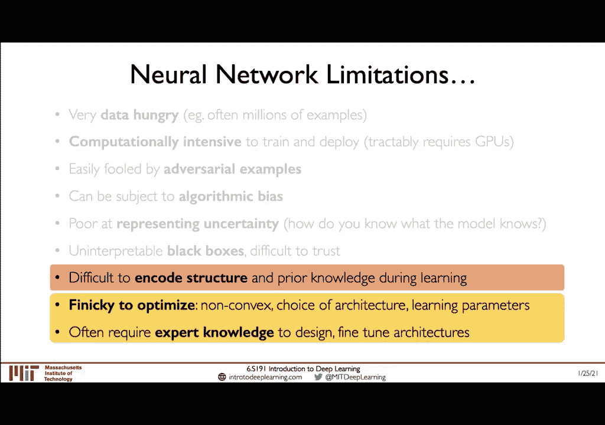

好吧，我们要研究的第一个新领域是如何编码结构和域。

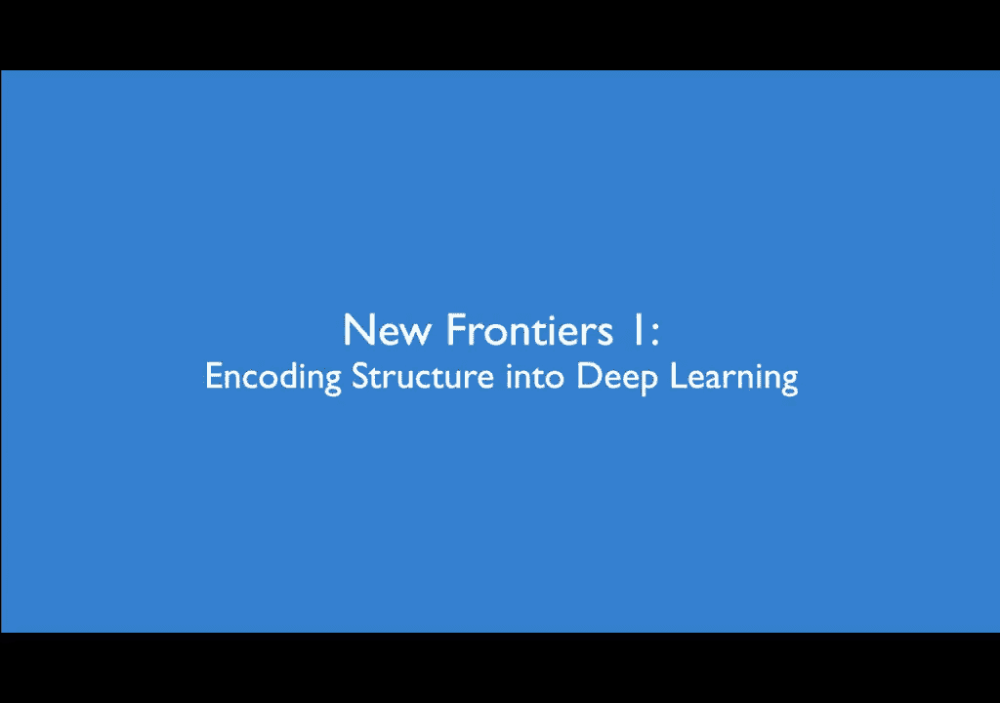

深度学习架构方面的知识要退后一步，我们实际上已经看到了，我们在卷积神经网络研究中的例子，cnns受到视觉处理被认为在大脑中起作用的方式的启发，引入cnns和cnns来尝试捕获数据中的空间依赖关系。

这是关键在于，启用它是卷积运算，我们看到并讨论了如何使用，卷积以提取数据中存在的局部特征以及如何应用不同的集合，过滤器以确定不同的特征并在空间数据之间保持空间不变性。

这是如何在空间上定义问题图像数据结构的一个关键示例，启发并导致了将编码结构转化为神经网络体系结构的进步，真正针对该问题或感兴趣的问题真正调整该体系结构，超越图像数据或序列数据的事实是，我们周围都存在。

是具有不规则结构的数据集和数据问题，实际上可能存在，图和网络的范式是其中非常丰富的一种，可以在图形或网络中编码的结构信息可能非常重要，解决正在考虑的问题，但不一定清楚我们如何建立神经网络。

网络架构可能非常适合对以图形表示的数据进行操作，因此，哪种类型的数据或哪种类型的示例可以自然地将其表示为图形，我们都沉浸其中并熟悉的一种社交网络，除此之外，您还可以想到状态机。

它们定义了不同状态之间的转换。能够由人类活动的图形或模式表示的系统，运输化学分子，您可以想到分子中的各个原子，作为图中通过连接那些原子生物网络的键连接的节点。

所有这些实例和图形作为一个更广泛的结构所具有的共性是由。

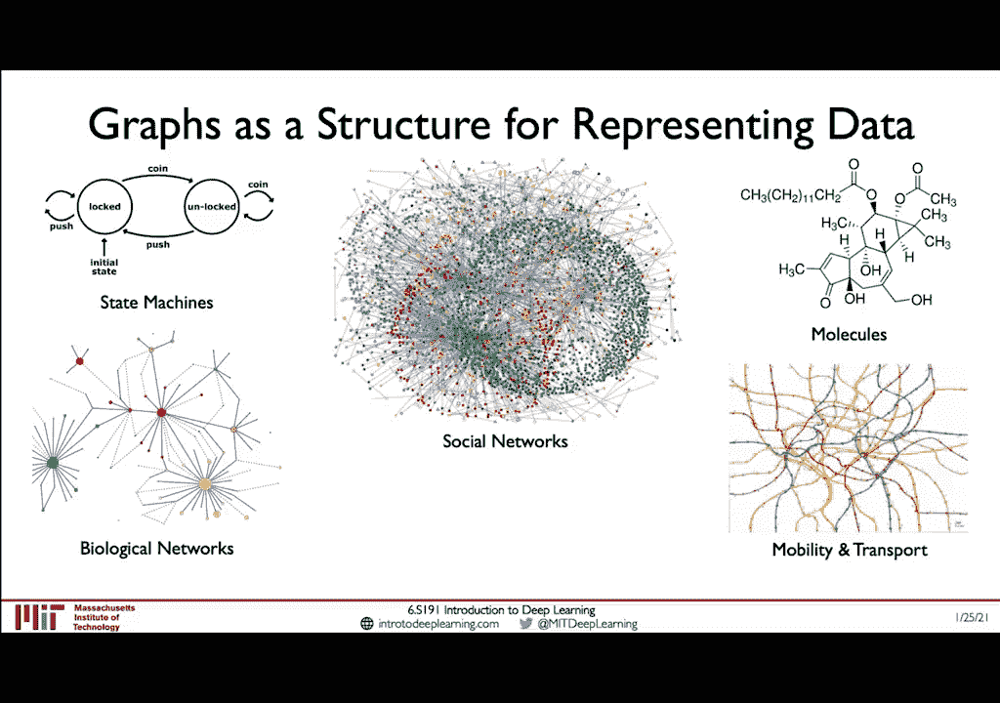

感谢有如此多的现实世界数据示例和应用程序这一事实，其中存在无法通过简单的简单数据编码轻松捕获的结构，例如，图像或时间序列，所以我们将讨论图作为结构，可以为一系列问题提供新的非标准编码，好吧。

看看我们如何做到这一点并建立这种理解，让我们回到网络，在熟悉cnn和您可能知道之前已经见过的架构，我希望您现在知道在cnn中，我们已经有了卷积核，并且，cnn层中卷积运算的工作方式是我们滑动此矩形核。

在我们的输入图像上，以便内核可以提取内部内容和此操作，由我们先前回顾的逐元素乘法和加法驱动，因此，如果您有正确的图像，请逐步完成此步骤，卷积核就是，通过将滤镜的权重集应用于图像，可以有效地在图像上滑动。

在整个图像上不断重复进行此操作，cnns背后的想法是根据特定的权重集设计这些过滤器，我们可以选择数据中存在的不同类型的功能，图卷积网络在一个非常相似的思想上运作，但是现在，而不是在2D图像上进行操作。

网络正在对以图形表示的数据进行操作，其中的图由此处以圆圈显示的节点和以线条显示的边缘以及以边显示的边缘定义，边定义了图中节点之间的关系，关于如何提取的想法。

该图上的信息在原理上与我们将要看到的cnns非常相似，再次取一个内核，它只是一个权重矩阵，而不是在2d上滑动该内核，我们的图像的2D矩阵表示，内核将弹出并四处移动，到图形中的不同节点，并且这样做。

它将查看的本地邻域。该节点，并选择与该节点在图中的本地连通性相关的功能，这就是图卷积运算，我们现在可以从网络中学到，定义与捕获边缘的过滤器关联的权重，图中存在相关性，因此让我们逐步了解权重核。

去到不同的节点，它会看看它的紧急邻居，图卷积算子将要关联权重然后与每个边，存在，并将在图上应用这些权重，以便随后移动内核，到图中的下一个节点，以提取有关其本地连接的信息，在继续执行此操作时。

将其应用于图和键中的所有不同节点，是本地信息将被汇总，而神经网络将，然后学习将本地信息编码为更高级别表示的函数，所以这是一个非常简短和直观的介绍，希望能对神经图进行确认，网络原理上如何运作。

这是一个非常令人兴奋的网络架构，现在已经实现了巨大的进步，在各种科学领域，例如化学科学和分子发现，有一种称为消息传递网络的图神经网络，非常成功地部署在基于二维二维图形的化学结构表示中。

这些消息传递网络建立了原子和化学的学习表示，这些相同的网络基于化学结构中存在的键和关系，图神经网络最近被用于发现一种新的抗生素和一种新药，我认为在细菌感染的动物模型中可以有效杀死耐药菌。

当我们开始看到这些深度学习系统时，这是一个非常令人兴奋的研究途径，和神经网络架构在生物医学领域中的另一新近应用，非常激动人心的应用领域是移动性和交通预测，因此在这里我们可以走上街头，将它们表示为分解。

将其表示为节点，并对交叉点和，通过节点和边定义连通性网络的图形表示的街道网络区域，团队所做的就是建立该图神经网络表示，学习如何预测道路系统之间的交通模式，实际上，这种建模可以。

改进了事物中预计到达时间的预测能力，以及Google界面等地图的另一个非常近期且高度相关的示例，神经网络正在预测covin-19疾病的蔓延，并且有一些群体，已经考虑合并两种地理数据。

以便了解有关人的居住地和居住地的信息。定位他们可能要连接的人以及有关该人的时间数据信息，随时间的运动和轨迹，并以此作为对神经网络进行图形化处理的输入，由于该数据的时空成分，已经完成了该图。

神经网络已与时间嵌入组件集成在一起，以便他们可以学习，不仅基于空间地理联系来预测covid19疾病的传播，和邻近性，但在时间模式上，我们可能会遇到的另一类数据是。

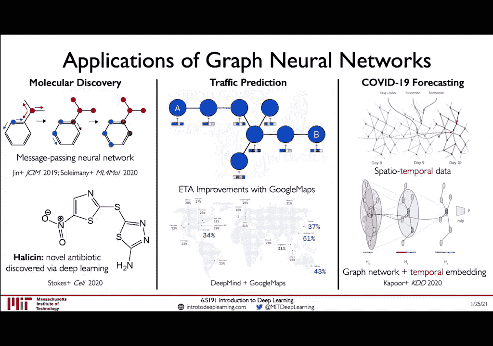

三维数据的点集，通常称为三维点集，作为点云，这是图神经网络的相同思想所在的另一个领域，促成许多强大的进步，因此，首先请欣赏一下，必须了解这些三维数据集的确切外观，这些点云实际上是空间中无序的数据点集。

点之间存在一些潜在的空间依赖性，因此您可以想象，这些对象的三维结构的基于点的表示形式，然后根据这些数据训练神经网络来完成许多相同类型的任务，和我们在计算机视觉讲座中看到的问题，因此分类采用了点云。

将其识别为对象，并将其作为带点云的特定对象分割，分割出属于特定对象或特定对象的点云实例。

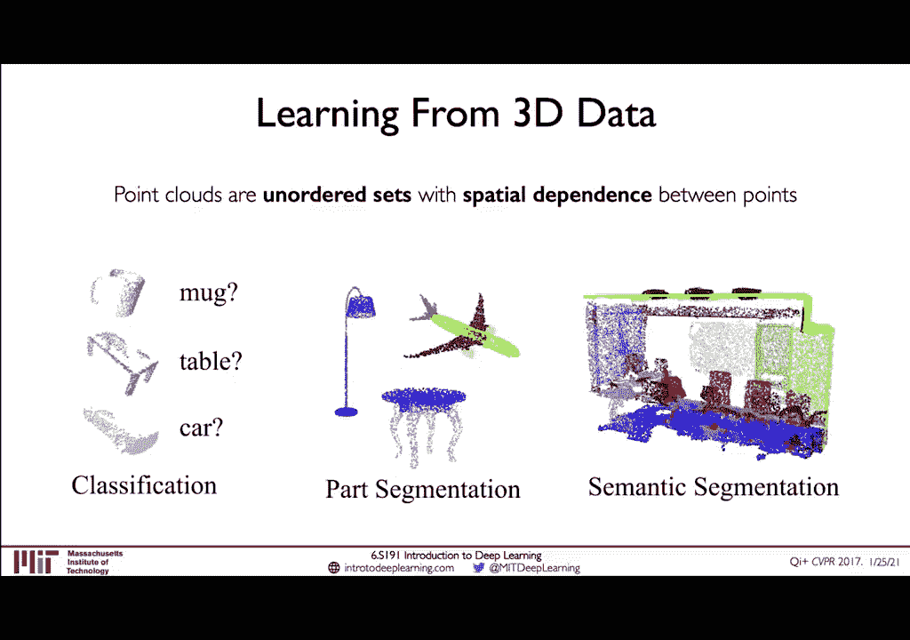

内容类型，我们能做的就是扩展图卷积网络以使其能够运行。

指向云，我认为超级棒的方法是采用点云，使用点云固有的网格将其展开并动态计算图形，然后。

这个例子显示了这种兔子结构，我们从这里开始，点云扩展，然后在此3d网格中定义本地连接uh。

因此我们可以应用图卷积网络对，3d空间中点的顺序，并且仍然可以捕获此类数据系统的局部几何形状。

希望如此，这使您对我们可以开始的不同类型的方法有所了解，考虑编码结构内部神经网络架构超越，我想在第二个新领域的前五节演讲中看到的架构，在本演讲的其余部分中，我们将重点讨论并讨论如何学习。

我认为这是一个非常强大且发人深省的，深度学习研究领域，它产生了一些有趣的问题，我们可以将机器学习和人工智能系统的功能推向多远和多深。

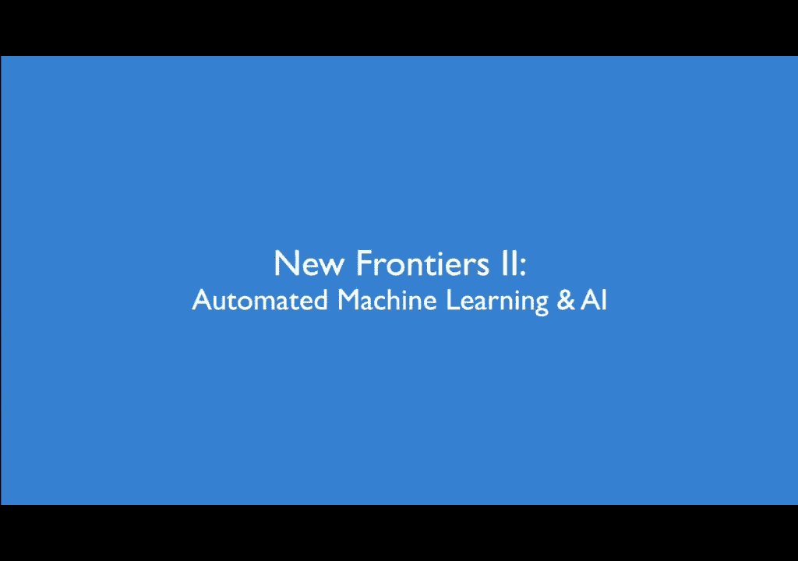

现在称为自动机器学习或自动毫升的这一领域背后的动机，事实上，标准的深度神经网络架构已针对以下方面的性能进行了优化：一个单一的任务，为了建立新的模型，我们需要某种领域的专业知识和专家知识。

尝试定义一种非常适合特定任务的新架构，自动化机器学习背后的想法是，我们可以超越这种调整吗？为单个任务而健壮地优化特定体系结构，我们可以超越此范围来构建吗？

可以实际学习用于解决给定问题的最佳模型的更广泛算法，问题以及我们在最佳模型或使用哪种模型方面的含义是它的体系结构，对于该问题而言，最优的是与该架构相关的超参数，例如数量，每一层的神经元数量也进行了优化。

整个系统，是通过aa算法建立和学习的，这就是automl的想法。

在原始的automl作品中，代表自动化机器学习原始作品，使用了基于强化学习的框架，其中有一个神经网络，称为控制器，在这种情况下，该控制器网络是递归神经网络，控制器的作用是提出一个示例模型架构。

称为子架构，架构，该架构将由一组超参数定义，然后可以对生成的体系结构进行培训，并评估其在特定环境下的性能，感兴趣的任务然后将该子网络的性能反馈用作，在这个强化学习框架中获得奖励，以尝试提升并告知控制者。

关于如何实际改善其网络建议以进行下一轮优化，所以这个循环过程被重复成千上万次，从而产生了新的架构，测试它们，将反馈信息反馈给控制器，以进行构建并从中学习，最终，控制器将趋向于将高概率分配给hyper。

实现更高精度的架构搜索空间的参数和区域，感兴趣的问题，并将对搜索空间的那些区域分配低概率，表现不佳，那么此代理如何工作，该控制器代理如何实际工作，从宏观上看，这将是一个基于rnn的架构，其中。

在此管道的每个迭代的每个步骤中，模型都是该控制器模型要采样的，一个全新的网络架构，并且该控制器网络将专门用于，优化以预测与该子网络关联的超参数，因此，例如，我们可以考虑对特定层进行优化。

优化将涉及与该层关联的超参数的预测，就像卷积层一样，过滤器的大小，步幅的长度，依此类推，以此类推，然后生成的结果网络就是生成的子网络，由这些预测的超参数定义的将被测试，训练和测试，这样，在评估之后。

我们可以得出结果的准确性并更新经常性，神经网络控制器系统，基于子网络在我们的任务上的执行情况，然后rnn控制器可以学习创建更好的模型，并且非常适合，强化学习框架，我们的控制器网络的代理将在其中。

根据产生该想法的子网络的性能进行奖励和更新，现在已经扩展到许多不同的领域，例如最近在，与产生子网络的控制器网络相同的原理进行图像识别，然后经过测试评估以改进控制器，以用于设计优化的控制器。

设计这种范式的神经网络，用于图像识别，设计架构可以看作是神经架构搜索，在这项工作中，控制器系统用于构造和设计用于整体的卷积层，在图像识别任务上经过测试的体系结构这张左侧的图描述了。

卷积层中卷积单元的学习结构实际上看起来像和，这项工作真正真正意义非凡的是，他们评估的是他们的结果，他们在评估这些神经网络的性能时发现了设计的神经网络，我知道这有点令人费解，但让我们考虑一下这些结果。

所以首先在这里用黑色，我在图像上显示了人类设计的最先进的卷积模型的准确性，识别任务，如您所见，y轴刻度显示的精度为，X轴上以百万为单位的参数数量引人注目是，将这些人为设计模型的性能与。

这些神经设计的神经体系结构在此处以红色显示的automl算法取得了卓越的性能，与人为设计的系统相比精度更高，参数相对较少，这种使用机器学习的思想，即通过深度学习来学习更多的通用系统，或者。

用于预测建模和决策的更一般的范式是一种非常强大的功能，并且。

最近，人们对超越automl和Neuro产生了浓厚的兴趣，架构搜索，我们可以更广泛地将其视为自动完整的管道，从数据管理开始设计和部署机器学习和人工智能模型，数据预处理以进行模型选择和设计，最后进行部署。

这里的想法是，也许我们可以建立一个可以促进和自动实现的通用管道，加速和设计此过程的所有步骤。

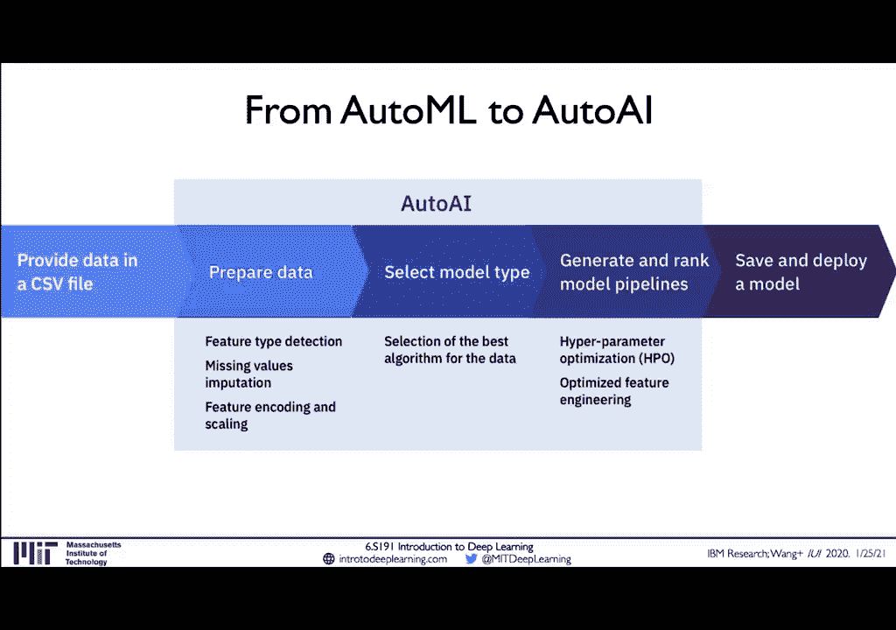

我认为这个想法产生了一个非常非常发人深省的观点，那就是我们可以，建立能够生成针对特定任务设计的新神经网络的人工智能系统，但是建立的高阶人工智能系统是一种超越特定任务的学习。

这不仅减少了我们作为经验丰富的工程师进行手工设计的需求，并优化这些网络，这也使这些深度学习算法更易于访问和使用，从广义上讲，我们开始考虑创意的意义和创造力的意义。聪明，当亚历山大介绍这门课程时。

他谈到了自己的想法，关于什么情报意味着能够利用情报来为将来的决策提供信息的能力，作为人类，我们的学习渠道绝对不限于针对非常具体的问题进行优化，赋予我们学习和解决问题的能力会影响我们的学习能力。

完全独立的问题，并提高了我们的分析能力，当今存在的模型和神经网络算法，当然不能扩展到这一点并无法捕捉到这种普遍性现象，我认为，为了达到真正的人工智能的目的，我们需要考虑周到。

真正的概括性和解决问题能力的含义，我鼓励您考虑这一点，以考虑automl如何auto ai，深度学习如何更广泛地融入到交叉路口的更广阔画面中，以及人工智能和人类智能之间的接口，所以我将留给您。

作为您在此过程中及之后的这一点上的反思点。

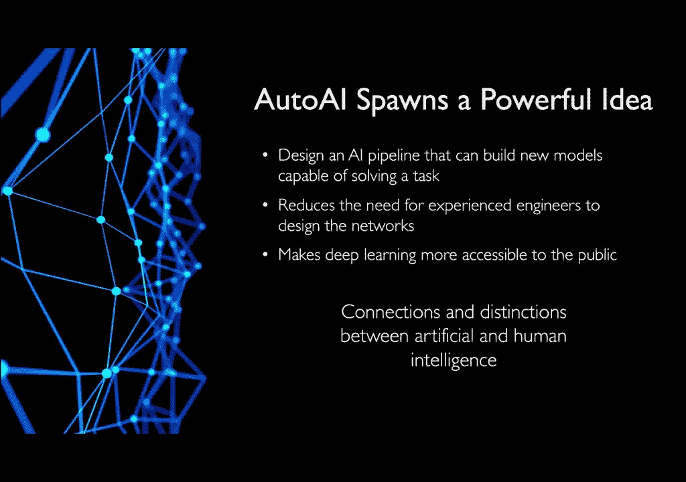

我将结束本讲座并提醒您，我们将拥有一个软件，实验室和办公时间会议，我们将专注于为您提供支持以完成工作，强化学习的最后一个实验室，但我们随时欢迎您的到来，与我们讨论，询问您的问题，与您的同学和队友讨论。

为此。

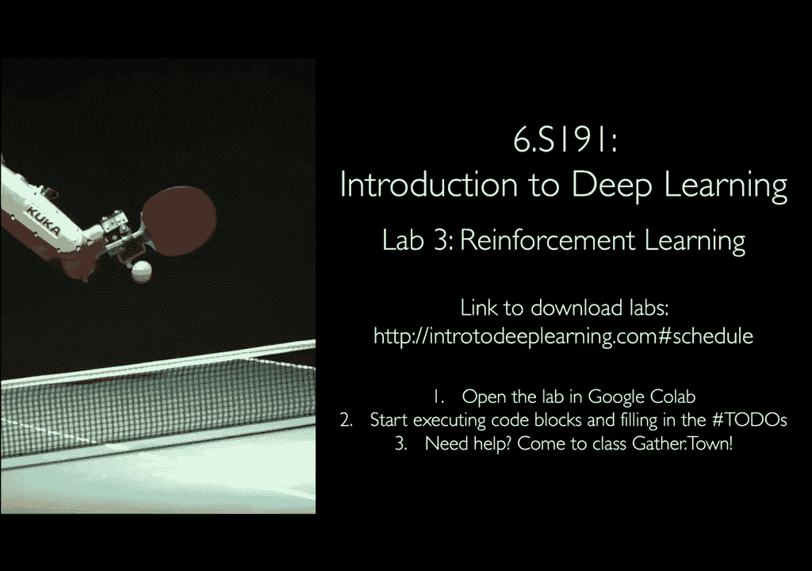

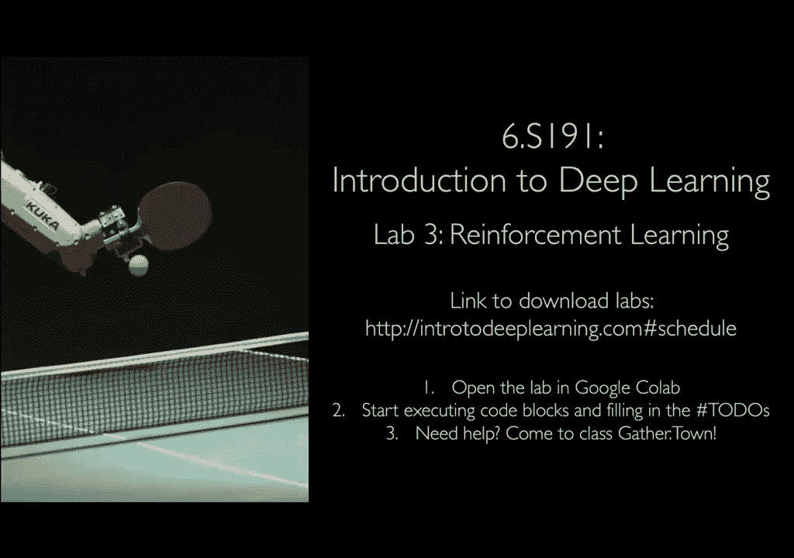