# 2：循环神经网络 (RNNs) 🧠

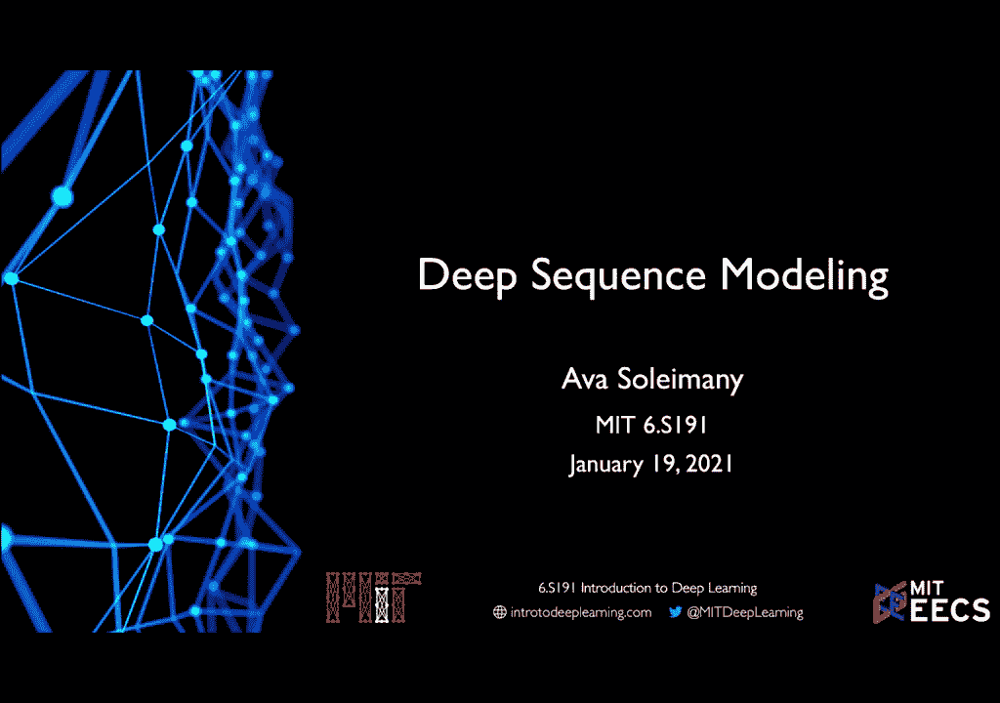

在本节课中，我们将要学习深度序列建模的核心——循环神经网络。我们将从直觉出发，理解为什么处理顺序数据需要特殊的网络架构，并逐步构建对RNN工作原理的数学和概念性理解。

## 从顺序数据开始

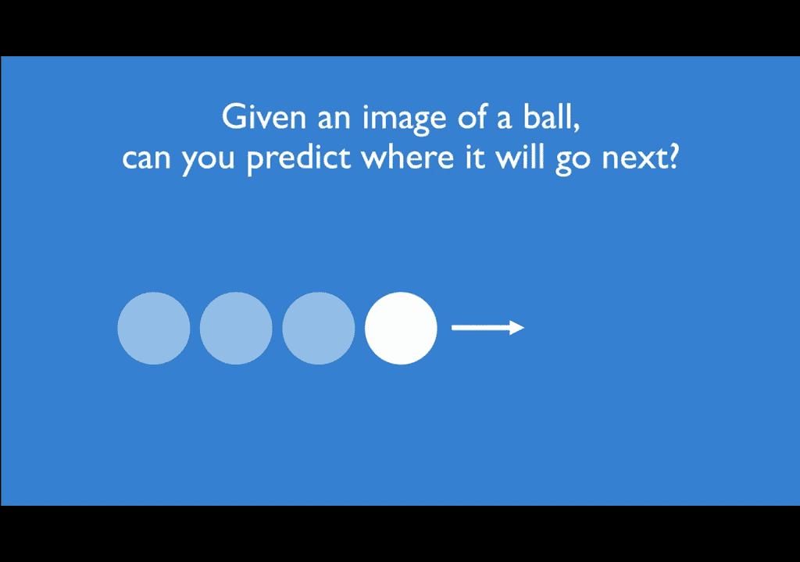

上一节我们回顾了前馈神经网络，本节中我们来看看什么是顺序数据。

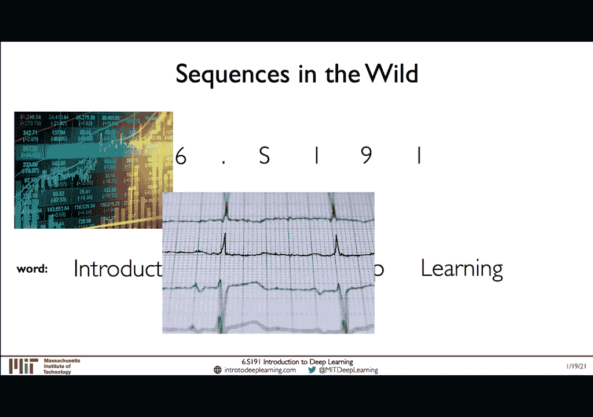

假设我们有一张照片，照片里是一个球，我们的任务是预测它下一个要去的位置。如果没有任何关于球的历史信息或运动动力学的先验知识，任何关于其下一个位置的猜测都仅仅是猜测。但是，如果除了球的当前位置，我们还知道它之前的位置，那么我们的预测任务就会变得容易得多。我们都能感觉到球将传向哪个位置。这个直观的例子展示了顺序建模和顺序预测的含义。

顺序数据确实广泛存在于我们周围。例如，来自语音的波形可以分解为一系列声波；文本可以分为字符序列或单词序列，其中每个字符或单词都可以被视为序列中的一个时间步。除了这些例子，还有许多其他场景涉及顺序处理，从医学信号（如心电图）到股票价格预测，再到基因组学数据等。

## 顺序建模的应用

现在我们已经了解了顺序数据的样子，让我们考虑一些在现实世界中发挥作用的具体应用。

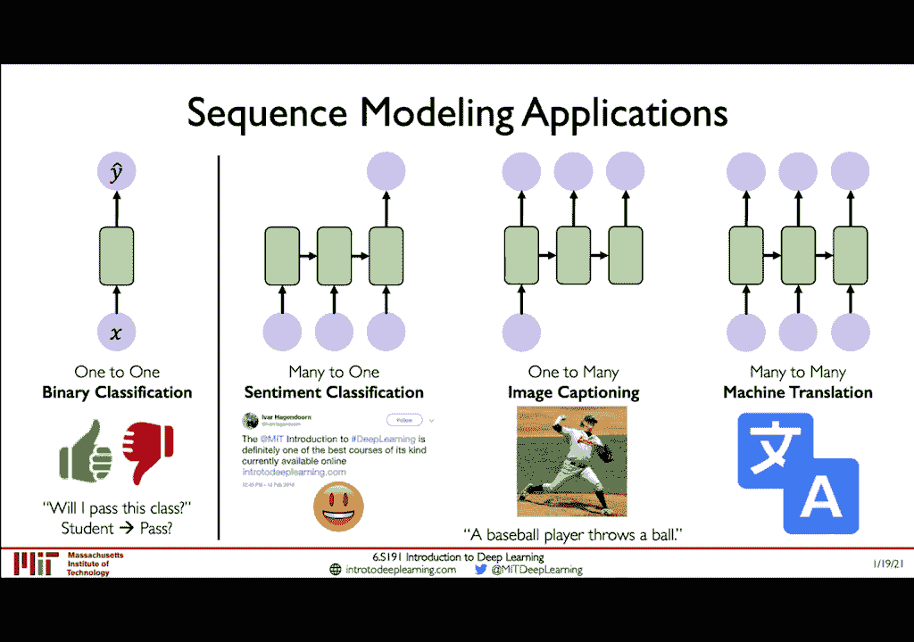

在第一堂课中，我们了解到前馈模型以一对一的方式处理固定的静态输入和输出，例如一个二元分类任务。那种例子中没有时间成分，没有序列或顺序数据的内在概念。

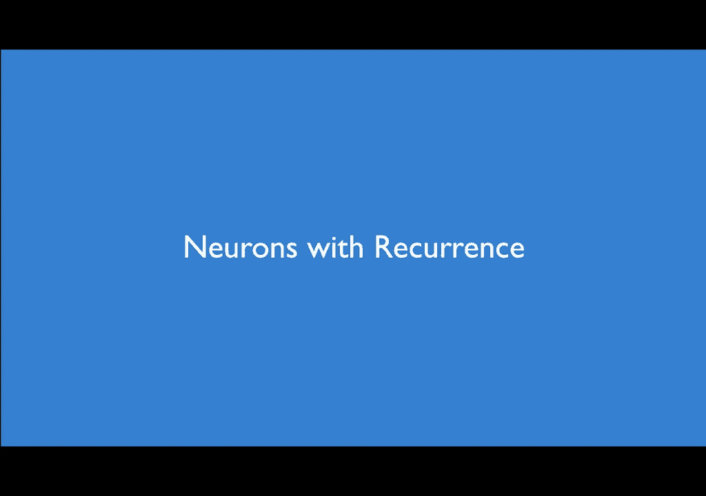

当我们考虑序列建模时，我们将可能性的范围扩展到了涉及时间输入以及潜在的顺序输出。例如，考虑一个语言处理问题，其中有一个句子作为模型的输入，句子中的单词按时间顺序排列。我们的任务是预测一个与该序列输入相关的情感或感觉输出。这可以被视为一个具有单个输出的序列输入问题，或者说是一个“多对一”的序列问题。

我们还可以考虑相反的情况：输入不具有时间维度，但输出是一个序列。例如，当我们处理一张静态图像时，任务是生成描述图像内容的句子标题。这可以被视为一个“一对多”的序列建模问题。

最后，我们还可以考虑从一个序列转换到另一个序列的“多对多”情况。最著名的例子之一是机器翻译，目标是训练一个模型将一种语言的句子翻译成另一种语言。

希望这些例子能让你具体感受到顺序建模变得非常重要的用例和应用。

## 构建处理顺序数据的神经网络

接下来，我们将了解如何实际构建神经网络来解决此类问题。有时候，理解如何为模型添加时间维度以解决顺序问题可能有些挑战。为了建立真正的直觉，我们将从最基础的部分开始。

我们将首先回顾感知器，然后一步一步地发展出对神经网络架构所需改变的理解，以便能够处理顺序数据。

### 回顾感知器与全连接网络

让我们回想一下在第一堂课中学习的感知器。我们定义了一组输入 `x1, x2, ..., xn`。这些数字中的每一个都将与一个权重矩阵相乘，然后全部加在一起形成感知器的内部状态 `z`。接着，将 `z` 传递给一个非线性激活函数，产生预测输出 `y`。

在本次讲座中，我们总体上考虑顺序建模，因此希望你将每个输入 `x_t` 视为序列中的一个单独时间步。

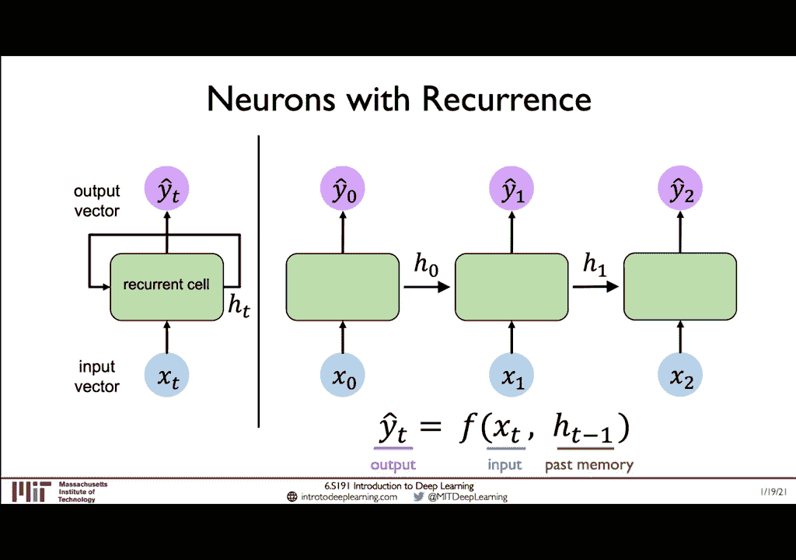

我们还看到了如何从单个感知器扩展到感知器层，以产生多维输出。例如，这里我们有一层绿色的感知器，接收蓝色的三个输入并预测紫色的四个输出。但这仍然没有时间或顺序的概念，因为输入和输出仍然被视为序列中一个固定时间步的数据。

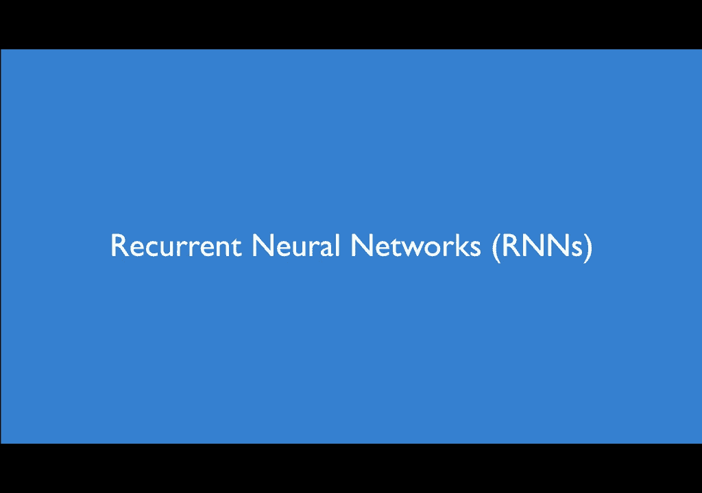

让我们简化这个图。我们将隐藏层折叠到一个绿色框中，输入和输出向量如图所示。输入 `x` 是一个长度为 `m` 的向量，输出 `y` 是一个长度为 `n` 的向量。我们仍然在考虑特定时间 `t` 的输入，这与第一堂课中看到的没什么不同。

### 朴素方法及其局限

即使使用这种简化的前馈网络表示，我们也可以天真地尝试通过一次又一次地应用同一模型来处理序列。对于我们序列中的每个时间步 `t`，都有一个输入向量 `x_t`，我们将其输入网络，并在该时间步获得输出向量 `y_t`。

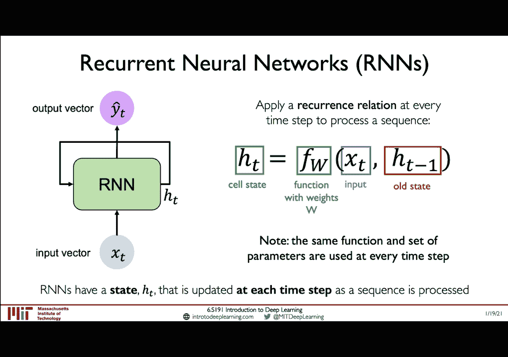

由于我们对顺序数据感兴趣，假设我们不仅有单一时间步，而是有多个独立的时间步。从时间 `t=0`（序列的第一步）开始，我们可以将其视为一个孤立的时间点，将其传入模型并生成一个预测输出。然后，我们可以在下一个时间步 `t=1` 再次进行同样的操作。

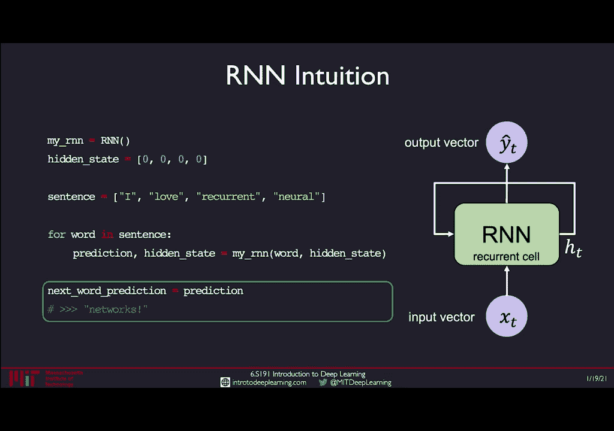

这里要强调的是，所有这些模型都只是彼此独立的副本，它们在不同的时间步接收不同的输入。我们知道，输出 `y_t` 只是该时间步输入 `x_t` 的函数。但如果我们考虑顺序数据，很有可能稍后的输出或标签会以某种方式依赖于先前时间步的输入。因此，将这些时间步视为单独的、孤立的点，我们忽略了序列中较早输入的数据对较晚预测数据的内在关系。

### 引入记忆：循环神经网络 (RNN)

我们真正需要的是一种关联计算的方法，将网络在特定时间步之前的历史操作与当前输入结合起来，并能够将当前信息传递到未来的时间步。

因此，我们尝试链接不同时间步的信息和网络计算。具体来说，我们引入一个内部记忆或单元状态，在这里我们将其表示为 `h_t`。这种记忆将由神经元和网络本身维持，并且可以跨时间步传递。

这里的关键思想是，这种递归关系捕获了关于序列的某种“记忆”概念。这意味着现在网络的输出预测及其计算，不仅是特定时间步输入的函数，还包括了用 `h` 表示的过去记忆的单元状态。换句话说，我们的输出依赖于当前的输入以及过去的计算和学习。

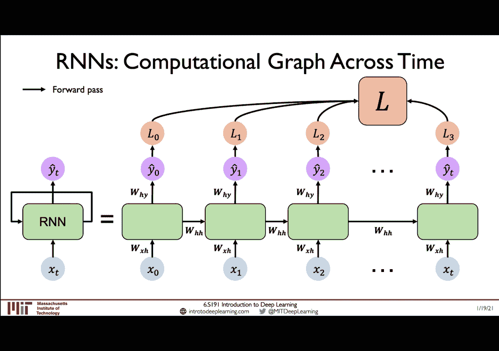

我们可以通过函数来定义这种关系，这些函数是标准的神经网络操作。因此，我们的预测输出 `y_t` 不仅是当前输入 `x_t` 的函数，也是过去记忆 `h_{t-1}` 的函数。这意味着我们可以通过递归关系来描述这些神经元：我们的单元状态 `h_t` 取决于当前输入 `x_t` 和先前的单元状态 `h_{t-1}`。

这种递归概念提供了循环神经网络背后的直觉和关键操作。我们将在此基础之上继续构建，并加深对定义RNN行为的数学和递归关系的理解。

## 正式定义循环神经网络 (RNN)

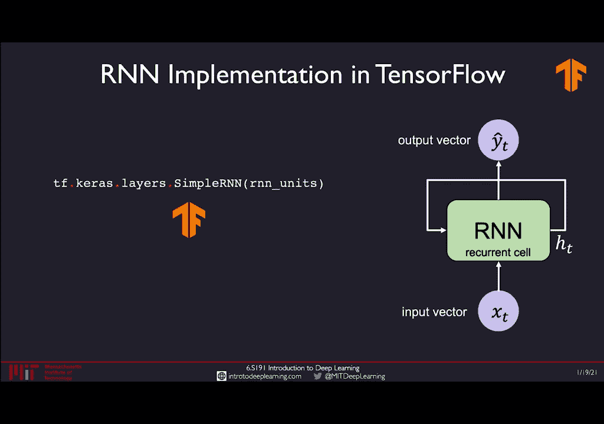

好的，让我们将此形式化。这里的关键思想是，RNN 维持一个内部状态 `h_t`，随着序列的处理，它在每个时间步被更新。这种更新通过一个递归关系完成。

具体来说，我们定义内部单元状态 `h_t`。这个内部单元状态将是一个函数 `f` 的输出，该函数由一组权重 `W` 参数化，这些权重是我们在训练网络过程中要学习的内容。函数 `f` 以当前时间步的输入 `x_t` 和先前的状态 `h_{t-1}` 作为输入。

RNN 的一个关键特征是，它们在处理序列的每个时间步时，使用相同的函数和相同的参数集。当然，在训练过程中权重会更新，但在每次前向传播时，相同的权重会应用于序列中的每个单独时间步。

## RNN 的前向传播算法

现在让我们逐步介绍更新 RNN 的算法，以更好地理解这些网络的工作方式。

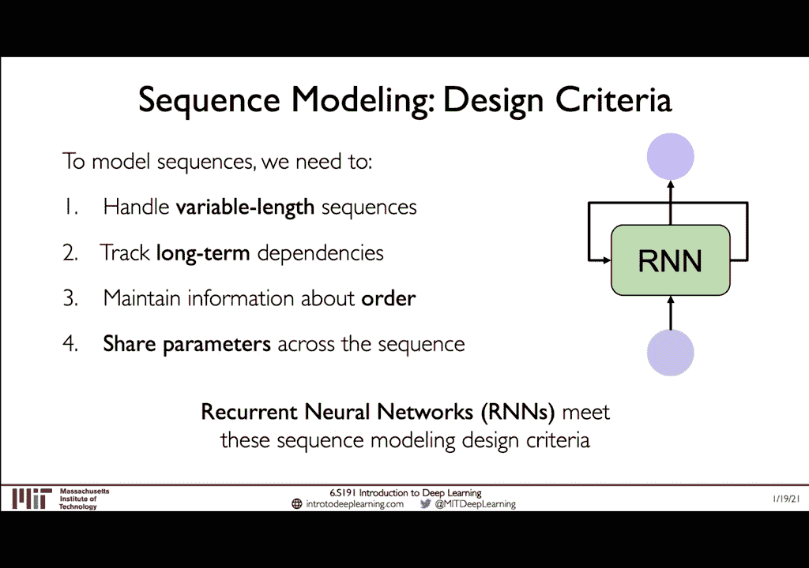

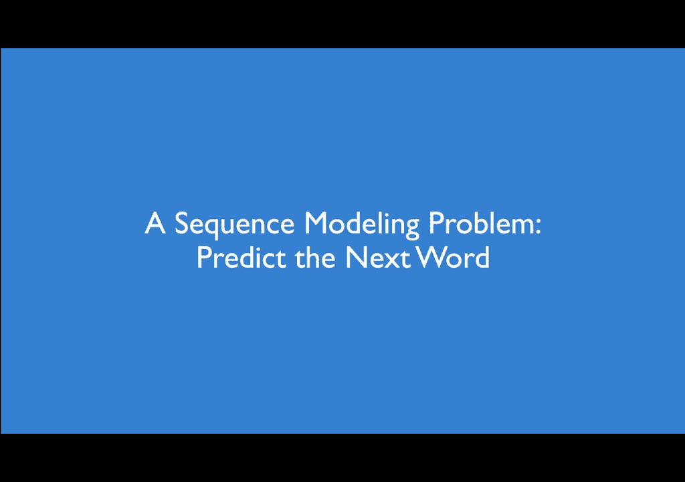

我们将从初始化网络开始（在伪代码中抽象为 `rnn`）。我们还将初始化一个隐藏状态 `h` 和一个句子。假设我们的任务是预测句子中的下一个单词。

RNN 算法如下：
1.  遍历句子中的每个单词。
2.  在每一步中，将当前单词 `word_t` 和先前的隐藏状态 `h_{t-1}` 输入到 RNN 中。
3.  RNN 将生成对下一个单词的预测 `y_t`，并更新隐藏状态为 `h_t`。
4.  当我们处理完句子中的所有词后，我们可以基于 RNN 的最终输出对下一个词是什么做出预测。

### RNN 的数学计算

RNN 的计算包括两个部分：内部单元状态 `h_t` 的更新和输出预测 `y_t` 的生成。

以下是具体步骤：

1.  **更新隐藏状态**：
    输入向量 `x_t` 和先前的隐藏状态 `h_{t-1}` 分别乘以各自的权重矩阵 `W_x` 和 `W_h`，然后相加，最后通过一个非线性激活函数（如 `tanh`）。
    **公式**：`h_t = tanh(W_x * x_t + W_h * h_{t-1} + b_h)`
    其中 `b_h` 是偏置项。

2.  **生成输出**：
    更新后的隐藏状态 `h_t` 乘以一个单独的权重矩阵 `W_y`，以产生输出预测。
    **公式**：`y_t = W_y * h_t + b_y`

这为您提供了 RNN 如何实际更新其隐藏状态并产生预测输出的数学基础。

我们已经看到 RNN 被描述为具有内部循环（关于自身的反馈）。我们还看到了如何将这个循环表示为一个在时间上展开的网络。在展开的图中，我们可以明确表示权重矩阵：
*   `W_x`：定义输入如何转换到隐藏状态计算中。
*   `W_h`：定义先前的隐藏状态与当前隐藏状态之间的关系。
*   `W_y`：在特定时间步将隐藏状态转换为输出。

对于所有这些权重矩阵，需要再次强调，我们将在序列中的每个时间步重复使用相同的权重矩阵。


当我们通过网络进行前向传递时，我们将在每个单独的时间步计算输出 `y_t`，并从这些单独的输出中得出损失 `L_t`。然后，我们可以将所有时间步的这些损失加起来，确定总损失 `L_total`。这个总损失最终将用于训练我们的 RNN。

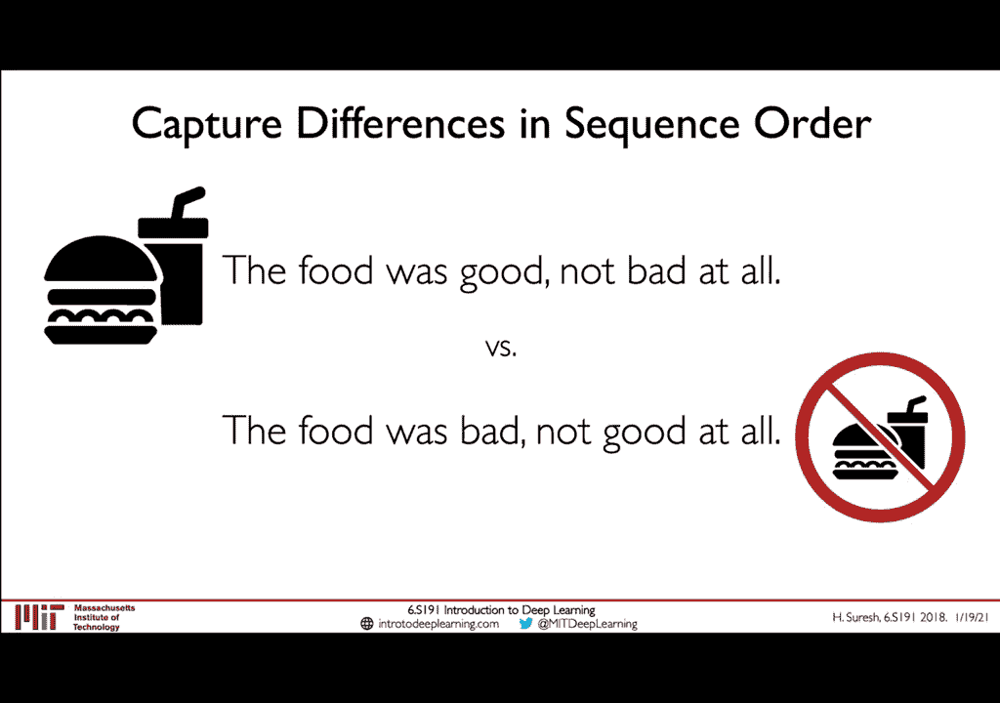

## 使用 TensorFlow 实现 RNN

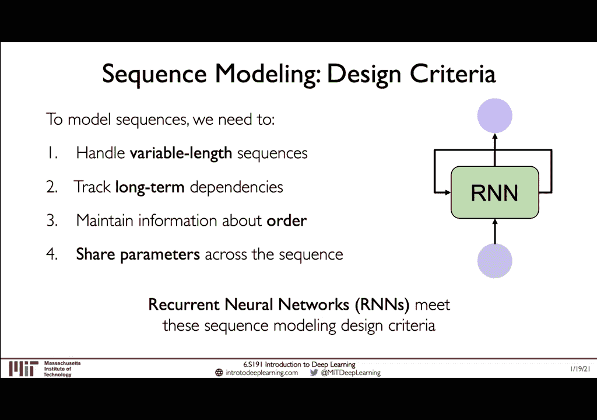

现在这为您提供了 RNN 前向传播的直观数学基础。让我们来看一个如何使用 TensorFlow 从头实现 RNN 的示例。

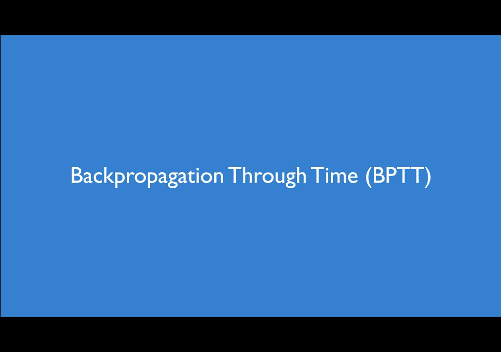

我们可以通过继承第一堂课中介绍的 `Layer` 类来定义一个 RNN 层。我们初始化权重矩阵，并将 RNN 的隐藏状态初始化为全零。

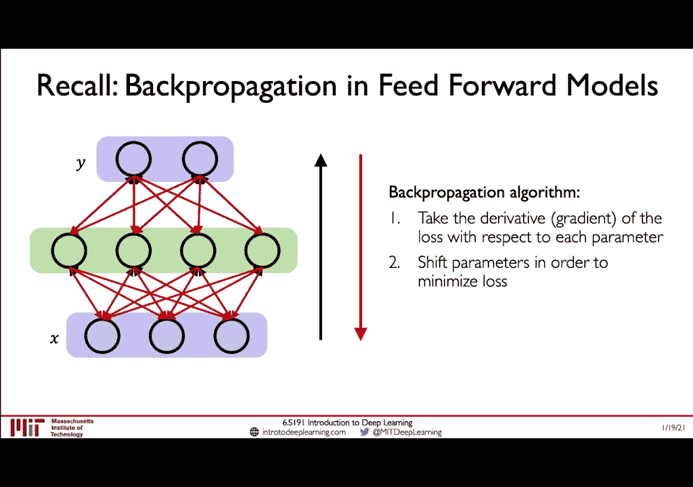

下一步是定义 `call` 函数，它准确地描述了在给定输入的情况下我们如何通过网络进行正向传递。

**代码示例（伪代码风格）**：
```python
class SimpleRNN(Layer):
    def __init__(self, units):
        super().__init__()
        self.units = units
        self.W_x = ... # 初始化输入权重
        self.W_h = ... # 初始化隐藏状态权重
        self.W_y = ... # 初始化输出权重
        self.h = tf.zeros(...) # 初始化隐藏状态

    def call(self, inputs):
        # 更新隐藏状态
        self.h = tf.tanh(tf.matmul(inputs, self.W_x) + tf.matmul(self.h, self.W_h))
        # 计算输出
        output = tf.matmul(self.h, self.W_y)
        return output, self.h
```

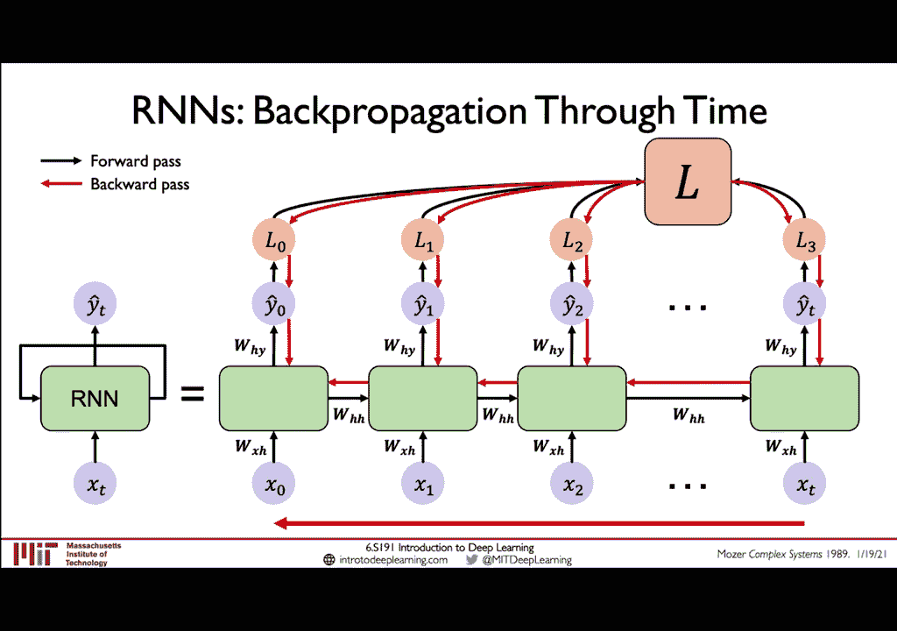

这给出了如何使用 TensorFlow 代码定义 RNN 前向传播的感觉。但 TensorFlow 已经方便地实现了这些类型的 RNN 单元，您可以通过 `tf.keras.layers.SimpleRNN` 层来使用它们。

## RNN 的应用回顾与设计标准

现在回顾一下，我们在本演讲的这一点上已经建立了对 RNN 及其数学基础的理解。我想回到前面讨论过的序列建模应用中。

希望现在您已经理解了为什么 RNN 特别适用于处理顺序数据，而前馈神经网络则以一对一的方式从静态输入变为静态输出。相反，我们可以从具有许多时间步的顺序输入开始，将它们输入递归神经网络，并生成单个输出（如情感分类）。我们还可以从静态输入（如图像）移动到顺序输出（如图像描述），或者从顺序输入到顺序输出（如机器翻译、音乐生成）。

为了真正理解为什么递归神经网络如此强大，我想考虑一组具体的设计标准，在考虑序列建模问题时需要牢记：

1.  **处理可变长度序列**：因为并非所有句子或序列都具有相同的长度。
2.  **跟踪长期依赖关系**：能够记住数据中较早发生的事件如何影响较晚发生的事件。
3.  **捕获顺序差异**：单词顺序的不同可能导致完全不同的含义。

递归神经网络通过权重共享和跨时间步重用相同的计算，符合所有这些序列建模设计标准。

## 实例：预测句子中的下一个单词

为了具体理解这些标准，让我们考虑一个非常具体的序列建模问题：给定一个句子中的单词序列，任务是预测该句子中最有可能出现的下一个单词。

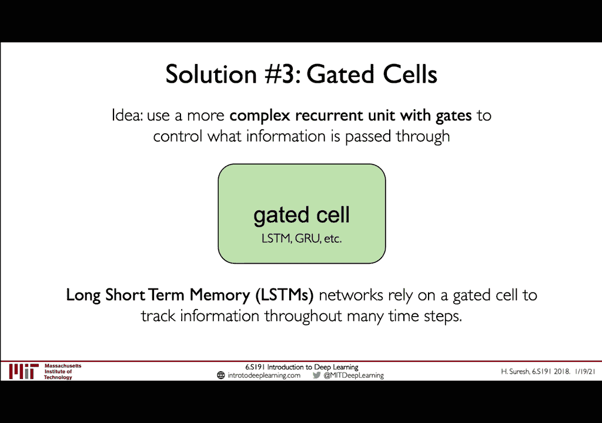

假设我们有这个句子：“今天早上我带我的猫去散步”。我们的任务是，给定“今天早上我带我的猫去了”，我们想预测句子中的下一个单词“散步”。

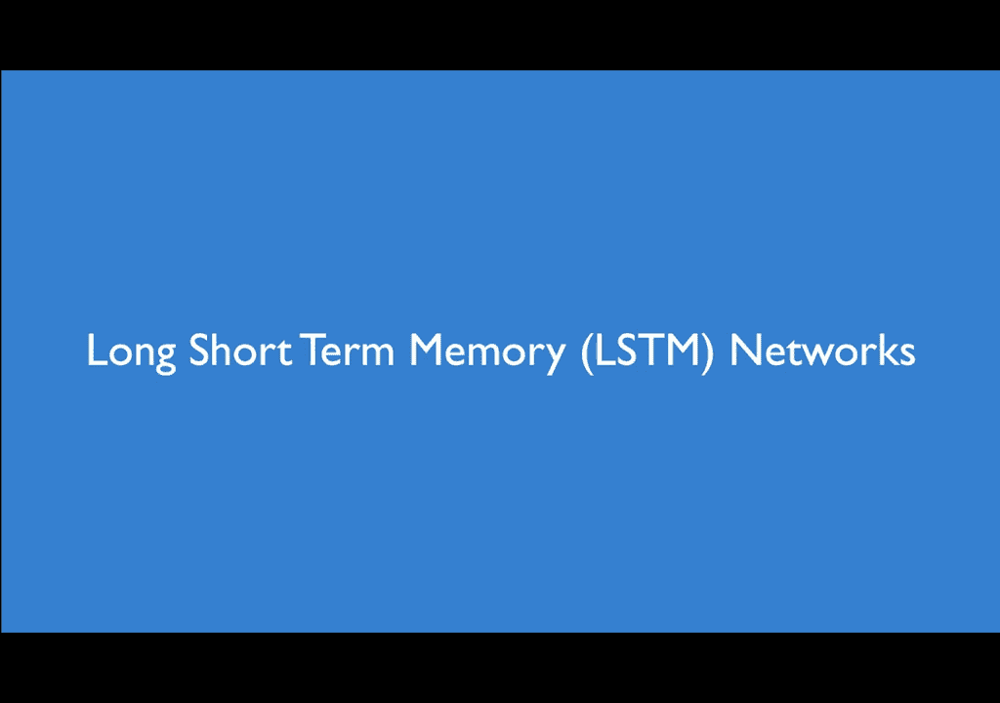

### 第一步：表示语言

解决这个问题的第一步，在开始训练模型之前，是考虑如何将语言表示为神经网络的输入。神经网络是函数运算符，对数值输入执行数学运算并生成数值输出。它们无法直接解释和操作作为文本的单词。

因此，我们需要一种将语言转换为向量或基于数组的表示形式的方法，以便神经网络可以对其进行操作。这涉及到**嵌入**的概念，即将一组标识符（如单词）映射到固定大小的向量中。

有两种常见的方法：
1.  **独热编码**：生成一个词汇表，包含语言中所有唯一的词。每个单词被映射到一个唯一的索引，然后该索引被表示为一个长度等于词汇表大小的稀疏二进制向量，其中对应单词的索引位置为 1，其余为 0。
2.  **学习嵌入**：将单词索引映射馈入一个神经网络模型，将其转换为低维空间中的向量。学习这些向量的值，使得语义相似的词具有相似的嵌入。

### RNN 如何满足设计标准

现在我们已经建立了将语言数据编码为适合输入神经网络向量表示的方法，让我们回到那组设计标准，看看 RNN 如何满足它们。

1.  **处理可变序列长度**：RNN 能够处理长度不一的输入，因为序列长度的差异只是 RNN 需要输入和处理的时间步数量的差异。这与具有固定维度输入的前馈网络不同。
2.  **捕获长期依赖关系**：在预测“散步”的例子中，我们需要知道序列中更早出现的“猫”这个词。RNN 能够做到这一点，因为它们通过递归关系更新其内部单元状态，从根本上将过去状态的信息合并到当前状态更新中。
3.  **捕获顺序差异**：考虑两个句子：“猫追老鼠”和“老鼠追猫”。它们语义相反，但单词相同，只是顺序不同。RNN 维持的细胞状态取决于其过去的历史，这有助于我们捕获这些差异，因为我们在序列的每个时间步都重用相同的权重矩阵并维护有关过去历史的信息。

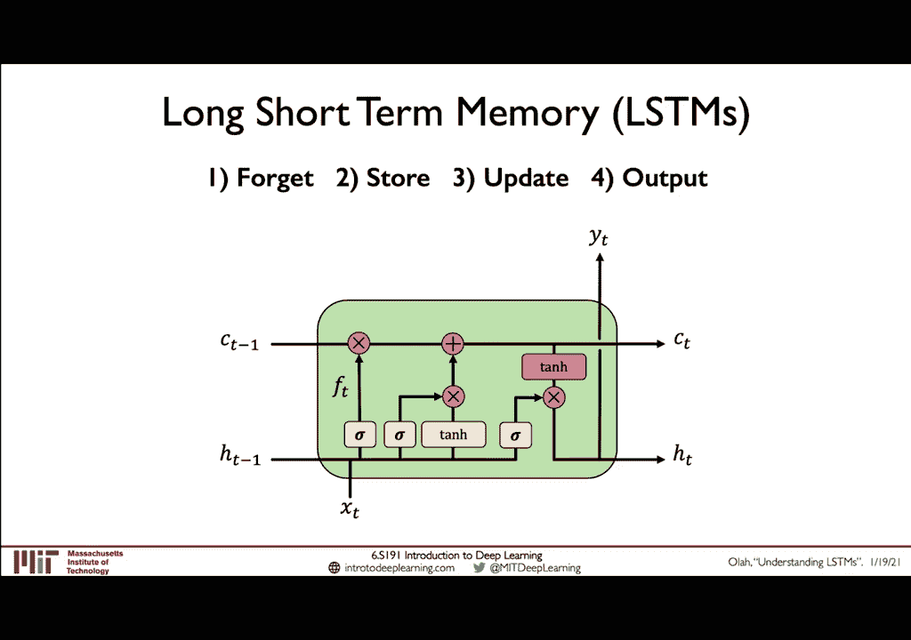

希望通过这个预测句子中下一个单词的例子，展示了如何表示和编码顺序数据（特别是语言数据）作为 RNN 的输入，以及 RNN 如何实现序列建模的设计标准。

## 训练循环神经网络：随时间反向传播

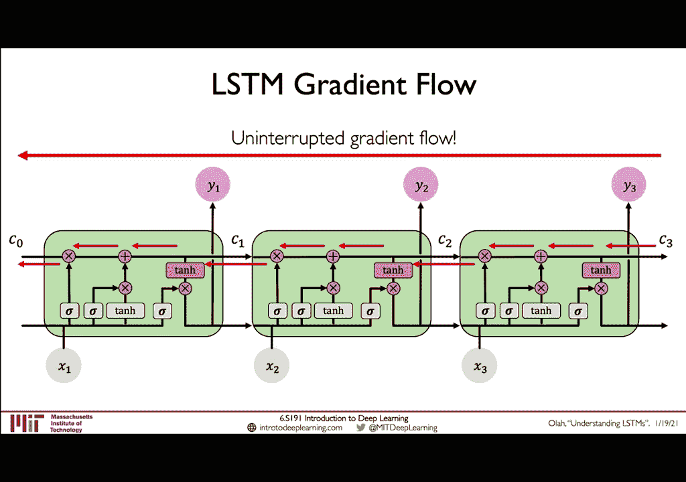

现在，在本演讲的这个阶段，我们已经建立了对递归神经网络如何工作以及序列建模含义的直觉和理解。现在我们可以讨论如何实际训练递归神经网络的算法。它是第一堂课中介绍的反向传播算法的一个变体，称为**随时间反向传播**。

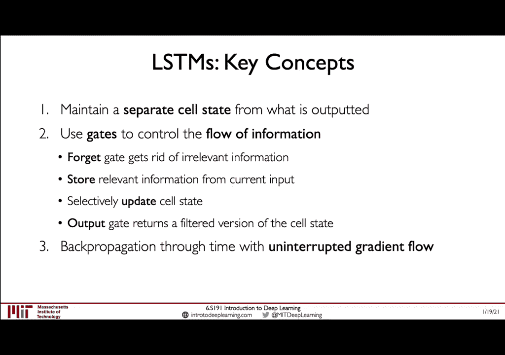

让我们先回顾一下如何使用反向传播算法训练前馈模型：
1.  我们首先接受一组输入，通过网络从输入传播到输出（前向传播）。
2.  然后，为了训练模型，我们通过网络向后传播损失梯度（反向传播）。
3.  我们计算损失相对于网络中每个权重参数的导数。
4.  然后调整模型中的权重参数，以最小化该损失。

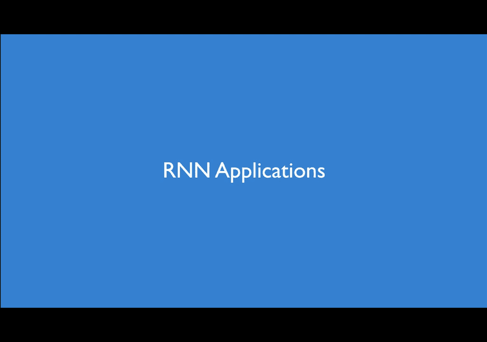

对于 RNN，前向传播是跨时间进行的：根据输入以及先前的状态更新单元状态，产生输出，并计算每个时间步的损失值。最后，将这些个别损失相加得出总损失。

在训练时，错误（梯度）不是通过单个前馈网络一次反向传播，而是从整体损失中传播回来，遍历每个单独的时间步，并且是从序列的末尾向开始反向传播。这就是为什么它被称为“随时间反向传播”。

### 梯度消失与梯度爆炸问题

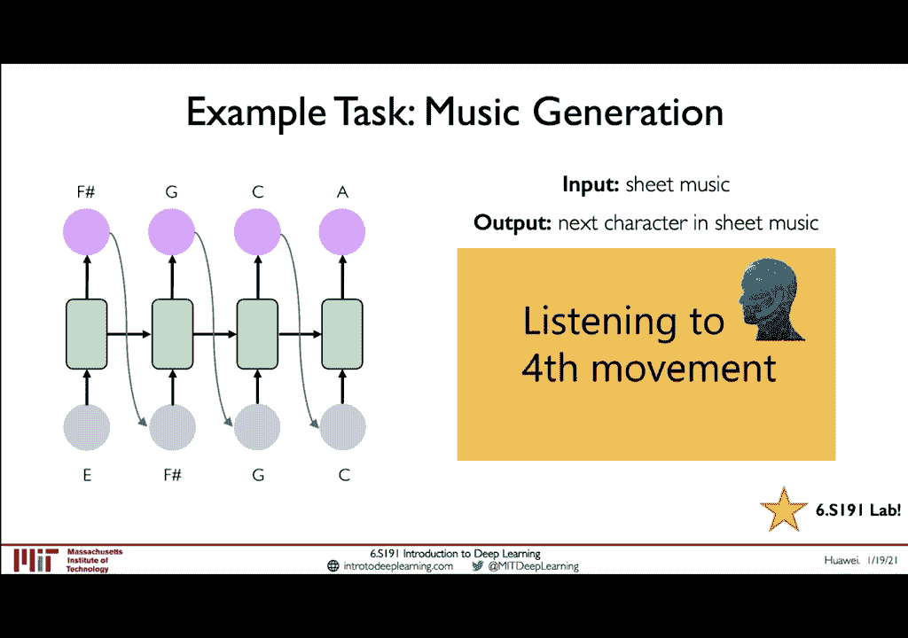

如果我们扩展这个范围，仔细研究梯度如何流过重复的 RNN 模块链，我们会看到在每个时间步之间，必须执行涉及隐藏状态权重矩阵 `W_h` 的矩阵乘法。因此，计算相对于初始细胞状态 `h_0` 的梯度将涉及许多权重矩阵的连乘。

这可能导致两个问题：
1.  **梯度爆炸**：如果权重值大于 1，梯度在连乘过程中可能变得非常大，导致优化不稳定。解决方案是**梯度裁剪**，即缩小特别大的梯度值。
2.  **梯度消失**：如果权重值或梯度非常小，梯度在连乘过程中可能变得几乎为零，导致网络无法有效地训练，尤其是难以学习长期依赖关系。

梯度消失问题意味着，越来越难以将损失函数中的错误传播回遥远的过去，因为梯度变得越来越小。这导致网络的权重和参数产生偏差，使其更擅长捕获数据中的短期依赖性，而不是长期依赖。

### 解决梯度消失问题

为了解决梯度消失问题，我们可以采用三种方法：
1.  **巧妙选择激活函数**：例如使用 ReLU 激活函数，其导数对于正输入为 1，有助于梯度流动。
2.  **巧妙初始化权重矩阵**：例如初始化为单位矩阵，以防止梯度迅速缩小为零。
3.  **改进网络架构**：使用更复杂的循环单元，如**门控循环单元**，能更有效地跟踪数据中的长期依赖性。

今天我们将专注于一种特定类型且最广泛使用的门控单元：**长短期记忆网络**。

## 长短期记忆网络 (LSTM)

LSTM 的最酷之处在于，使用 LSTM 构建的网络特别适合更好地维护数据中的长期依赖关系，在多个时间步长上跟踪信息，以克服梯度消失问题，并能更有效地对顺序数据进行建模。LSTM 实际上是深度学习社区用于大多数顺序建模任务的主力军。

LSTM 背后的关键思想是，它们可以有选择地添加或删除内部单元状态中的信息，这是通过称为“门”的结构实现的。这些门由标准的神经网络层（如 `sigmoid` 激活层和逐点乘法操作）组成。

`sigmoid` 函数将输出压缩到 0 和 1 之间，因此可以将其视为调制有多少信息应该通过。LSTM 使用这种操作通过以下步骤处理信息：
1.  **忘记门**：决定从先前状态中丢弃哪些信息。
2.  **输入门**：决定哪些新信息将被存储到单元状态中。
3.  **更新单元状态**：结合忘记门和输入门的信息，更新旧的单元状态到新的单元状态 `C_t`。
4.  **输出门**：基于更新后的单元状态 `C_t`，决定输出什么。

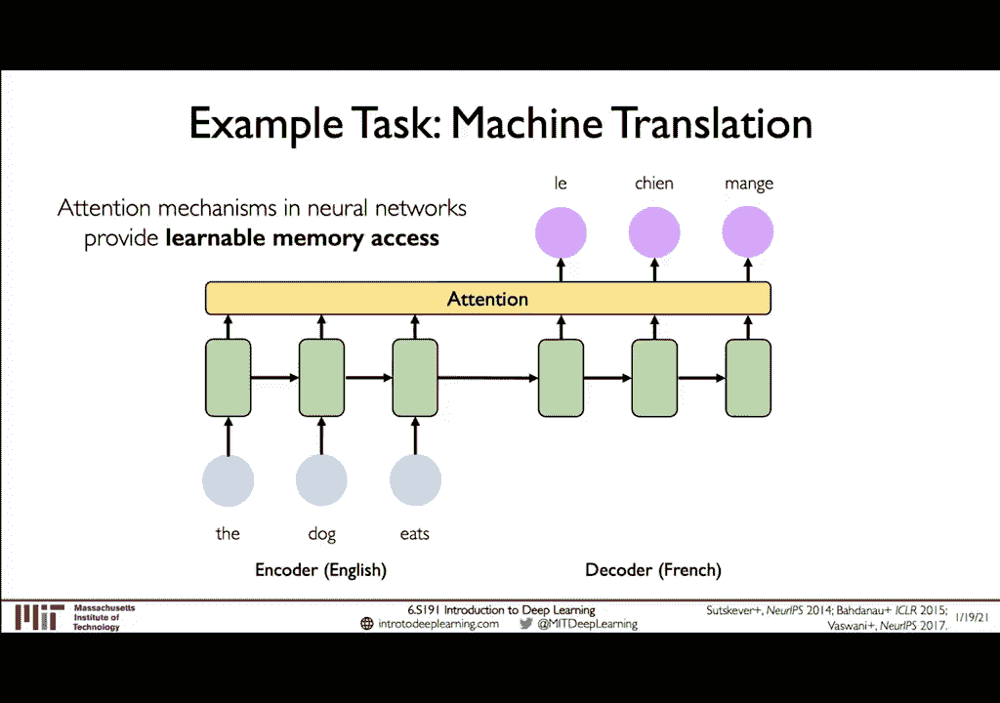

LSTM 保持一个独立的单元状态 `C_t`，与隐藏状态 `h_t` 分开。正是对这个独立单元状态 `C_t` 的维护，允许梯度在随时间反向传播时有一个更不间断的流动路径，从而实现了更高效、更有效的训练。

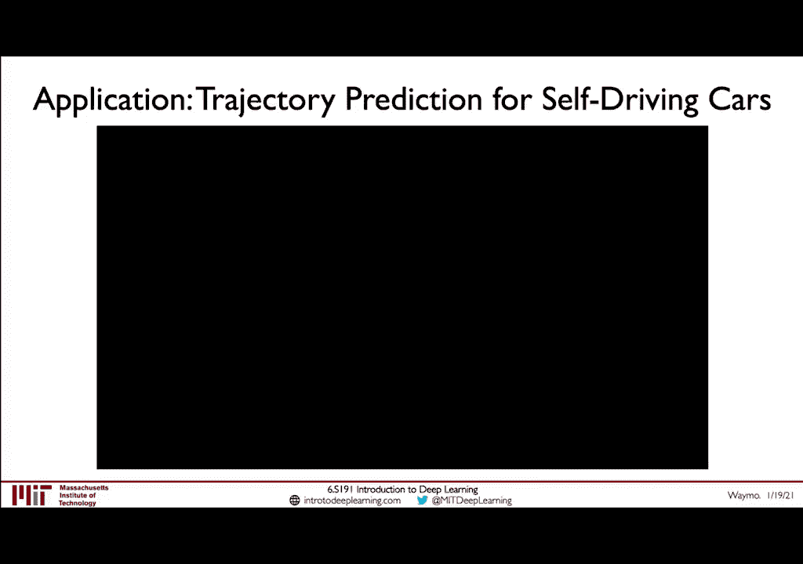

因此，LSTM 通过其门控机制和独立的单元状态，能够更好地捕获长期依赖关系，并缓解传统 RNN 中出现的梯度消失问题。

## RNN 的实际应用示例

现在我们已经了解了 RNN 的基本工作原理、随时间反向传播算法，并介绍了 LSTM。让我们考虑一些可以将神经网络部署用于顺序建模的具体实际例子，包括您将在今天实验室中体验的示例：音乐生成。

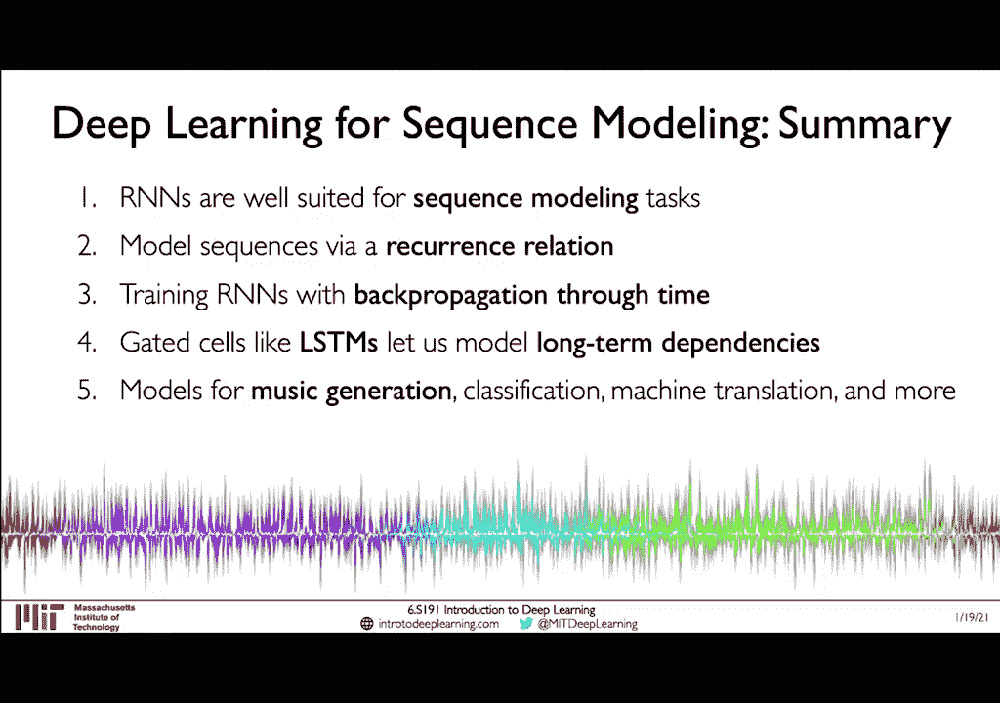

### 音乐生成

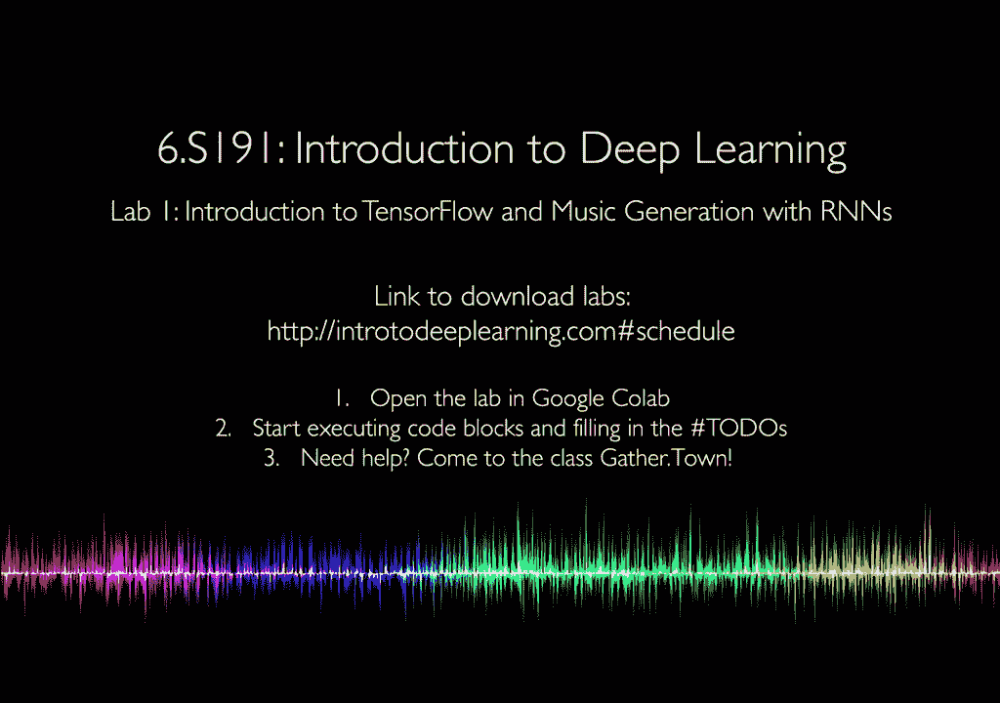

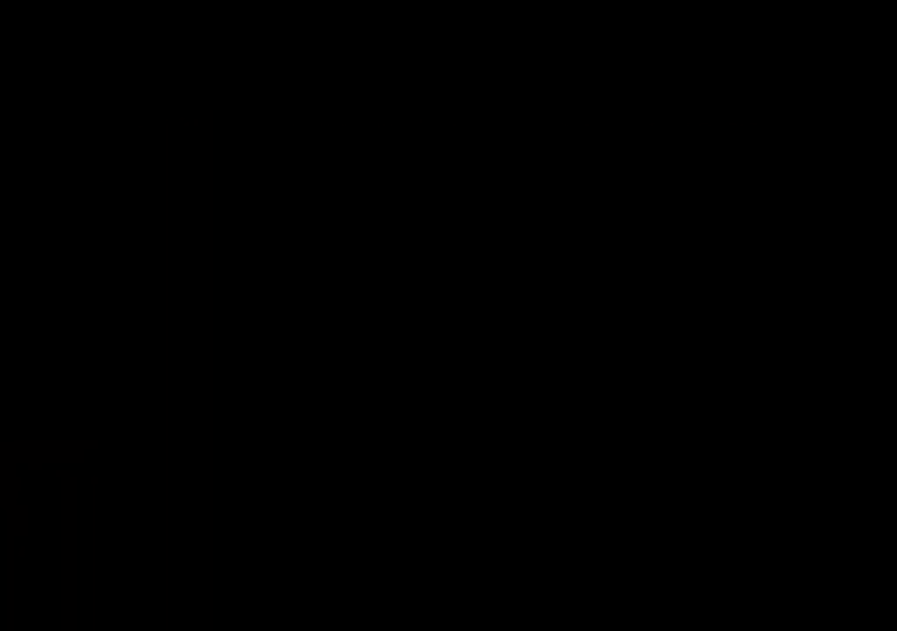

假设你正在尝试构建一个循环神经网络，它可以接受一个音符序列，并