# 5：强化学习从基础到前沿 🚀

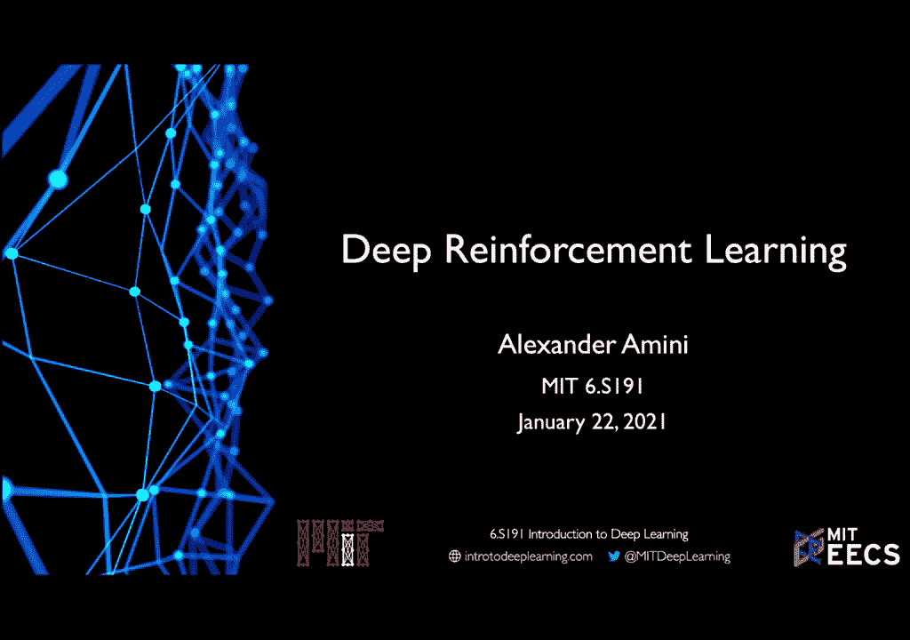

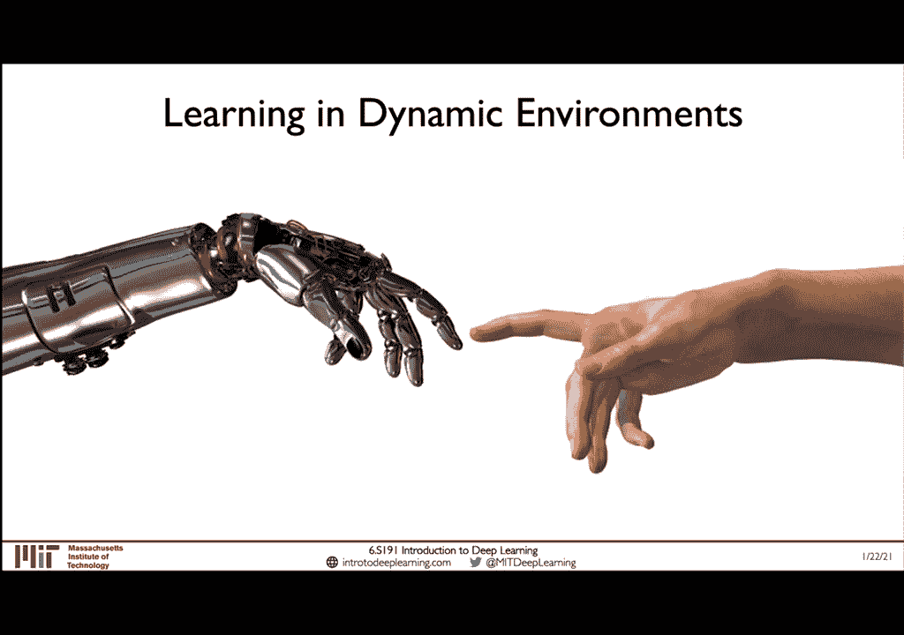

在本节课中，我们将学习强化学习的核心概念、主要方法及其在游戏和现实世界中的前沿应用。强化学习是机器学习的一个分支，它让智能体（Agent）通过与环境的交互来学习如何达成目标，而无需大量的人工标注数据。

## 强化学习概述 🤖

上一节我们介绍了监督学习和无监督学习。本节中，我们来看看第三种学习范式——强化学习。

在强化学习中，我们并不直接提供带有标签的数据。相反，我们向智能体提供“状态-行动-奖励”序列。智能体的目标是通过在环境中进行试验和试错，学习一系列行动，以最大化其长期获得的累积奖励。

以“苹果”为例：
*   **监督学习**：系统被告知“这是苹果”。
*   **无监督学习**：系统看到许多苹果图片，学习到它们结构相似，但不知道它们叫“苹果”。
*   **强化学习**：系统通过尝试“吃”各种东西，发现吃“苹果”后能获得“健康”或“生存”的奖励，从而学会选择吃苹果。

## 核心概念与术语 📚

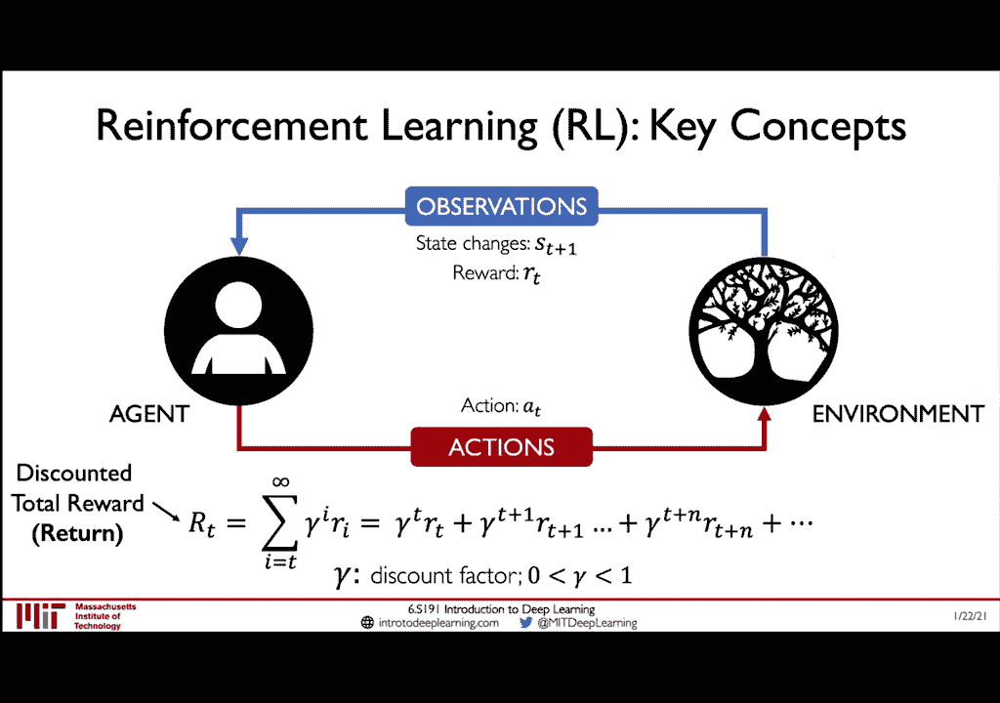

在深入技术细节前，我们需要建立强化学习的关键术语体系。这对于理解后续内容至关重要。

以下是强化学习框架的核心组成部分：

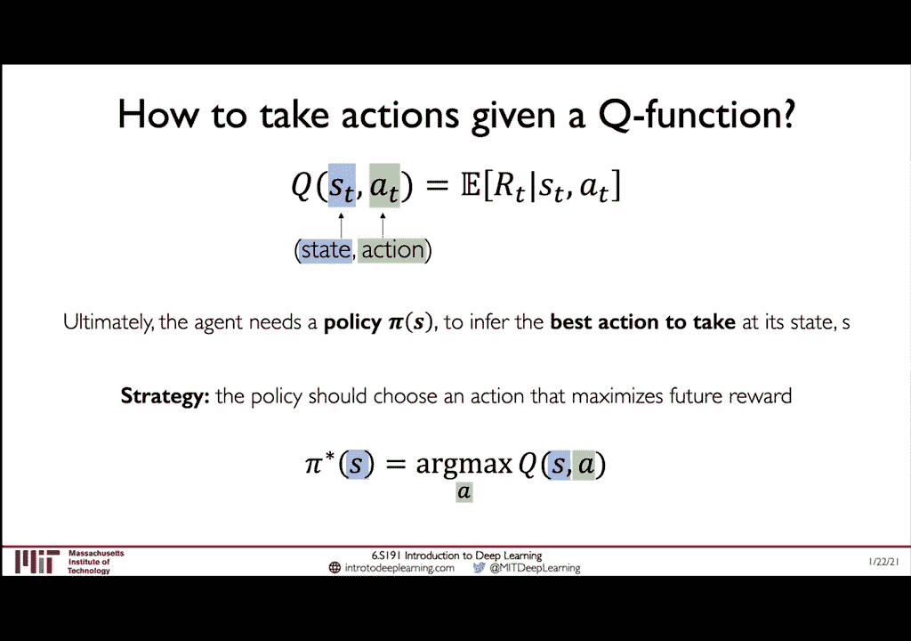

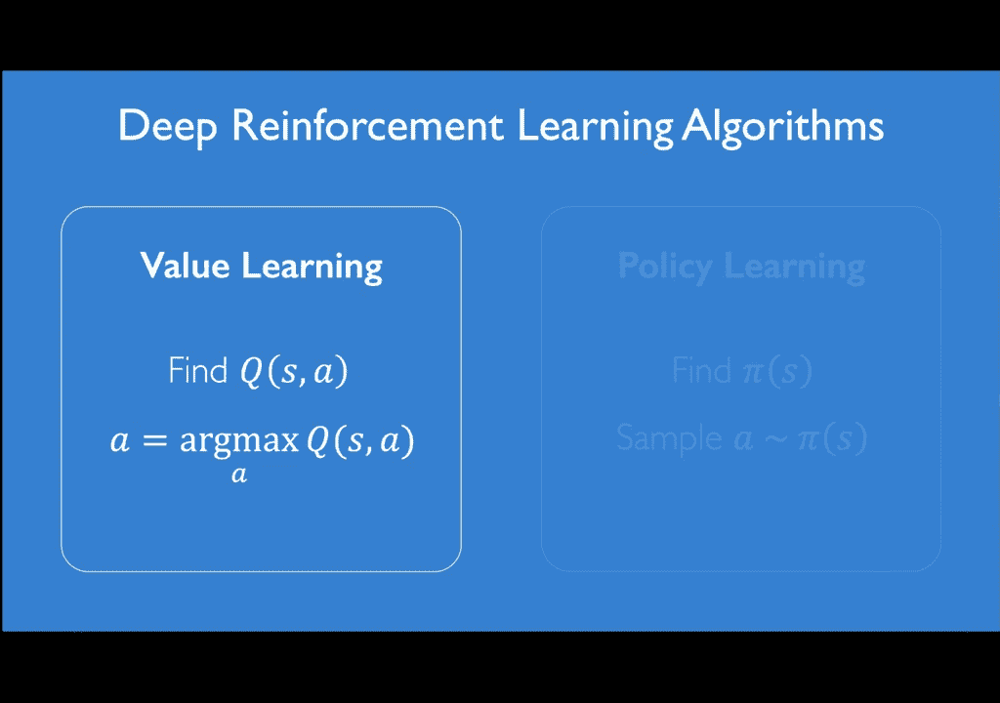

*   **智能体 (Agent)**：在环境中执行动作的实体。例如，游戏中的马里奥、现实世界中的自动驾驶汽车。
*   **环境 (Environment)**：智能体所处并与之交互的世界。
*   **状态 (State, s)**：环境在特定时刻的具体情况。例如，游戏的一帧画面、汽车的传感器读数。
*   **动作 (Action, a)**：智能体在某个状态下可以执行的操作。动作空间可以是离散的（如左、右、不动），也可以是连续的（如方向盘转角 -30° 到 +30° 间的任意值）。
*   **奖励 (Reward, r)**：环境对智能体动作的反馈，用于评估动作的好坏。奖励可以是即时或延迟的。
*   **策略 (Policy, π)**：智能体的行为准则，是一个从状态映射到动作的函数。即 `π(s) -> a`。
*   **回报 (Return, G)**：从某个时间点开始，智能体未来获得的所有奖励的总和。由于未来奖励的不确定性，我们通常使用**折扣回报**。
*   **折扣回报 (Discounted Return)**：对未来奖励进行折扣求和，公式为 `G_t = r_t + γ * r_{t+1} + γ^2 * r_{t+2} + ...`。其中 **γ (Gamma)** 是折扣因子（0 ≤ γ ≤ 1），用于权衡当前奖励与未来奖励的重要性。
*   **动作价值函数 (Q函数， Q(s, a))**：在状态 `s` 下执行动作 `a`，并在此后遵循策略 `π` 所能获得的**期望折扣回报**。公式为 `Q^π(s, a) = E[G_t | s_t = s, a_t = a]`。
*   **最优策略 (Optimal Policy， π*)**：能够最大化期望折扣回报的策略。

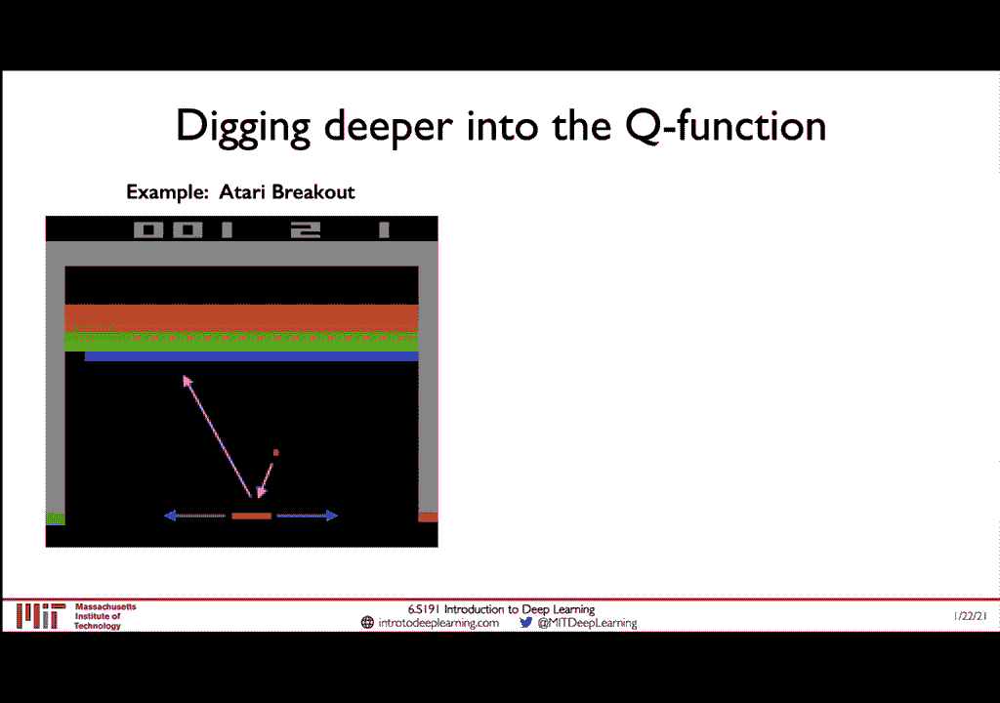

如果有一个完美的Q函数（称为“神谕”），那么找到最优策略就很简单：在每个状态 `s`，选择能使Q值最大的动作。即：
`π*(s) = argmax_a Q*(s, a)`

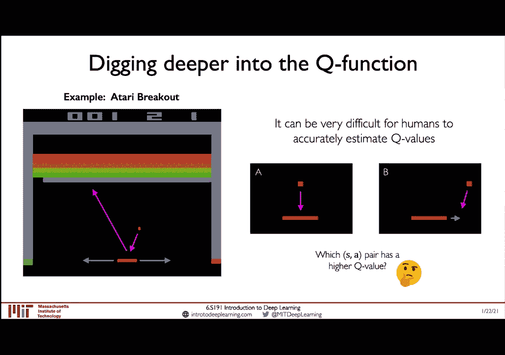

## 深度Q学习 (Deep Q-Learning) 🧠

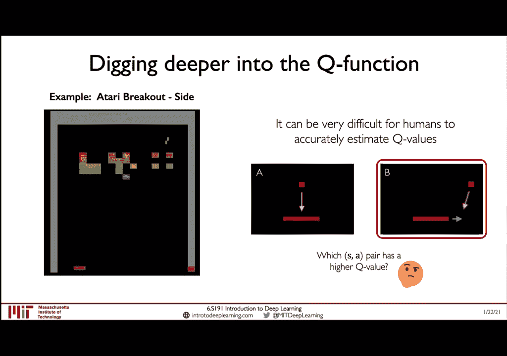

上一节我们介绍了Q函数的概念。本节中我们来看看如何用深度神经网络来学习和近似这个Q函数，这种方法称为深度Q网络。

DQN的核心思想是使用一个神经网络来近似Q函数：输入是状态 `s`，输出是对每个可能动作 `a` 的Q值估计。

**网络训练的关键在于目标Q值的构造**。我们利用“贝尔曼最优方程”来构建训练目标：
`目标Q值 = r + γ * max_{a'} Q(s', a')`
其中，`s'` 是执行动作 `a` 后到达的下一个状态。

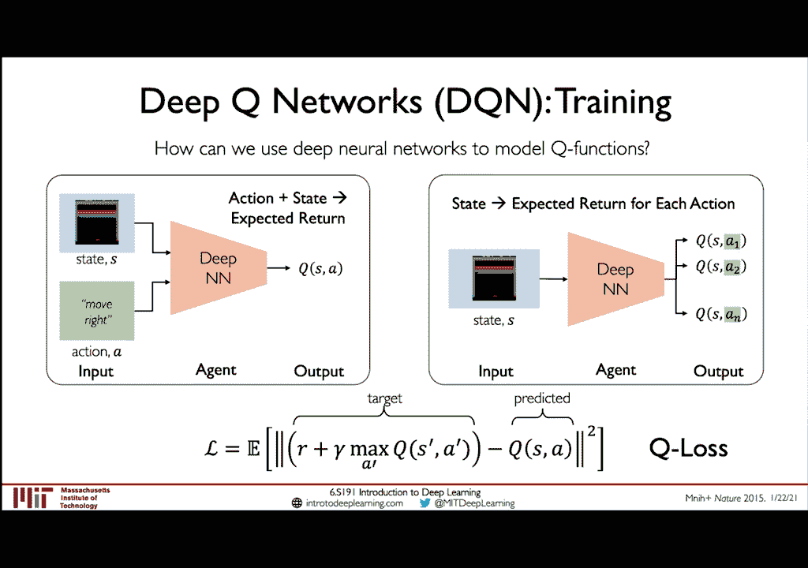

我们的损失函数就是网络预测的Q值与这个目标Q值之间的均方误差：
`Loss = (目标Q值 - Q_网络(s, a))^2`

通过最小化这个损失，网络逐渐学会预测更准确的Q值。

**训练与执行流程**：
1.  智能体观察当前状态 `s_t`。
2.  DQN网络接收 `s_t`，输出所有动作的Q值。
3.  智能体通常采用 ε-贪婪策略：以大概率 ε 选择Q值最大的动作（利用），以小概率随机选择动作（探索）。
4.  执行动作 `a_t`，环境返回奖励 `r_t` 和新状态 `s_{t+1}`。
5.  将经验 `(s_t, a_t, r_t, s_{t+1})` 存入经验回放缓冲区。
6.  从缓冲区采样一批经验，用上述损失函数训练DQN网络。
7.  重复此过程。

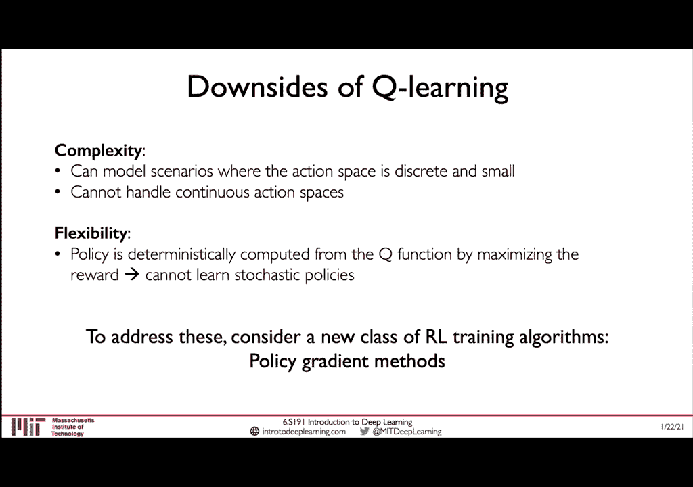

DeepMind的研究表明，单一的DQN架构可以在多种Atari游戏上达到或超越人类水平的表现。

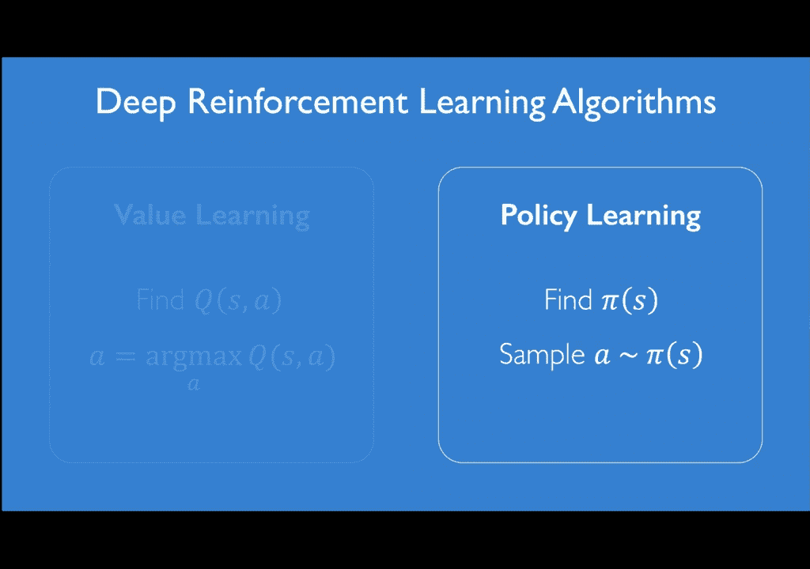

然而，DQN也有其局限性：
1.  **处理连续动作空间困难**：输出层需要为每个离散动作输出一个Q值，而连续动作空间是无限的。
2.  **策略缺乏随机性**：总是选择最大Q值的动作，在需要探索随机策略的环境中可能不是最优的。

## 策略梯度方法 (Policy Gradient Methods) 📈

上一节我们介绍了基于价值学习的方法。本节中我们来看看另一种直接学习策略的方法——策略梯度法。

与DQN先学Q值再推导策略不同，策略梯度方法直接参数化策略 `π_θ(a|s)`，其中 `θ` 是神经网络的参数。网络输入状态 `s`，**直接输出动作的概率分布**（对于离散动作）或分布参数（对于连续动作，如高斯分布的均值和方差）。

这种方法的优点：
*   **更直接**：直接优化我们关心的目标——策略。
*   **天然支持连续动作空间**：可以输出一个连续的概率分布，从中采样得到连续动作值。
*   **能学习随机策略**：输出本身就是概率分布。

**策略梯度定理**提供了优化策略的方向。一个常见的损失函数（用于梯度上升）是：
`Loss = -log(π_θ(a|s)) * G_t`
其中 `G_t` 是从该状态动作对开始计算的折扣回报。

这个公式的直观理解是：
*   如果一个动作 `a` 在状态 `s` 下带来了高回报 `G_t`，我们就增加选择这个动作的概率（通过减小 `-log(π_θ(a|s))`）。
*   反之，如果回报低，我们就减少选择这个动作的概率。

**训练流程示例（以自动驾驶汽车训练为例）**：
1.  用当前策略 `π_θ` 让汽车在模拟器中驾驶一段路程（一个回合），记录所有的 `(s, a, r)`。
2.  计算这个回合中每个时间步的折扣回报 `G_t`。
3.  使用策略梯度损失函数更新网络参数 `θ`，增加高回报动作的概率，降低低回报动作的概率。
4.  用更新后的策略开始新的回合，重复上述过程。

最终，汽车无需被告知“车道线”或“交通规则”，仅通过“碰撞”的负奖励和“安全行驶”的正奖励，就能学会在道路上驾驶。

## 从模拟到现实：仿真引擎的重要性 🚗

在现实世界中应用强化学习的主要挑战之一是训练成本高且危险（如机器人摔倒、汽车碰撞）。因此，通常在仿真环境中进行训练。

然而，仿真器与真实世界存在“现实差距”。一个关键的进展是开发高保真、数据驱动的仿真器，例如 **VISTA**。它使用真实世界的驾驶数据来模拟新的视角和场景，使得在仿真中训练的智能体策略能够**直接迁移到真实世界的汽车上**，而无需额外的领域适应步骤。这标志着完全在仿真中使用RL训练的策略首次成功部署到全尺寸自动驾驶汽车上。

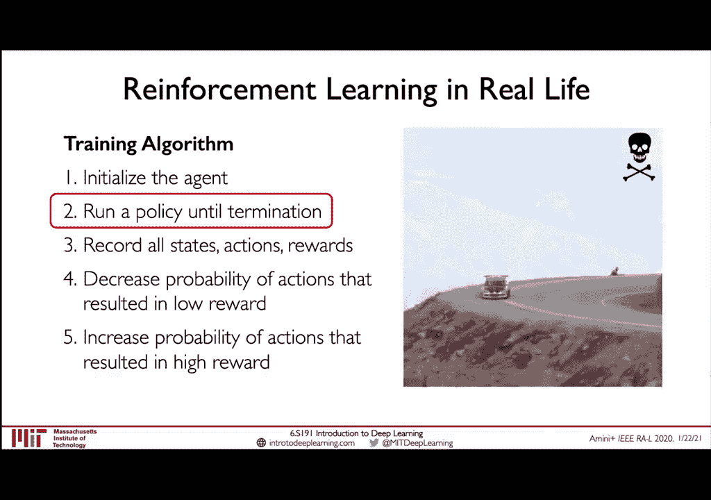

## 前沿应用案例：从AlphaGo到MuZero ♟️

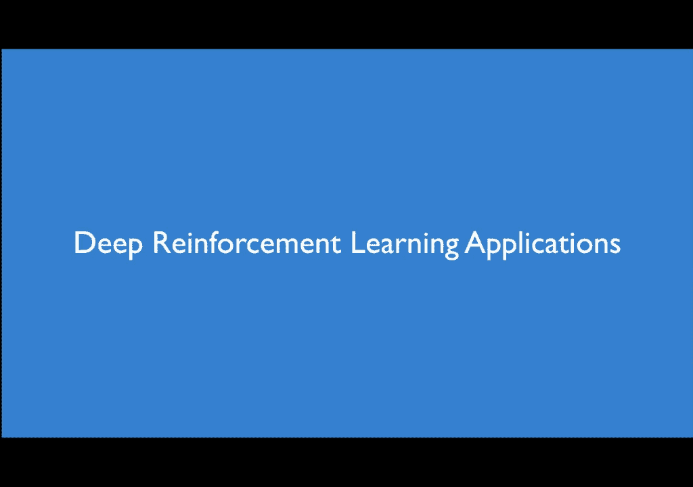

我们已探索了强化学习的基础方法。现在，让我们看看一些结合了这些思想的杰出前沿应用。

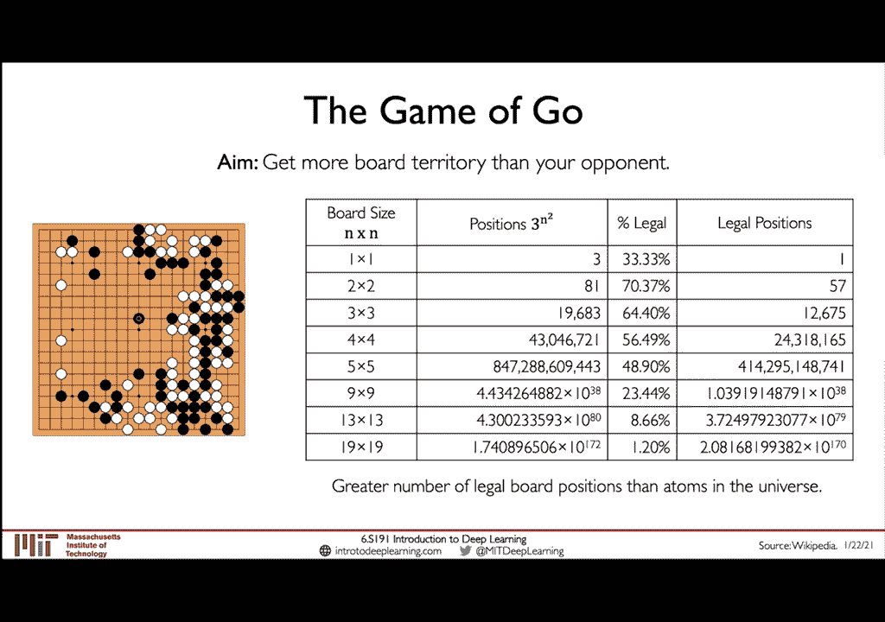

**AlphaGo**：DeepMind 在2016年击败人类围棋冠军的程序。
1.  **监督学习阶段**：用人类棋谱训练一个策略网络来模仿人类落子。
2.  **强化学习阶段**：让这个策略网络自我对弈，使用策略梯度方法进行提升。
3.  **价值网络**：训练一个网络来评估棋盘位置的胜率。
4.  **蒙特卡洛树搜索**：结合策略网络和价值网络进行前瞻性搜索，选择最优动作。

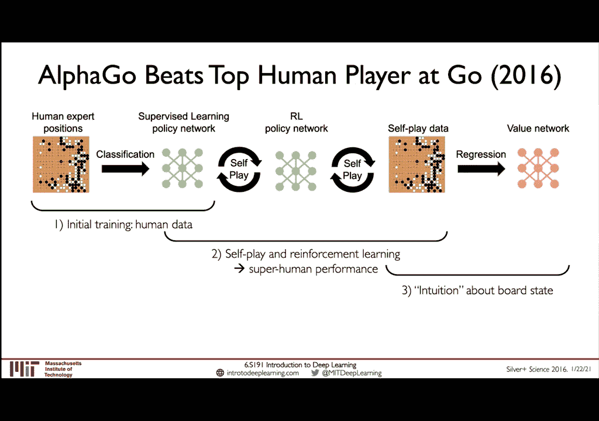

**AlphaGo Zero / AlphaZero**：摒弃人类数据，完全从随机初始化的策略开始，通过自我对弈和强化学习进行训练。AlphaZero 还将此框架推广到国际象棋和日本将棋，并取得了超越所有已知程序的成绩。

**MuZero**：这是最新的重大进展。MuZero 在训练时**甚至不知道游戏规则**。它学习三个模型：
*   **表征模型**：将观察到的状态编码为隐藏状态。
*   **动态模型**：预测给定隐藏状态和动作后，下一个隐藏状态和即时奖励。
*   **预测模型**：从隐藏状态预测策略（动作分布）和价值（预期回报）。
它使用学到的模型进行内部搜索（规划），并基于搜索结果采取行动。MuZero 在超过50款Atari游戏以及围棋、国际象棋、将棋上达到了超越人类的水平，展示了其强大的通用学习能力。

## 总结 🎯

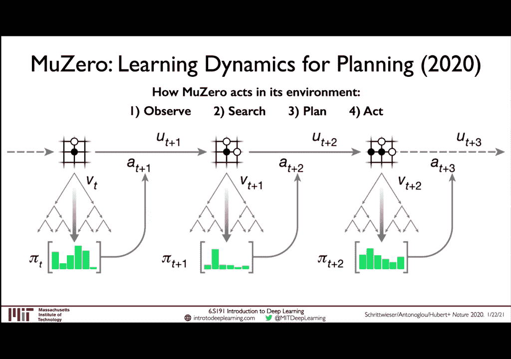

本节课中我们一起学习了强化学习的核心知识：
1.  **基础概念**：我们定义了智能体、环境、状态、动作、奖励、策略、回报和Q函数等核心要素。
2.  **深度Q学习**：我们学习了如何使用深度神经网络来近似Q函数，并通过时间差分误差进行训练，这种方法在离散动作空间任务中表现出色。
3.  **策略梯度方法**：我们探讨了直接优化策略网络的方法，它更适用于连续动作空间，并能直接学习随机策略。
4.  **仿真到现实**：我们了解了高保真仿真器对于安全、高效训练RL智能体并实现现实世界部署的关键作用。
5.  **前沿进展**：我们回顾了从AlphaGo到MuZero的发展历程，看到了如何将价值学习、策略学习与规划搜索相结合，创造出在复杂领域达到超人水平的智能系统。

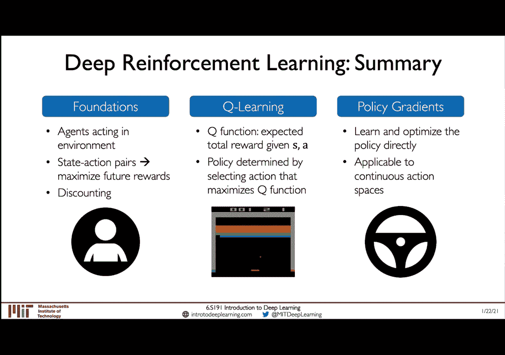

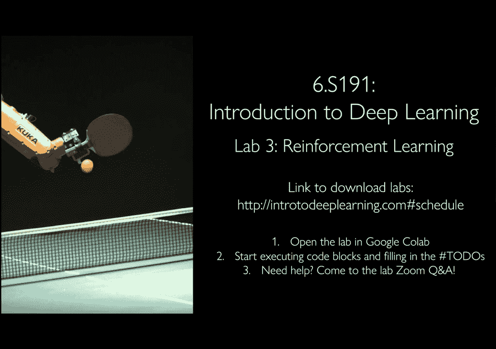

强化学习将深度学习的感知能力与决策能力相结合，为构建能够在复杂、动态环境中自主学习的智能体开辟了道路。