# 7：证据深度学习与不确定性估计 🧠

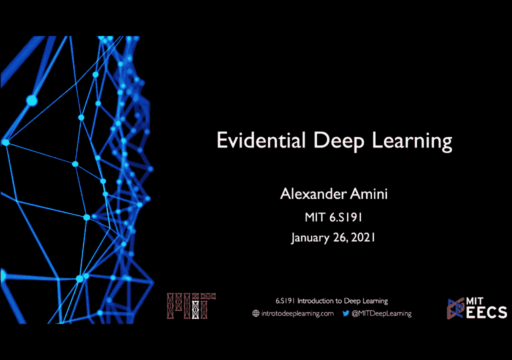

在本节课中，我们将深入探讨现代深度学习中的一个核心话题：**不确定性估计**。我们将学习如何让神经网络不仅做出预测，还能评估其预测的“自信程度”，这对于将模型安全可靠地部署到现实世界至关重要。

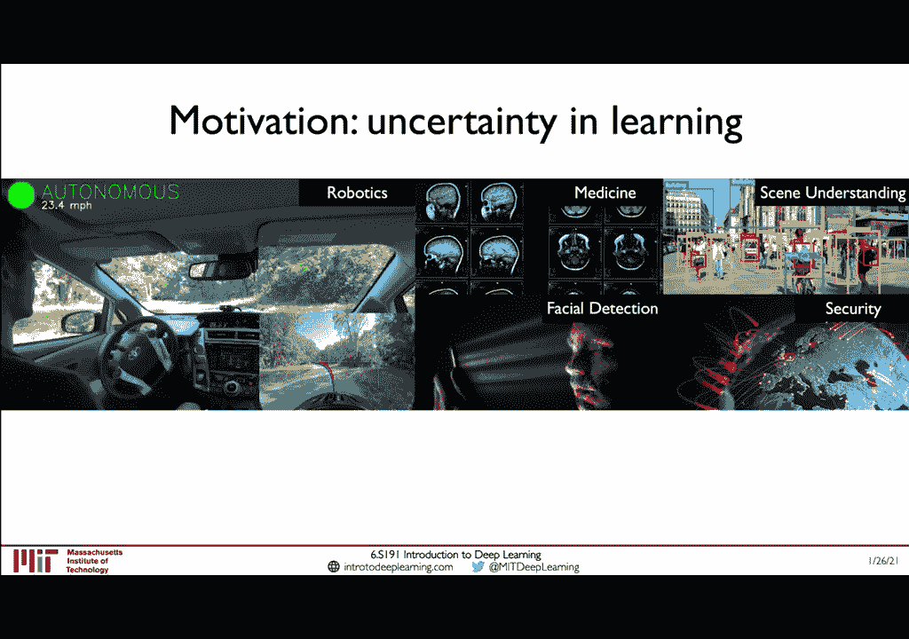

---

## 引言：为什么需要不确定性估计？ 🤔

上一节我们介绍了深度学习的基础模型。本节中，我们来看看为什么模型“知道自己不知道什么”如此重要。

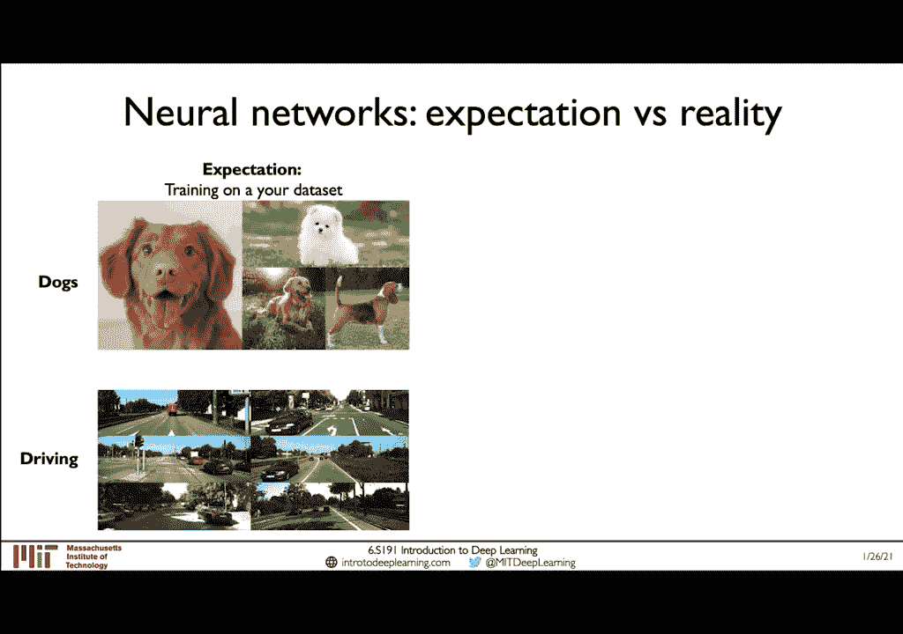

深度学习模型正从实验室走向现实世界，开始影响人类生活。然而，这些模型容易传播训练数据中的偏见，并且经常在全新的、未见过的数据上失败。因此，我们需要模型能够**快速、可靠地估计其面对的数据以及其预测输出的不确定性**。

一个关键原因是训练与部署之间存在“分布差距”。我们通常假设训练数据和测试数据来自同一分布，但现实中这很少成立。例如，一个在清晰狗图片上训练的分类器，在面对倒置的狗、天空中的狗或在全新环境中的狗时，可能表现极差。

本次讲座的目标是：构建不仅能做出高精度预测，还能**定量估计不确定性**的模型。正如统计学家乔治·博克斯所言：“所有的模型都是错的，但有些（知道何时可信的）是有用的。” 即使模型精度并非完美，如果我们能理解何时可以信任它的输出，它就变得非常强大。

---

## 概率学习与不确定性基础 📊

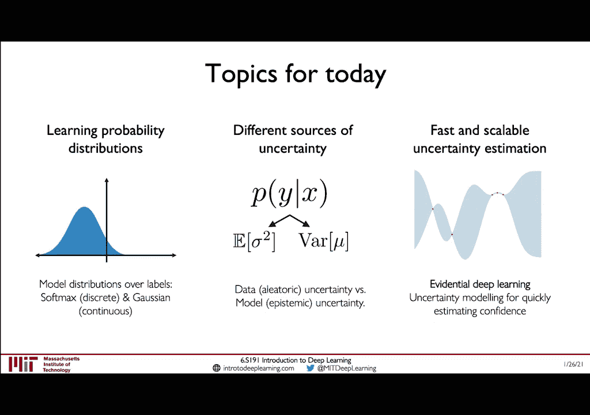

在监督学习中，我们的模型接收输入数据 `X`，并预测目标 `Y`。到目前为止，我们的课程主要关注学习从 `X` 到 `Y` 的确定性映射，即预测 `Y` 的期望值 `E[Y|X]`。

然而，如果我们只模拟目标的期望值，得到的只是**点估计**，缺乏对预测**不确定性**或**置信度**的理解。不确定性估计意味着，除了预测均值（期望），我们还希望估计预测的**方差** `Var(Y|X)`，从而获得对输出的概率性理解。

你可能觉得这很熟悉。确实，在第一节课中，我们已经接触过让神经网络输出完整分布的思想，特别是在**分类任务**中。

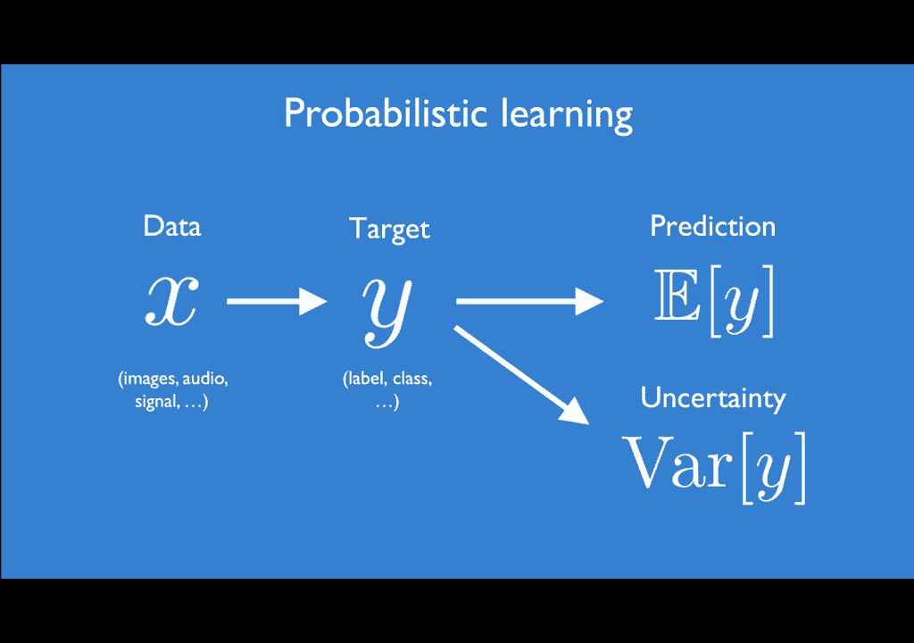

---

### 回顾：分类任务中的概率输出

以下是一个分类网络的例子，它输出属于每个类别的概率：

```python
# 假设一个二分类网络（猫 vs 狗）
# 输出层使用 softmax 激活函数
output = neural_network(image)
# output = [P(cat), P(dog)]
# 满足：P(cat) + P(dog) = 1, 且每个 P > 0
```

我们使用 **Softmax** 激活函数来确保输出满足概率分布的两个约束：
1.  每个输出值大于零。
2.  所有输出值之和为 1。

然后，我们通过最小化**负对数似然损失**（也称为**交叉熵损失**）来优化网络，使预测分布与真实标签匹配。

这一切都源于一个基本假设：我们假设目标标签 `y` 是从一个由参数定义的**分类分布**中抽取的。这里的参数就是网络输出的各类别概率。

---

### 扩展：回归任务中的概率输出

对于连续值预测（回归）任务，目标 `y` 是实数。我们无法像分类那样输出有限个概率值。

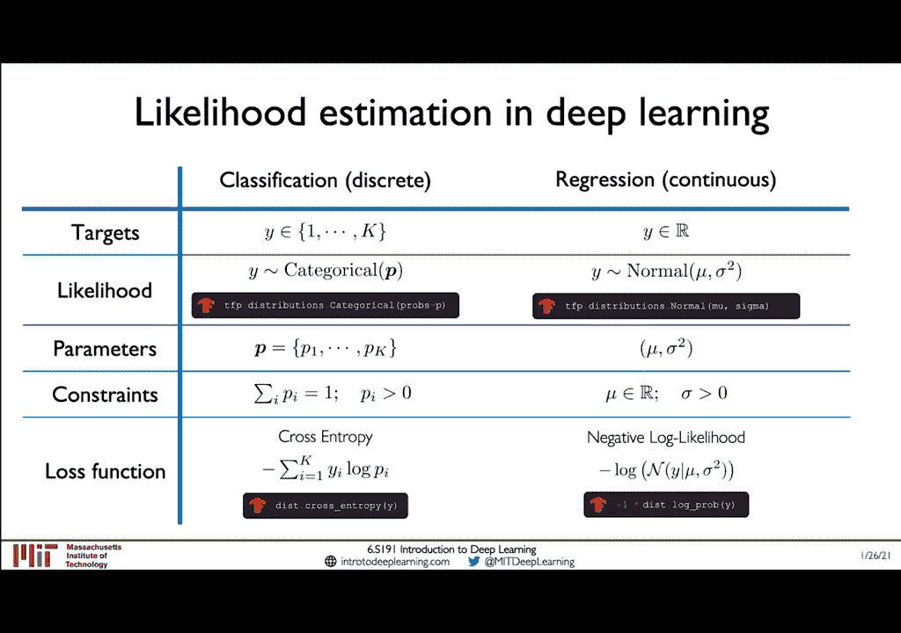

我们假设目标标签 `y` 从一个**正态分布（高斯分布）**中抽取，该分布由均值 `μ` 和方差 `σ²` 参数化。因此，我们的网络可以输出这两个参数：
*   均值 `μ`：可以是任意实数，无需特殊约束。
*   方差 `σ²`：必须为正数。我们可以使用 `exp()` 等激活函数来确保输出为正。

同样，我们使用**负对数似然损失**来优化网络，学习这个高斯分布的参数。神奇之处在于，我们并没有真实标签的“真实方差”数据，但通过这个损失函数，我们可以学习到描述数据可能性的完整分布。

---

### 两种似然估计的总结

以下是分类与回归任务中概率学习方法的对比：

| 领域 | 目标类型 | 假设的似然函数 | 分布参数 | 参数约束 | 常用损失函数 |
| :--- | :--- | :--- | :--- | :--- | :--- |
| **分类** | 离散类别 (1...K) | 分类分布 | 类别概率 `p₁, ..., pₖ` | `Σpᵢ = 1`, `pᵢ > 0` | 负对数似然（交叉熵） |
| **回归** | 连续实数 | 正态分布 | 均值 `μ`, 方差 `σ²` | `σ² > 0` | 负对数似然 |

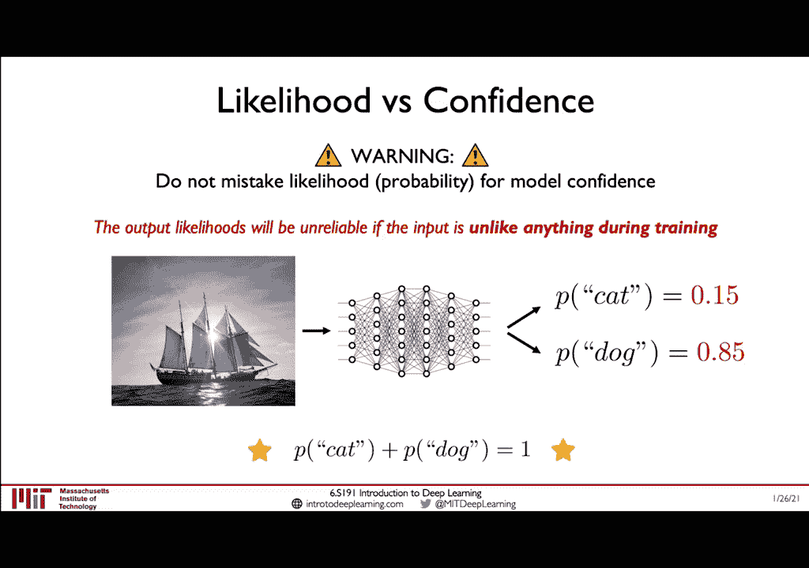

---

## 关键区分：概率 vs. 置信度 ⚠️

**至关重要的一点是：模型输出的概率（或似然）不等于模型的置信度。**

让我们回到猫狗分类的例子。如果输入一张清晰的猫图，模型输出 `P(cat)=0.9, P(dog)=0.1`，这反映了数据中的模式（猫的特征明显）。如果输入一张同时包含猫和狗的图片，模型可能输出 `P(cat)=0.5, P(dog)=0.5`。这**不代表模型不自信**，而是反映了**输入数据本身的歧义性**，模型可能非常自信地认为图中既有猫也有狗。

问题出现在**分布外**数据上。如果用训练猫狗分类器的网络去识别一张船的图片，它仍然会输出两个概率值，且其和为1。例如 `P(cat)=0.6, P(dog)=0.4`。这个输出是**不可信的**，因为模型从未在训练中见过船。然而，当前的似然估计方法无法直接告诉我们“这个输入很奇怪，我不认识”。

因此，我们需要区分并量化**不同类型的不确定性**。

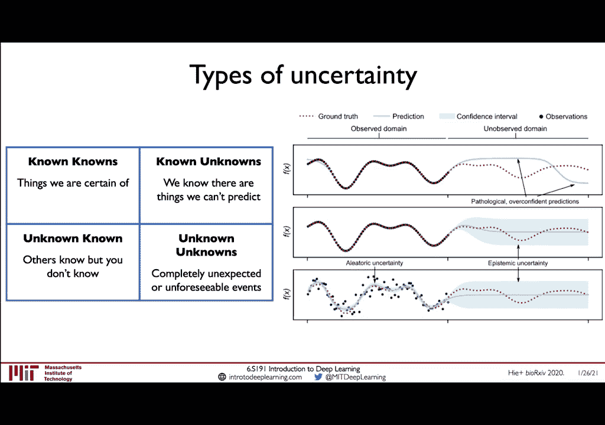

---

## 不确定性的类型：偶然 vs. 认知 🧩

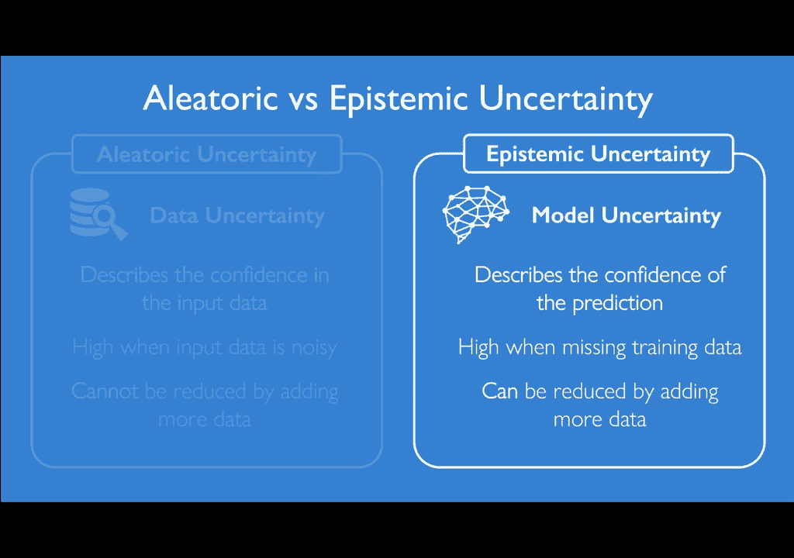

不确定性主要分为两种：

1.  **偶然不确定性**：源于数据本身的噪声或固有随机性。例如，传感器噪声、测量误差。这种不确定性是**不可约减**的，收集更多数据也无法消除，只能通过改进传感器来降低。
2.  **认知不确定性**：源于模型自身知识的不足。当模型遇到训练数据未覆盖的情况时，就会产生这种不确定性。这种不确定性是**可以约减**的，通过增加相关训练数据可以提高模型在该领域的置信度。

用“已知与未知”矩阵来类比：
*   **已知的已知**：我们知道且确信的事情（低偶然、低认知不确定性）。
*   **已知的未知**：我们知道存在但无法预测的随机性（高偶然不确定性）。
*   **未知的已知**：别人知道但我们不知道的信息（高认知不确定性）。
*   **未知的未知**：完全无法预见的意外（极高的认知不确定性）。

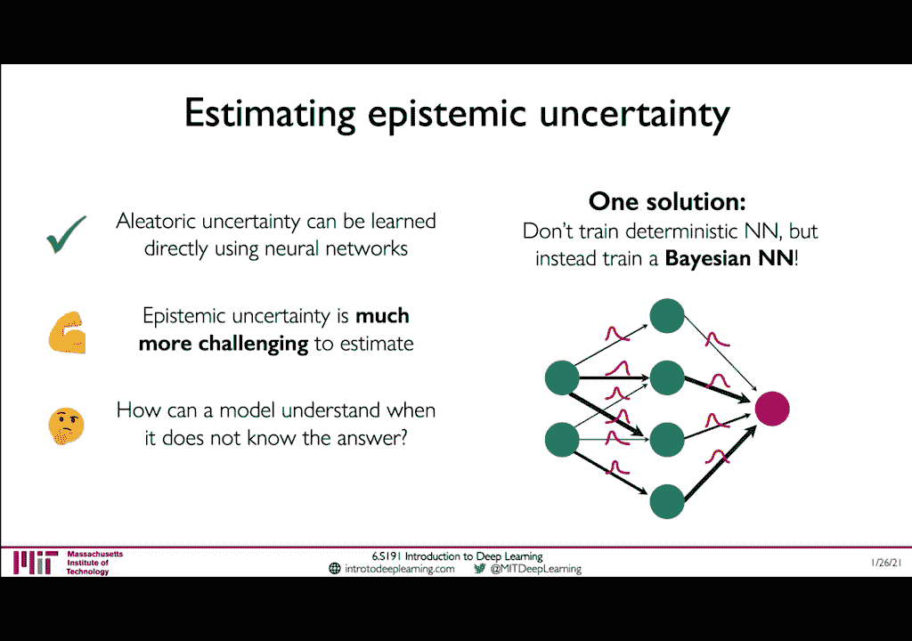

在深度学习中，**偶然不确定性可以通过我们之前介绍的似然估计方法直接学习**（如回归中学习 `σ²`）。而**认知不确定性的估计则要困难得多**。

---

## 估计认知不确定性：贝叶斯神经网络 🔮

标准神经网络是确定性的：固定权重下，相同输入总是产生相同输出。因此，它无法体现认知不确定性。

**贝叶斯神经网络**的核心思想是：将网络中的**每个权重视为一个概率分布**，而非一个确定值。这样，每次前向传播时，我们从权重的分布中采样一组具体值，从而得到略有不同的输出。

我们可以将学习权重的后验分布表述为：
`P(权重 | 数据) ∝ P(数据 | 权重) * P(权重)`

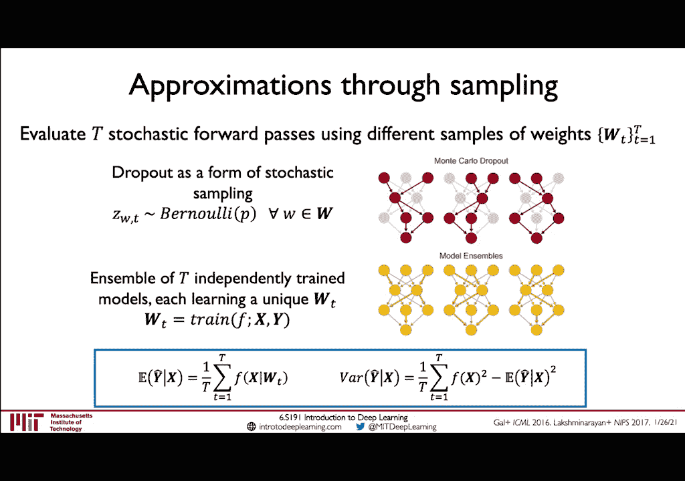

然而，精确计算这个后验分布通常难以实现。实践中，我们采用**近似采样**的方法：

*   **蒙特卡洛 Dropout**：在测试阶段也使用 Dropout。每次前向传播时，随机丢弃一些神经元，从而得到不同的输出。多次运行（T次）即可得到一组预测样本。
*   **模型集成**：训练多个独立的模型，每个模型学习到一组不同的权重。将这些模型的预测结果集合起来。

通过这 T 次采样或 T 个模型的预测 `{ŷ₁, ŷ₂, ..., ŷₜ}`，我们可以计算：
*   **预测均值**：`E[ŷ] ≈ (1/T) Σ ŷₜ`
*   **认知不确定性**：`Var[ŷ] ≈ (1/T) Σ (ŷₜ - E[ŷ])²`

**预测方差越大，表明模型的认知不确定性越高。**

---

### 采样方法的局限性

尽管基于采样的贝叶斯方法很常用，但它们有明显的缺点：
1.  **计算成本高**：需要多次运行模型（T次前向传播），对于集成方法还需训练和存储多个模型。
2.  **内存占用大**：在内存中并行运行多个模型有压力。
3.  **效率低下**：难以应用于需要实时、低功耗推理的场景（如移动设备、机器人）。
4.  **校准问题**：其产生的不确定性估计有时在安全关键领域不够可靠。

---

## 证据深度学习：直接学习不确定性分布 🚀

上一节我们介绍了通过采样来近似认知不确定性的方法。本节中，我们来看看一种更直接、更高效的方法——**证据深度学习**。

证据深度学习的核心思想是：让神经网络**直接学习似然函数参数（如 `μ, σ²` 或类别概率 `p`）之上的一个高阶分布**，我们称之为**证据分布**。通过分析这个证据分布，我们可以同时得到偶然不确定性和认知不确定性的估计。

### 回归任务中的证据分布

在回归中，我们假设目标 `y` 来自高斯分布 `N(μ, σ²)`。
在证据学习中，我们进一步假设高斯分布的参数 `(μ, σ²)` 本身来自一个联合先验分布——**正态逆伽马分布**。
这个证据分布由一组超参数 `(γ, ε, α, β)` 定义，而我们的神经网络将学习输出这些超参数。

**公式：**
`y ~ N(μ, σ²)`
`(μ, σ²) ~ NIG(γ, ε, α, β)` （正态逆伽马分布）

从 `NIG` 分布中采样，就会得到一对 `(μ, σ²)`，它们定义了一个具体的高斯似然函数。证据分布的密度高低，反映了对某个似然函数实现的“证据”强弱。

### 分类任务中的证据分布

在分类中，我们假设目标 `y` 来自分类分布 `Cat(p)`，其中 `p` 是类别概率向量。
在证据学习中，我们假设概率向量 `p` 来自一个**狄利克雷分布**。
这个证据分布由浓度参数向量 `α = (α₁, ..., αₖ)` 定义，神经网络学习输出这个 `α`。

**公式：**
`y ~ Cat(p)`
`p ~ Dir(α)` （狄利克雷分布）

狄利克雷分布定义在概率单纯形上。从 `Dir(α)` 中采样，就得到一个具体的类别概率向量 `p`。

**为什么选择这些特定的证据分布？**
因为它们是其对应似然函数的**共轭先验**。这使得我们在计算损失函数时，某些积分可以解析求解，大大简化了训练过程。

---

### 如何训练证据神经网络？

网络被训练来直接输出证据分布的参数（回归输出 `γ, ε, α, β`；分类输出 `α`）。
损失函数通常由两部分组成：
1.  **模型拟合项**：最大化观测数据的似然。
2.  **证据正则化项**：最小化错误证据。当模型可能犯错时，这项鼓励证据分布变得分散（即增大不确定性）。

训练完成后，我们可以直接从证据分布的参数中解析地计算出偶然不确定性和认知不确定性的度量，无需任何采样。

---

### 证据深度学习的优势

与贝叶斯神经网络相比，证据深度学习：
*   **速度快、内存效率高**：单次前向传播即可获得不确定性估计，无需采样或集成。
*   **同时捕捉两种不确定性**：通过分析单一证据分布即可得到。
*   **可扩展性强**：已成功应用于高维任务，如单目深度估计（为每个像素预测深度及不确定性）和激光雷达点云的语义分割。

---

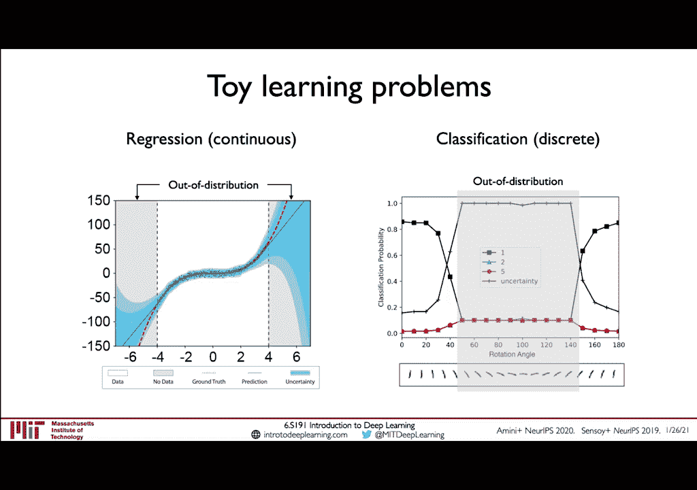

## 方法对比与总结 📈

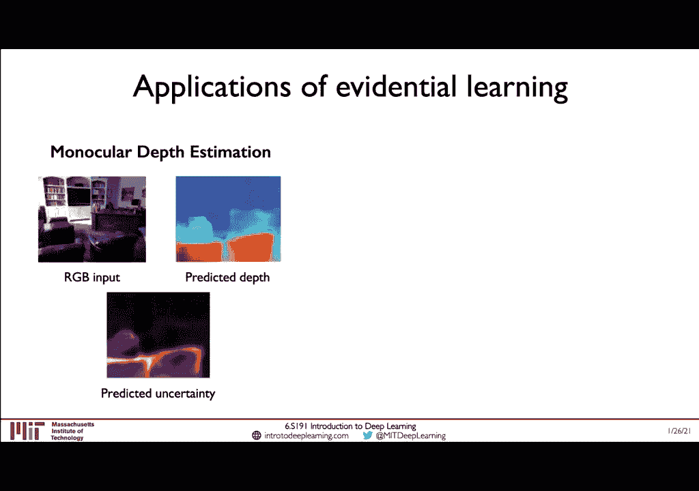

以下是本节课涉及的三种不确定性估计方法的对比：

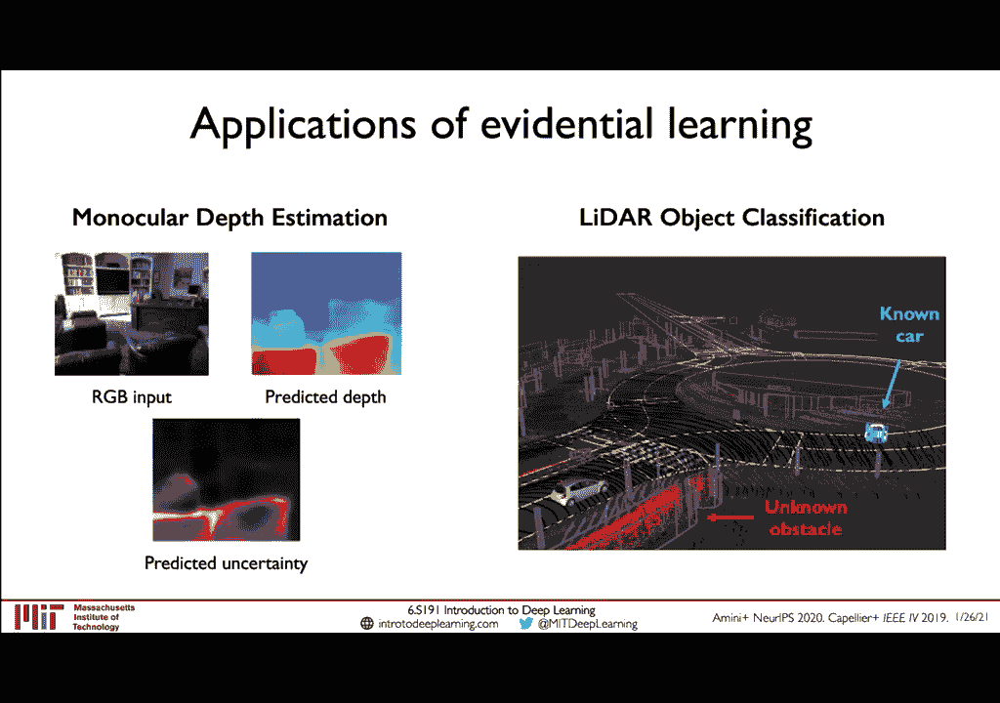

| 方法 | 概率先验放置于 | 能否捕捉偶然不确定性？ | 能否捕捉认知不确定性？ | 计算效率 | 关键思想 |
| :--- | :--- | :--- | :--- | :--- | :--- |
| **似然估计** | 数据 `y` 之上 | **是** (如学习 `σ²`) | 否 | **高** | 输出似然函数的参数 |
| **贝叶斯神经网络** | 网络权重 `w` 之上 | 间接/需推导 | **是** (通过权重分布) | 低 (需采样) | 权重是分布，通过采样近似 |
| **证据深度学习** | 似然参数 `θ` 之上 | **是** | **是** | **高** | 直接学习似然参数的高阶分布 |

---

## 课程总结 🎯

在本节课中，我们一起深入学习了使用神经网络进行**不确定性估计**这一至关重要的课题。我们了解到：
1.  将模型部署到现实世界时，理解其**何时可信、何时不可信**与提高精度同等重要。
2.  不确定性分为**偶然不确定性**（数据噪声）和**认知不确定性**（模型知识不足）。
3.  传统的似然估计方法（如输出方差或类别概率）主要捕捉偶然不确定性。
4.  **贝叶斯神经网络**通过将权重视为分布来估计认知不确定性，但依赖耗时的采样过程。
5.  **证据深度学习**提供了一种高效且强大的替代方案，它通过让神经网络直接学习似然参数上的高阶分布，能够同时、快速地估计两种不确定性。

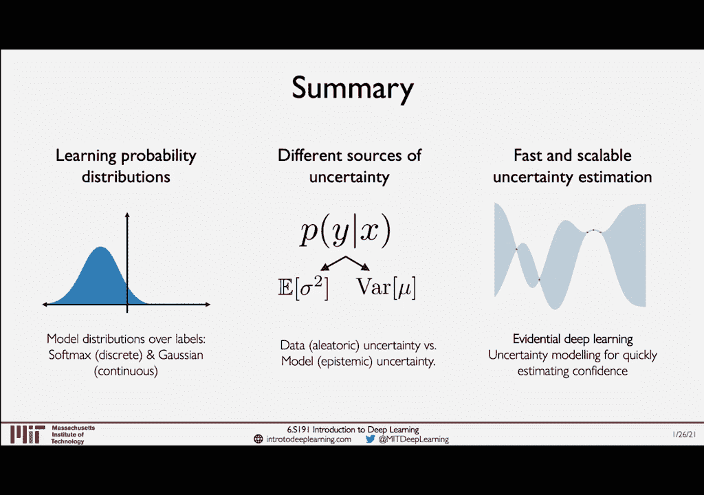

掌握这些技术，是构建鲁棒、可靠、可信任的AI系统的关键一步。在下节课中，我们将探讨另一个深刻影响现实世界的主题：**人工智能中的偏见与公平性**。