# 8：AI 偏见与公平 ⚖️

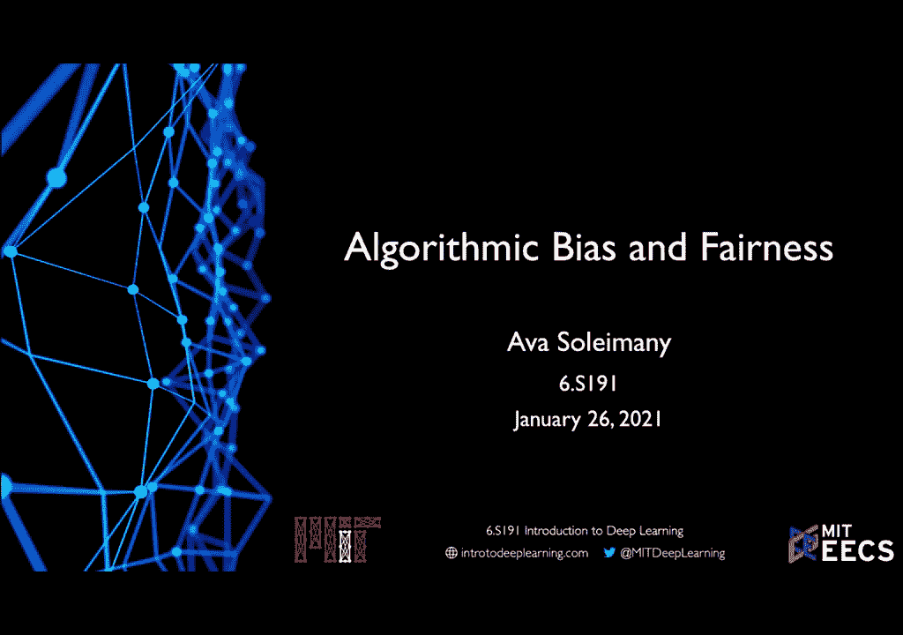

在本节课中，我们将要学习算法偏见与公平。这是一个在现代深度学习乃至整个人工智能领域日益普遍且重要的问题。算法偏见可能出现在人工智能流程的各个阶段，从数据收集到模型解释。本次课程不仅会探讨什么是算法偏见及其产生原因，还将探索一些新兴且令人兴奋的方法进展，思考如何构建能够识别并在一定程度上减轻这些偏见的机器。

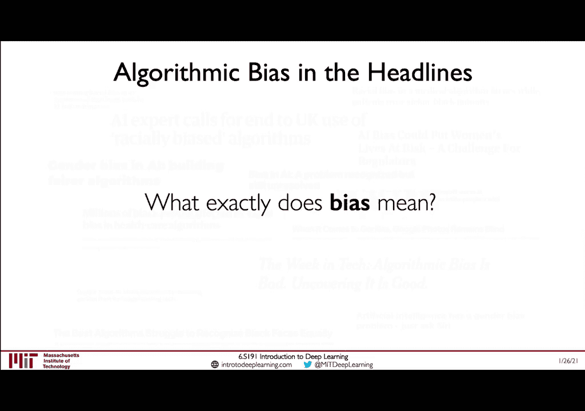

## 什么是算法偏见？🤔

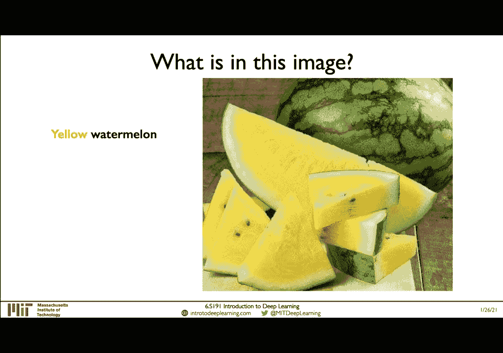

算法偏见的概念指出，神经网络和更广泛的人工智能系统容易受到重大偏见的影响，这些偏见会导致非常真实且有害的社会后果。如今，从面部识别、医疗决策到语音识别，我们已经在社会中看到了这一点。最重要的是，算法偏见实际上会延续现有的社会和文化偏见，例如种族和性别偏见。我们现在开始认识到，深度学习中的算法偏见是一个真正普遍且严重的问题。因此，我们需要在各个层面制定策略来解决这个问题。首先，我们必须理解算法偏见到底意味着什么。

为了理解这个概念，让我们考虑一个例子。当你看到一张红色西瓜的图片时，你可能会直接描述它为“西瓜”。但如果看到一张黄色西瓜的图片，你可能会更倾向于描述它为“黄色西瓜”。这是因为我们自身的偏见——我们习惯于看到红色的西瓜，并将其视为典型。这揭示了一个更广泛的事实：人类在感知和理解世界时，倾向于给事物贴标签和分类，以此强加秩序、简化并理解世界。结果，对于所有事物，通常都会有一些我们基于观察频率而形成的“典型”或“原型”表征。当我们遇到不符合个人认知中“规范”的事物时（例如黄色西瓜），就可能产生偏见和刻板印象。本节课，我们将重点讨论算法偏见的来源，并探讨一些对抗偏见的新方法。

## 深度学习中的偏见表现 🎭

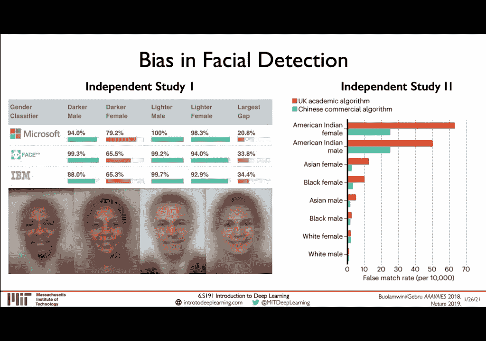

首先，让我们看看偏见在深度学习和人工智能中是如何表现的。当今深度学习中最普遍的偏见例子之一出现在面部检测领域。近期有几项分析评估了商业面部检测与分类系统的表现。例如，一项关于性别分类器的分析显示，商业系统在深色皮肤女性面孔上的表现明显差于其他人口群体。另一项针对面部识别算法的分析也发现，有色人种女性的错误率最高。

这种算法偏见可以以无数种不同的方式表现出来。再举一个图像分类的例子。假设我们有一个在开源大规模图像数据集上训练好的CNN。当一张典型的北美或欧洲新娘照片输入这个CNN时，它可能会输出“新娘”、“连衣裙”、“婚礼”等预测标签。然而，当一张南亚地区典型新娘的照片输入同一个CNN时，预测的标签可能完全不反映“新娘”或“婚礼”，甚至可能不包含“人”。这显然是一个非常重要的问题，根本不是深度学习所期望的行为。

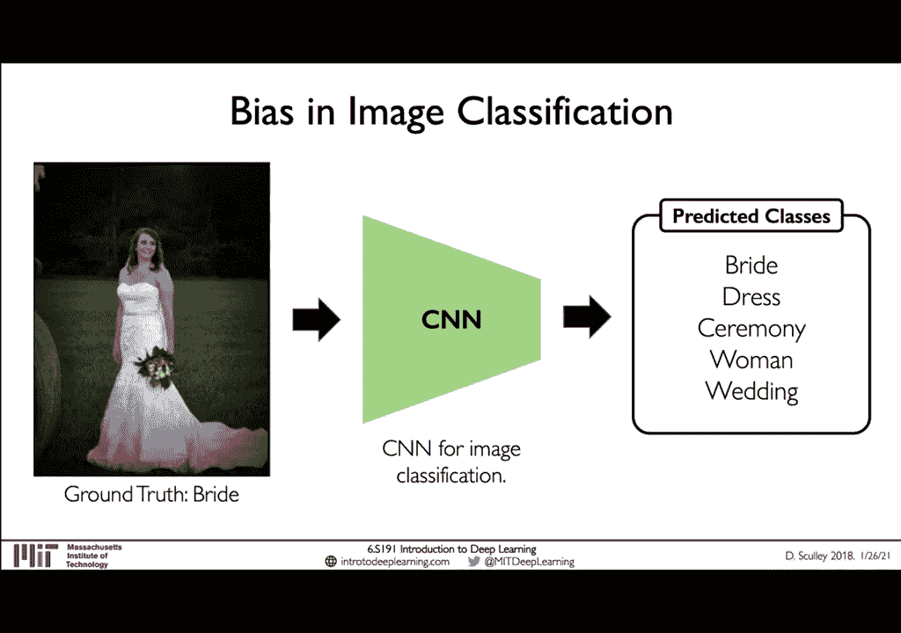

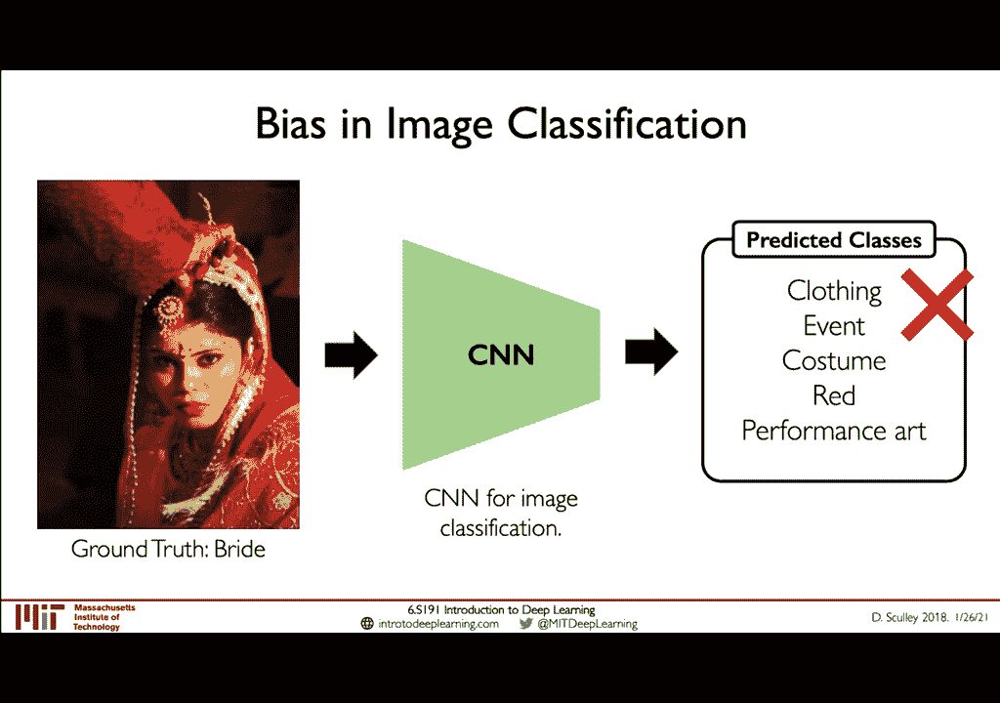

类似的偏见也在物体识别中被观察到。一张从北美家庭拍摄的香料照片输入物体检测CNN后，可能被正确识别为“香料”。但一张从菲律宾家庭拍摄的香料照片输入同一个CNN后，预测的标签可能无法反映“香料”这个真实类别。有趣的是，分析发现，物体识别模型的准确性与拍摄测试图像的家庭收入有关。这表明算法明显偏向于来自高收入家庭的数据，而非低收入家庭的数据。这种偏见的根源在于，训练此类模型的数据绝大多数来自美国、加拿大和西欧，但这与世界人口的分布完全不匹配，因为世界大部分人口在东亚和南亚。这是一个强有力的例子，展示了偏见如何在深度学习管道的多个层面上被延续和存在。

偏见确实会毒害人工智能开发和生命周期的所有阶段：从不平衡的数据（涉及类别标签甚至特征）开始，到对模型本身和训练部署管道造成不必要的偏见，再到评估和分析中可能强化偏见，最后在我们人类对人工智能系统结果和决策的解释中，我们自己也可能会注入人为错误、强加自身偏见，从而扭曲结果的含意。

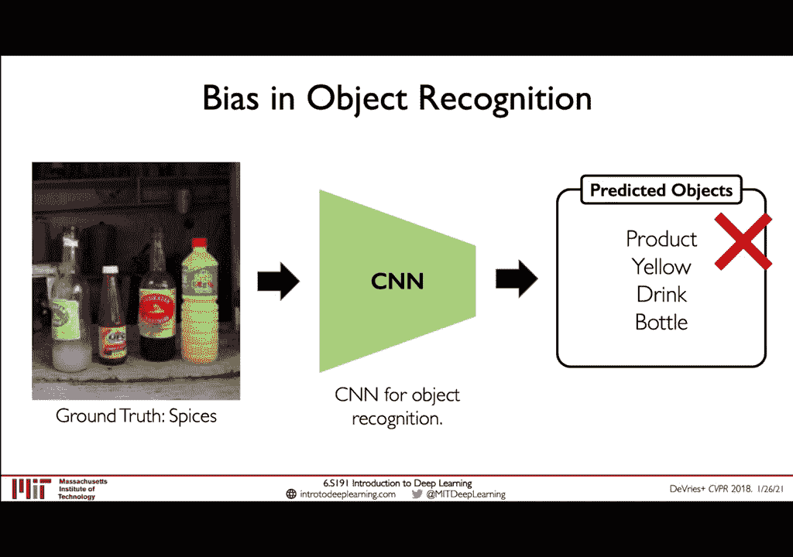

在今天的课程中，我们将首先探讨算法偏见的不同表现和来源。然后，我们将讨论减轻这些偏见的不同策略，并最终致力于提高人工智能算法的公平性。这绝不是一个已经解决的问题。本次课程的设置和动机正是介绍这些主题，以便我们开始思考如何推动这个领域向前发展。

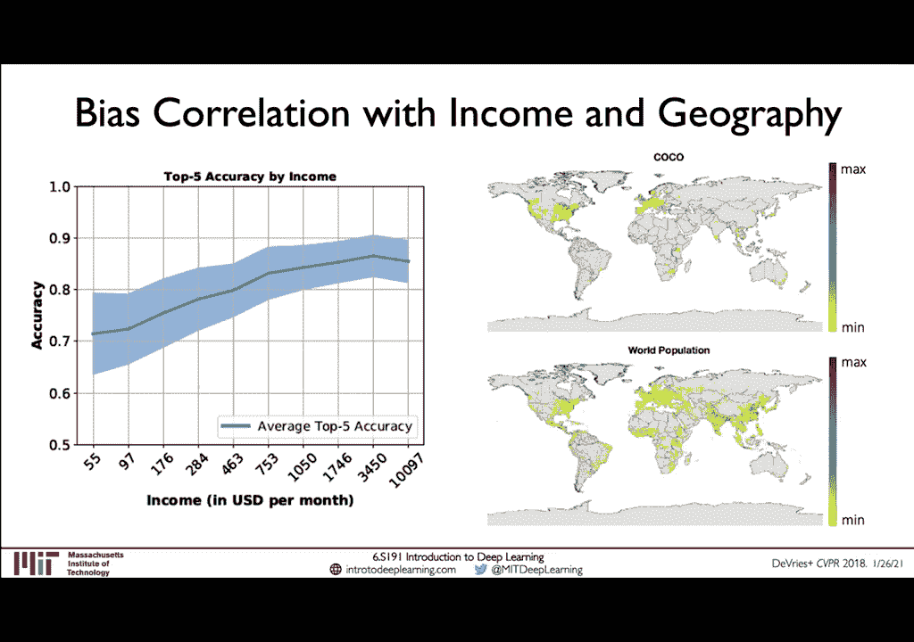

## 常见的偏见类型 📋

以下是深度学习系统中可能表现出的一些常见偏见类型，我们可以大致将其归类为数据驱动或解释驱动。

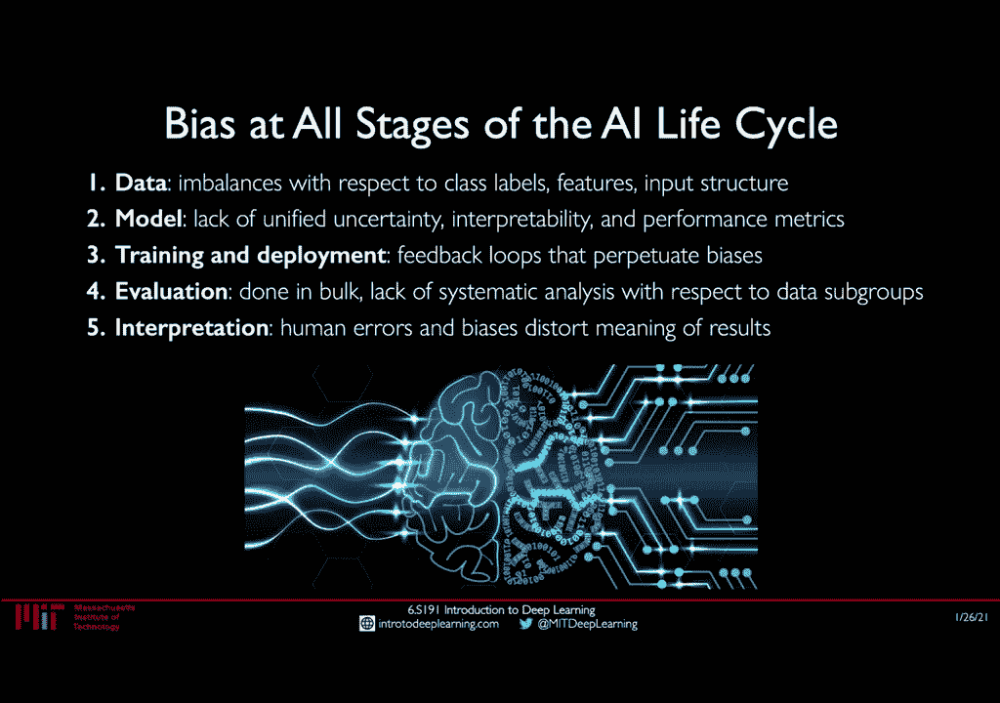

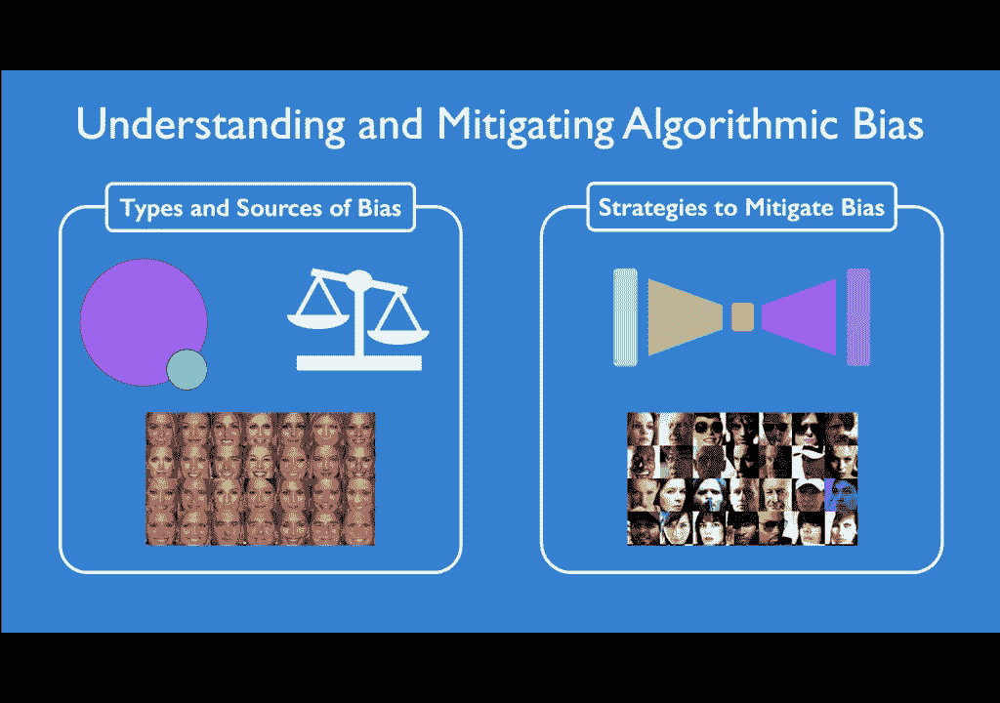

在数据驱动方面，我们常面临以下问题：
*   **数据选择偏差**：数据未被适当随机化选择。
*   **表征频率偏差**：数据中特定类型数据或特征的表示频率过高或过低。
*   **可用性偏差**：我们可用的数据例子不能反映现实世界中特定情况发生的真实可能性。

在解释驱动方面，更多地涉及人类对结果的解释如何延续偏见的问题：
*   **相关性谬误**：错误地将相关性与因果关系等同。
*   **过度概括**：即使面对有限的测试数据，也试图对AI系统的性能或泛化能力得出普遍结论。
*   **算法信任偏差**：盲目支持或信任算法的决定，而非人类的决定。

请注意，这只是对可能存在偏见的常见类型的调查，旨在让你思考不同的方法和偏见类型。接下来，我们将具体讨论这些偏见。

### 解释驱动偏见：相关性谬误与过度概括

首先，让我们从解释驱动的相关性谬误和过度概括开始。

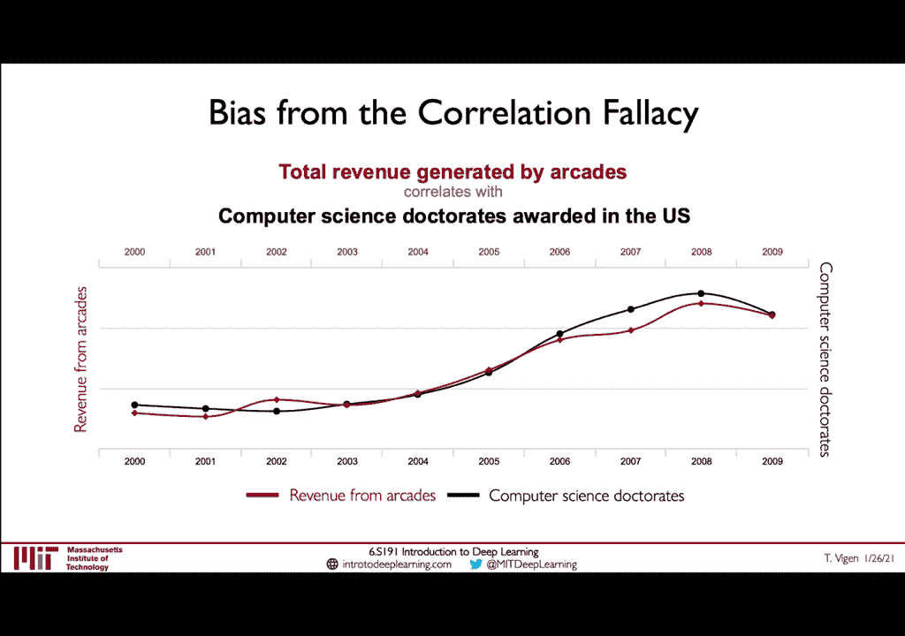

假设我们有一个图表，显示了两个变量随时间变化的趋势，并且它们似乎紧密相关。例如，黑点代表美国每年授予的计算机科学博士学位数量，红线代表每年街机游戏的总收入。我们可以想象建立一个机器学习管道，使用红色变量（街机收入）来预测黑色变量（CS博士数量）。然而，街机收入与CS博士数量在这个时间段内相关，但它掩盖了推动CS博士数量增长的潜在因果因素。这就是相关性谬误的一个例子，它不仅仅意味着“相关性不等于因果关系”，当被错误或不恰当地使用时，它也会产生和延续偏见。

接下来考虑过度概括的假设。假设我们在一个精心策划的马克杯图像数据集上训练了一个CNN，然后将其部署到现实世界。过度概括的偏见意味着，我们的模型在与训练示例相似的马克杯上可能表现很好，但在数据中表现不典型的马克杯上则表现不佳，尽管我们期望它能泛化。这种现象通常被称为**分布偏移**，它确实会导致网络在以前未遇到过的示例上表现更差。

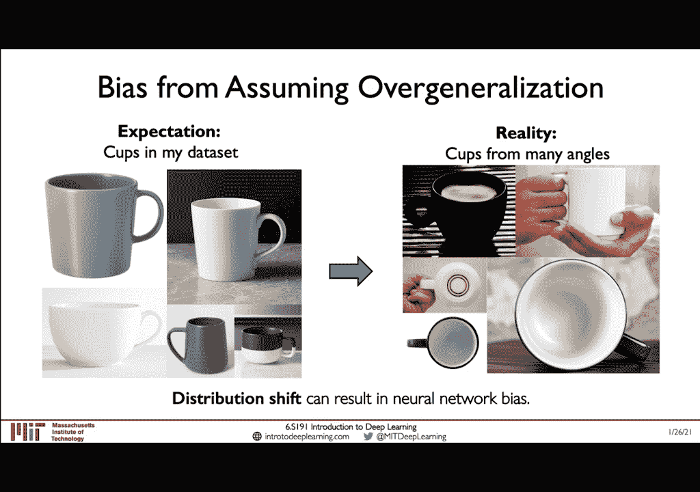

最近提出的一项缓解这种偏见来源的策略是从数据集入手，尝试构建一个考虑到潜在分布变化的数据集。例如，通过指定训练图像，然后相对于特定变量（如时间、地理区域）来构建测试数据集。在医学图像的情况下，这可能意味着从不同的医院获取训练、验证和测试数据。随着对分布偏移问题的更多认识被揭露，像这样的数据集可以帮助尝试驯服和调整可能发生的泛化偏见，因为它们内在地强制要求必须在分布偏移的实例系列上测试模型。

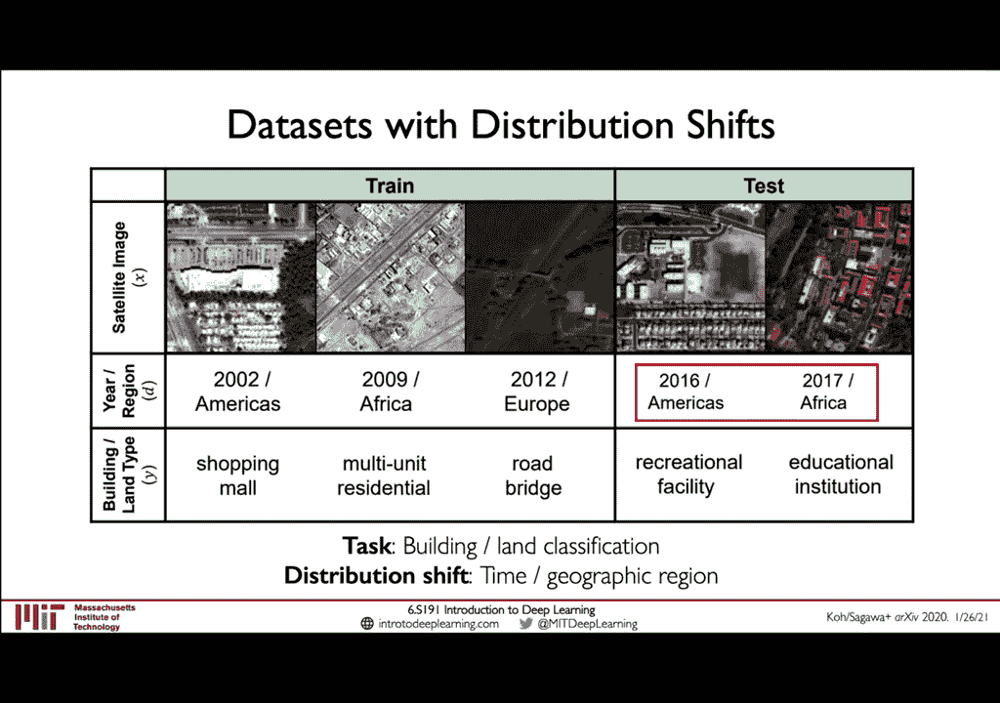

希望这能让你感受到解释驱动偏见及其问题所在。接下来，我们将把大部分注意力转向深度学习中最普遍的偏见来源和形式之一——由数据中首先出现的类别或特征不平衡所驱动的偏见。

### 数据驱动偏见：类别不平衡

让我们考虑类别不平衡是如何导致偏见的。假设左边的图表显示了我们试图建模的数据的真实世界分布，涉及一系列类别。但我们在该数据中可用的数据，其类别频率与现实世界中发生的完全不同。这会对模型的准确性产生什么影响？模型的准确性是否反映了数据的真实分布？不，模型的准确性最终可能会有偏差，偏向于它在训练中更频繁看到的类别，这绝对不是我们想要的。我们最终希望得到一个在性能方面无偏的模型，它在不同类别上的准确性应该大致相同。

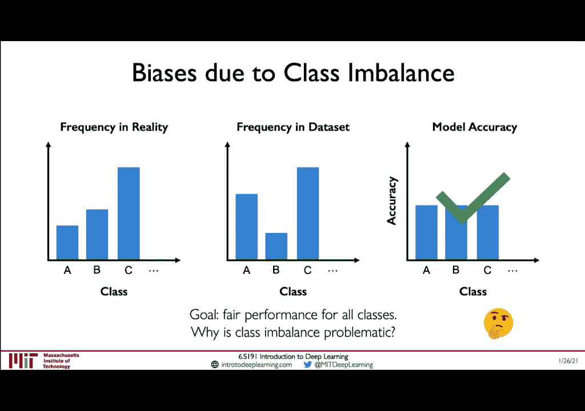

为了理解如何实现这一点，我们首先需要理解为什么类别不平衡会给模型训练带来根本性问题。考虑一个简单的二分类任务。我们从随机初始化分类器开始，假设数据集是类别不平衡的，每看到1个橙色点，模型会看到20个蓝点。梯度下降的学习过程将根据观察到的数据进行增量更新。由于看到蓝点的频率远高于橙点，决策边界会不断向蓝色区域移动，最终偏向多数类（蓝色）。这是一个非常简单的例子，展示了学习过程如何由于明显的类别不平衡而最终倾斜。

类别不平衡是一个非常普遍的问题，在处理真实世界数据时几乎肯定会遇到。一个特别相关的环境是医疗保健领域，因为许多疾病（如癌症）在普通人群中的发病率实际上相对罕见。

为了理解为什么这有问题，假设我们想训练一个深度学习模型，从医学图像（如MRI扫描）中检测脑瘤（胶质母细胞瘤）。这种肿瘤很罕见，大约每十万人中有三例。如果我们数据集中类别发生率反映了真实世界发病率，那么在一个十万张脑部扫描的数据集中，只有三张真的有肿瘤。这样训练的模型后果是什么？分类模型最终被训练以优化其分类精度，因此这个模型基本上可以退化到一直预测“健康”，因为如果这样做，它实际上能达到99.997%的准确率，即使当它看到脑瘤时也预测为健康。这显然极有问题，因为建立这个管道的全部目的是检测肿瘤。

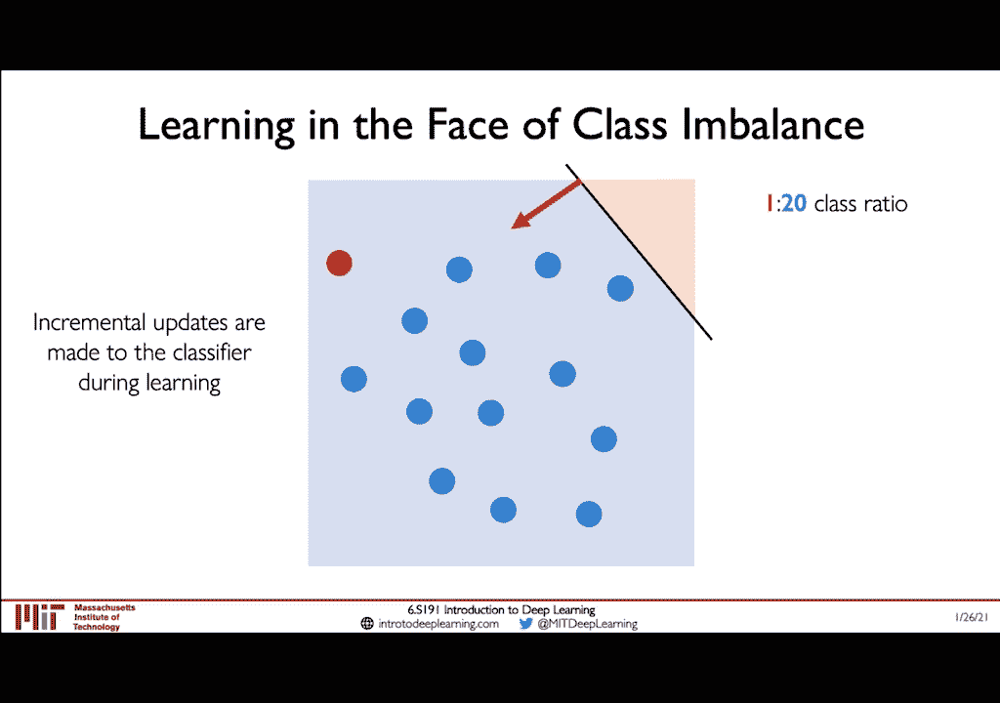

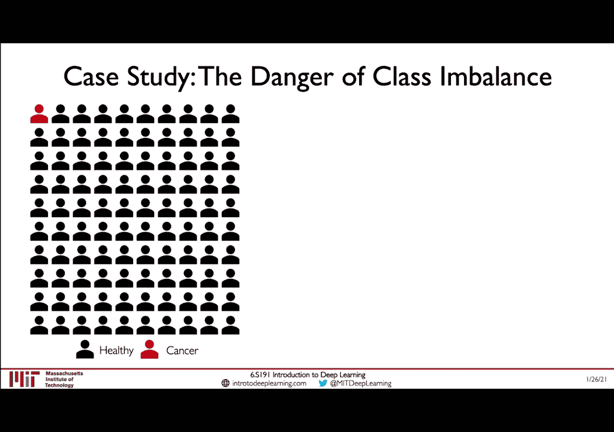

那么，我们如何缓解这种情况？为了理解这一点，我们将讨论在学习过程中经常用来实现类别平衡的两种非常常见的方法。

再次考虑我们的简单分类问题。缓解这种类别不平衡的第一种方法是**以类别平衡的方式选择和馈送批次**。这意味着，我们现在将使用显示1:1类别比例的数据批次。在学习过程中，分类器将看到关于这些类别的相等表征，并相应地移动决策边界。最终结果将是一个相当合理的决策边界，大致平等地分割空间。

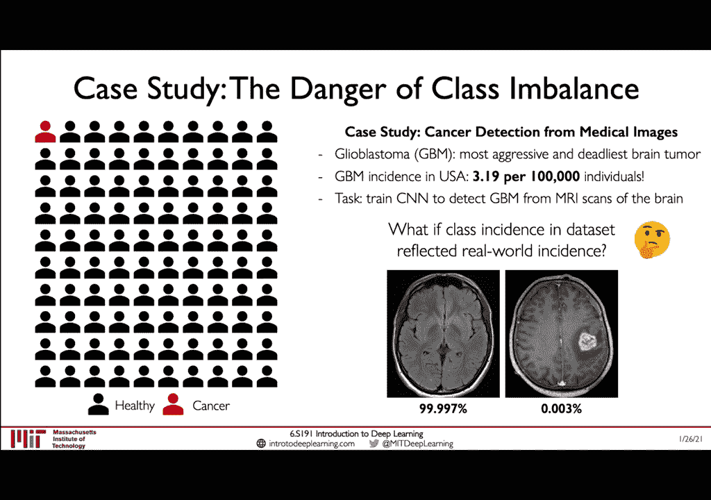

另一种方法是**根据数据点在数据集中出现频率的反比，来重新加权单个数据点被选择用于训练的概率**。更频繁的类别会有更低的权重，不太频繁的类别会有更高的权重。最终结果是，我们将产生一个类别平衡的数据集，不同的类别将对模型的学习过程做出同等的贡献。我们可以通过用数据点的大小反映其在训练中被选中的概率来可视化这个重新加权的想法：增加选择稀有类别的概率，降低选择常见类别的概率。

### 数据驱动偏见：特征不平衡

到目前为止，我们一直关注类别平衡的问题。但如果我们的类别是平衡的，每个类别内部还会有偏见和不平衡吗？为了理解这一点，考虑我们试图训练面部检测系统的问题。假设我们有相等数量的面部和非面部图像用于训练。然而，可能有隐藏的偏见潜伏在每个类别中，这可能更难识别，甚至更危险。这可能反映了类别内部特征空间缺乏多样性。

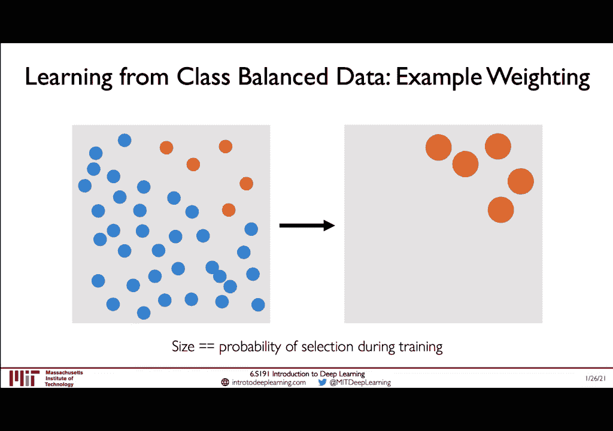

继续面部检测的例子，这种特征的一个例子可能是个人的发色。在现实世界中，发色的真实分布大约是：70-80%的人口有黑发，18-20%有棕发，2-5%有金发，约2%有红发。然而，一些常用于图像分类和人脸检测的基准数据集根本没有反映这种分布，因为它们过度代表了棕色和金发，而代表黑发不足。当然，一个完美平衡的数据集将对这四种发色有相等的表征。这里我们故意将问题过分简化；实际上，包括发色在内的所有特征都存在于数据空间的光滑流形光谱中。理想情况下，我们最终想要的是捕捉更多关于这些特征如何在数据流形中分布的微妙之处，并利用这些知识积极消除我们深度学习模型的偏见。但为了本例的目的，让我们继续简化视图。

假设我们使用这个基准数据集来训练CNN进行面部检测。在测试时最终会发生什么？我们的模型最终在其性能上对这些不同的发色人口统计有偏见。确实，正如本课开始时介绍的，这些完全相同类型的偏见在大规模商业级面部检测与分类系统中表现得相当强烈。

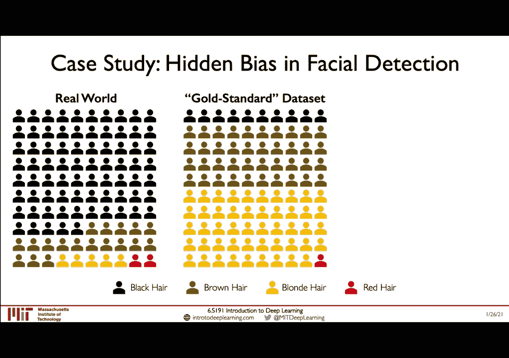

这些考虑加在一起提出了一个关键问题：我们如何真正识别那些可能是隐藏的、而非非常明显的（如肤色或发色）潜在偏见？我们如何将这些信息集成到学习管道中？更进一步，学习管道和技术如何实际使用这些信息来减轻这些偏见，一旦它们被识别出来？

## 利用机器学习提高公平性 🛠️

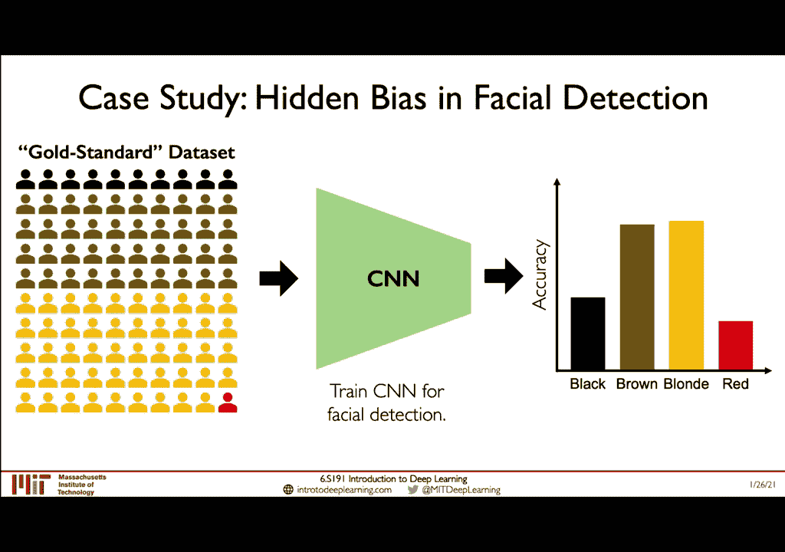

这两个问题引出了深度学习中的一个新兴研究领域：使用机器学习技术实际提高这些系统的公平性。这可以通过两种主要方式实现：

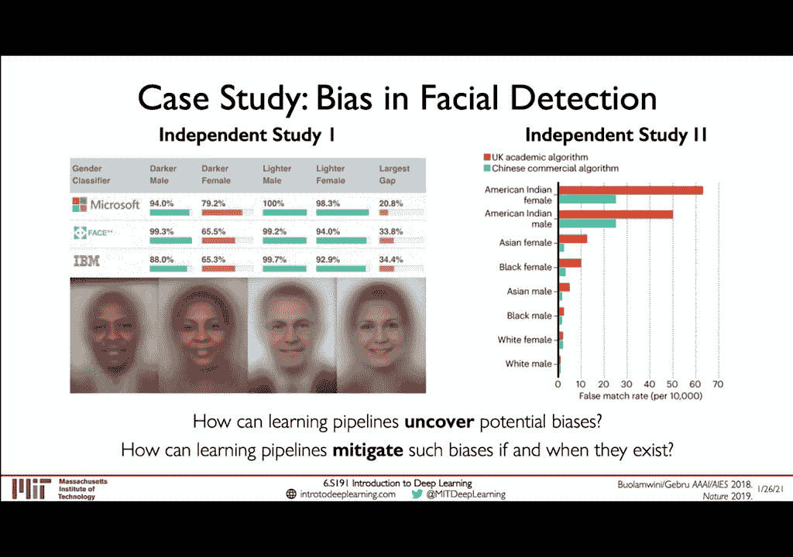

1.  **偏见缓解**：给定一个有偏见的数据集或学习管道，我们尝试应用一种旨在消除导致不必要偏见的信号方面的机器学习技术。结果是这种偏见沿特定轴得到有效缓解，我们从中移除信号，产生一个公平性提高的模型。
2.  **包容性增强**：不是试图消除信号，而是尝试添加回信号，以更多地包含数据空间中代表性不足的区域或特定人口结构，最终增加模型看到特定数据切片的程度。

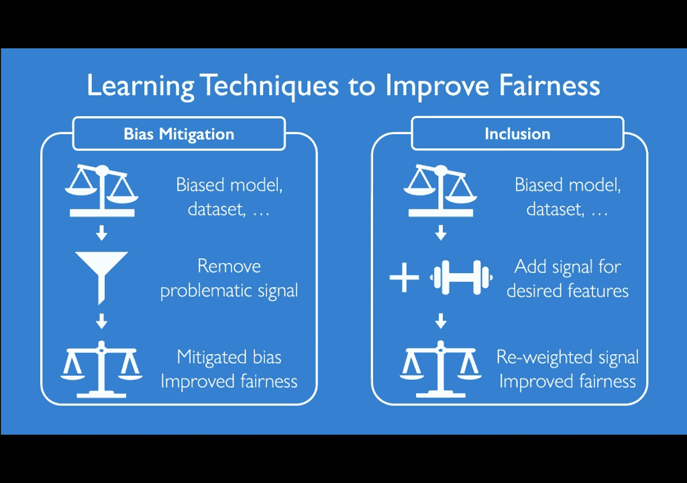

这是一个研究领域，我希望在未来几年能继续发展和进步。

### 评估偏见与公平的框架

为了讨论和理解学习技术如何减少偏见和提高公平性，我们首先需要设定一些关于如何正式评估机器学习或深度学习模型的偏见或公平的定义和度量。

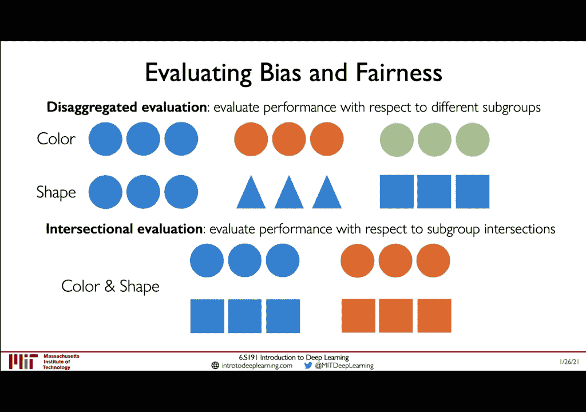

对于这些例子，我们将考虑监督学习（特别是分类）的设置。分类器最终应该在它应该预测的内容上，对一系列敏感特征产生相同的输出决策。因此，如果分类器的决策在暴露于特定的敏感特征输入后发生改变，我们可以定义它是有偏见的。这意味着对于特定变量 **Z** 是公平的，如果分类器的输出相同，不管我们是否以那个变量为条件。例如，如果我们有一个二元变量 **Z**，预测正确的可能性 **P(Ŷ=Y | Z=0)** 应该与 **P(Ŷ=Y | Z=1)** 相同。

这给出了一个我们可以考虑的框架，用于评估监督分类器的偏见。我们可以更进一步，实际定义性能指标和评估分析来确定这些偏见和公平程度。通常做的一件事是衡量不同感兴趣的子群体或人口统计数据的表现，即进行分组评估。例如，如果我们在处理彩色形状，这可能是关于保持形状不变时评估颜色特征，或者保持颜色不变时评估形状特征。我们也可以查看不同子群体或人口统计数据交汇处的表现（例如，同时考虑颜色和形状，比较蓝圈与橙方上的表现等）。

### 减少偏见的深度学习方法

现在我们已经定义了什么是公平的分类器以及一些评估偏见的方法，我们有了一个框架来讨论一些最近的工作，这些工作实际上使用深度学习方法来减少监督分类中的偏见。

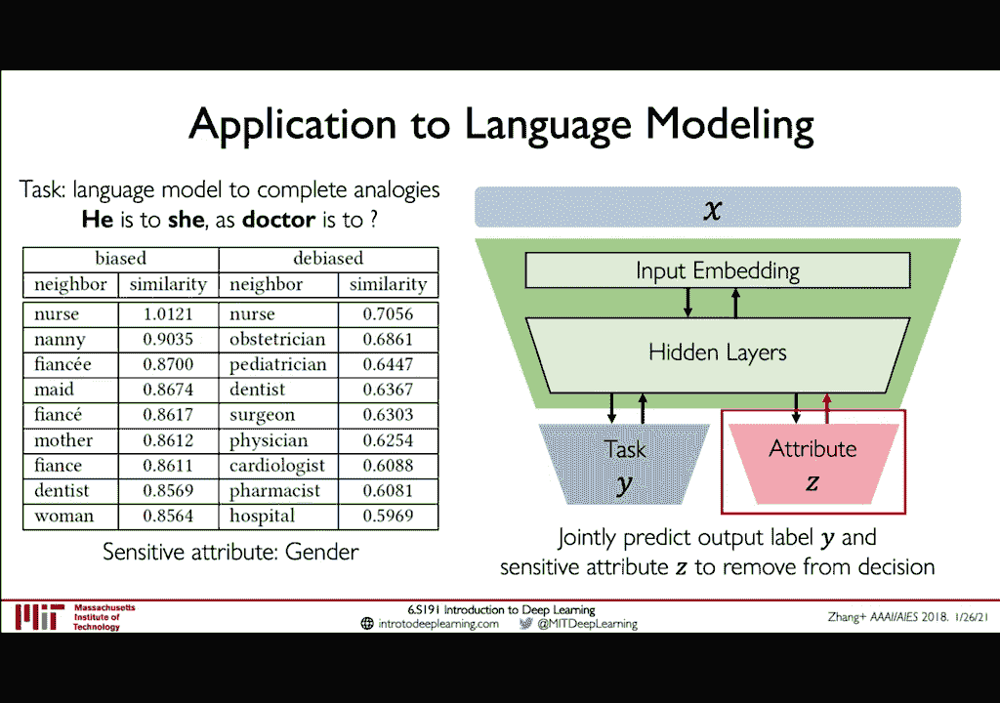

**方法一：多任务对抗训练**
第一种方法在多重任务学习设置下使用对抗性训练。它的工作方式如下：人类用户需要从指定一个我们试图对抗的属性 **Z** 开始。学习问题是，我们训练一个模型来共同预测输出 **Y** 以及这个属性 **Z** 的值。给定一个特定的输入 **X**，网络将其通过嵌入层和隐藏层传递，在输出端，网络将有两个“头”，每个头对应一个预测任务：一个是对目标标签 **Y** 的预测，另一个是对敏感属性 **Z** 的预测。我们的目标是尝试消除敏感属性对任务预测决策结果的任何混淆影响。这种效果的消除是通过在训练中强加一个对抗性目标来完成的，特别是在反向传播过程中否定属性预测头的梯度。这样做的效果是消除该属性预测对任务预测的影响。

当这个模型被提出时，它首先应用于一个语言建模问题，其中指定的敏感属性为性别，感兴趣的任务是完成类比（例如，“他对医生就像她对____”）。一个有偏见的模型在这个类比上测试时，返回的顶级预测是“护士”、“保姆”、“未婚妻”等，这清楚地表明了潜在的性别偏见。然而，使用这种多任务方法指定性别作为属性的无偏模型，更有可能返回“儿科医生”或“医生”等同义词的例子，表明在一定程度上减轻了性别偏见。

然而，这种方法的主要限制之一是需要我们人类用户指定要针对其设计的属性。这可能受到两方面限制：首先，因为可能会有隐藏的和未知的偏见，这些偏见从一开始就不明显，而我们最终也想对这些偏见进行处理；其次，通过指定敏感属性是什么，我们人类可能无意中传播了我们自己的偏见。因此，我们最终渴望的是一个自动化系统，可以试图识别和发现数据中潜在的偏见，而无需任何注释或规范。

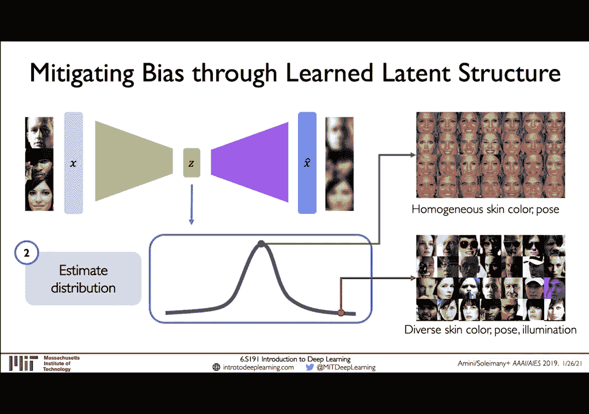

**方法二：基于生成模型的自动去偏**
事实上，这是生成模型的一个完美用例，特别是那些能够学习和发现数据集中潜在变量的模型。在面部检测的例子中，如果我们得到许多不同的面孔，我们可能不知道这个数据集中特定潜在变量的精确分布是什么。在这些不同的变量方面可能会有不平衡（例如面部姿势），最终可能在我们下游的模型中导致不必要的偏差。正如你在生成模型中看到的，我们实际上可以学习这些潜在变量，并利用这些信息自动发现潜在空间中代表性不足和过高的特征区域，并利用这些信息来减轻其中的一些偏见。

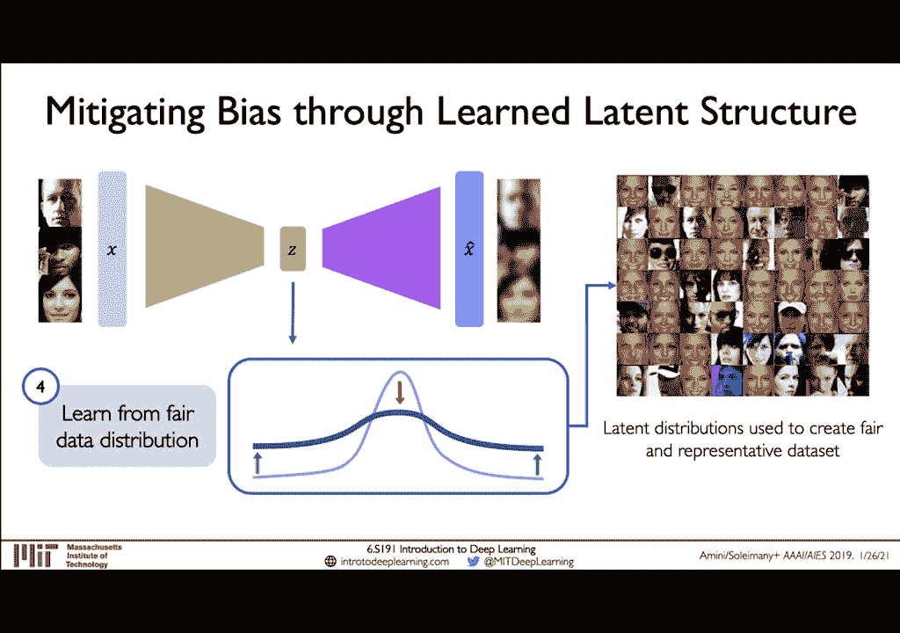

我们可以通过使用变分自编码器结构来实现这一点。在最近的工作中，我们展示了基于这个VAE网络架构，我们可以以完全无监督的方式了解数据集的潜在结构。例如，在人脸图像中拾取潜在的变量，如方向，这些变量从未被指定到模型中，而是它通过观察许多不同的人脸例子，将其作为一个重要的潜在变量来学习。然后，我们可以估计这些学习到的潜在变量的分布。如果我们的数据集中有许多特定肤色的人脸图像，这些将被过度代表，因此在训练中选择具有这种肤色的特定图像的可能性会不公平地高，这可能导致不必要的偏见。反之，具有罕见特征（如阴影、深色眼镜、帽子）的脸可能在数据中代表性不足，因此选择具有这些特征的实例进行模型训练的可能性会很低。通过揭示潜在结构的分布，从而揭示不必要的偏差。

我们展示了这个模型实际上可以自适应地调整在训练过程中单个数据实例的采样概率（重新加权），这样这些潜在的分布和这种重采样方法可以用来自适应地生成更公平、更有代表性的训练数据集。

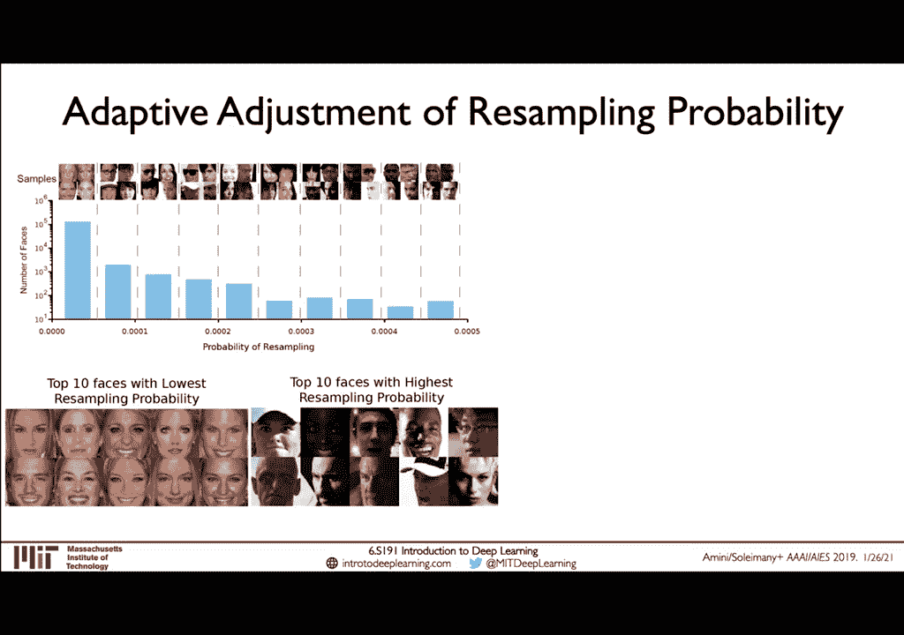

深入挖掘这种重采样操作背后的数学原理，这种方法的关键点是通过联合直方图近似潜在空间分布。具体来说，我们估计每个潜在变量的单个直方图，并假设这些潜在变量是独立的，以便我们可以利用它们的乘积来得出对整个潜在空间联合分布的估计。根据这一估计的联合分布，我们可以定义在训练期间对特定数据点 **X** 采样的调整概率，基于该输入实例 **X** 的潜在空间。特别是，我们定义选择该数据点的概率，根据潜在空间上近似联合分布的逆（再次由这些单独的直方图定义），并进一步由偏置参数 **α** 加权，它调整使用这种方法所需的去偏程度。

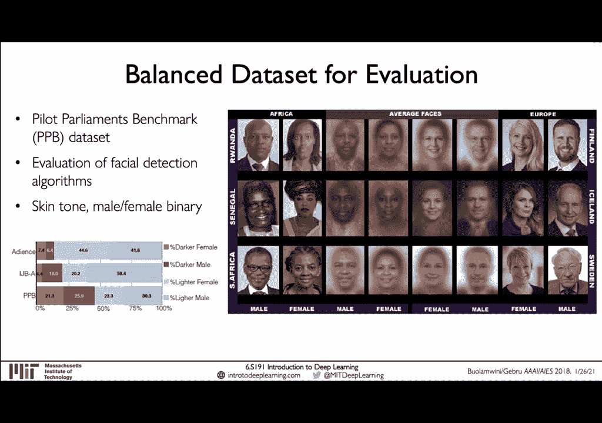

将其应用于面部检测，我们展示了实际上可以增加对特征不足的人脸重新采样的概率。当我们在训练过程中部署这种方法来实际选择批次时，对于肤色、姿势、照明等特征会更加多样化。这种方法的力量在于它基于自动学习到的特征进行这种重采样操作，不需要人类注释属性或偏见应该是什么，因此更容易推广，并允许同时消除对多种因素的偏见。

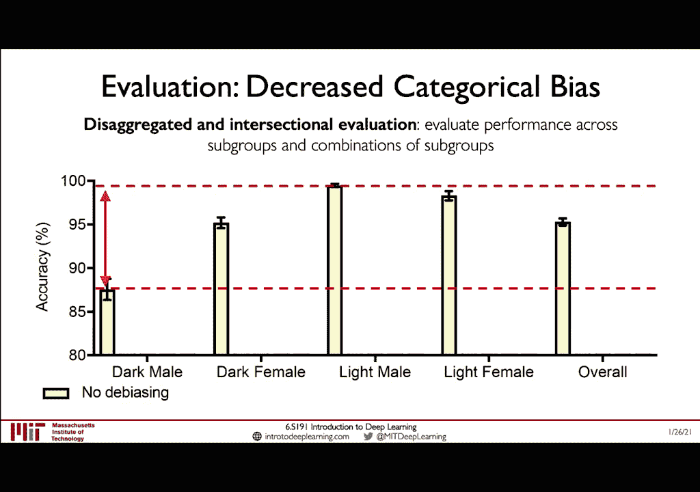

为了评估这个算法实际上在多大程度上减轻了偏见，我们在一个最近的面部检测系统评估基准数据集上进行了测试，该数据集平衡了男性和女性的性别以及肤色，并确定了存在的偏见程度。我们评估了此数据集中跨子组的性能。当我们首先考虑没有任何去偏的模型（所谓的有偏模型）的性能时，我们观察到它在深色皮肤男性上表现出最低的准确性，在浅色皮肤男性上准确率最高，两者相差约12%。然后，我们将这个准确性与去偏模型的准确性进行比较，发现随着去偏程度的增加，总体准确性增加，特别是在深色皮肤男性和女性等子组上。而且关键的是，深色男性和浅色男性在准确性上的差异显著减小，表明这种方法实际上可以显著减少分类偏见。

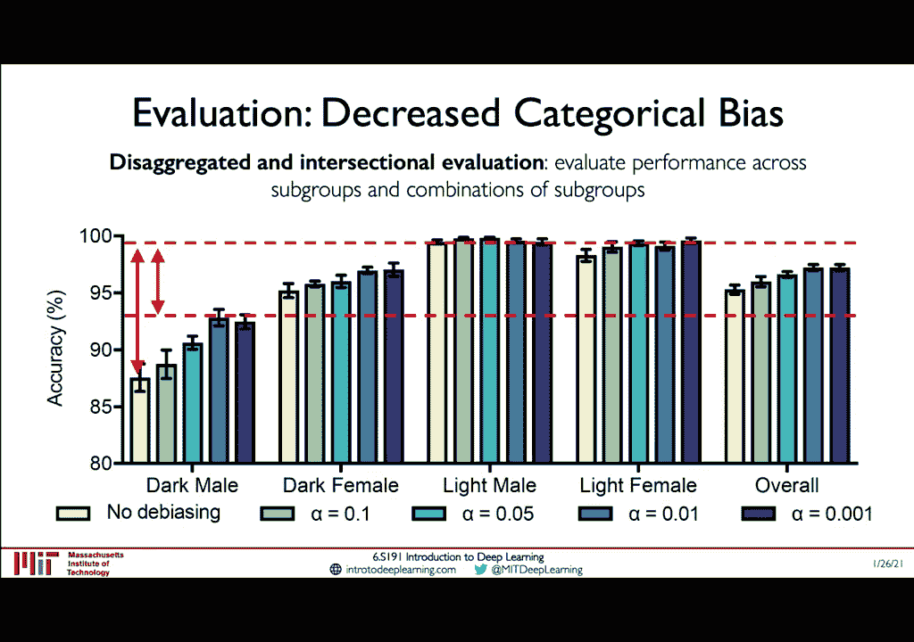

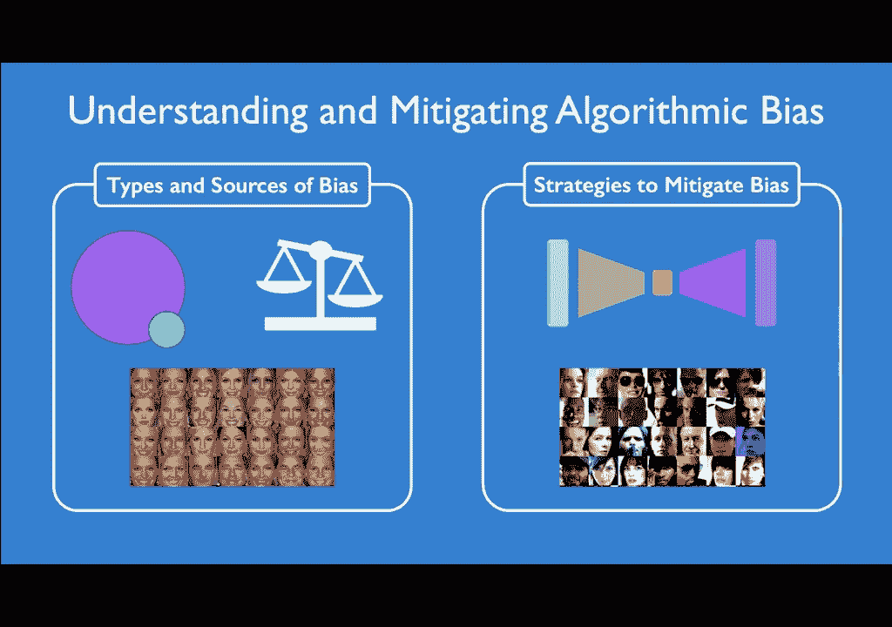

## 总结与展望 🌟

在今天的课程中，我们已经探索了不同的偏见是如何在深度学习系统中产生和表现的。我们还讨论了一些新兴的策略，这些策略实际上使用深度学习算法来减轻这些偏见。

最后，我想通过提供一些关于提高人工智能公平性的关键考虑因素来结束。

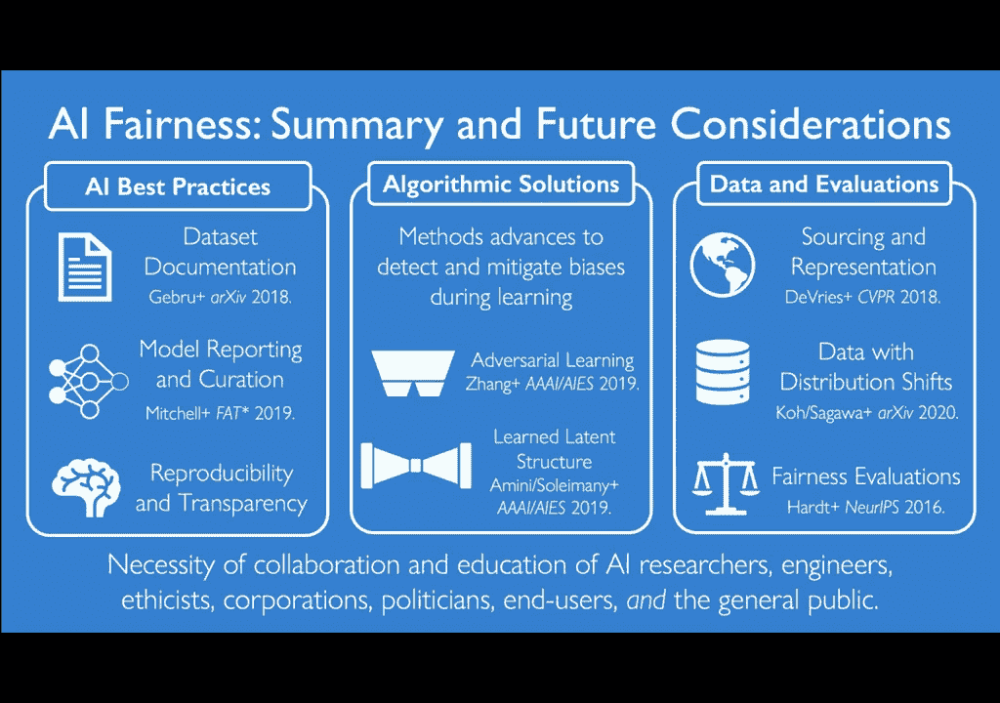

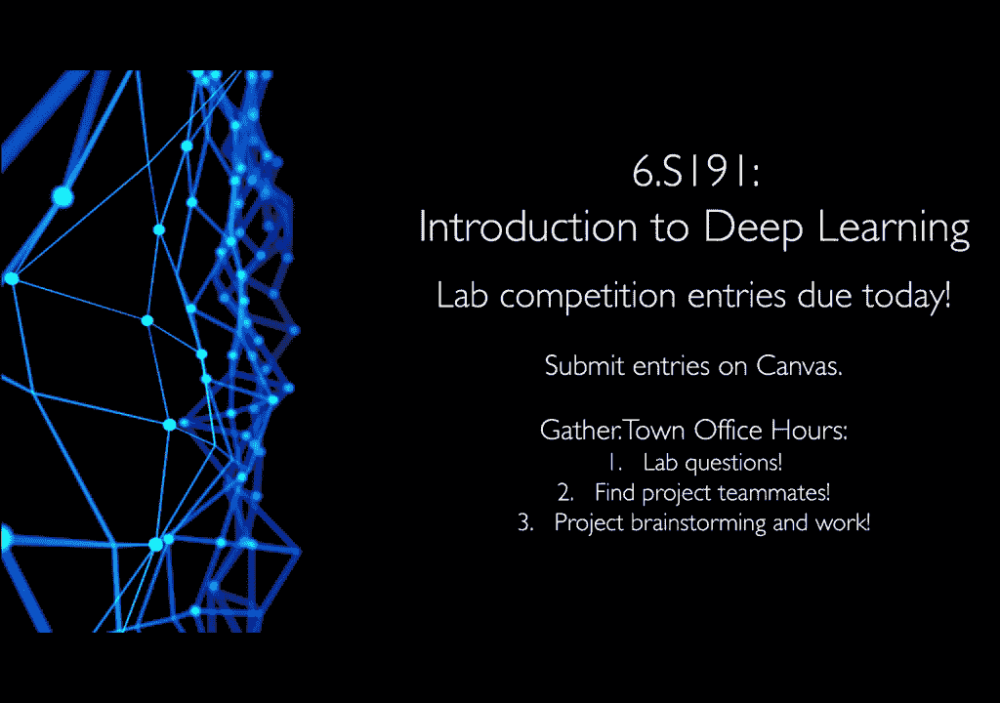

1.  **最佳实践**：在人工智能的科学和实践中应该成为标准的事情，例如提供关于公布数据集和模型的文档与报告，总结训练信息、评估指标与模型设计。这旨在提高这些数据集和模型在被使用和部署时的可重现性和透明度。
2.  **算法解决方案**：需要在学习过程的各个方面实际检测和