# 12：人工智能在医疗保健领域的应用 🏥

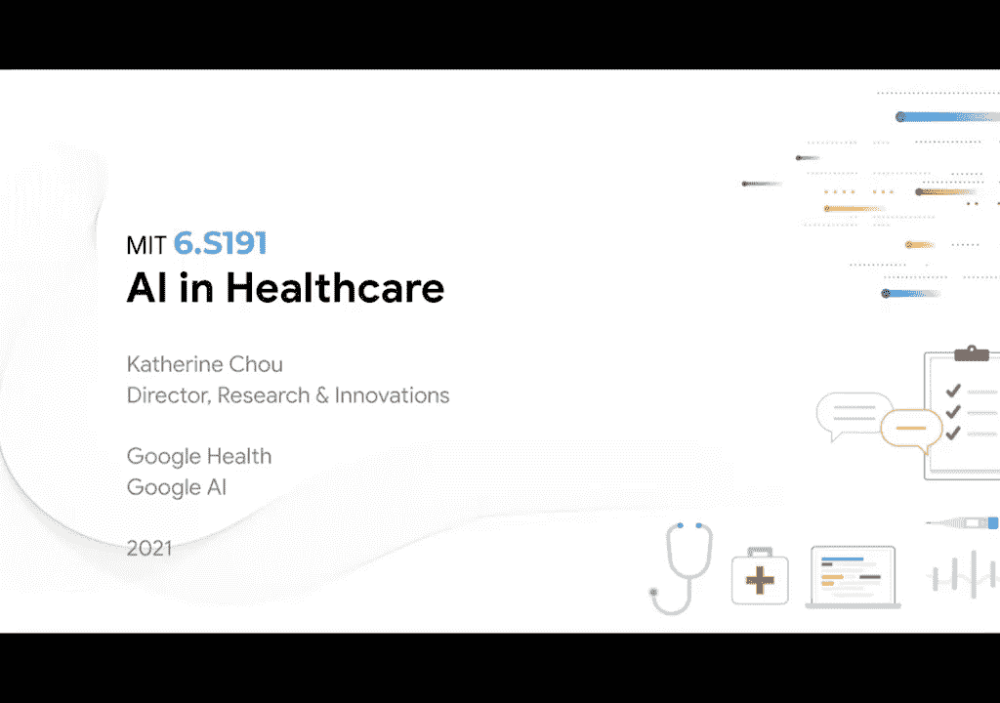

在本课程中，我们将探讨人工智能，特别是深度学习，在医疗保健领域的应用、机遇与挑战。我们将了解其如何帮助解决医疗资源不均、提升诊断精度，并讨论如何构建更公平的人工智能系统。

## 概述

人工智能技术，尤其是深度学习，正深刻改变着医疗保健行业。本课程将介绍其在计算机辅助诊断、病理学分析、基因组学等领域的应用实例。同时，我们将深入探讨如何利用这项技术促进医疗公平性，并审视其在公共卫生等更广泛领域的潜力。

## 人工智能在医疗保健中的兴起

上一节我们概述了课程内容，本节中我们来看看推动人工智能在医疗领域应用的关键因素。深度学习在医疗保健领域的成功应用得益于几个关键趋势的成熟。

首先，是端到端学习能力的成熟，使得模型可以直接从原始数据中学习。这在计算机视觉和语音识别领域的进步，对医学极具价值。

其次，通过GPU实现的本地化计算能力大幅提升，这使得神经网络的性能超越了过去的非神经网络方法。

第三，是开源大型标记数据集的价值。例如ImageNet（虽非医疗领域）以及医疗领域的公共数据集，如英国生物银行（UK Biobank）和MIMIC，都非常有帮助。MIMIC实际上是在麻省理工学院实验室开发和生产的。

## 医疗保健的独特需求与技术匹配

了解了技术背景后，我们来看看医疗行业有哪些独特需求能与人工智能的能力相匹配。我们确保关注行业需求，并将其与技术能力进行匹配。

医疗保健每年产生大量复杂的海量数据，估计每年产生数千艾字节的健康数据。为了正确看待这个数据量，据估计整个互联网的数据量大约是数百艾字节。因此，医疗数据量是互联网的数千倍。

我们现在看到的应用程序（稍后您将看到）是模式识别，以及识别病变、肿瘤和图像中非常细微特征的能力。

人工智能有用的另一个领域是解决全球医学专业知识有限的问题。如果你想看右边图表，一位医学专家（如放射科医生）与人口的比例大约是一比一万二千。但在发展中国家，这个比例看起来更像是一比十万、一比一百万，甚至更少。

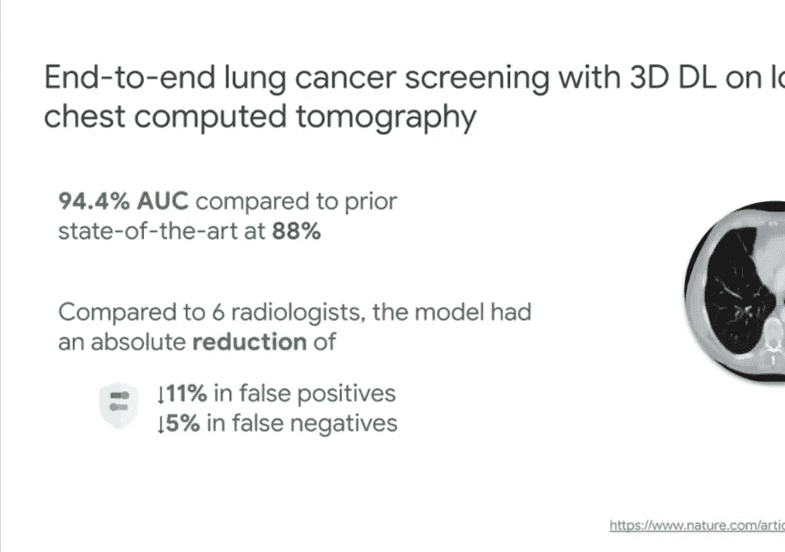

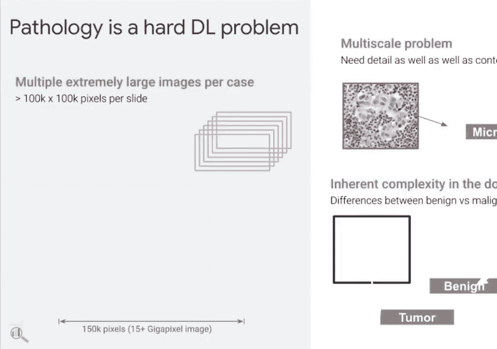

因此，人工智能在医疗保健中的好处在于，它可以帮助扩展执行许多专家有能力完成的复杂任务。

第三点是真正解决人类判断的不一致性问题。我们稍后会讨论这一点，特别是在我们谈论生成标签时。人工智能模型没有明显的近因偏差或认知偏差。它们也能够不知疲倦地工作，这在需要加班时（在医学领域经常发生）是一个优势。

## 关键应用领域

在匹配了需求与技术之后，本节我们将深入几个具体的应用领域，看看人工智能如何解决实际问题。

### 肺癌筛查

我们开发了一种计算机辅助诊断模型，用于通过低剂量CT扫描帮助筛查肺癌。通常，如果癌症在早期被发现，存活率会急剧上升。但大约80%的肺癌没有在早期被发现。

用于这些筛查的是低剂量CT扫描。如果你看右边的图，这是发生在你全身的三维成像，它创建了数百张图像供放射科医生查看。肺癌的征兆很微妙。

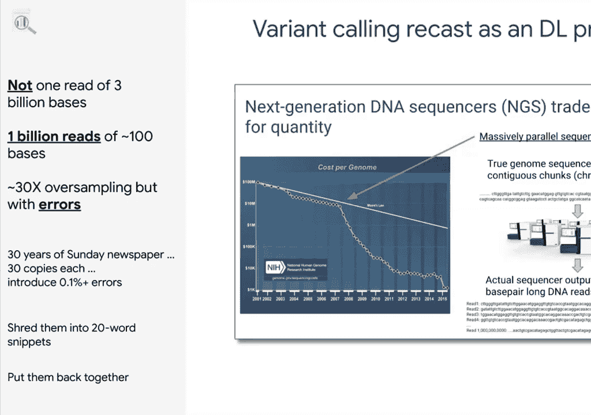

因此，我们的模型所做的，我们认为不仅仅是超越了最先进的技术，更重要的是，我们将其与放射科医生进行了比较，看看是否在假阳性和假阴性方面都有绝对减少。假阳性会导致医疗系统的过度使用，假阴性则会导致癌症无法被足够早地发现。

通常，一旦两者都减少了，就能带来益处。

### 病理学分析

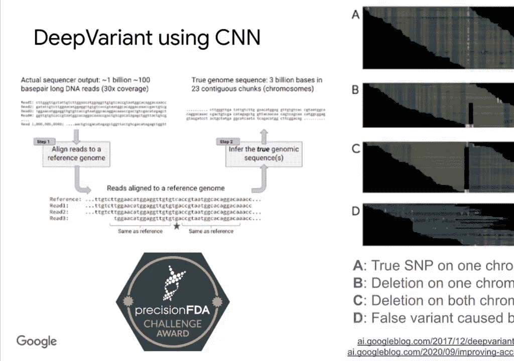

病理学是另一个受益于深度学习的领域，它涉及甚至更复杂的数据。左边图中，你可以看到在进行活检时，身体组织的切片被放大四十倍，并在每张幻灯片上创建大约10到15千兆像素的信息。

本质上复杂的部分在于，进行病理分析时，你需要知道组织的高度放大水平（A级），以便描述病变的特征。你还需要了解整个组织结构，为其提供上下文（在较低的放大倍数下）。因此，这是一个多尺度问题。

这也是固有的复杂性，能够区分良性和恶性肿瘤。有数百种不同的病理状况会影响组织，因此在视觉上进行区分非常有挑战性。

我们建立的模型用于从病理图像中检测乳腺癌。病理学家实际上没有假阳性。该模型能够捕捉到超过95%的癌症病变，相比之下，病理学家只发现了73%。但这也增加了假阳性的数量。

因此，我们尝试将模型和病理学家的工作结合起来，看看准确性能否提高。结果确实提高了。这种共同努力还导致了一种增强显微镜的发展，你可以在显微镜视图本身中看到模型检测到的微小区块。我们稍后会回到模型存在某些弱点以及我们如何处理的问题。

### 基因组学

基因组学是另一个显著受益于深度学习的领域。值得注意的是，当你进行全基因组测序时，你所做的是将你的DNA分解成大约十亿条、每条约一百个碱基的读段。这样做时，大约有30倍的覆盖度（误差采样）。

当你尝试弄清楚序列时，你想做的事情类似于：拿三十份周日出版的报纸，每份都有错误，然后把它们切成二十个单词的片段，再试着把它们重新组合在一起。这就是进行测序时发生的事情。

因此，我们将这个问题重新定义为深度学习问题。我们研究了图像识别，特别是卷积神经网络如何能够在这个空间中执行。我们开发了一个名为Deep Variant的开源工具，供任何人使用。

随着时间的推移，我们一直在改进它，这被证明是一个非常准确的工具。美国食品药品监督管理局每隔几年举办一次精准FDA挑战赛，Deep Variant表现出色，在四分之三的准确度领域获奖。你可以在右边看到，当你在测序中得到假变异错误时，在视觉上很明显。所以这是一个巧妙的方法。

## 扩展医学专业知识与辅助工具

我们讨论了医疗领域的不同需求，其中之一是有限的医学知识。有一种方法可以帮助他们，即扩展他们能够执行的任务，使其自动化。这是另一种表述方式：归还医生的时间。

你在这张照片中看到的是，一位医生在就诊时，实际上是对着左边的电脑（输入信息）。这在医疗保健行业引发了许多关于技术成本以及它如何干扰患者护理的讨论。

医生们现在每天花大约六个小时与他们的电子健康记录系统交互，输入数据。一个成熟的、能够提供支持的领域是医学听写。人类抄写员已经被部署，医学听写已经变得更好了。

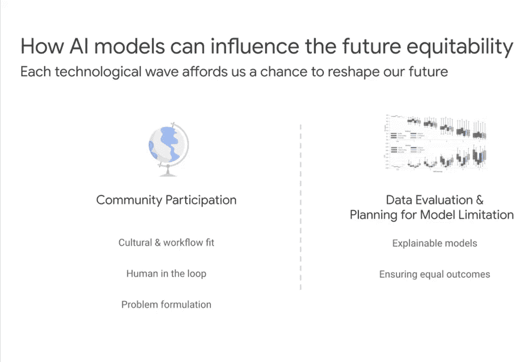

自动语音识别现在有了非常精确的端到端模型。它在自然语言处理方面也有显著改进。因此，这些更像是辅助性人工智能的方式，帮助医生减轻文书负担。

## 实现更大的愿景：促进公平

在介绍了具体应用后，我们退一步思考更大的图景。我想谈谈我们如何实现更大的宏伟目标。让我退一步，看看医疗保健目前的角色。它充满了巨大的碎片化，这是相当客观的，并且分布不均。

我注意到的一件事是，在技术方面，如果你把它应用到一个系统上，我们确实会放大该系统。因此，技术是一种既能增强又能扩大现有事物的方式。所以，如果你把它应用到一个激励不当的破碎系统上，它不会从本质上修复系统，反而会加速其问题。

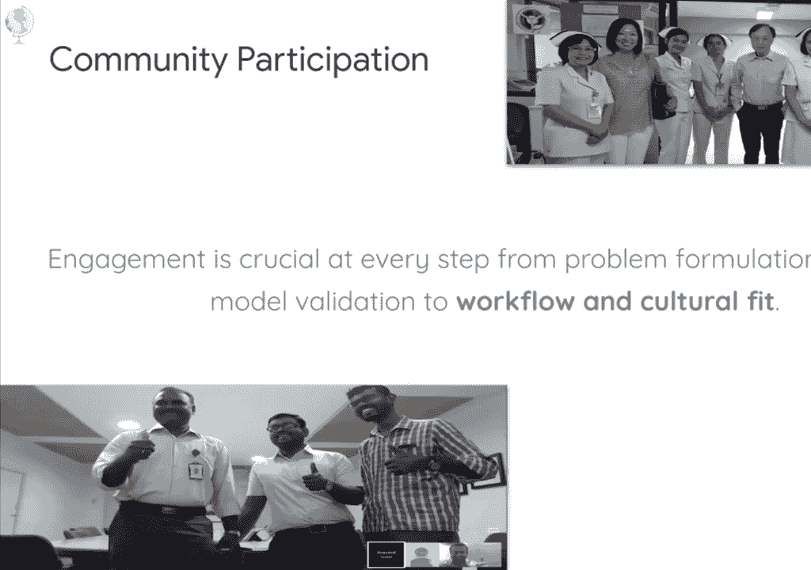

但机器学习的核心，以及这些深度学习技术，我们正在做的是非常仔细地查看数据，并利用这些数据来产生结果。在这种情况下，鉴于世界并不公平，你面临着训练出错误模型的风险。

我们还发表了一篇论文来帮助解决这个问题。可以说，社会不平等和偏见往往被编纂在我们使用的数据中。实际上，我们有机会在开发模型时检查这些历史偏见，并积极促进一个更公平的未来。

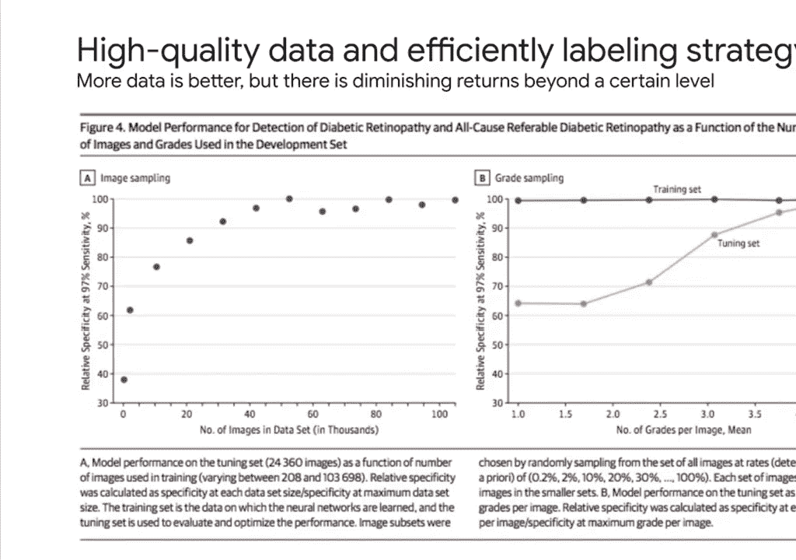

你可以通过纠正训练数据中的偏差来做到这一点。你也可以在模型设计和问题表述（你想解决什么）中纠正偏差。我们一会儿再谈这个。最后，如果这些都不适用，那么你还可以在部署人工智能模型时测试并确保结果的平等和资源的公平分配。

这是……我以前在谷歌X工作，那是谷歌从事“登月计划”的部门。我们定义“登月计划”的方式是：一个巨大问题、突破性技术和激进解决方案的交集。

这里的一个巨大问题是世界是不公平的、非人性化的，并且也需要更高的精度。我们现在有一项突破性技术，即人工智能和深度学习。我只想说，数字和移动工具实际上是医疗保健领域的突破性技术，因为它们往往比其他行业落后大约十年，这是由于监管、安全、隐私和质量需求。

因此，一个激进的解决方案是，我们实际上考虑的不仅仅是提高我们提供的护理质量，还要确保当我们这样做时，也使其更加公平。在我看到技术浪潮发生的每一个时间点，我确实意识到，在这一点上，这是我们重塑未来的机会。因此，在深度学习的背景下，我想谈谈真正推动进步的机会。

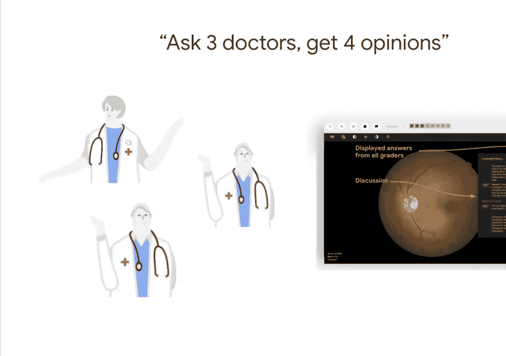

## 构建公平人工智能模型的关键

我没有意识到幻灯片没有前进。我想谈谈让人工智能模型更加公平的机会，以及我们将如何做到这一点。因此，我要讲的两个关键领域是：社区参与以及这将如何影响模型，以及在数据评估和规划模型限制方面，我们如何有效地做到这一点。

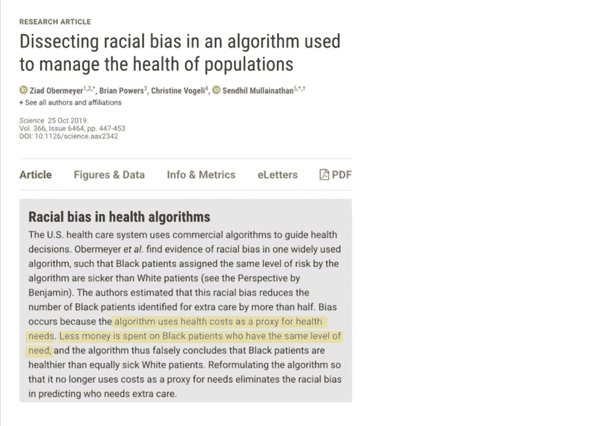

### 社区参与与部署环境

我们做的一件事就是与我们将直接部署模型的地区合作。左边以此类推，在这里，你可以看到我们与印度的团队合作。在右边，是我们的团队与泰国的人合作。

我们发现社会经济状况绝对重要，就你将在哪里部署模型而言。一个例子是当我们与眼科中心合作时。糖尿病是全世界日益增长的失明主要原因。这是模型开发的地方，但实际上，在糖尿病中心，用例最为严重。

因此，人们不会从内分泌科办公室跑一百米到眼科办公室，因为访问问题以及与线路等相关的挑战。所以这是我们探索的一个领域，广泛使用用户研究来确保我们仔细考虑人工智能模型将在哪里落地，以及这将如何影响。

### 通过高质量标签提升模型

我们看到的是，当我们为模型生成标签时，你可以在左边看到，正如你所期望的，当你获得更多数据时，模型会不断改进。所以它在这里变平了，有六万张图像。在某个时候，这就足够了，你不会从中得到更多的改善。

如果你看右边的图表，我们的改进在于标签的质量，或者我们所说的图像上的分级：每个医生对一张图像给出一个分级，这是他们对自己认为看到的东西的诊断意见。因为我们对单个图像有多种意见，并且能够调和，我们能够不断改进模型输出。

### 处理意见不一致：德尔菲法

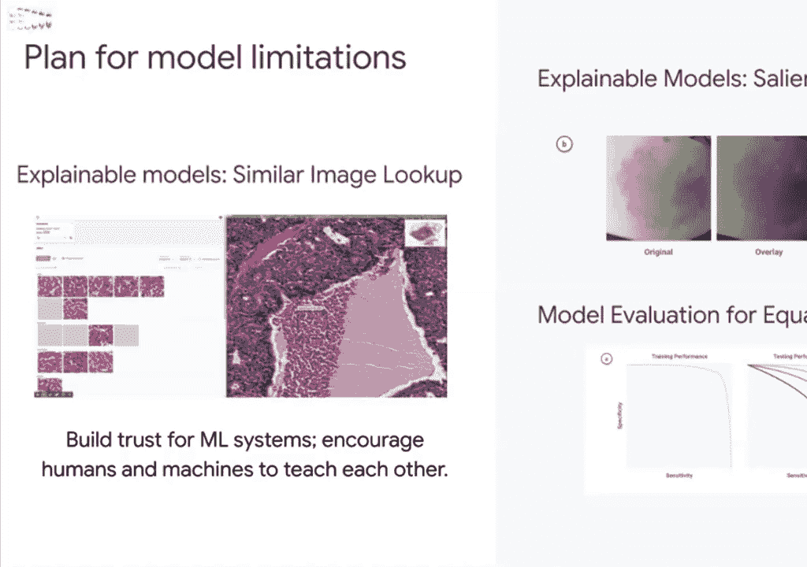

并提高精度。这是医疗保健领域经常说的话：如果你问三个医生，你会得到四种意见。因为，随着时间的推移，甚至医生自己也可能会与自己不一致。处理这一问题的方式，在一些国家是使用德尔菲法。

它是在冷战期间发展起来的，在个人意见不同的地方，它有助于确定共识。我们开发了一个工具来对不同的意见进行异步裁决。这导致了更高质量的“地面真相”数据创建。这是因为医生有时会错过另一位医生注意到的东西，所以他们通常会进行调和，并能够就实际的严重程度或诊断应该是什么达成一致。

所以这是我们看到的，真的，这真的很有影响力，因为，当我们和眼科医生一起做分析时，我们会看到医生们有60%的一致性。

### 审视问题表述以避免偏见

这是我想谈论的社区参与的最后一个领域。如果你更深入地研究问题的表述，就会发现这一点。这是一个案例：他们通过对模型和算法的输入（该算法试图确定社区的使用需求），使用了作为实际健康需求代理的健康成本。这导致了无意的种族偏见，因为花在黑人病人身上的钱更少。这是在事实发生后被发现的。

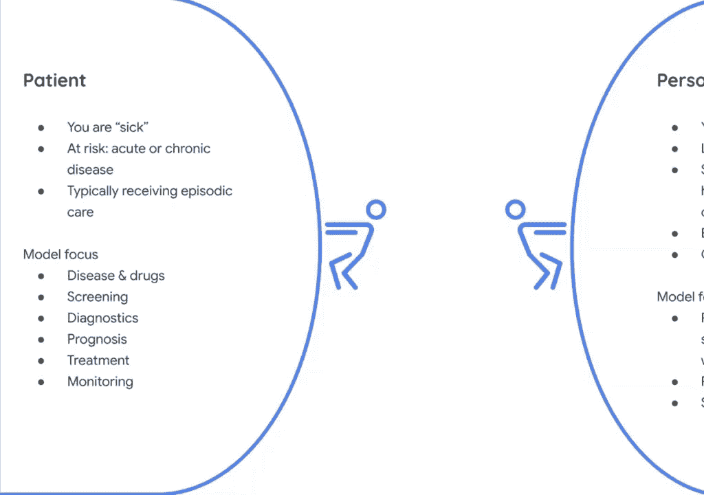

所以如果你再点击一次，这是关键区域之一，在哪里，有来自社区的投入，其实早就应该在算法开发时被发现。这是我们现在经常实践的事情。我知道你们在做项目，所以这将是我想发布的民意调查之一，只是，我们看看能不能让它启动，是，其中哪一个，方法实际上是潜在相关的，为了，你们正在做的项目。

## 模型解释与评估

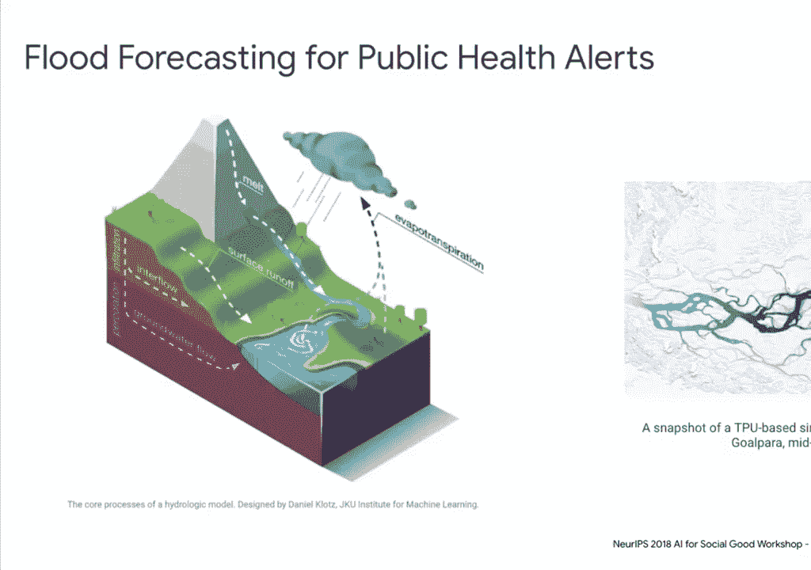

好的，我会继续说下去，然后呢，当这个被保存下来的时候，在左边回顾一下是很好的。这里我前面提到过，我们的病理模型在假阳性方面有一定的弱点。但它也比病理学家捕捉到了更多的癌症病灶。

所以我们开发了一种方法来解释模型关注的图像区域。然后，这是允许发生的，是，它使用了一种聚类算法，能够找到病理学家未曾指出的特征。这可能是实际诊断或预后的有意义的指标。在这种情况下，病理学家已经开始使用该工具从中学习。然后，病理学家也有好处，能够识别模型的任何问题并通知模型进行改进。

因此，你得到了模型和病理学家之间互相学习的良性循环。右边是我们用来解释模型输出的另一种方式：你可以看到显著性图。这是一种能够识别哪些特征是模型实际在关注的方法。在这种情况下，模型关注的是哪些像素，并把它们点亮。我们这样做是为了知道模型实际决定诊断的方式，不管是特殊的皮肤状况。他们正在看实际的皮肤异常，而不是与肤色或人口统计信息的潜在相关性。

所以这对你来说很有价值，作为检查模型的一种方式。最后我提到的是对平等结果进行模型评估。里面有东西，在皮肤科领域被称为菲茨帕特里克皮肤类型，它可以让你看到不同的肤色。我们所做的是用不同肤色的测试集进行模型评估，看看我们是否得到了同样的结果。

作为模型开发人员，你必须做出一些艰难的选择。如果你发现你的模型在某一特定类别或人口统计中表现不佳，理想情况下，你应该补充你的数据集，这样你就可以进一步证明你的模型能够适当地解决这些区域。或者你可能不得不决定限制你的模型部署范围，以确保有平等的结果。有时，你实际上可能选择不部署模型。所以这些是开发医疗保健领域人工智能模型的一些现实世界的含义。

## 超越疾病治疗：公共卫生与健康

我想和这个小组讨论的最后一个应用领域是，健康的概念。在过去，医疗保健通常是为病人想到的。虽然每个病人都是一个人，但并非每个人都是病人。并且，病人通常被认为在这里的左边：生病或有风险的人，他们正在进入医疗保健系统。

当你想到这种性质的人时，模型是完全不同的：他们是否患有急性或慢性疾病。他们是我们刚才谈到的，它们是关于筛查、诊断、预后、治疗。这些是模型倾向于关注的。

如果你在看人们，他们被认为是未被引用的，但他们的健康每天都受到我们所说的健康的社会决定因素的影响：你的环境和社会环境，你的行为和生活方式选择，以及你的基因是如何与环境相互作用的。

就如何处理这个问题而言，这里的模型看起来截然不同。他们倾向于专注于预防性护理：合理饮食、睡眠、好好锻炼。他们还关注公共卫生。我认为这是一个很大的领域。当我们谈论公共卫生时，可以有流行病学模型，这些都是非常有价值的。但也有，你知道，现在正在发生的事情，尤其是可能对公众健康最大的全球威胁之一是气候变化。

### 人工智能应对气候变化与公共卫生

所以在印度这样的地方正在发生的事情之一，是印度公共卫生警报的洪水预报。实际上有很多警报疲劳，所以实际上不清楚他们什么时候应该关心警报，或者不是。这个团队所做的是，他们专注于建立一个可扩展的高分辨率水力模型，使用卷积神经网络来估计输入，如降雪量、土壤水分估算与渗透性。这些水力学模型模拟了洪泛区的水行为，而且比以前使用的模型要准确得多。这现在被部署来帮助在整个印度地区的季风季节发布警报。

### 生态系统服务与人工智能

所以我只想给这个团队留下这样的想法，在气候变化方面，现在有很多事情要做。自然对健康至关重要，还有住在上面的人。因此，我们目前依赖这些生态系统服务，这意味着人们依赖清洁的空气、供水、粮食农业、授粉、土地稳定和气候调节。这是一个人工智能成熟的领域，能够帮助更好地理解和重视那些我们目前没有支付很多费用，但将来可能不得不支付的服务。

## 总结

在本课程中，我们一起学习了人工智能在医疗保健领域的多种应用，从肺癌筛查、病理分析到基因组学。我们探讨了人工智能如何帮助扩展有限的医学专业知识并辅助临床工作。更重要的是，我们深入讨论了在开发与部署人工智能模型时，如何通过社区参与、审视数据偏见、改进标签质量以及进行公平性评估，来促进一个更加公平的医疗未来。最后，我们展望了人工智能在公共卫生和应对气候变化等更广泛健康议题中的潜力。人工智能在医疗保健领域的发展，依赖于跨学科团队的紧密合作以及对技术社会影响的持续关注。