# 1：L1 - 深度学习与自动驾驶简介 🚗🤖

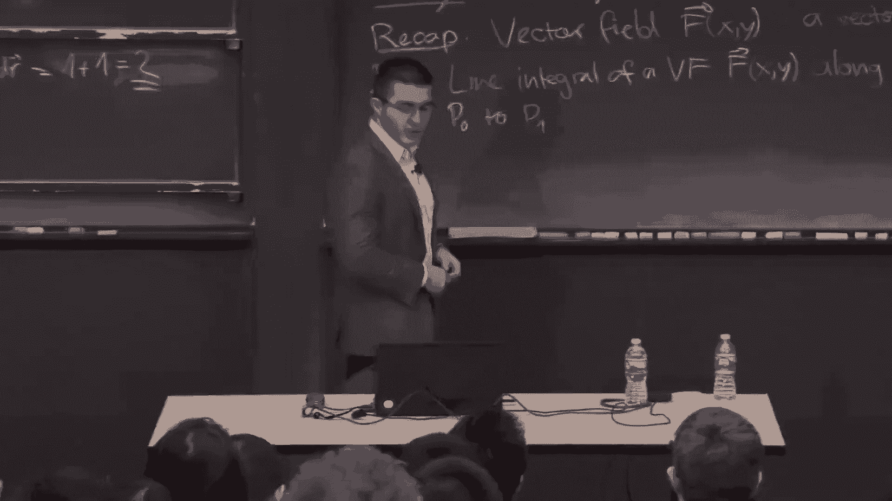

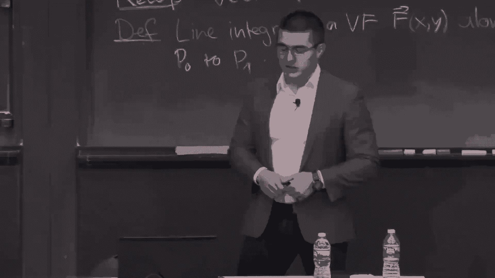

在本节课中，我们将要学习深度学习的基本概念，并探讨如何将其应用于自动驾驶这一激动人心的领域。我们将介绍深度神经网络的方法，并以构建自动驾驶汽车作为核心案例研究。

---

## 欢迎与课程介绍

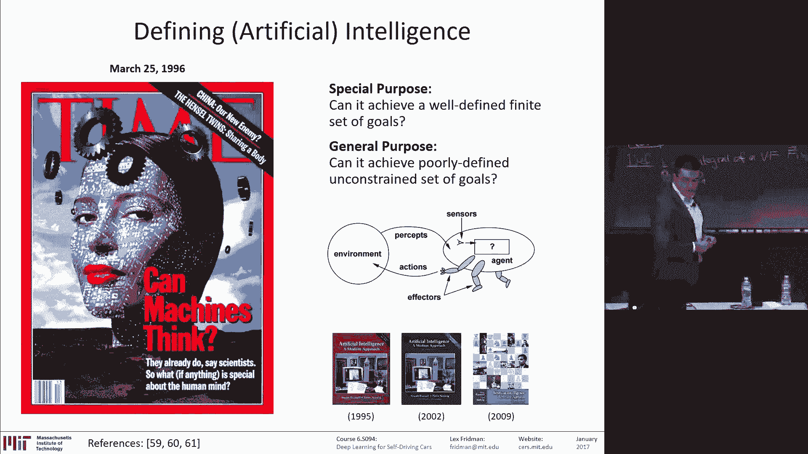

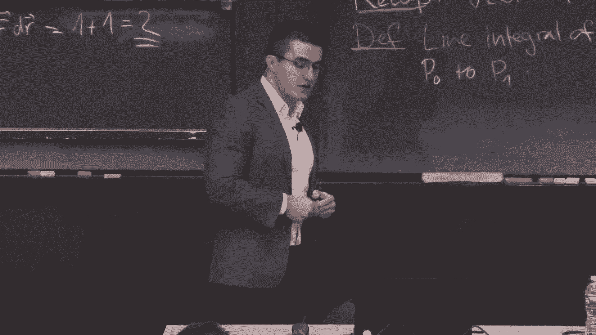

欢迎来到课程 6.S094。本课程名为“自动驾驶汽车的深度学习”。我们将向您介绍深度神经网络的方法。

我的名字是 Lex Fridman。在大部分讲座中，将由我为大家讲解。

我是这个优秀团队的一员，我们还有几位出色的助教。他们是 Dan Brown、Spencer Dot 和 Benedict Jenk。

幻灯片左侧展示的是我们两个项目（或模拟游戏）之一的视觉化效果。我们将用它来教授深度强化学习，同时也通过挑战大家相互竞争来激发兴趣，优胜者将获得一份特别奖品（目前尚未公布）。

如果您对教程、讲座或任何内容有疑问，可以通过邮箱 `deepcars@mit.edu` 联系我和助教。课程网站 `deepcars.mit.edu` 上提供了讲座内容、代码、教程以及今天的讲座幻灯片（以 PDF 形式）。讲座视频将在讲座结束后几天内提供。

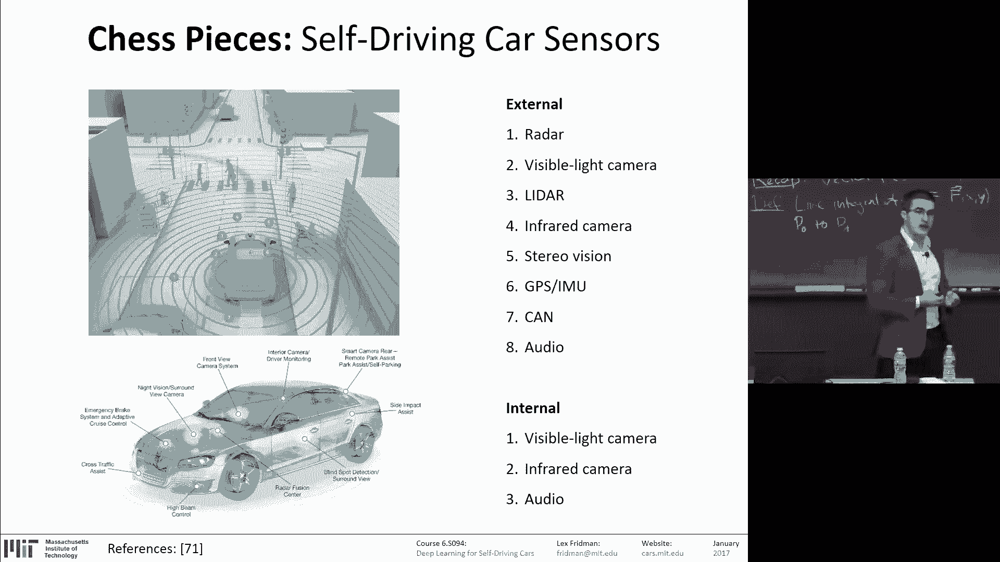

教室后方有摄像机在进行录像，但镜头主要对准演讲者。如果您对此感到担忧，可以坐在教室边缘，或者戴上墨镜和假胡子。

## 课程项目：竞赛与目标

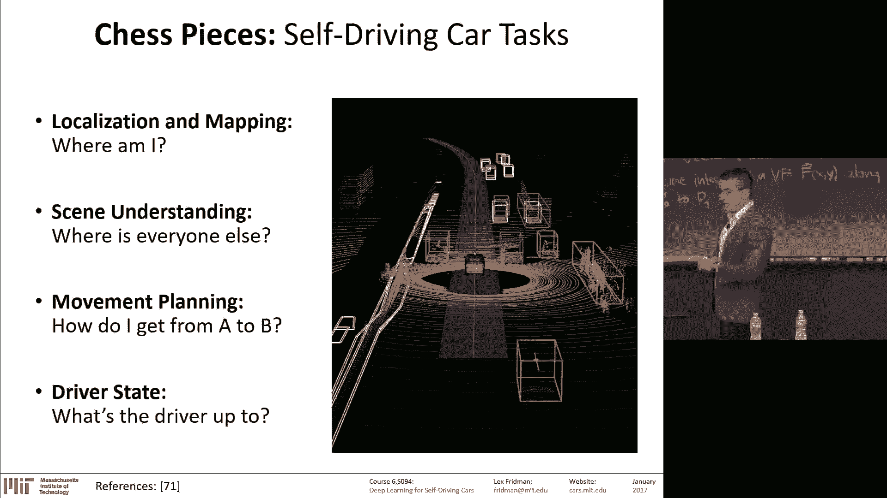

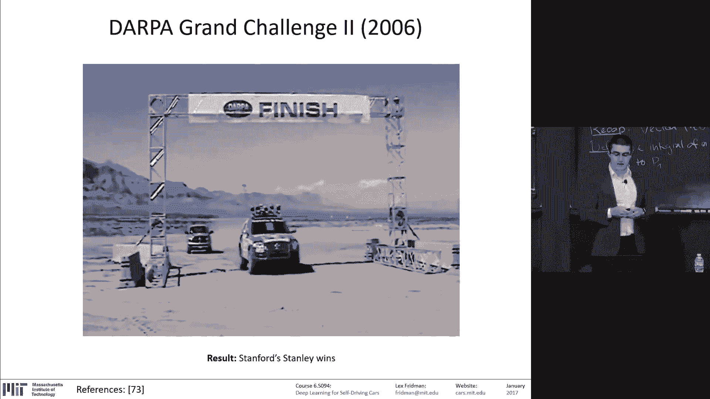

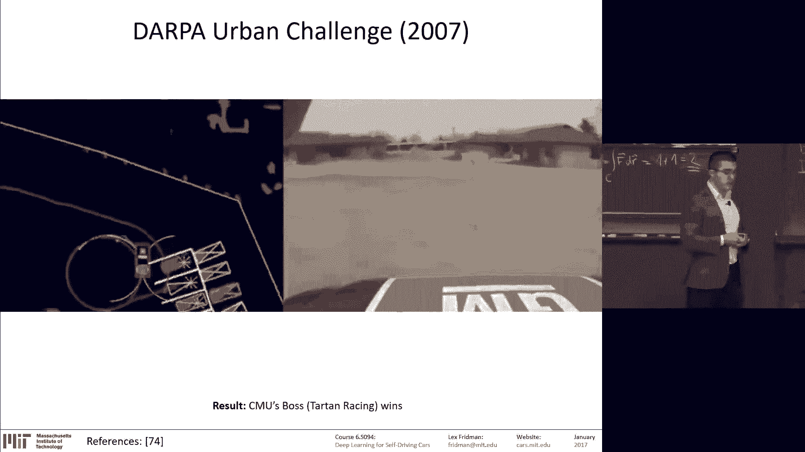

关于左侧看到的游戏，有一个竞赛。为了获得课程学分，您必须设计一个神经网络，让汽车以略高于限速（65英里/小时）的速度行驶。但如果您想获胜，则需要开得更快一些。

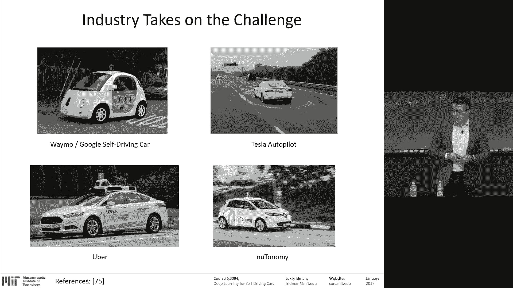

这门课程适合谁？您可能是编程、机器学习或机器人技术的新手，也可能是这些领域的专家，但希望重温基础知识。

您将学习到深度强化学习的概述、卷积神经网络和循环神经网络的结合，以及这些方法如何帮助改进自动驾驶的各个组成部分：感知、视觉感知、定位、建图、控制规划以及驾驶员状态检测。

## 项目一：Deep Traffic 🚦

第一个项目代号为“Deep Traffic”。在这个特定的设定中，有七条车道。这是一个俯视图，看起来像游戏，但我向您保证它非常严肃。红色的智能体（汽车）由一个神经网络控制。我们将解释如何控制和设计这个神经网络的各种参数。这个神经网络在浏览器中学习。我们使用了 ConvNetJS，这是一个由 Andrej Karpathy 用 JavaScript 编写的库。令人惊叹的是，我们生活在一个可以在浏览器中几分钟内训练神经网络的世界。我们这样做是为了让您开始接触神经网络时几乎没有门槛。要完成课程的这个项目，您只需要一个 Chrome 浏览器。要赢得比赛，您也只需要 Chrome 浏览器。

## 项目二：Deep Tesla 🚘

第二个项目代号为“Deep Tesla”。它使用来自特斯拉车辆的前方道路数据，通过端到端学习，将图像输入卷积神经网络，直接映射到一个转向角。所以，它只需要一张图像，就能预测汽车的转向角。我们拥有车辆本身的数据，您将构建一个神经网络，试图比原车转向得更好，或者至少一样好。

## 什么是智能？🤔

让我们从一个我们目前理解甚少、充满神秘感但却令许多人着迷的问题开始：什么是智能？这是来自 1996 年 3 月《时代》杂志的一个问题：“机器能思考吗？”下面的回答是：“它们已经可以了。”那么，如果有的话，人类思维的特殊之处是什么？

有两种方式来问这个问题。一种是专用版本：一个人工智能系统能否实现一组明确定义、具体、形式化、有限的目标？这张来自让我在高中时期对人工智能产生兴趣的书籍《人工智能：一种现代方法》的图表，描绘了一个系统的简单图示。它存在于一个环境中，拥有一组用于感知的传感器。它接收这些传感器输入，进行一些“神奇”的处理（图中用问号表示），然后通过一组效应器在世界中行动、操纵物体。

因此，在专用版本下，只要环境、目标集、行动、传感器和感知方式都定义明确，我们就有一些优秀的算法（我们将讨论）可以优化这些目标。问题是，如果我们沿着这条路径逐步前进，我们是否会接近通用版本的人工智能？它能否实现定义模糊、不受约束的目标集，以及定义模糊、不受约束的行动和效用函数（奖励）？这就是人类生活的本质，也是我们大多数日子做得还不错的事情：存在于一个充满不确定性的、未定义的世界中。

## 任务的分类 🗂️

我们可以将任务分为三个不同的类别：
1.  **形式化任务**：这是最简单的。例如下棋、解决数学逻辑问题等可以形式化定义的任务。
2.  **专家任务**：这是许多激动人心的突破发生的地方。机器学习方法、数据驱动方法可以帮助辅助或改进人类专家的表现。例如医疗诊断、硬件设计、调度等。
3.  **日常任务**：这是我们视为理所当然、每天轻松完成的事情。例如日常言语、书面语言、视觉感知、行走（我们将在今天的讲座中讨论，这是一个极其困难的任务）和物体操纵。

那么，在我们讨论深度学习、讨论具体方法之前，我们真正想深入探讨的问题是：驾驶是什么？驾驶有多难？它更像国际象棋（可以形式化定义行动和规则），还是更像日常对话（需要更高程度的推理、沟通和学习）？驾驶是否远不止左转、右转、加速、减速这么简单？

## 自动驾驶的传感器与任务 🛠️

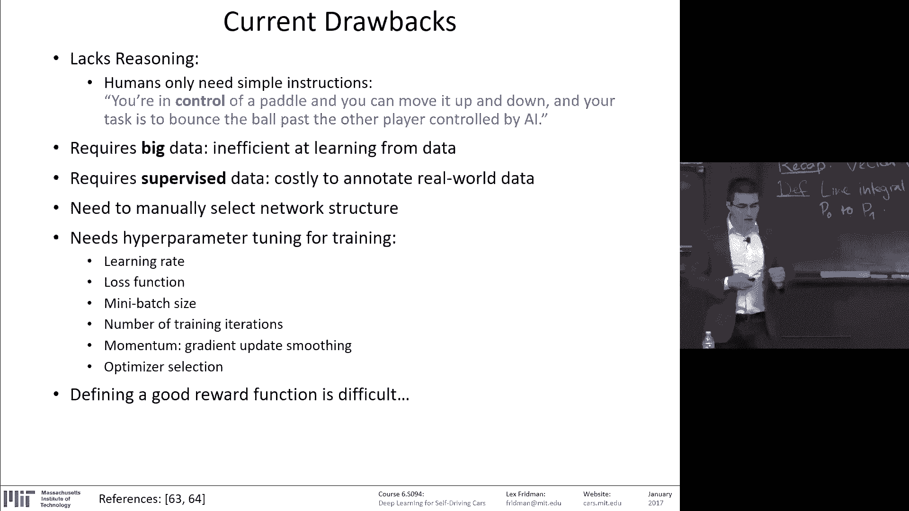

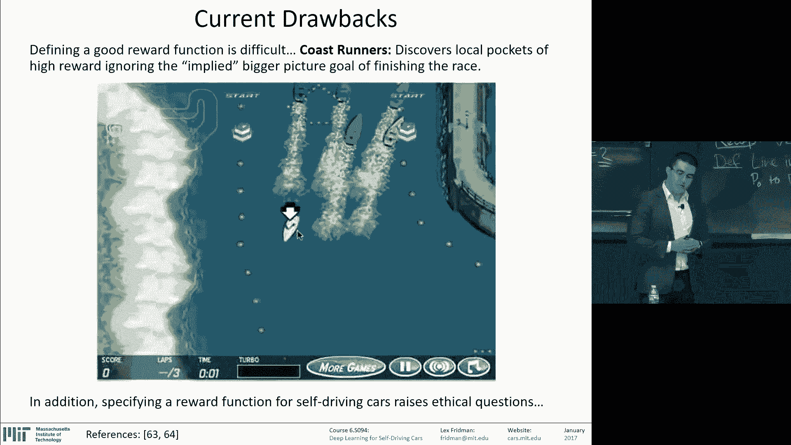

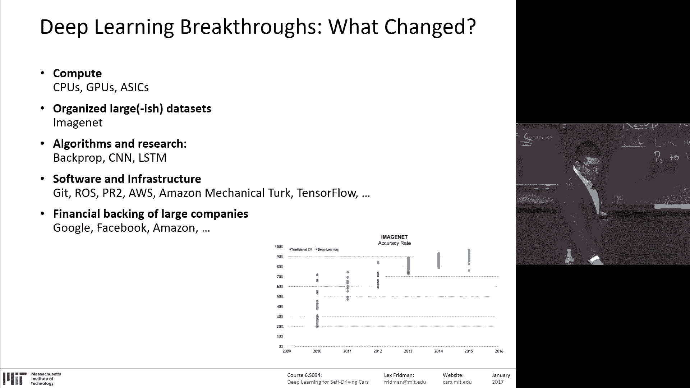

让我们像看待棋子一样看待它。自动驾驶汽车可以使用哪些传感器？我们将更深入地探讨这一点，特别是通过那些构建了许多此类系统的客座讲师。

以下是自动驾驶汽车可用的传感器：
*   **雷达和激光雷达**：提供环境中障碍物的距离信息，帮助定位。
*   **可见光摄像头和立体视觉**：提供纹理信息，帮助识别障碍物是什么，并理解其细微运动。
*   **GPS 和 IMU（惯性测量单元）**：提供车辆自身轨迹和运动的信息。
*   **CAN 网络**：提供车辆自身丰富的状态信息（各个系统在做什么）。
*   **音频**：道路的声音提供了丰富的上下文信息（例如湿滑路面、轮胎尖叫、鸣笛）。这是我们小组的研究重点之一。

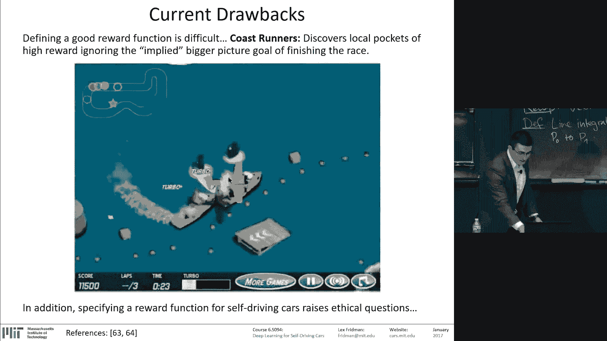

研究较少但对我们来说很吸引人的是面向内部的传感器，用于感知驾驶员的状态：他们在看哪里？是否困倦？情绪状态如何？是否在座位上？这些信息来自视觉和音频。

不仅如此，如果将构建自动驾驶汽车的任务分解为模块，包括：
1.  **定位与建图**：知道自己在哪，并绘制外部环境地图。
2.  **场景理解**：理解外部环境中实体的类别（是汽车、行人还是鸟）。
3.  **运动规划**：在了解自身和环境中其他实体的位置后，规划出一条穿过这个世界的轨迹。
4.  **驾驶员状态检测**：弄清楚车上的人类在做什么。因为正如我将谈到的，实现自动驾驶的路径（因此我们关注特斯拉）可能会经过半自动驾驶阶段，车辆不仅需要自己驾驶，还需要有效地在汽车和人类之间交接控制权。

## 自动驾驶简史 📜

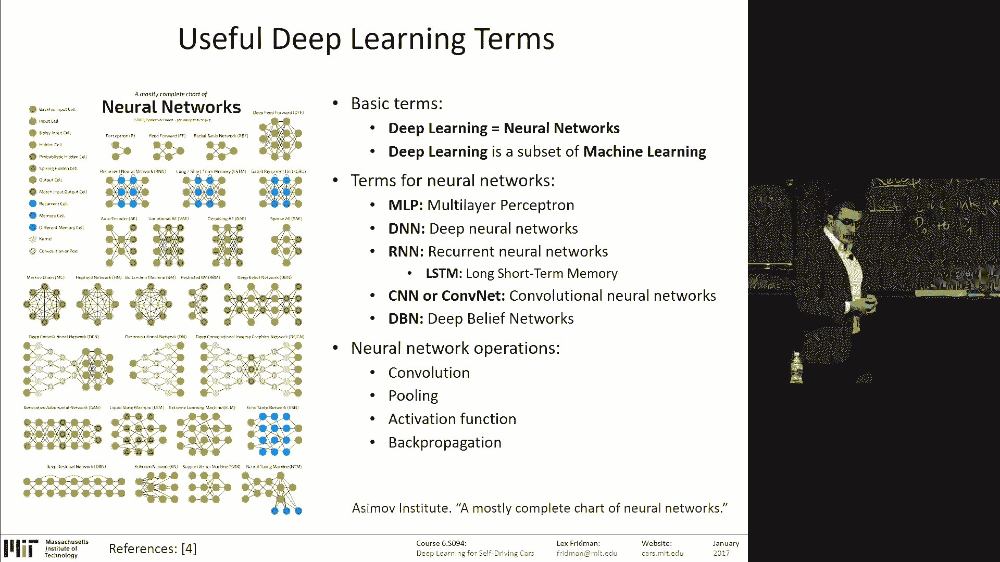

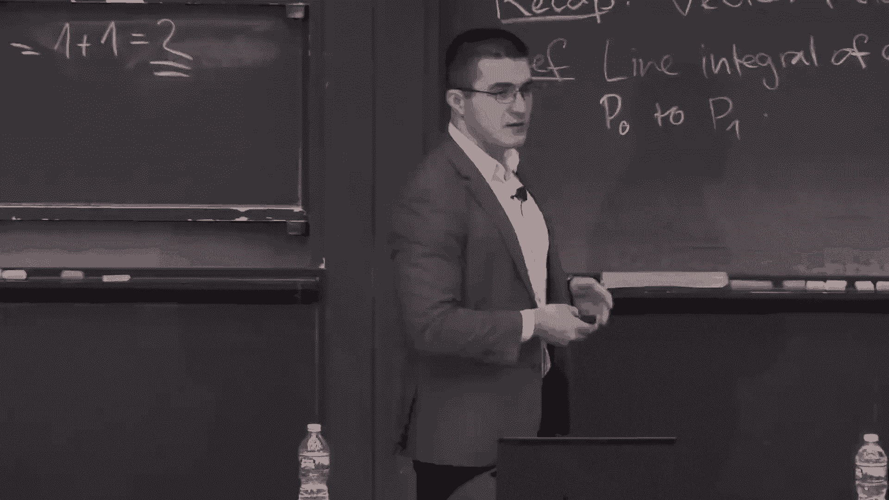

20世纪80年代和90年代有很多有趣的东西。重大突破发生在第二届 DARPA 大挑战中，斯坦福大学的“Stanley”赢得了比赛，它是五辆完成比赛的车辆之一，这是一项在沙漠赛道上的惊人成就。2007年的 DARPA 城市挑战，任务不再是在沙漠中比赛，而是穿越城市环境，卡内基梅隆大学的“Boss”赢得了比赛。这些工作直接促使许多大型行业参与者接受了构建此类车辆的挑战，例如谷歌（现在的 Waymo）、特斯拉（其 Autopilot 系统）、优步（在匹兹堡测试），以及本课程的一位演讲者所在的公司 Nutonomy（在波士顿街头测试）。

## 驾驶：是国际象棋还是对话？🎭

如果我们回顾 DARPA 挑战和谷歌自动驾驶汽车的成就，它们本质上将世界简化为一场国际象棋游戏。它们使用极其精确的传感器构建世界的三维地图，在其中有效地定位自身并移动。这是一种定义非常明确的方式。

现在，开放的问题是：如果驾驶更像一场对话，像自然语言对话呢？通过图灵测试有多难？图灵测试目前的流行表述是：在一场隔着幕布进行的对话中，计算机能否在超过30%的时间里被误认为是人类？要构建一个成功通过图灵测试的系统，你需要自然语言处理部分来实现成功沟通（生成和理解语言），然后你需要表示知识（对话状态随时间转移），最后也是困难的部分是自动推理。推理是我们讨论中贯穿始终的主题，因为正如我将谈到的，各种深度学习方法、神经网络擅长从数据中学习，但目前还没有好的机制进行推理。推理可能只是我们为了感觉自己比机器更特别而告诉自己我们在做的事情，也可能只是像从数据中学习一样简单（我们只需要更大的网络），或者可能需要完全不同的机制。我们将讨论这些可能性。

## 机器学习的近期突破 🚀

近期机器学习突破的核心是什么？是神经网络。它们已经存在很长时间了。我将讨论哪些东西改变了，哪些酷炫的新东西出现了，以及哪些东西没变，它的可能性是什么。

首先，神经元（粗略地说）是大脑的计算构建模块。我知道这里有一些神经科学领域的朋友。这 hardly 是一个模型，它主要是一种灵感来源。因此，人类神经元启发了人工神经元，即人工神经网络的计算构建模块。需要说明的是，人工神经网络和人类大脑中的神经元都是相互连接的。在人类大脑中，平均每个神经元大约有10,000个传出连接。目前最大的人工神经网络（据我所知）有100亿个连接（突触）。而我们人类大脑的最佳估计有10万倍于此，即100到1000万亿个突触。

## 人工神经元与感知机 🧠

什么是人工神经元？它是神经网络的构建模块。它接收一组输入，为每个输入分配一个权重，将它们求和，对每个神经元应用一个偏置值，然后使用一个激活函数，接收这个加权和加上偏置，并将其“挤压”以产生一个0到1之间的信号。这允许单个神经元接收几个输入并产生一个输出（例如分类，0或1）。正如我们将要讨论的，简单来说，它可以作为一个线性分类器，可以学会在蓝点和黄点之间画一条线。这正是我们将在 iPython notebook 中做的事情。

基本算法是：初始化输入权重，计算输出（执行前面提到的操作，求和并计算输出），如果输出与真实值（期望的输出）不匹配，则相应地惩罚权重。我们将讨论一些相关的数学原理。这个过程不断重复，直到感知机不再犯任何错误。

## 神经网络的强大之处 💪

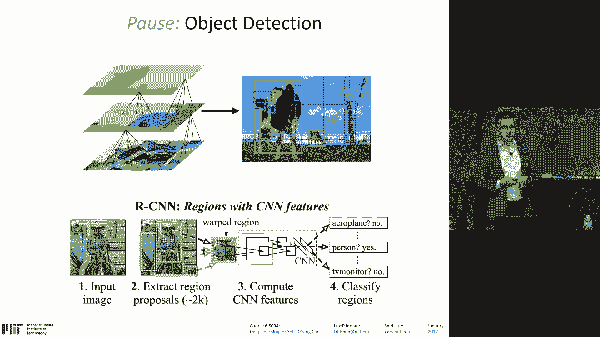

神经网络有几个令人惊叹的地方，我将一一讨论。从数学角度讲，其中之一是神经网络的通用性。即使只有一个隐藏层（左侧是输入，右侧是输出，中间是一个隐藏层），它也可以紧密逼近任何函数。这是一个不可思议的特性。这意味着存在一个神经网络可以完美地驾驶汽车，因为驾驶可以被看作一个函数：输入外部世界，输出控制车辆。这是一个迷人的数学事实。

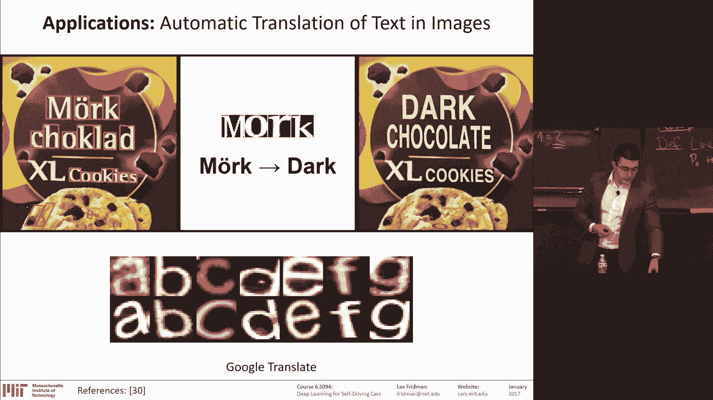

因此，我们可以将这些函数视为专用智能。例如，输入可以是卧室数量、平方英尺、社区类型这三个输入。这些值传递到隐藏层，再经过一步，产生房屋的最终价格估计。我们可以在监督学习的方式下很好地教会一个网络做这件事。您提供许多已知卧室数量、平方英尺、社区类型以及最终房屋价格的例子，然后通过反向传播的过程，教会这些网络做出相当好的预测。

## 通用智能的突破：以 Pong 游戏为例 🎮

最近一些激动人心的突破发生在通用智能领域。这是来自 Andrej Karpathy（现在在 OpenAI）的工作。我想花点时间解释一下这有多么神奇。这是一个 Pong 游戏。人工智能智能体在右侧（绿色），顶部的比分是 8 比 1。这个网络大约需要在一台普通电脑上训练三天。这个网络在做什么？它被称为策略网络。输入是原始像素（经过轻微处理，取两帧之间的差异），基本上就是原始像素信息。输入之后是几个隐藏层，输出是单个向上移动的概率。这就是整个系统。它学习的过程是：在任何特定时刻，您不知道什么是正确的做法（是向上还是向下移动）。您只知道最终是赢还是输。因此，这里令人惊奇的是，没有任何关于哪个状态好或坏、哪个行动在哪个状态下好或坏的监督学习信息。但是，如果您根据游戏结果奖励或惩罚您采取的每一个行动（即整个游戏中每一个状态-行动对），那么网络就能学会。如果赢了游戏，每个状态-行动对都得到奖励；如果输了，则受到惩罚。这个过程仅通过模拟 20 万局游戏，网络就能学会击败电脑。这个系统对 Pong、对游戏一无所知。这就是通用智能（除了它只是 Pong 游戏这一点）。我将讨论这如何能进一步扩展，为什么这如此有前途，以及为什么我们也应该谨慎行事。

## 监督学习、无监督学习与强化学习 📚

问题：什么是监督学习、无监督学习，它们有什么区别？
*   **监督学习**：当人们谈论机器学习时，大多数时候指的是监督学习。监督学习是从数据中学习，从例子中学习。您有一组输入和一组您知道是正确的输出（称为真实值）。您需要大量这样的例子来训练任何机器学习算法，使其学会泛化到未来的例子。
*   **强化学习**：真实值是稀疏的。关于某事好不好的信息只是偶尔出现（例如在游戏结束时），而不是每一帧都有。
*   **无监督学习**：您没有任何关于输出正确与否的信息。深度学习社区对无监督学习感到兴奋，但截至目前尚未取得重大突破。我将讨论深度学习的未来，许多该领域的研究人员对此感到兴奋。但目前，任何有趣的成就都与监督学习有关。

## 神经网络的缺点与挑战 ⚠️

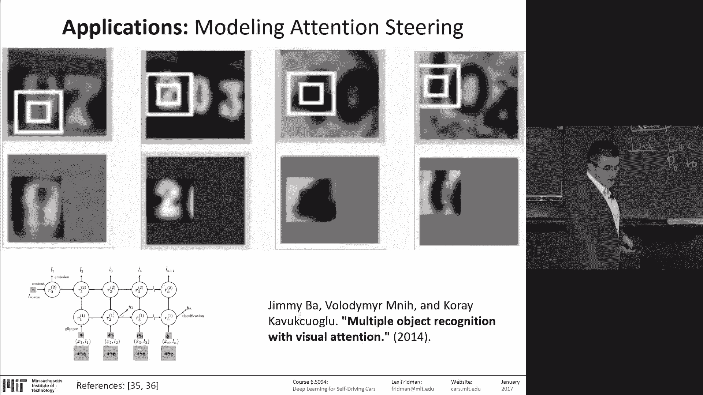

神经网络的缺点是什么？如果您思考人类会如何应对 Pong 游戏，人类只需要一组简单的指令：您控制一个球拍，可以上下移动，您的任务是将球弹过对方。人类可能不会立即赢得游戏，但会立即理解游戏，并能足够好地进行游戏，很快学会击败游戏。但他们需要控制的概念、球拍的概念、上下移动和球及弹跳的概念，他们必须至少对现实世界的物理有一个粗略的概念，然后才能将其投射到二维世界中。所有这些概念都是您与生俱来的知识。您将这种知识从童年经验转移到当前游戏的方式，就是所谓的“推理”。问题是，是否通过同样的过程，您可以将整个世界视为一场 Pong 游戏，而推理仅仅是高效模拟游戏的能力（比 20 万次迭代高效得多）。

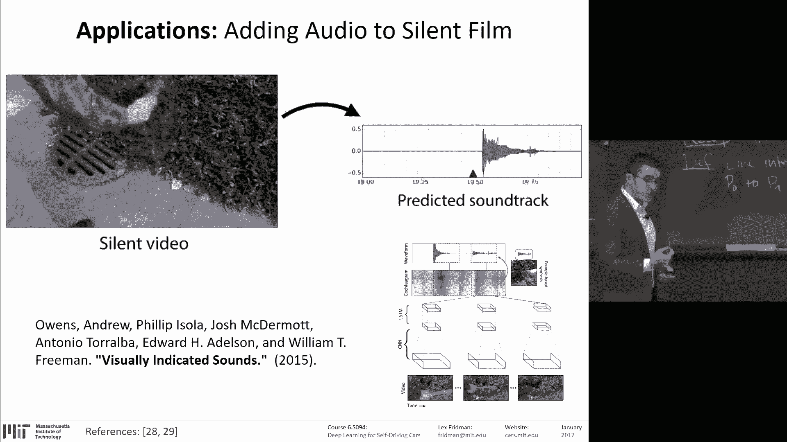

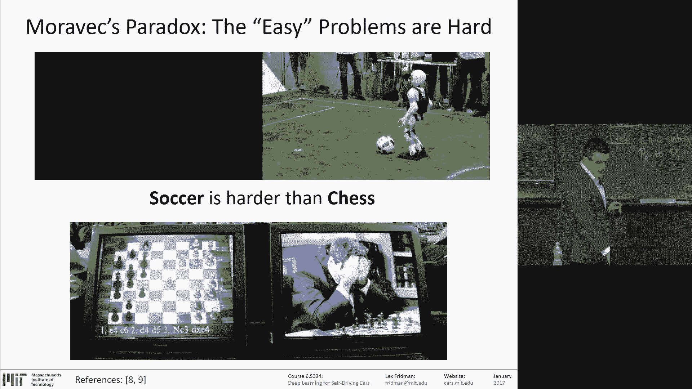

深度神经网络和广义机器学习的另一个挑战是您需要大数据，并且是高效的学习者。这些数据还需要是监督数据，需要真实值，而标注（例如人类查看特定图像并标记为猫或狗）成本非常高。特别是对于神经网络，有很多参数需要调整，有很多超参数需要确定。首先需要确定网络结构（有多少层，每层有多少隐藏节点，每个节点使用什么类型的激活函数），然后一旦构建了网络，还有如何训练该网络的参数（学习率、损失函数、小批量大小、训练迭代次数、梯度更新平滑等），甚至选择用于解决所涉及的各种微分方程的优化器。这是一个许多研究论文的主题，当然也足够复杂，足以成为研究课题，但它也确实具有挑战性。这意味着您不能只是放下网络，它就能普遍解决问题。

定义一个良好的损失函数（或者在 Pong 或游戏中，一个良好的奖励函数）是困难的。这里有一个游戏（来自 OpenAI 的近期结果），教一个网络玩“海岸行者”游戏。游戏目标是在赛道中驾驶一艘船，并成功完成与其他对手的比赛。这个网络是一个最优网络。它发现在游戏中，沿着路径收集某些物体会获得很多分数。所以您看到它学会了转圈收集那些绿色的涡轮增压物品。它发现不需要完成比赛就能获得奖励。尽管着火、撞墙、经历整个过程，它实际上已经达到了一个局部最优解（在最大化分数这个奖励函数下）。因此，它找到了一种在忽略完成比赛这个隐含的更大目标的同时获得更高奖励的方法，而我们人类对此理解得更好。这对自动驾驶汽车提出了伦理问题，以及其他问题。

## 深度学习的近期突破因素 📈

深度学习的近期突破来自几个因素：
1.  **计算能力**：摩尔定律，CPU 每十年快 100 倍。然后是 GPU，以及现在在 GPU 上训练神经网络的能力。A6 芯片在能效和更高效地训练更大网络方面创造了许多能力。
2.  **数据**：21 世纪有数字化数据，有更大的数字数据集，并且这些数据正变得更加有组织（不仅仅是互联网上模糊可用的数据，而是像 ImageNet 这样的实际有组织的数据集）。
3.  **算法创新**：反向传播、卷积神经网络、LSTM 等针对特定领域和任务的不同架构。
4.  **基础设施**：软件和硬件方面，有以开源方式共享软件的 Git 能力，有使机器学习和机器人技术更易用的软件（如 ROS、TensorFlow），有 Amazon Mechanical Turk（允许高效、廉价地标注大规模数据集），有 AWS 云托管机器学习和数据计算，以及谷歌、Facebook、亚马逊等大公司的资金支持。

但说真的，没有什么根本性的改变。我们使用的神经网络自 90 年代以来就一直存在（神经网络自 60 年代就已存在）。方法论上有一些改进，但希望在于计算能力一直是主力军（每十年百倍的改进）。问题是，是否我提到的“推理”问题只需要一个更大的网络？这是一个开放性问题。

## 深度学习术语 📖

首先，深度学习是神经网络的一个“公关术语”，指的是使用深度神经网络（有许多层的神经网络），是计算能力（GPU 训练）带来的新能力的象征性术语。因此，深度学习是机器学习的一个子集，还有许多其他方法仍然有效。

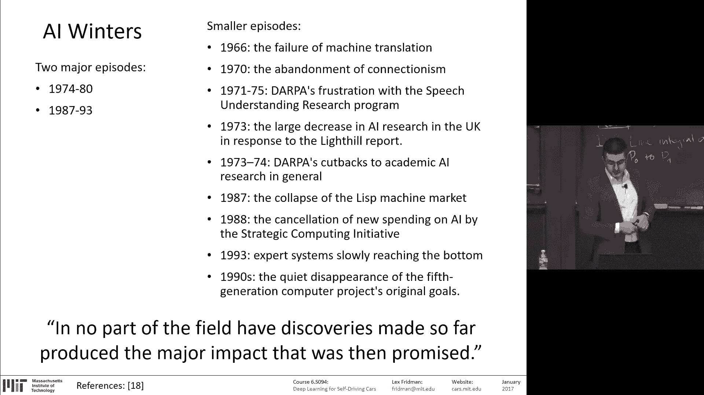

本课程中将出现的术语包括：
*   多层感知机
*   深度神经网络
*   循环神经网络
*   LSTM（长短期记忆网络）
*   CNN 或 ConvNets（卷积神经网络）
*   深度信念网络
以及将出现的操作：卷积、池化、激活函数和反向传播。

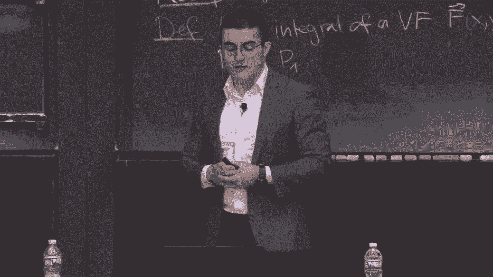

## 表示学习：深度学习的核心 🎯

深度学习，这些深度神经网络架构，是表示学习。这是与传统机器学习方法的区别。在传统方法中，像边缘、角点、轮廓等概念是由人类专家为特定领域手动预先指定的。而表示很重要，因为找到一个能将特定数据（例如区分绿色三角形和蓝色圆圈）线性分开的线是困难的。人类专家可能为此做一个博士研究也未必成功。但神经网络可以自动找出将输入重新映射到极坐标的表示方式，使得数据变得易于线性分离。

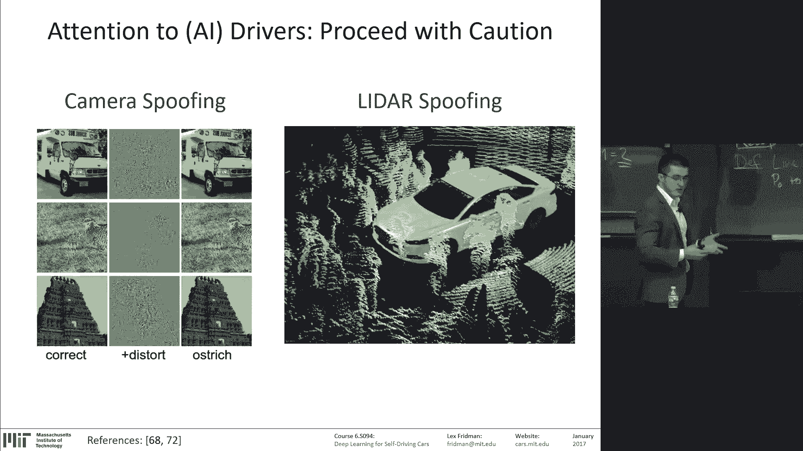

因此，深度学习是表示学习的一个子集，而表示学习是机器学习的一个子集，也是人工智能的一个关键子集。由于它能够在表示核心计算任意数量的特征，所以您不需要为特定任务（例如检测图像中的猫）手动指定成千上万个特征（如胡须等）。您允许神经网络发现数万个这样的特征。这对于猫来说您可能是专家，但对于许多物体，您可能永远无法充分提供用于识别物体的特征。因此，这种表示学习，一方面很容易，因为您只需要提供输入和输出，只需要提供您关心的数据集而无需手工设计特征；另一方面，由于其构建任意大小表示的能力，神经网络渴望数据。我们给它们的数据越多，它们就越能了解这个特定的数据集。

## 深度学习的应用实例 🌟

让我们看一些深度学习迄今为止能够完成的一些很酷的事情。

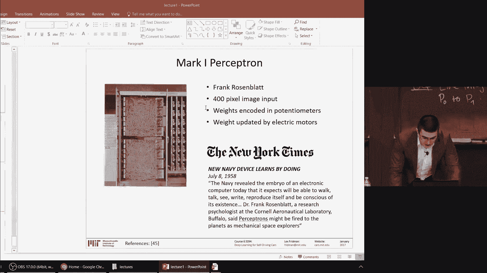

**图像分类与定位**：ImageNet 是一个著名的数据集和竞赛，任务是给定一张图像，识别图像中最有可能的五样东西是什么，并且必须正确分类。例如，右侧是一张豹子的图像，必须正确分类为豹子。从 2012 年的 AlexNet 开始，分类错误率从之前的 40