# 2：L2 - 深度学习与自动驾驶汽车 🧠

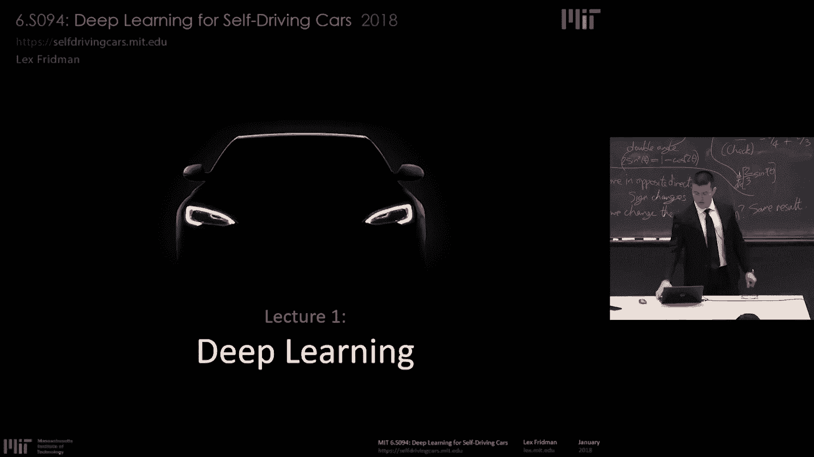

在本节课中，我们将要学习深度学习的基本概念，并探讨它如何被应用于自动驾驶汽车这一激动人心的领域。深度学习是一套在过去十年中取得巨大飞跃的技术，它极大地扩展了人工智能系统的能力边界。而自动驾驶汽车，正是将这些技术进行深度整合，并以一种深刻的方式融入我们日常生活、改变社会的系统。这两大主题都极其重要且令人兴奋。

---

## 🏫 课程与团队介绍

我的名字是 Lex Fridman。与我一同工作的还有一个出色的工程师团队，包括 Jack Terwilliger, Julia Kindelsberger, Dan Brown, Michael Glaeser, Li Ding, Spencer Dodd 和 Benedikt Jenik 等许多人。

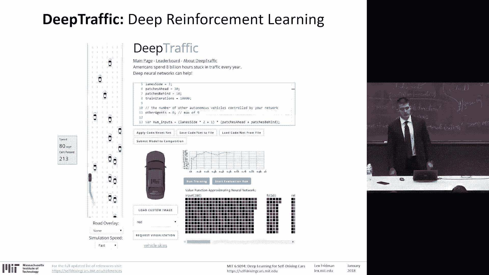

我们在麻省理工学院（MIT）研发自动驾驶汽车。我们的目标不仅仅是制造能够感知环境并移动的车辆，更是要打造能够与车内的人类（驾驶员和乘客）以及车外的人类（行人、其他驾驶员和骑行者）进行互动、沟通并赢得其信任与理解的车辆。

*   **课程网站**：`selfdrivingcars.mit.edu`
*   **问题咨询邮箱**：`deepcars@mit.edu`
*   **Slack 频道**：`deepdrive-mit`
*   **MIT 注册学生**：需在网站上注册。

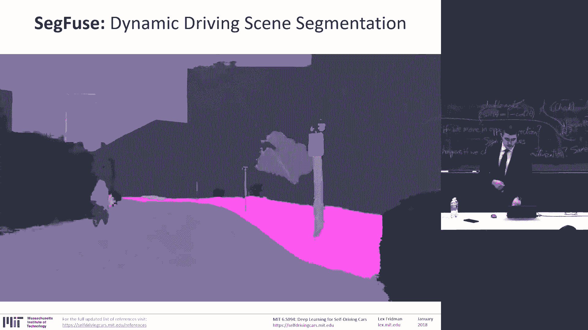

---

## 🏆 课程竞赛与项目

本课程包含三项激动人心的竞赛，旨在将理论知识应用于实践。

### Deep Traffic 竞赛

这是一个深度强化学习竞赛。去年我们收到了超过 18,000 份提交。今年，我们将更进一步。你不仅可以控制一辆车，还可以控制最多 10 辆车。这是多智能体深度强化学习，非常酷。

**任务要求**：在 1 月 19 日（周五）午夜前，构建一个神经网络并提交，使其在全新的 Deep Traffic 2.0 环境中达到每小时 65 英里的速度。今年的竞赛比去年更具挑战性，也更有趣。

### SceneFuse 竞赛

这是一个动态驾驶场景分割竞赛。你将获得原始视频、车辆运动学数据、最先进的分割训练集（包含像素级真实标签）以及光流数据。你的任务是尝试在基于图像的分割任务上超越现有技术水平。

**为什么这很关键**：在物理世界中行动的机器人，不仅必须利用深度学习方法来解释场景的空间视觉特征，还必须解释、理解和跟踪场景的时间动态。这项竞赛关乎信息的时间传播，而不仅仅是场景分割。你必须同时理解空间和时间。

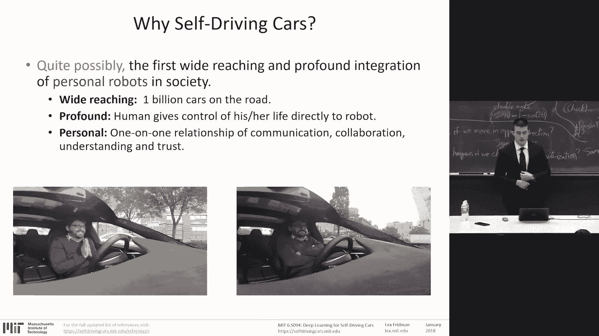

### Deep Crash 竞赛

在这个竞赛中，我们使用深度强化学习在 MIT 的体育馆里让汽车进行数千次碰撞测试。你将获得 100 次测试的数据：一辆仅使用单目摄像头作为单一输入、对场景知之甚少的汽车，以超过每小时 30 英里的速度行驶在一个它几乎无法定位自身的场景中，它必须快速做出反应。你将有 10 次测试的机会来学习任何东西。

**竞赛形式**：我们将评估所有人在模拟环境中的提交。排名前四的提交方案将在体育馆进行实车对抗测试，直到决出胜者。我们将以每小时 30 英里的速度持续进行碰撞测试。

此外，网站上和 GitHub 上还有去年的 **DeepTesla** 项目，它利用我们拥有的大规模自然驾驶数据来训练神经网络，实现端到端的转向控制：输入前方道路的单目视频，输出汽车的转向指令。

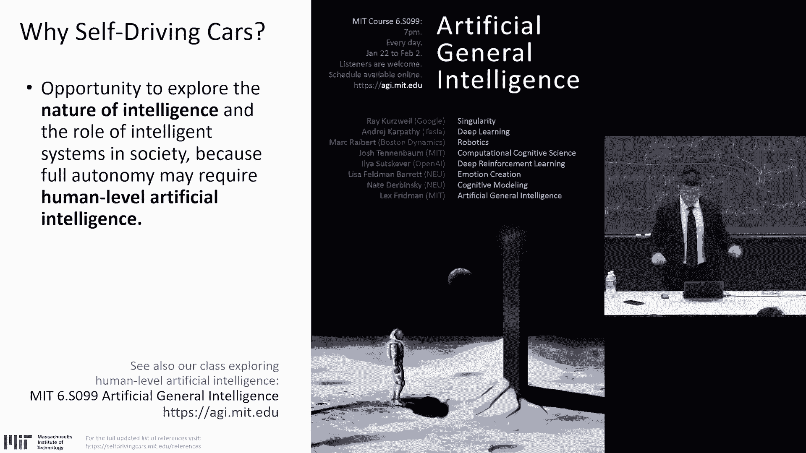

---

## 📅 课程安排与嘉宾讲座

本周的课程安排如下：
*   **今天**：讨论深度学习。
*   **明天**：讨论自动驾驶汽车。
*   **周三**：讨论深度并行计算。
*   **周四**：讨论驾驶场景理解（分割）。
*   **周五**：我们有来自 Waymo 工程总监 Sasha Arnoud 的讲座。Waymo 是在完全自动驾驶（L4/L5）领域取得巨大进展的公司之一。了解他们面临的问题和采取的方法将非常有趣。

我们还有来自 Voyage（一家刚被德尔福收购的自动驾驶公司）CTO Amnon Shashua 的讲座，他被誉为最聪明的人之一。以及来自 Aurora（一家与英伟达等公司合作的自动驾驶初创公司）联合创始人 Sterling Anderson 的讲座。

下周三，我们将讨论我个人非常着迷的研究课题：用于驾驶员状态感知的深度学习，即理解车内和车外的人类。

我特别期待周四 Oliver Cameron 的讲座，他现在是自动驾驶初创公司 Voyage 的 CEO，曾是优达学城自动驾驶项目的负责人。他将讲述如何创办一家自动驾驶公司，这对于 MIT 的创业者和企业家来说将是非常酷的经验分享。

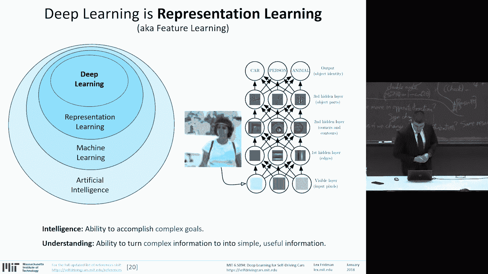

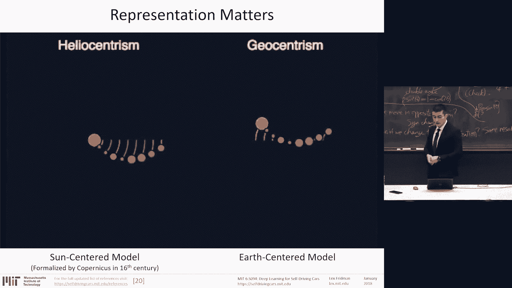

---

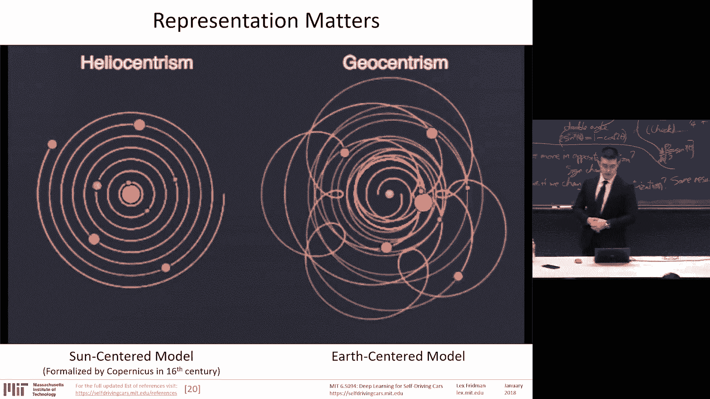

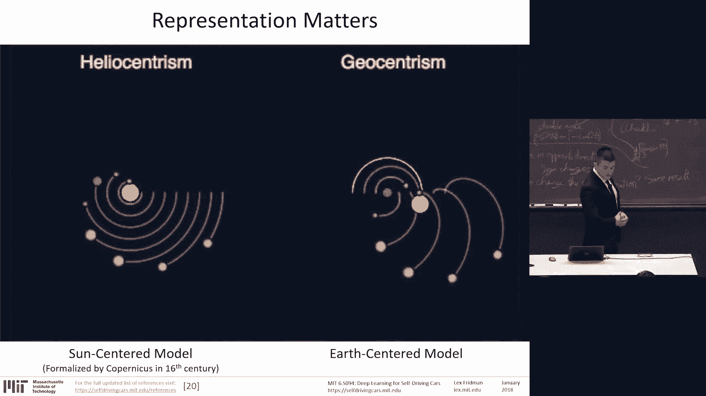

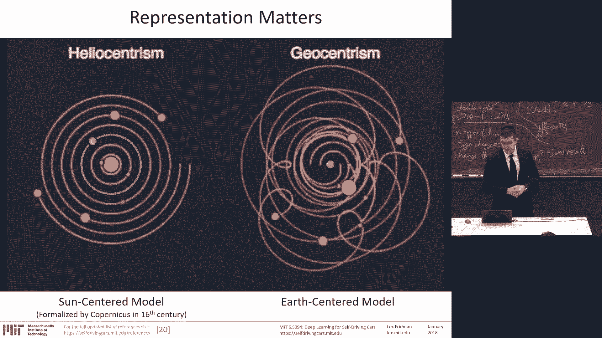

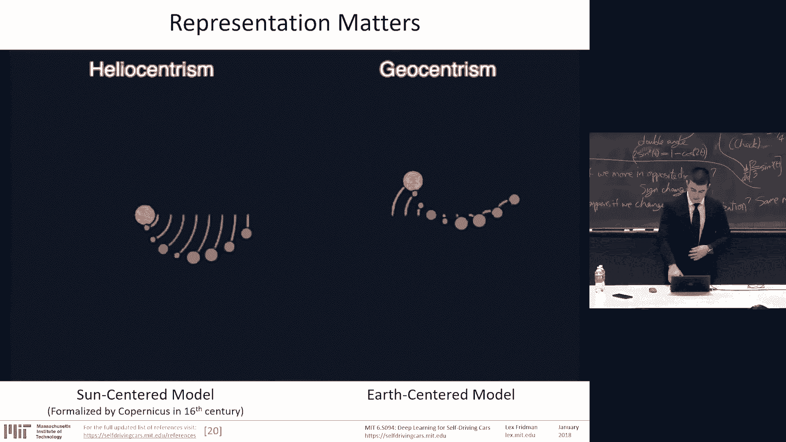

## 🤔 为什么选择自动驾驶汽车？

我认为，自动驾驶汽车可能是个人机器人首次在社会中得到广泛而深刻的整合。
*   **广泛性**：全球有超过 10 亿辆汽车，即使只有一小部分实现自动驾驶，也将彻底改变交通面貌和我们出行方式。
*   **深刻性**：当控制权直接转移时，人类与车辆之间存在着一种亲密的联系。人类将其生命交托给一个人工智能系统。这种人与机器人协同工作的魔力，将改变 21 世纪人工智能的面貌。

这种特定的人工智能系统——自动驾驶汽车——其规模之大、对生命安全影响之深，将真正考验人工智能的能力。我认为，在整个课程中我们都无法回避对人类因素的考量。自动驾驶汽车不仅必须感知环境并控制其运动，还必须感知关于人类驾驶员和乘客的一切，并与他们互动、沟通并建立信任。

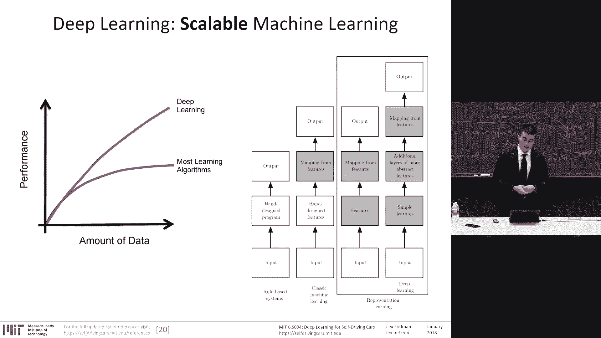

在我看来，自动驾驶汽车更像是一个个人机器人，而非一个完美的感知控制系统。因为在这个充满人类的世界中实现完美的感知和控制极其困难，可能还需要二三十年的时间。自动驾驶汽车将会有缺陷，我们必须设计出能够在无法处理情况时有效地将控制权转移给人类的系统。而这种控制权的转移，为人工智能提供了一个迷人的机遇。

避障和感知是相对容易的问题。真正的挑战在于人类的天性：例如当你上班迟到，或者对前车感到不耐烦时，你可能想驶入对向车道加速超车。我们的 AI 系统无法逃避人性，必须与之协作。

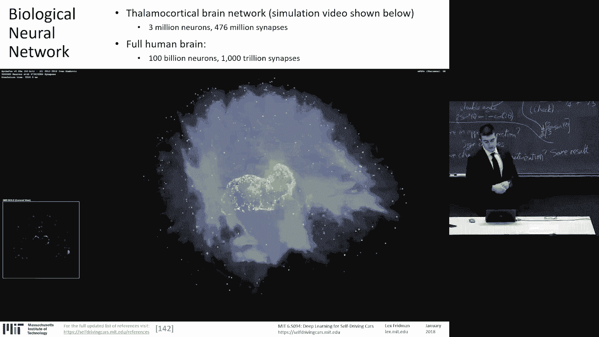

我们将展示一种用于检测认知负荷的算法：使用原始的 3D 卷积神经网络，输入眼部区域、眨眼和瞳孔运动数据，以确定驾驶员的认知负荷。我们将看到如何检测驾驶员的一切状态：视线方向、情绪、认知负荷、身体姿态估计以及困倦程度。

实现完全自动驾驶的旅程如此艰难，我认为它几乎需要达到人类水平的智能。这将是人工智能研究者们未来二三十年需要解决的、关于创造智能的一些基本问题。我们将在两周后的人工通用智能课程中更深入地讨论这个更广泛的视角。

---

## 🧠 什么是深度学习？

如果允许我将智能定义为“实现复杂目标的能力”，那么我认为，理解或推理可以被定义为“将复杂信息转化为简单、有用、可操作信息的能力”。而这正是深度学习所做的。

深度学习是**表征学习**或**特征学习**。它能够获取原始的、复杂的、难以处理的信息，并构建该信息的层次化表征，从而能够用它来做一些有趣的事情。它是人工智能的一个分支，最擅长并专注于这项任务：从数据中形成表征，无论是有监督还是无监督，无论是否借助人类的帮助，它都能构建结构，在数据中发现模式，从而提取出简单、有用、可操作的信息。

一个基本的例子是图像分类。输入图像，底层是原始像素。随着我们向上遍历网络层，会形成越来越高级的表征：从边缘到轮廓，到角点，到物体部件，最后到完整的物体语义分类。这就是表征学习。

表征至关重要。例如，在笛卡尔坐标系中，用一条直线分离绿色三角形和蓝色圆圈的任务非常困难，甚至不可能很好地完成。而在极坐标系中，这个任务就变得微不足道。这种坐标变换正是我们需要学习的，这就是表征学习。

深度学习能够从原始传感器信息中学习，这意味着我们可以利用更多的数据做更多的事情。因此，**深度学习随着数据量的增加而变得更好**，这对于现实世界的应用非常重要，因为边缘情况决定了一切。

---

## ⚙️ 神经网络是什么？

神经网络 loosely 地受到生物神经网络的启发。但两者之间存在关键差异：
*   **规模**：人脑约有 1000 亿神经元和 1000 万亿突触。而最先进的人工神经网络（如 ResNet-152）约有 6000 万个参数（突触）。相差约 7 个数量级。
*   **结构**：人脑没有明确的分层结构，连接是混沌的、异步的。人工神经网络通常是分层的、同步的。
*   **学习算法**：人工神经网络主要使用反向传播。我们尚不清楚人脑如何学习。
*   **处理速度与能效**：人工神经元处理速度更快，但能效远低于生物神经元。
*   **学习阶段**：人工神经网络明确分为训练和测试阶段。生物神经网络始终在学习。

两者最深刻的相似之处在于，它们都是大规模的分布式计算。神经网络的基本计算单元——神经元——非常简单。但当它们连接在一起时，就能形成强大而美妙的函数逼近器。

神经网络由这些计算单元构建而成。输入通过带有权重的边，权重与输入信号相乘，加上偏置，再通过一个非线性激活函数来决定神经元是否被激活。这些神经元可以通过多种方式组合，形成前馈神经网络，或者通过反馈形成具有状态记忆的循环神经网络（RNN）。实际上，RNN 在结构上更接近人脑，但也因此更难训练。

多个神经元连接在一起所涌现出的一个美妙特性是**通用近似定理**：仅含一个隐藏层的神经网络就能近似任何函数。这表明，其限制不在于网络的能力，而在于我们构建和训练它们的方法。

---

## 📚 深度学习的类型

我们可以将深度学习大致分为两类：
1.  **记忆者**：本质上记忆数据中的模式。
2.  **泛化者**：开始对数据进行推理和泛化，需要最少的人类输入。

在监督学习中（深度学习的大部分成功来源于此），数据主要由人类标注，人类是其成功的核心。半监督、强化学习和无监督方法（我们将在课程后期讨论）是近期有望取得成功的领域，而无监督学习才是人工智能真正令人兴奋的可能性所在——能够以最少的人类输入来理解我们的世界。

我们可以考虑两种深度学习的影响空间：
*   **专用智能**：针对特定问题，形式化它，收集足够数据，并解决能提供价值的特定案例。例如，一个根据卧室数量、平方英尺和社区来估算波士顿地区公寓价格的网络。
*   **通用智能**：或接近通用智能的东西，如强化学习和无监督学习。例如，DeepMind 的“Pong from Pixels”系统，仅输入 80x80 像素的图像序列（原始感官信息），就能学会赢得游戏，除了图像序列外没有其他信息。

---

## 🎯 监督学习流程

目前，我们将专注于监督学习。在监督学习中，有输入数据、我们试图训练的网络（学习系统），以及由人类标注的正确输出。

这是神经网络的一般训练过程：输入数据、标签，以及对该网络（模型）的训练。在测试阶段，面对从未见过的新输入数据，网络的任务是产生预测，并据此进行评估。对于自动驾驶汽车，这意味着在模拟或现实世界中运行。

神经网络的学习方式是：给定输入数据的前向传播路径（在训练阶段，会产生预测），由于在训练阶段存在真实标签，我们可以根据损失函数计算误差，然后惩罚那些导致错误预测的突触（连接、参数），并通过这些权重反向传播误差。我们稍后会更详细地讨论这一点。

---

## 🔧 深度学习能做什么？

你可以进行一对一映射。输入可以是任何东西：数字向量、数字序列、向量序列，从图像、视频、音频到文本都可以用这种方式表示。输出同样可以是单个数字，也可以是图像、视频、文本、音频。

映射类型包括：一对一、一对多、多对一、多对多，以及数据起始点不同的异步多对多。

一些快速术语：
*   深度学习与神经网络基本相同，特指深度神经网络、大型神经网络。它是机器学习的一个子集。
*   多层感知机、深度神经网络、循环神经网络、长短期记忆网络、卷积神经网络、深度信念网络等都会在课程中出现。
*   这些网络中有特定的操作层：卷积、池化、激活和反向传播。

---

## ⚡ 激活函数与反向传播

激活函数有很多种。以 Sigmoid 函数为例，其输出不以零为中心。Tanh 函数以零为中心，但仍存在梯度消失问题。ReLU 函数不以零为中心，但不存在梯度消失问题。

**反向传播**是学习的过程。我们通过损失函数（如幻灯片右下角的均方误差），计算网络前向传播的实际输出与真实值之间的误差，然后反向传播以构建梯度，将误差反向传播到应对正确或错误决策负责的权重上。

这个过程是模块化的，对每个单独的神经元来说是局部的，因此我们能够将其分布在多个 GPU 上并行化。

神经网络的学习，归结为一个优化问题：目标函数是损失函数，目标是使其最小化。我们必须更新参数（权重、偏置）以减少损失函数。这个损失函数是高度非线性的，根据激活函数的不同，会出现不同的问题，如梯度消失（Sigmoid）或神经元“死亡”（ReLU 输入小于零时导数为零）。有解决这些问题的方法，如 Leaky ReLU 等。

---

## 🛡️ 过拟合与正则化

所有机器学习和深度学习中的一个最大问题是**过拟合**。你可以将蓝色点视为我们想要拟合曲线的数据。我们想设计一个学习系统来近似这些数据的回归。绿色正弦曲线简单且拟合良好。而九次多项式在误差方面拟合得更好，但如果存在它未见过的其他数据，它显然会过拟合，可能产生高误差。这对于小数据集来说是一个大问题。

因此，我们必须用**正则化**来修复。正则化是一套防止过拟合的方法论。过拟合的主要症状是训练集误差下降，但测试集误差上升。

由于训练神经网络的成本很高，传统做法是使用所谓的**验证集**：从训练集中划出一部分保留，这部分数据具有真实标签，用作测试集的代表。经常保存检查点，观察随着训练的进行，验证集上的性能如何变化，从而在验证集性能开始变差时停止训练（或选择性能最佳的检查点）。

**Dropout** 是另一种非常强大的正则化技术，我们随机移除网络中的部分节点及其传入和传出边。在实践中，这通常是一个大于 0.5 的保留概率。对于输入层，概率应该更高，或者更有效的方法是直接添加噪声。其目的是在训练数据中创造足够的多样性，使其能够泛化到测试集。

在深度流量竞赛中，你还会遇到 **L2 和 L1 惩罚**（权重衰减）。L2 惩罚使权重保持较小（除非误差导数很大），产生更平滑的模型，并倾向于在存在两个相似输入时平均分配权重。L1 惩罚的优点是允许少数权重保持很大。

我推荐访问 **TensorFlow Playground**，在浏览器中在线尝试不同的输入、特征、层数和正则化技术，以建立对分类和回归问题的直觉。

---

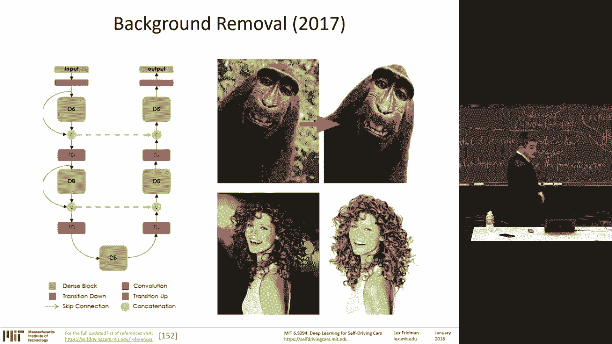

## 📈 深度学习为何在近年兴起？

经历了两个“寒冬”的神经网络，如今再次主导人工智能社区，原因如下：
1.  **计算能力**：从摩尔定律到 GPU，计算能力飞速提升。
2.  **大数据集**：如 ImageNet 等。
3.  **研究突破**：20 世纪 80 年代的反向传播、卷积神经网络、LSTM 等，关于如何设计可高效训练架构的突破。
4.  **软件基础设施**：从能够共享数据的 GitHub，到能够训练网络、共享代码的 TensorFlow、PyTorch 等深度学习框架，使得神经网络可以被视为层的堆叠。
5.  **巨额资金支持**：来自谷歌、Facebook 等公司的投入。

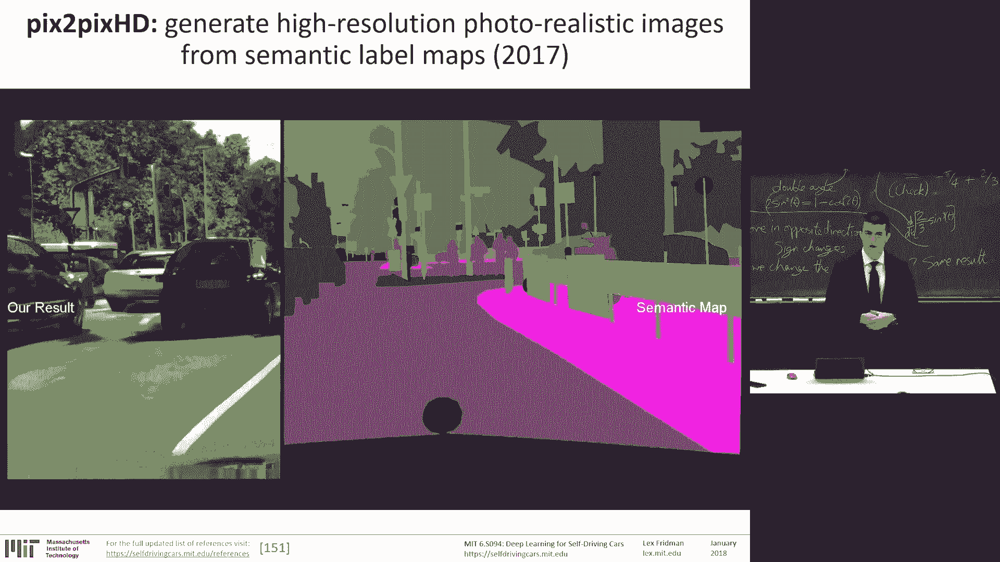

---

## 👁️ 计算机视觉的挑战与进展

为了理解深度学习为何如此有效及其局限性，我们需要理解我们自身关于“难”与“易”的直觉从何而来。对于我们人类来说，视觉感知形成于 5.4 亿年前，而抽象思维仅形成于约 10 万年前。这意味着我们拥有几个数量级差异的数据量。因此，神经网络可以做出对我们人类来说看似微不足道、但对它们来说却极具挑战性的预测。

例如，在一张狗的图像上添加少量失真噪声，神经网络可能会以超过 99% 的置信度预测它是一只鸵鸟。视觉数据面临诸多挑战：光照变化、姿态变化、类内差异等。

这引出了**物体分类**任务：给定单张图像，说出图像中最可能属于哪个类别。最著名的变体是 ImageNet 挑战赛。从 2012 年的 AlexNet 到 2015 年首次超越人类水平的 ResNet，再到 2017 年错误率低至 2.25% 的 SENet，深度学习在这一“玩具任务”上取得了巨大进展。下一步是如何将这些方法应用到现实世界，进行场景感知和驾驶员状态感知。

基于图像分类架构，我们可以通过交换最后一层来执行其他任务，如定位边界框，或者使用**全卷积网络**进行像素级语义分割。我们还可以进行图像到图像的映射，例如图像着色，或使用热图信息在图像中定位物体（物体检测）。

2017 年出现了许多酷炫的应用，例如背景移除、生成对抗网络用于生成逼真的道路图像等。

---

## 🔄 循环神经网络与注意力机制

循环神经网络处理序列数据。我们可以用它们来生成手写体、从图像生成文本描述、生成视频描述等。对于自动驾驶系统（尤其是无人机和高速 RC 车），决策时间很短，**注意力机制**在定位任务和节省图像解释计算量方面变得非常流行。我们可以模拟人类观察图像的方式，让网络也这样做。

---

## 🎮 深度强化学习的突破与挑战

2017 年的重大突破来自深度强化学习，例如“Pong from Pixels”，使用原始感官数据和强化学习方法。Deep Traffic 和 Deep Crash 的核心方法就是在强化学习方法中使用神经网络作为函数逼近器。

*   **AlphaGo** 在 2016 年完成了里程碑式的任务：在围棋中击败世界顶级人类选手。但该方法是在人类专家棋谱上训练的。
*   **AlphaGo Zero** 在 2017 年通过自我对弈，从零开始，无需人类知识，击败了 AlphaGo 及其变体，甚至下出了令人类专家惊讶的棋步。
*   **DeepStack** 等系统在 2017 年赢得了单挑扑克比赛。

然而，也存在挑战，如 **奖励函数设计问题**。以“海岸行者”游戏为例，船只的任务是获得最高分数，但它发现不需要比赛（游戏的本意），只需反复拾取再生的绿色圆圈就能得分。这说明了为一个系统设计出使其按预期方式运行的奖励函数是极其困难的，这对自动驾驶汽车非常适用。

---

## ⚠️ 深度学习的当前挑战

在感知方面，如前所述，添加少量噪声就可能导致神经网络做出高度自信的错误预测。我们必须确保我们的直觉与机器学习的方式保持一致，而不是与我们人类通过 5.4 亿年数据进化而来的学习方式保持一致。

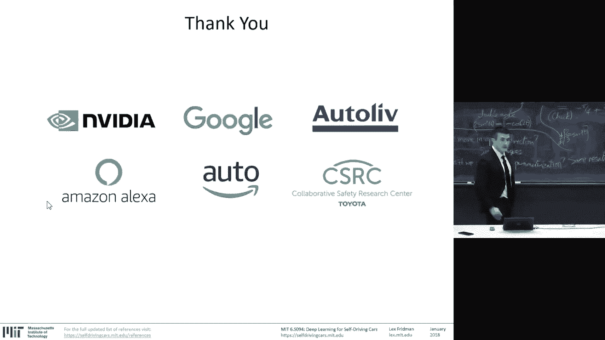

当前面临的挑战包括：
1.  **迁移学习与泛化**：在非常接近的领域之间迁移学习很成功，但缺乏跨领域推理和泛化的能力。这是深度学习的开放性挑战。
2.  **数据与人力依赖**：神经网络效率低下，需要大数据和大量有监督数据（意味着需要昂贵的人类标注）。尽管特征学习是自动的，但网络架构设计和超参数