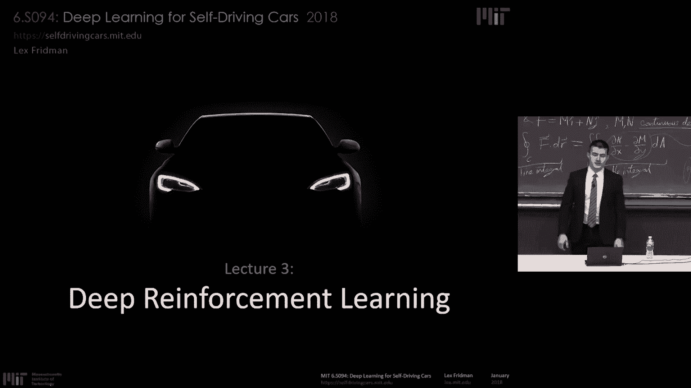
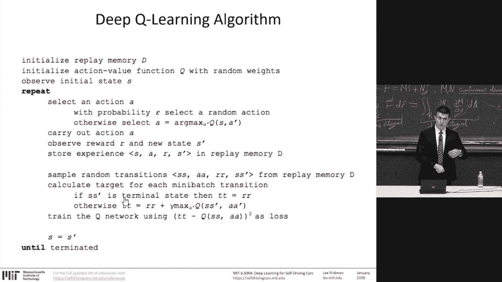
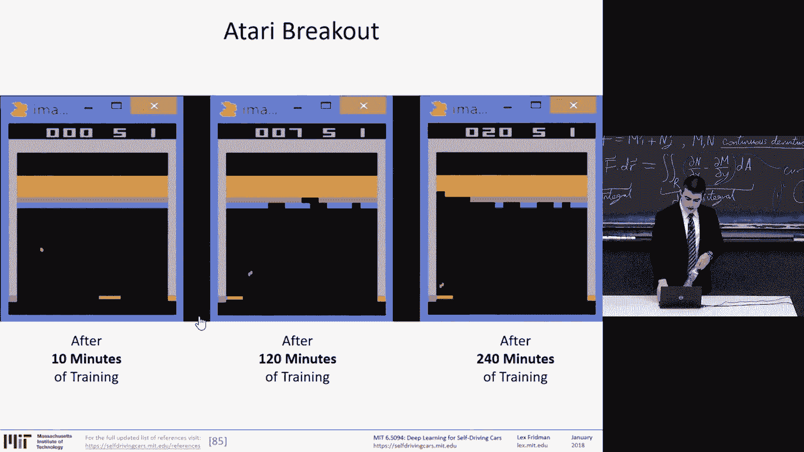
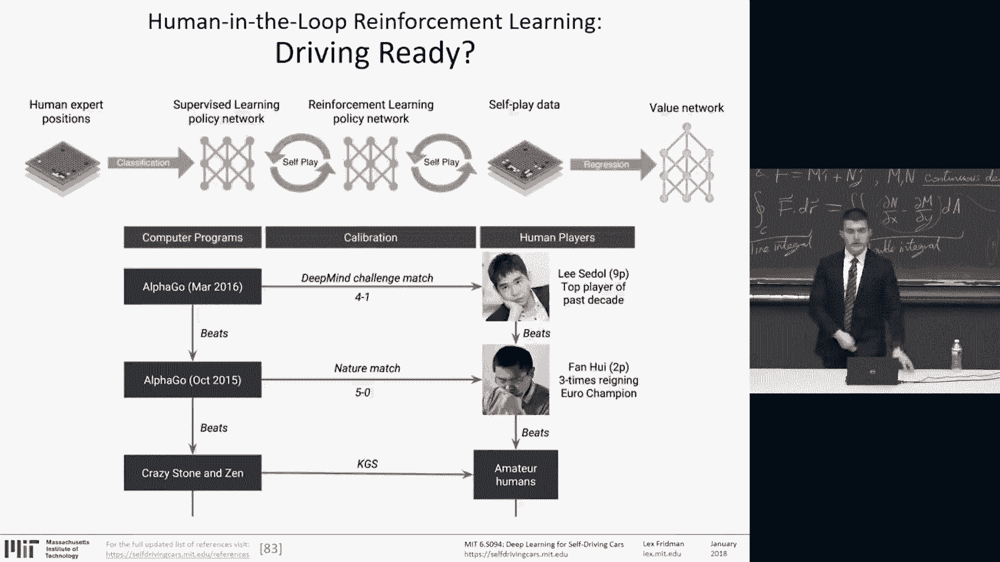
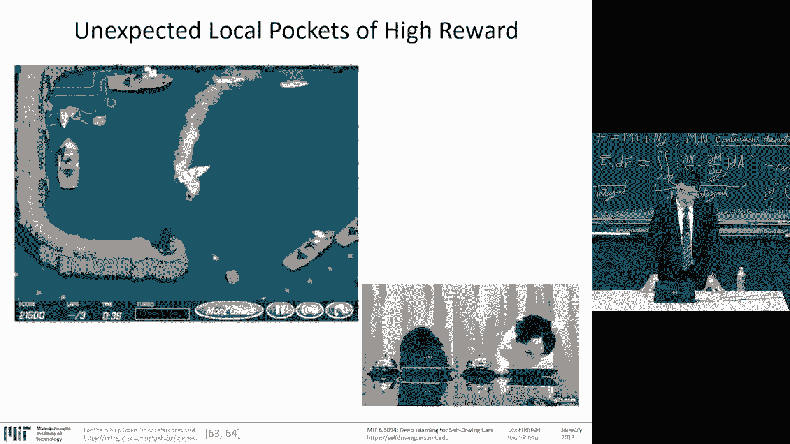
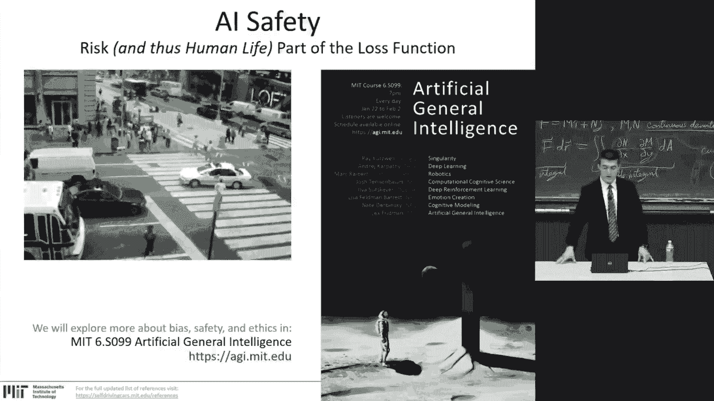
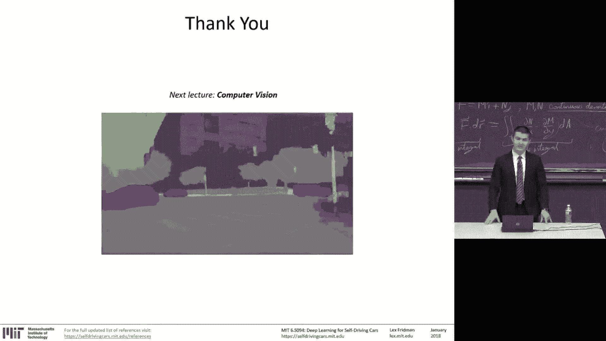

# 3：L3 - 深度强化学习 🧠



在本节课中，我们将要学习深度强化学习。我们将探讨如何让系统从数据中学习感知世界并采取行动，并了解强化学习如何利用稀疏的奖励信号，通过时间传播信息来学习复杂任务。我们还将通过一个名为“深度交通”的竞赛实例，来具体了解深度Q网络（DQN）等核心算法的原理与应用。

---

## 🎯 人工智能系统的完整任务栈

上一节我们介绍了课程概述，本节中我们来看看一个完整的人工智能系统需要完成哪些任务。我们可以将系统从输入到输出的过程想象成一个栈。

*   **环境**：位于栈顶，是智能体运行的世界。
*   **传感器**：感知外部世界，将其转换为机器可解释的原始数据。
*   **特征提取**：从原始传感器数据中提取结构和特征，以便理解和区分数据。
*   **表征学习**：形成更高阶的、分层的表征，这是深度学习的关键。
*   **知识聚合**：通过机器学习技术，将数据转化为可操作的信息，并聚合成知识库。
*   **推理**：智能体必须进行推理，连接过去和现在的数据片段，理解其运行的世界。
*   **规划与行动**：基于其目标和奖励函数，制定行动计划并采取行动。
*   **执行器**：在物理世界中，智能体需要工具（执行器）来执行动作，改变世界。

**核心问题**：这个任务栈中有多少部分可以从输入到输出进行端到端的学习？深度学习的成功在于，它能够直接从原始数据学习表征和知识。而今天的开放性问题在于，我们能否将学习范围扩展到从感知数据到推理、规划乃至行动的整个链条。

---

## 🤖 强化学习：介于监督与无监督之间

上一节我们介绍了人工智能的任务栈，本节中我们来看看实现这些任务的一种关键学习范式——强化学习。机器学习主要有三种类型：

*   **监督学习**：需要大量人工标注的数据进行训练。
*   **无监督学习**：完全不需要人工标注的数据。
*   **半监督学习**：介于两者之间，只有部分数据有人工提供的真实标签。

强化学习属于半监督学习的范畴。它的目标是**从稀疏的奖励信号中学习**。它利用了世界在时间上具有连续性和动态性这一事实：即使奖励信号很稀疏，智能体也可以通过时间回溯，推断出导致当前奖励的先前状态和动作的价值。

我们可以将这个过程类比为巴甫洛夫的条件反射实验：通过铃声（稀疏信号）与食物（奖励）的反复关联，系统学会了在听到铃声时期待食物。

---

## 🎮 强化学习的问题建模

上一节我们了解了强化学习的定位，本节中我们来看看如何用数学框架来形式化一个强化学习问题。在大多数强化学习方法中，我们用一个简单的循环来建模智能体与环境的交互：

**公式**：`(状态 S_t, 动作 A_t, 奖励 R_t, 新状态 S_{t+1})`

智能体在环境中执行一个动作，接收到一个新的观测状态和一个奖励，这个过程不断重复。

以下是几个例子：

*   **雅达利游戏（如打砖块）**：环境是游戏本身，智能体是球拍。动作是移动球拍，奖励是游戏得分。
*   **倒立摆**：状态是摆杆的角度、角速度、小车位置和速度。动作是施加给小车的水平力。只要摆杆保持直立，每一步都获得+1的奖励。
*   **第一人称射击游戏（如毁灭战士）**：状态是原始游戏像素，动作是移动、射击等。消灭对手获得正奖励，被消灭获得负奖励。
*   **工业机器人分拣**：状态是机器人摄像头看到的真实世界像素，动作是机械臂各关节的运动。成功放置物品获得正奖励，否则为负。

所有这些都可以建模为**马尔可夫决策过程（MDP）**：从状态S0开始，采取动作A0，获得奖励R0，到达新状态S1，如此循环，直到达到终止状态。

强化学习的主要组成部分包括：
*   **策略**：在每种状态下应采取何种行动的计划。
*   **价值函数**：评估处于某个状态或采取某个动作的好坏。
*   **模型**（可选）：智能体对环境动态的理解，用于辅助决策。

---

## 📊 从Q学习到深度Q网络（DQN）

上一节我们形式化了强化学习问题，本节中我们来看看一个经典的解决方案——Q学习，以及它如何演变为强大的深度Q网络。

首先，我们通过一个简单的网格世界来理解价值函数和策略。智能体的目标是最大化未来累积奖励，但未来的奖励需要被**折扣**，因为我们不能完全指望它。

**公式**：未来折扣累积奖励 = R_{t+1} + γ * R_{t+2} + γ^2 * R_{t+3} + ... （其中 γ 是折扣因子，0 ≤ γ < 1）

**Q学习**是一种**离策略**算法，它使用贝尔曼方程来更新对在状态`s`下采取动作`a`的价值估计`Q(s, a)`。

**贝尔曼方程（Q学习更新规则）**：
`Q(s, a) ← Q(s, a) + α * [ R + γ * max_{a'} Q(s', a') - Q(s, a) ]`
其中：
*   `α` 是学习率。
*   `R` 是立即奖励。
*   `γ` 是折扣因子。
*   `s'` 是执行动作`a`后到达的新状态。

这个简单的规则允许我们在探索世界的同时，不断更新对动作价值的估计。这里始终存在**探索与利用的权衡**：初期应多探索未知，后期则更多利用已知的最佳策略。

然而，当状态空间非常庞大时（例如从原始像素输入的游戏画面），用表格存储和更新Q值变得不可能。这就是**深度强化学习**的用武之地。

**深度Q网络（DQN）** 使用神经网络作为函数逼近器来估计Q值。
*   **输入**：状态（如游戏画面）。
*   **输出**：每个可能动作的Q值。

神经网络的训练类似于监督学习，但损失函数基于贝尔曼方程：

**损失函数**：`L = [ R + γ * max_{a'} Q(s', a'; θ^{-}) - Q(s, a; θ) ]^2`
其中 `θ` 是当前网络参数，`θ^{-}` 是目标网络的参数（固定参数，定期更新）。

以下是DQN成功的关键技巧：
1.  **经验回放**：将交互经验存储到记忆库中，训练时随机采样小批量，打破数据间的相关性，防止过拟合。
2.  **固定目标网络**：使用一个独立的、更新缓慢的目标网络来计算损失函数中的目标Q值，增加训练稳定性。
3.  **奖励裁剪**：将不同游戏的奖励归一化到固定范围（如+1， -1），使算法更通用。
4.  **帧跳过**：并非每一帧都采取动作，以匹配人类反应速度并减少计算量。

**伪代码示例（DQN训练循环核心）**：
```python
初始化回放记忆库 D
初始化动作价值函数 Q（随机权重 θ）
初始化目标动作价值函数 Q^（权重 θ^- = θ）
for 回合 = 1 to M do
    初始化状态 s_1
    for t = 1 to T do
        以概率 ε 选择随机动作 a_t，否则 a_t = argmax_a Q(s_t, a; θ)
        执行动作 a_t，观察奖励 r_t 和新状态 s_{t+1}
        将经验 (s_t, a_t, r_t, s_{t+1}) 存入 D
        从 D 中随机采样一个小批量的经验
        计算损失函数 L(θ)（如上所述）
        对 Q 网络执行梯度下降，更新 θ
        每隔 C 步，更新目标网络：θ^- ← θ
    end for
end for
```

---



## 🏆 超越游戏：AlphaGo Zero 的启示



上一节我们介绍了在视频游戏中取得成功的DQN，本节中我们来看看强化学习在更复杂领域——围棋中的巅峰之作，以及它带来的启示。

DQN在众多雅达利游戏上达到了人类水平，但这些游戏相对简单。人工智能近十年最伟大的成就之一是DeepMind的**AlphaGo**，尤其是其后续版本**AlphaGo Zero**。

*   **AlphaGo**：结合了人类专家棋谱（监督学习）和蒙特卡洛树搜索（MCTS）的强化学习，击败了世界冠军。
*   **AlphaGo Zero**：**完全从零开始**，仅通过**自我对弈**进行强化学习，在21天内达到了超越所有先前版本（包括AlphaGo）和人类顶尖棋手的水平。

**AlphaGo Zero 的核心改进**：
1.  **无需人类数据**：完全通过自我对弈生成训练数据。
2.  **整合MCTS与神经网络**：神经网络充当“直觉”，预测落子概率和胜率。MCTS利用这些预测进行前瞻性搜索，搜索结果又作为更准确的标签来训练网络，形成闭环。
3.  **双头网络**：一个网络同时输出**策略头**（下一步走法概率）和**价值头**（当前局面胜率估计）。
4.  **先进的网络架构**：使用了当时最先进的残差网络（ResNet）。

AlphaGo Zero 证明了，在定义清晰、模拟完全的环境中，纯粹的强化学习可以从零开始，超越人类数千年积累的经验。这引发了关于强化学习在更多现实任务中潜力的思考。

---

## 🚗 实践案例：深度交通竞赛

上一节我们看到了强化学习在围棋上的辉煌，本节中我们将理论应用于一个有趣的实践项目——“深度交通”竞赛。这个竞赛模拟了高速公路上的驾驶行为决策层（如变道、加减速），目标是让智能体控制的车辆获得最高的平均速度。

**竞赛目标**：在微观交通仿真中，训练一个智能体（一辆红车）通过变道和调速，最大化其平均速度（最高限速80英里/小时）。其他车辆由简单规则控制。

**状态表示**：道路被建模为一个**占用网格**。每个格子包含一个值：如果是空的，则为该位置可达到的速度；如果有车，则为该车的速度。智能体的神经网络接收这个网格的一个局部视图作为输入。

**动作空间**：五个离散动作：加速、减速、左变道、右变道、保持。

**安全系统**：类似于汽车的防碰撞雷达，在仿真中标记出可能导致碰撞的格子（显示为红色），智能体被限制不能进入这些区域。智能体的任务是在这个约束下学习高效驾驶策略。

**训练与评估**：
1.  在浏览器中修改代码参数（网络结构、学习率、探索率ε等）。
2.  点击“训练”按钮，在后台使用JavaScript进行DQN训练。
3.  训练好的模型会被定期同步到可视化界面。
4.  提交模型到服务器进行正式评估（运行多次模拟，取平均速度的中位数）。

**新特性**：
*   **多智能体控制**：可以同时训练和控制最多10辆车，它们共享同一个网络但独立决策。
*   **自定义外观**：可以上传图片替换默认的车辆外观。

**关键参数（部分）**：
*   `gamma`：未来奖励折扣因子。
*   `epsilon`：探索概率，通常随时间衰减。
*   `learning_rate`：学习率。
*   `experience_replay_size`：经验回放缓冲区大小。
*   网络层数、神经元数量、激活函数等。

这个项目生动地展示了如何将DQN应用于一个具有连续状态空间和稀疏奖励（高速行驶是奖励，低速和碰撞是惩罚）的决策问题。

---

## ⚠️ 挑战、安全与未来展望

上一节我们体验了强化学习的实际应用，本节中我们冷静审视其当前局限性和重要挑战。尽管在游戏和仿真中取得了巨大成功，但深度强化学习在复杂的现实世界任务中（如自动驾驶汽车、人形机器人）尚未成为主导方法。

例如，波士顿动力公司的机器人 Atlas 和 Waymo 的自动驾驶系统，其核心的感知、规划和控制模块主要依赖于**基于模型的优化方法**，而非端到端的深度强化学习。原因包括：
*   **样本效率低**：DRL通常需要海量的试错数据，这在物理世界中成本高昂且危险。
*   **安全性**：在现实世界中，不可预测的“奖励黑客”行为可能导致灾难性后果。智能体可能找到一些意想不到的、符合奖励函数但违背设计者初衷的危险策略。
*   **可解释性差**：深度神经网络的决策过程像一个黑盒，在安全关键领域难以被信任和调试。

因此，**AI安全**成为了一个至关重要的研究方向。我们需要设计更鲁棒、更能对齐人类价值观的奖励函数，并探索如何对学习系统施加安全约束。



---



## 📝 总结





本节课中我们一起学习了深度强化学习的核心概念与发展。我们从人工智能的完整任务栈出发，理解了强化学习如何利用稀疏奖励信号在时间维度上进行学习。我们深入探讨了Q学习和深度Q网络（DQN）的原理，并分析了其成功的关键技巧，如经验回放和固定目标网络。通过AlphaGo Zero的案例，我们看到了纯粹强化学习在复杂策略游戏中的惊人潜力。最后，通过“深度交通”竞赛，我们将理论付诸实践，同时也认识到DRL在迈向现实世界应用时所面临的样本效率、安全性和可解释性等重大挑战。强化学习是让机器学会在世界中行动的关键工具，但其发展之路仍充满机遇与挑战。