# 4：L4- 计算机视觉 👁️

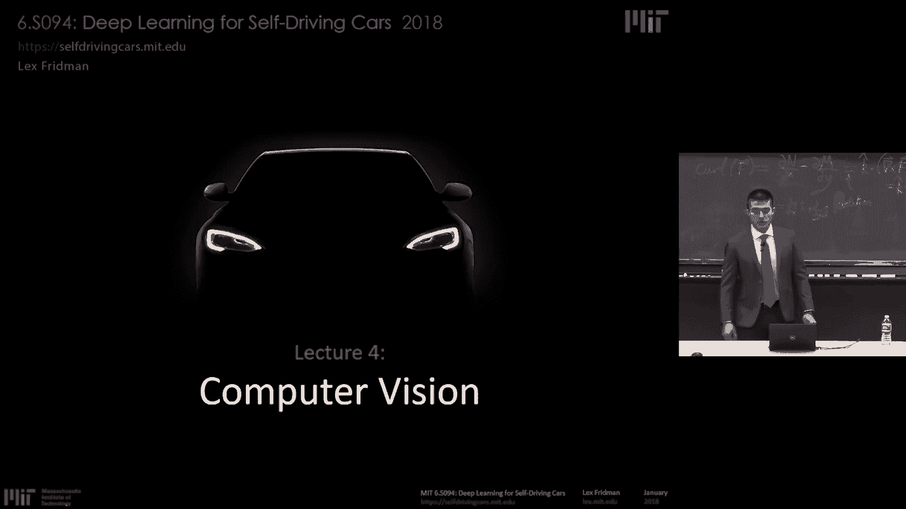

在本节课中，我们将学习如何让机器“看见”，即计算机视觉。我们将介绍一个前沿的竞赛，它旨在推动感知领域的发展，并可能催生引领世界的研究成果。

## 概述

今天，计算机视觉领域主要由深度学习驱动。我们如何解释、形成表示、理解图像和视频，在很大程度上都依赖于神经网络。这些思想适用于监督学习、无监督学习和强化学习。本节课我们将聚焦于监督学习的情况。

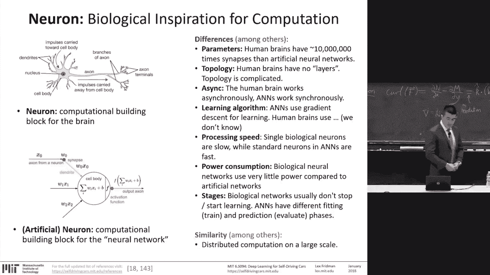

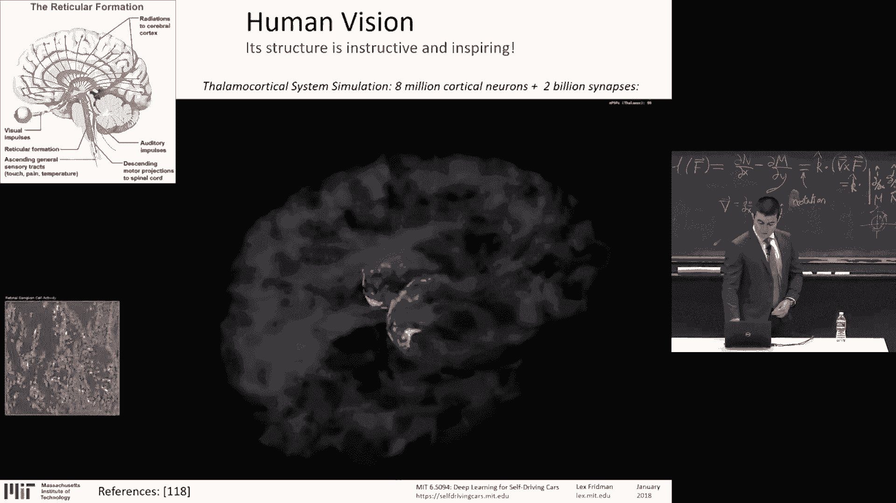

这个过程是相同的：数据至关重要。人类提供标签作为“真实值”的标注数据是训练过程的基础。然后，神经网络通过这些数据学习，将原始的感官输入映射到真实值标签，并在测试数据集上进行泛化。

我们处理的原始感官输入是数字。这一点需要反复强调：对人类视觉而言，我们理所当然地认为能够通过眼睛接收原始感官信息并解释它。但对机器来说，它接收到的只是数字。无论你是计算机视觉专家还是新手，都必须时常思考：机器被给予了什么样的数据？为了执行你要求它完成的任务，它需要处理的数据是什么？也许给予的数据根本不足以完成你想要的任务——这个问题会反复出现：仅凭图像足够理解周围的世界吗？

给定这些数字（有时是单通道，有时是RGB三通道，每个像素都有三个不同的颜色值），任务是进行分类或回归（产生连续变量），或者从一组类别标签中选择一个。和以前一样，我们必须小心对待关于计算机视觉中“难”与“易”的直觉。

## 灵感来源：人类视觉系统

让我们退一步，看看神经网络的灵感来源——我们自身的生物神经网络。因为人类视觉系统和计算机视觉系统在这些方面有些相似。

人类视觉皮层的结构是分层的。信息从眼睛传递到大脑中处理原始感官信息的区域，在这个过程中形成了越来越高级的表示。这就是使用深度神经网络处理图像的灵感来源。

通过网络的层，形成了越来越高级的表示。早期层接收非常原始的感官信息并提取边缘。连接这些边缘，形成更复杂的特征，最终形成我们希望从这些图像中获得的高级语义含义。

## 计算机视觉的挑战

在计算机视觉中，深度学习是困难的。光照变化是驾驶场景中最大的挑战之一，至少对于可见光摄像头来说是如此。姿态变化也是一个问题，正如我将讨论的Jeff Hinton和胶囊网络的一些进展所表明的：目前用于计算机视觉的神经网络不擅长表示可变的姿态。物体在图像这个颜色和纹理的二维平面上，当物体旋转或以不同方式变形时，其数值表现会非常不同。

对于分类任务，存在类内差异大而类间差异小的问题。例如，顶部的都是猫，底部的都是狗，但它们看起来非常不同。此外，驾驶感知中第二大问题可能是遮挡：由于世界的三维特性，一些物体位于另一些物体前面，从而遮挡了背景物体。然而，我们仍然需要在物体只有部分可见时识别它。有时，可见的部分（比如仅仅是一只耳朵或一条腿）很难告诉我们那是一只猫。

在哲学层面上，正如我们将要讨论的本次竞赛的动机：这里有一只猫打扮成猴子在吃香蕉。我们大多数人都能理解场景中发生了什么。事实上，今天的神经网络已经成功地将这个图像/视频分类为“猫”。但其中的语境、情境的幽默感，甚至可以说它是一只“猴子”的层面，是缺失的。同样缺失的还有动态信息，即场景的时间动态性。这就是迄今为止自动驾驶领域许多感知工作（就可见光摄像头而言）所缺失的。我们正寻求扩展这一点，这正是Sygfuse竞赛的全部意义。

## 图像分类流程

图像分类流程中，有不同的类别“箱子”，每个类别（如猫、狗、杯子、帽子）的箱子里有很多示例。你的任务是，当出现一个从未见过的新示例时，将这个图像放入一个箱子中。这与之前的机器学习任务相同。

一切都依赖于由人类标注的真实值数据。EmNist是一个手写数字的玩具数据集，常被用作示例。Coco、Sa far、Inet、Places以及其他许多包含数十万甚至数百万图像的惊人、丰富的数据集，代表了场景、人脸和不同物体。这些都是用于测试算法和评估竞争架构的真实值数据。

CFAR-10是最简单的数据集之一，几乎是包含10个类别的微型图标玩具数据集，类别包括飞机、汽车、鸟、猫、鹿、狗、青蛙、马、船和卡车。它通常用于探索我们将要讨论的一些基本卷积神经网络。

## 一个简单的分类器

让我们构思一个非常简单的分类器来解释我们如何着手处理这个问题。事实上，如果你开始思考如何对图像进行分类，而又不知道任何这些技术，这或许是你可能会采用的方法：尝试相减图像。

为了知道猫的图像与狗的图像不同，你必须在给定这两张图像时比较它们。比较的一种方法是直接相减。然后对图像中所有像素的差异求和，即逐个像素地减去图像强度值并求和。如果这个差值很大，就意味着图像非常不同。使用这个度量标准，我们可以查看CFAR-10数据集，并将其用作分类器：基于这个差异函数，我将为一张新图像找到差异最小的那个“箱子”。

在数据集中找到一张与我的图像最相似的图像，并将新图像放入该图像所属的类别中。

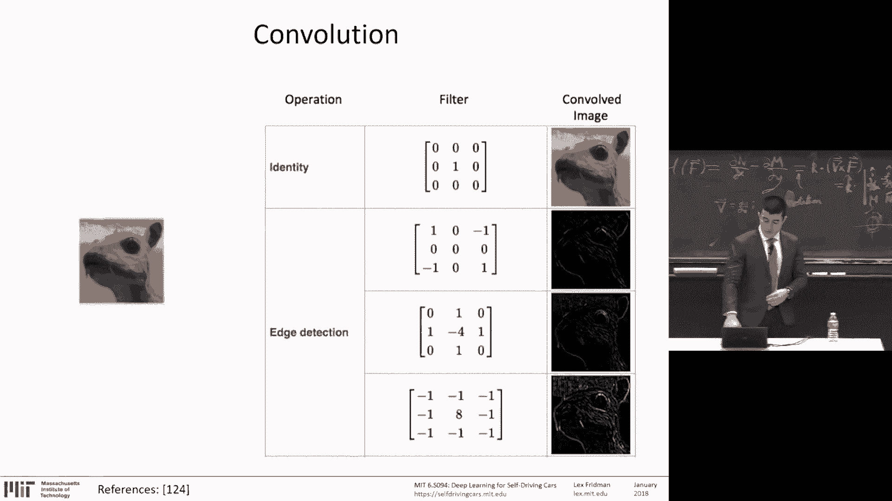

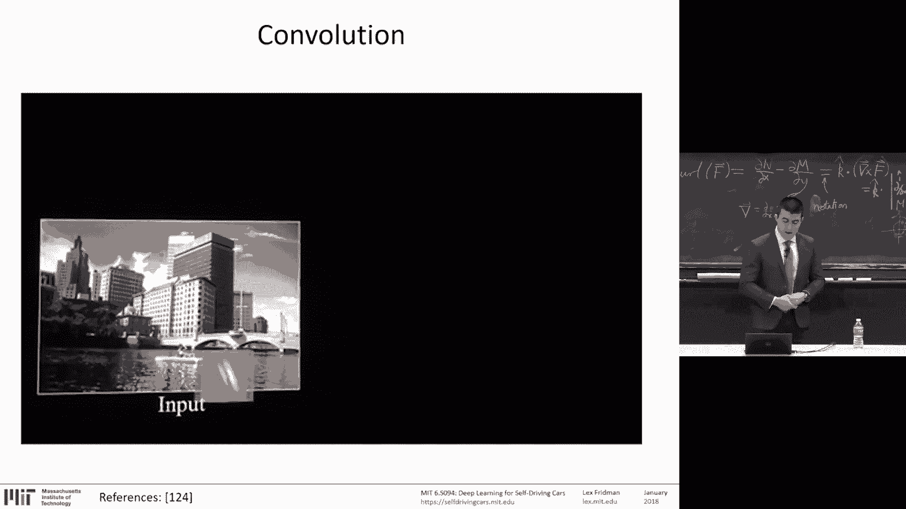

有10个类别，如果我们只是随机猜测，分类器的准确率将是10%。使用我们的图像差异分类器，实际上可以做得相当不错，远好于随机猜测，远高于10%。我们可以达到35-38%的准确率。这就是我们的第一个分类器。

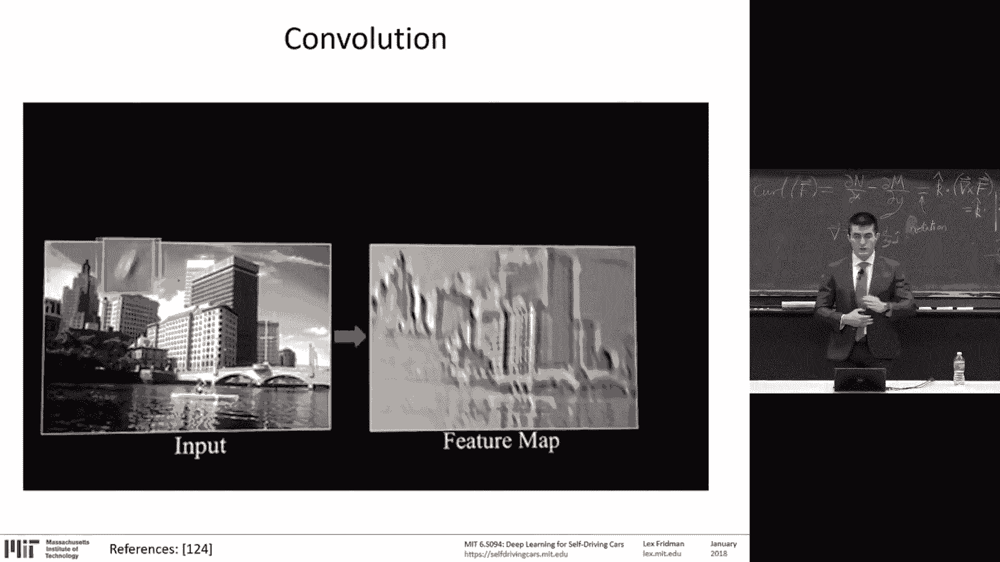

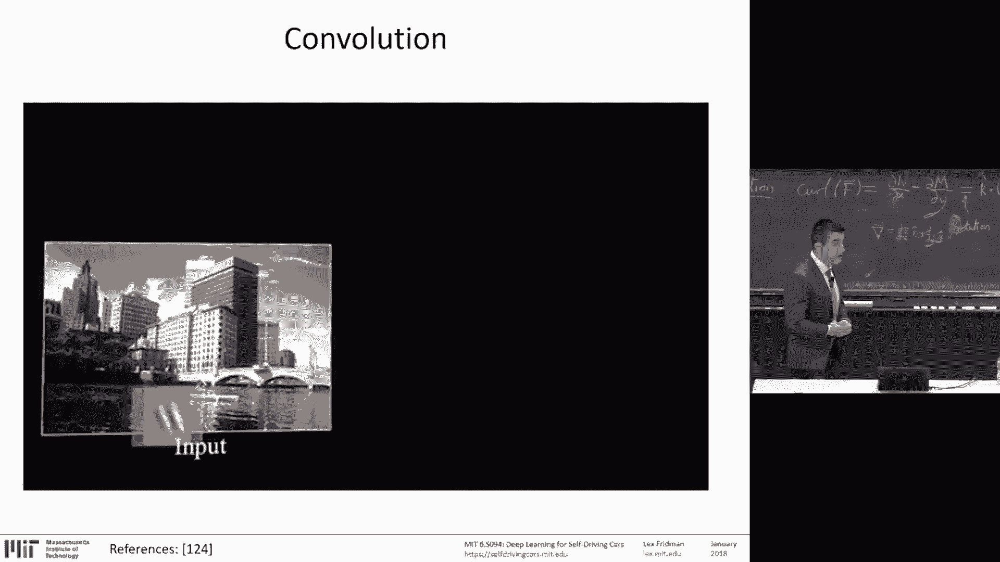

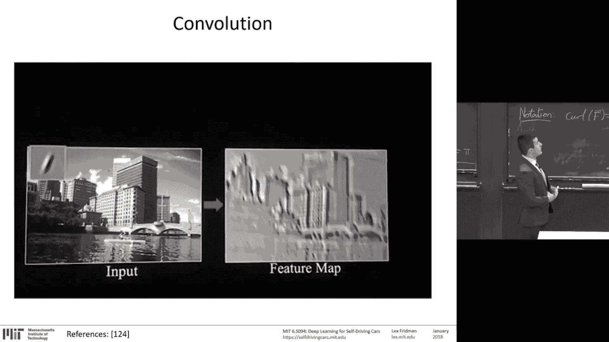

## K近邻分类器

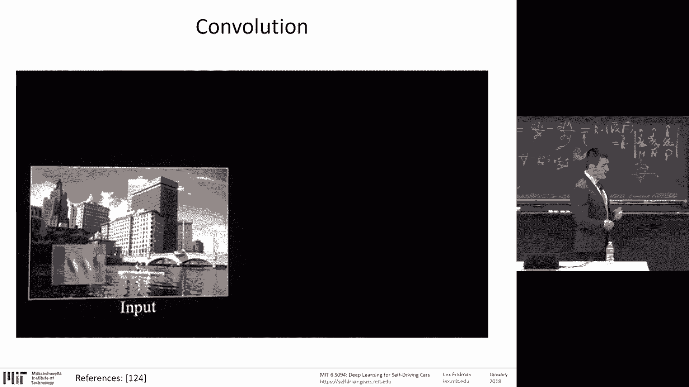

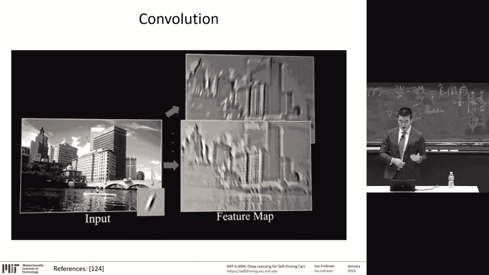

让我们将分类器提升到一个全新的水平：不是只与数据集中最接近的一张图像进行比较，而是尝试找到K个最接近的图像，然后看它们中的大多数属于哪个类别。我们将K从1增加到2、3、4、5，看看这如何改变问题。

对于CFAR-10，在这种方法下，7个最近邻是最优的，我们达到了30%的准确率。人类水平是95%的准确率。而使用卷积神经网络，我们非常接近100%。这就是神经网络擅长的地方——对图像进行分类的任务。

## 神经网络基础

这一切都始于这个基本的计算单元：信号输入，每个信号被加权、求和，加上偏置，然后输入到一个非线性激活函数中产生输出。非线性激活函数是关键。所有这些组合在一起，加上越来越多的隐藏层，就形成了一个深度神经网络。

正如我们讨论过的，这个深度神经网络通过在前向传播中处理真实值标签的示例进行训练，查看这些标签与真实真实值的接近程度，然后惩罚导致错误决策的权重，奖励导致正确决策的权重。

对于有10个类别的示例，网络的输出是10个不同的值。输入是0到9的手写数字，共有10个。我们希望我们的网络对这张手写数字图像进行分类：是0、1、2、3……还是9。通常的做法是，网络有10个输出，输出层的每个神经元负责在自己的数字被识别时变得非常“兴奋”，而其他神经元则应该不兴奋。因此，类别的数量就是输出的数量，这是常见的做法。然后根据产生最高输出的神经元，将输入图像分配到一个类别。

但这是我们周一讨论过的全连接网络。在深度学习中，有很多技巧可以使事情顺利进行，使训练在大型数据集、类别繁多、神经网络需要学习的表示极其复杂的情况下更加高效。这就是卷积神经网络介入的地方，它们使用的技巧是空间不变性。

## 卷积神经网络

它们使用的理念是：图像左上角的猫与图像右下角的猫是相同的。因此，我们可以在整个图像中学习相同的特征。这就是卷积操作介入的地方。

与全连接网络不同，这里存在第三个维度——深度。因此，这个神经网络中的块将3D体积作为输入，并输出3D体积。它们获取图像的一个切片（一个窗口），并在整个图像上滑动，应用完全相同的权重。我们将通过一个例子来说明：在全连接网络中用于将输入映射到输出的边缘上的权重，在这里被用于将图像的一个切片（这个图像窗口）映射到输出。

你可以制作许多这样的卷积滤波器、许多层、许多不同的选项，来寻找图像中的各种特征、滑动各种窗口以提取图像中的各种边缘、各种更高级的模式。

非常重要的一点是，每个滤波器上的参数（这些图像子集、这些窗口）是共享的。如果定义一个猫的特征在左上角有用，那么它在右上角也有用，在图像的每个部分都有用。这就是使卷积神经网络能够显著节省大量参数、减少参数数量的技巧——在图像空间上共享特征。

这些3D体积的深度是滤波器的数量。步长是滤波器的跳跃步长，即在对输入应用滤波器时跳过的像素数。填充是在卷积层输入外部进行的零填充。

让我们看一个例子。左边是一个三通道的输入体积。左边列是输入，那三个方块是三个通道，里面有数字。然后我们有一个红色的滤波器，有两个。两个通道的滤波器，带有一个偏置。这些滤波器是3x3的，每个都是3x3大小。我们要做的是，获取这些需要学习的3x3滤波器（这些是我们的变量，我们需要学习的权重），然后在图像上滑动它，产生右边绿色的输出。

通过应用红色的滤波器（有两个，每个滤波器对应每个输入通道有一个），我们从左边到右边，从左边的输入体积到右边绿色的输出体积。你可以自己查看幻灯片，如果你看不清屏幕上的数字，但操作是在输入上执行的，以产生绿色输出中高亮显示的单个值。我们以步长为2（在这个例子中）沿着图像滑动这个卷积滤波器，向右滑动，产生绿色的双通道输出。就是这样，这就是卷积操作，这就是神经网络中所谓的卷积层。

这里的参数（除了偏置）是中间红色的值。这就是我们要学习的东西。除了这些，我们今天还将讨论许多有趣的技巧，但这是核心——这种参数的空间不变性共享，使得卷积神经网络能够高效地学习和发现图像中的模式。

为了进一步建立你的直觉，左边是一张输入图像，右边是应用恒等滤波器产生的输出。然后有不同的方法可以提取不同类型的边缘。应用这些边缘检测滤波器到左边的图像时，会在右边产生激活图，白色部分是激活卷积的区域，是这些滤波器的结果。

你可以使用任何类型的滤波器，这就是我们要学习的——任何类型的边缘、任何类型的模式，你可以像这里展示的那样沿着图像滑动窗口，并产生你在右边看到的输出。

根据你在每一层有多少个滤波器，你会有许多像右边那样的切片。左边是输入，右边是输出。如果你有几十个滤波器，右边就会有几十张图像，每张图像显示不同滤波器模式被找到的位置。

我们学习哪些模式对于执行分类任务是有用的。这就是神经网络的任务——学习这些滤波器。这些滤波器具有越来越高级的表示，从非常基本的边缘到跨越整个图像的高级语义含义。

跨越图像的能力可以通过几种方式实现，但传统上是通过最大池化（池化）成功实现的。通过获取卷积操作的输出，并通过例如取最大值（最大激活）来压缩信息，从而降低空间分辨率。这对寻找图像中更高级的表示（将图像特征结合起来形成我们试图识别和分类的实体）是有益的，尽管正如我们将在场景分割中讨论的，它也有不利影响。

## 卷积神经网络架构

这样，就形成了一个卷积神经网络。将这样的卷积层堆叠在一起，是构成卷积神经网络的唯一补充。然后，在最后，全连接层或任何其他类型的架构允许我们应用于特定领域。

让我们以ImageNet作为一个案例研究。ImageNet数据集和挑战的任务是分类。正如我在第一堂课中提到的，ImageNet是世界上最大的图像数据集之一，拥有1400万张图像，21000个类别。许多类别有很深的层次，正如我提到的，有1200张“澳洲青苹果”的图像。这些使得神经网络能够学习丰富的表示，包括特定类别（如澳洲青苹果）的姿态、光照变化和类内差异。

让我们浏览各种网络，讨论它们，看看其中的洞见。从AlexNet开始，这是第一个在ImageNet上使用GPU训练并取得巨大成功的神经网络，相比前一年取得了显著提升。然后发展到VGGNet、GoogleNet、ResNet、DenseNet，以及2017年的SENet。同样，显示的准确率数字是基于前五错误率：你有五次猜测机会，如果五次中有一个正确，你就得一分，否则得零分。人类尝试执行与机器相同任务时的错误率是5.1%。人类对图像进行二元分类（是澳洲青苹果/猫，或不是）的标注，机器和参与竞争的人类需要执行的任务是：给定一张图像，从众多类别中提供一个。在此之下，人类错误率是5.1%，这个记录在2015年被ResNet超越，达到了4%的错误率。

让我们从AlexNet开始。我会更详细地介绍后面的网络，它们有一些有趣的洞见，但AlexNet和VGGNet都遵循非常相似的架构，在其深度上非常统一。VGGNet在2014年提出，结构是卷积、卷积、池化、卷积、池化、卷积、池化，最后是全连接层。这种架构有一种优美的简洁性和统一性，因为你可以简单地让它越来越深，并且非常易于在任何深度学习框架中以层堆叠的方式实现。以VGGNet-16或19层为例，它有1.38亿个参数，对这些参数的优化不多，因此，尽管层数不算太多，但参数数量比后来的网络要多得多。

GoogleNet引入了Inception模块，开始在这些网络内部的小模块上做一些有趣的事情，这使得训练更加高效和有效。这里展示的Inception模块背后的理念是：底部是前一层，顶部是带有Inception模块的卷积层。它使用的理念是：不同大小的卷积为网络提供不同的价值。较小的卷积能够捕获或传播非常局部、高分辨率的纹理特征。较大的卷积更擅长表示和捕获高度抽象的特征、更高级的特征。因此，Inception模块背后的理念是：与其在超参数调优或架构设计过程中选择我们想要使用的卷积大小，为什么不一起使用它们呢？在GoogleNet模型中，有1x1、3x3和5x5卷积，以及仍然保留在那里的老朋友——最大池化（随着时间的推移，在图像分类任务中，最大池化越来越不受青睐）。结果是，如果你正确放置这些Inception模块，实现更高性能所需的参数数量要少得多。

ResNet是迄今为止最流行的架构之一，我们也会在场景分割中讨论它。它提出了残差块的概念。最初的启发式观察（尽管后来证明不一定完全成立）是网络深度增加了表示能力。这些残差块允许你拥有更深的网络。我稍后会解释原因，但关键使这些块如此有效的是与循环神经网络相似的理念（希望我们有机会讨论）。它们的训练更容易。它们采用一个简单的块，重复多次，并且允许输入在不经过变换的情况下传递，同时也允许对其进行变换、学习滤波器、学习权重。因此，你允许每一层不仅处理前几层的信息，还能接收原始的、未经变换的数据并学习新的东西。学习新东西的能力允许你拥有更深的网络，而这个块的简单性使得训练更有效。

2017年的最先进技术是Squeeze-and-Excitation Networks。与前一年（使用集成方法并结合了许多成功方法以获得边际改进的DenseNet）不同，SENet通过使用一个我认为很重要的简单洞见，取得了显著的改进（在百分比上，我认为错误率从4%降低到3%左右，减少了25%）。它给卷积层中的每个通道添加了一个参数。因此，网络现在可以根据输入内容调整每个特征图（通道）的权重。这是一个值得思考的要点：关于我们讨论的任何网络或架构，很多时候循环神经网络和卷积神经网络都有显著减少参数数量的技巧。它们利用空间不变性、时间不变性来减少表示输入数据所需的参数数量，但它们也留下了一些未被参数化的方面，不允许网络学习。在这个案例中，允许网络学习每个单独通道（滤波器）的权重，与学习滤波器本身一起，带来了巨大的提升。很酷的一点是，这种块（Squeeze-and-Excitation块）适用于任何架构。显然，它只是参数化了基于内容选择使用哪个滤波器的能力，这是一个微妙但关键的事情。我认为这很酷，并且对未来研究有启发：思考神经网络中还有什么可以被参数化，还有什么可以作为学习过程的一部分被控制，包括更高级的超参数。网络的训练和架构的哪些方面可以成为学习的一部分？这就是这个网络所启发的。

另一个网络自90年代起就在开发中（源于Jeff Hinton的想法），但在2017年真正发表并受到广泛关注，这里我不会详细讨论，我们将发布一个关于胶囊网络的在线视频。它有点太技术性，但它们启发了非常重要的一点：每当深度学习取得成功时，我们应该思考，正如我提到的猫吃香蕉的例子，在哲学和数学层面上，我们必须考虑这些网络做出了什么假设，以及通过这些假设它们丢弃了什么信息。

因此，由于空间不变性，卷积神经网络丢弃了关于简单物体和复杂物体之间层次关系的信息。所以，对于卷积神经网络来说，左边的人脸和右边的人脸看起来是一样的。眼睛、鼻子和嘴巴的存在是卷积网络分类任务起作用的本质方面，它会激活并说这绝对是一张脸。但空间关系丢失了，被忽略了。这意味着有很多影响，但对于姿态变化等问题，信息完全丢失了。我们完全丢弃了这些信息，并希望在这些网络中执行的池化操作能够将所有东西混合在一起，提出面部不同部分的激活特征，然后得出“这是一张脸”的总分类，而没有真正表示这些低级特征和高级特征之间、简单层次和复杂层次之间的关系。这是一个现在非常令人兴奋的领域，希望能激发我们如何设计能够学习旋转、方向等不变性的神经网络的发展。

## 全卷积神经网络与图像分割

正如我提到的，你可以获取这些卷积神经网络，去掉最后一层，以应用于特定领域。这就是我们将用全卷积神经网络做的事情，这些网络的任务是在像素级别分割图像。提醒一下，这些网络通过卷积过程实际上产生热图：网络的不同部分根据图像的不同方面被激活。因此，它可以用于定位检测，而不仅仅是分类图像，还可以定位物体。它可以在像素级别做到这一点。

因此，卷积层在编码过程中，获取图像中丰富的原始感官信息，并将其编码成一组可解释的特征表示，然后可以用于分类。但我们也可以使用解码器，对信息进行上采样，并产生像这样的地图。

全卷积神经网络、分割、语义场景分割、图像分割的目标是：与分类整个图像不同，你对每个像素进行分类。这是像素级分割，你用该像素属于哪个物体来为每个像素着色，在这个图像的二维空间中，这是三维世界的二维投影。

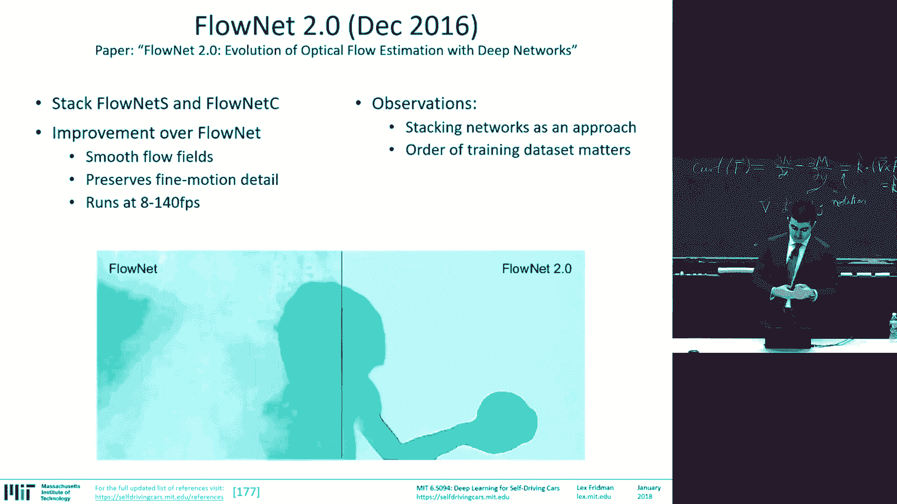

问题是，在过去三年里有很多进展，但它仍然是一个极其困难的问题。如果你想想用于训练的数据量，以及需要为数百万像素中的每一个分配单个标签的任务，这是一个极其困难的问题。

为什么这是一个有趣且重要的问题需要解决，而不是仅仅在猫周围画边界框？嗯，每当物体的精确边界很重要时，例如在医学应用中查看成像和检测（例如在不同器官的医学成像中检测肿瘤），以及在驾驶和机器人技术中，当涉及物体时，涉及车辆、行人、骑自行车者的密集场景，我们需要能够不仅对物体位置有粗略估计，还需要能够有精确的边界，然后可能通过数据融合（融合传感器），将这些关于行人、骑自行车者和车辆的丰富纹理信息与我们提供世界三维地图的激光雷达数据融合，或者同时拥有不同物体的语义含义及其精确的三维位置。

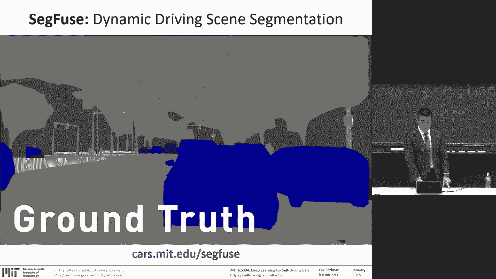

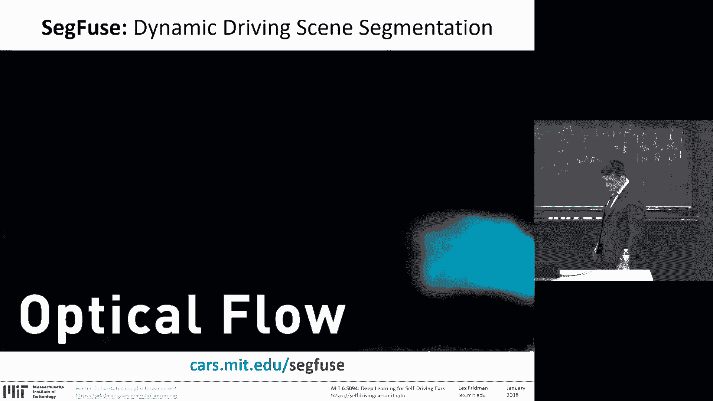

许多这方面的工作很成功。语义分割的许多工作始于2014年11月的“用于语义分割的全卷积网络”论文（FCN），这就是FCN名称的由来。现在浏览几篇论文，给你一些关于该领域发展方向以及如何引导我们走向Sygfuse分割竞赛的直觉。

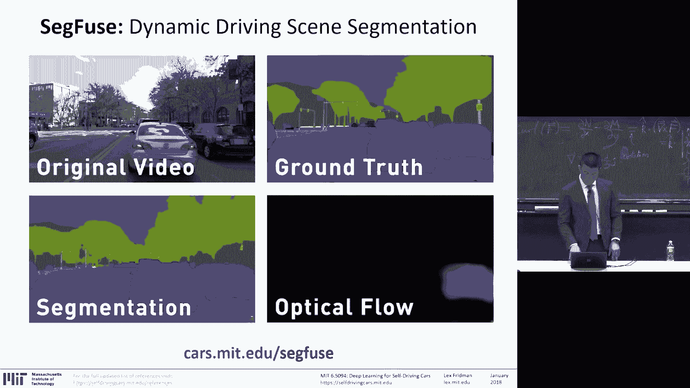

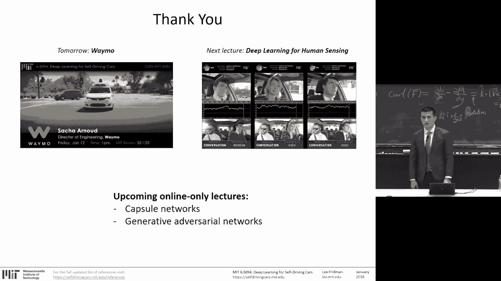

FCN重新利用了在ImageNet上预训练的网络（这些网络被训练用于分类整个图像），去掉了全连接层，然后添加了上采样