# 5：L5 - 深度学习与类人环境感知 👁️

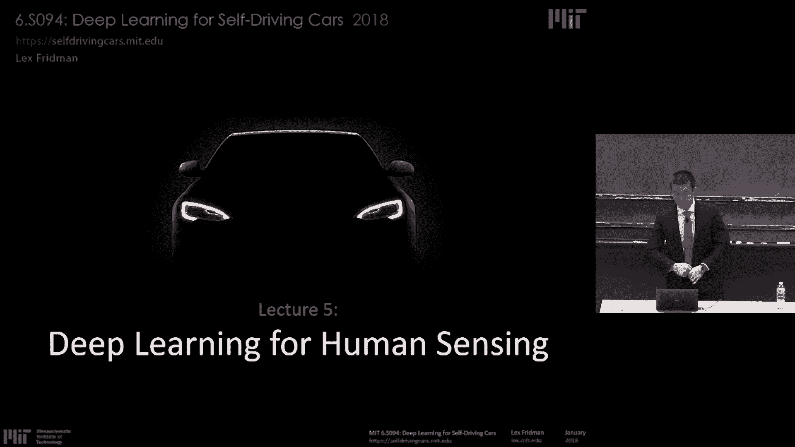

在本节课中，我们将学习如何应用深度学习方法来理解人类的感知，特别是计算机视觉领域。我们将探讨如何从图像和视频中提取关于人类的有用、可操作的信息，尤其是在驾驶场景中。

---

## 成功应用深度学习方法的要素

上一节我们介绍了课程的整体目标，本节中我们来看看在现实世界中成功应用深度学习方法的几个关键要素。这些要素听起来简单，但其中一些远比听起来要困难。以下是按重要性从高到低排列的要素：

*   **数据**：数据是一切的基础。我们需要大量真实世界的数据来构建数据集，以便训练监督学习算法。数据收集是最困难也是最重要的部分。
*   **高效标注**：仅有原始数据（视频、音频、激光雷达等）是不够的，我们必须将其转化为有意义的、能代表现实世界情况的案例。这意味着需要为特定任务设计高效的标注工具。
*   **硬件**：为了处理我们收集的海量数据（例如超过50亿张驾驶图像），我们需要大规模分布式计算和存储系统。
*   **算法**：这是最令人兴奋的部分，包括深度学习算法和机器学习算法。然而，在现实世界的系统中，只要算法能从数据中学习，数据的重要性就远高于算法本身。

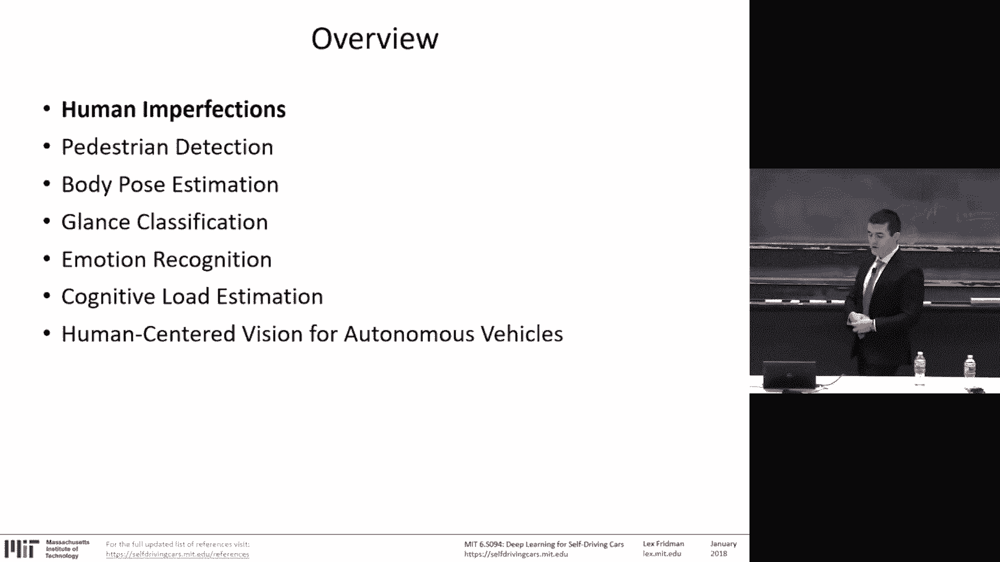

**核心要点**：构建成功系统的关键在于数据收集、数据清洗和数据标注这些看似枯燥的工作，其重要性远超过拥有优秀的算法。

---

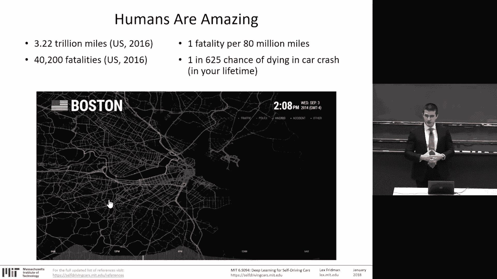

## 人类的卓越与缺陷 🏆

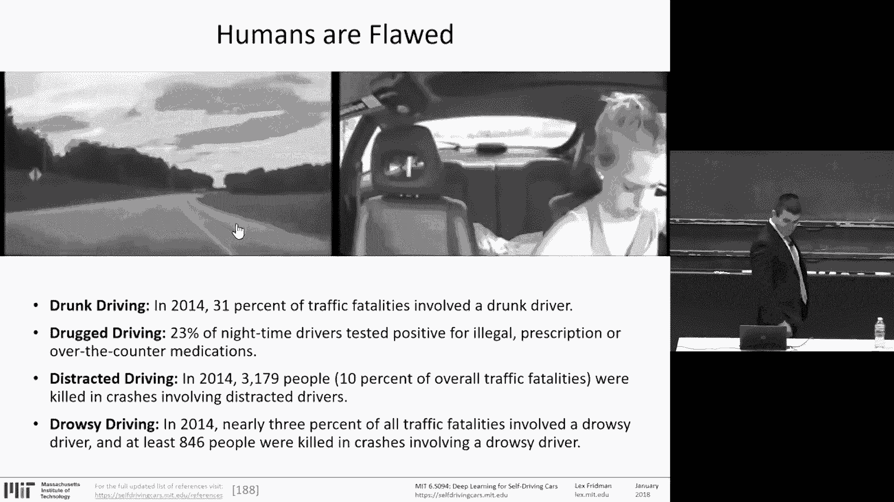

在深入探讨如何感知人类之前，我们先要承认人类在许多方面是卓越的。例如，人类驾驶员在数万亿英里的行程中，事故率相对较低。

然而，人类也存在缺陷，这些缺陷在驾驶中构成了严重的安全风险。以下是几种主要的驾驶分心或危险行为：

*   **分心驾驶**：如使用手机发短信、吃东西、与乘客交谈等。仅发短信一项，平均会使驾驶员视线离开道路5秒钟，在高速行驶时足以覆盖一个足球场的距离。
*   **酒驾与药驾**：分别导致了相当比例的交通死亡事故。
*   **疲劳驾驶**：也是导致交通事故的重要因素。

这些缺陷促使我们思考，在开发自动驾驶系统时，是应该追求完全移除人类的“全自动驾驶”路径，还是应该采用“以人为中心”的路径，让人工智能与人类驾驶员协作，共同提升安全性。

---

## 以人为中心的自动驾驶路径 🤝

上一节我们讨论了人类的缺陷，本节中我们来看看为什么“以人为中心”的自动驾驶路径更为现实。完全自动驾驶的实现可能还需要数十年时间，而人类将在很长一段时间内与AI系统协同工作。

因此，我们需要教会汽车感知和理解车内的人类驾驶员。这一切都始于数据。例如，在MIT的自然驾驶数据收集中，我们装备了25辆汽车（其中21辆配备特斯拉自动驾驶系统），通过多个摄像头同步记录驾驶员的面部、身体姿态和车外场景，每天收集数千英里的数据。

从这些数据中，我们不仅能够理解人类驾驶员的行为，还能训练深度神经网络来执行感知任务。数据显示，在使用特斯拉自动驾驶系统时，约有33%的里程是在自动模式下完成的，这表明人们从中获得了价值，并且没有表现出明显的过度信任。

---

## 行人检测 🚶

现在，让我们开始探讨具体的人类感知任务。我们从相对简单的任务开始：行人检测。行人检测是指在图像或视频中检测人类的全身。

这个任务面临一些常见的计算机视觉挑战：

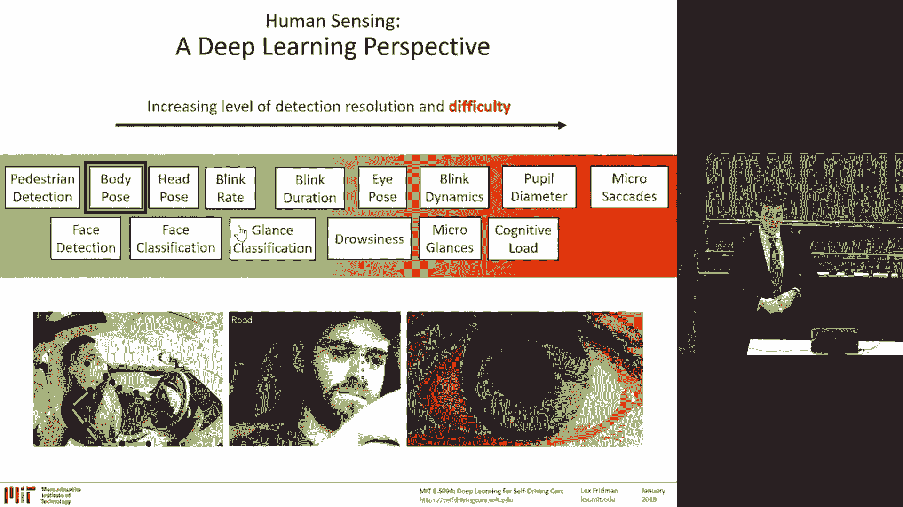

*   **类内差异**：行人外观、姿态各异。
*   **遮挡**：行人可能被物体或其他行人遮挡。
*   **密集场景**：在拥挤的场景中区分每个行人非常困难。

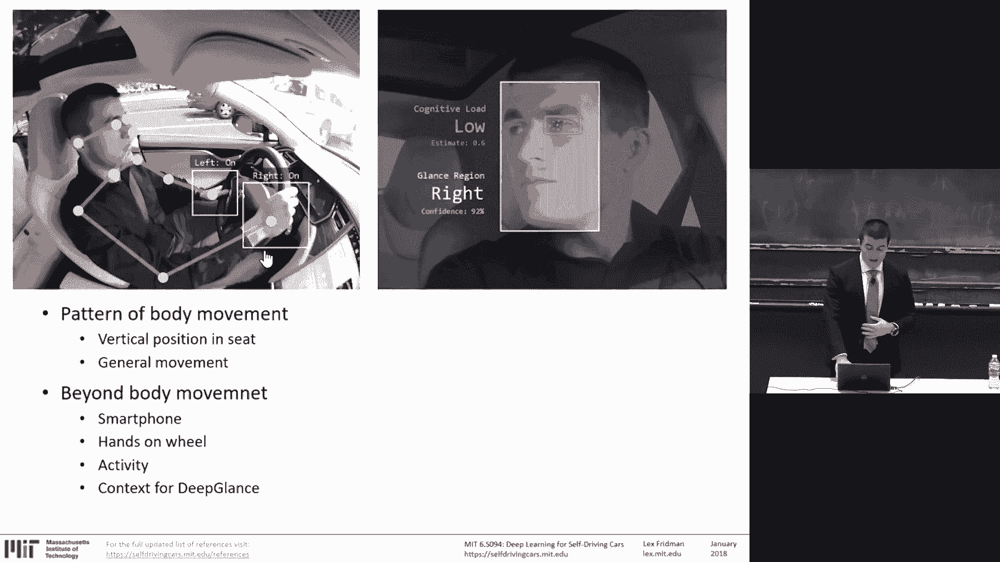

**技术演进**：
1.  **滑动窗口法**：使用分类器（如HOG或CNN）在图像的不同位置和尺度上滑动，判断窗口内是否有行人。这种方法效率较低。
2.  **区域提议网络**：如**Faster R-CNN**，首先生成可能包含物体的候选区域，然后对候选区域进行分类，大大提高了效率。
3.  **最新进展**：如**Mask R-CNN**可以在检测的同时进行实例分割；**VoxelNet**等则用于处理3D激光雷达点云数据。

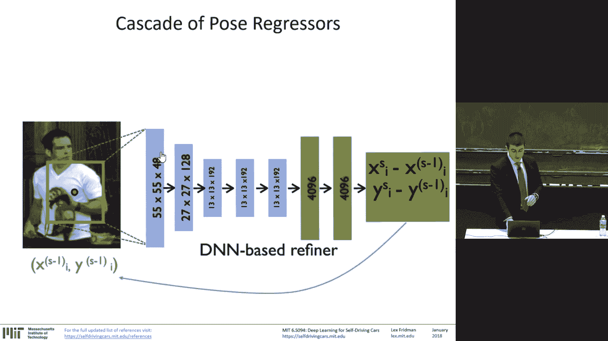

**数据收集**：我们通过在十字路口部署4K摄像头、立体视觉相机、360度相机和激光雷达等传感器，每天捕获约12，000名行人的数据，用于研究行人过街决策等行为。

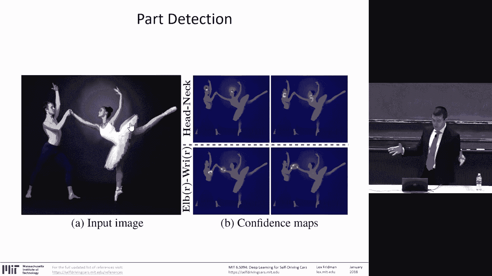

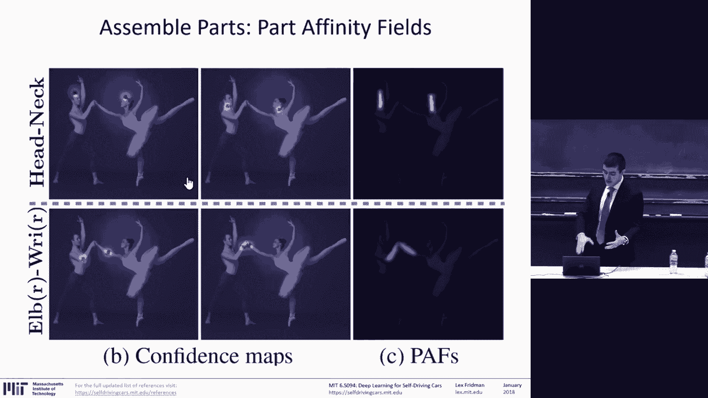

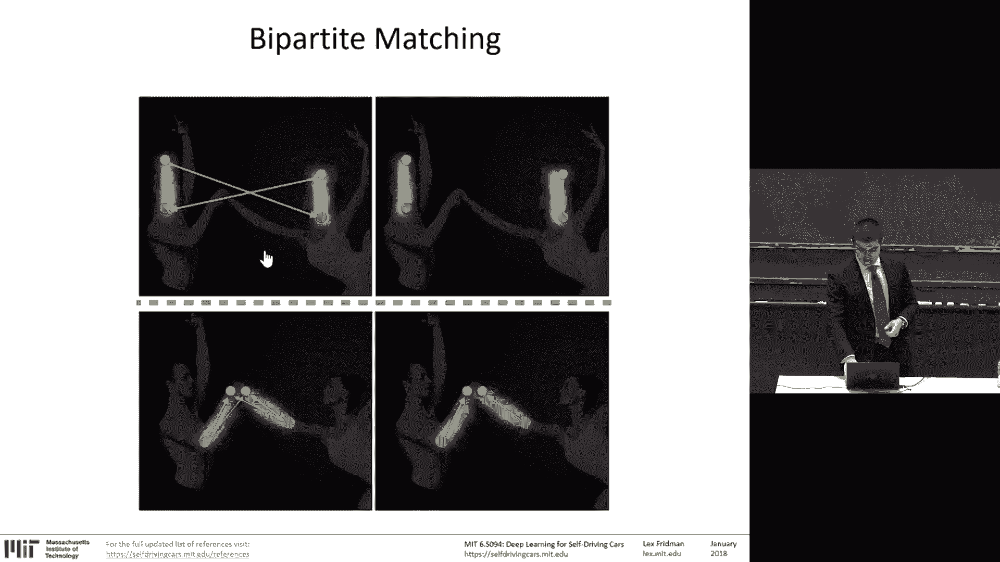

---

## 人体姿态估计 🕺

上一节我们介绍了如何检测行人，本节中我们来看一个更精细的任务：人体姿态估计。这不仅仅是检测人体，还要定位身体的关键关节点，如手、肘、肩、髋、膝、脚等。

在驾驶场景中，人体姿态估计非常重要，例如：
*   确定驾驶员是否偏离了标准的安全坐姿。
*   检测手是否在方向盘上。
*   识别驾驶员是否在使用手机等。

**传统方法**：通常是顺序式的，例如先检测头部，再检测肩膀，依此类推。
**现代方法（如OpenPose）**：采用整体回归的方法：
1.  **部件检测**：使用卷积神经网络直接从整张图像中检测出所有人体关节点（如所有左肘、所有右手）。
2.  **部件关联**：通过**部件亲和场**将这些检测到的关节点连接起来，形成完整的人体骨架。
3.  **多人区分**：通过二分图匹配，将关节点分配给不同的个体。

应用这种技术，我们可以分析驾驶员在长时间自动驾驶中的坐姿变化（如逐渐瘫坐），也可以从车外视角分析行人的姿态和视线，以理解他们与车辆的非语言交流（如过马路前是否看向来车）。

---

## 视线分类 👀

在驾驶场景中，最重要的感知任务之一是确定驾驶员正在看哪里。我们这里讨论的是**视线分类**，而不是精确的几何视线估计。

**视线分类**：将驾驶员的视线区域分类为几个预定义的类别，例如：“道路”、“非道路”，或更细分为“左”、“右”、“中控台”、“仪表盘”、“后视镜”等。

**为什么采用分类而不是几何估计？**
1.  **可学习性**：分类问题可以直接从标注数据中学习，更适合机器学习方法。
2.  **数据可行性**：在真实世界数据中，我们无法获得驾驶员精确的3D视线方向作为真值，但可以让人工标注员判断驾驶员在看哪个区域。

**处理流程**：
1.  输入驾驶员面部的原始视频流。
2.  进行面部检测、对齐和稳定化处理。
3.  将处理后的面部图像区域输入卷积神经网络。
4.  网络输出视线区域的分类结果。

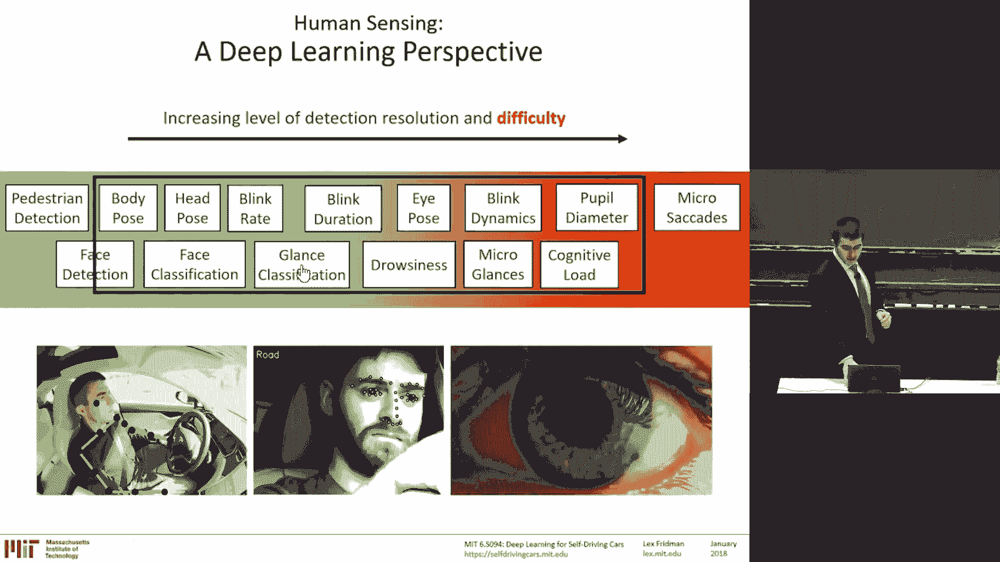

**标注策略**：面对数十亿帧的数据，全人工标注成本极高。我们采用人机协作的主动学习策略：让神经网络对大部分数据进行自动标注，只将那些网络置信度低的、困难的帧（如光照剧烈变化、部分遮挡）提交给人工标注员进行标注，然后用新标注的数据重新训练网络，迭代进行。

通过这种方式，我们可以实现实时的驾驶员视线分类，让汽车知道驾驶员是否在关注道路，这是提升安全性的关键信息。

---

## 情绪识别 😊

人类情绪是一个复杂的领域。在驾驶上下文中进行情绪识别，有两种思路：

1.  **通用情绪识别**：识别基本情绪类别，如喜悦、愤怒、厌恶、惊讶等。这通常依赖于检测面部动作单元（如微笑、皱眉）并将其映射到情绪。
2.  **应用特定情绪识别**：针对特定交互场景（如使用语音导航系统）定义情绪类别（如“挫败感”）。我们发现，在导航任务中，感到挫败的驾驶员反而经常出现“微笑”表情，这与通用情绪识别中的“喜悦”信号相反。

**核心观点**：对于应用特定任务，**数据决定了任务的定义**。我们通过让驾驶员自我报告在特定任务后的挫败感等级，来构建“挫败/非挫败”分类的训练数据。算法（如深度神经网络）的任务是学习从面部原始像素到这种特定标签的映射。

---

## 认知负荷估计 🧠

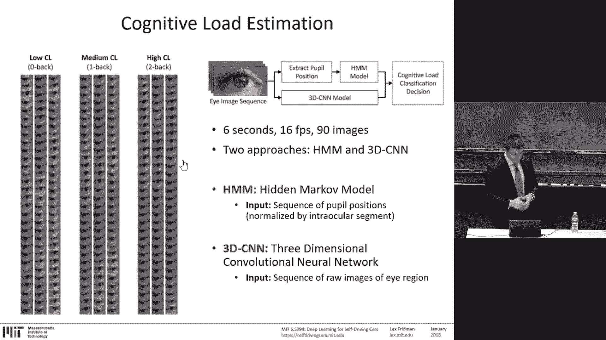

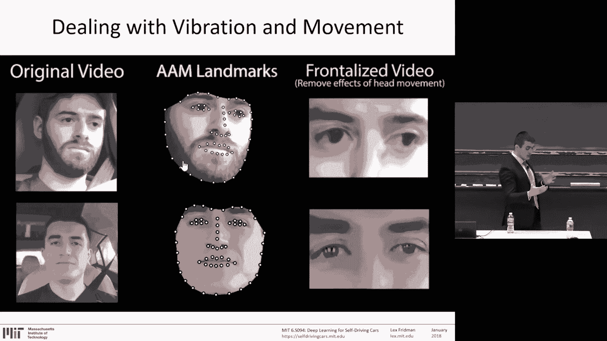

现在我们将注意力转向更细微的特征：眼睛。眼睛是认知的窗口。认知负荷是指一个人进行脑力活动的强度。

**传统测量方法（在实验室中）**：
*   **瞳孔直径**：认知负荷增加时，瞳孔会扩张。
*   **眨眼动力学**：眨眼频率、持续时间等会变化。
*   **眼动模式**：包括扫视和平滑追踪。

**现实世界的挑战**：在自然驾驶环境中，光照变化使得依靠瞳孔直径的方法失效。因此，我们主要依靠眨眼动力学和眼动模式。

**我们的方法**：
1.  **数据收集**：让驾驶员在高速公路上执行“N-back”记忆任务（0-back， 1-back， 2-back），任务难度逐级增加，认知负荷也随之增加。
2.  **数据处理**：通过面部对齐和正面化技术，提取靠近摄像机的眼睛区域图像序列（例如6秒，90帧）。
3.  **模型**：使用**3D卷积神经网络**处理这个图像序列。与2D CNN处理单张图片不同，3D CNN的卷积核在空间（X， Y）和时间（T）维度上同时操作，能够捕捉动态特征。
4.  **任务**：输入眼睛区域图像序列，输出分类结果（0-back， 1-back， 2-back）。

研究发现，认知负荷高时，眼球的运动范围会减小，视线更加集中。训练好的模型可以实时估计驾驶员的认知负荷水平，并推广到新的对话等自然场景中。

---

## 总结与展望 🚗

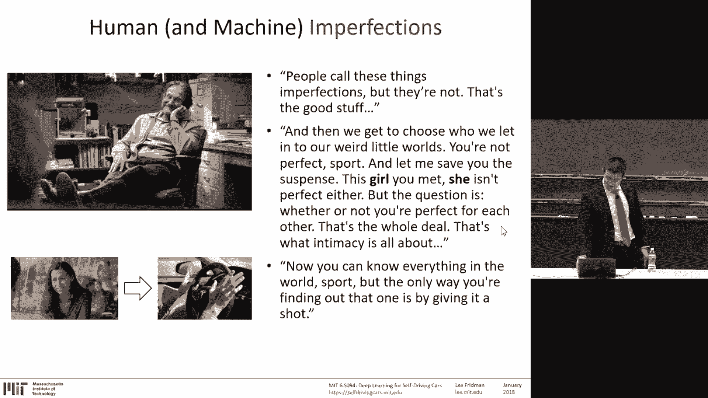

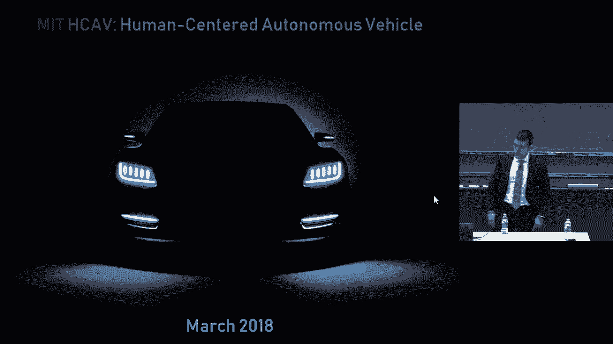

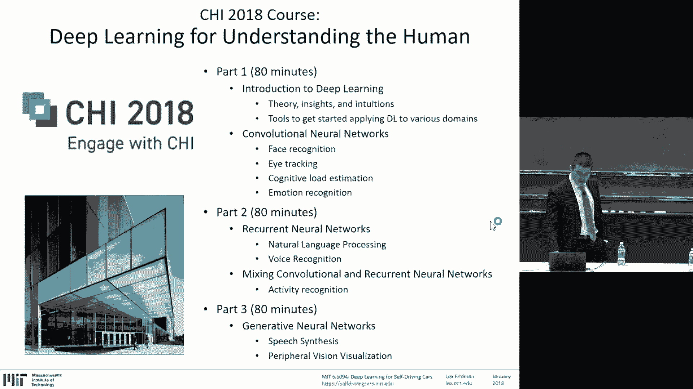

本节课中，我们一起学习了如何应用深度学习进行类人环境感知。我们探讨了从行人检测、人体姿态估计，到视线分类、情绪识别和认知负荷估计等一系列任务。

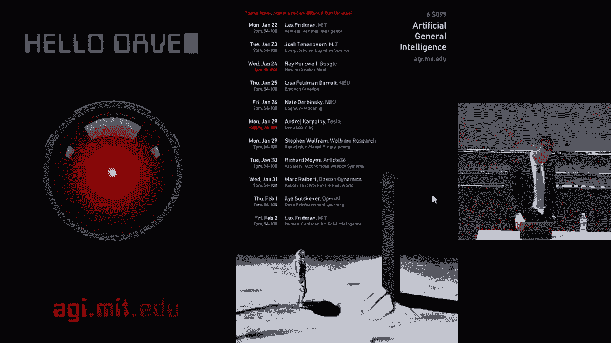

**核心贯穿思想**：在所有这些任务中，**高质量、大规模、精心标注的真实世界数据是成功的关键**，其重要性往往超过算法本身的改进。

**未来方向**：完全自动驾驶尚需时日，在通往大规模自动化的道路上，“以人为中心”的自动驾驶路径更为现实。这意味着我们需要开发能够与人类驾驶员有效协作、理解人类状态（如注意力、情绪、认知负荷）的AI系统。像特斯拉这样的L2级系统正在收集海量的真实交互数据，这些数据将是训练更智能、更安全的自动驾驶算法的基础。

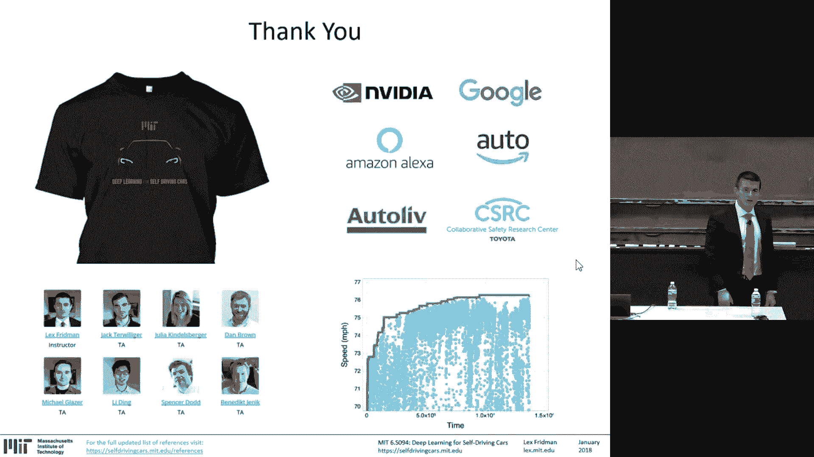

最终，当人类将生命安全托付给AI系统时，这更像是一种人与个人机器人之间的信任关系。教会汽车理解人类的“不完美”，并与之协作，是人工智能在社会中扮演美丽而基础角色的体现。