# 8：L8 - 循环神经网络与时序驾驶操纵 🚗🧠

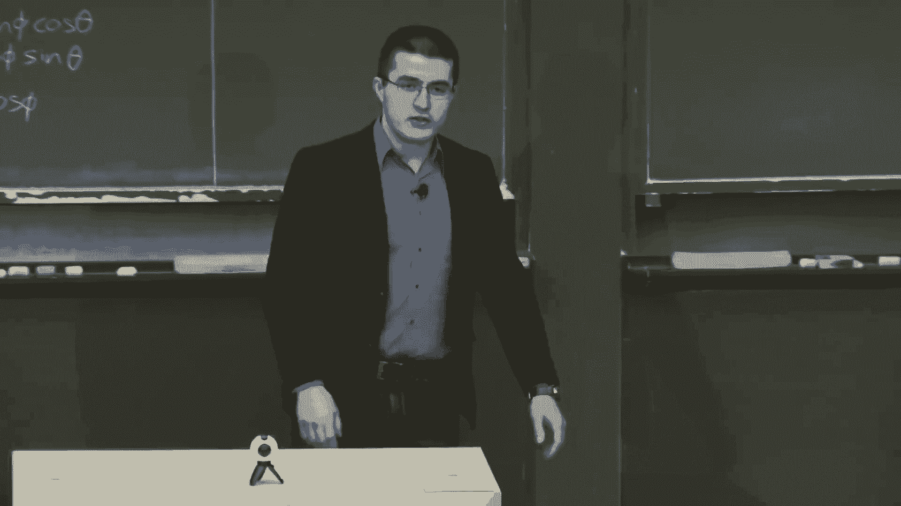

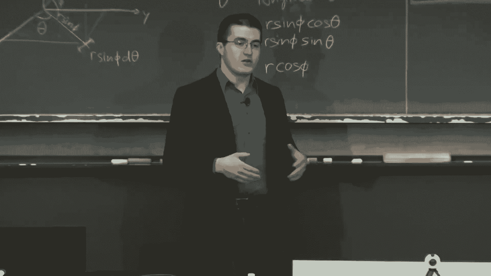

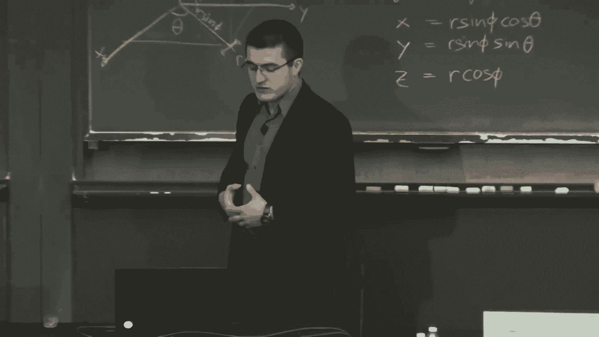

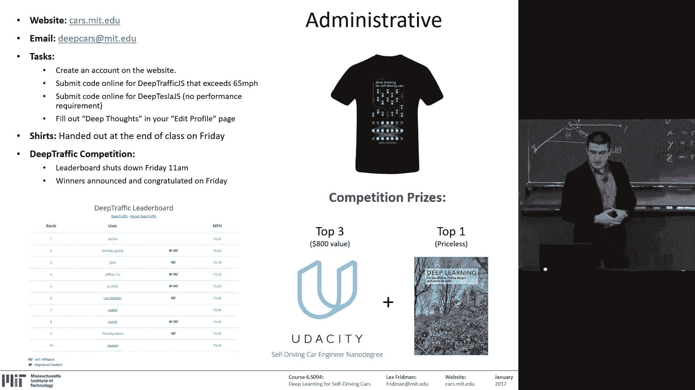

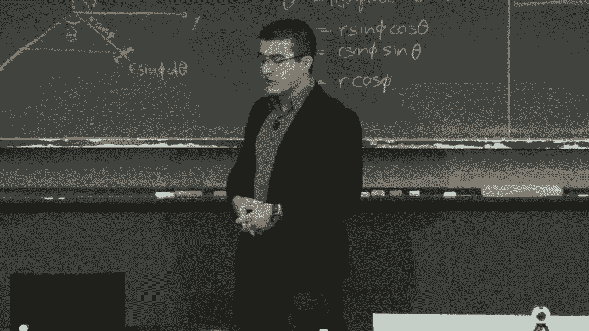

在本节课中，我们将要学习循环神经网络（RNN），这是一种特别适合处理序列数据（如语音、文本、视频）的神经网络。我们将从回顾基础神经网络开始，深入理解其核心训练机制——反向传播，然后重点探讨RNN及其变体LSTM的工作原理，并了解它们在自动驾驶等时序任务中的应用。

---

## 神经网络回顾与反向传播 🔄

上一节我们介绍了卷积神经网络和强化学习。本节中，我们来看看最基础的神经网络训练原理。

一个常规的神经网络，无论是全连接网络还是卷积网络，都在计算一个从固定大小输入到固定大小输出的映射函数。例如，将图像映射到图像中的物体类别。

神经网络的训练依赖于**反向传播**算法。其核心思想是：网络接收输入，通过一系列可微分的计算节点（神经元）产生输出。我们将网络输出与期望的**真实值**进行比较，计算误差，然后将这个误差反向传播回去，根据误差调整网络中的权重参数。

让我们通过一个简单电路来理解这个过程。

### 反向传播示例：一个简单电路

考虑一个函数 **`f(x, y, z) = (x + y) * z`**。我们可以将其视为一个由加法门和乘法门组成的计算电路。

**前向传播**（计算输出）：
*   设输入为：`x = -2`, `y = 5`, `z = -4`
*   加法门：`q = x + y = -2 + 5 = 3`
*   乘法门：`f = q * z = 3 * (-4) = -12`

我们的目标是让输出 `f` 增大（例如，从-12变得更大）。为此，我们需要计算每个输入变量（`x`, `y`, `z`）对最终输出 `f` 的**梯度**（即偏导数），以指导我们如何调整它们。

**反向传播**（计算梯度）：
我们从输出开始，设定初始梯度为 **`∂f/∂f = 1`**，表示我们希望 `f` 增加。
*   **乘法门梯度规则**：对于 `f = q * z`，其局部梯度为：
    *   `∂f/∂q = z = -4`
    *   `∂f/∂z = q = 3`
*   **加法门梯度规则**：对于 `q = x + y`，其局部梯度为：
    *   `∂q/∂x = 1`
    *   `∂q/∂y = 1`

利用**链式法则**，我们可以计算最终梯度：
*   `∂f/∂x = (∂f/∂q) * (∂q/∂x) = (-4) * 1 = -4`
*   `∂f/∂y = (∂f/∂q) * (∂q/∂y) = (-4) * 1 = -4`
*   `∂f/∂z = 3` （已由乘法门直接得出）

**梯度解读**：
*   `∂f/∂x = -4` 意味着，如果我们将 `x` **增加**一点点，输出 `f` 会**减少**约4倍。为了让 `f` 增加，我们应该**减小** `x`。
*   同理，我们应该**减小** `y`。
*   `∂f/∂z = 3` 意味着，增加 `z` 会使 `f` 增加，所以我们应该**增加** `z`。

这个过程展示了反向传播的本质：通过计算局部梯度并利用链式法则，将最终的误差信号分配回网络的各个参数。

### 神经网络中的权重更新

在真实神经网络中，输入数据是固定的，我们调整的是网络的**权重（Weights）**和**偏置（Biases）**。我们定义一个**损失函数（Loss Function）**来衡量网络输出与真实值的差距。

以下是训练神经网络的核心步骤：
1.  **前向传播**：计算网络每一层的输出，直至得到最终输出。
2.  **计算损失**：比较网络输出与真实值，计算损失值。
3.  **反向传播**：将损失值作为初始梯度，反向传播通过整个网络，计算损失相对于每一个权重和偏置的梯度。
4.  **参数更新**：沿着梯度的**反方向**（因为要最小化损失）调整权重和偏置。调整的步长由**学习率（Learning Rate）**控制。

这个过程本质上是一个**优化问题**：我们试图在一个由权重和偏置构成的高维、非线性空间中，找到使损失函数最小化的点。常用的优化算法是**随机梯度下降（SGD）**及其变体（如Adam）。

### 训练中的挑战：梯度消失与爆炸

在训练深层网络时，会遇到两个主要问题：
*   **梯度消失**：当梯度值过小（例如，经过Sigmoid激活函数的饱和区时，梯度接近0），反向传播到较早层时，梯度会变得极其微小，导致这些层的权重几乎得不到更新，学习停滞。
*   **梯度爆炸**：当梯度值过大时，权重更新会变得非常剧烈，导致网络不稳定，无法收敛。

解决这些问题是设计有效神经网络架构的关键。

---

## 循环神经网络（RNN）介绍 🔁

上一节我们介绍了反向传播的原理。本节中，我们来看看专门为序列数据设计的神经网络——循环神经网络。

与处理固定大小输入输出的“普通”神经网络不同，RNN能够处理**可变长度**的序列输入和输出。其核心特点是网络中存在**循环连接**，使得网络能够保留一种“记忆”，用以处理序列中前后信息的关系。

RNN的基本结构单元如下图所示：
*   **`x_t`**：在时间步 `t` 的输入。
*   **`s_t`**：在时间步 `t` 的隐藏状态，即网络的“记忆”。
*   **`o_t`**：在时间步 `t` 的输出。
*   **`U`, `V`, `W`**：权重矩阵。关键点在于，**`W`** 在时间步之间是**共享**的。

通过将RNN按时间步“展开”，我们可以将其视为一个很深的前馈网络，从而使用反向传播进行训练，这种方法称为**随时间反向传播（BPTT）**。

RNN可以处理多种输入输出模式：
*   **一对一**：标准神经网络模式。
*   **一对多**：例如，输入一张图片，生成一段描述文字（图像标注）。
*   **多对一**：例如，输入一段影评文字，输出情感分类（正面/负面）。
*   **多对多（同步）**：例如，输入视频每一帧，输出每一帧的标签（视频分类）。
*   **多对多（异步）**：例如，机器翻译，输入一种语言的序列，输出另一种语言的序列。

### RNN的局限与长短期记忆网络（LSTM）

尽管RNN在理论上可以学习长期依赖，但由于梯度消失问题，它在实践中难以记住很久以前的信息。

**长短期记忆网络（LSTM）** 是RNN的一个成功变体，它通过引入精巧的“门”机制来解决长期依赖问题。每个LSTM单元内部包含：
1.  **遗忘门**：决定从细胞状态中丢弃哪些信息。
2.  **输入门**：决定将哪些新信息存入细胞状态。
3.  **输出门**：基于细胞状态，决定输出什么。

这个“细胞状态”像一个传送带，贯穿整个链条，只有一些轻微的线性交互，使得信息可以很容易地保持不变地流过，从而有效地保留了长期记忆。

---

## RNN/LSTM的应用实例 🌟

理解了LSTM的原理后，我们来看看它在各个领域的强大应用。

以下是LSTM的一些令人印象深刻的应用：
*   **机器翻译**：将一种语言的序列转换为另一种语言。
*   **文本生成**：学习文本的统计规律，逐字符或逐词生成新的文章、代码甚至诗歌。
*   **语音识别与生成**：将音频序列转换为文字，或根据文本生成语音。
*   **视频理解**：输入视频帧序列，生成对视频内容的文字描述。
*   **视觉问答（VQA）**：结合图像和自然语言问题，生成答案。
*   **医疗诊断**：分析患者随时间变化的电子健康记录序列，预测疾病风险。
*   **金融市场预测**：分析时序金融数据或新闻文本序列，预测市场走势。

---

## RNN在自动驾驶中的应用 🚘

现在，让我们聚焦到本课程的核心——驾驶。我们将探讨RNN如何应用于自动驾驶的操纵控制。

在之前的课程中，我们介绍了NVIDIA的端到端驾驶方法（也是Deep Tesla JS的基础），它使用一个卷积神经网络，将**单张**图像直接映射为方向盘转角。

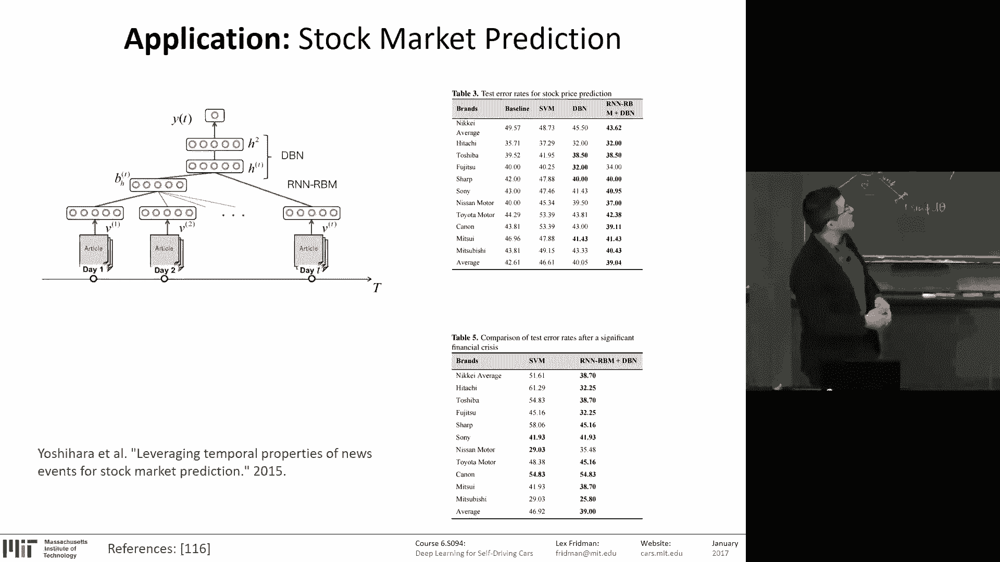

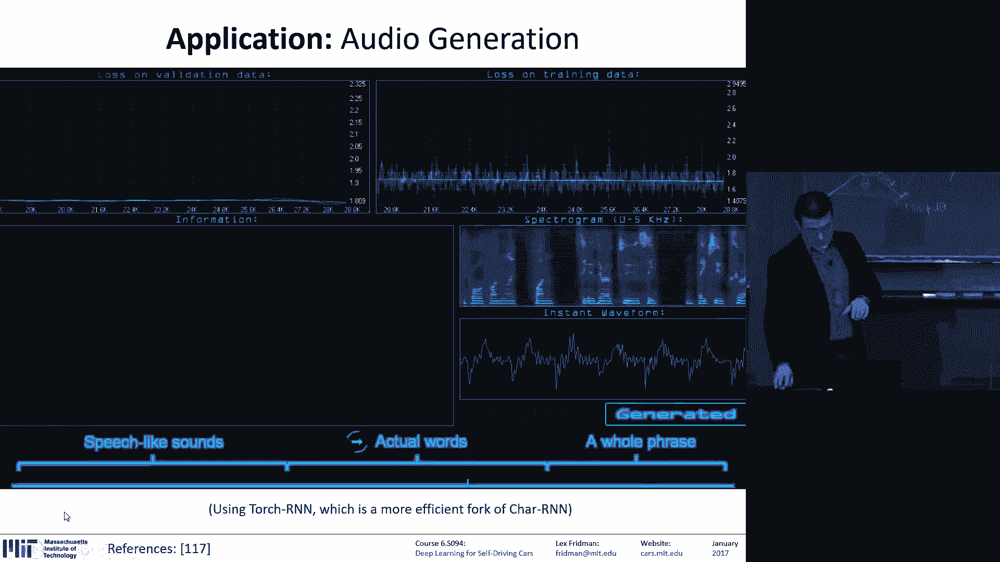

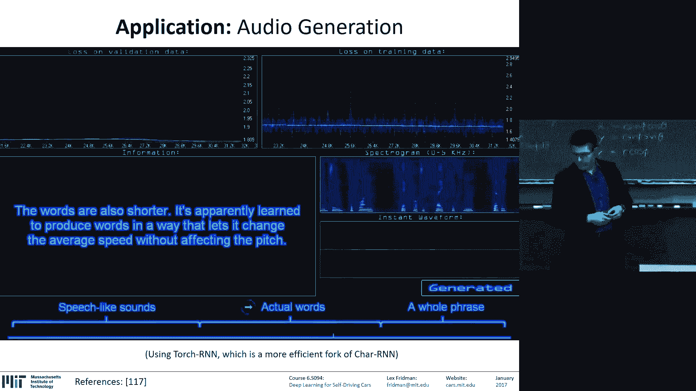

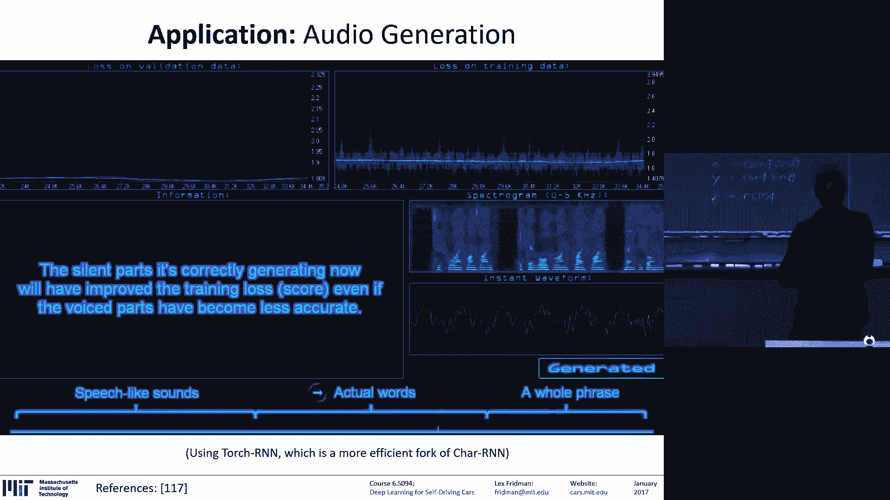

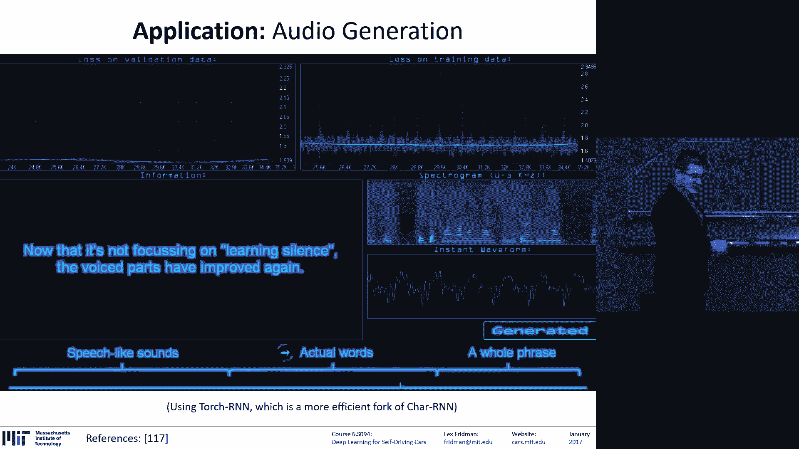

然而，驾驶本质上是一个**时序决策过程**。车辆的状态（速度、位置）、驾驶者的意图以及环境的变化都具有连续性。因此，处理**图像序列**比处理单张图像更符合逻辑。

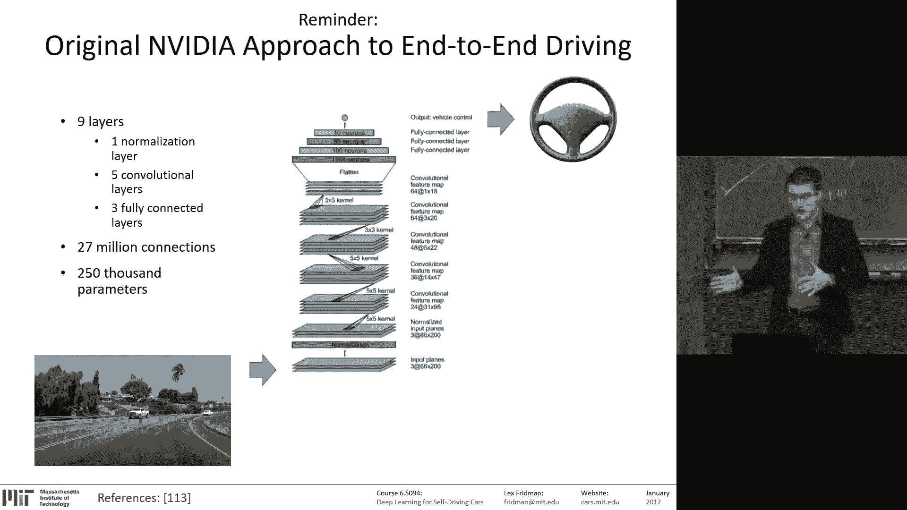

在类似Udacity的自动驾驶挑战赛中，优胜方案普遍采用了RNN/LSTM。其常见架构如下：
1.  **特征提取**：使用一个预训练好的CNN（如VGGNet, ResNet）处理每一帧图像，将其转换为一个高级特征向量。这利用了**迁移学习**的思想。
2.  **序列建模**：将连续多个时间步（例如10帧或50帧）的特征向量按顺序输入到LSTM中。
3.  **输出预测**：LSTM在每个时间步输出预测值，不仅包括方向盘转角，还可以包括车辆速度、扭矩等。

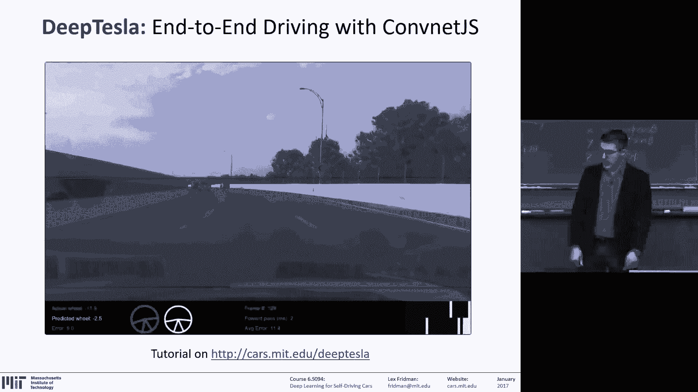

这种方法允许模型学习驾驶的动态特性，例如转弯时方向盘的连续变化，或者对前方突然出现的障碍物做出更平滑、更拟人的反应。

### 模型调优：一门艺术

构建一个成功的RNN驾驶模型，其挑战主要在于**超参数调优**：
*   网络结构（LSTM层数、每层神经元数量）
*   序列长度
*   学习率与优化器选择
*   防止过拟合的策略（如Dropout）

这个过程需要大量的实验和经验，因此常被戏称为“随机研究生下降”算法——不断尝试直到找到有效的配置。

---

## 总结 📚

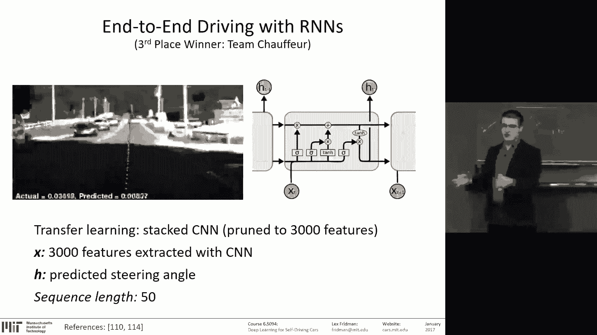

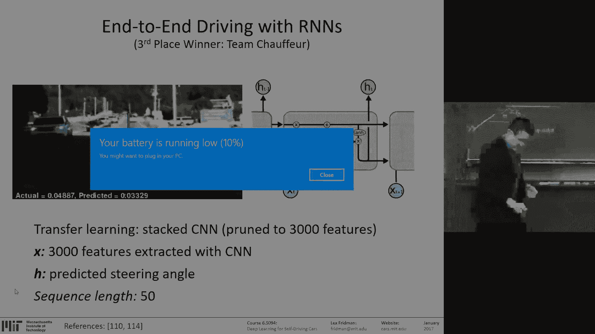

本节课中我们一起学习了：
1.  **反向传播**是神经网络训练的核心算法，它通过计算梯度并利用链式法则来更新网络参数。
2.  **循环神经网络（RNN）** 通过引入循环连接，具备了处理序列数据的能力。
3.  **长短期记忆网络（LSTM）** 通过门控机制有效解决了RNN的长期依赖问题，成为处理时序任务的主流选择。
4.  **RNN/LSTM** 在机器翻译、语音处理、视频分析等领域有广泛应用。
5.  在**自动驾驶**中，使用CNN提取单帧特征，再输入LSTM处理序列，能够更好地建模驾驶的时序动态，实现更智能的操纵控制。

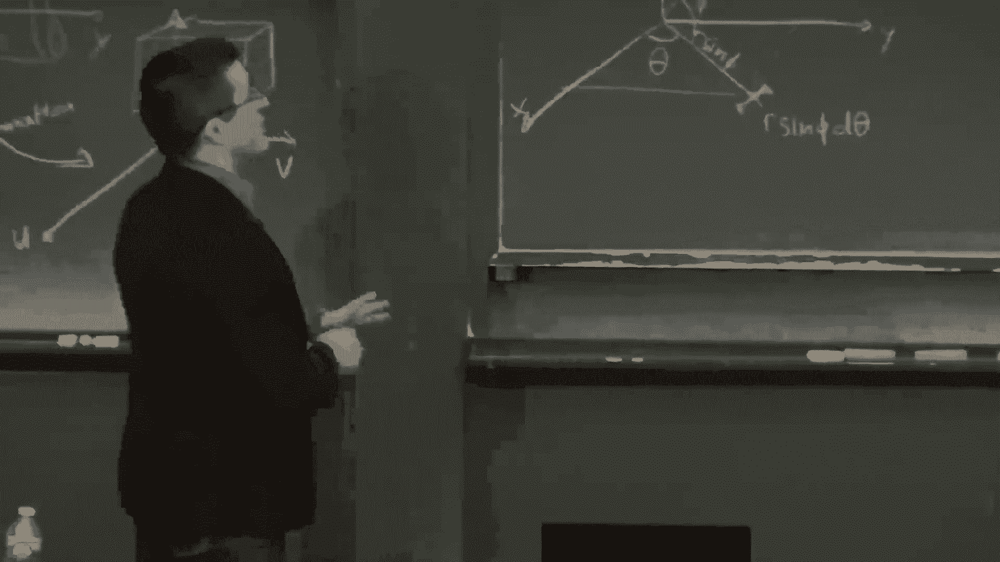

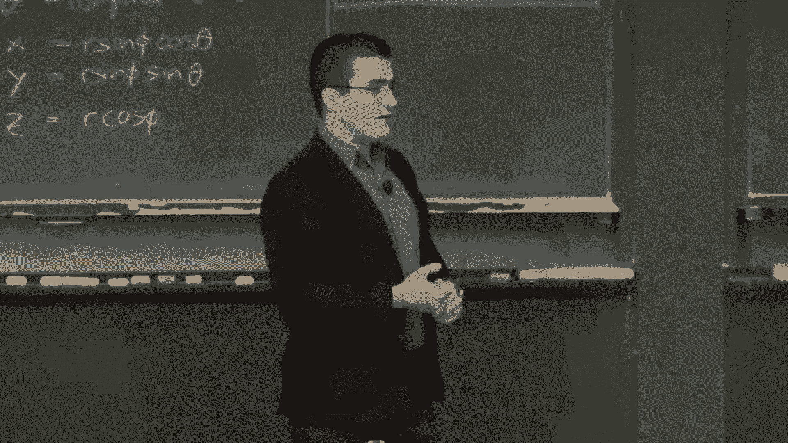

理解这些原理，将帮助你更好地完成Deep Traffic和Deep Tesla等实践项目，并为你探索更复杂的时序人工智能应用打下坚实基础。