# 9：L9 - 以人为中心的半自主驾驶深度学习 👁️🚗

在本节课中，我们将要学习深度学习在“以人为中心”的半自主驾驶领域的应用。我们将探讨如何利用车内摄像头感知驾驶员的状态，包括身体姿态、视线方向、情绪和认知负荷等，并理解这些信息对于构建人机信任和提升驾驶安全的重要性。

---

## 概述：为何关注车内的人？🤔

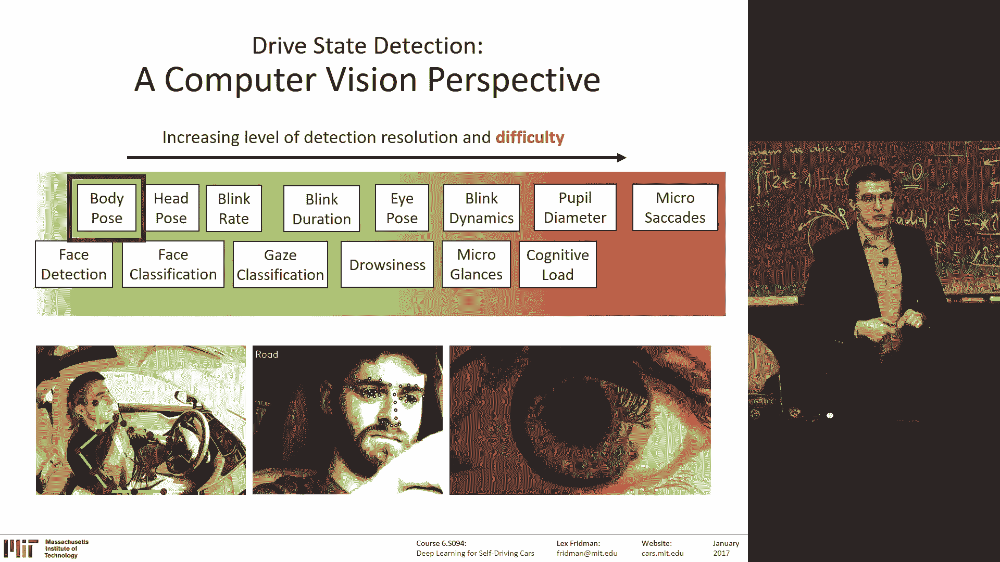

此前我们讨论了感知外部环境，例如检测行人、车道并据此控制车辆。一个引人入胜但研究尚浅的领域是“人的一侧”。以特斯拉为例，其车辆配备了摄像头，使我们能够在真实道路环境中研究人与机器的交互。

目前，深度学习在半自主和全自主驾驶领域所缺乏的，正是驾驶员行为的视频数据。这正是我们工作的核心：收集并分析驾驶员在高速公路上驾驶半自主特斯拉时产生的数十亿视频帧。

我们想了解驾驶员的哪些信息？如果我们是一个深度学习“治疗师”，试图从原始像素中分解出可检测的不同信息，可以从绿色（较简单）到红色（极具挑战性）来划分不同的计算机视觉检测问题。

---

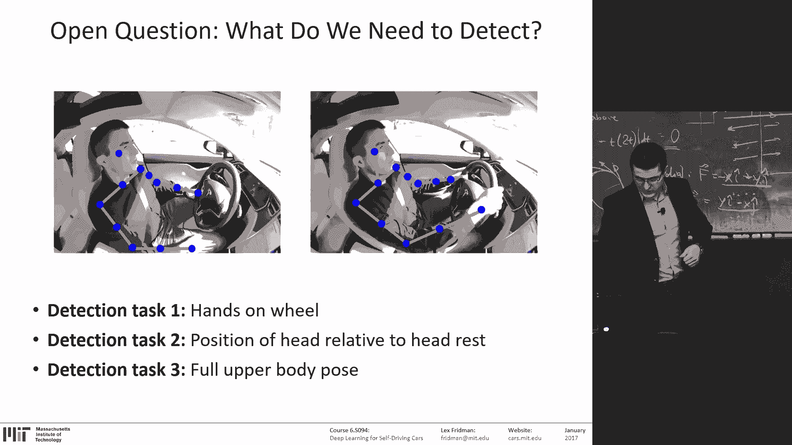

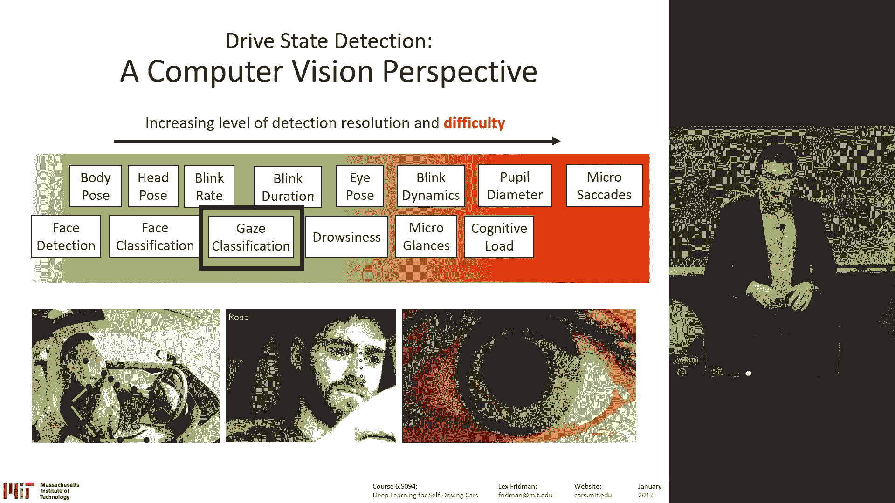

## 身体姿态检测 🧍

上一节我们介绍了关注驾驶员的重要性，本节中我们来看看如何检测驾驶员的身体姿态。

我们关心身体姿态的原因包括安全带设计和碰撞测试假人设计。这些安全系统假设了乘员的标准坐姿。然而在现实中，当车辆自动驾驶时，驾驶员的姿态变化很大，他们可能会转身去后座拿包或手机。车辆需要知道驾驶员是否处于非标准姿态，这在发生碰撞的关键时刻至关重要。

以下是实现身体姿态检测的典型深度学习流程：

1.  使用一个卷积神经网络作为回归器，输入图像，输出身体关键点（如肩膀、头部）的X、Y坐标。
2.  使用级联回归器来预测所有关节点，从而构建出完整的身体骨架。
3.  在视频的每一帧上进行预测。
4.  利用时间连续性（物理约束）对帧间误差进行优化，或使用3D卷积神经网络将时间序列作为额外通道一并处理。

目前已有一些用于体育动作的数据集，我们也在构建自己的驾驶员姿态数据集。

---

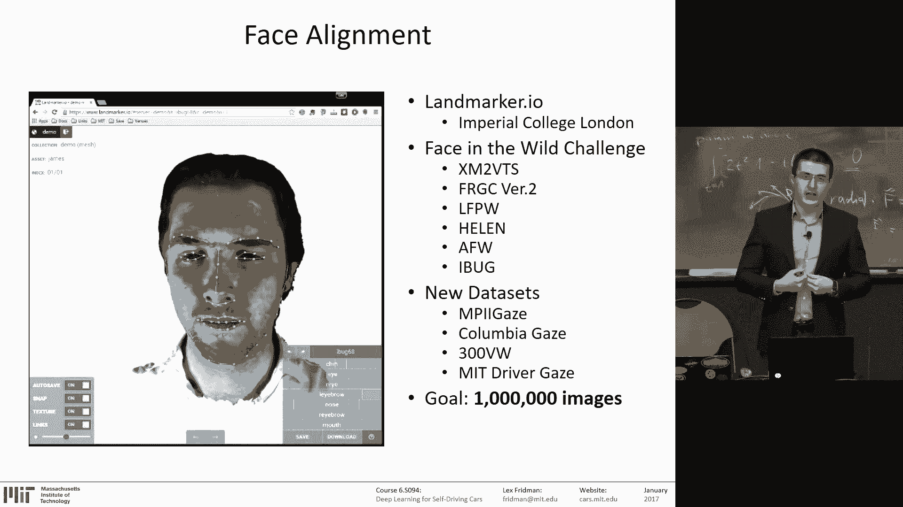

## 视线分类与驾驶员状态识别 👀

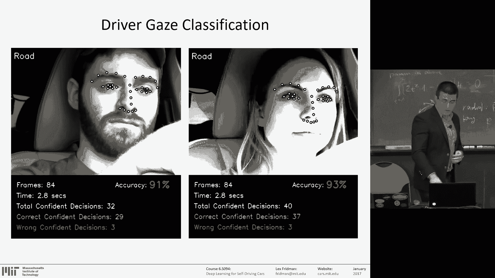

在了解了身体姿态后，我们进一步探讨驾驶员的面部信息，其中视线方向是一个关键的分类问题。

以下是视线分类任务的步骤：

1.  这是一个多分类问题。例如，我们将驾驶员的视线方向分为六类：前方道路、左方、右方、中控台、仪表盘、后视镜。
2.  将原始像素输入卷积神经网络。
3.  为每个类别提供数百万帧的图像进行训练。

这个过程对于大多数与面部相关的驾驶员状态识别问题（如情绪、困倦）是通用的。处理流程如下：

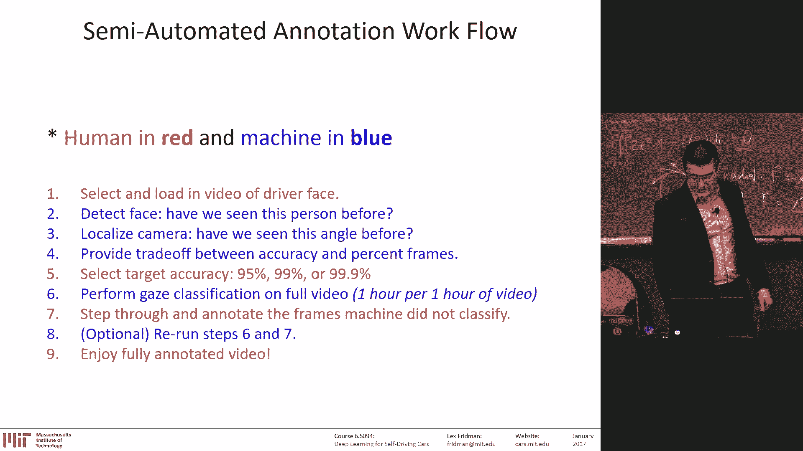

1.  **预处理**：对真实世界数据进行视频稳定化，消除车辆振动和光线突变的影响。
2.  **自动校准**：估计相机位置和驾驶员身份。针对特定个体进行网络个性化（迁移学习）能提升性能。
3.  **面部正面化**：无论头部如何转动，都将面部特征（如眼睛、鼻子）对齐到图像的相同位置，便于分析细微动作。
4.  **特征输入**：将处理后的面部区域原始像素输入网络。
5.  **分类**：使用SVM或卷积神经网络进行状态分类（如情绪、困倦、认知负荷）。

其中，面部特征点检测（对齐）是一个挑战。能够利用面部形状约束的算法（如级联回归器）有时比端到端的回归器表现更好，目前已有大型数据集支持这方面的研究。

---

## 半监督学习与数据标注的未来 🔮

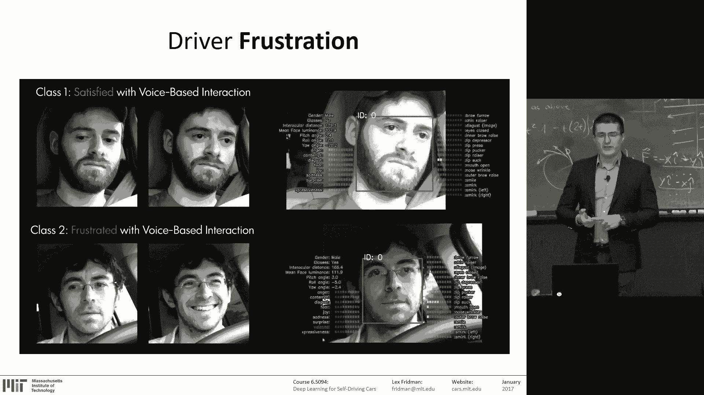

我们正朝着机器学习令人兴奋的方向——半监督与无监督学习——迈进。目标是在极少需要人工标注的情况下，仍能获得高精度。

以下是实现思路：

1.  在驾驶场景中，超过90%的时间驾驶员都以相似姿态注视前方道路，机器可以自动完成这些简单帧的标注。
2.  当发生状态转变（如驾驶员开始看向后视镜）时，系统可能不确定。此时可以利用光流等信息，预测何时发生了变化。
3.  将这些“困难”帧提交给人类进行标注。

通过这种方式，我们可以用极低的人工标注比例（例如0.1%），构建包含数十亿帧的标注数据集，用于训练驾驶员状态算法。这代表了机器学习的未来方向。

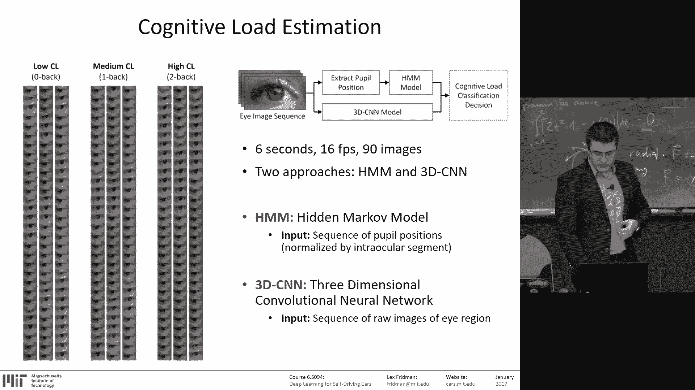

---

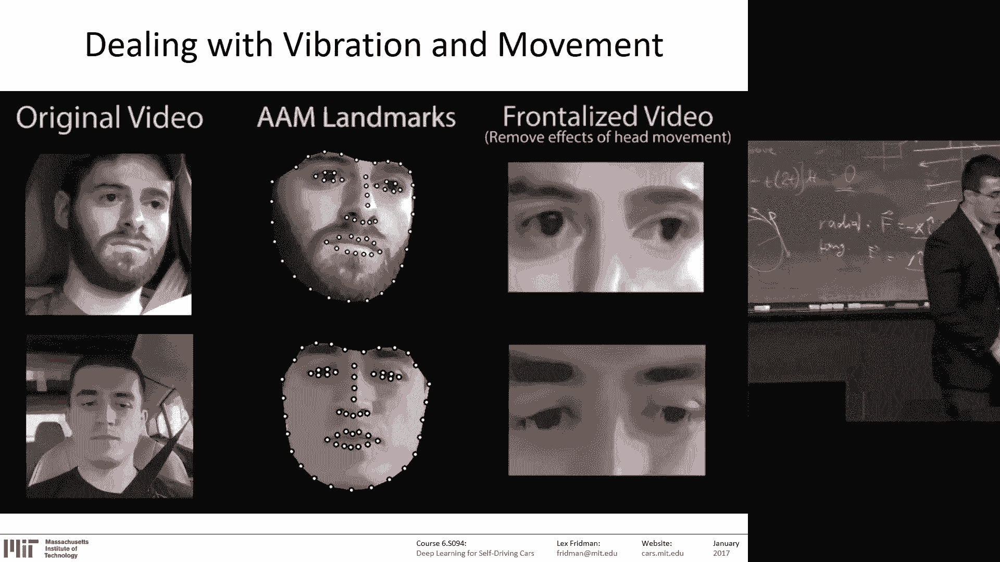

## 具体应用示例：情绪与认知负荷 😠🤯

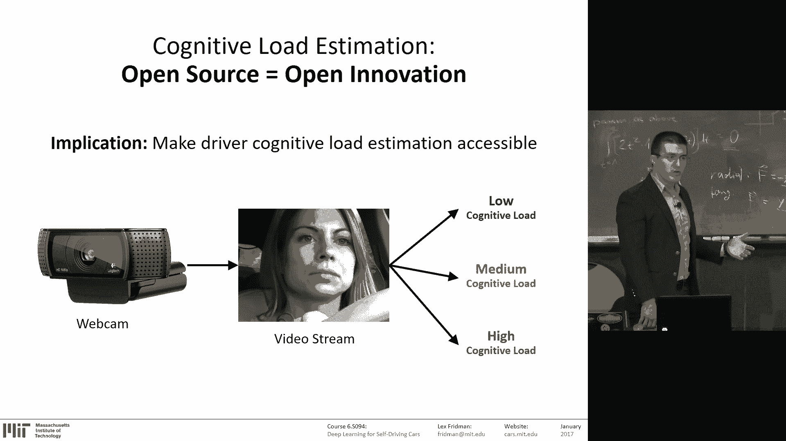

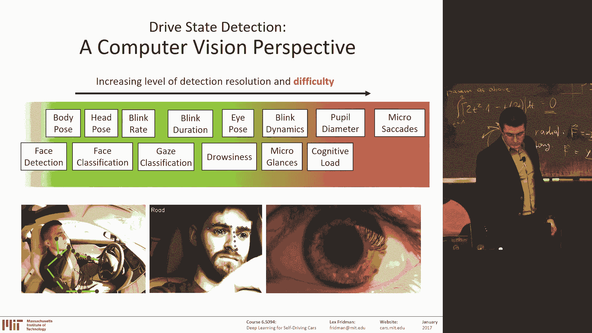

基于上述流程，我们可以进行具体的状态识别。

**情绪识别**：通过让驾驶员使用体验好/差的导航系统，收集其自我报告的情绪分数作为真实标签。然后训练卷积神经网络来预测驾驶员的挫败感。有趣的是，研究发现微笑有时是挫败感的强烈指标。

**认知负荷识别**：认知负荷反映了大脑的忙碌程度，眼睛是观察它的“窗口”。眼睛的运动模式（如扫视、平滑追踪）和瞳孔大小、眨眼频率/时长都与认知负荷相关。

以下是测量认知负荷的步骤：

1.  提取驾驶员眼部区域的视频序列（例如90帧，约6秒）。
2.  进行面部正面化，确保眼睛始终位于图像固定位置。
3.  使用主动外观模型定位眼睑、虹膜、瞳孔上的39个关键点。
4.  将所有信息（图像序列、关键点）输入一个3D卷积神经网络。
5.  网络输出对认知负荷等级（低、中、高）的预测。

这个过程与识别身份、视线和情绪的过程类似，都需要海量数据，但对卷积神经网络的超参数调优要求很少。

---

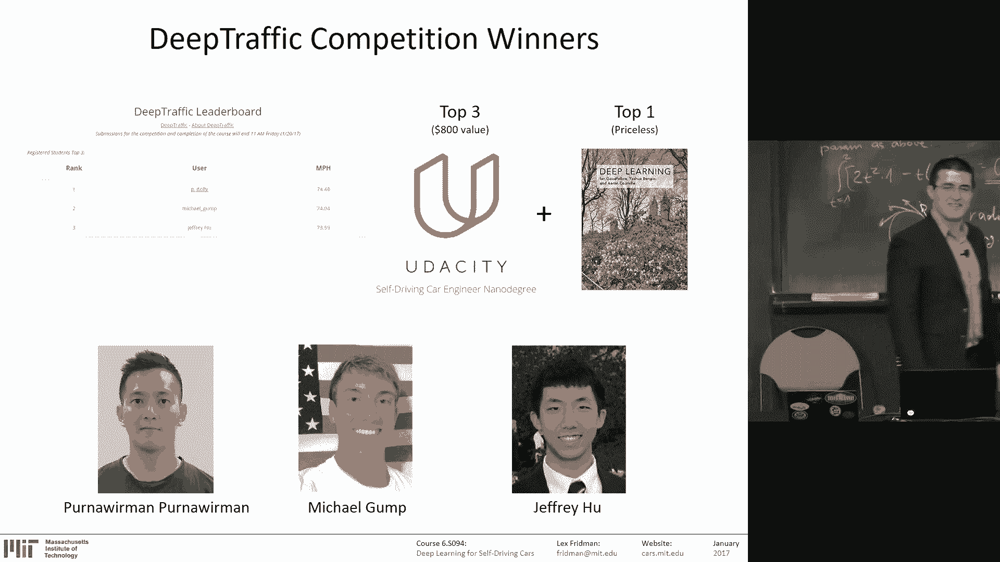

## 总结与展望：构建信任之路 🛣️

本节课中，我们一起学习了如何利用深度学习从车内摄像头感知驾驶员状态，包括身体姿态、视线、情绪和认知负荷。

在通往全自动驾驶的道路上，逐步将控制权移交给机器是一个渐进的过程，也是机器赢得人类信任的过程。在这个过程中，机器需要“看见”驾驶员在做什么。我们拥有数十亿英里的前方道路数据，现在同样需要数十亿英里的驾驶员面部数据。

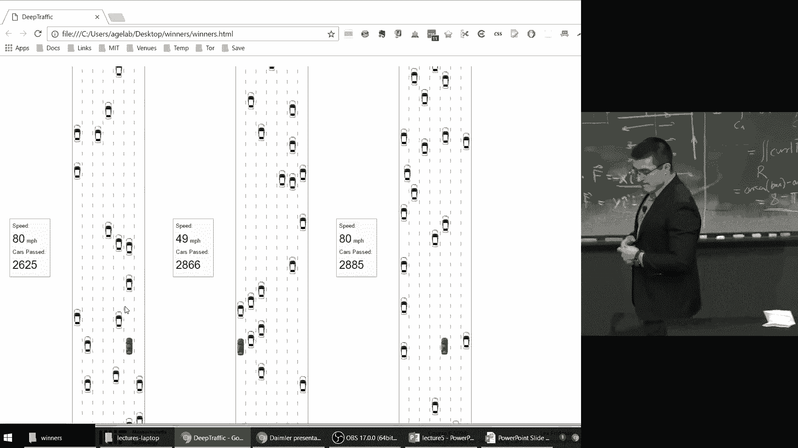

因此，我们倡导汽车制造商在所有车辆中配备驾驶员面向摄像头。尽管存在隐私顾虑，但其带来的安全效益和信任构建价值是巨大的。

深度学习的强大之处在于，简单的计算单元（神经元）组合成网络后，能涌现出令人难以理解的复杂能力。我们仍处于探索其潜力的早期阶段。鼓励大家阅读经典资料、关注最新论文，并参与到将深度学习应用于汽车领域的精彩研究中来。