# 2：扩散模型的多视角解读 🧠

在本节课中，我们将学习理解扩散模型的不同视角。我们将从经典的DDPM论文出发，探讨其背后的数学原理，然后以更宏观、非严格的方式介绍几种理解扩散模型工作方式的思路，包括随机与确定性采样、连续化视角（SDE/ODE）以及流匹配等概念。

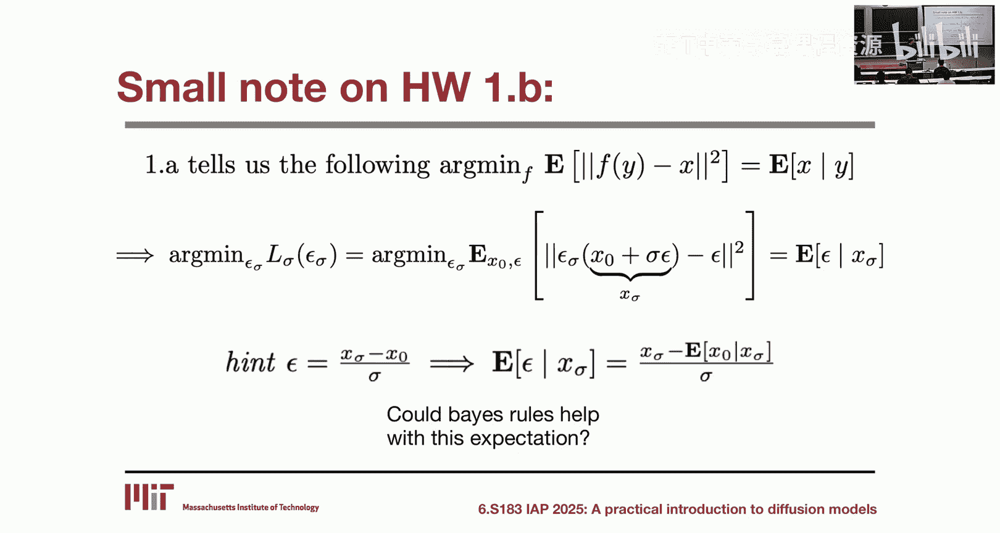

---

## 从DDPM出发：去噪扩散概率模型

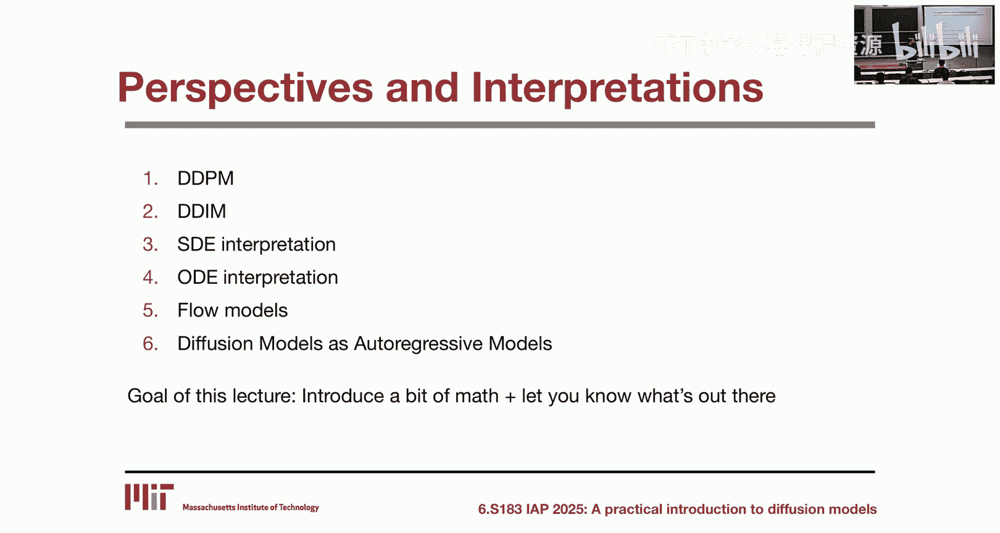

上一节我们简要了解了扩散模型的基本流程。本节中，我们将深入探讨其经典理论框架——去噪扩散概率模型（DDPM），并推导出其核心目标函数。

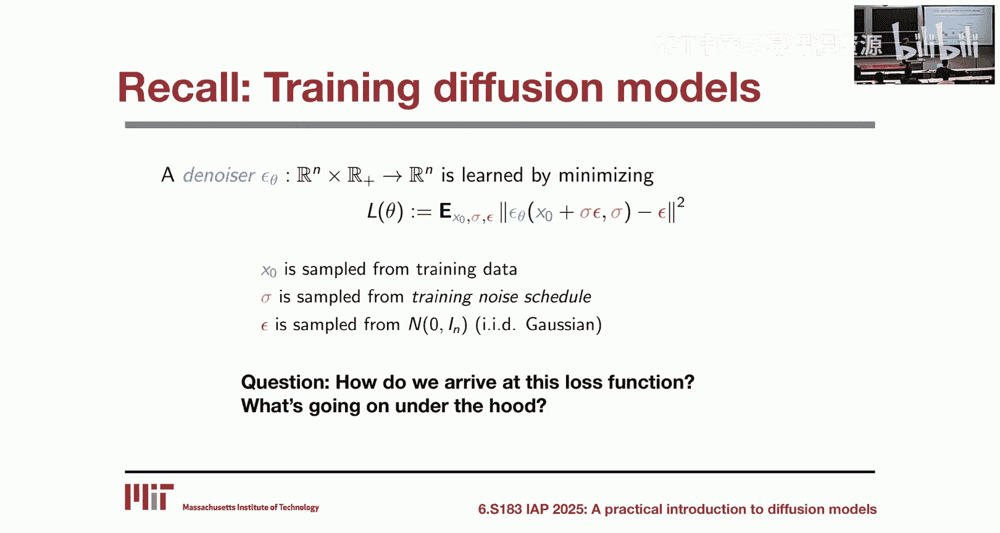

DDPM的核心思想是：**通过多步小量加噪来破坏数据，再学习一个反向过程来逐步去噪，这比试图一步去除所有噪声要容易得多。**

### 前向过程（加噪）

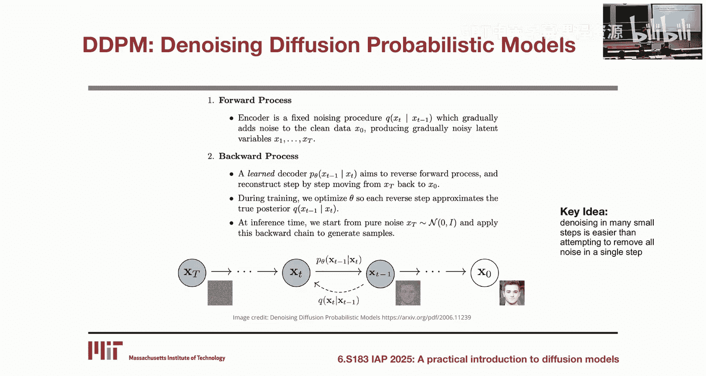

前向过程是一个固定的马尔可夫链，它通过一系列高斯核逐步向干净数据 `x_0` 添加噪声。

*   **定义**：对于固定的噪声调度 `β_t`（`0 < β_t < 1`），前向转移核定义为：
    `q(x_t | x_{t-1}) = N(x_t; √(1-β_t) * x_{t-1}, β_t * I)`
    其中 `I` 是单位矩阵。
*   **性质**：通过递推，我们可以将任意时刻 `t` 的 `x_t` 直接表示为 `x_0` 和一个标准高斯噪声 `ε` 的线性组合：
    `x_t = √(ᾱ_t) * x_0 + √(1 - ᾱ_t) * ε`
    其中 `ᾱ_t = ∏_{s=1}^{t} (1-β_s)`。当 `t` 足够大时，`ᾱ_t` 趋近于0，`x_T` 将近似服从标准高斯分布 `N(0, I)`。

### 反向过程（去噪）

我们的目标是学习一个反向过程 `p_θ(x_{t-1} | x_t)`，它能够从噪声 `x_T ~ N(0, I)` 开始，逐步重建出数据 `x_0`。

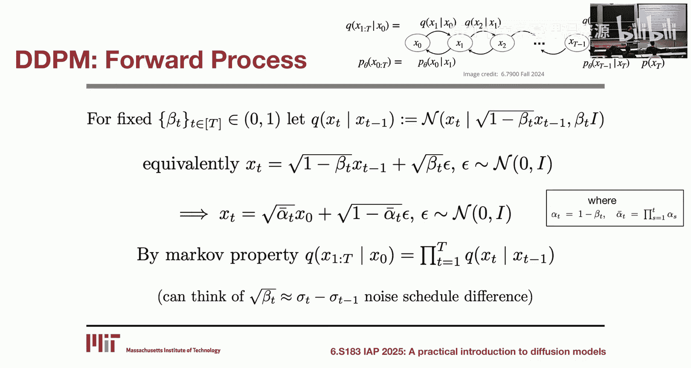

*   **关键洞见**：如果前向转移核是高斯分布且 `β_t` 足够小，那么真实的反向转移核 `q(x_{t-1} | x_t)` 也近似是高斯分布。
*   **学习目标**：因此，我们可以用参数化的高斯分布来近似反向过程：
    `p_θ(x_{t-1} | x_t) = N(x_{t-1}; μ_θ(x_t, t), Σ_θ(x_t, t))`
    其中方差 `Σ_θ` 通常设为固定值。问题的核心变为学习均值函数 `μ_θ`。

### 推导目标函数

通过数学推导（利用重参数化和贝叶斯规则），我们可以将学习 `μ_θ` 的问题转化为一个更简单的问题。

*   **建立联系**：从 `x_t` 与 `x_0`、`ε` 的关系式出发，可以解出 `x_0`：
    `x_0 = (x_t - √(1 - ᾱ_t) * ε) / √(ᾱ_t)`
*   **问题转化**：这意味着，如果我们能预测出从 `x_0` 到 `x_t` 所添加的噪声 `ε`，我们就能恢复出 `x_0`。因此，学习 `μ_θ` 等价于学习一个噪声预测网络 `ε_θ(x_t, t)`。
*   **最终目标**：通过最小化预测噪声与真实噪声之间的差异，我们可以得到DDPM的训练目标：
    `L(θ) = E_{x_0, ε, t}[ || ε - ε_θ(x_t, t) ||^2 ]`
    其中 `x_t` 由 `x_0` 和 `ε` 根据前向过程公式计算得到。

---

## 采样方法：随机与确定性

在上一节我们推导了如何训练噪声预测网络后，本节我们来看看如何使用它来生成样本。主要有两种采样方式。

以下是两种核心采样策略：

1.  **DDPM（随机采样）**：
    在反向过程的每一步，我们按照学习到的分布进行采样：
    `x_{t-1} = μ_θ(x_t, t) + σ_t * z`，其中 `z ~ N(0, I)`
    这种方式会引入随机性，通常能产生更多样化的样本。

2.  **DDIM（确定性采样）**：
    这是一种更通用的形式，通过调整参数可以控制采样过程中的随机性。当完全去除随机噪声项时，就变成了确定性采样：
    `x_{t-1}` 直接由 `μ_θ(x_t, t)` 和一些确定性计算得到。
    确定性采样的随机性仅来自于初始点 `x_T ~ N(0, I)`。它通常更快，但样本多样性可能略有降低。

---

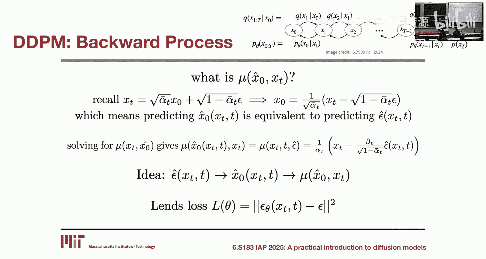

## 连续化视角：随机微分方程与概率流ODE

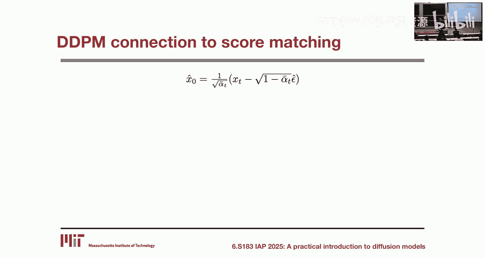

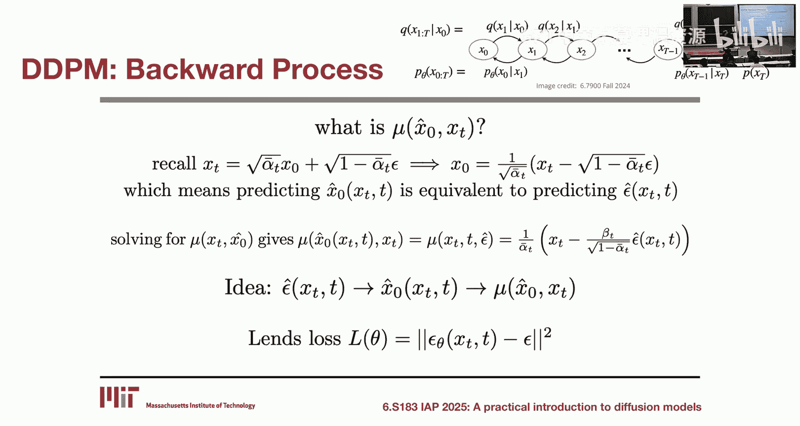

当我们考虑将离散的扩散步数无限增加、步长无限缩小时，就进入了连续视角。这为我们提供了更丰富的数学工具来理解扩散模型。

### 从离散到连续：随机微分方程

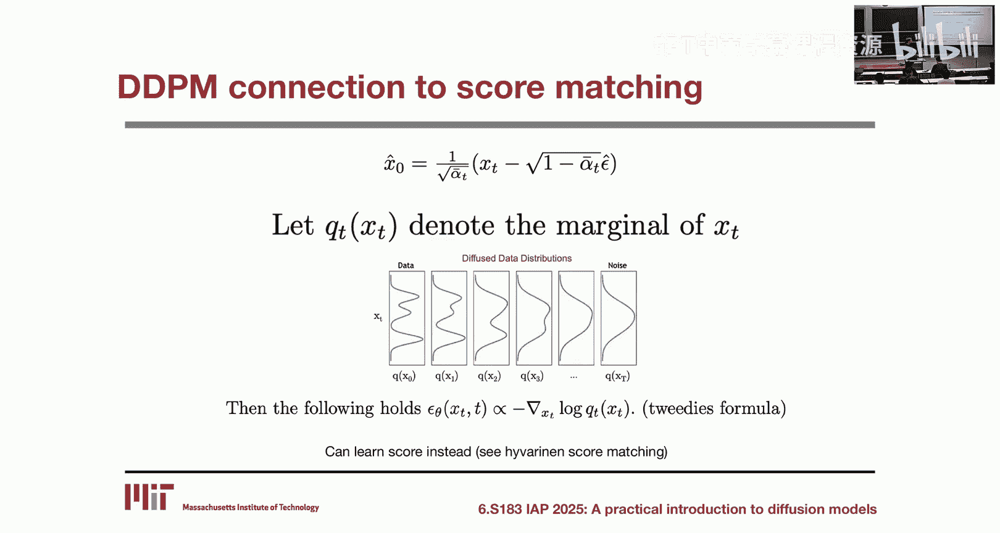

当离散步长 `Δt → 0` 时，前向加噪过程可以描述为一个随机微分方程（SDE）：
`dx = f(x, t)dt + g(t)dw`
其中 `dw` 是布朗运动。一个关键结论是，这个前向SDE的反向过程也是一个SDE，其漂移项（`dt`项）依赖于数据分布的**得分函数**（Score Function），即 `∇_x log p_t(x)`。这表明，学习得分函数足以逆转这个连续的扩散过程。

### 确定性反向过程：概率流ODE

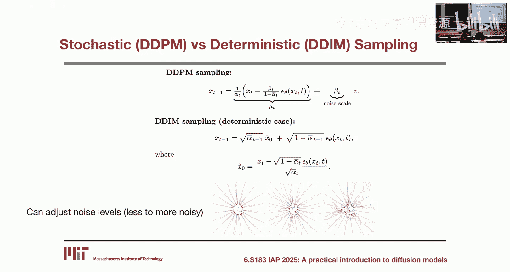

对于任何一个扩散SDE，在一定的正则条件下，都存在一个对应的常微分方程（ODE），称为**概率流ODE**。这个ODE的解与原始SDE在任意时刻 `t` 的边缘分布相同。

*   **优势**：求解ODE在数值计算上通常比求解SDE更稳定、更高效。
*   **联系**：这为DDIM（离散确定性采样）提供了连续的对应物。我们可以通过求解这个反向ODE来进行确定性采样。

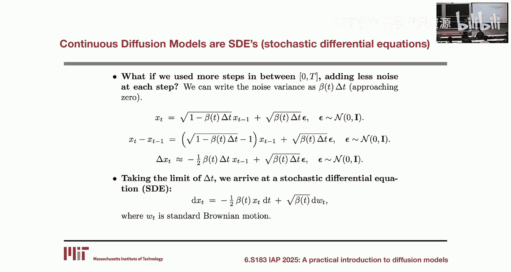

---

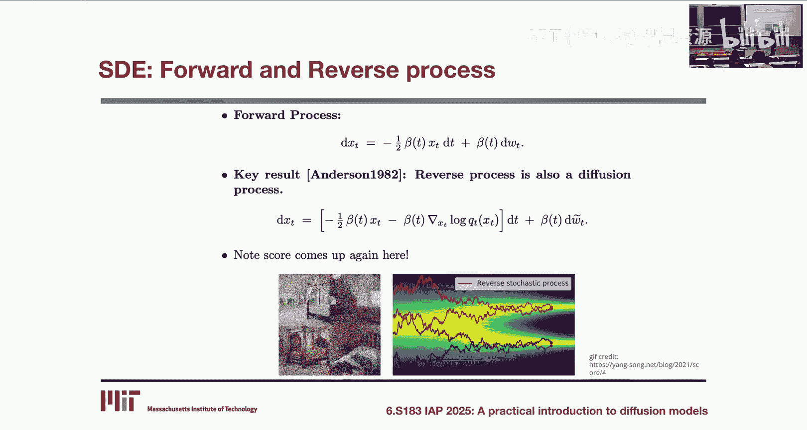

## 更一般的视角：流匹配

流匹配（Flow Matching）提供了一个更通用的框架来理解这类生成模型。

*   **核心思想**：直接学习一个速度场 `v(x, t)`，这个速度场定义了一个从简单分布（如高斯分布）到复杂数据分布的连续变换流（Flow）。
*   **与扩散模型的联系**：概率流ODE中的漂移项可以看作是这种速度场的一个特例。流匹配的目标是学习一个向量场，使得沿着该场积分得到的轨迹能将噪声样本转化为数据样本。
*   **特点**：流匹配的数学形式有时更简洁，并且统一了扩散模型和基于流的生成模型。

---

## 概念关联图与自回归视角

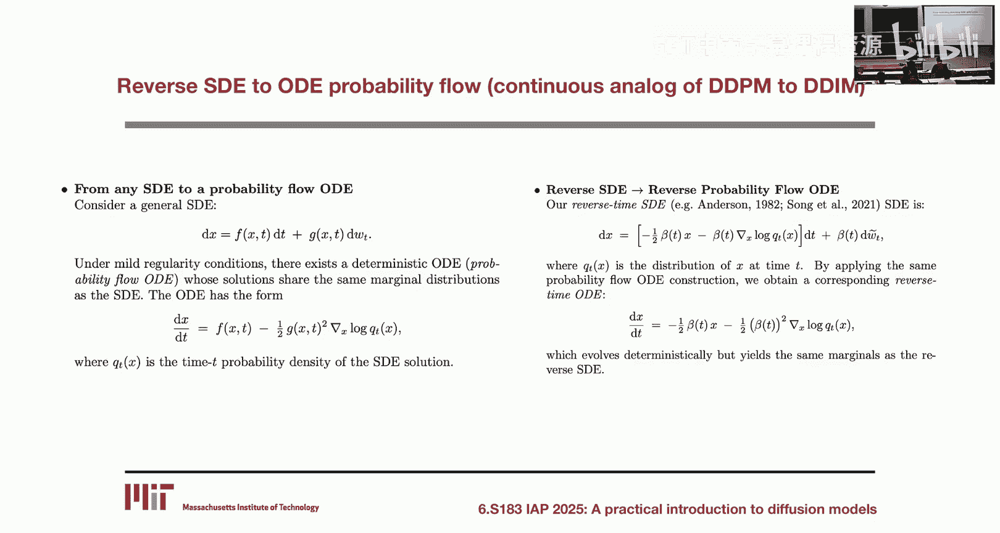

为了帮助大家梳理这些概念之间的关系，可以参考以下高层思维导图：
- **离散世界**：随机采样（DDPM） ↔ 确定性采样（DDIM）
- **连续世界**：随机过程（反向SDE） ↔ 确定性过程（概率流ODE）
- **广义框架**：流匹配（Flow Matching）

最后，我们可以从**自回归模型**的视角来直观理解扩散模型：
扩散模型的采样过程是“先轮廓，后细节”。在早期采样步骤中，模型主要生成数据的低频信息（整体结构、形状），而在后续步骤中，逐渐添加高频信息（细节、纹理）。这种从低分辨率到高分辨率、从整体到局部的生成方式，与自回归模型逐个生成像素或token的过程在理念上是相似的。

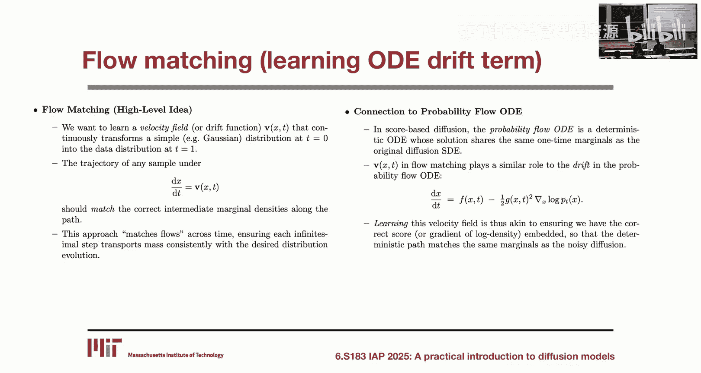

---

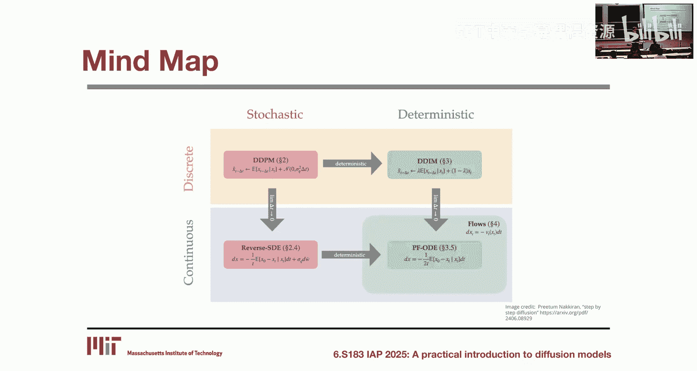

## 总结

本节课我们一起学习了多种理解扩散模型的视角：
1.  我们从**DDPM**的数学基础出发，推导了其通过预测噪声进行训练的核心目标函数。
2.  我们探讨了**随机采样**与**确定性采样**两种生成方式。
3.  我们了解了将模型**连续化**后，可以用**随机微分方程**和**概率流ODE**来描述，后者为确定性采样提供了理论依据。
4.  我们简要介绍了更一般的**流匹配**框架。
5.  最后，我们提到了扩散模型与**自回归模型**在“由粗到细”生成策略上的相似性。

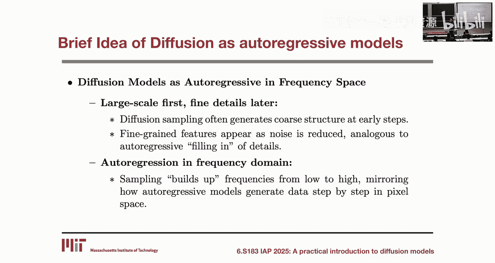

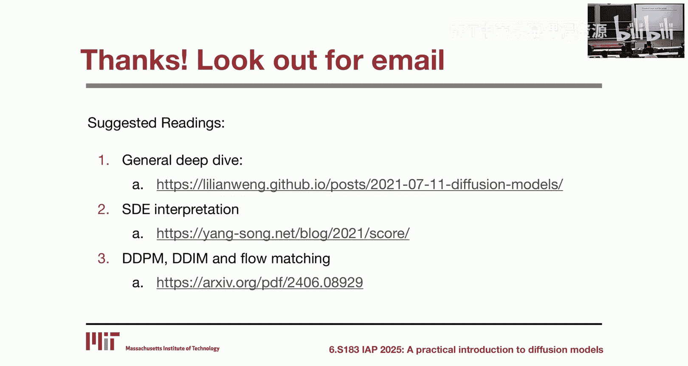

这些不同的视角为我们阅读文献、理解扩散模型的发展以及设计新模型提供了丰富的工具和直觉。