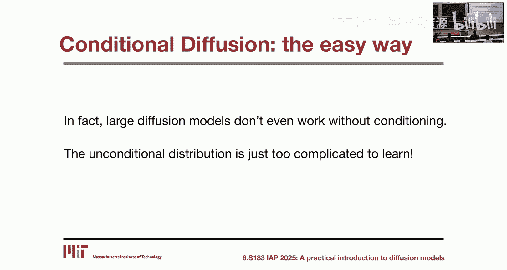
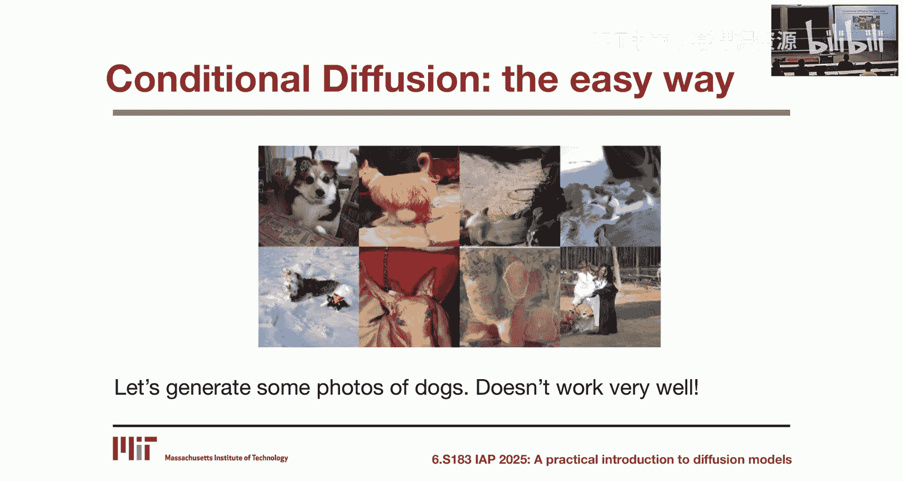
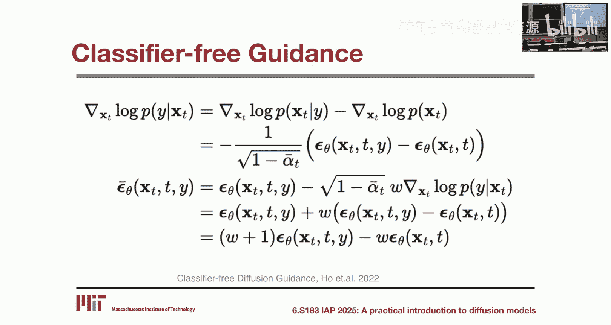
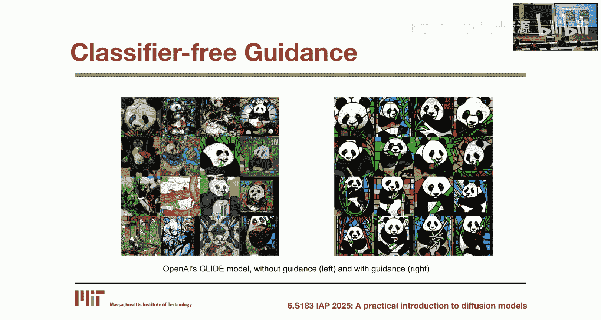
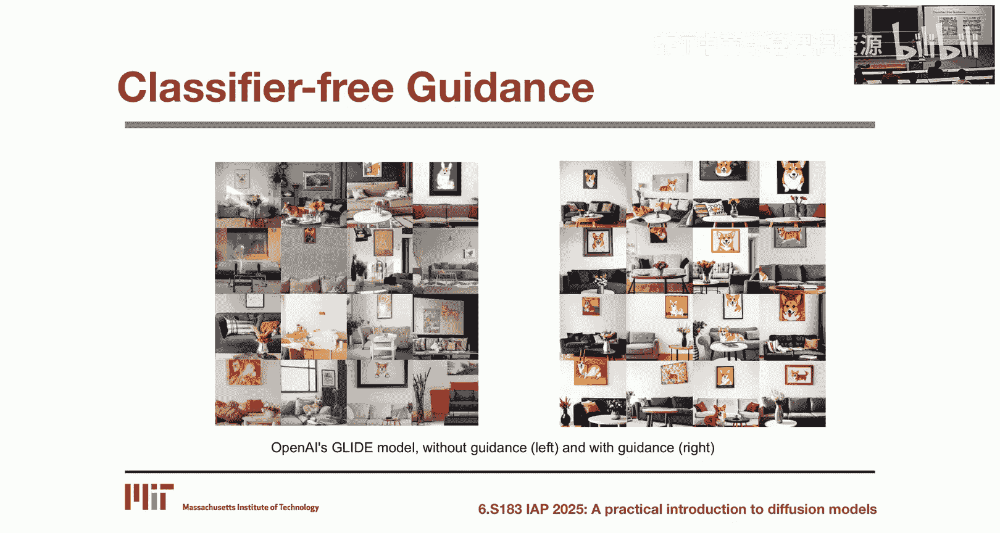
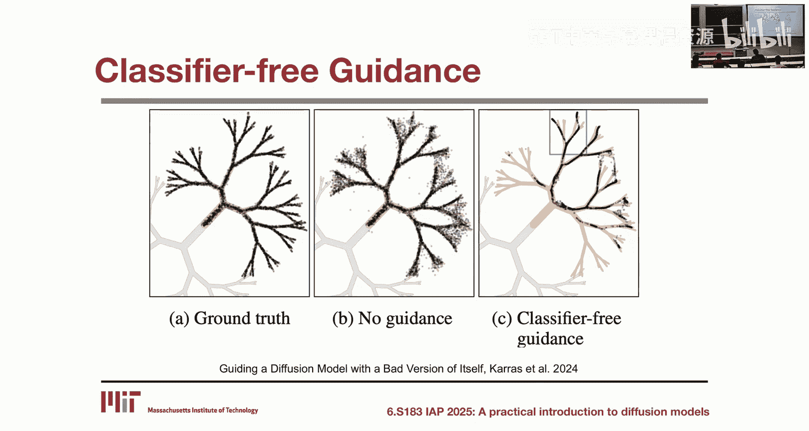
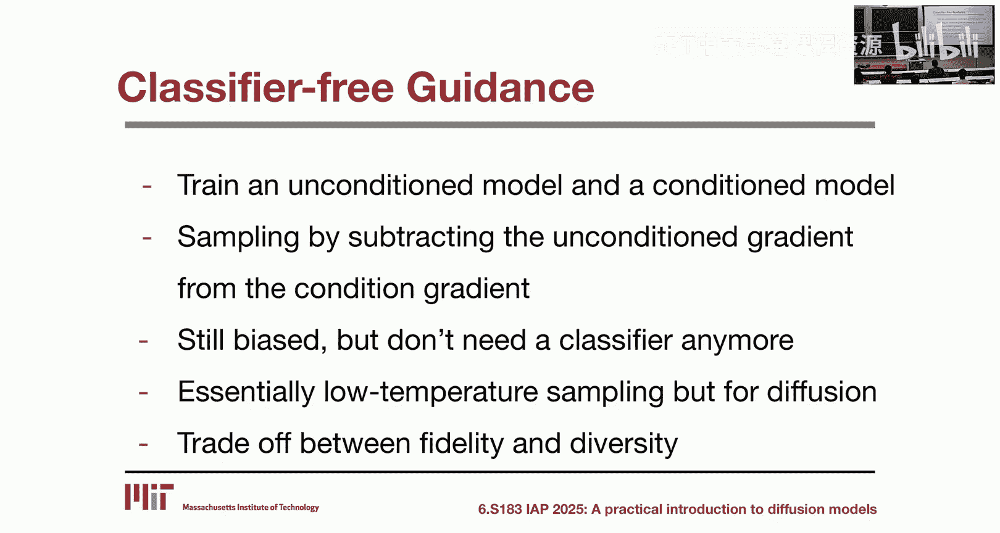
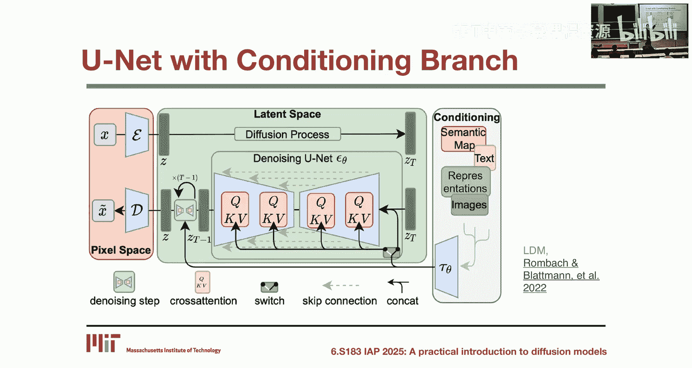
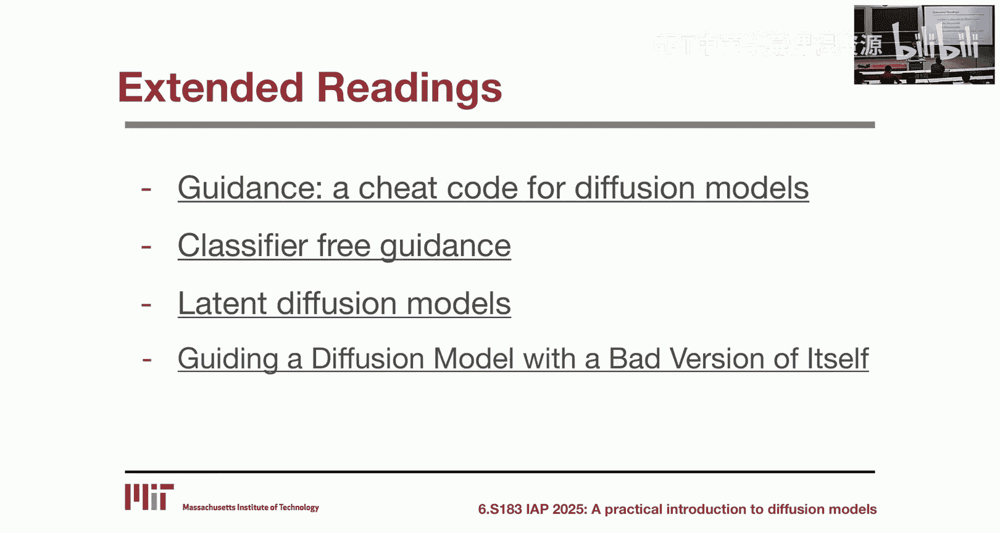

# 3：条件生成与引导技术 🎯

在本节课中，我们将要学习如何让扩散模型根据特定条件（如文本描述或类别标签）生成内容。我们将探讨两种关键技术：分类器引导和分类器自由引导，并了解现代条件扩散模型的架构。





---

## 条件扩散模型

在之前的课程中，我们讨论了如何训练一个可以从数据分布 **P(x)** 中采样的生成模型。今天，我们将讨论如何从**条件分布 P(x|y)** 中采样。例如，如果条件变量 **y** 是“狗”这个类别，那么模型就应该专门生成狗的图片。

实现条件生成有一个直观的方法：在训练时，除了输入带噪声的 **x_t**，也将条件 **y** 一并输入到神经网络中。理论上，如果训练得当，神经网络可以学习到合理的条件分布。然而，在实践中，尤其是在处理像图像这样的高维数据时，这种方法的效果并不理想。事实上，如果没有条件输入，许多大型扩散模型甚至无法很好地工作，因为无条件图像分布过于庞大和复杂，模型难以有效学习。

**核心公式**：条件扩散模型的直观实现方式是将条件变量与噪声输入拼接。
```python
# 伪代码示例：条件输入
model_input = concatenate(noisy_image, condition_label)
prediction = denoising_model(model_input)
```

---

## 分类器引导

上一节我们介绍了条件扩散的直观方法，本节中我们来看看一种更强大的技术：分类器引导。它的核心思想是：**在采样时，利用一个额外的分类器来引导预训练的无条件扩散模型，使其生成符合特定条件的内容，而无需重新训练扩散模型本身**。

其数学原理基于贝叶斯定理和对数概率的梯度。我们希望采样的条件分布 **P(x|y)** 可以分解为无条件分布 **P(x)** 和一个分类器项 **P(y|x)** 的组合。

通过对数变换和求梯度，我们可以得到用于采样更新的新分数（score）：
**∇ log P(x|y) = ∇ log P(x) + ∇ log P(y|x)**

在这个公式中：
*   **∇ log P(x)** 是无条件扩散模型本身提供的分数。
*   **∇ log P(y|x)** 是一个在带噪声输入 **x_t** 上训练的**噪声感知分类器**的梯度，它指示当前样本属于类别 **y** 的可能性。

在实际应用中，人们通常会引入一个**引导强度系数 s (或 γ)** 来放大分类器梯度的影响，从而实现更强或更弱的条件控制：
**∇ log P(x|y) ≈ ∇ log P(x) + s * ∇ log P(y|x)**

以下是分类器引导的关键要点：
*   **优点**：可以在不重新训练扩散模型的情况下，实现条件生成。只需额外训练一个噪声图像分类器。
*   **缺点**：需要训练一个单独的、在噪声图像上工作的分类器，这本身具有挑战性且不直观。
*   **效果**：引导会**偏置（bias）**原始的无条件分布，使其更倾向于生成分类器置信度高的样本。这通常会提高生成样本的“质量”（更符合人类偏好），但会牺牲生成结果的多样性，并且采样分布会偏离真实的数据分布 **P(x|y)**。

---

## 分类器自由引导

上一节我们了解了分类器引导，但它需要训练一个额外的噪声分类器。本节我们将介绍一种更优雅且如今被广泛采用的方法：**分类器自由引导**。它完全避免了训练单独的分类器。

其核心洞见是，利用贝叶斯定理，可以将分类器项 **∇ log P(y|x)** 重新表述为两个扩散模型分数之差：
**∇ log P(y|x) = ∇ log P(x|y) - ∇ log P(x)**



将这个表达式代入分类器引导的公式，我们得到：
**∇ log P(x|y) ≈ ∇ log P(x) + s * (∇ log P(x|y) - ∇ log P(x))**
整理后可得：
**∇ log P(x|y) ≈ (1 + s) * ∇ log P(x|y) - s * ∇ log P(x)**



在这个公式中：
*   **∇ log P(x|y)** 是一个**条件扩散模型**（即采用“直观方法”训练的模型）的分数。
*   **∇ log P(x)** 是一个**无条件扩散模型**的分数。



因此，分类器自由引导的最终采样过程是：**同时使用一个条件模型和一个无条件模型，并将它们的输出按权重进行线性组合**。

以下是具体操作步骤：
1.  **训练**：训练一个**单一的神经网络**，使其同时具备条件去噪和无条件去噪的能力。通常通过在训练时随机丢弃条件信息（例如以10%的概率将条件输入置零）来实现。
2.  **采样**：在采样时，运行该网络两次：一次输入条件 **y**（得到条件预测 **ε_c**），一次不输入条件或使用空条件（得到无条件预测 **ε_u**）。
3.  **组合**：按以下公式组合预测结果，得到用于下一步去噪的最终噪声预测：
    **ε' = (1 + s) * ε_c - s * ε_u**

这里的 **s** 是引导尺度，控制条件生成的强度。**s = 0** 时退化为普通的条件模型；**s = 1** 时理论上对应真实的 **P(x|y)**；实践中（如Stable Diffusion）常使用 **s = 7.5** 等较大值来获得更清晰、更符合文本描述的图像。

**核心优势**：
*   **无需分类器**：摆脱了训练噪声分类器的负担。
*   **广义条件**：条件 **y** 可以是任何形式（文本、图像、类别等），而不仅仅是离散类别。
*   **实现高质量生成**：本质上是一种对扩散模型的**低温采样**技术。它通过放大高概率区域（通常对应“高质量”样本）并抑制低概率区域（可能对应模糊、混乱的样本），从而生成视觉上更吸引人的结果，尽管这同样会引入分布偏差并降低多样性。



---



## 现代条件扩散模型架构

前面我们介绍了引导的原理，本节我们来看看在实践中，条件信息是如何被集成到现代扩散模型架构中的。主要有以下几种方式：

**1. 交叉注意力机制**
这是文本到图像模型（如Stable Diffusion）的核心。文本提示通过一个文本编码器（如CLIP）转换为嵌入向量，这些嵌入向量作为键（Key）和值（Value）输入到U-Net的交叉注意力层中，与图像特征进行交互。



**2. 自适应归一化**
条件信息（如类别标签、文本嵌入）通过一个小型网络（如MLP）处理，生成缩放（γ）和偏移（β）参数。这些参数被用于调整U-Net中特征图在归一化后的结果，即执行“条件层归一化”。
**公式**：`Output = γ(y) * LayerNorm(x) + β(y)`

**3. 扩散变换器**
在基于Transformer的扩散模型（如DiT）中，条件信息通常通过自适应层归一化（AdaLN）模块注入。条件嵌入被用来计算每个Transformer块中LayerNorm之后的γ和β参数。

**4. ControlNet（控制网络）**
这是一种为预训练扩散模型添加额外空间控制信号（如边缘图、深度图、姿态关键点）的技术。它复制了预训练U-Net的编码器部分作为可训练分支，并通过“零卷积”层与原始模型连接。训练时只更新ControlNet分支的参数，从而让模型学会在保持原有生成能力的同时，遵循新的控制条件。



---

本节课中我们一起学习了扩散模型条件生成的核心技术。我们从简单的条件输入方法出发，深入探讨了基于概率推导的**分类器引导**技术，并进一步学习了目前主流的、无需分类器的**分类器自由引导**技术，理解了它如何通过组合条件与无条件模型来实现高质量的定向生成。最后，我们概述了将条件信息集成到模型中的几种现代架构。掌握这些概念是理解和使用当今强大文生图、图生图等扩散模型应用的基础。