# 4：扩散模型的泛化能力 🧠

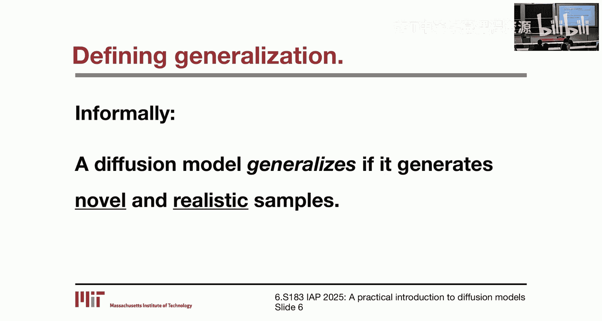

在本节课中，我们将要学习扩散模型的泛化能力。我们将探讨什么是泛化，扩散模型是否以及为何能够泛化，并介绍一些解释其泛化行为的最新研究。

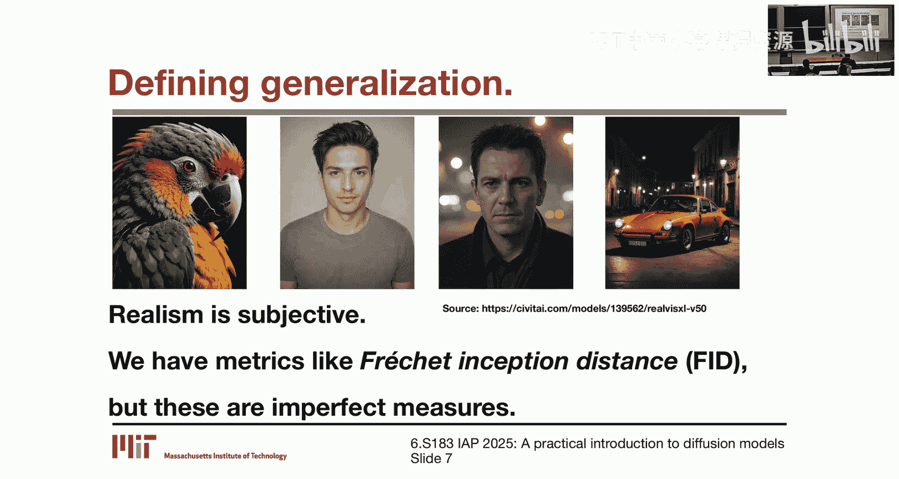

## 什么是扩散模型的泛化？

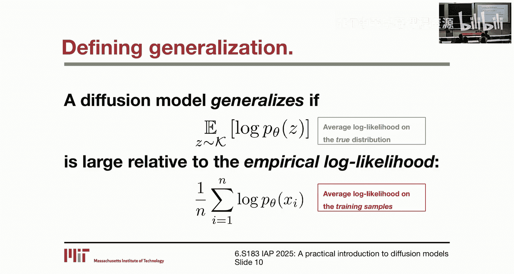

上一节我们介绍了课程背景，本节中我们来看看泛化的定义。

我们非正式地认为，如果一个扩散模型能生成**新颖**且**逼真**的样本，那么它就具有泛化能力。新颖性意味着生成的样本不在其训练集中。逼真性则更为主观，但我们可以使用如**FID分数**等指标来衡量。

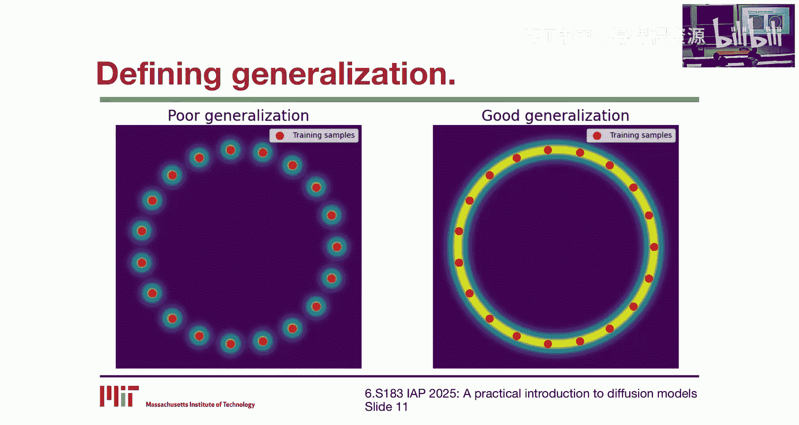

我们也可以形式化地定义泛化。扩散模型本质上编码了一个概率分布 **P_θ**。我们不仅可以从 **P_θ** 中采样，还可以查询它来获得新样本的**对数似然**。形式化地说，如果一个模型在真实分布上的平均对数似然，相对于其在训练样本上的经验对数似然足够大，那么我们就说该模型能够泛化。

以下是一些图示来帮助理解：

*   **泛化能力差**：模型仅对训练数据点（红点）分配高似然，而对流形（如圆）上其他点的似然很低。
*   **泛化能力强**：模型对整个流形（圆）上的点都分配了高似然，而不仅仅是训练数据点。

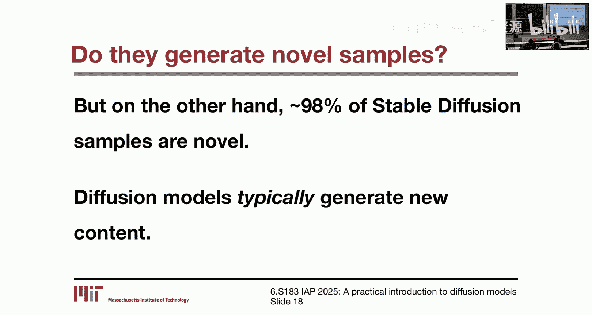

需要注意的是，这两种泛化概念（样本质量与对数似然）在实践中并不完全等同。一个模型可能生成高质量的样本，但在测试数据上的对数似然却很低，反之亦然。

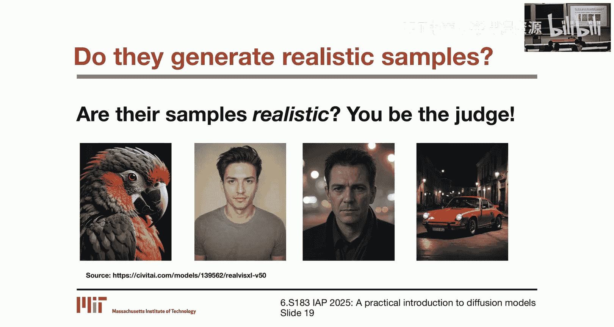

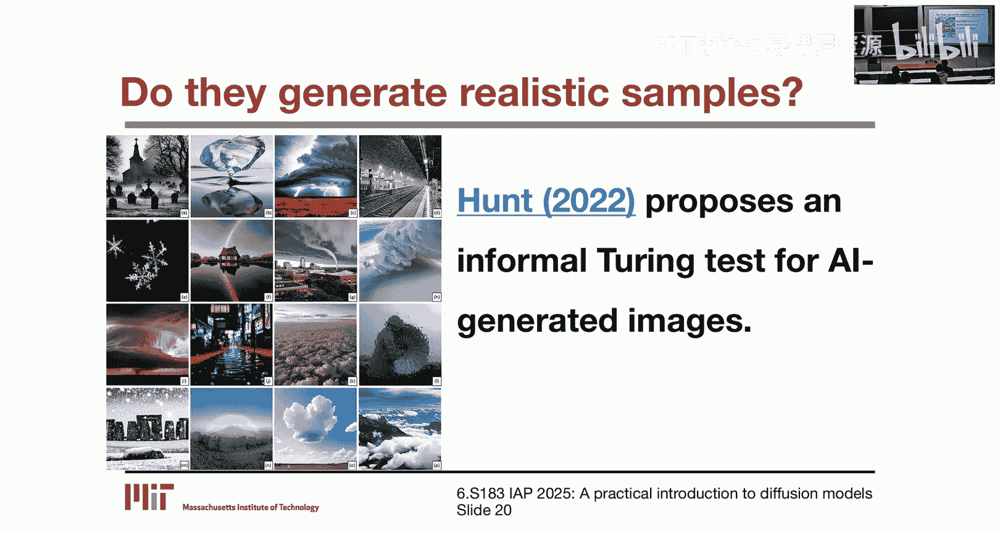

## 扩散模型能泛化吗？

既然我们已经定义了泛化，接下来我们探讨扩散模型是否具备这种能力。

根据我们的非正式定义，我们需要分别考察**新颖性**和**逼真性**。

关于新颖性，有研究发现，大约**1.9%** 的Stable Diffusion样本会复制其训练数据中的内容。虽然这个比例足以引发版权担忧，但反过来看，这意味着超过**98%** 的样本是新颖的。因此，尽管扩散模型有可能记忆训练数据，但通常它们确实能生成新内容。

关于逼真性，这更为主观。例如，RealViz XL模型生成的样本看起来非常逼真。此外，还有研究提出了针对AI生成图像的“图灵测试”，以评估其与真实照片的区分度。

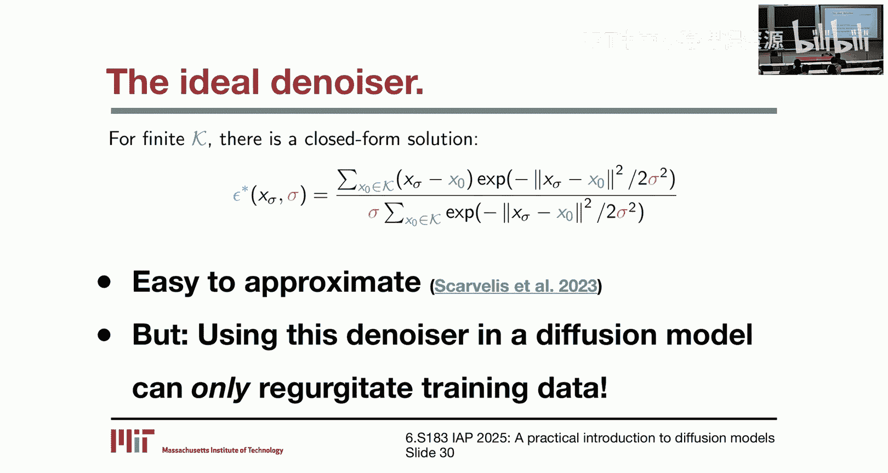

从形式化角度看，我们可以通过计算模型在预留测试集上的平均对数似然来评估泛化。虽然这方面的直接比较研究较少，但对另一类生成模型（标准化流）的研究表明，其测试与训练对数似然之间的“泛化差距”很小。这暗示扩散模型可能也有类似表现。一个有趣的现象是，模型有时会对“分布外”数据（即与训练数据不同的数据）分配更高的似然，这凸显了高维空间中的奇特性质。

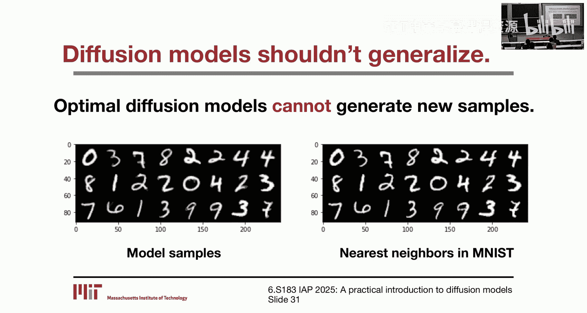

## 扩散模型泛化为何令人惊讶？

到目前为止，我们论证了扩散模型确实能够泛化。但接下来我们要指出，根据现有理论，这**本不应该发生**，因此是令人惊讶的。

核心论点如下：
1.  扩散模型使用从训练数据中学到的**去噪器**来生成样本。
2.  对于任何有限的训练集，我们实际上可以**直接计算出理想去噪器的闭式解**。这个最优解仅依赖于训练数据。
3.  然而，如果我们在扩散模型中使用这个**最优去噪器**，模型将只能输出训练分布中的样本，即纯粹地“复述”训练数据，而无法生成任何新内容。

你可能会问，这与监督学习中的过拟合有何不同？关键在于：

*   在监督学习（如回归）中，存在**无数个**函数可以完美拟合有限的训练数据，而真实函数只是其中之一。泛化的挑战是从这个“大海”中找到正确的“针”。
*   在扩散模型的去噪问题中，对于给定的有限训练集，**只有一个**闭式最优解，并且我们知道它在哪里。问题是，这个唯一的最优解对我们毫无用处（因为它只会记忆）。

因此，扩散模型的泛化**只能**发生在模型**未能完全解决训练问题**（即未能学到最优去噪器）的情况下。这与监督学习中的泛化图像截然不同。

## 扩散模型为何能泛化？

既然扩散模型的泛化能力出乎意料，一个自然的问题是：**它们为什么能泛化？** 目前尚无定论，但这是一个新兴且激动人心的研究方向。以下介绍几篇从不同角度探讨该问题的近期论文。

### 视角一：几何自适应谐波基

一篇来自NYU的论文提出了一个分析框架。其基本观察是，如果使用ReLU激活函数的神经网络参数化去噪器，那么该去噪器是**分段线性函数**。在任意输入点，其行为可以由其雅可比矩阵完全描述。

通过分析训练目标，可以将其分解为两项：
1.  **数据项**：鼓励去噪器输出接近带噪输入。
2.  **正则化项**：惩罚去噪器雅可比矩阵特征值的L1范数（即核范数），这鼓励雅可比矩阵是**低秩**的。

这意味着，去噪器倾向于使用**少数几个基向量**的线性组合来重建带噪图像。这些基向量被称为**几何自适应谐波基**。它们捕获了训练数据的关键几何特征，而非直接记忆数据本身。这可以看作是神经去噪器的一种**归纳偏置**。

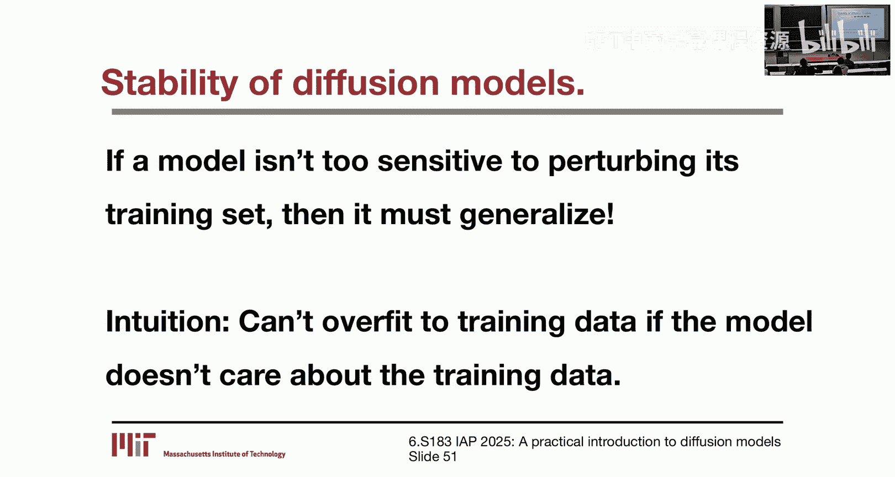

该论文还有一个非常酷的实验，测试了扩散模型的**稳定性**：用相同架构在不同训练子集上训练两个去噪器，然后使用相同的初始噪声进行确定性采样。结果发现，当训练数据足够多时，两个模型会生成几乎相同的样本，尽管它们的训练集完全不同。这表明训练充分的扩散模型对训练数据的具体细节非常不敏感，这种高度的稳定性与泛化能力密切相关。

### 视角二：平滑性先验

神经网络的另一个已知归纳偏置是**平滑性**，即它们倾向于先学习目标函数的低频（平滑）部分。

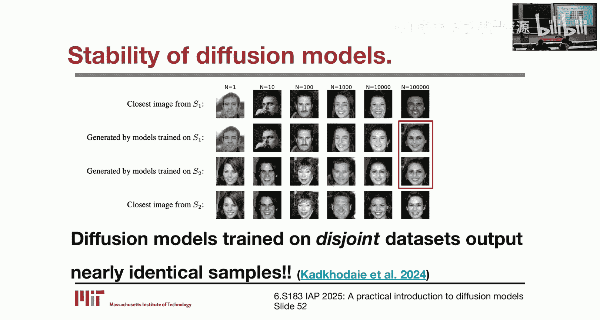

基于此，一篇论文提出可以直接计算**最优去噪器**（即会记忆训练数据的那个），然后对其进行**平滑**处理。这样就得到了一个**无需训练**的“平滑闭式扩散模型”，它能够泛化。

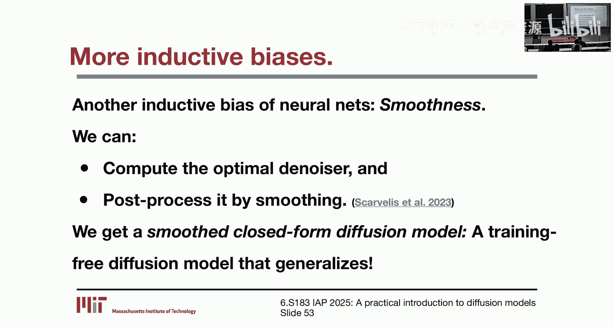

平滑的作用是改变采样过程的“流向”：最优去噪器将噪声直接推向最近的训练样本；而平滑后的去噪器则将噪声推向附近训练样本的**重心**，实现了在训练数据间的插值。在图像等高维数据中，直接像素插值效果不佳。但该研究通过在合适的自编码器**潜空间**中应用此方法，成功生成了新颖且合理的样本。

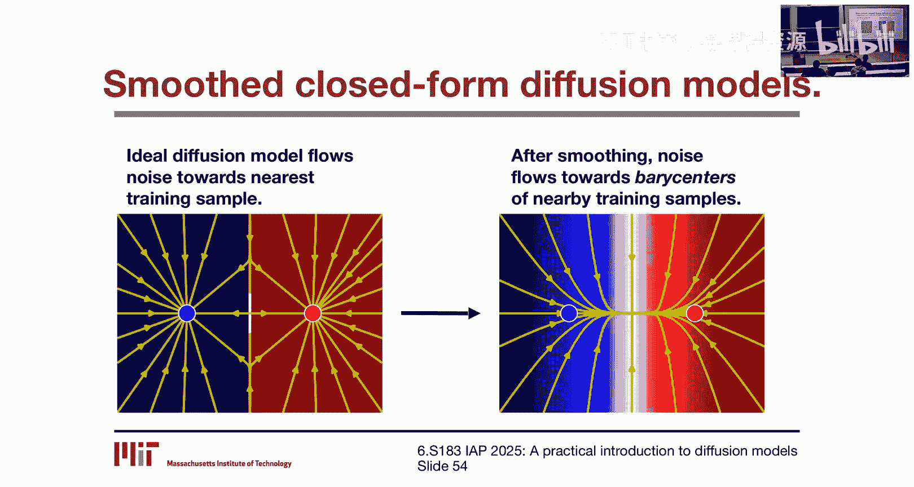

### 视角三：卷积的归纳偏置

一篇非常近期的论文分析了卷积神经网络的两个关键归纳偏置：**局部性**和**等变性**。

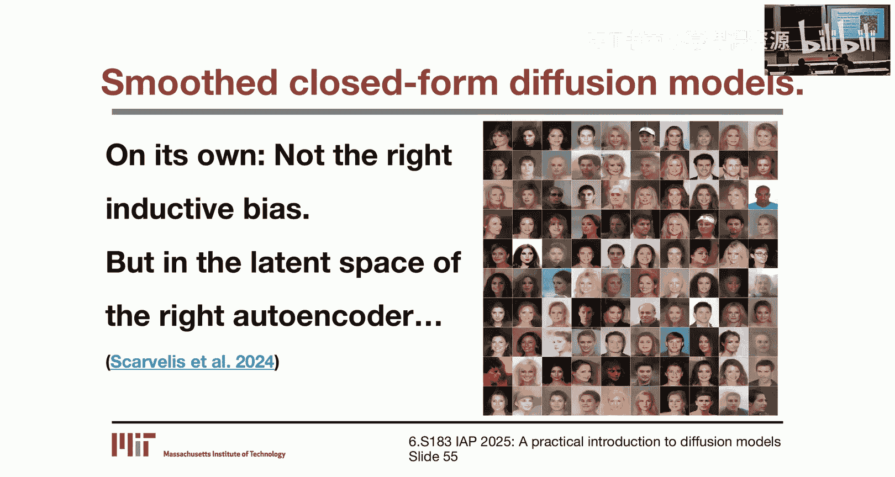

研究发现，即使施加了这两个约束，去噪问题仍然存在**闭式解**。直观上，由此得到的去噪器会以巧妙的方式**混合和匹配**训练集中的图像块来生成新图像，被称为“**拼贴创造力**”模型。

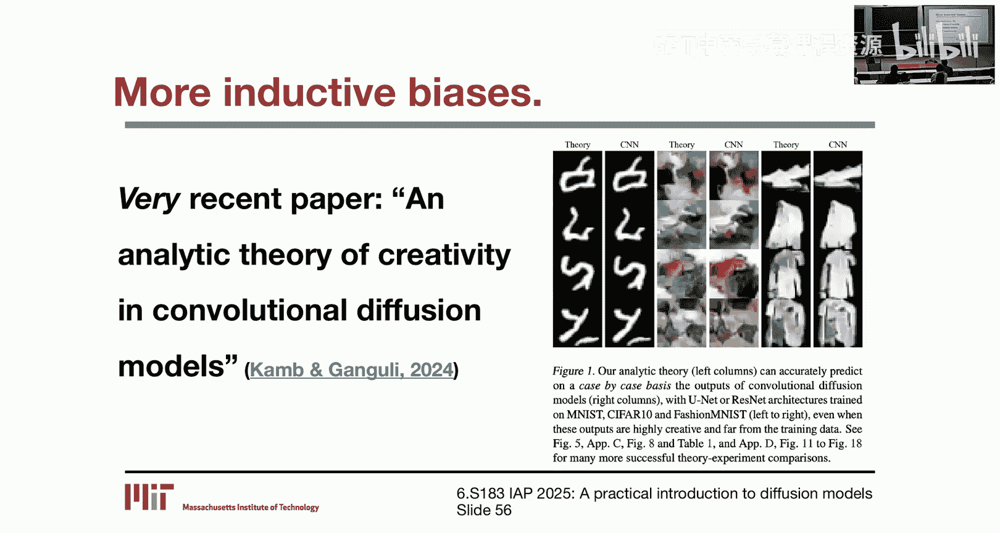

令人惊讶的是，这个理论模型预测的结果与真实神经网络扩散模型的输出非常相似。这表明，卷积网络的局部性和等变性偏置本身，就足以引导模型以一种能够泛化的方式（通过块级别的组合）进行去噪。

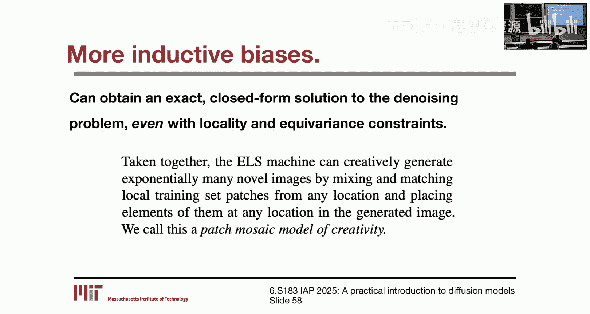

## 为何要关注泛化问题？

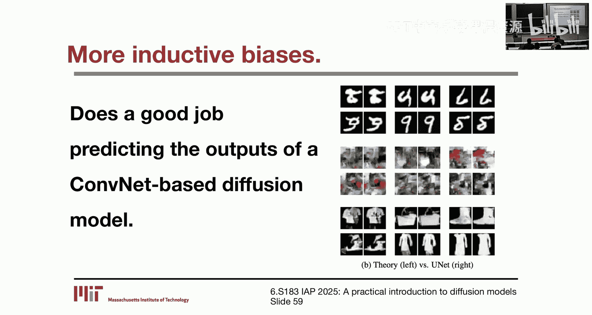

在结束之前，我们简要讨论一下为何实践者应该关心泛化问题。

1.  **法律影响**：如前所述，扩散模型记忆训练数据的能力已引发版权诉讼。更好地理解和量化泛化，有助于开发更少记忆受保护内容的模型。
2.  **减少数据需求**：理解泛化机制，可能帮助我们设计出用更少数据就能良好泛化的模型。这对于数据稀缺的领域（如分子生成）或数据饥渴的模型（如视频扩散模型）至关重要。
3.  **降低计算成本**：扩散模型的训练和采样成本高昂。如果我们能基于对泛化偏置的理解，开发出高效的、**免训练**的扩散模型，将能极大降低计算门槛，甚至可能在CPU上运行。

## 总结

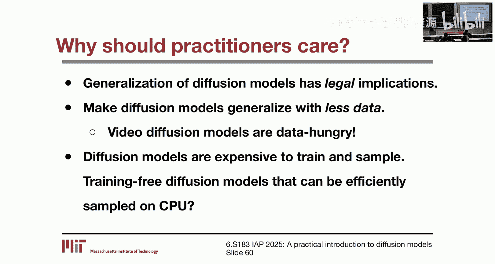

本节课中我们一起学习了扩散模型的泛化能力。我们首先定义了泛化的两种形式，并确认扩散模型在实践中确实能够生成新颖且逼真的样本。接着，我们指出这种泛化能力从理论角度看是令人惊讶的，因为最优解只会导致记忆。最后，我们探讨了扩散模型之所以能泛化的几种可能原因，包括神经去噪器学习**几何自适应谐波基**的偏置、神经网络的**平滑性**先验，以及卷积网络的**局部性**和**等变性**约束。理解这些泛化机制对于解决法律问题、降低数据与计算需求具有重要意义。