# 5：分数蒸馏

在本节课中，我们将要学习分数蒸馏。这是一种基于扩散模型的应用，它允许我们利用在图像数据上预训练的扩散模型，来生成或优化其他领域（如3D形状）的内容。我们将从直观解释开始，逐步深入其工作原理，并探讨其不同的变体与视角。

## 概述

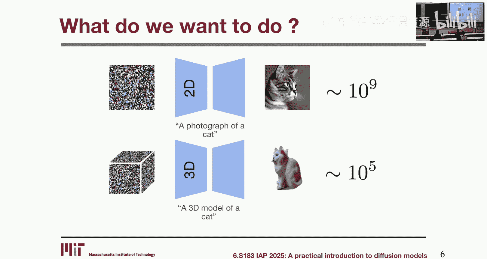

分数蒸馏的核心思想是“知识蒸馏”。我们利用一个在庞大图像数据集上训练好的扩散模型，将其对图像分布的理解（即“分数”或梯度信息），引导至一个可微分的3D表示上，从而优化并生成符合文本描述的3D形状。这种方法巧妙地绕过了直接收集和训练3D数据集的难题。

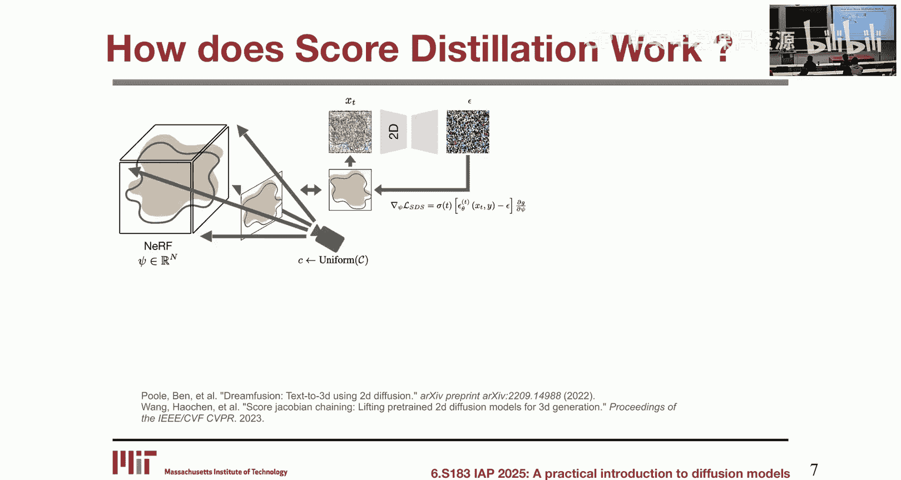

## 直观解释：分数蒸馏如何工作

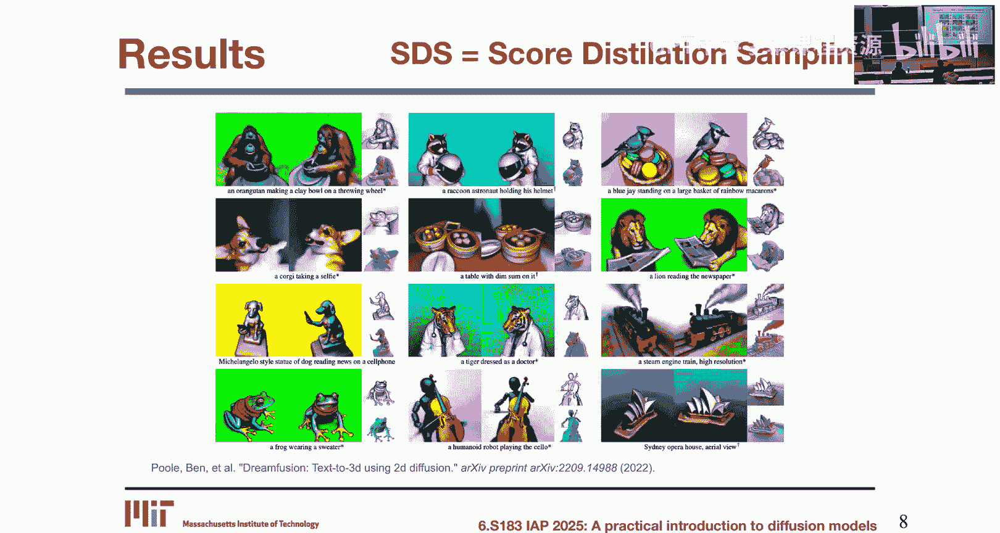

上一节我们概述了分数蒸馏的目标，本节中我们来看看其工作流程的直观理解。

整个过程可以概括为以下几个步骤：
1.  我们有一个可微分的3D表示（例如神经辐射场），其参数为 **θ**。初始时，它可能是一个随机形状（如球体）。
2.  随机采样一个相机视角，使用可微分渲染函数 **g(θ, c)** 将该3D形状渲染成一张2D图像 **x**。
3.  模仿扩散过程，向这张渲染图像 **x** 中添加随机噪声 **ε**，得到噪声图像 **x_t**。
4.  将噪声图像 **x_t** 和文本提示 **y** 输入到一个**固定权重**的、预训练的扩散模型 **ε_φ** 中。该模型预测出应被去除的噪声 **ε_φ(x_t, t, y)**。
5.  关键的一步：我们不直接使用扩散模型的输出，而是计算预测噪声 **ε_φ** 与最初添加的噪声 **ε** 之间的差值。这个差值被直接用作优化3D参数 **θ** 的梯度方向。
6.  根据这个梯度更新 **θ**，使3D形状发生微小改变。
7.  重复步骤2-6，从不同视角反复渲染、加噪、去噪、更新。最终，3D形状会逐渐演变成一个与文本提示一致且从各个视角看都合理的物体。

这个流程的神奇之处在于，扩散模型从未见过3D数据，它只理解2D图像。但通过从多视角提供“监督”，它能够引导一个3D表示生成具有几何一致性的形状。

## 深入算法：SDS 损失函数

了解了直观流程后，我们需要更形式化地理解其更新规则。原始论文提出的算法称为分数蒸馏采样。

以下是该算法的核心更新公式：

`∇θ L_SDS(θ) = E_t,ε,c [ w(t) (ε_φ(x_t, t, y) - ε) ∂x/∂θ ]`

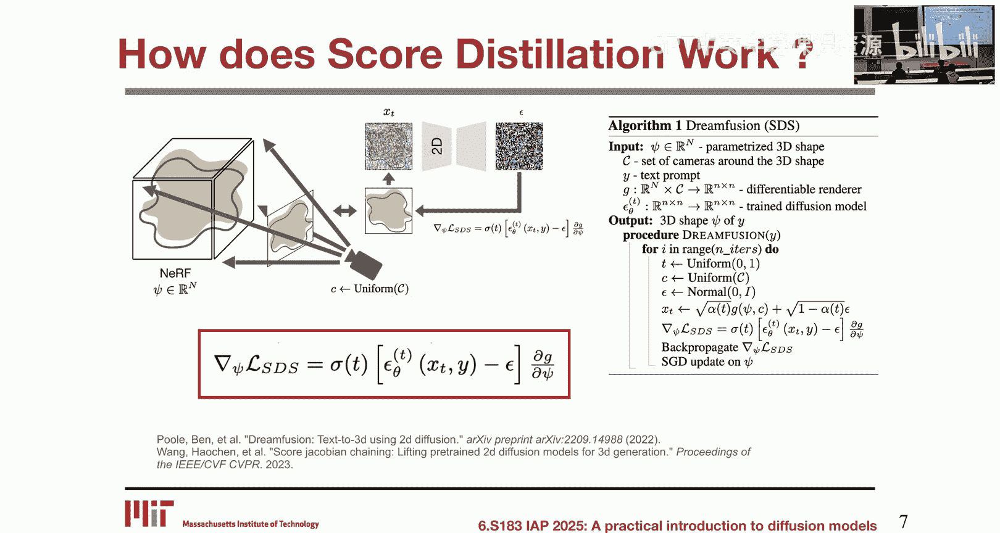

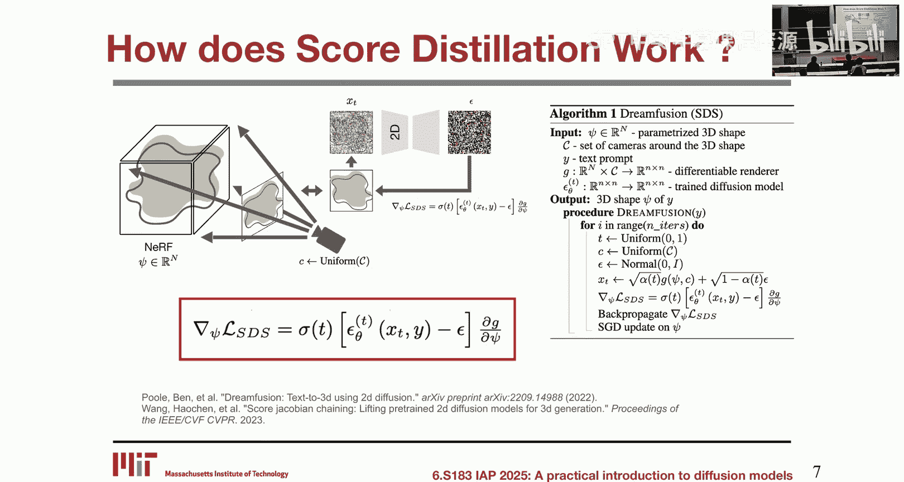

让我们拆解这个公式：
*   **θ**：3D表示的可优化参数。
*   **E_t,ε,c**：对时间步 **t**、噪声 **ε** 和相机参数 **c** 的期望（即随机采样）。
*   **w(t)**：一个依赖于时间步 **t** 的权重系数。
*   **ε_φ(x_t, t, y)**：预训练扩散模型对噪声的预测。
*   **ε**：最初添加到渲染图像 **x** 中的随机噪声。
*   **∂x/∂θ**：渲染图像 **x** 相对于3D参数 **θ** 的梯度（通过可微分渲染实现）。

该公式直接给出了损失函数 **L_SDS** 相对于参数 **θ** 的梯度。**注意，这里并没有一个显式的标量损失值被计算和反向传播，梯度是直接由公式给出的。**

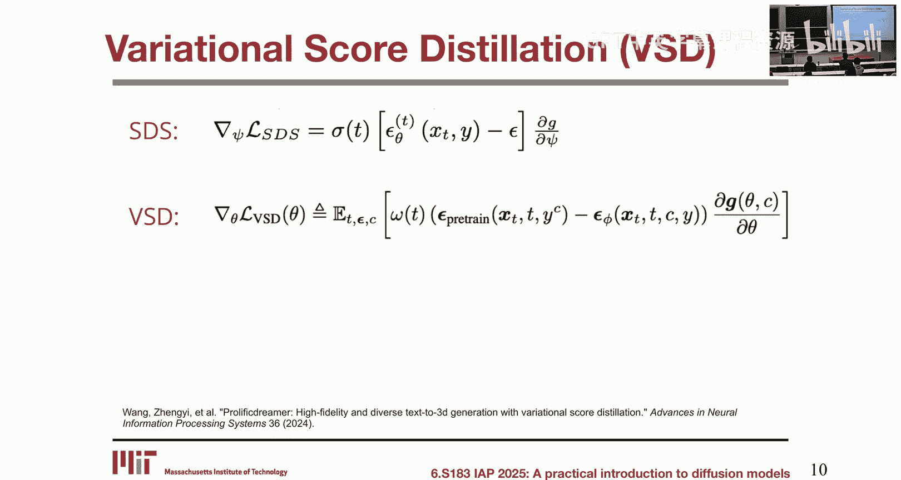

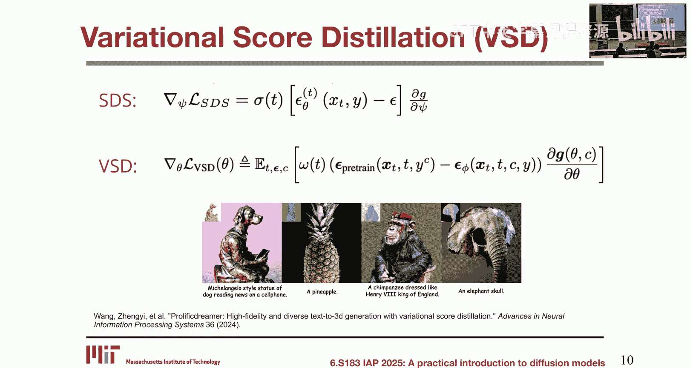

## 存在的问题与改进：VSD

虽然SDS能够生成3D形状，但其结果往往存在色彩过饱和、细节卡通化的问题。研究表明，这与其梯度估计的高方差有关。

为了获得更逼真的结果，研究者提出了变分分数蒸馏。

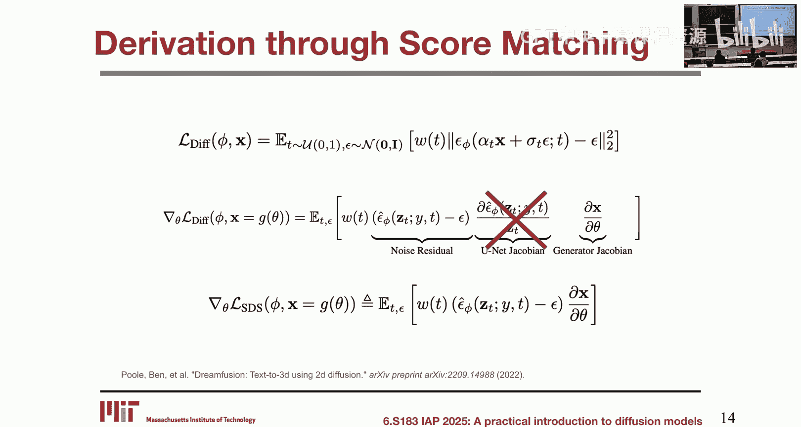

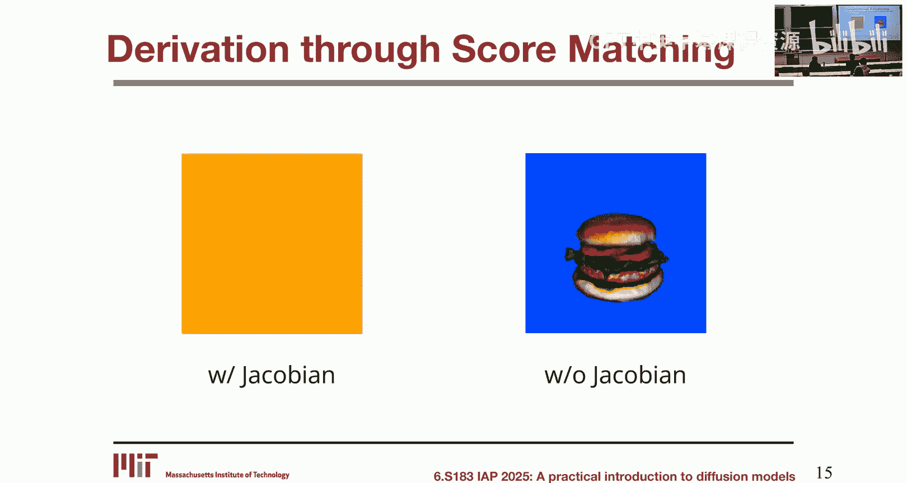

VSD的核心思想是引入一个**可微调的**扩散模型副本。在每次优化迭代中，这个副本会被微调，以更好地对当前3D形状的渲染图进行去噪。然后，梯度由预训练模型和微调后模型的噪声预测之差来计算。

`∇θ L_VSD(θ) = E_t,ε,c [ w(t) (ε_φ(x_t, t, y) - ε_ψ(x_t, t, y, c)) ∂x/∂θ ]`

其中 **ε_ψ** 是微调后的扩散模型。这种方法可以理解为一种**控制变量法**，通过引入一个与原始高方差估计量相关的、均值为零的项，来减少梯度估计的方差，从而使优化更稳定，生成质量更高。

## 另一种视角：重新参数化DDIM

之前我们尝试从损失函数推导SDS，过程涉及一些近似。现在，我们从一个更直观的视角——重新参数化DDIM采样过程——来理解分数蒸馏。

回忆一下，DDIM是一种确定性的扩散模型采样器，它在噪声空间中进行，逐步从噪声图像 **x_T** 去噪得到干净图像 **x_0**。

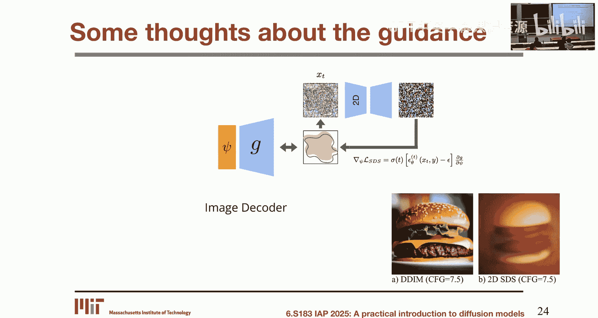

我们可以换一种思路来看这个过程：想象我们有一个初始的、模糊的干净图像估计 **x_0**。我们执行以下步骤：
1.  根据当前时间步，向这个估计 **x_0** 添加适量的噪声 **κ**，将其“推回”到噪声空间中的某个点 **x_t**。
2.  用扩散模型对 **x_t** 去噪一步，得到一个新的、更好的干净图像估计 **x_0‘**。
3.  这个新的 **x_0‘** 成为了下一轮的起点。

如果我们形式化地描述从 **x_0** 到 **x_0‘** 的更新步骤，并进行推导，**神奇的事情发生了：我们最终得到的更新公式，其核心部分正是 (ε_φ - κ)，即预测噪声与添加噪声之差。** 当添加的噪声 **κ** 是随机采样时，这个公式就退化成了SDS。

这个视角的美妙之处在于：
*   它直接将分数蒸馏与标准的DDIM采样过程联系起来。
*   它指出了SDS中“随机采样噪声 **ε**”这一操作的近似本质。
*   它暗示了改进方向：如果我们能找到一个更优的 **κ**（而不仅仅是随机噪声），例如一个能使得“添加后再去噪”保持图像稳定的噪声，我们就能得到更好的更新规则，从而提升生成质量。一些后续研究正是沿着这个思路进行的。

## 应用拓展

分数蒸馏的核心是使用预训练扩散模型作为“语义梯度”的来源。这种能力可以扩展到3D生成之外的许多应用：

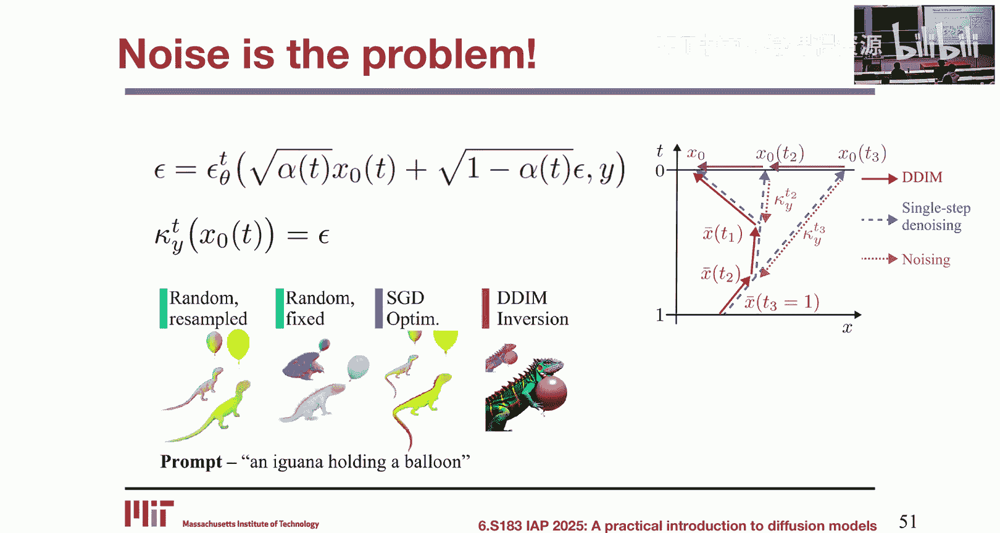

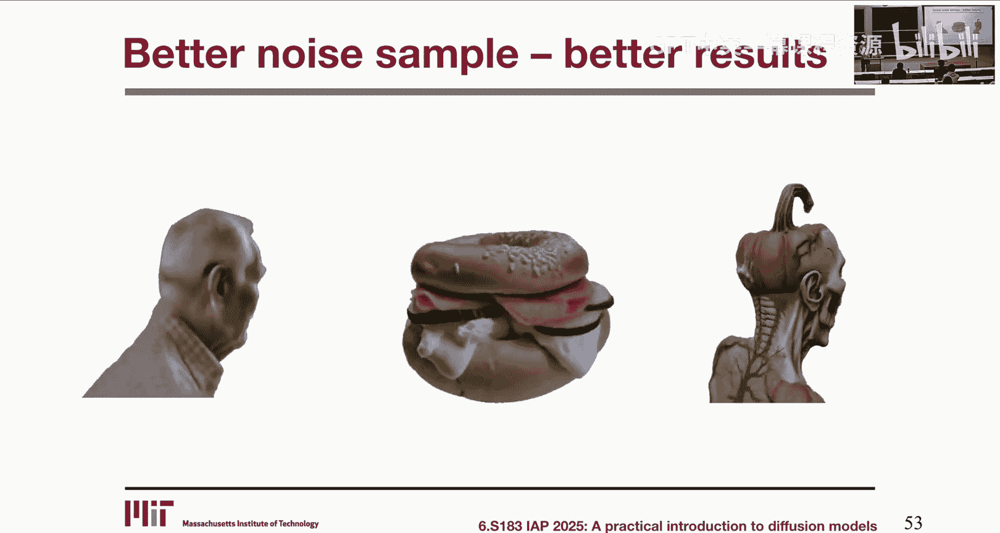

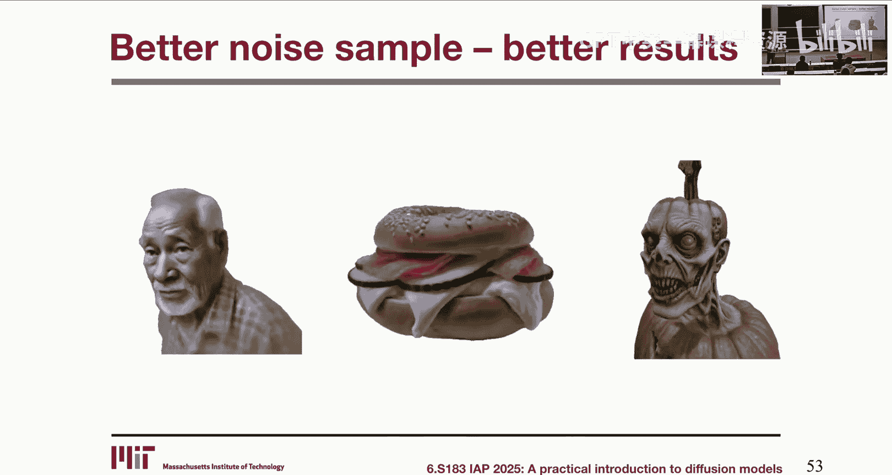

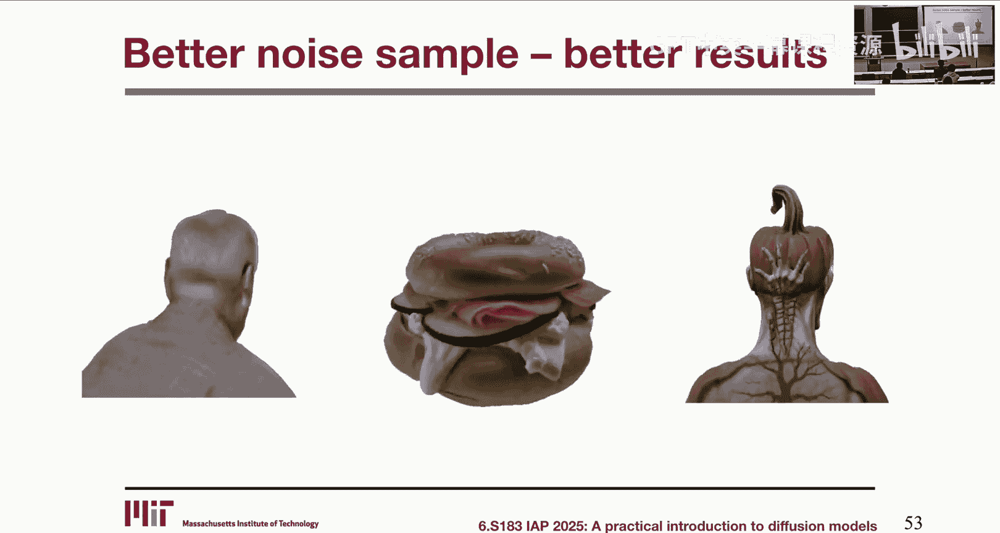

*   **图像编辑**：从一张真实照片开始，利用扩散模型在目标文本提示下的梯度，逐步修改图像内容（例如，让雕像举起手臂）。
*   **异常检测**：向正常图像引入局部破坏。扩散模型给出的梯度会在异常区域表现出较大的幅值，从而定位图像中不符合自然分布的部分。

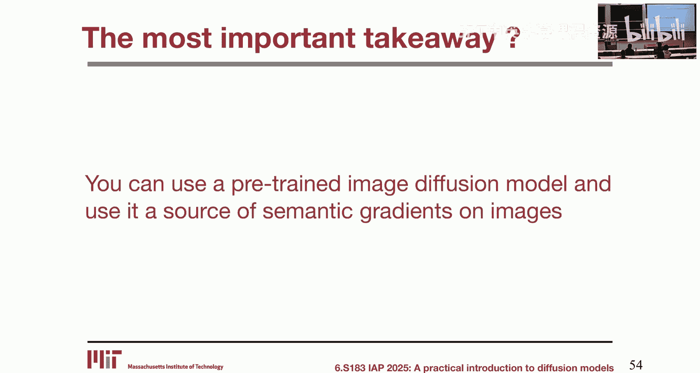

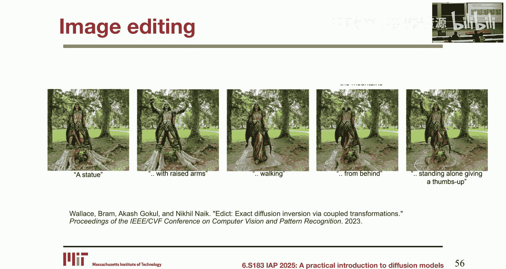

## 总结

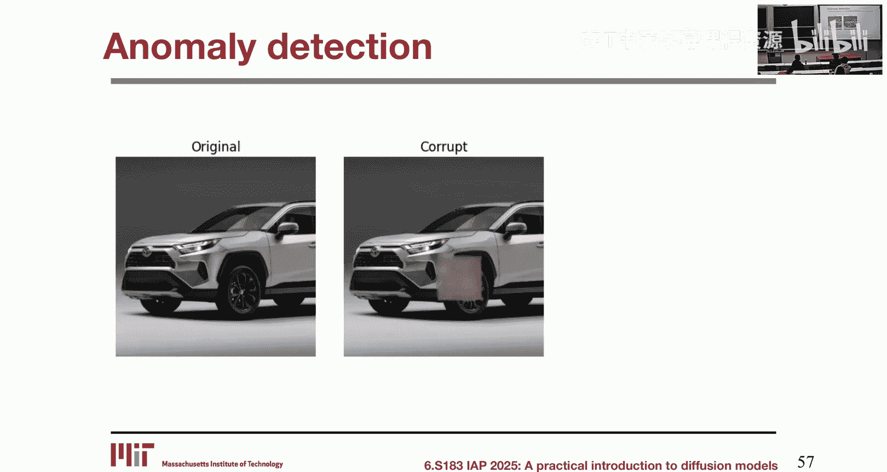

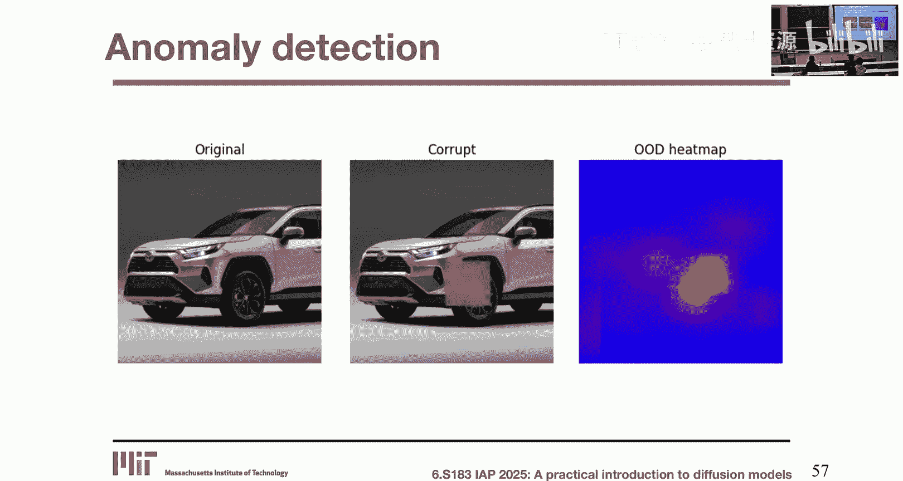

本节课中我们一起学习了分数蒸馏。我们从其用于3D生成的直观动机入手，深入分析了其基础算法SDS的公式。我们探讨了SDS存在的问题，以及通过VSD进行改进的思路。最后，我们从一个全新的视角——重新参数化DDIM——理解了分数蒸馏的本质，并看到了其作为“通用语义梯度源”在图像编辑、异常检测等领域的应用潜力。分数蒸馏展示了预训练扩散模型强大的可迁移性和灵活性，为连接不同模态的任务提供了有力的工具。