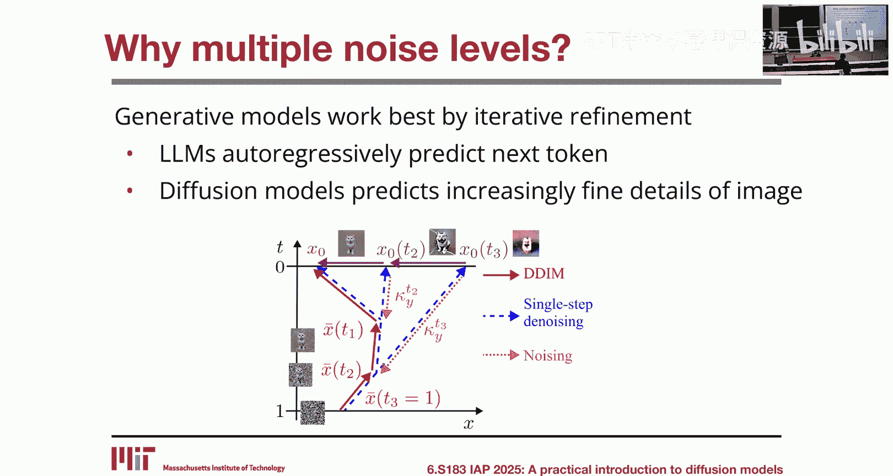
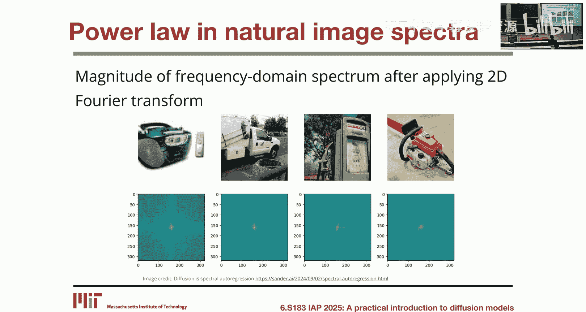
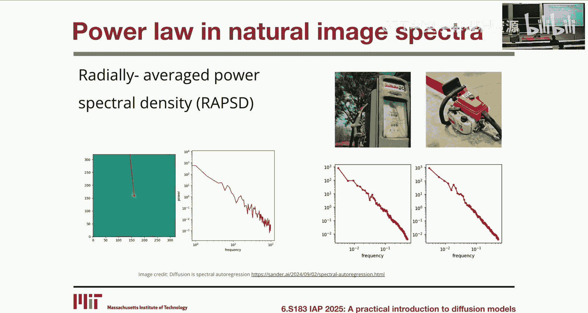
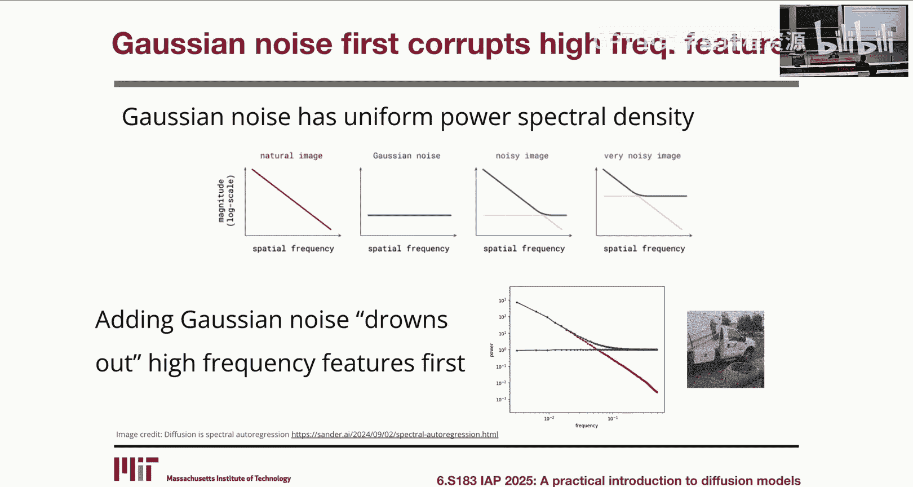
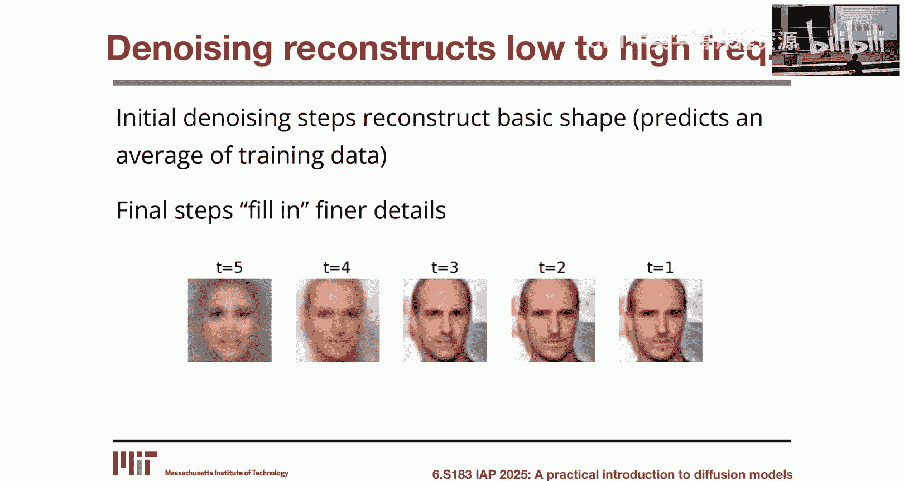
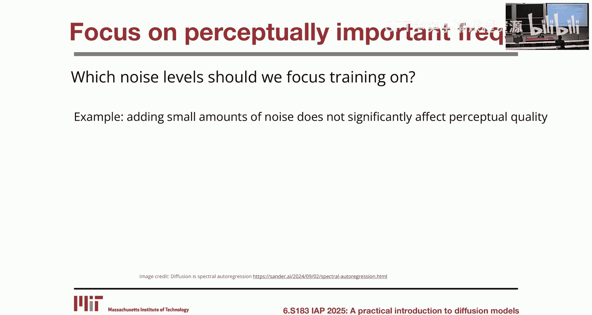
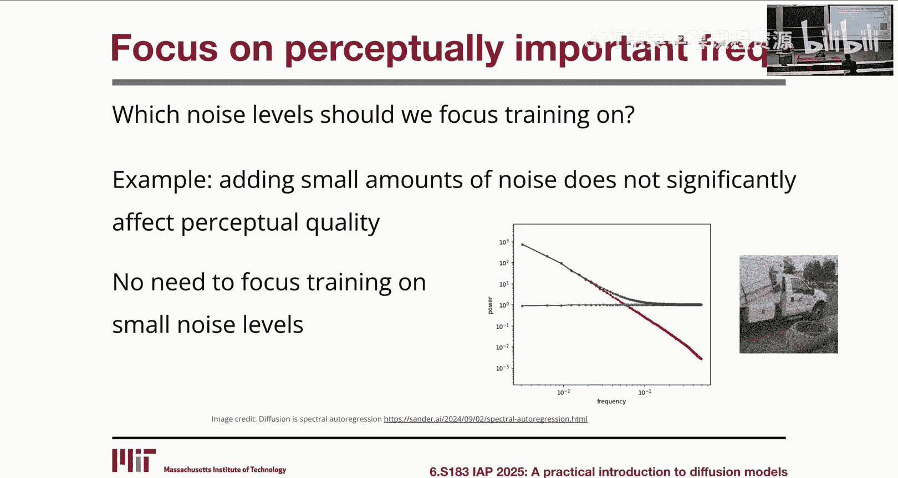
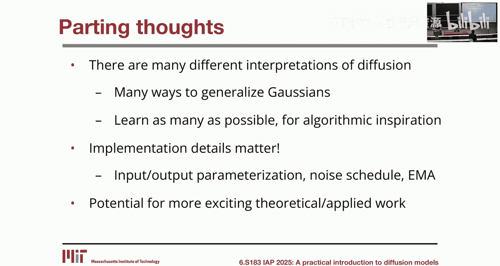
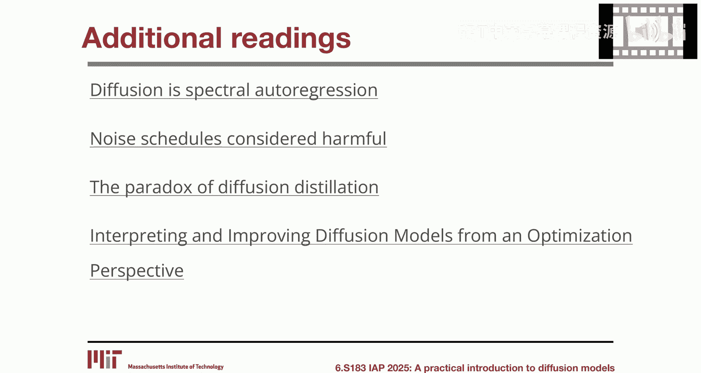

# 6：高级训练、采样与理论视角

在本节课中，我们将学习如何更好地训练扩散模型、如何实现更快的采样，并探讨一个将扩散过程理解为最小化到数据流形距离的新理论视角。

---

## 课程公告 📢

以下是关于课程学分的重要提醒。

*   **评分构成**：课程成绩由出勤、作业集和迷你项目构成。
*   **项目报告**：选择项目的同学，报告提交截止日期为下周五。
*   **作业评分**：已提交的作业将于下周完成评分。
*   **课程反馈**：请务必在下周五前提交课程反馈表，以便我们提交最终成绩。
*   **后续课程**：下周将开设由 Peter 教授主讲的 6.S184 课程《生成式人工智能与随机微分方程》，该课程将更侧重于扩散模型背后的数学理论。

---

## 如何更好地训练模型 🏋️

上一节我们回顾了课程安排，本节中我们来看看如何改进扩散模型的训练。我们将从两个核心变体开始：噪声添加方式和预测目标。

### 噪声添加方式：方差爆炸 vs. 方差保持

在课程第一讲中，我们学习了基本的训练过程：对数据添加噪声，并尝试预测所添加的噪声。其公式为：
`x_t = x_0 + σ_t * ε`
其中 `ε ~ N(0, I)`。这被称为**方差爆炸**公式，因为 `x_t` 的方差会随着噪声水平 `σ_t` 的增大而增加。

然而，在后续课程中，我们使用了另一种公式，称为**方差保持**公式：
`z_t = √(ᾱ_t) * z_0 + √(1 - ᾱ_t) * ε`
在此公式中，无论噪声水平如何，`z_t` 的方差都保持恒定（近似为 1）。

这两种公式可以通过简单的变量转换相互等价转换：
`x_0 = z_0`, `x_t = z_t / √(ᾱ_t)`, `σ_t = √((1 - ᾱ_t)/ᾱ_t)`

既然数学等价，为何在实践中更常用方差保持公式？主要原因是神经网络的输入 `z_t` 具有恒定的范数，这通常能带来更稳定、更优的训练动态。

### 预测目标的选择

除了噪声添加方式，预测的目标变量也构成一个重要的变体。以下是几种常见的选择：

*   **预测噪声 (ε)**：这是课程中最常见的目标。
*   **预测干净数据 (x₀)**：直接预测去噪后的数据。
*   **预测速度 (v)**：预测 `v = ᾱ_t * ε - √(1 - ᾱ_t) * x₀`，这与流匹配相关。

对于固定的噪声水平 `σ_t`，这些目标在数学上是等价的。例如，预测 `x₀` 的目标函数等价于预测 `ε` 的目标函数乘以一个因子 `σ_t²`。然而，当我们在训练中对所有噪声水平 `σ_t` 取平均时，这个 `σ_t²` 因子会隐式地对不同噪声水平的损失进行重新加权，从而影响模型关注的重点。

### 为何需要多噪声水平？

一个常见的问题是：为什么训练扩散模型需要使用多个噪声水平？答案与生成模型的“迭代细化”本质有关。

扩散模型通过逐步添加细节来生成样本。在去噪过程中，初始步骤重建图像的基本轮廓（低频信息），后续步骤则填充更精细的细节（高频信息）。这与自然图像的频率特性密切相关。

自然图像的功率谱遵循幂律分布，即低频分量能量高，高频分量能量低。当我们向图像添加高斯噪声（其功率谱是均匀的）时：

*   添加少量噪声主要破坏高频细节（精细纹理），但保留低频轮廓。
*   添加大量噪声则会逐步破坏低频信息，最终使图像完全无法辨认。

因此，不同噪声水平对应着抹除不同“感知重要性”的信息。我们希望在训练中更关注那些对感知质量影响最大的噪声水平（即抹除关键低频信息的阶段）。

### 如何聚焦关键噪声水平？

有两种主要方法可以调整训练对不同噪声水平的关注度。

第一种方法是**修改噪声计划**。噪声计划定义了训练时采样不同噪声水平的分布。通过调整这个分布（例如，让模型更频繁地看到信噪比接近1的噪声水平），我们可以让模型更专注于学习在关键感知阶段去噪。

第二种方法是**选择不同的预测目标**。如前所述，预测 `x₀` 或 `v` 的目标函数会通过 `σ_t²` 等因子隐式地对不同噪声水平的损失进行加权，从而实现不同的聚焦效果。

---

## 如何实现更快采样 ⚡

上一节我们探讨了改进训练的方法，本节中我们来看看如何加速扩散模型的采样过程。除了第一讲中介绍的无训练加速采样器（如DDIM），我们还可以通过额外的训练来换取推理速度的提升。

### 渐进式蒸馏

这种方法的核心思想是训练一个“学生”模型，让其一步完成“教师”模型两步的去噪工作。

训练步骤如下：
1.  首先，训练一个标准的扩散模型作为教师模型。
2.  采样一个干净图像 `x₀`，添加噪声得到 `x_t`。
3.  用教师模型对 `x_t` 执行两次确定性去噪步骤，得到 `x_{t-2}`。
4.  训练学生模型，使其输入 `x_t`，直接输出 `x_{t-2}`（即预测两步后的结果）。

通过这种方式，学生模型可以用一半的步数达到与教师模型相似的采样效果。这个过程可以迭代进行，用蒸馏出的学生模型作为新的教师模型，进一步将步数减半，从而实现4倍、8倍等加速。

当然，这种加速并非没有代价。随着蒸馏的进行，生成质量会逐渐下降，因此需要在速度和质量之间进行权衡。在实践中，通常可以将40步的采样加速到4-8步而不损失太多质量。

为什么蒸馏会有效？一个直观的解释是：教师模型提供的“两步目标” `x_{t-2}` 比原始训练目标（在低噪声时接近恒等映射，方差极高）具有更低的方差。优化一个低方差的目标通常更容易、更稳定。

### 一致性模型

一致性模型是另一种加速采样的思路，其目标更为激进：训练一个模型，使其能够将轨迹上的**任何一点**直接映射到轨迹的终点（即干净数据流形）。

这样，理论上可以实现**单步采样**。训练一致性模型的一种方法也是通过蒸馏。

在实际使用时，为了获得更好的质量，通常不会只做一步。而是采用多步校正：从噪声开始，用一致性模型预测终点；然后向预测结果添加少量噪声，再次用一致性模型预测终点；如此迭代数次。这提供了生成质量与采样步数之间的灵活权衡。

---

## 扩散的新视角：最小化到流形的距离 🧭

前面我们讨论了训练和采样的实用技巧，本节我们将探讨一个理解扩散模型的全新理论视角——将其视为在最小化到数据流形距离的过程中的梯度下降。

### 距离函数与投影

首先回顾距离函数的概念。对于一个集合（如数据流形）`M`，点 `x` 到 `M` 的距离定义为：
`d(x, M) = min_{y ∈ M} ||x - y||`
而将 `x` 投影到 `M` 上的点 `P_M(x)` 则是实现该最小值的点 `y`。距离函数的梯度方向指向投影点，即：
`∇_x d²(x, M) ∝ (x - P_M(x))`

### 扩散即梯度下降

在课程第一讲中，我们了解到理想去噪器等价于一个经高斯平滑后的距离函数的梯度。基于此，我们可以重新解读确定性去噪采样步骤（如DDIM）。

考虑平方距离函数 `f(x) = d²(x, M)`。如果我们将当前噪声水平 `σ_t` 近似解释为当前点 `x_t` 到流形 `M` 的距离，那么该距离函数的梯度近似满足：
`∇_x f(x_t) ≈ σ_t * (-ε_θ(x_t, σ_t))`
其中 `-ε_θ` 是去噪模型预测的方向（指向流形）。

因此，DDIM更新步骤 `x_{t-1} = x_t + (σ_{t-1} - σ_t) * ε_θ` 可以理解为：沿着估计的负梯度方向 `-ε_θ`，以步长 `(σ_t - σ_{t-1})` 进行梯度下降，以最小化到数据流形的距离。

### 基于此视角理解指导

这个框架为理解**分类器指导**提供了清晰的图像。假设我们不仅希望样本位于数据流形 `M` 上，还希望它满足某个条件（如被分类为“猫”）。这相当于寻找数据流形 `M` 与分类器决策边界所定义集合 `C` 的交集。

分类器指导的更新公式包含两项：
1.  去噪项：将样本向数据流形 `M` 投影。
2.  分类器梯度项：将样本向条件集合 `C` 投影（即朝着提高分类概率的方向移动）。

因此，指导过程可以看作是一种**交替投影法**，用于求解约束优化问题（找到 `M ∩ C`）。每一步都同时向两个集合靠近，最终收敛到它们的交集附近。

### 理解分数蒸馏采样

这个视角也能自然地解释**分数蒸馏采样**。在SDS中，我们有一个参数化的生成器（如NeRF）`g(θ)`，它产生一个图像。我们的目标是优化 `θ`，使得生成的图像 `g(θ)` 看起来逼真，即最小化其到图像数据流形 `M` 的距离：
`L(θ) = d²(g(θ), M)`

要优化此目标，我们需要计算梯度 `∇_θ L`。通过链式法则，这需要计算 `∇_x d²(x, M)` 在 `x = g(θ)` 处的值。而这正是扩散模型去噪器所估计的（负）分数函数。经过一些近似推导，我们就能得到标准的SDS损失公式。因此，SDS可以理解为通过扩散模型提供的梯度，来最小化生成样本与真实图像流形之间的距离。

---

## 课程总结与结语 🎓

本节课中我们一起学习了提升扩散模型性能的多个高级主题。

我们首先探讨了**如何更好地训练模型**，包括理解方差爆炸与方差保持公式的取舍、不同预测目标的影响，以及如何通过噪声计划和目标函数设计来让模型聚焦于感知上最重要的去噪任务。

接着，我们研究了**如何实现更快采样**，介绍了渐进式蒸馏和一致性模型等方法。这些方法通过额外的训练计算来换取推理时的显著加速，体现了扩散模型中训练与推理的权衡。

最后，我们引入了一个**新的理论视角**，将扩散采样解释为最小化到数据流形距离的梯度下降过程。这个视角统一了去噪、分类器指导和分数蒸馏采样，为我们理解和设计扩散算法提供了强大的概念工具。

回顾整个课程，我们从扩散模型的基础介绍开始，逐步深入到不同的理论视角、条件控制与指导技术、泛化现象的分析，以及利用分数蒸馏进行3D生成等高级应用。希望这门课为你提供了坚实的理论基础和实践直觉。

扩散模型之所以拥有如此丰富的解释和变体，根本原因在于其核心操作——添加高斯噪声并尝试逆转它——与概率、动力学、优化和几何等多个数学领域产生了深刻联系。这种多样性是一把双刃剑，既带来了概念上的复杂性，也为我们从不同领域汲取灵感、改进算法提供了无限可能。

最后，请记住，在扩散模型中**实现细节至关重要**。许多未在课上详述的超参数和技巧（如指数移动平均）会对最终性能产生巨大影响。掌握这些细节的最佳方式就是动手实践，亲自训练模型并探索各种参数设置。

扩散模型在理论和应用上都蕴藏着巨大的探索潜力。希望本课程能激发你的兴趣，欢迎随时与我们联系，继续探讨相关问题。