# 2：构建训练目标 🎯

在本节课中，我们将学习如何为流模型和扩散模型构建一个训练目标。我们将从概率路径、向量场和得分函数等核心概念入手，逐步推导出可用于训练模型的关键公式。

---

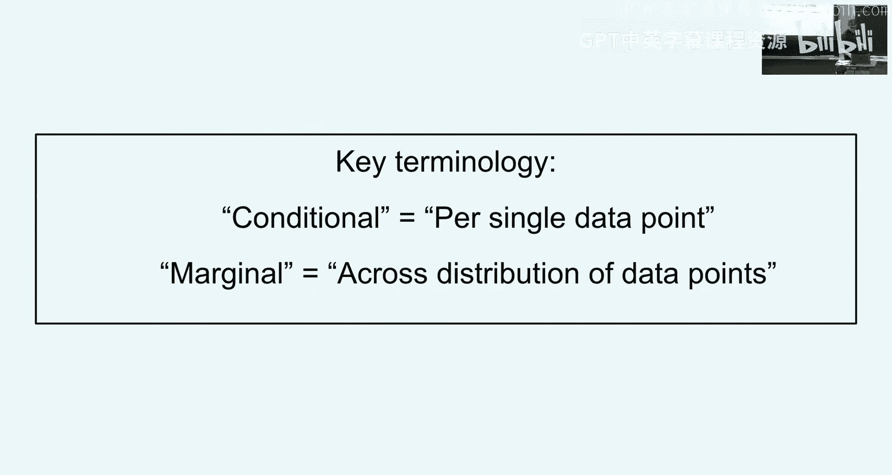

## 概率路径 📈

上一节我们介绍了流模型和扩散模型的基本概念，本节中我们来看看如何构建一个从噪声到数据的“路径”。

### 条件概率路径

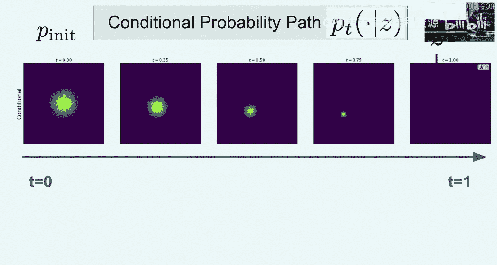

首先，我们为单个数据点定义一个“条件概率路径”。其核心思想是，在时间 `t=0` 时，我们从一个初始分布（通常是高斯分布）开始；在时间 `t=1` 时，我们希望分布坍缩到该单一数据点。

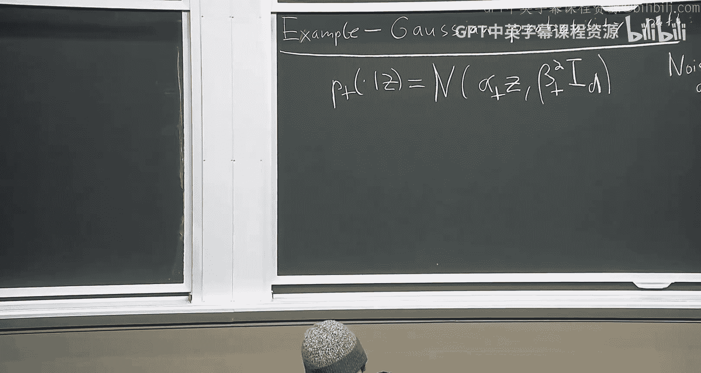

**定义**：给定一个数据点 `z`，条件概率路径 `p_t(x|z)` 是一个概率分布，它满足：
*   `p_0(x|z) = p_init(x)` （初始分布）
*   `p_1(x|z) = δ_z(x)` （坍缩到数据点 `z` 的狄拉克分布）

一个最常用且重要的例子是**高斯路径**，其公式为：
`p_t(x|z) = N(x; α_t * z, β_t^2 * I)`
其中 `α_t` 和 `β_t` 是噪声调度函数，满足 `α_0=0, α_1=1` 和 `β_0=1, β_1=0`。一个简单的选择是 `α_t = t`， `β_t = 1 - t`。

### 边际概率路径

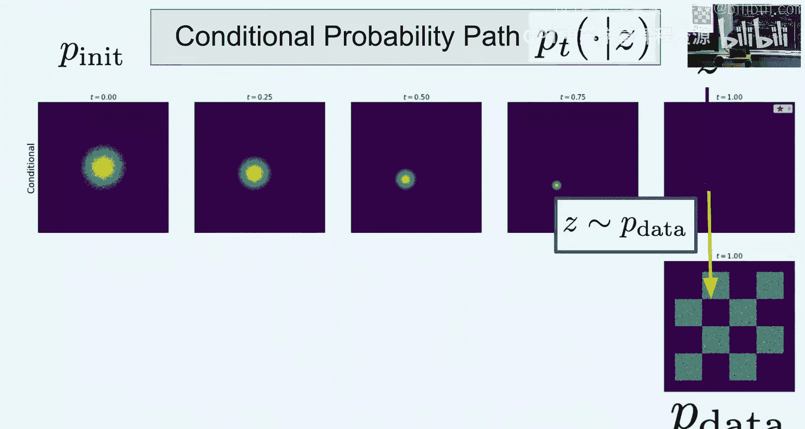

条件路径只针对单个数据点。为了生成整个数据分布，我们需要“边际化”，即对所有可能的数据点取平均。

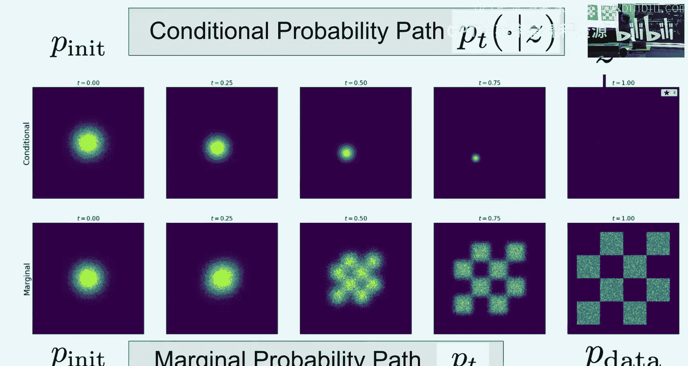

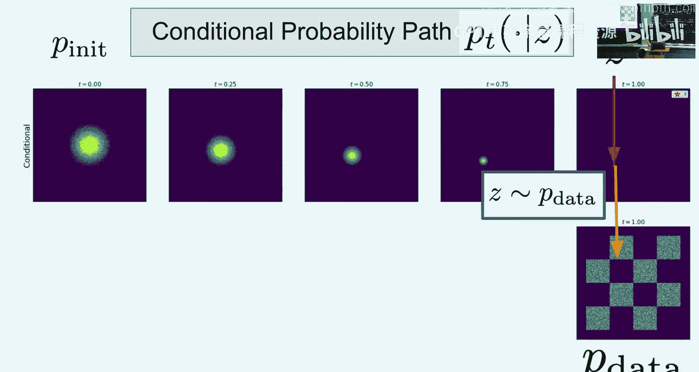

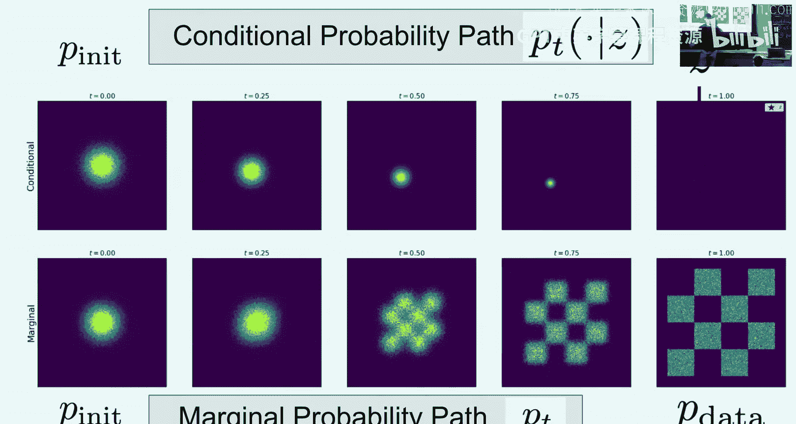

**定义**：边际概率路径 `p_t(x)` 是通过首先从数据分布 `p_data(z)` 中采样一个数据点 `z`，然后从条件路径 `p_t(x|z)` 中采样 `x` 而得到的分布。

其密度公式为：
`p_t(x) = ∫ p_t(x|z) p_data(z) dz`

这个路径具有我们期望的性质：
*   `p_0(x) = p_init(x)` （从噪声开始）
*   `p_1(x) = p_data(x)` （到达数据分布）

这样，我们就构建了一个从初始噪声分布平滑过渡到目标数据分布的“概率路径骨架”。

---

## 向量场 🧭

有了概率路径，我们需要一个向量场来引导粒子沿着这条路径运动。

### 条件向量场

对于每个数据点 `z`，我们定义一个条件向量场 `u_t(x|z)`。我们希望，如果从初始分布 `p_init` 开始，并沿着该向量场描述的常微分方程（ODE）前进，那么在任意时刻 `t`，粒子 `x_t` 的分布恰好就是条件概率路径 `p_t(x|z)`。

对于高斯路径，其对应的条件向量场有一个简单的解析解：
`u_t(x|z) = (α̇_t / α_t) * z + (β̇_t / β_t) * x`
其中 `α̇_t` 和 `β̇_t` 是 `α_t` 和 `β_t` 对时间的导数。

### 边际向量场与边际化技巧

条件向量场只能生成单个数据点。我们真正需要的是一个能生成整个数据分布的向量场，即边际向量场 `v_t(x)`。

**核心公式（边际化技巧）**：
`v_t(x) = ∫ u_t(x|z) * (p_t(x|z) p_data(z) / p_t(x)) dz`

这个公式可以直观理解为：在位置 `x` 和时间 `t`，边际向量场是所有可能“来源”数据点 `z` 的条件向量场的加权平均，权重是给定当前 `x` 时 `z` 的后验概率 `p(z|x, t)`。

最重要的是，这个边际向量场 `v_t(x)` 满足我们的终极目标：如果从 `p_init` 开始，并沿着 ODE `dx/dt = v_t(x)` 前进，那么粒子在任意时刻 `t` 的分布就是边际概率路径 `p_t(x)`。特别地，在 `t=1` 时，我们就得到了数据分布 `p_data(x)`。

---

## 得分函数与 SDE 扩展 🎲

上一节我们为确定性流（ODE）构建了目标，本节中我们来看看如何将其扩展到随机微分方程（SDE），即扩散模型。

### 条件与边际得分函数

得分函数定义为概率分布对数密度的梯度。

*   **条件得分函数**：`s_t(x|z) = ∇_x log p_t(x|z)`
*   **边际得分函数**：`s_t(x) = ∇_x log p_t(x)`

它们通过一个与边际向量场类似的公式关联：
`s_t(x) = ∫ s_t(x|z) * (p_t(x|z) p_data(z) / p_t(x)) dz`

对于高斯路径，条件得分函数有非常简单的形式：
`s_t(x|z) = -(x - α_t * z) / β_t^2`

### SDE 扩展技巧

现在我们有了边际向量场 `v_t(x)`，它对应的 ODE 能生成目标路径。一个关键的发现是，我们可以将这个 ODE 扩展为一族随机微分方程（SDE），它们**同样**能生成目标路径 `p_t(x)`。

**核心公式（SDE扩展技巧）**：
对于任意的扩散系数 `σ_t`，以下 SDE 的解 `x_t` 的分布都是 `p_t(x)`：
`dx = [v_t(x) - (1/2) * σ_t^2 * s_t(x)] dt + σ_t dW_t`

其中 `dW_t` 是维纳过程（布朗运动）。这个公式的意义在于：
1.  **统一框架**：当 `σ_t = 0` 时，SDE 退化为我们之前的 ODE（流模型）。
2.  **灵活性**：通过选择不同的 `σ_t`，我们可以得到无数种不同的、但都能从噪声生成数据的随机过程（扩散模型）。这为模型设计提供了巨大的灵活性。
3.  **得分函数的作用**：公式中的 `- (1/2) * σ_t^2 * s_t(x)` 项是一个修正项。因为注入了噪声（`σ_t dW_t`），我们需要在漂移项中减去一个由得分函数引导的项来进行补偿，以确保最终分布正确。

---

## 核心概念总结 📚

本节课我们一起学习了构建流模型和扩散模型训练目标所需的六个核心对象及其关键公式：

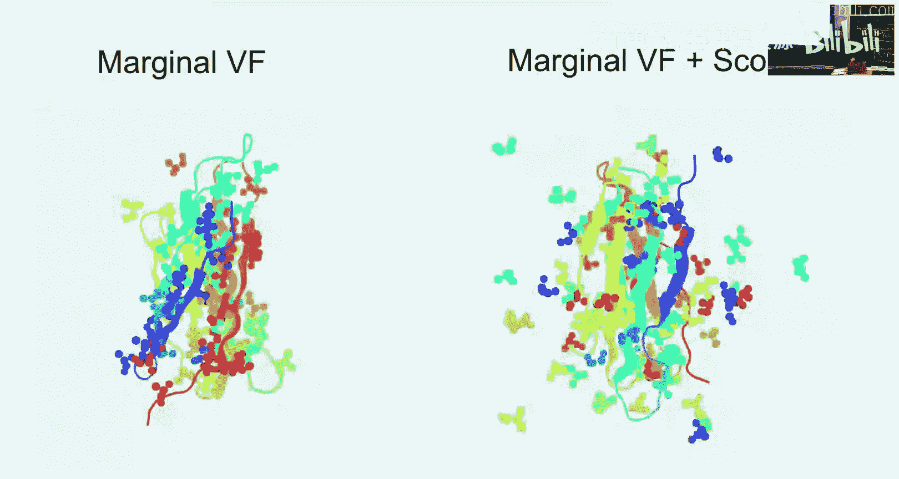

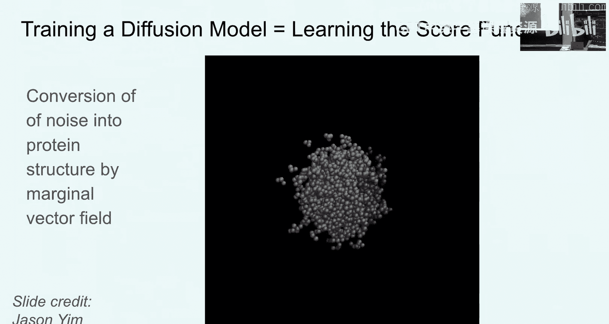

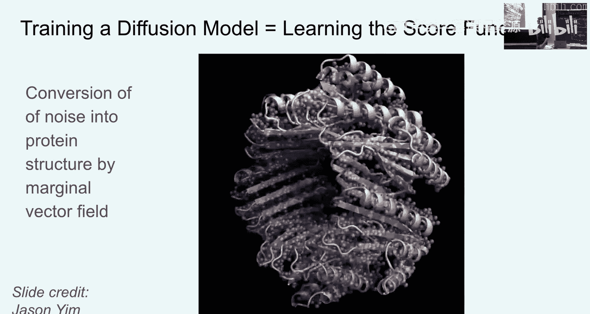

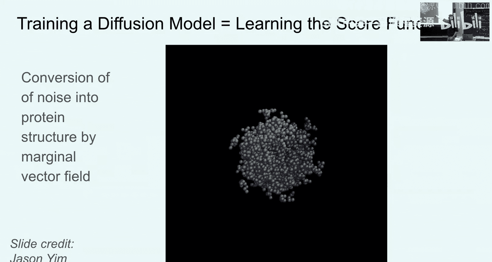

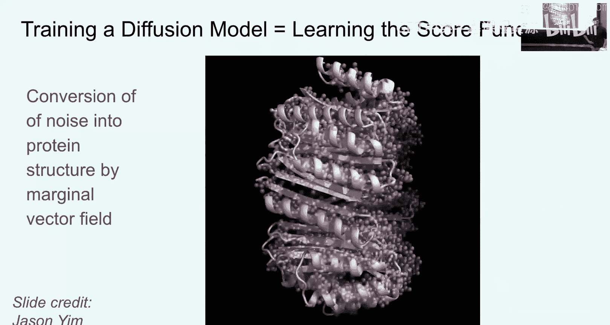

1.  **条件概率路径** `p_t(x|z)`：从噪声到单个数据点 `z` 的插值。
    *   **高斯示例**：`p_t(x|z) = N(x; α_t * z, β_t^2 * I)`
2.  **边际概率路径** `p_t(x)`：从噪声到整个数据分布的插值。
    *   **公式**：`p_t(x) = ∫ p_t(x|z) p_data(z) dz`
3.  **条件向量场** `u_t(x|z)`：引导粒子沿条件路径运动的向量场。
    *   **高斯示例**：`u_t(x|z) = (α̇_t / α_t) * z + (β̇_t / β_t) * x`
4.  **边际向量场** `v_t(x)`：引导粒子沿边际路径运动的向量场，是训练流模型的目标。
    *   **核心公式**：`v_t(x) = ∫ u_t(x|z) * [p_t(x|z) p_data(z) / p_t(x)] dz`
5.  **条件得分函数** `s_t(x|z)`：条件路径对数密度的梯度。
    *   **高斯示例**：`s_t(x|z) = -(x - α_t * z) / β_t^2`
6.  **边际得分函数** `s_t(x)`：边际路径对数密度的梯度，是训练扩散模型的目标之一。
    *   **核心公式**：`s_t(x) = ∫ s_t(x|z) * [p_t(x|z) p_data(z) / p_t(x)] dz`
    *   **SDE 形式**：与边际向量场共同构成扩散模型的生成过程：`dx = [v_t(x) - (1/2) * σ_t^2 * s_t(x)] dt + σ_t dW_t`

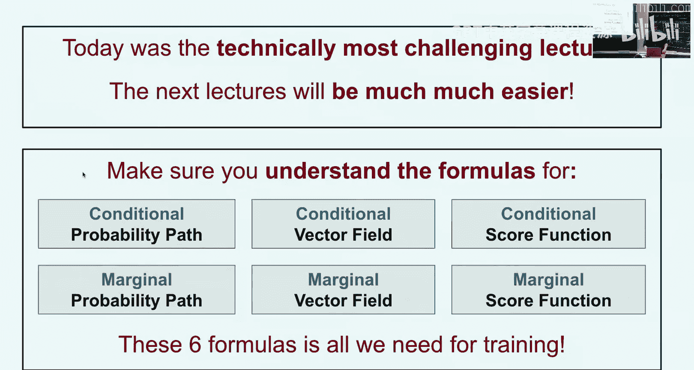

我们已经完成了理论推导中最具挑战性的部分，即找到了需要神经网络去逼近的目标 `v_t(x)` 和 `s_t(x)` 的明确公式。下一节课，我们将看到如何利用这些公式设计出非常简单而高效的训练算法。