# 3：训练流与扩散模型

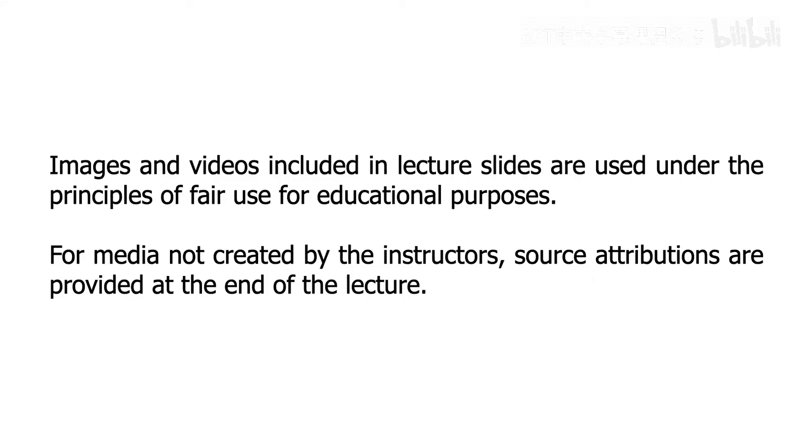

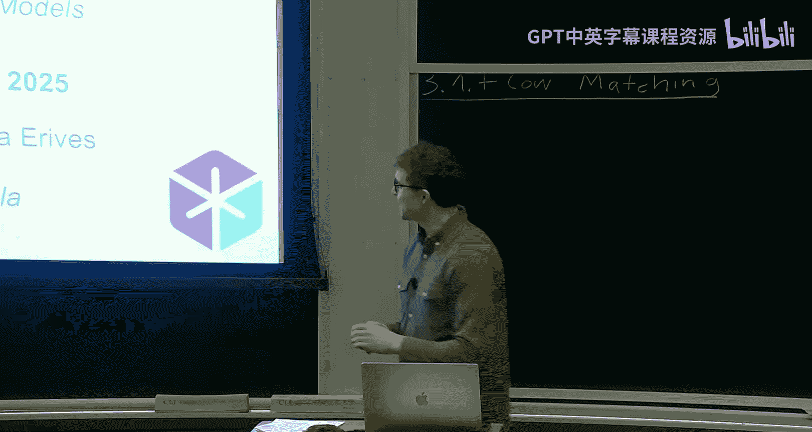

在本节课中，我们将学习如何训练流模型和扩散模型。我们将从回顾上一讲的核心概念开始，然后深入探讨两种核心的训练算法：流匹配和分数匹配。我们会看到，尽管直接学习目标函数（边际向量场或边际分数函数）是困难的，但我们可以通过一个巧妙的条件化技巧，转而学习一个可计算的替代目标，并最终达到相同的训练效果。

## 回顾：流与扩散模型

上一讲我们介绍了流模型和扩散模型的基本概念。

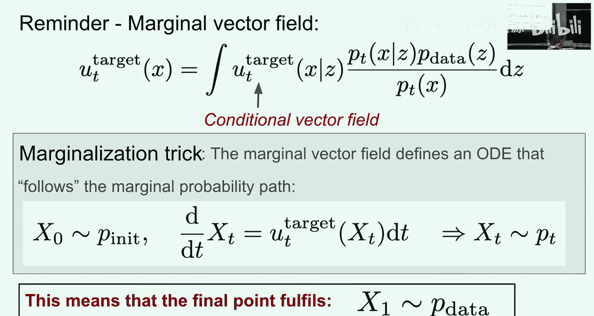

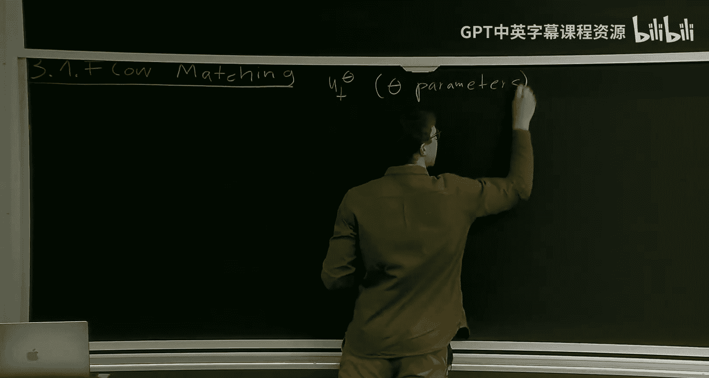

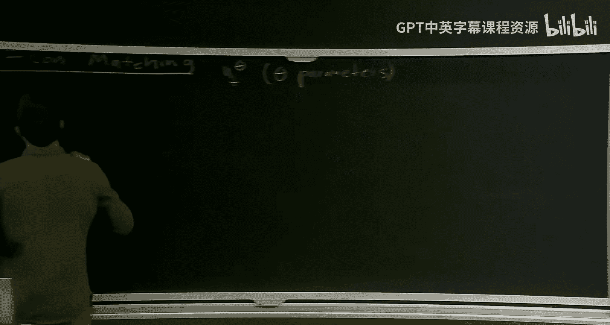

*   **流模型**：从一个初始分布（通常是高斯分布）开始，通过一个由神经网络定义的向量场来模拟常微分方程，从而生成数据。
*   **扩散模型**：同样从初始分布开始，但模拟一个随机微分方程，其中包含一个由向量场定义的ODE分量和一个由扩散系数缩放的噪声项。

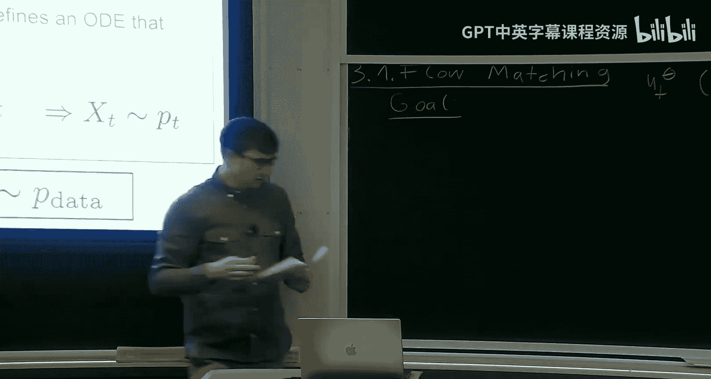

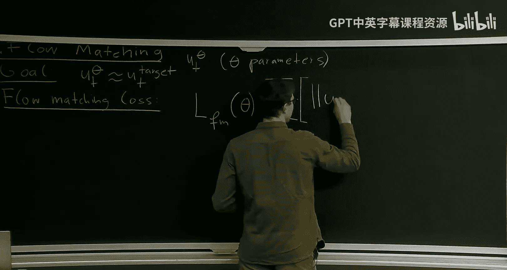

我们定义了三个核心对象，每个对象都有其条件形式和边际形式：

1.  **概率路径**：在初始分布和数据点之间进行插值。对于高斯概率路径，其条件形式为：`p_t(x|z) = N(x; α_t z, β_t^2 I)`，其中 `α_t` 从0增加到1，`β_t` 从1减少到0。
2.  **条件向量场**：其ODE遵循条件概率路径。对于高斯路径，其形式为：`u_t(x|z) = (α̇_t z + β̇_t ε) / (α_t z + β_t ε)` 的期望，其中 `ε ~ N(0, I)`。
3.  **条件分数函数**：条件概率路径对数似然的梯度。对于高斯路径，其形式为：`s_t(x|z) = -(x - α_t z) / β_t^2`。

通过将数据点 `z` 视为来自数据分布的随机变量，我们得到了对应的**边际**对象：
*   边际概率路径 `p_t(x)` 在 `p_0`（初始分布）和 `p_1`（数据分布）之间插值。
*   边际向量场 `u_t(x)` 是其ODE遵循边际路径的向量场。
*   边际分数函数 `s_t(x)` 是边际概率路径对数似然的梯度。

本讲的目标是将学习边际向量场和边际分数函数转化为两种可训练的算法：**流匹配**和**分数匹配**。

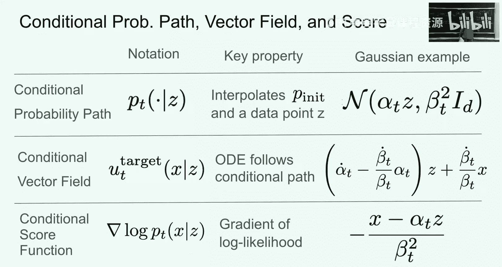

## 流匹配

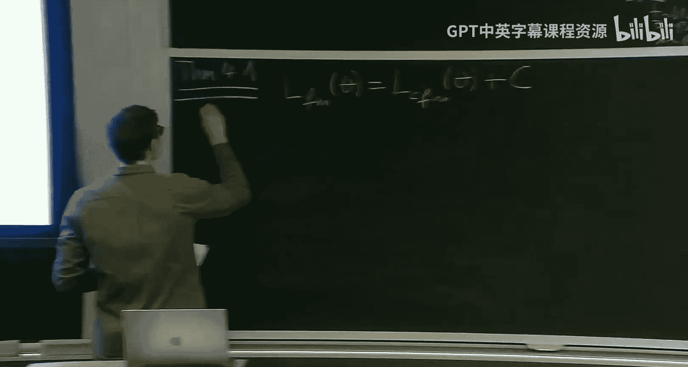

我们首先从流模型开始，这引出了**流匹配**方法。

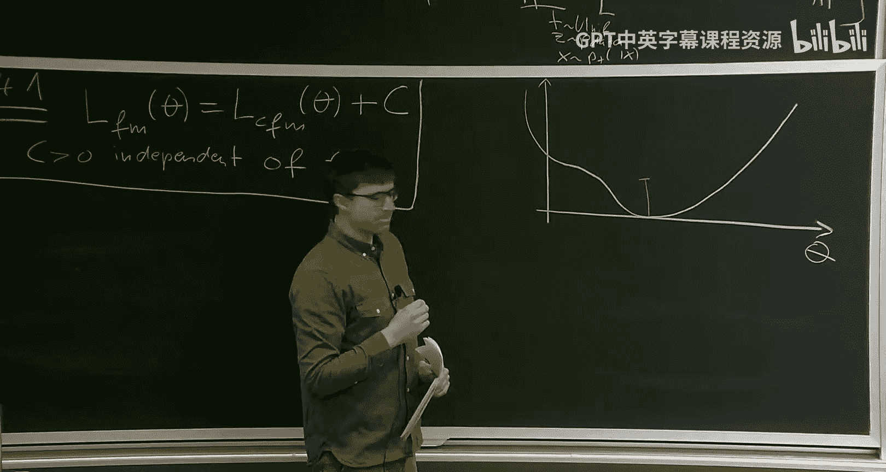

我们的目标是训练一个神经网络 `v_t(x; θ)`，使其近似于**边际向量场** `u_t(x)`。因为如果我们成功做到了这一点，那么用这个神经网络替换掉ODE中的向量场并进行模拟，就能将噪声转化为数据。

一个自然的想法是使用均方误差作为损失函数，直接让网络去匹配边际向量场：

`L_FM(θ) = E_{t~U(0,1), x~p_t(x)} [ || v_t(x; θ) - u_t(x) ||^2 ]`

然而，这个损失是**难以处理的**，因为我们无法直接计算边际向量场 `u_t(x)`，它涉及一个高维积分（对所有数据点 `z` 求期望）。

为了解决这个问题，我们转向一个**条件损失**。我们不是让网络去匹配难以计算的边际向量场，而是让它去匹配我们已知解析形式的**条件向量场** `u_t(x|z)`：

`L_CFM(θ) = E_{t~U(0,1), z~p_data, x~p_t(x|z)} [ || v_t(x; θ) - u_t(x|z) ||^2 ]`

这个损失是**可处理的**，因为我们可以轻松地从条件概率路径 `p_t(x|z)` 中采样 `x`（例如，对于高斯路径，`x = α_t z + β_t ε`），并且我们知道 `u_t(x|z)` 的公式。

关键定理指出：**流匹配损失 `L_FM` 和条件流匹配损失 `L_CFM` 只相差一个与网络参数 `θ` 无关的常数 `C`**。即：

`L_FM(θ) = L_CFM(θ) + C`，其中 `C` 独立于 `θ`。

这意味着：
1.  两个损失函数具有**相同的最小值点**。最小化 `L_CFM` 得到的网络参数，同样也是 `L_FM` 的最小值点，即我们的目标——边际向量场。
2.  两个损失函数关于参数 `θ` 的**梯度是相同的**。因此，使用随机梯度下降等优化算法进行训练时，无论最小化哪个损失，其训练轨迹都是一样的。

基于此，我们得到了**流匹配训练算法**：
1.  准备一个数据集，一个代表向量场的神经网络 `v_t(x; θ)`。
2.  循环以下步骤：
    *   从数据集中采样一个数据点 `z`。
    *   从均匀分布 `U(0,1)` 中采样一个时间 `t`。
    *   从条件概率路径 `p_t(x|z)` 中采样一个点 `x`（例如，采样噪声 `ε ~ N(0, I)`，计算 `x = α_t z + β_t ε`）。
    *   计算损失：`loss = || v_t(x; θ) - u_t(x|z) ||^2`。
    *   根据损失梯度更新网络参数 `θ`。

### 实例：高斯概率路径与直线路径

让我们将上述通用算法具体化到我们熟悉的高斯概率路径。回忆一下，条件向量场为：

`u_t(x|z) = (α̇_t / α_t) * ( (β_t^2)/(α_t^2 β_t^2?) * (z - (α_t/β_t?)x) )` （注：此处应为简化后的形式，更清晰的推导见下文）

更直观地，我们可以利用重参数化技巧。我们从 `p_t(x|z) = N(x; α_t z, β_t^2 I)` 中采样 `x`，这等价于 `x = α_t z + β_t ε`，其中 `ε ~ N(0, I)`。将这个 `x` 代入条件向量场公式并进行代数简化（过程略），对于一般的高斯路径，损失函数中的目标会简化为一个与 `z` 和 `ε` 相关的线性组合。

一个特别简单且常用的选择是**直线路径**（或称为CondOT路径）：令 `α_t = t`, `β_t = 1 - t`。此时：
*   `α̇_t = 1`, `β̇_t = -1`
*   条件概率路径：`p_t(x|z) = N(x; t z, (1-t)^2 I)`
*   采样：`x = t z + (1-t) ε`
*   经过代入简化后，条件向量场 `u_t(x|z)` 简化为：`u_t(x|z) = z - ε`

因此，条件流匹配损失变为：

`L_CFM(θ) = E_{t, z, ε} [ || v_t( t*z + (1-t)*ε ; θ) - (z - ε) ||^2 ]`

**解读**：在这个简单设定下，训练变得极其直观。
1.  我们采样一个数据点 `z` 和一个噪声点 `ε`。
2.  我们在连接 `ε`（时间 `t=0` 时）和 `z`（时间 `t=1` 时）的直线上，根据时间 `t` 选取一个点 `x = t z + (1-t) ε`。
3.  我们将这个点 `x` 和当前时间 `t` 输入神经网络。
4.  神经网络的目标是预测从当前点 `x` 指向数据点 `z` 的方向（即 `z - ε`），这本质上是该直线路径在当前点的“速度”。

许多成功的模型（如某些视频生成模型）的核心训练算法正是这个简单的形式。

**生成样本**：训练完成后，要生成新样本，我们只需从初始分布（如 `N(0, I)`）采样一个点，然后使用训练好的神经网络 `v_t(x; θ)` 作为向量场，从 `t=0` 到 `t=1` 数值求解ODE即可。

## 分数匹配

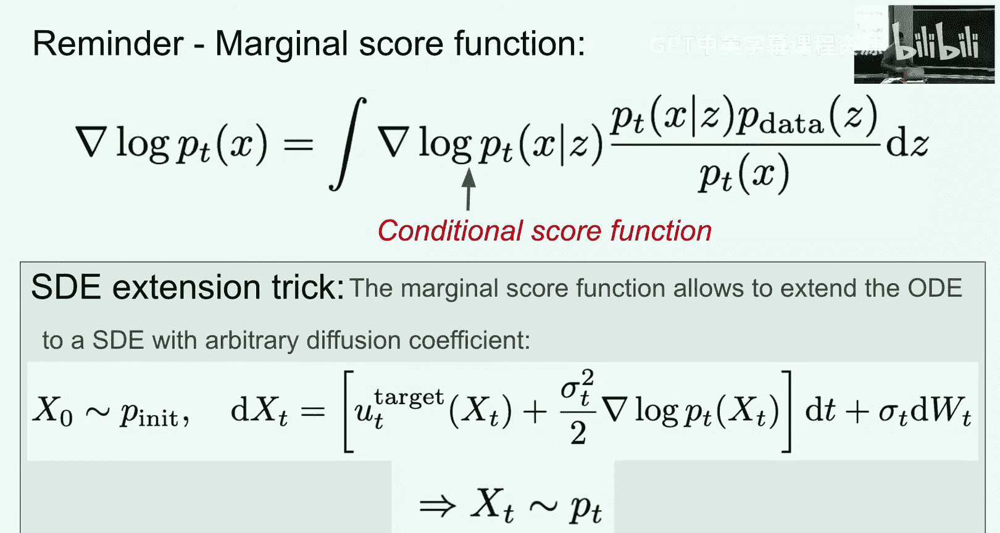

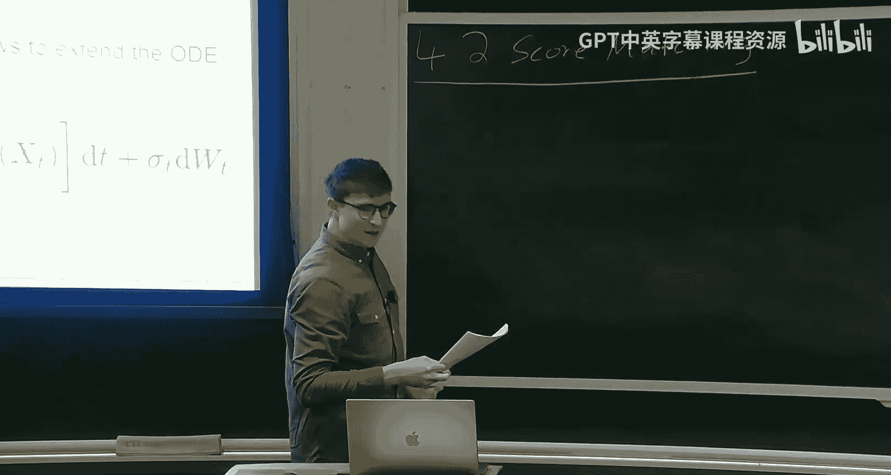

现在，我们将相同的原理应用到扩散模型上，这引出了**分数匹配**方法。

对于扩散模型，我们的目标是训练一个**分数网络** `s_t(x; θ)`，使其近似于**边际分数函数** `∇ log p_t(x)`。边际分数函数同样具有与边际向量场类似的积分形式，直接学习它也是难以处理的。

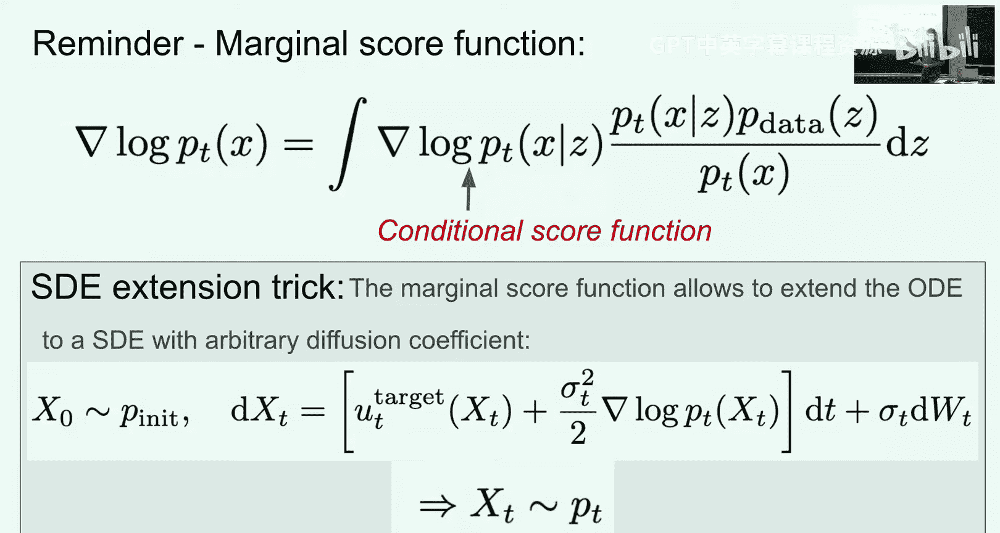

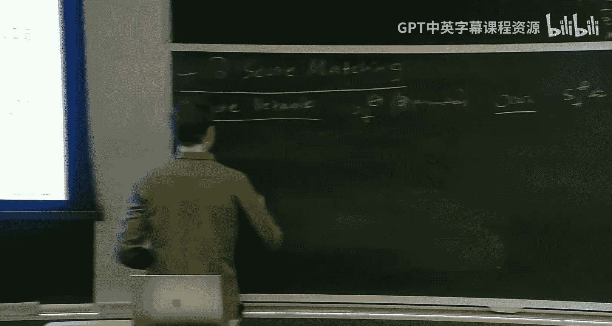

我们同样可以定义：
*   **分数匹配损失**：`L_SM(θ) = E_{t, x~p_t(x)} [ || s_t(x; θ) - ∇ log p_t(x) ||^2 ]` （难以处理）
*   **去噪分数匹配损失**：`L_DSM(θ) = E_{t, z~p_data, x~p_t(x|z)} [ || s_t(x; θ) - ∇ log p_t(x|z) ||^2 ]` （可处理）

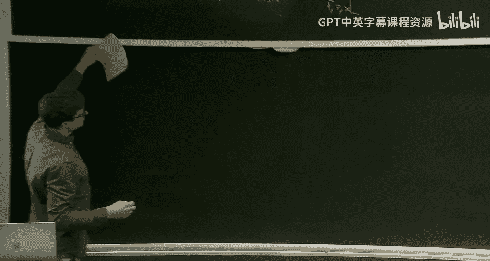

一个与流匹配类似的关键定理成立：`L_SM(θ) = L_DSM(θ) + C`，其中 `C` 是一个与 `θ` 无关的常数。

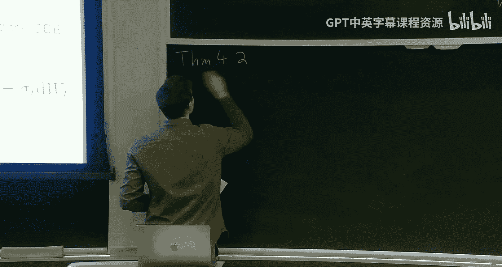

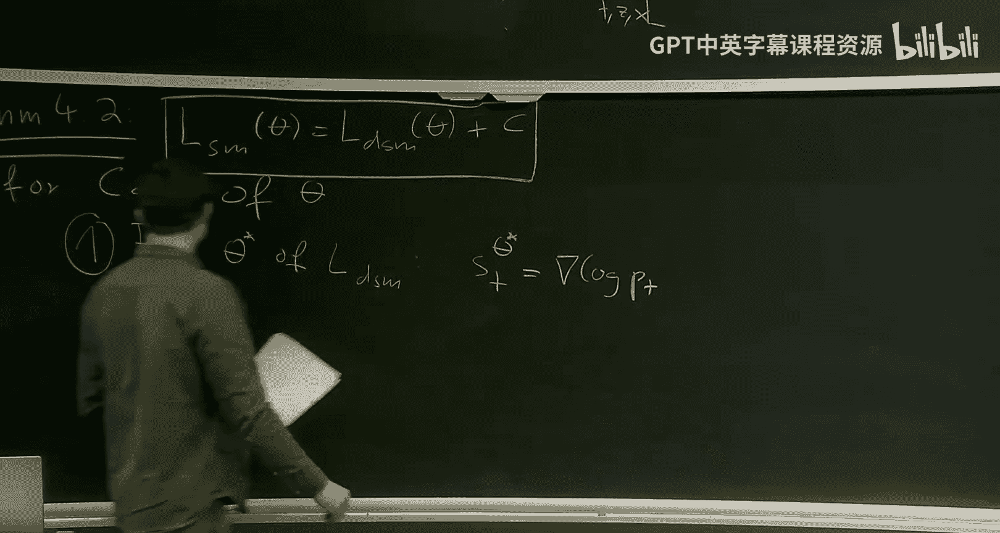

因此，最小化可处理的 `L_DSM` 同样能让我们学到边际分数函数 `∇ log p_t(x)`。

### 实例：高斯概率路径下的分数匹配

对于高斯概率路径 `p_t(x|z) = N(x; α_t z, β_t^2 I)`，其条件分数函数有简单的解析形式：

`∇ log p_t(x|z) = -(x - α_t z) / β_t^2`

再次使用重参数化 `x = α_t z + β_t ε`，我们可以将其代入：

`∇ log p_t(x|z) = -( (α_t z + β_t ε) - α_t z ) / β_t^2 = -ε / β_t`

因此，去噪分数匹配损失简化为：

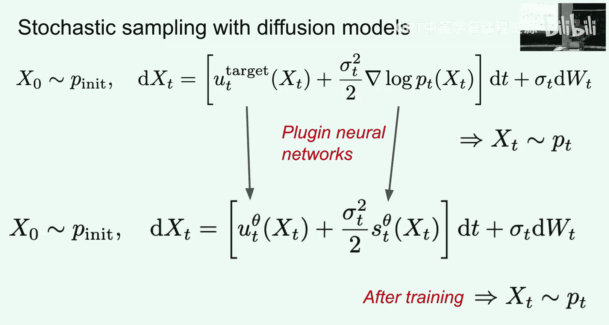

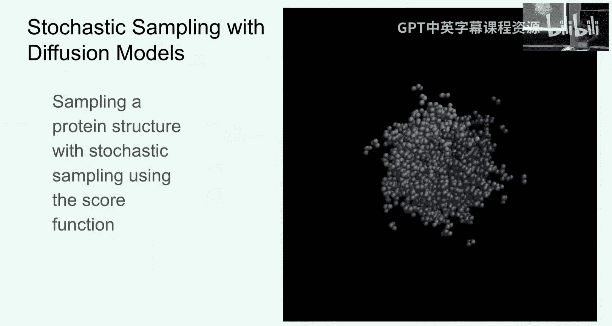

`L_DSM(θ) = E_{t, z, ε} [ || s_t( α_t z + β_t ε ; θ) - (-ε / β_t) ||^2 ] = E_{t, z, ε} [ || s_t( α_t z + β_t ε ; θ) + ε / β_t ||^2 ]`

**解读**：在这个设定下，分数网络的学习目标是：给定一个被噪声扰动后的数据点 `x = α_t z + β_t ε`，预测出用于扰动数据的噪声 `ε` 的方向（并缩放 `1/β_t`）。这正是“去噪”分数匹配名称的由来。

**注意**：当时间 `t` 接近1时，`β_t` 接近0，目标 `-ε / β_t` 会变得非常大，导致训练不稳定。实践中常采用一些技巧，例如预测未缩放的噪声 `ε`，并在损失函数中相应地调整权重。

**生成样本**：训练好分数网络 `s_t(x; θ)` 后，我们将其与向量场（可能通过关系式转换得到，见下文）一起代入之前讲过的SD公式，从 `t=0` 到 `t=1` 数值求解SDE，即可生成样本。

## 流匹配与分数匹配的联系

对于**高斯概率路径**这一特例（即去噪扩散模型），条件向量场和条件分数函数之间存在一个重要的线性关系。通过代数运算，我们可以将其中一个表示为另一个的线性组合。

这意味着，在这个特例下，**流匹配和分数匹配学到的本质是相通的信息**。训练完成后，我们可以通过一个简单的公式在学到的分数网络和向量场网络之间进行转换，而无需分别训练两个网络。这也解释了为什么早期的扩散模型论文通常只讨论分数匹配——因为它们隐含地依赖于高斯路径假设，从而可以通过分数函数推导出生成所需的其他量。

然而，在更一般的概率路径设定下，向量场和分数函数是两个独立的对象，可能需要分别学习（或在一个网络中有两个输出头）。

## 总结与展望

本节课我们一起学习了训练流模型和扩散模型的核心算法。

*   **流匹配**：通过最小化一个简单的条件损失（匹配条件向量场），我们可以间接地学到能将噪声转化为数据的边际向量场。
*   **分数匹配**：通过最小化去噪分数匹配损失（匹配条件分数），我们可以间接地学到边际分数函数，用于构建扩散模型的生成过程。
*   **关键洞见**：两种方法都依赖于“边际损失与条件损失只差一个常数”这一核心定理，使得我们可以避开难以处理的高维积分，转而使用可计算的条件目标进行训练。
*   **具体实例**：在高斯概率路径（尤其是直线路径）的设定下，训练算法变得非常直观和简洁。

这基本上结束了本课程的理论核心部分。在接下来的课程中，我们将探讨更应用层面的内容：
*   **神经网络架构**：如何为图像、视频等数据设计合适的 `v_t(x; θ)` 或 `s_t(x; θ)` 网络结构。
*   **条件生成**：如何根据文本提示语（Prompt）生成可控的内容。
*   **实际构建**：如何一步步构建一个图像或视频生成器。
*   **前沿应用**：我们还将邀请客座讲师，分享扩散模型在机器人学、蛋白质设计等领域的激动人心的应用。

通过本讲的学习，你已经掌握了现代流与扩散生成模型背后最基础的训练原理。