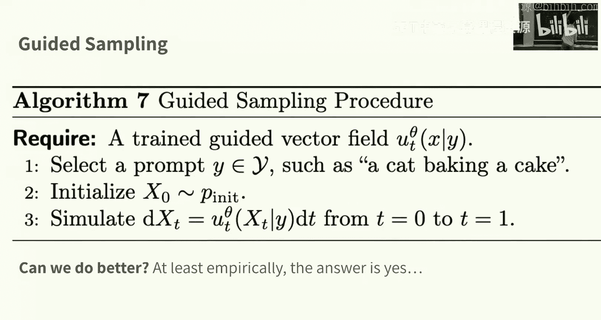
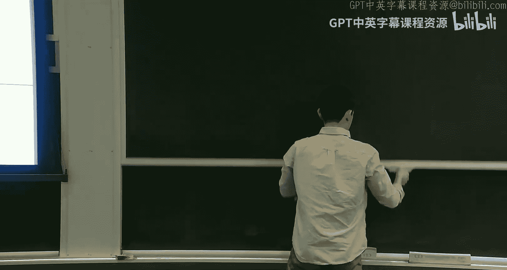
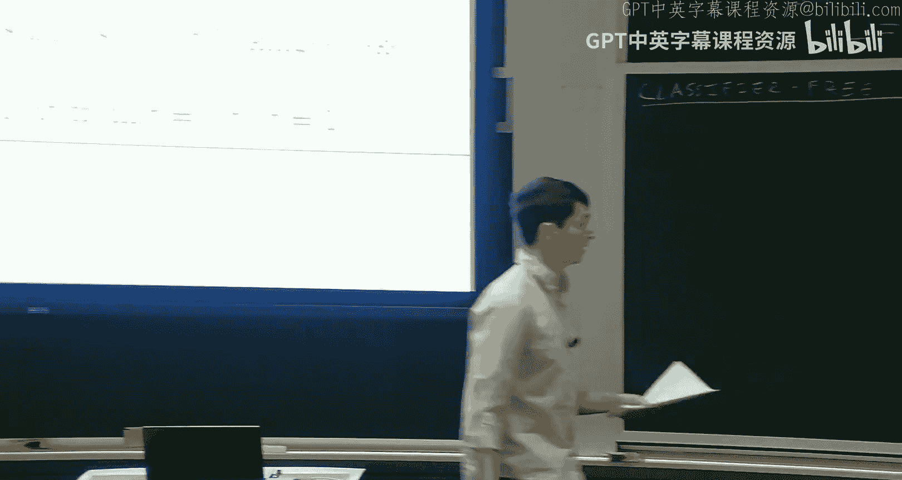
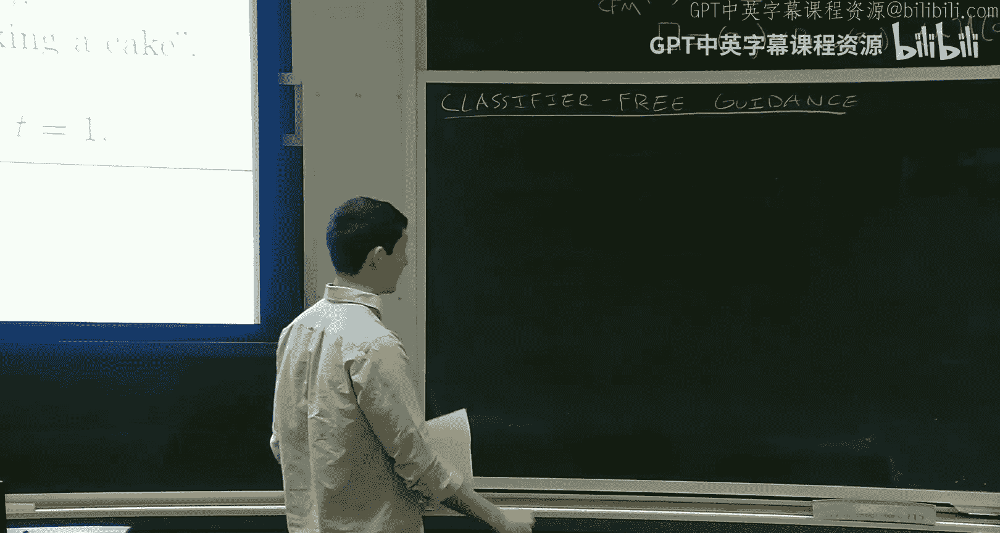
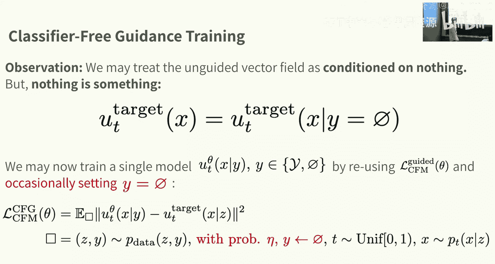
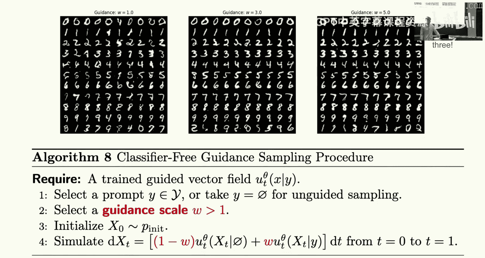
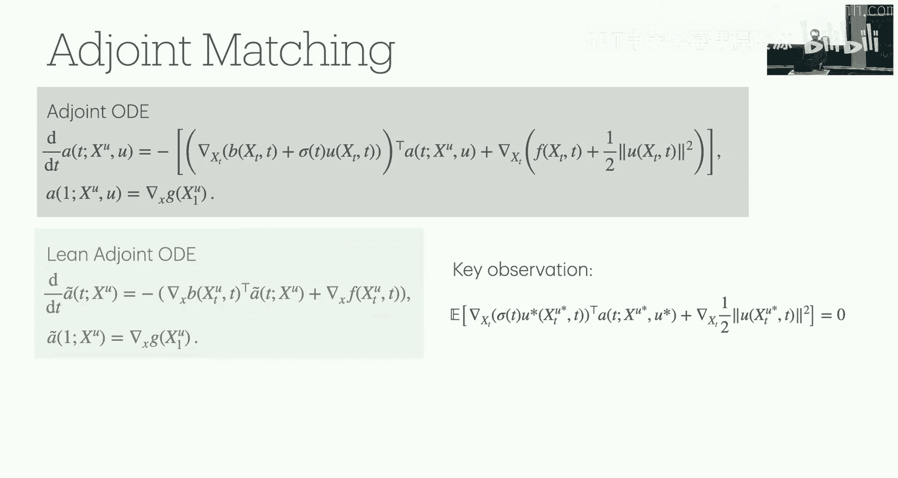

# 4：构建图像生成器

在本节课中，我们将把之前学习的无条件生成框架扩展到条件生成任务，即根据给定的提示或标签生成内容。我们将重点探讨图像生成这一典型示例，学习一种在实践中广泛使用的条件采样技术——无分类器引导，并讨论用于图像生成的架构选择，最后通过稳定扩散3模型进行案例分析。

## 从无条件生成到条件生成

上一节我们介绍了无条件生成，即从数据分布 `P_data` 中生成样本。我们开发了条件流匹配等训练目标，用于训练一个边际向量场模型 `U_T_theta(x)`。通过模拟相应的常微分方程，我们可以从学习到的分布中进行采样。

然而，在实践中，我们通常希望进行条件生成，即根据一些辅助信息（如文本提示或类别标签）来生成内容。例如，给定提示“戴着珍珠耳环的沼泽食人魔”，生成对应的图像。这被称为**引导生成**，我们根据变量 `y` 进行条件化生成。

在引导生成设置中，我们的符号需要相应调整。边际概率路径变为**引导边际概率路径** `P_t(x|y)`，向量场变为**引导边际向量场** `U_t(x|y)`。我们的目标是训练一个引导模型 `U_T_theta(x|y)`。

## 构建引导流匹配目标

为了训练引导模型，我们需要一个引导版本的流匹配目标。以下是构建该目标的关键步骤：

*   **固定 `y` 的情况**：如果我们固定一个特定的 `y`，问题就简化为我们之前讨论过的无条件生成问题。我们可以为这个固定的 `y` 构建一个条件流匹配目标。
*   **让 `y` 变化**：为了处理所有可能的 `y`，我们让 `y` 也从其分布中采样。此时，我们的目标分布变成了数据 `Z` 和条件 `y` 的联合分布 `P_data(Z, y)`。训练目标变为对所有可能的 `y` 进行“摊销”或平均。

最终的引导流匹配目标公式如下：
`L_CFM_guided(theta) = E_{(Z,y)~P_data, t~U(0,1), x~P_t(·|Z)} [ || U_T_theta(x|y) - U_t_target(x|Z) ||^2 ]`

通过这个目标，我们可以训练引导向量场 `U_T_theta(x|y)`。

## 采样与无分类器引导

训练好引导向量场后，我们可以进行采样：选择一个提示 `y`，从初始分布 `P_init` 初始化，然后模拟对应的引导常微分方程 `dx/dt = U_T_theta(x|y)`，从 `t=0` 到 `t=1`，最终得到样本 `x_1`。

理论上，如果模型完美学习，这将从真实的条件分布 `P_data(x|y)` 中采样。然而在实践中，人们发现通过一种称为**无分类器引导** 的技术，可以在多样性和感知质量之间取得更好的权衡。

无分类器引导的核心思想是，我们不直接使用理论上的引导向量场，而是对其进行修改，以放大条件信息 `y` 的影响。具体推导基于高斯概率路径，并利用贝叶斯定理，最终得到一个关键公式：

`U_t_tilde(x|y) = (1 - w) * U_t_target(x) + w * U_t_target(x|y)`

其中：
*   `U_t_target(x)` 是无引导（无条件）向量场。
*   `U_t_target(x|y)` 是引导（有条件）向量场。
*   `w` 是**引导尺度**，一个大于1的超参数。

这个公式表明，无分类器引导的向量场是**无条件向量场和有条件向量场的加权平均**。当 `w > 1` 时，我们放大了条件信息的作用。

## 无分类器引导的训练与采样

为了使用无分类器引导，我们需要一个能同时处理有条件 `y` 和“空”条件（即无条件）的单一模型。以下是训练和采样的关键步骤：

*   **训练**：我们训练一个模型 `U_T_theta(x|y)`。在训练时，我们以概率 `η` 随机将条件 `y` 替换为一个特殊的“空”标记（如 `∅`）。这样，模型就学会了同时处理有条件和无条件的情况。
*   **采样**：采样时，我们选择一个提示 `y` 和一个引导尺度 `w > 1`。然后，我们使用上面定义的 `U_t_tilde(x|y)` 向量场来模拟常微分方程，从而获得样本。

提高引导尺度 `w` 通常会生成感知质量更高、更符合提示的图像，但可能会牺牲一些多样性。这在图像生成中是一个常见的权衡。

## 图像生成的架构考量

对于像图像这样的高维数据，简单的多层感知机效率低下。我们需要专门的架构。以下是两种主流选择：

*   **U-Net**：基于卷积的架构，形似字母“U”。它包含编码器（下采样，增加通道数）、中间块和解码器（上采样，减少通道数），并有跳跃连接。条件信息 `y` 和时间步 `t` 被嵌入并注入到网络层中。
*   **扩散Transformer**：基于注意力机制的架构。首先将图像分割成块，将每个块嵌入为一个向量，然后使用Transformer块在这些块之间进行注意力计算。这种方法更适合处理长程依赖关系。

此外，一个常见的设计模式是**在潜在空间中训练**。我们使用一个预训练的自编码器将图像压缩到一个更低维的潜在空间，然后在这个潜在空间中训练扩散模型。这可以让生成模型专注于感知上重要的特征，并降低计算成本。稳定扩散等先进模型都采用了这种模式。

## 案例研究：稳定扩散3

稳定扩散3是一个先进的文本到图像生成模型，它综合运用了我们讨论的许多概念：
*   **训练目标**：使用条件流匹配。
*   **潜在空间**：在预训练自编码器的潜在空间中操作。
*   **架构**：使用多模态扩散Transformer块，能够处理来自CLIP和T5等模型的复杂文本嵌入。
*   **引导**：采用无分类器引导来提升生成质量。

## 总结

本节课中，我们一起学习了如何将流匹配模型扩展到条件生成任务。我们首先建立了引导流匹配目标，然后深入探讨了在实践中至关重要的无分类器引导技术，理解了其如何通过加权平均无条件与有条件向量场来权衡生成质量与多样性。接着，我们分析了适用于高维图像生成的U-Net和扩散Transformer等关键架构，并了解了在潜在空间训练的优势。最后，通过稳定扩散3的案例，我们看到了这些理论和技术如何结合应用于先进的生成模型中。