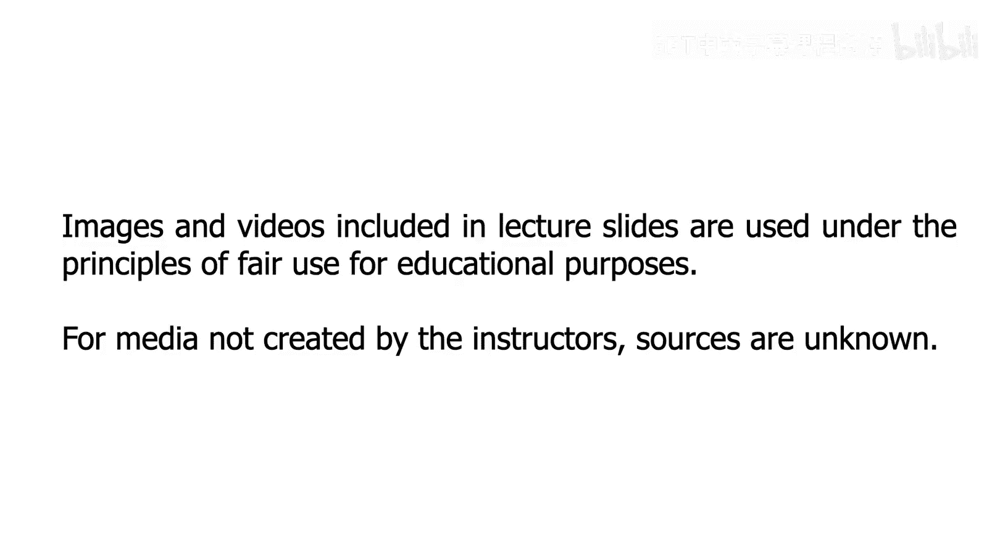
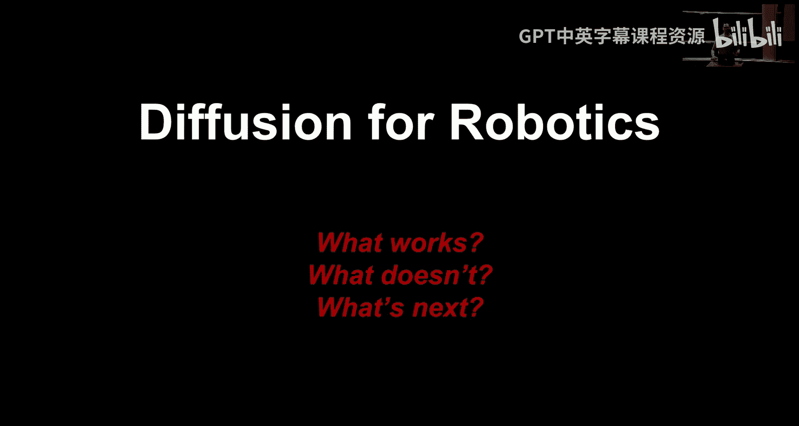
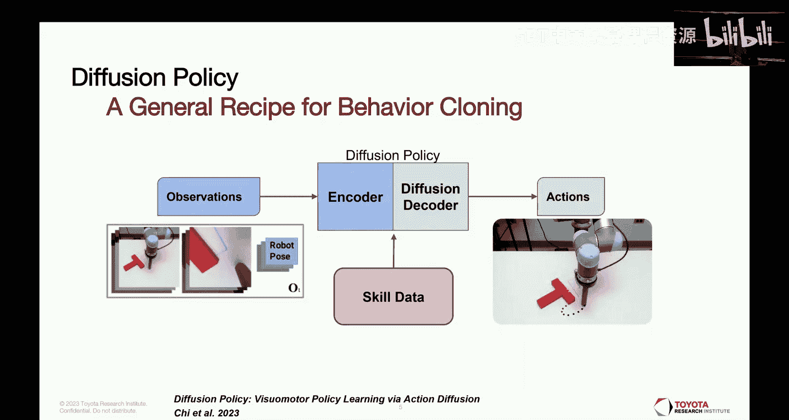
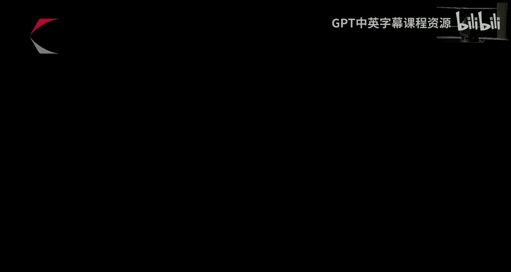
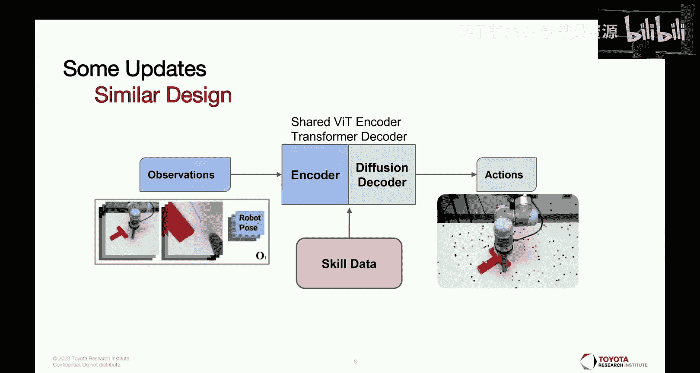
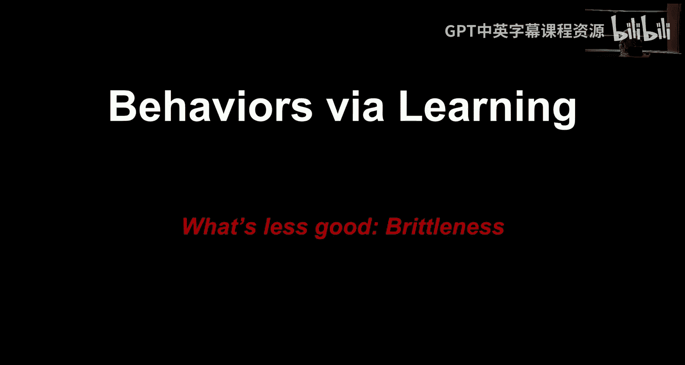
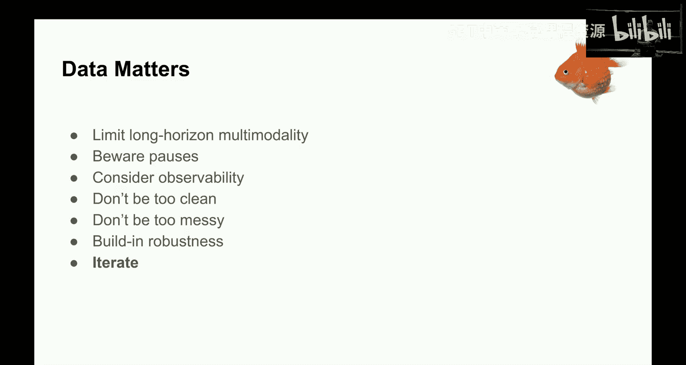
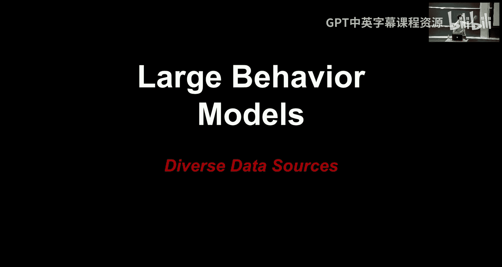
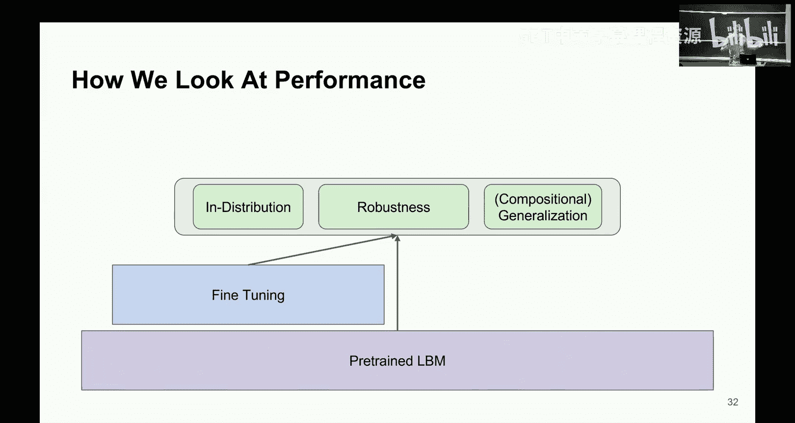

# 5：机器人学中的扩散模型 🦾

在本节课中，我们将学习如何将扩散模型这一强大的生成建模工具应用于机器人学领域。我们将探讨其基本方法、实际应用中的设计决策、当前面临的挑战以及该领域的最新发展方向。

---

在过去的几周里，我们学习了流匹配与扩散模型作为强大的生成模型，可以从分布中进行采样。原则上，这项技术可以应用于多种学科。今天，我们将关注其中的两个领域，并从机器人学开始。

我们非常荣幸地邀请到丰田研究院的团队负责人兼资深研究科学家 Ben Bfield 来为我们讲解。他在将扩散模型应用于机器人学领域是一位真正的领导者。

本次讲座的格式将与过去几周有所不同。大家现在应该已经熟悉了扩散和流匹配的技术细节。我将更多地谈谈在实践中将这些技术应用于机器人学时的情况。由于数据规模的差异以及对闭环性能的关注，许多细节实际上与图像生成等任务有很大不同。

首先，进行一些背景介绍。我所在的部门致力于应用人工智能解决机器人学问题，我们称之为“大型行为模型”，这类似于大型语言模型，但这些模型可以部署在机器人上并直接指挥底层动作。我们的使命是双重的：一方面推动基于学习的机器人技术的前沿，另一方面建立基于人工智能的操控科学。

我个人的背景始于计算机视觉和计算摄影，后来对生成建模产生了浓厚兴趣，并最终发现机器人学是这些技术最酷、最令人兴奋的应用领域。

本次讲座主要分为三个部分，并且希望是高度互动的。我将从当前能做什么开始，介绍使其在机器人上工作需要做出的设计决策，也会谈谈尚未解决的问题，最后讨论我们以及整个领域最近在将扩散方法应用于机器人学方面的最新进展。

---

## 扩散模型概述 🤖

基本方法实际上与图像扩散非常相似。最简单的形式是，你现在不是根据语言提示生成图像，而是根据机器人的观测进行条件生成。

你可以将其视为创建一个单一的行为。你有一个想让机器人执行的任务。现在你有一个扩散模型，它以来自机器人摄像头和机器人本体感知的观测作为条件。然后，你所做的不是去噪一张图像，而是去噪未来轨迹上的路径点。

这些是10赫兹的命令。我们瞬时预测未来一段时间（例如两秒）内密集的路径点。然后我们在线进行推理。实际上，我们不会完整地展开预测的未来窗口。一旦完成下一组推理，就会切换到新的计划。因此，你将这个扩散过程置于一个循环中。结果就是，你真正需要的是能在至少一秒内完成推理的模型。

这是一个非常简单的2D示例，可以轻松可视化扩散模型的输出。这里的姿态只是空间中的一个点，没有方向。例如，将一个方块推到新位置的任务，你可以看到在开始去噪过程时，你的轨迹是随机噪声，然后你将其扩散成连贯的东西。

---

事实证明，使用这个基本方法可以做很多事情。以下是我最喜欢的例子之一。这仍然是“一次一个行为”的基本形式，但加入了许多技巧，并且完全没有特定于该行为的代码。我们只是收集了几百个示例，就能得到能自动恢复和重试的行为。

对于任何熟悉机器人学历史的人来说，在三、四年前，这基本上是不可能的。但现在，我们可以在几天内轻松完成。这从根本上来说是一件新事物。

---

## 数据收集与模型设计 📹

就像训练图像去噪模型需要大型图像数据集一样，我们从一个动作数据集开始。遥操作是最自然的数据收集方式。我们使用最复杂的遥操作设备，它能给操作者触觉反馈。我们也经常使用VR教学，还有一个在图形设计中常见的六自由度鼠标。我们甚至有一种方法，让人们手持一个数据收集设备，就像一个带有腕部摄像头的玩具夹爪。

在实践中，我们通过所有这些方法收集数据，然后将它们合并在一起。在本讲座的第二部分，我将讨论如何将其扩展到单一行为之外。

我们使用过几种不同的机器人形态。这个特定的机器人有一个四摄像头包：两个场景摄像头（安装在桌子上方的三脚架上）和每个夹爪上方的腕部摄像头。我们最近已经升级到六摄像头配置。

我们逐渐意识到，在腕部安装摄像头实际上非常重要。对于这种静态机器人，如果场景摄像头总是在世界中的同一位置，训练出的策略会学会假设摄像头就在那个精确的位置。如果你稍微碰一下摄像头，一切都会崩溃。一个我们没想到的解决方案是，当我们开始使用腕部摄像头时，它们实际上充当了所学特征的图像随机化器，因为它们总是在移动且有很高的多样性。这很大程度上解决了静态场景摄像头的脆弱性问题。

当你训练机器人行为时，这实际上是非常少量的数据。一个行为可能持续一分钟，以10赫兹采样，每个片段有600个样本。如果你训练100个片段，可能只有几万个数据点。令人惊讶的是，即使这样它也能工作。

对于这里展示的以及接下来要展示的一些内容，它是一次一个行为。我们现在以及整个领域真正转向的是训练一个能做许多事情的通用模型。常见的方法是通过语言条件化。你告诉机器人你想让它做什么，也可以给它看一个目标图像。如果你想混合行为，你需要一种方式来告诉机器人该做什么。

---

我们实际上一次展开多个步骤，但不如我们预测的那么多，并且是异步进行的。在机器人端，基本上有一个缓冲区来保存动作。有一个底层控制器以高频率（如半千赫或千赫）指挥机器人。策略发出的命令会经过一个安全层，然后插值到超高频率并流式传输给机器人。

我们可能会预测未来16或32个动作，将它们放入缓冲区。然后我们立即开始下一次推理。也许我们在推理再次运行之前执行缓冲区中大约一半的动作。然后，在那一刻，我们会覆盖缓冲区的内容并继续。如果你的机器上运行了其他程序导致推理速度变慢，你可以在刷新缓冲区之前执行更长的缓冲动作。

在设计上也有一些改进。我们最初的扩散策略工作是几年前的一个实习生项目。那个原始配方出人意料地强大。我们现在已经做了一些标准升级：主干网络现在是基于Transformer的；我们发现实际上在摄像头之间池化特征非常有益；我们也有使用类似扩散Transformer的Transformer头的版本。但总的来说，如果你想从头开始做某事，这基本上仍然是最先进的技术。

---

## 应用示例与能力 🧹

这里只是我们能做的事情的一小部分示例。到目前为止，我们已经为数百种行为收集了数据。就使用机器学习让机器人执行任意任务而言，我们可能是世界上最有经验的研究团队。

这是我们的标准工作站。我们做过可变形物体操作、擦拭。这里有一个“半成品”技能的示例，我想让大家了解我们的开发过程。我们有一个全职的机器人教学团队，不断教授新行为，构建机器人课程。有时我们会做一些原型设计。

例如，我们想知道是否能把衣服从衣架上取下来，结果证明可以。经过更多完善，我们通常会扩展这些行为并使其更丰富。我们的初始版本通常是这些非常小的行为片段。

出于某种原因，折叠对我们来说总是很容易。我们认为折叠超级难，但它对我们总是有效。据我们分析，视觉特征可能非常明显。从顶部看，你关心的物体占据了摄像头的大部分，衬衫拓扑结构的变化大多对应于非常明显的视觉变化。

这个行为我们花了一些时间，因为我们想推动它。我们为行为添加了更多细微差别，比如恢复和拉直。这仍然是一个技能。你可以做相当长的时间跨度。这些策略目前没有太多记忆。如果你使观测历史变长，策略会变得非常脆弱，这可能是一个数据限制，尽管我们正在研究减少这种影响的方法。

目前，大多数策略只有大约一秒的记忆。这不是架构限制，只是增加记忆长度后效果不好。这些超长的行为，你几乎可以看作是许多小行为的串联。机器人观察环境是什么，这决定了它进入哪种操作模式。你可以隐式地链接大约10件不同的事情。

---

我们的最常见表示是命令的末端执行器姿态。这是一个六自由度的命令。底层我们运行的是阻抗控制模式。这意味着它将位置命令转换为命令力。当没有接触时，这无关紧要，你可以将其视为向命令位置移动的速度增益。但当有接触时，这意味着你只会施加一定的力。命令位置离桌面越远，施加的力就越大。

因此，即使这里的命令听起来像位置，策略实际上能够变得“柔软”。事实上，因为我们给了它一点历史记录，它可以查看之前命令了什么以及现在视觉上在哪里。这两者之间的差异也让它能推断出正在施加的力。

这个行为有点受之前肥皂示例的启发。我们再次进行了一轮完善，决定尝试一些不同的东西。我认为它很酷的原因在于，你可以看到它是多么的闭环。它基本上会一直擦拭，直到视觉上液体被清理干净。

我们对此习以为常。使用这种机器人学习方法，你可以很容易地获得这些效果。但在几年前，对于行为克隆（这本质上是监督学习）存在很多怀疑。那种观点从根本上说并没有错，但其负面含义是错误的。事实证明，如果你小心地策划数据并稍微扩展方法，你可以做相当惊人的事情。

---

## 仿真、多模态与失败模式 🎮

除了现实世界的机器人，我们还做了大量的仿真工作，既用于数据生成，也用于评估。在物理机器人上评估这些工作需要大量精力，并且受限于机器人的数量。在过去的一两个月里，我们在仿真中进行了超过50万次评估。我们使用Drake仿真器建立了一个内部基准，包含近40种不同的行为。

这个方法的另一个优点是，它对摄像头没有特殊要求。你本质上有一个作为条件的潜在表示。对于摄像头，使用像ViT这样的编码器来获取潜在表示非常方便。你也可以从任何地方获取这些潜在表示。例如，如果你想用语言指定机器人应该做什么，可以从语言中获取；也可以从其他传感器获取。我们做了很多触觉传感器的工作。

例如，你有一个凝胶或充气膜，后面有一个摄像头或其他传感器。你可以看到指尖的变形。如果你这样做，实际上可以得到相当不错的触觉感知策略。我们做过诸如拧紧瓶盖的事情，这很难感知何时完全拧紧。装上这些传感器后，无需更改任何代码，你自然就会在感觉到瓶子被拧紧时停止。

最大的困难是需要向操作者展示一些信息。有时我们在电脑显示器上将其可视化，但这实际上是让AI策略工作的最难部分。策略本身很容易。

---

那么，分布外的情况呢？这一切看起来都很神奇，对吧？我们完成了所有这些事情，这很酷。我们能想到的、机器人物理上能做到的大多数事情，我们都能让这个版本相当好地自主工作。

“相当好地自主工作”的警告是，它只在我们的实验室里有效。更困难的是，这些策略相当脆弱。原因在于它们没有接受过大量数据的训练。每次我们训练一个行为，都是从头开始训练。这意味着你可能会偏离数据分布。

这是一个我们训练过的行为。我相信这里的摄像头被换成了不同类型的摄像头。总之，存在一些分布偏移。这个例子还不算太糟，它仍然能工作，但你可以看到变化已经足够大，导致机器人没有在正确的位置抓取。

如果我们想修复这个问题，我们会回去添加更多的演示，可能展示这种恢复。但这里我们没有这样做。这是最温和的故障形式。

还有一个早期原型的不同折叠技能。我说它们总是有效，但你仍然可以很容易地让它再次失效。例如，当机器人工作站发生变化，或者在这个案例中，机器人腕部有一些镜子。这些镜子提供了外围视觉。我们刮花了镜子，我有个好主意换上新镜子，结果完全不行。我看了看旧镜子，它们已经很脏了。我想，好吧，也许我们可以人为地弄脏这些新镜子，但也没用。

当你用少量数据训练并偏离分布时，就会出现这种情况：动作变得急促、犹豫。你现在偏离了学习到的平滑流形。通常，在灾难性失败之前，你就能看出机器人“不太对劲”。

当你真正偏离分布时，一切就难说了。偶尔，它也会随机地胡乱挥舞。还有一种常见的最终故障模式，就是机器人会卡住。策略卡在了一种模式中，没有跳转到下一种模式。通常这是因为你在演示时做得非常干净，总是以完全相同的方式操作。现在这里出了点小问题，策略期望一组非常特定的情况来切换到下一个行为模式，但它没有在观测中看到，因此你处于一个破坏模式切换的分布外状态。

---

## 关键要点与数据的重要性 📊

这里的要点是，数据确实至关重要。我们在策略和架构方面花了很多时间，这些都很重要，但数据也同样重要。一个大问题是缺乏长期记忆，我称之为“金鱼效应”。当我们教人们如何成为好的机器人教师以及什么是好的数据时，我们会说：记住这些东西现在就像金鱼。

限制我们所说的“长时域多模态性”。扩散模型非常巧妙，因为它可以对多模态分布进行建模。在图像案例中，这意味着你可能有棕色狗和红色狗，这不是问题。在行为案例中，这对我们也很好。这意味着通常你不会做平均模式的事情。

仍然存在的问题是长时域多模态性。我有一个计划：擦拭洒出的咖啡。也许我会先拿起咖啡杯，也许我会先拿起毛巾。从根本上说，这些长时域步骤可能以不同的顺序进行。扩散模型在这方面做得不太好，因为它们没有足够的历史记录来知道它们已经选择了哪种模式。因此，有时你会看到机器人开始进入一种模式，如果视觉上不明显你选择了哪种模式，你可能会开始进入另一种模式，并陷入这种犹豫不决的情况。

停顿是一个大问题。同样，从演示中学习，如果你在教机器人时坐着思考，问题在于，当你这样做时，你正在教机器人在那种特定情况下应该保持静止。同样，你的历史记录大约只有一秒。所以如果你静止了至少一秒，机器人的训练数据中就有很多示例显示在这种情况下应该停止并什么都不做，然后它就会永远那样下去，或者在实践中，直到你的随机去噪过程产生一些足以让你摆脱这个循环的动作。

考虑可观测性。这听起来很明显，但很容易搞砸。机器人通过摄像头看世界。操作者通过眼睛看世界。正确做法是操作者应该通过机器人的摄像头进行遥操作。事实上，对于我们的移动平台，我们正是这样做的。对于这些工作站，情况并非如此。你需要非常小心，确保你没有作弊，去看一些机器人根本看不到的东西。这听起来很明显，但以前确实让我们吃过亏。

不要做得太“干净”。你会想，哦，我要像教一个人一样教机器人。让我给你一个完美的例子，就这样做。但事实并非如此。在这个范式中，这些机器人一无所知，你是从头开始。所以你实际上需要向它展示一些小错误。如果错过了一点怎么办？好吧，调整并重试。如果你想折叠的衬衫皱了，你想把它弄平，也许第一次没成功，你想继续。你想在其中加入一些这样的内容。但不要太多，因为所有这些都会进入训练数据，你不想教机器人表现不佳。因此，尤其是在从头开始训练单一行为时，这需要一些技巧。实际上，我们有很多优秀的机器人教师，他们在团队中工作了很久，积累了相当好的直觉，这有一个令人惊讶的学习曲线。

另一个听起来很明显的一点是，你需要将你想要的任何鲁棒性构建进去。所以，如果你希望对被操作的物体不同具有鲁棒性，你可以使用五块不同的抹布来擦拭咖啡，而不仅仅是一块。你可能应该在训练数据中展示这种变化。如果你真的希望背景发生很多事情时具有鲁棒性，你可能也应该在训练数据中展示这一点。

很明显，这无法扩展。这很重要，我们也在做，但每次你想教机器人新东西时，你不可能都从头开始建立这种常识。肯定也需要一个迭代的过程。我们经常先做原型，然后添加更多数据并修补错误。这往往是正确的方法。

---

尽管存在这些鲁棒性问题，但手动操作每次都无法真正扩展。这就是第一部分的结束。接下来我将谈谈我们现在以及整个领域的发展方向，那就是使用更大量的数据进行多任务学习。

---

## 迈向通用模型与未来方向 🚀

所以，在最后几分钟，我想谈谈我们现在的发展方向，那就是使用更大量的数据进行多任务学习。简而言之，当模型脆弱，你想要提高性能和鲁棒性时，引入大量数据是一个在机器学习几乎所有领域都行之有效的方案。唯一的问题是，并没有那么多现成的机器人数据。这是阻碍我们直接推进的主要问题之一。

因此，机器人学目前的思路是：从非常多样化的来源获取数据，收集互联网上所有人的机器人数据，但这仍然不够。让我们在预训练的语言模型和视觉语言模型之上进行构建，甚至直接将这些数据集引入，以构建能够产生动作或语言的多模态模型。我们以及一些其他团体也对同时进行视频生成和动作预测非常感兴趣。如果你想象有一个语言提示说“机器人做某事”，你需要预测一个显示机器人做这件事的视频，或者发送命令让机器人做这件事，虽然不是完美的一对一映射，但有很多重叠之处。

所以，这目前是人们的A计划。还有一个后训练机制，我今天没有时间详细讨论。但就监督学习而言，这种从多样化来源进行迁移学习是A计划。

有很多方法可以做到这一点。就像我说的，我们喜欢语言。最简单的版本是，你在观测编码器旁边附加一个语言编码器，然后引入所有你能找到的带语言注释的数据，就可以开始了。把所有数据扔进去，开动。这确实有效，尽管存在一些可操控性上的困难。实际上，如何让这些模型实现零样本性能，还有很多工作要做。这个方案似乎很自然，如果你构建了这些模型，然后在其上进行微调。今年早些时候，我们与合作者关于Open-VLA的工作，这个模型的版本在开箱即用时表现大多不是很好。预训练表示似乎不错，但如何有效地做到这一点，如何获得最佳的开箱即用性能，如何获得可操控的模型，以及如何更高效地利用数据，这些都是非常热门和活跃的研究领域。

这只是我们可能使用的包含语言的架构的更多细节。例如，在这些较小的模型上，我们在语言端使用了很多CLIP编码器。大多数模型已经转向Transformer。我没有太多时间深入探讨，但对于那些对更多细节感兴趣的人，这是我们做的那种事情。

如果你仔细观察，你可能会发现，现在你有了看起来像视觉语言输入的东西，然后你可能会寻找有哪些预训练模型可用，你可能会注意到视觉语言模型看起来很像适合这项工作的输入输出范式。谷歌实际上在几年前创造了VLA这个术语，他们有了第一个早期版本。但这基本上就是获取预训练的视觉语言模型，然后在其之上进行引导以学习行为的过程。这也很有前途，我们在内部有几个版本。

但简单的版本确实非常简单。你本质上只是获取预训练VLM的输出，进行类似交叉注意力的操作，尽管实际上如何进行这种条件化确实有些影响。这是一个相当简单的方案。现在，当你用动作对其进行微调时，你就将你的视觉语言模型变成了一个机器人模型。

---

最后要谈的是，我们讨论了很多关于一次学习一个行为的内容。我们通常会从两个方面考虑：在实验室条件下（即分布内）表现如何，以及它是否脆弱。如果我改变一些东西，如果我改变物体，如果我站在背景中，它是否仍然有效。

当你有一个预训练模型时，你还会关心一个新的维度，那就是泛化能力。我通常认为组合泛化是首先会出现的部分。例如，也许我有一类物体，我学会了如果它倒了，我可以把它扶正。也许我有另一类物体，我学会了把它堆叠在其他东西上面。组合泛化的一个例子可能是，对于我知道如何扶正的物体，我实际上可以扶正它然后堆叠它。所以，这是机器人实际上没有经过训练去做的新事情，但它并非完全陌生，你只是在训练数据范围内组合事物。

这似乎是扩大规模的监督学习范式的主要方向。语言模型似乎也大多只是具有这种泛化能力，但在其非常强大的特征空间中。所以，尽管听起来你仍在训练数据的支持范围内，这有些局限，但实际上，没有人真正确定我们还有多少提升空间。当训练数据足够大，特征空间足够丰富，学习到的行为流形足够有表现力时，这可能会让你走得很远。

当然，