# P13：13.Machine Learning for Mammography - 大佬的迷弟的粉丝 - BV1oa411c7eD

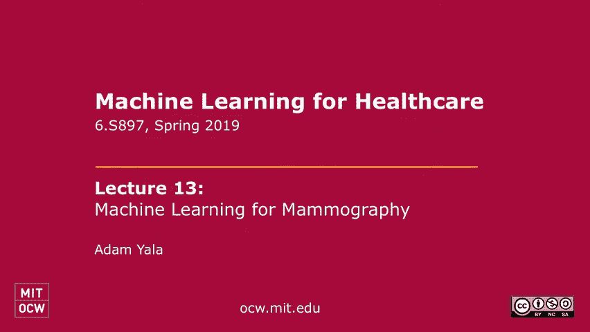

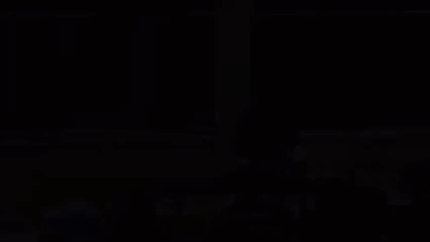

好的，伟大，嗯，谢谢你的伟大设置，所以对于这一节，我要谈谈我们在口译方面的一些工作，接下来我们将讨论我们对乳腺癌风险的技术方法，最后是一个特写，还有很多很多不同的搞砸方式，事情可能会出错。

波兰是如何计算的。

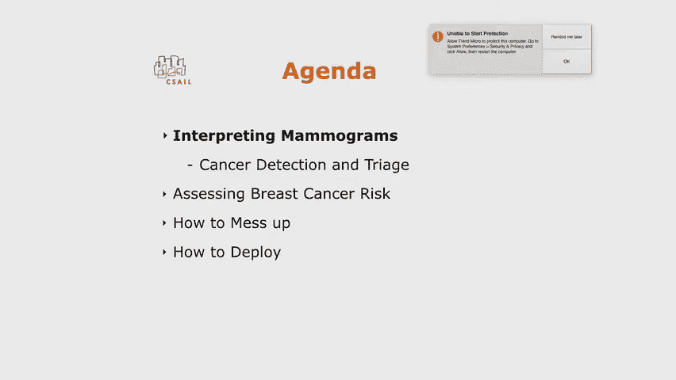

所以说，让我们更仔细地看看，实际乳腺癌筛查工作流程的数字，就像坎耶一样，他们说，你可能，你知道，看到大约一千个病人，平均在那一千人中，可能是一百个，打电话回来对那一百个进行额外的成像。

大约20个人会被活检，你最终可能会被诊断出五六次乳腺癌，所以你看到的一件非常清楚的事情是，你知道的，当你看这个漏斗时，问题是这样的，你在一天中看到的99%以上的人，全部无癌症，所以你的实际发病率很低。

所以有一个很自然的问题会出现，在建模方面你能做什么，如果你有，你知道一个甚至可以的癌症检测模型来提高这个人群的发病率，但我实际上读到了一部分人口是健康的，所以每个人都遵循这个宽泛的想法，点头够了。

所以这里的大致想法是训练一个癌症检测模型，试图找到，不能像我们一样好，鉴于我们要试着说，开发集的门槛是什么，这样我们就可以说低于门槛，没有人得癌症，如果我们在测试时使用它来模拟临床计算，那会是什么样子。

我们真的能通过做这种过程做得更好吗，以及我将如何谈论这件事的大致计划，我也要为下一个产品这样做，首先我们要谈谈数据收集的类型，以及我们如何思考什么是好数据，我们怎么知道，接下来想想那个。

实际的方法和进入一般的挑战，特别是在癌症中，也很明显有风险，最后，我们是如何思考分析和一些目标的。

所以要潜入其中，我待会儿再来实际上这很重要，这是从大约二十八万种癌症开始的，一旦我们过滤了至少一年，跟进，我们最后得到了这个，你知道的，大约两万六千英镑用于开发和测试，我们拥有一切的方式是说。

你知道这是不是阳性克，我们没有看放射科医生发现了什么癌症，会说你知道什么是癌症在一年内以任何方式被发现，我们希望通过放射学，人力资源和合作伙伴，五家医院登记处，然后我们试图拯救一个癌症。

如果我们能告诉癌症发生了，让我们这样标记吧，不管核磁共振或后期捕捉到了什么，所以我们在这里要做的就是模仿，你知道我们试图抓住癌症的现实世界吗，最后，在重要的细节上，我们总是按病人分开。

这样你就不仅仅是你的结果，不仅仅是记忆。

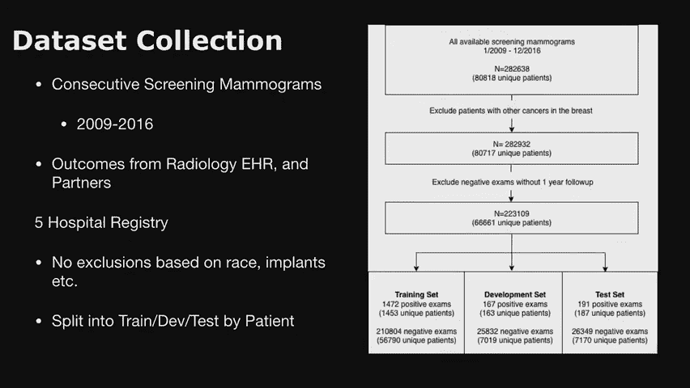

这个特定的病人没有癌症，所以你有一些重叠，这和糟糕的购买，好的，现在很简单了，让我们进入建模，这将遵循两大块，一大块是关于一般挑战的，它在各种项目之间共享。

接下来将对这个项目进行更具体的分析，所以你可能会问一个一般性的问题，你知道，我有一些形象，我有一些结果，很明显这个，只是图像分类，怎么不一样，Magenet，嗯，很相似，大多数课程都是分享的。

但有一些关键的区别，所以我你知道，我举两个例子，其中一个是我厨房里的一个场景，有人能告诉我这个物体是什么吗，这不是一个特别难的问题，对耶，几乎是所有这些东西，那是我的狗，最好的狗，好的，所以谁能告诉我。

你跟康妮训练过，嗯，确实如此，这是这个，这是不公平的，有几个原因，但让我们来看看为什么这很难。

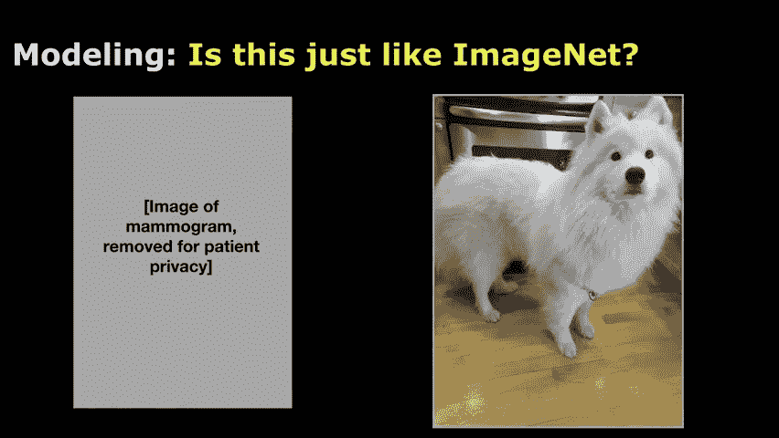

这在一定程度上是不公平的，因为你知道你没有受过训练，但这实际上是一个更难学习的信号，所以首先，让我们深入研究一下，在这种任务中，图像真的很大，所以我们有一个三千二百乘两千六百像素的图像，在这一点上。

真正的癌症，一致性可能是五十乘五十像素，所以直觉上你的信噪比是非常不同的，而我的狗就像整个图像，她在现实生活中是个大人物，在那张照片中，图像本身要小得多，所以你不仅有更小的图像，但你有点像相对大小。

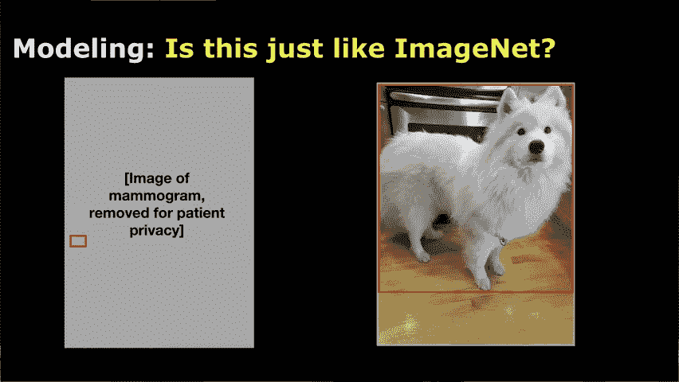

里面的物体要大得多，这是一种进一步的复合困难，所以如果你看到那个图案，所以你真的很关心在这种全球背景下，它会在哪里出现，你会有这种非刚性的图像变形，那就更难建模了，而那是一只或多或少独立于上下文的狗。

你看到那种框架，在任何你知道的地方，它是一只狗，所以在传统的计算机视觉环境中学习要容易得多，所以这里的核心挑战是图像太大和太小，所以如果你看看我们有的癌症的数量，这将是，大约7%的图像有癌症。

所以即使在这个数据集中，从2016年开始，一个巨大的成像中心，在这一切中，我们仍然会有不到两千个癌症，与常规对象分类数据集相比，这是非常小的，这是你知道的，看着超过一百万张图像。

如果你看看考试的所有四个视图，同时它也太大了，所以即使我没有所有这些图像，我一个GPU只能容纳三个，所以这种限制，我可以使用的批量大小，而那种可比的，如果我只拿普通的图像净大小，我可以装128个批量。

轻松快乐的日子，做所有这些Parization的事情，而且玩起来容易多了，最后，实际的数据集本身相当大，你必须做一些，在这方面有麻烦要处理，只需设置服务器基础结构以处理。

这些海量数据集仍然能够有效地训练。

所以你知道所有这些任务的核心挑战是，我们如何让这个模型真正学习，核心问题是我们的信号很低，所以训练最终很不稳定，有一种，你知道的，我们可以玩几个简单的杠杆第一个杠杆通常很深，学习初始化。

接下来我们将讨论优化或架构选择，这与社区中人们经常做的事情相比如何，包括在昨天最近的一篇论文中，最后我们要讨论一些更明确的东西，对于分诊的想法，我们如何实际使用这个模型，一旦训练好，好的。

所以在我讨论我们是如何做出这些选择之前，我只想说我们选择给他们什么，在我潜入之前给你背景，所以我们遵循一些像图像初始化，我们用一个比较大的蝙蝠大小，两个四个，我们这样做的方法是只拿四个GPU。

在执行优化步骤之前，只需单步执行几次，所以你做了几轮背部支撑，首先在进行优化之前积累这些梯度，你在训练时取样平衡批次，和主干网架构，我们用Resnet十八，这只是一种相当标准的，好的，但就像我之前说的。

第一个关键决定是，您如何考虑您的初始化，其中一个所以这是，这是一个图像泛化与随机化的图，这不是什么特别的实验，我只是我已经做了很多很多次了，总是这样，在哪里，如果使用图像泛化，你的损失立即下降。

列车损失和发展损失，你真的学到了一些东西，而当你做随机可视化时，你什么都学不到，和你的损失，在它找到一些区域之前，它在顶部绕了很长时间，在那里它很快开始学习，然后在快速开始学习之前又稳定了很长时间。

给出一些背景，给出大约十五个时代，大约15到16个小时，所以要等足够长的时间来看看随机化是否也能发挥作用。

超出了我的耐心，只是花了太长时间，还有其他实验要做，所以这更像是一个经验观察，图像概括立即学习，有一些你知道的问题，这是为什么，我们对此的理论理解并不那么强，我们对为什么会发生这种情况有一些直觉。

我们不认为这是关于你知道，这种狗的特殊过滤器对乳腺癌真的很好，那是不可能的，但如果你调查了很多早期的研究，就正确的随机化而言，对于像Relu网络这样的东西，很多焦点都集中在，激活模式不会爆炸。

当你走得更远的时候，尝试从预先训练的网络开始的好处之一，很多这样的动态都是为特定的任务而设计的，所以从那里转移到其他任务似乎并不那么具有挑战性，另一个可能的解释领域实际上是在批处理规范统计中。

所以如果你还记得的话，我们每个GPU只能容纳三个图像，以及在每个深度学习库中实现批量规范化的方式，据我所知，它是按GPU独立计算的，最小化这种GPU通信，所以它也不太稳定，选择从头开始猜测。

但是如果您从Net的批处理规范统计信息开始，慢慢地移动它也可能会导致一些稳定，福利，但总的来说就像一个真正的深度，你还在逃避我们，这是我可以给出太多结论的事情，不幸的是，好的，所以这是概括。

如果你没做对，在很长一段时间内什么都不起作用，所以我只是如果你要在这个空间开始一个项目，下一个试试这个，另一个重要的决定，如果你不做那种休息，您的优化体系结构选择是什么。

就像我之前说的，稳定性的一个核心问题，这里有一个想法，我们的信号对噪声显示非常低，所以一个非常常见的方法，很多之前的工作和事情，其实我以前也试过，就是说，好的，让我们把这个问题分解一下。

我们可以在补丁级别上训练，首先，也许这个小边框，对放射学发现进行注释，如，但是线质量或分类，诸如此类的事情，我们将就这项任务进行预先训练，有这种像素级的预测，一旦我们完成了，我们要微调一下。

整个图像的初始化模型。

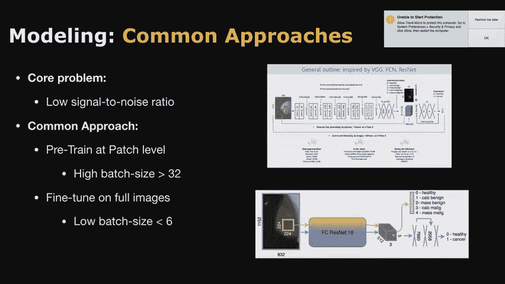

所以你可以有两个阶段的训练程序，实际上昨天刚刚发表的另一篇论文，完全相同的方法，有些细节略有不同，所以我们想调查的一件事是，如果你只是，哦，然后基础体系结构总是用于此。

有相当多的有效选项可以在imagenet中获得合理的性能，像VGG这样的东西，在我的经验中，广泛的重启和重启都表现得相当相似，所以这是一种速度利益的权衡，使用完全卷积的体系结构有一个优势。

因为如果你有完全连接的层，假设特定的维度，你有，只需将它们转换为卷积层，但它们只是更方便开始，具有分辨率不变的全卷积架构。

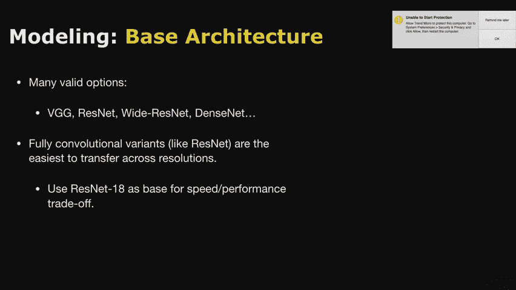

是呀，在最后一张幻灯片中，当你做补丁的时候，是呀，你如何给每一个，它们只是使用全局标签来标记吗，还是你必须真正地观察并弄清楚什么是如此正常，你要做的是取样，你有标记为阳性的贴片，然后随机抽取所有补丁。

以便从注释中，所以说，比如说，很多人在公共数据集上这样做，比如佛罗里达DSM数据集，它有一些注释，如下所示，良性肿块，良性，calx，Lian和Callux等，人们所做的就是把这些注释。

他们会随机选择其他补丁，并说如果它不在那里，这是负面的，我要称之为健康的，然后他们会说这个粘合盒是否与补丁重叠，通过一些边缘，叫它是同一个标签，所以启发式地这样做，和其他专有数据集。

一般也会玩类似的把戏，他们实际上并没有相应地给每一个像素贴上标签，但是人们在做这件事的方式上有相对较小的差异，但也有相当相似的，不管，是呀，当您从补丁级别到完整图像时，如果我没理解错的话。

建筑没有太大变化，因为卷积结束了，正是这样，最后的事情，就在我们做预测之前，预测通常是重启的，比如说，全球平均池通道，整个特征图的智慧，所以他们只是过去水平的第一个，他们拍了一张250乘250的照片。

做全球平均池来做出预测，当它们上升到全分辨率图像时，现在你拿一个全球平均池，超过3000乘2000做，可能会有一些缩放问题，你可能需要调整才能做到这一点，或者你只是一直以完全的分辨率输入。

所以你只要我做，你明白我的意思了，所以你只是在，你在收割庄稼，所以分辨率没有改变，所以同样的过滤器映射应该能够相应地缩放，但是如果你做一些事情，比如平均池，然后你有点你知道。

任何一个活跃度很高的东西平均下来都会更低，例如，在我们的工作中，我们使用最大池来解决这个问题，任何其他问题，但如果看起来不那么复杂，我没有担心，因为我们实际上认为这完全没有必要，这是下一张幻灯片。

对你这么好，就像我之前说的这种信号对噪声的问题是什么，所以要考虑的一件显而易见的事情是，好吧，也许用三个的基本尺寸做SGD，当病变也是图像之一时，这是一个坏主意。

如果我只是通过增加我的批处理大小来减少噪音梯度，这只是意味着使用更多的GPU，在进行权重更新之前采取更多步骤，我们实际上发现这样做的必要性实际上完全消失了，这些是我不久前在公开可用的数据集上做的实验。

在我们弄清楚这件事的时候，如果你把这种建筑的补丁和微调，或者二四十六个的批量，把它比作一个阶段的训练你从一开始就完成任务，一个Imagenet，只需使用不同的批量大小。

你很快就开始缩小你所看到的发展的差距，所以对于我们广泛做的所有实验，我们发现我们实际上通过使用一批来获得相当稳定的训练，二十岁及以上，这归结为，如果使用批处理作为一个，它只是特别不稳定和其他细节。

我们总是取样平衡批次。

因为否则你要取样20批，在你看到一个阳性样本之前，你什么都学不到，所以这就像，如果你这样做，你不做任何复杂的事，你不必做任何花哨的种植，或者类似的东西，比如处理区域注释，我们发现实际的。

在此任务中使用再生符号实际上没有帮助，好的，没有问题，是呀，所以随着批量的增加，是啊，是啊，不要使用放大的补丁，我们不，我们从一开始就把整个图像，假装你喜欢，您只需假设注释是整个图像。

一年内不到喜欢的癌症，这是一个简单得多的设置，我不明白，这和你说的一样，由于记忆的原因，你不能做，哦，所以你只是而不是那么正常，当你这么做的时候，你要训练网络，最常见的方法是步调一致。

如果你只做几次后支撑，你在积累渐变，至少在Pytorch中，然后你可以之后再做，这样你就可以，而不是一次做整批，你应该连续地做，所以你只是在用时间换空间，最小，尽管每个GPU至少必须适合一个图像。

在我们的情况下，我们可以容纳三个，但是为了使这个真正的规模，我们一次使用四个GPU，是呀，与时间的权衡是多少，所以如果我想让我的批量拖车更大，我通常会递增，就十二点吧，因为这是我能容纳的。

同时像一组GPU，而是为了控制实验的规模，你希望每个实验有相同数量的梯度更新，所以如果我想用最好的四八，都是我的实验，而不是花大约半天的时间，大约需要一天的时间，所以当你前进的时候。

就会有一种自然的权衡，所以我在最后提到的一件事是，我们正在考虑一些，比如对抗性的方法，唯一的一件事是，如果我有五个鉴别器步骤，我的天啊，我的经验是，我每次实验花三天时间，你的渐变更新。

有人试图设计一个更好的模型，变得非常慢，当顾客花了这么长时间，是呀，所以你说注释对训练没有帮助，是因为实际的结合，实际的癌症本身和密集的问题没有很大的不同，而地点很重要，而不是实际的，的粒度。

那是什么意思，所以总的来说，当事情对你没有帮助时，总是有两种可能性，一件事是整个图像信号包含了较小尺度的信号，或者有更好的办法，我没发现那会有帮助，然后这件事一直到现在都很难。

所以我们要完成的任务是对整个图像进行分类，在这个任务中，环境和上下文有可能，所以当你做一个充满激情的注释时，你有点失去了上下文，出现在，所以有可能仅仅通过观察整个上下文，每次都一样好。

你不会从缩放盒中得到任何好处，然而，我们不是在评估一种选择的目标检测，评价指标类型，我们说我们抓住盒子有多好，如果我们是，我们可能更幸运地使用重新注释，因为你可能会知道有些级别是由，以及模型的能力。

这就是为什么我们可以做风险建模的部分原因，这将是演讲的最后一点，是呀，那么，在确定是否有癌症后，你会进行物体检测吗，所以到目前为止，我们不做物体检测，部分原因是我们把这个问题框定为分诊。

所以有相当多的工具包，但洞察力是，如果你知道，如果有一千件事可以看，看着你画的两千个东西，你知道的，每张图片有更多的框，这不一定是我们试图解决的问题，那里有相当多的努力，这是我们将来可能会研究的事情。

但这不是这项工作的重点，可能意味着不同的事情，但当你同时看到整个图像时，我会担心的，直觉上关于，卷积架构是否能够接收到这一点，或者是因为你在寻找一个非常小的癌症和一个非常大的图像。

然后你在寻找那个非常小的癌症的意义，在图像的不同部分，或者在图像的不同上下文中，我只是我的意思是，它是它的工作是一个惊喜，所以有两个部分可以帮助解释，所以第一个是。

如果你看任何给定的最后一个接受地图的接受域，在网络的尽头，每一个都通过这些卷积总结，图像中相当大的一部分，所以你有点像每个像素，最后变成了一个50乘50的图像，那是五十二个维度。

所以每个部分都很好地总结了当地的背景，当你在最后做最大平面时，你会得到一些不完美的，但是好的全局摘要，这个图像的上下文是什么，所以就像，假设我一些较低的维度可以总结，或者有点。

而他们中的任何一个都能告诉你，这个，这看起来像癌症，给我们当地的背景，所以你有一些水平的总结，都是因为终端的通道智慧格言，因为每一个点通过许多，许多不同步幅的卷曲会给你一些总结效果，好的很好。

我要向前跳，所以我们讨论了你知道如何让这个学习，其实没那么棘手，如果你只是小心地做和调整，我将讨论如何使用这个模型，实际上实现了这个分诊的想法，所以我的一些选择，图像网初始化会让你的生活更快乐。

使用更大的批处理大小和体系结构选择并不重要。

如果是卷积的，以及我们通过这项工作所做的整体设置，在许多其他项目中，我们根据图像独立培训，现在，这是一项更艰巨的任务，因为你实际上没有完整的，你没有采取任何其他观点，但这是出于更多的硬件原因。

我们将得到整个考试的预测，通过在不同的图像上拍摄最大值，所以如果我说这个乳腺癌得了癌症，考试得了癌症，所以你应该去看看，在每个发展时期，我们将评估模型进行分诊任务的能力，它实际上进入了一秒钟。

我想选最好的模特来做分诊，所以你总是有点像你的真实结束指标，是你在训练中测量的。

你要做模特选择，在此基础上进行了超辅助训练，我们分诊的方式，我们的目标是不要把很多人标记为健康，不会错过任何一个癌症，我们总是会如此直观地发现，通过服用所有被捕获的癌症，这些图像中癌症的概率是多少。

把它们放在那些，称之为阈值，这正是我们所做的，另一个非常相关的细节，通常是如果你想让这些模型输出一个合理的概率，像这样是癌症的概率，默认情况下，你对50个抽样批次进行训练。

你的模型认为平均发病率是50%，所以一直都是疯狂的自信，所以为了校准一个非常简单的技巧是你做一个叫做格子方法的东西，你基本上就像一个双参数乙状结肠一样适合，这是一个规模和转变，只是在开发集。

使它以这种方式真正适合分布，你期望实际符合发生率的平均概率，如果你不把这种疯狂赶走。

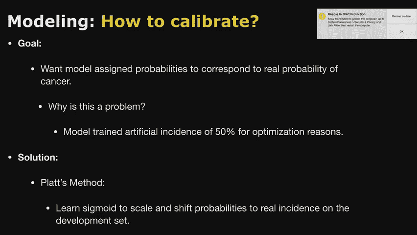

平顺概率，好吧，所以分析，我们在这里尝试做的目标在所有项目中都是相似的，1。这东西还能用吗？第二，这件事对所有应该为之工作的人都有效吗，所以我们做了一个亚组分析，首先我们看了这个模型的AUC。

所以辨别癌症的能力不是，我们是跨种族的，我们有MGH，年龄组和密度类别，最后，这与径向评估有何关系，如果我们在测试时在测试集上使用这个，会发生什么，在完全临床实施之前的模拟。

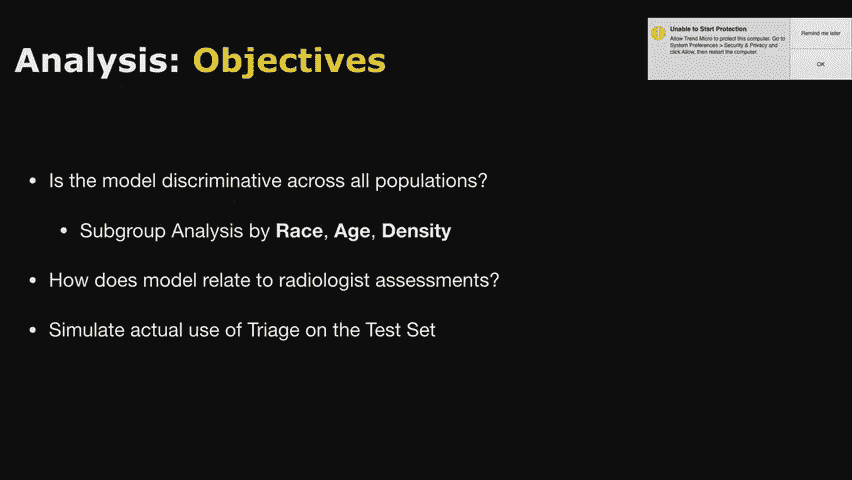

所以我们这里的总AuC是82，用一些，你知道从80岁到85岁的自信吗，当我们按年龄进行分析时，我们发现每个年龄组的表现都很相似，这里没有显示的是置信区间，例如，但这里的关键核心是，就年龄组而言。

没有明显的差距。

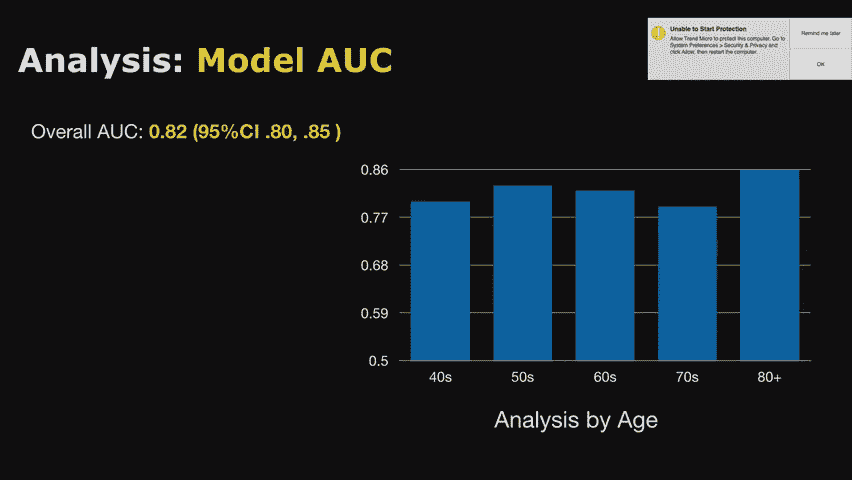

我们按种族重复了这个分析，我们又看到了同样的趋势，表演一般在82岁左右，在差距较大的地方，由于样本量较小，公正置信区间相应较大。

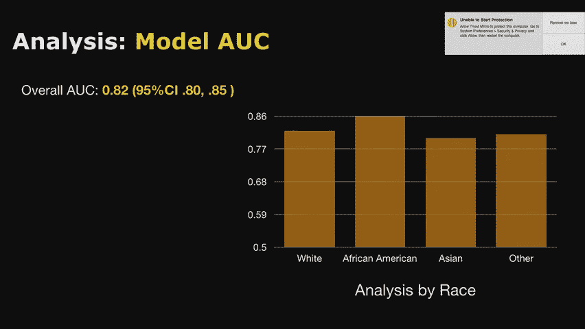

因为MGH 80%是白色的，我们看到了完全相同的密度趋势，但在测试集上只有大约一百个，所以这个会议实际上从60岁到90岁，据我们所知，其他三个类别，这是非常紧密的置信区间，在82年左右再次非常相似。

好的，所以我们有一个不错的想法，这个模型似乎至少在一个群体中，MGH I实际上为相关人群服务，你知道，据我们所知，这是存在的，下一个问题是，这怎么，模型评估如何，与放射学评估有关，所以看看那个。

我们在试验场上看了看，如果你看看读者真正的积极因素，真阴性假阴性，它们在类似百分位风险的模型分布中处于什么位置，如果低于阈值，我们要给它上这种青色，如果超过阈值，我们要给它上这个紫色，所以这是一种分诊。

不是分诊，首先注意到的是真正的积极因素，有一个很陡的落差，所以只有一个真正的阳性低于阈值，在两万六千次考试中，所以在向上的过程中，这种差异在统计学上是显著的，他们中的绝大多数都是前十名。

但你会看到这里有一个明显的趋势。

它们会堆积在更高的百分比上，当你看到评估的思想部分时，这个趋势要弱得多，所以你仍然可以看到有像，你知道一些相关性，会有更多的假阳性，较高的金额，但更不明显，这实际上意味着很多RA的假阳性。

我们实际上把它放在门槛以下，所以因为这些评估是完全一致的，我们不仅仅是在模拟其他人会说的话，我们得到了一个预期的好处，实际上大大减少了假阳性。

因为重量不同意，最后，进一步帮助了这一点，如果你看看真正的负面评价，在它属于这个范围的地方之间没有太多的趋势，所以这表明他们在不同的事情上有所了解。

他们不同意的地方给了我们需要改进的错误和一些附带的好处。

因为现在我们可以产生假阳性，这直接导致模拟撞击，所以我们做的一件事我们只是说，好的，如果人们在我们真正插入之前回顾测试集作为模拟，如果人们的阅读量没有低于分诊阈值，这样我们就不能再得癌症了。

但我们可以减少假阳性，会发生什么所以在顶部我们有原始的表演，敏感性为96，特异性为93，在模拟中，灵敏度没有明显下降到91点。但显著提高到93。7。

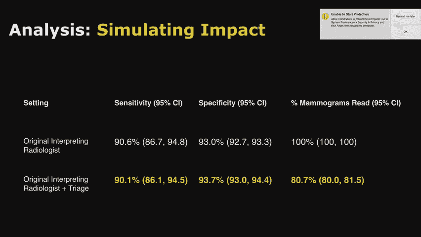

所以这就像是有希望的初步数据，但要重新评估这一点，并推进我们的下一步，看看我是否，哦，我马上就说，我们的下一步是真正做临床，真正弄清楚，因为有一个核心假设，人们读它的方式是一样的。

但是如果你有这么高的发病率，那是什么意思，你能把注意力集中在更可疑的人身上吗，而且是做这件事的正确方法吗，只有一个不读的门槛，或者有一个双重结尾，这些分子很容易致癌，所以这里有相当多的爆炸说。

鉴于我们有这些工具，给我们一些癌症的可能性，那并不完美，但给了我们一些东西，我们如何才能做到这一点来改善今天的护理，所以作为一个测验，你能分辨出这些中的哪一个会被分诊吗，所以这不是樱桃，采摘。

有人能猜到左边还是右边，这不是分级测验，所以你知道，2。谁举手？向左举起你的手。

好的举起你的手向右，开始了干得好干得好。

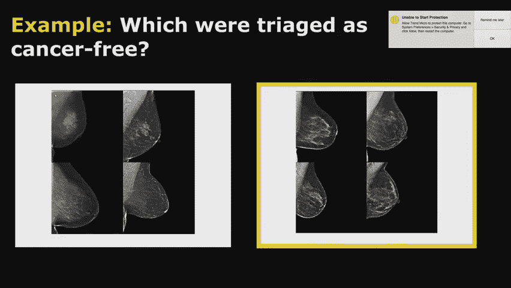

好的，下一步就像我之前说的。

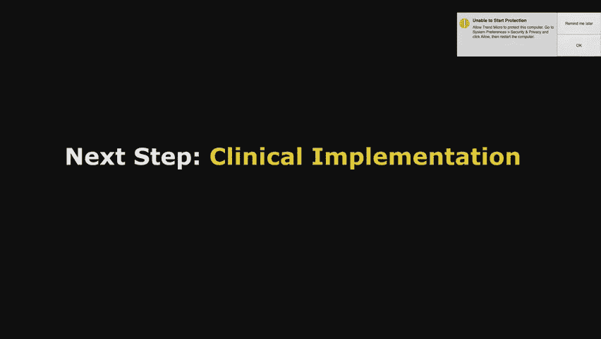

计算的种类，因为那是橡胶上路的地方，我们确定，他们有什么偏见没有发现吗，我们真的可以说我们能实现这个价值吗，所以下一个项目是评估乳腺癌的风险，所以这个是一样的，我之前给你看过了。

它在2014年被诊断出患有乳腺癌，其实是我的导师，雷吉诺是，你可以看到你知道在2013年，你看，它在那里二十二，看起来不那么突出，五年前真正关注乳腺癌风险，所以如果你能从一个健康的图像中看出。

很长一段时间以来，你真的试图建模，这个乳腺癌将来患癌症的可能性有多大，现在建立乳腺癌风险模型，正如真的说的，这不是一个新问题，这在社区里是一个相当大的研究，和更经典的方法，我们要看看。

其他类型的全球健康因素，人的年龄，他们的家族史，他们是否有更年期，以及任何其他类似的因素，我们可以说他们健康的标志，试图预测这个人是否有患乳腺癌的风险，人们以前认为图像包含了一些东西。

从61年到63年的改进是微不足道的。

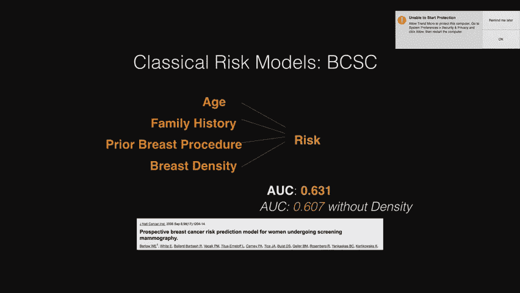

和以前一样，我们要做的是数据收集。

数据集收集中的建模与分析，我们遵循一个非常相似的模板，我们再次从EHR获得结果，和合伙人登记处，我们不做基于种族的排除，或者任何类似的植入物，但我们确实排除了后续的底片，所以如果有人在三年内没有得癌症。

他们从系统中消失了，我们的计数是负的，我们在建模和分析中都有一些确定性，和往常一样，我们分开我的耐心来训练开发测试。

建模非常相似，这是同样的模板和教训，从分诊开始，除了我们用一个模型做了实验，这个模型只是图像，为了分析起见，一个模型就是图像，模型，我以前和你谈过，在最后一层与那些传统的风险因素连接并训练，加入我。

这对每个人都有意义，所以我们将把那个图像称为图像，加射频或混合，好的，酷，我们的分析目标，像以前一样我们想看到，这个模型真的为整个服务吗，全部人口，这会有跨种族的歧视吗，更年期状况及家族史。

这与传统的风险方法有什么关系，我们真的做得更好了吗，所以直接潜入，假设，没有问题，只是提醒你，就是这种设置，有一件事我忘了提，这就是为什么我在这里有幻灯片，提醒我的是，我们从第一年就排除了癌症。

从测试集，所以确实有一个阴性筛查人群，所以我们把癌症检测和癌症风险分开的方法。

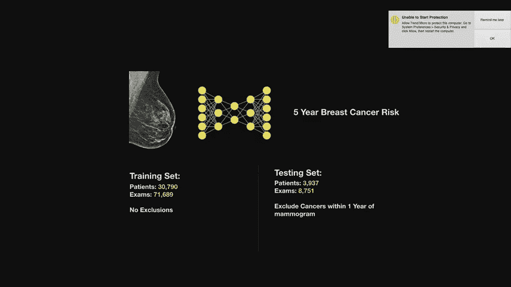

好的，酷，所以轮胎球杆是最先进的模型，这是一个基于英国的模型，它们是由一个叫库西克爵士的人开发的，这个作品很常用，所以1的c是62，或者只有图像的模型在68年左右有一个问题，混合动力的空调是70。

所以你知道，当你使用风险模型时，这种ABC的东西给了你什么，它给你的是创造更好的高风险和低风险队列的能力，所以就观察高风险队列而言，我们最好的模型扮演了人口中大约30%的癌症，在前10%。

3%的癌症在最底层的10%，与以前的技术水平相比，18岁和5岁，所以这使你能够做的，如果你要说你知道，这10%实际上应该有资格接受核磁共振成像，你可以开始与大多数患癌症的人的问题作斗争，没有核磁共振。

大多数得到它的人不需要它。

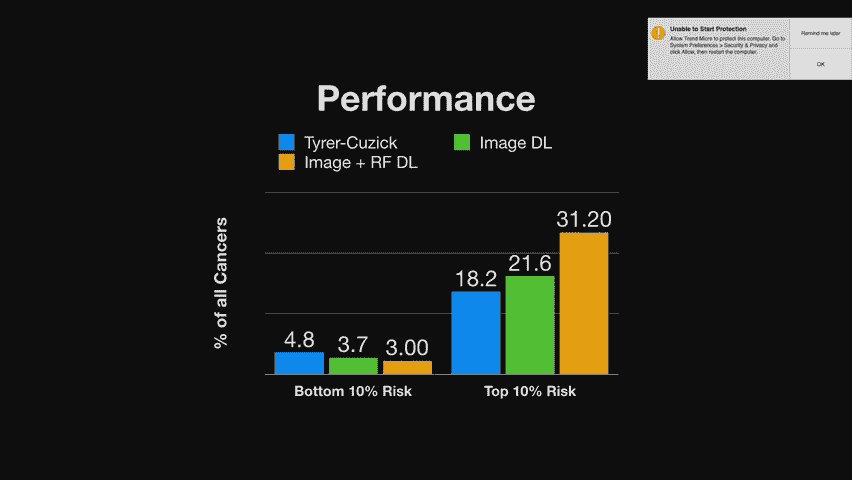

关键是你的风险模型，把合适的人放进合适的桶里，现在，我们看到这种超越现有技术的趋势，跨种族举行，其中一件令人惊讶的事情是，尽管提乌斯是由白人妇女表演的，这是有道理的，因为它是在英国只使用白人女性开发的。

比随机更糟糕，我们的非裔美国妇女数据，所以这强调了这种分析的重要性，以确保您拥有的数据集反映了人口，你试图服务，实际上做相应的分析。

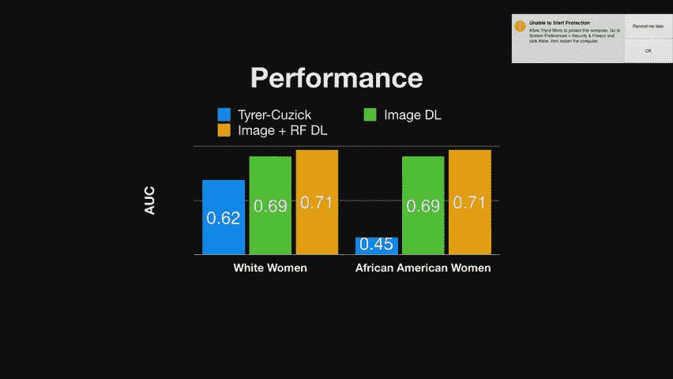

所以我们看到我们的模型适用于不同的种族，你知道的，我们从绝经前和没有家族史的人身上看到了这种趋势。

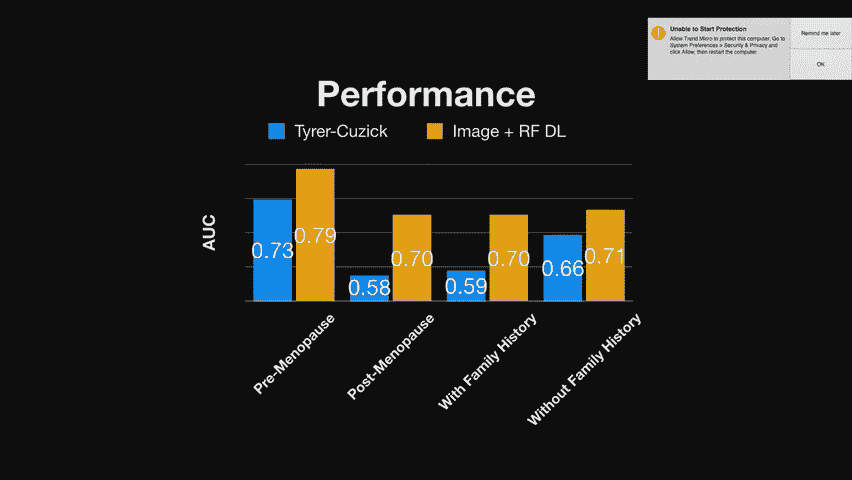

我们做了一件事，对性能进行了更详细的比较，我们看了一下，如果你看一下，就像风险一样，我们的模型和整个线索模型的三分之二，你看到的趋势是什么，或者哪一个是对的有点模棱两可的情况。

我应该在这些盒子里显示的是癌症发病率，在人口中的流行率，所以箱子的码头工人，发病率越高，在右手边，只是那些盒子里的箱子里的随机图像，这对每个人都有意义吗，所以你看到的一个明显的趋势是，比如说。

如果TV8称你为高风险，但我们称之为低，这比我们称之为中等的发病率要低，他们称之为低，所以就像你看到的这种直列模式，显示出歧视，确实遵循了深度学习模型而不是经典的方法，通过观察随机选择的图像。

以防我们不同意，它支持这样一个概念，即不仅仅是柱是最密集的，有一些更微妙的东西正在出现。

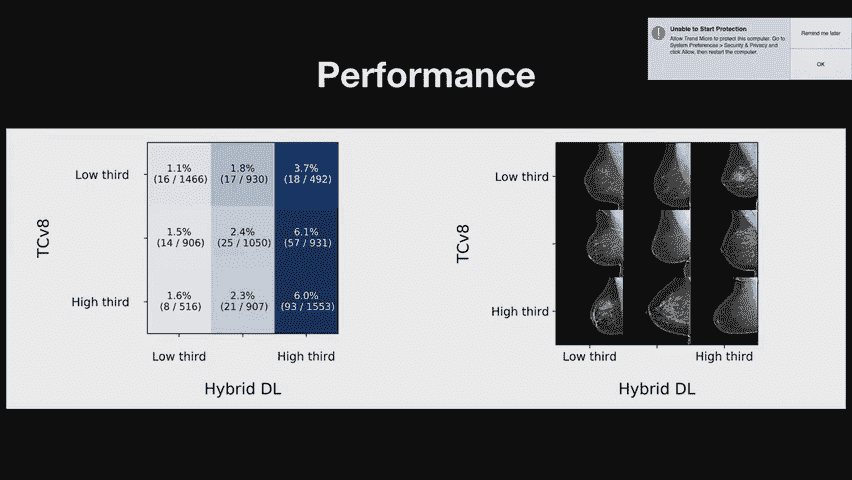

这实际上表明乳腺癌的风险，一种非常相似的分析，如原件所示，由俊，开发集，或者在测试集上，我们最终会看到同样的趋势，如果某人不是密集的，我们称之为高风险，他们比密集的人风险高得多。

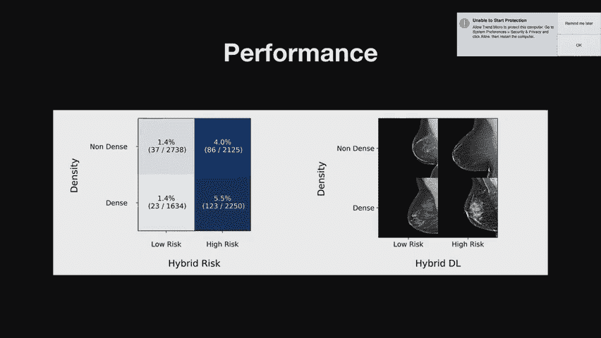

我们称之为低风险，和以前一样，真正的下一步是让这个真正有价值和真正有用，实际上是在临床上实施的。

前瞻性地看到这一点，有更多的中心和更多的人口可以看到，这个行得通吗，它是否带来了我们关心和观看的那种好处，改变的杠杆是什么，一旦你知道某人是高风险的，也许核磁共振，也许你知道更频繁的筛查，就像。

这是在纸上有一个有用的技术之间的差距，到现实生活中实际有用的技术，所以我按计划行动，所以现在我们要谈谈如何搞砸。

其实挺有趣的，有很多方法，我自己也掉过几次，它发生了，有点跟着素描，你可能会在数据集收集中搞砸，这可能是迄今为止最常见的，你可能会在造型上搞砸，我现在正在做，这是非常可悲的，你可以在分析中搞砸。

这是真正可以预防的，所以在数据集收集中，丰富的数据集是你在空间中看到的最常见的东西，如果你发现一个公共数据集，更有可能是五五开的癌症，不是癌症，通常这些收集的数据集可能会有某种偏差，在它被收集的方式中。

所以你可能有来自较少中心的阴性病例，你有阳性病例，或者是不同年份的，实际上这是我们之前遇到的，在我们自己的工作中，从前，坎耶和我在上海，在那里开设癌症中心。

那时我们从毫克数据中得到了所有的癌症大约2000，但是玛姆格罗斯仍然每年被收集，从二千零一十二，从2009年开始，所以那时我们每年只有一半的底片，但是所有的癌症突然间我不得不喜欢，你知道吗。

我来自稍微复杂一点的模型，就像一个人经常做的那样，同时查看几张图像，我的ABC上升到95，我总是像从墙上弹下来一样，然后你知道有一些怀疑，等一下，这太高了，这太好了，我们很快意识到这些数字都是一个神话。

但这种程度的，如果你做这种案件控制的事情，你可以经常。

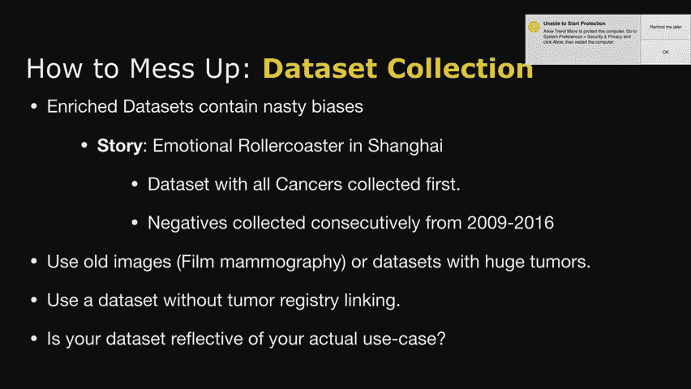

除非你非常小心它的构造方式，您很容易遇到这些问题，你的测试集不会保护你免受伤害，因此有一个干净的数据集，你知道吗，遵循光谱的类型，我们希望在自然分布Cuthrough例程中使用它，临床护理很重要。

它会像我实际想要的那样被使用吗，在第一原则中，你唯一能考虑清楚的是，但它强调了实际测试的重要性，和外部验证，试图查看，当我去掉数据集中的一些偏差时，这是否有效，对此非常小心。

仅仅根据年龄或密度来控制的常见方法是不够的，当模型能够捕捉到非常细粒度的信号时，如何在建模中搞砸，所以这是在这个空间里也有冒险，我最近发现的一件事是我，所以你看到了一堆来自不同机器的Maogram。

对模型有和预期的影响，所以实际的概率分布，模型对癌症概率的分布与设备无关，所以我现在正在经历的事情，我们真的遇到了这个，在计算的时候，就像这种有条件的对抗性训练，为试图纠正这一问题而设立的，这很重要。

所以根据第一原理，这很难抓住，但重要的是要想清楚，当你真的开始，你知道吗，演示你的计算，这会很容易出现这些问题，他们更难避免，最后，我想可能最重要的一点是分析混乱，所以这在这个领域的前一部分是很常见的。

是呀，用对抗性的，只是为了明白，是啊，是啊，你所做的，做一个鉴别器，预测机器，然后与之交易，所以我的答案是两部分，一个，它没有我想要的那么好，然而如此真的，谁知道呢，但就以前做过的事情而言。

最好的预感是，其他工作，特别是WSS信号，他们使用有条件的对抗性，所以你喂鉴别器，标签和图像赋值，你必须试着预测设备，试图删除不仅仅包含在标签发行版中的信息，事实证明，这对人们非常有帮助。

尝试基于WiFi进行睡眠状态检测，嗯，不是WiFi，但就像X型组的无线电波，但这似乎是我在文学中见过的最常见的推动，所以这是我很快要尝试的事情，我还没有实施，这只是GPU时间，有点等着排队做实验。

最后一部分是关于如何搞砸，这种分析，有一件事很常见，人们认为这有点像合成实验，和实现是一样的，就像人们经常做读者研究一样，很常见的是，当你做读者研究时，实际上不喜欢，你可能会发现计算机检测。

读者研究有很大的不同，这实际上表明它在现实生活中是有害的，重要的是要喜欢，做一些真实世界的实验，真正说明正在发生的事情，这给了他们我所期望的真正的好处，希望，现在不太常见的错误是。

人们往往排除一切不方便的情况。

所以昨天有一篇论文刚刚出版，癌症检测使用了一种贴片级架构，但如果你仔细阅读他们的细节，就像现代的便利，但这可能会对该人群中的亚洲女性产生不同的影响，所以他们没有对所有不同的种族进行亚组分析。

所以很难知道那里发生了什么，如果你的人口主要是白人，它在MGH，这些云发展的许多中心，报告平均GC不足以真正验证这一点，所以你可以有一个USTIC模型，比随机的更糟糕，对非裔美国妇女明显有害。

所以为了防止这种情况你可以根据第一原则做很多事情，但其中一些事情你通常会通过主动监测来发现，有没有我没有考虑过优先考虑的亚人群，可能会受到伤害的，最后，我们谈了很多临床部署。

我们实际上已经这样做过几次了，我们很快就会转到康妮身上，总的来说，你想做的是，你想让它变得尽可能容易，尽可能可信和可能，对于内部，IT团队使用您的工具，我们现在已经经历过了。

好像我不知道这取决于你怎么数，就像一次密度，然后同时三次，我花了很多时间坐在那里，到目前为止，我们设置的大致方式，就是，我们只是有一种doalized容器来管理一个Web应用程序，它保存着模型。

这个Web应用程序在处理工具包上有一个点，所以我们所有的部署都遵循的步骤，就像在一个统一的框架下，应用程序将从PAC系统中获取一些图像，它会把它送到应用程序，我们要把它转换成PNG，以我们期待的方式。

因为我们喜欢封装这个功能，运行模型，把它寄回，然后写回给人力资源部，我遇到的一件事是，他们实际上不知道如何使用像http这样的东西，因为在他们的基础设施中，这实际上是不正常的，因此认识到。

其中一些更像是技术标准，像这样的东西，请求和响应之类的东西在他们的基础设施内部不太标准，有点抬头，如何在，像C尖，不管他们的语言是什么让我们喜欢并阻止这些东西。

把它插上电源，对我来说就是这样，所以我要把它交回去，哦是的，所以你在IT应用程序中用C夏普编写东西，执行API请求，所以他们在写，我只是和他们见面告诉他们怎么写，是的，我看到了，就像有图书馆一样。

所以整个环境都在窗户里，窗户很差，对很多事情的支持，你会期望它有很好的支持，所以如果你想用多部分表单发送惠普请求，把图像放在那种形式，很明显，那就像有虫子在里面，就像窗户一样，不管他们今天用什么版本。

所以香草版不起作用，码头工人窗口，也有bug，我不得不为他们设置这种日志功能，就像容器内的自动表格块，它就是不起作用，窗户是问题，是啊，是啊，是啊，是啊，所以我们可以在最后讨论这个，我想把康妮交给。

是啊，是啊，如果你有任何问题。

