# P22：22.Regulation of Machine Learning - 大佬的迷弟的粉丝 - BV1oa411c7eD

对呀，让我们开始吧，今天欢迎女士们先生们，我很荣幸向大家介绍两位演讲嘉宾，谁来谈人工智能和机器学习的监管，联邦食品和药物管理局一级的监管和关于机构内监管的IRB问题，首先发言的是安迪·卡拉多斯。

安迪是ElectroLabs的首席执行官和创始创始人，这是一家为医疗保健做数字生物标志物的小公司，研究所数据和软件工程师，在纽约西奈山为下一代医疗保健，今天能来和我们说话真是太好了。

所以我要介绍他们坐下来享受，谢谢。谢谢。谢谢你邀请我们，是的，所以我在研究数字生物标志物，我也是哈佛大学的研究合作者，麻省理工学院监管科学中心，然后我也是def con生物黑客村的顾问。

我们可以多谈谈我的背景，我是一名软件工程师，曾与美国食品和药物管理局合作，以前是企业家。

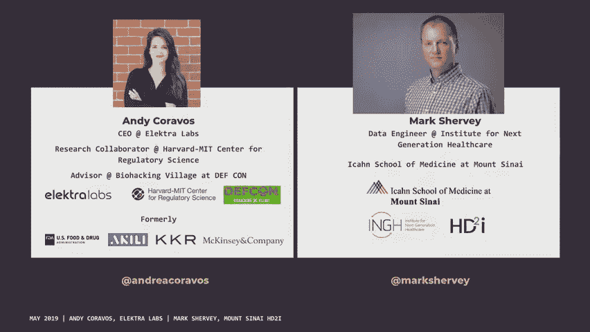

在数字健康单位居住，然后在公司土地上呆了一段时间，我是马克·谢里，我在西奈山下一代医疗保健研究所工作，我在那里已经三年了，我的背景是软件和数据工程，主要来自银行和媒体，所以这是一个新的地方。

我的大部分职责都集中在数据安全、IRB和道德责任上，我们也知道人们通常有多喜欢监管对话，所以我们会试着让这对你来说非常有趣和刺激，如果你有问题，因为规定很奇怪，它们在不断地变化。

你也可以在推特上给我们发一张纸条，我们会回应的，如果你有事情发生，还有推特上的监管社区，太神奇了，当有人拿出，就像，现实世界的数据到底意味着什么，每个人都在互相交谈，所以一旦你开始进入。

这是一个非常好的，数字健康部门在FDA OK免责声明上发了很多推特，这些是我们的意见，你将在这里看到的信息不一定反映了美国。

政府或我们所属的机构，政策和法规不断变化，所以当我们把这个呈现给你的时候，很可能有一部分是错的。

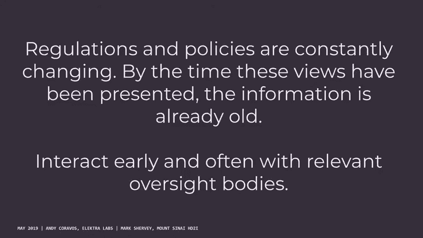

你的律师可能会说不要这么做，肯定有不同的方法，我们可以讨论你想怎么做，但尤其是作为一个软件工程师，在数据方面开发任何东西，如果你花了太多时间开发一个永远无法通过的产品，这真的是浪费了一段时间。

正如你在报纸上看到的，这将是很重要的，马克和我经常谈论的最后一件事，这些定义和框架中的许多实际上还没有发生吗，所以当有人说生物标志物，它们实际上可能并不意味着生物标志物，他们可能需要一个测量。

我相信你知道这一点，当有人说，我在AI工作，你就像，这到底是什么意思，所以你应该问我们问题，你真的是，你想一想，你所拥有的知识类型，与这个国家的几乎所有人相比，这是一套非常特殊的罕见知识。

如何规范和监督这些技术，你可以有一个非常大的。

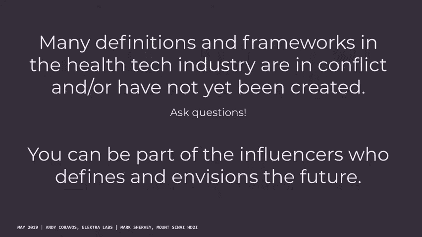

我们要做的是一些关于监管的枯燥的东西，然后我要恳求你，也教你如何提交公众评论，这样你就可以成为这个监管过程的一部分，然后我会谈谈机构审查委员会，这里有多少人和IRB一起工作过或知道他们，好的，好。

这是一个很好的组合，所以这将是一个快速的事情，只是在回顾什么时候让IRB参与进来，如何让IRB参与，你需要IRB的事情，还有一些你不知道的事情，作为采取FDA方法的替代方案，所有的权利，好的好的。

然后我先去，然后我们再通过IRBS，然后我们把最后一部分留给你对论文的印象，好的，所以在我开始之前，我会给我们一些关于算法驱动的保健产品的想法。

嗯，如你所知，这些可以有广泛的范围，他们可以做什么，我喜欢使用的一般框架，来考虑它们是测量诊断或治疗的产品，所以测量，产品可能包括数字生物标志物或临床决策支持，诊断可能会采取这种测量。

然后说某人是否有某种情况，考虑到这些指标，然后围绕数字治疗学来处理我们的想法。

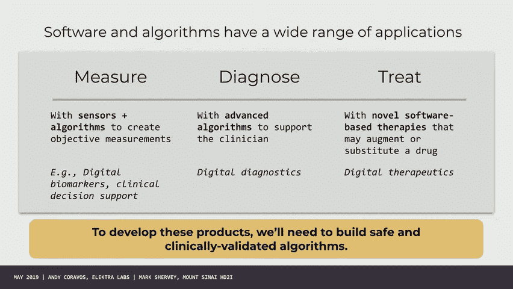

这里有多少人认为软件可以治疗一个人，我认为人们不会总是想到的一件事，当他们有这些工具的时候，你们可能都在想这个，更多的是像步数这样简单的事情是一种算法对吧，所以它需要你的陀螺仪加速度计，高度。

体重和年龄，然后它预测你是否迈出了一步，如果你想想人们所做的不同步骤，老年人比年轻人拖拖拉拉的，所以步数算法看起来与年轻人的步数算法非常不同，所以所有这些工具都有一定程度的误差，它们都是有效的算法。

我最喜欢的框架之一，当你开始思考，很多人对周围的测量方面很感兴趣，所谓的数字生物标志物，结果食品和药物管理局意识到许多人甚至在他们自己的机构里，不知道什么是生物标志物，每个人对这个词的使用略有不同。

可能人们对待你的方式与机器学习的方式略有不同，所以有一个非常好的框架，我强烈推荐的七种不同类型的生物标志物，如果你走进这个区域，你会读到，和数字生物标志物只在我的定义中，以及其他人是如何开始使用的。

这是收集测量值的方式，所以你可能有一个监测生物标志物或诊断生物标志物，但它是在流动医院收集的，正在收集数字的远程方式，这种类型的数据非常棘手，并给你一个例子来说明为什么这特别难以监管。

所以想想几个产品看看简单的东西，像AFIB，所以谎言是一种不正常的心脏疾病，你可能在新闻里看到过，许多不同的公司正在推出AFIB产品，简单地说，显然有一大堆不同类型的数据。

一个人的原始数据是另一个人的过程数据，所以说，你在这个图表上看到的，是五个不同的公司的名单，他们都在开发蚜虫产品，他们是否在内部开发产品，就是绿色的部分，与他们是否可能使用第三方产品的关系。

所以在别人的产品上开发一个应用程序，所以在一个广泛的方面，考虑从操作系统到传感器数据，所以有人可能会使用PPG传感器之类的东西，他们手表上的数据，然后做某种信号处理，然后制作另一个算法，进行某种诊断。

然后你在上面有某种用户界面，所以如果你是FDA，2。你的底线在哪儿？这个产品的哪一部分，当有人说我的产品经过验证时，是否应该实际验证，然后思考这到底意味着什么，如果某件事被验证而不是被验证。

如此验证就像，如果我走一百步，这东西有一百步长吗？然后验证做了一百个步骤，对我的病人来说意味着什么，或者对于我的临床用例，所以食品和药物管理局已经开始考虑的一件事是，如何将硬件组件与软件组件解耦。

在那里你考虑一些硬件组件，就像你想要的那样，一个有效的类似于收集数据的供应链，然后你会在上面用一些东西，所以，也许，你有某些类型的公司可能会做某种验证或验证，降低堆栈，然后你可以在更高的地方创新。

所以这些这些这些测量有非常有意义的影响，所以在过去，很多这些工具你真的必须去诊所，进行这种测量是非常昂贵的，越来越多的不同公司正在批准他们的产品在，在一些护理环境中与医生，或者可能是在家里做决定好吧。

所以在最后一个例子中，是关于数字治疗的，所以我和一家公司合作，这家公司使用的是基于UCSF的技术，正在有效发展的，儿童多动症电子游戏，所以当孩子们玩游戏的时候，他们减轻了多动症的症状。

这个游戏很令人兴奋的一点是，这是一个30天的协议，不像利他林或Adderall，在那里你必须在你的余生中每天服用这种药物，当你减轻症状时，这似乎有一个影响，三十天后是更长期的，当你在几个月后测试某人时。

他们仍然保留着治疗的效果，所以这项技术是从加州大学旧金山分校拿出来的，授权给一家叫阿奇尔的公司，他决定我们应该像制药公司一样组织自己，所以他们像制药公司一样筹集风险投资，他们像制药公司一样进行临床试验。

他们现在向食品和药物管理局提交，可能是第一个处方药，所以任何被告知或电子游戏可能会腐蚀你的大脑的人，你现在有一个，所以食品和药物管理局一直在研究越来越多的这些工具，我不必告诉你，你可能想了很多。

FDA已经批准了许多不同类型的算法，出现的一个问题是，你应该考虑代理的哪一部分，当你使用这些算法时，你声称什么，一个人应该清除什么，什么不是，我们应该如何真正考虑对他们的监管监督。

许多这些技术也使事情变得非常令人兴奋，所以这不仅仅是测量的问题，但你能用它们做什么，所以有一件事让很多人非常兴奋，是一个关于分散临床试验的想法，这里没有区块链，你也许可以用区块链构建它，但没有必要。

所以在Y访问上，你可以考虑，收集的数据在哪里，那么它是在临床现场收集的吗，还是远程采集，然后方法是如何收集，那么你需要一个人来做互动吗，还是完全虚拟，所以在顶部，你可以想象有人在做远程医疗。

他们打电话给家里的人，然后他们可能会填满，问一些问题，并在底部填写一份调查，你可以想象在一个研究机构里，我使用了许多不同的仪器，也许我正在研究帕金森病，你在用某种加速度计测量我的震颤。

所以正在发生的挑战，很多人把所有这些术语用于不同的事情，当它们意味着分散审判时，是远程医疗吗，是不是有人用很多可穿戴设备，你怎么知道数据是准确的。

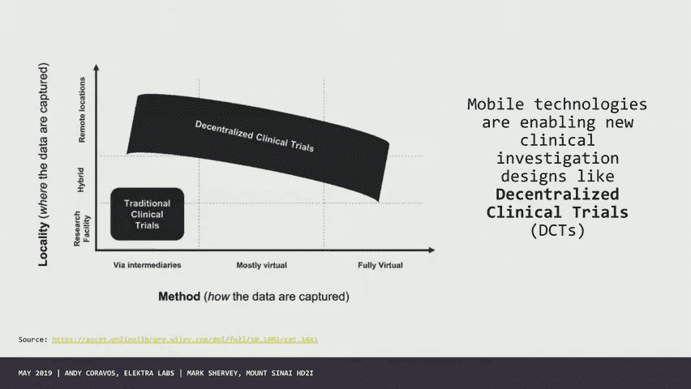

但这是我认为在许多情况下真的很令人兴奋，因为人们不想参加临床试验的首要原因，就是服用安慰剂，我想没有人真的想参与研究，如果你没有得到真正的药物，另一个原因是人们不想开车进去，找到停车场，喜欢参与。

这允许人们在家参与，FDA一直在做很多工作，如何重新思考临床试验设计过程，并将一些现实世界的数据纳入决策。

就在我跳到一些监管的事情之前，我只想建立一个框架来思考这些工具能做什么，以下是在临床研究中如何使用软件的三种不同场景，所以想象一下有人得了帕金森病，你想测量他们的帕金森病是如何随着时间的推移而变化的。

使用基于智能手机的测试，你有一种标准的帕金森药物，他们会使用，然后收集端点数据，这就是你所看到的，如果这种药物是用一个软件进行的，说你有胰岛素泵，然后你有一个CGM来测量你的血糖水平。

你想根据这些读数给胰岛素剂量，您可能在介入端和端点端都有软件，或者像我们谈到的公司，它有一个数字产品，他们说我们在这项研究中唯一想改变的是干预是数字化的。

但我们希望你把我们和其他治疗儿童多动症的干预措施进行比较，所以我们希望使用标准端点，而不是让这成为一种创新，这里的挑战是，第一个最有可能的是食品和药物管理局的方面。

第二个将涉及食品和药物管理局的药物和设备方面，作为组合产品，最后一个会进入通常处理软件的设备，我们从来没有真正的产品在食品和药物管理局，依我看，就像，我们没有，可以测量、诊断、治疗和改变所有不同的方式。

所以你现在让软件攻击系统的多个不同部分，它甚至可能是相同的产品，但在一个例子中，它被用作干预，另一个实例，它被用作诊断，另一个是通知或扩展标签，所以关于你将如何管理这个产品的台词就不再那么干净了。

那么你是如何管理这些的呢，有几个机构负责考虑，并监督医疗保健软件，我们花大部分时间研究的大问题是食品和药物管理局，但也值得思考它们是如何与其他一些相互作用的，包括嗯，oh和c，FCC和FTC。

所以FDA负责安全性和有效性，以及促进医疗产品创新，并确保患者获得高质量的产品，O，c负责卫生信息技术，你可以想象存储数据之间的线，你是否对这些数据做出了诊断开始变得非常模糊。

它真的可能是完全相同的产品，但只是改变了你对该产品的要求，这些产品中的大多数都与它们有一定程度的连接，所以他们也在与联邦通信委员会合作，必须遵守，这些工具是由这个机构监管的，最后。

也可能是最有趣的是围绕联邦贸易委员会，它真正专注于告知消费者的选择，如果你想想FDA和FTC，他们其实很相似，所以这两个机构都负责消费者保护，FDA真的从公共卫生的角度来看待这一点，所以在很多情况下。

如果你看到一些对有欺骗性做法的人的惩罚，实际上不是FDA介入的，是联邦贸易委员会，我想有些经纪公司在考虑他们的路线在哪里结束，其他人从哪里开始，在许多情况下，正如我们可能已经看到的。

在科技行业发生的许多可能不好的行为，很多地方都有空隙，没有人介入，所以一个重要的是关于标准和技术，可能一直在考虑互操作性，以及是否可以实际导入数据，有些人花了很多时间思考标准。

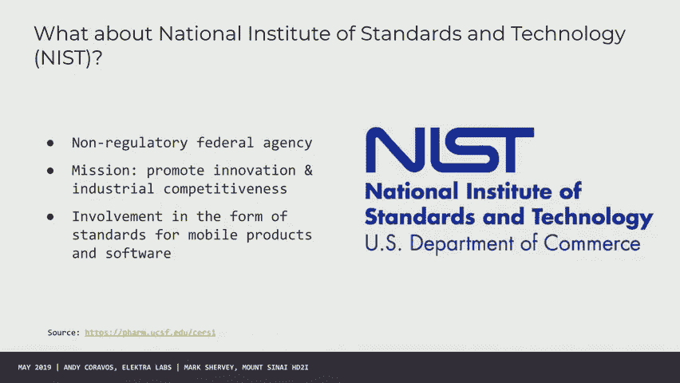

是促进创新的一项非常痛苦和非常重要的工作，好的，所以FDA有多个中心，我要用很多缩写词，所以你可能想把这个写下来或者拍张照片，我会尽量减少我的首字母缩写，但有三个中心对你来说最有趣，所以雪松是用来的。

这是一个你会有一个普通的药物，并可能使用软件产品来查看药物的性能，cdh用于设备，cber用于生物制品，我可能会以非常相似的方式使用药物和生物制品，我们会花大部分时间研究的区别是存在的。

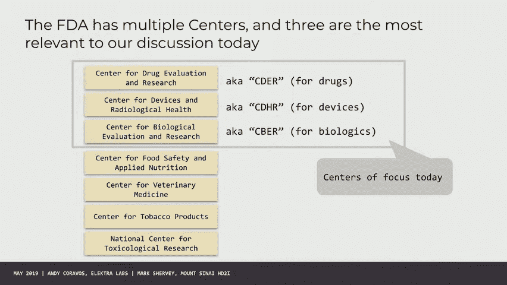

药物与器械，即将出台的一系列政策，这既令人兴奋又让事情发生变化，所以其中一个大的是关于两个一个世纪的治疗方法，这加速了医疗保健的许多创新，它也改变了设备的定义，这对软件有相当有意义的影响。

FDA一直在考虑如何，你实际上会把这些产品，我想有很多人对他们真的很兴奋，有很多创新，那么我们如何创建标准来扩展标签，能够实际摄取数字数据，拥有这些实际上在FDA监督下的数字产品。

不仅仅是像应用商店里奇怪的蛇油。

但什么是医疗器械，几乎一个设备就像任何不是其他中心的东西，它有一个很大的陷阱，所有其他组件，所以对人们来说最大的挑战之一是思考设备是什么，如果你想想FDA的一般工作，它并不总是确保你的产品是安全有效的。

他们检查你是否声称它们是安全有效的，所以这真的是关于索赔管理，你声称这个产品能做什么，并为营销评估这一点，很明显，如果你的产品造成了非常严重的伤害，这是个问题，但挑战真的碰巧是，当有人喜欢产品时。

可以做一些它不一定声称要做的事情，但你可以暗示它做了其他事情，大多数人并不真正很好地理解，区别在于通知产品和诊断产品，所以我认为在许多情况下对公众来说，它变得有点混乱，就像我们之前说的。

食品和药物管理局一直在考虑如何将硬件与软件解耦，他们提出了一个关于软件作为医疗设备的概念，所以被有效定义为没有硬件组件的软件，在那里你可以评估，就这个产品，这个发音是Sandy。

有些很有趣，这是一张很难读懂的图表，但我直接从法律文件中提取的，所以你知道我不会改变它，桑迪很有趣，所以如果你一直走到最后，所以如果你有电子医疗保健数据，那只是存储健康数据，那不是沙子。

而且经常可以直接进入市场，并且不受美国食品和药物管理局的监管，如果你有一个嵌入到系统中的软件，所以像起搏器血液输液泵这样的东西，那就是医疗设备中的软件，那不是沙子，所以在这些功能之间有一条线。

产品正在做的，然后有多严重，这就说明了该产品将如何评估您，如果你没有注意到，我尽量不使用设备这个词，所以当我谈到这些连接的可穿戴设备和其他类型的工具时，我将使用工具这个词，而不是设备。

因为这对FDA有一个非常特殊的含义，所以如果你好奇，无论您的产品是设备还是算法是设备。

我们会玩一个小游戏，所以这里有两个产品，一个是苹果产品，一个是Fitbit产品。

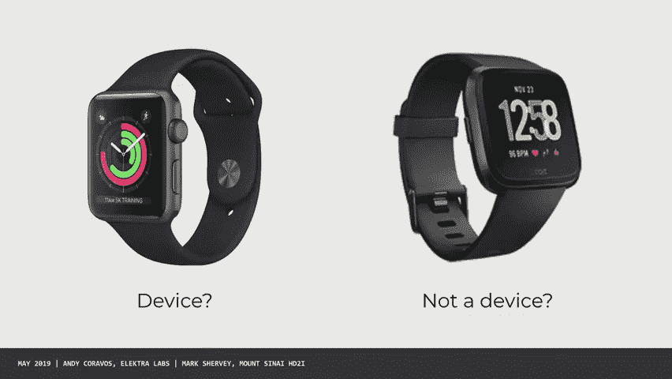

哪一个是设备，我要随机拜访某人，或者有人举手致敬，好的，谁认为这里是苹果五十，苹果手表，但我不确定Fitbit，但如果是其中之一，那很锋利，所以我们来谈谈这个，苹果确实向FDA提交了许可。

他们重新提交了，很像一个510K，他们提交了两个产品，两个桑迪的一个是基于他们PPG的信号，第二个在应用程序上，所以它有两个设备，都不是硬件，Fitbit今天没有设备，现在怎么样它是一个设备吗。

或者它不是一个装置。

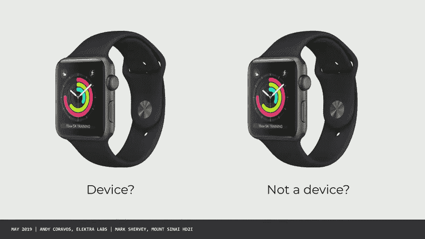

很明显，这是一个诡计问题，因为那里有两个设备，然后一些不是设备的东西，所以这真的取决于你声称什么。

产品有，回到那组模块化，产品到底是什么，产品也是，信号处理算法是产品，应用程序是产品，整个系统，所以人们在战略上坦率地思考，比如哪些部件是设备，因为你可能有，您可能希望其他人在您的系统上构建。

所以也许你想让你的硬件成为一个设备，然后其他人可以以此为基础，所以有战略性的思考方法，所以这里疯狂的是，如果你能想象这个，完全相同的产品可以是一个设备，也可以不是一个设备，只需改变文字。

不改变硬件或代码，所以如果你想想我的产品是不是一个设备，实际上不是最有用的问题，更有用的问题是产品的预期用途是什么，你是在用你的产品做医疗设备索赔吗。

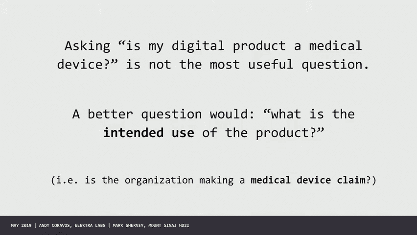

显然这有点势不可挡，我觉得，试图弄清楚如何导航这一切，美国食品和药物管理局认识到，他们的目标是增加创新，尤其是对于像软件这样不断更新的产品，如果你不断地找出所有不同的单词，这似乎有点困难。

以及如何将这些产品推向市场，所以我认为食品和药物管理局正在试点一些真正创新的东西，这是他们正在考虑的一个程序的例子，它与九家不同的公司合作，这个想法是。

你能预先认证一个正在开发软件的整个公司是一个优秀的公司吗，跨越一系列目标，然后允许他们发布额外的更新，所以今天如果你有一个更新，你想做一个改变，你必须经历一个完整的510K或从头开始的过程。

或其他类型的过程，挺狂野的，如果你想象一下，我们只会让Facebook每年发布一次更新，那就太疯狂了，我们不指望Facebook喜欢，维持或维持人的生命，所以能够以更定期的方式进行更新是非常重要的。

但你怎么知道这种变化会不会产生巨大的影响，我会暂停这个，但你们都看了文件，事实上，我很高兴你不和我们说话就看了这份文件，因为你是那些不一定有背景的人的观众，所以它需要以一种人们可读的方式来表达。

他们正在开发这些类型的产品，知道如何并进入它们，在讨论结束时会节省一些时间，因为我很好奇你是怎么看待这件作品的，但你绝对应该相信你的第一次阅读是诚实的好阅读，你也可能比任何正在阅读它的人阅读得更强烈。

所以你做的笔记是有效的，我很好奇你看到了什么，好的，另一件能让你在鸡尾酒时间保持冷静的事情，FDA批准。

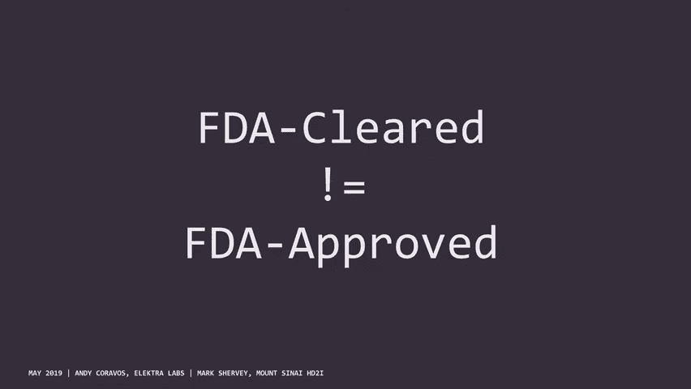

和FDA批准的不是一回事，好的，所以四个设备，有三条途径需要思考，一个是五十个K，下一个是从头开始，下一个是上市前批准，也被称为PM MA，他们通常根据某件事是否有风险来分层，以及必须提交的数据类型。

获得这些许可的风险各不相同所以你的风险越大，您必须拥有的数据类型越多，德诺博斯被授予，但人们经常会说清除了五个十个K清除了，你见过的产品很少。

经历一个和一个PMA过程，告诉我你知道苹果为什么选择做NOI步骤五十吗，我不是苹果，但如果让我猜，一旦你重新创建了一个，然后你可以成为其他事情的谓词，所以如果他们想创建一个新的谓词类，随着时间的推移。

他们可以在此基础上再接再厉，他们不想喜欢，陷入一种旧类型的谓词系统，我从战略上考虑，事实上，他们选择了一个PPG和他们的应用程序，我不知道随着时间的推移他们最终会做什么。

但我认为这是他们长期战略的一部分，大问题，这些工具是安全有效的，可能取决于提交的数据数量，但是从工具中收集的信息呢，所以今天我们的医疗保健系统对生物标本有很强的保护，你的血液，你的大便，你的基因组数据。

但我们对数字标本真的没有任何保护措施，你可以想象我们经常有多少数据泄露，Facebook上有什么广告，其中很多被认为是健康数据，实际上不是健康数据，但在许多情况下，你会发现相当多的健康信息从某人那里。

我还有很多我们可以永远学到的东西，但总的来说，有几件事是很好的，有了这些数据，你再也无法识别它了，谁认为我可以识别我的基因组，你不能写得像我的基因组对我来说是独一无二的，也许你可以去掉个人身份信息。

但你不会真的去识别它，我可以用30秒的步行数据唯一识别，所以所有这些生物特征都是非常具体的，今天有一些机构正在考虑如何处理这些工具，但最终我认为有一个相当大的差距，所以总的来说。

FDA真正关注的是安全性和有效性，安全被认为更多的是身体安全，而不是像，我们作为人类是非常可编程的，以及我们看到的信息类型或更改安全类型，所以我们收集的数据和FTC在这里可能有很大的力量。

但他们是一个小得多的机构，资源不足，有几个不同的组织正在试图思考，如何为物联网制定规则以及如何使用这些数据，但总的来说在我看来，我们可能需要国会围绕数字样本数据的非歧视采取某种行动。

这将需要一个能够思考的国会，我认为一个非常困难的问题是如何处理数据权限和管理，好的，所以我将通过几个例子来说明政府机构是如何互动的，与公众人士，我想你可能会感兴趣，其中许多公司，许多政府机构。

他们真的在思考，意识到他们不一定是他们领域的专家，他们如何获得他们需要的数据，所以有几件你会感兴趣的作品，我想一个是食品和药物管理局和杜克大学有一个联合小组，他们在思考所谓的新端点。

所以如果你今天在做一项研究，在那里你意识到你测量的东西比金本位制更好，金本位制实际上是一个相当糟糕的金本位制，如何创建和开发一个新的度量，可能没有参考标准或遗留标准，这是一种思考的方式。

第二个是选择一种移动技术，这种技术过去被称为移动设备，他们改变了它，因为同样的原因，不把东西称为设备，除非它是一个设备，所以这些人在思考什么样的连接技术，您想用来生成您可能在研究中使用的患者数据吗。

所有的权利，这里有谁知道什么是防御，你们三个好的，所以def con在一个黑客会议上，这可能是最大的黑客会议之一，这是一个会议，如果你真的有兴趣去，你不应该带手机也不应该带电脑。

你绝对不应该连接到互联网，因为有一个叫羊墙的团体，他们会直接流你所有的Gmail，密码，纯文本和您的帐户登录，你放在互联网上的任何东西，你可能也听说过他们因为他们去年买了很多投票机，黑了他们。

找到了投票记录，并将他们送回国会，说嘿，你可能应该修复这个防御系统，有许多村庄位于主防御系统下，其中一个叫生物黑客村，还有一些生物黑客，比如做RFID芯片公民科学，但生物黑客村也有一群人在做什么。

所谓的白帽子黑客，所以对于知道这件事的人来说，有黑猫在那里你可能，嗯，你知道的，比如加密某人的网站，或者为了赎金扣留他们做一些破坏性的事情，白帽黑客被认为是有道德的黑客，他们在对一种产品进行安全研究。

所以生物黑客村的黑客，开始在起搏器上做很多工作，这些都是相互联系的技术，很多心脏起搏器公司有一个简单的方法来思考他们是如何看待这个问题的，就是，起搏器公司通常试图优化电池寿命。

他们不想做任何计算上昂贵的事情，原来加密东西在计算上是昂贵的，他们做了一个有规律的微不足道的利用，在那里他们能够对协议进行逆向工程，起搏器尽可能长时间地保持低功率模式，如果你按它，就会变成大功率模式。

这样你就可以抽干一个多，起搏器的齿轮电池在几天或几周内，和，他们还能够进行逆向工程，心脏起搏器对心脏事件的冲击，所以这很重要，对这种利用可以对任何正常的科技公司做什么的影响，当您有这种类型的漏洞时。

你可以去Facebook，你可以去亚马逊，有一种叫做协同披露的东西，你可能会有虫子赏金，然后共享更新，您可以提交更新，然后你就和设备公司玩完了，通常的情况是研究人员会去设备公司，嘿，我们发现了这个漏洞。

设备公司在说谢谢，我们现在要告你，安全搜查就像，你为什么要告我们，他们说你在篡改我们的产品，我们受机构监管，我们不能随时发布更新，所以我们必须看到，你发现那不是真的，FDA发现了这件事，他们就像。

你不能就这样起诉安全研究人员，如果您有安全问题，你得把它修好，所以FDA做了一些相当大胆的事情，那是三年前的事了，他们进入了防御状态，如果有人真的去了防御，你就会知道你不去防御，如果你是政府的一部分。

因为有一个游戏叫找到美联储，你不想被发现，当然还有，你知道吗，我和国安局中情局，就像，许多政府成员将进入戒备状态，但它通常不是一个特别友好的环境，生物黑客村说嘿，我们会保护你。

我们会给你一个扬声器的位置，我们真的很想和你一起工作，所以在过去的三年里，该机构一直在与安全研究人员密切合作真正思考最好的方法，UM网络安全，特别适用于连接设备，所以如果你看看过去的几个指南。

有一个上市前和上市后的指导，他们一直在合作，他们是非常好和强有力的指导，食品和药物管理局做了一些非常有趣的事情，那是在一月份，他们宣布了一项新的倡议，我觉得这很神奇，称为标签，我们心脏黑客。

如果你去WehardHackers，www。icj-cij。org，FDA一直在鼓励美敦力和BD等设备制造商，飞利浦和热力，费舍尔和其他人带着他们的设备，与安全研究人员一起工作。

另一个可能值得了解的群体是，如果你想想，很多这些连接的产品，他们，在许多情况下可能会增加或改变临床医生的工作方式，所以今天，如果你是一名临床医生，你从医学院毕业，你会像希波克拉底一样发誓不做伤害。

软件工程师和这些产品的制造商应该，也发誓不做伤害，那个誓言看起来相似还是不同，这种思路帮助人们意识到，有完整的专业社区和协会为从事这种工作的人服务，对于他们专业的医生来说，所以神经肿瘤学协会。

美国放射学会，但是对于从事数字医学的人来说，真的没有社会，所以现在有一个小组正在开始，大家可能都想加入，因为我想你们都会是这种社区的一部分，这是一个社会，因为它被称为一毛钱社会，所以如果你在想。

我如何对这些数字产品进行知情同意，我需要思考监管的新方法是什么，我将如何与我的IRB一起工作，这个社会可以成为你的资源，那么你如何参与规则制定过程，一个是我非常鼓励，如果你有机会，你在政府工作一段时间。

有更多的机会通过像总统这样的组织来做到这一点，创新研究员，成为企业家居民，成为美国数字服务的一部分，CMS的支付系统就像数百万行钴，所以这显然需要一些修复，所以如果你想做一项服务。

我认为这是一个非常重要的方式，你可以做的另一种方法是提交给公共目录，所以这是我要求你做的事情，我们之后再谈，你如何把你在白皮书中学到的东西，以及你可以与机构分享的方法，你将如何使用该产品。

你会考虑围绕人工智能机器学习制定规则和规律，有一个更长的资源，你可以看看我的朋友米娜写道，也就是，嗯，有几件事要知道，所以任何人都可以评论，你会被听到的，如果你写了一个很长的评论。

机构里可能有很多人必须阅读你评价的每一件事，所以请明智地做这件事，但你会被听到，大多数时候评论来自大组织和聚集在一起的人，而不是从体验和使用大量产品的人那里，所以在我看来。

我认为像你这样的人对中情局来说是一个非常重要的评论和声音，并有技术视角，你可以做到这一点的另一种方法，我要把艾琳放在一个位置上，我们需要新的监管范式，所以当你出去喝啤酒或吃冰淇淋的时候。

或者你为了好玩而做的任何事情，你可以通过新的模型来思考，所以我们在考虑一个想法，你能用一个临床试验框架来思考人工智能吗，因此，算法在不同的患者群体和不同的群体上表现不同，您需要包含排除标准。

这应该是什么吗，也许我们甚至超越了医疗保健算法，你如何决定某人是否获得保释或教师福利，然后把你的想法放在网上的有趣之处在于，如果你这么做了，人们就会开始来找你，我们意识到意大利有一个团体。

他提出了一个版本的FDA算法，你开始收集那些思考或思考你正在思考的事情的人，现在我们将深入挖掘你最有可能花更多时间的东西，比政府，也就是你的IRB。

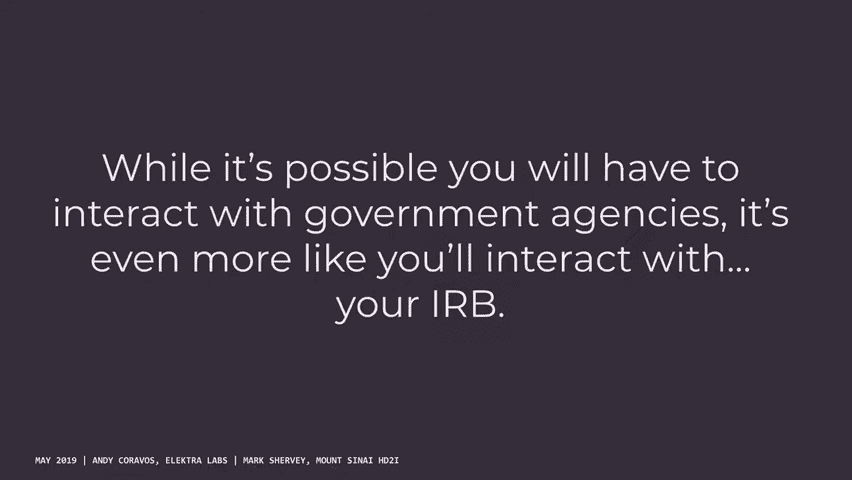

把剩下的演讲，如果你只是跟着底部的东西走，如果你不知道你是否在做人类研究，人体研究。

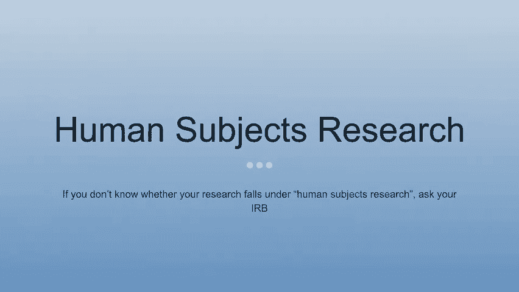

我或者B问你的教授，问问别人，我觉得，我要说的大部分都会柔和得多，比安迪跑来跑去的更湿，它真的只是试着让你的思维过程通过你的大脑，你知道的，如果我们在做真正的人体研究，嗯，IRB必须参与。

人类研究的实际构成，为了确保你知道那里发生了什么，无时无刻不在，系统的调查以发展或贡献可推广的知识，所以你可以在岩石上做到这一点，嗯，人类受试者研究的重要之处在于人们的生命处于危险之中，嗯。

最容易知道的是，如果有任何可识别的信息，使用您正在处理的数据，这将落在，不会公开的东西，匿名数据，有，你知道的，有各种各样的成像训练数据集，你可以使用，都是，什么是可接受的水平，但对安迪来说。

真的没有办法真正去识别一个数据集，我们现在处理的数据量，世界上，识别任何数据集变得不可能了，如果您有任何其他参考数据集，所以任何时候你和任何人一起工作，嗯，你几乎肯定会再次让IRB参与进来。

那么为什么IRB在那里，不是专门拍你的手腕，你知道，这并不是说任何事情都被期望故意做错什么，虽然已经发生了，这是一个如此小的数额，它只是，认为每个人都是没有帮助的，所以你不会做任何特别错误的事情。

但有些事情你可能不知道，这不是B的千分之一牛仔竞技会，所以如果你向他们提出什么，他们几乎马上就会知道，嗯，参与者正在放弃他们的时间和信息，所以IRB不仅仅是保护机构免受伤害，真的是先保护病人。

和机构同时，但主要作用是保护参与者，嗯，特别是，这里有些东西可能不是每个人都能想到的，嗯，可能有问题或过度操纵的研究，这是对学习的补偿，你可以想象一个贫穷国家的某些地方，你说我们会做的。

我们将支付每人五万美元来参加这项研究，嗯，你可以想象人们想参加那个研究，这可能会成为一个问题，所以IRB也是，嗯，确保，这些研究实际上并没有对任何人产生负面影响，在那种意义上，嗯，在我做之前。

下一张幻灯片会变暗一秒钟，所以我们会试着穿过它，但它谈到了IRB是如何产生的，嗯，所以我们从纽伦堡密码开始，对囚犯和其他人进行的人类研究，滑雪实验，人们不是的另一件事。

所以他们不知道他们实际上在接受什么测试，所以他们不可能同意，这项研究进行了四十年，而不是六个月，即使在建立了护理标准之后，研究继续进行，这基本上是国家保护人类受试者委员会的开始，嗯，导致了IRV的存在。

嗯，对研究的要求，五年后，贝尔蒙特报告出来了，只要不造成伤害，不要抽太多的血，如果这样更方便的话，如果你只是想看看会发生什么，不要添加额外的药物，嗯，然后确保参与者在外面是安全的，嗯。

你能造成的任何其他伤害，嗯，所以我们跟随贝尔蒙特报告，这基本上是我们现在所拥有的最先进的技术，这不是真正需要担心的事情，但是HHS有一个很棒的网站，有一个流程图，对于你能想到的任何情况。

来决定你是否真的在做，人体受试者，研究与否，这是最基本的一个，你可以自己经历，只是为了突出，嗯，我想你们可能会担心的主要事情是，你将收集可识别的数据，这马上就把你放在IRB的土地上，嗯所以任何。

任何你能识别的时候，这就是正在发生的事情，你只是，你在那里，所以你真的不必经历，这一切，什么是健康数据，所以你有名字，很明显，其中大多数要么是身份证明，要么是，你知道某种识别的东西，两个人的一件事。

我想很多人可能会掩盖，不那么明显的，是邮政编码吗，嗯，您必须将它们限制在邮政编码的前三个数字，它给出了一个可推广的区域，而实际上，嗯，拨入某人的位置，嗯，日期是一个极其敏感的话题。

所以任何时候你和实际的约会对象一起工作，我假设在，你知道吗，可穿戴技术，你将处理时间序列数据，诸如此类的东西，有不同的方法来摆脱，让它不那么敏感，但任何时候你在处理研究。

我们多年来处理电子健康记录的任何时候，不在实际日期，这可能会造成问题，如果你试图对某人的整个健康记录进行时间序列分析，在这种情况下，您可以获得进一步的许可来处理更多可识别的数据，但这是进步的。

如果你不这样做，就没有理由从那种数据开始，所以总是有必要知道，终于，如果你和90岁以上的病人一起工作，它们只是被概括为一个大于九十的范畴，嗯，剩下的这些，我认为是公平的，相当可猜，所以我们不必通过它们。

但那些是那种，嗯，那些是一些人再也抓不到的棘手的东西，只要尽可能严格地限制PHI的收集，如果你不需要，如果你在分享数据，就不要明白，而不是共享整个数据集，如果你有很强的PHI，嗯。

限制你给或分享给另一个研究人员的东西，那只是卫生问题，我们会得到它真的限制，可能发生的错误数量，那么为什么这一切都很重要，所以IRB再次特别在，嗯，对保护病人感兴趣，嗯，并确保对病人造成尽可能少的伤害。

嗯，只是一般的人类尊严和尊重，存在制度风险，如果某事是在没有IRB的情况下完成的，嗯，如果你在没有IRB的情况下做了人体研究，你就不能发表，所以这两个是棍子，但胡萝卜真的应该是人类尊严的前两名。

并确保你保护了任何病人，或者你参与研究的任何参与者，嗯，这是几个违规行为，我们不必走得太远，但他们都是，呃，据称在没有任何IRB批准的情况下进行的，可能涉及欺诈，这毁了他们两个的职业生涯。

但它使人们面临巨大的风险，这可能是一个更大的，常见的问题是PHI数据泄露，他们经常发生吗，它们通常不是来自外部的漏洞，都是意外，有人会在机器上设置一个Web服务器，发现有一天在家工作更容易了，嗯。

可能只是，他们不知道软件是如何设置的，所以任何时候你和PHI一起工作，它是，你真的得做过头了，确切地知道你是如何使用它的，嗯，其他漏洞正在丢失未加密的计算机，把数据放在拇指驱动器上然后丢失它。

仅因疏忽而发生的数据泄露总量，没有像你想的那样小心，所以记住总是好的，嗯，我猜，IRB和数字研究的一个新事物是，现在情况一直在变化，从面对面，招聘和研究能够在线同意，能够到达，你知道的，全世界数百万人。

嗯，并允许他们自己同意，所以这就变成了，显然是贝尔蒙特报告以来的一件新鲜事，这是我们正在与IRB密切合作的事情，以确保我们尽可能尊重病人，但也要确保我们可以开发不伤害任何人的软件解决方案。

发展成一种泳道，所以我们想出了一个框架，有一个项目是，你知道我们在研究所有的癌症，所以我们可以你可以发布关于不同研究的报告，这是怎么回事，看起来很重要的事情，学习是一个真实的人，同意协议的国家，嗯。

这是人类研究，受IRB的约束，那么我们就会有一个平台，用户将使用，这就像一个网站或iPhone应用程序，嗯，他们可以得到，你知道的，关于项目正在进行的文献信息，然后我们会有一个参与者。

他实际上是一项研究的一部分，他又一次通过同意覆盖了一只烘干机蜜蜂，所以从老的角度来看为什么这种发展很重要，软件开发的旧方法是瀑布方法，你在那里工作三个星期，工作三周。

在软件中实现我们已经转向敏捷方法的东西，因此，虽然敏捷使我们的生活在开发方面变得容易得多，它不是，我们不能肯定，在某些情况下，我们所做的不会影响病人，所以在一项研究中，敏捷领导是没有意义的，或者是。

我们想和IRB合作批准事情，但IRB批准需要，你知道的，两到四周的快速事情，当我们谈论项目之类的东西，这就是我们希望在敏捷环境中安全工作的地方，并试图找出IRB不一定要参与的地方，或者不想参与。

在那种环境中工作不会增加病人的风险，所以它几乎起作用了，它是用软件产品和研究来工作的，因此与IRB合作，以确保我们能把这些东西分开，并确保事情尽可能顺利地向前发展，任何额外的伤害，那就是这些，再次分类。

因此，一个项目活动将是，你知道的，社交媒体外联，嗯，共享您知道与项目相关的内容，只是告诉一个大致的想法，学习活动是你通常会习惯的同意数据共享，实际参与研究，不管是，通过佩戴可穿戴设备回答问题。

然后在这个过程中退出，这就是学习活动是百分之百的IRB，与研究没有直接关系的项目活动，嗯，如果你不知道，真的或只是三个外卖，问，尽可能严格地限制PHI的收集，在敏捷开发中工作很棒。

但在很多人类研究中它是不安全的，所以我们必须专注于哪里可以使用，哪里不能使用。

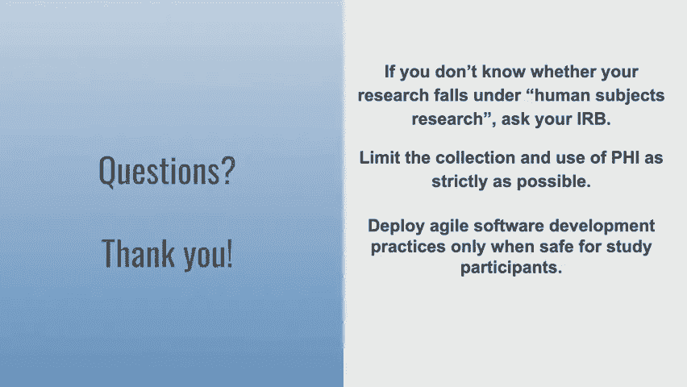

就是这样，谢谢。我有一个关于它实际上是如何做到的问题，作为IRB的讽刺，你如何确保你的研究人员是顺从的，比如写报告，做PDF，还是里面有第三方服务，是啊，是啊，是啊，是啊。

所以我们认证我们所有的研究人员都符合人类研究和HIPAA，只是毯子，如果你提供了，你有，你知道的，您的认证是最新的，那种，这是一种理解，即他们知道他们应该注意什么，IRB明白，哦，是啊，是啊，是啊。

是啊，我们使用第三方，你可以，你可以拥有，我不我们使用第三方，所以我可以加上，是啊，是啊，所以在麻省理工学院，有一个叫KO的东西，是关于将人类用作实验对象的委员会，他们是我们的官方IRB，以前都是纸。

现在有一种电子方式，你可以申请奎的协议，这是一份相当长的文件，你在其中描述了实验的目的，你要做什么，你打算招募什么样的人，你打算用什么招聘材料？您将如何处理数据，你们有什么安全措施，当然啦。

如果你在做像给人注射毒素这样的事情，那就更严重了，你必须描述关于，为什么你认为这是安全的等等，这基本上是在三个级别中的一个进行审查，有豁免审查，那就是你不能免除自己，但他们可以豁免你，他们会说。

这是一个风险最小的问题，假设你正在用模拟数据做一项仅有数据的研究，你做过城市训练，你已经签署了数据使用协议，你应该得到IRB的许可，教室里的学生有一个例外，在这种情况下，我有责任而不是让你负责。

但如果你搞砸了，我有责任，嗯，呃，第二层是，嗯，呃，啊嗯，快速批准，这是一种低风险的批准，通常只研究数据，但它可能涉及到像嗯这样的事情，使用有限的数据集，比如说，如果你想研究疾病的地理分布。

那么你显然需要比三位数邮政编码更好的地理标识符，或者如果你像马克所说的那样试图研究一个时间序列，你需要实际的日期，所以你可以得到批准使用这种数据，然后是完整的回顾，这需要更长的时间，他们做的地方。

实际上带人来评估，到目前为止你所提议做的事情的安全性，我的经验是，我们所做的研究，代表了我们在课堂上学习的材料，我们不必进入第三类，因为我们实际上没有做任何可能伤害单个病人的事情。

除了在声誉或面向数据的意义上，这不需要全面的审查，这就是当地的情况，哦耶，谢谢。是啊，是啊，是啊，是啊，我想我误解了这个问题的全部内容，嗯是的，这和我们的事情大致相同，艾迪·戈尔登是我们的研究项目经理。

3。办公室里我最喜欢的人是谁？她把这种东西放在一切上面，并确保合适的人被列入研究名单，人们不再喜欢那种东西，但和IRB之类的关系很好，因为有人不熟悉高水平的敏捷软件开发实践，它只是更并行。

你必须更频繁地，是啊，是啊，是啊，是啊，我不知道我是不是把幻灯片拿出来了，但有些地方，你知道的，亚马逊将每年部署5000万次更新，或者类似的东西，所以它一直在更新频率上，而不是，是啊，是啊。

就像把一切都建立起来然后把它扔掉一样，这只是软件的一个新发展，我们能问这个问题吗，是啊，是啊，你能告诉我们更多关于电子实验室的信息吗，我只是我不能完全理解，你们更像是，就像，所有这些工具公司。

还是更像是游说之类的事情，然后就像，我问这个的原因也是因为我想知道你对，就像第三方来源一样，嗯，一种决定，不管这些事情是好是坏，那种东西，因为食品和药物管理局似乎会理解它。

所以如果你有一些有机认证的东西，那是一个有用的解决办法吗，或者哪里出了问题，是啊，是啊，那么我们用讲座建立的是什么，实际上是连接技术的药房，所以更像今天的方式，药房里有各种药物的处方。

这实际上就像一个数字药房，就像一本凯利蓝皮书，里面有所有不同的工具，然后我们为他们每个人建立一个标签，基于尽可能多的客观数据，这样我们就不会得分了，事情是好是坏，因为在大多数情况下，事情没有好坏之分。

绝对，它们的好坏是有目的的，所以你可以想象一些，也许你需要非常高的准确性，所以你需要知道，该工具是否在某些情况下得到验证和验证，在某些患者群体中，你知道工具是否准确，如果你要一直给它充电。

或者你不能在淋浴时穿它，你不会有可用性，或者API真的很难使用，然后是安全配置文件，他们是否有协调披露，他们是如何处理事情的，就像工具公司一样，嗯，一种软件，材料清单，以及使用什么样的软件。

然后即使工具是准确的，即使它相对可用，即使它是安全的，这并不能解决剑桥分析的问题，那么工具做得怎么样，第三方转让，所以我们的哲学之一是，我们不得分，但我们正在构建数据集，所以当你评估某个工具时。

你这就像营养标签，就像有时你需要更多的糖，有时你需要更多的蛋白质，也许你需要更多的安全措施，也许你真的需要考虑数据权限，也许你可以在一些准确性水平上休息一下，所以我们正在建立这种能力，评估工具。

然后像这样部署它们，药房部署它们的方式，我想和团队一起做的一件事，如果你们都愿意，出于公民义务，我是认真的，尽管我投票很重要，把你的意见提交给公众登记册是非常重要的，我读了你所有的评论。

因为艾琳发给了我，他们很好，我知道来这里的人可能想喜欢波兰语，一切，让他们完美，你可以准确地提交它们，我非常希望，我们有95%的人提交，你们中的5%不喜欢你的互联网坏了什么的，嗯，你今晚可以提交。

我会给艾琳发电子邮件，因为你已经完成了这项工作，你可以提交它，但我想听听你的一些想法，所以我要做的是用同样的框架，你会留着什么，你会改变什么，然后改变也可以包括在那里如此令人困惑的事情。

就像它甚至没有真正的意义，部分混乱可能是在，你知道的，有些规定令人困惑，但令人困惑的是这份文件的一部分不是由，有些人有技术背景，有些没有，所以有时有些语言可能实际上并没有被使用，以今天工业使用的方式。

所以提炼语言，然后你看到了什么，所以我们要做的是，然后像开始或者加，在我问你之前，我想让你认真地看着你旁边的人，如果你们有三个人，那很好，我想让你告诉他们你什么时候提交评论，是明天晚上吗？或者你选择不。

就看着他们说话，会有一个链接，我会把所有的链接发给你，我会让这变得很容易，所有的权利，谁想开始，我们在黑板上有三件事，所以有一件事我不知道这是否令人困惑，或者只是一个，你知道我们故意。

但是对于质量体系和机器学习实践，或者谁制定了这些标准，以及如何适应或改变它们，嗯嗯，我也不知道答案，所以我想让你提交一个很好的东西，那就是你必须回应，是啊，是啊，我想这也有点令人困惑，甚至语言。

所以人们用不同的东西，所以就像，好人称之为GXP，良好制造规范，良好的临床实践，这些都得到了维护，我想在某些情况下，不同的机构，我想知道好的算法练习差距，还是好的，嗯，机器学习实践，比如谁，是啊，是啊。

那是件好事，那么谁拥有，gxp，你没有问题，否，是呀，我想要一个我觉得很有用的东西，钥匙，嗯，是附录中的例子，嗯，我不知道，建筑本身更像是，广义，所以这些例子对，比如什么是分析的具体情况，像这样，是的。

例子很有帮助，是的，你知道，细节，我想的是透明度，他们本可以更具体，好像是，我们一般应该遵守指导方针，与之相反的是进入这个算法的精确数据集，到底从里面出来了什么，正是这样的事情帮助人们，而不是你知道的。

不透明有很多诱因，所以如果这些不是那么具体，我不会在那里读那么多，我想到的模拟有点像，当Facebook问我你的数据时，他们会说，以下是我们需要的东西，或者我们正在使用它是非常明确的，然后你可以选择。

就像，不管你是否真的想那样，好的，你见过类似的东西，所以它的一部分就像透明度，也喜欢用户选择，和在数据选择方面，或者我认为这对我来说更像是一种模拟，因为医疗环境中的选择更多的是莱科斯，是呀。

某人在这种情况下没有能力或知识来做出选择，是啊，是啊，我想至少说这个算法使用了这个，你知道的，也许是某种选择，所以你可以和某人一起工作，也许有一些参数关于你什么时候会或不会有，是呀，哦。

我想补充的另一件事是关于偏见，因为我知道对于很多其他行业来说，就像包含在里面，像法律制度，然后也在，所以我认为按人口分类，我不知道我睡得够不够，所以如果我举这个例子。

但是我的一个朋友上周打电话给我要PPGS，所以这些是背面的传感器，她在问我，如果它对所有肤色都有效，以及它的反应是否不同，如果它的反应不同，不管某人是否有纹身，因此，对于一些正在做的大型注册机构来说。

自带设备数据，您可能会在数据集中产生意想不到的偏差，只是因为它是如何处理的，所以是的，你觉得怎么样，你怎么，有什么方法，我是说，我想艾琳和其中一些人合作过，怎么会，你怎么想某件事是不是，对于机构来说。

围绕偏见考虑什么是一个好的系统，我想也许考虑一下可能是GMLP的一部分，但我认为设计师有责任，然后我知道我，必须知道公平是我们的下一课，所以任何可能感到困惑或想更多地谈论它的人，我们下次会有很多素材。

加上另一个地方，所以看起来有一段时间向食品和药物管理局提供定期报告，关于更新，一切也可能有，有点像亚种群偏见的记分卡，你见过做这种事的地方吗？我记得当我从凯茜那里读到那次毁灭的时候，她提到了某种公平。

但我真的不记得了，当你提交你的评论时，如果你有想法或链接，也可以是帖子或博客，什么的，就像把它们连接在一起一样，因为你会发现一件事，你知道，我们我们读了很多东西，可能推特上也有同样的事情。

但其他群体不一定看到所有这些，所以我认为凯西·奥尼尔真的很有趣，但是是的，就像标签一样，它不必被惊人地格式化，我关注的一些社区，不是在推特上，但是在电子邮件和网络上。

有很多关于医院信息系统糟糕设计的讨论，以及这些是如何导致错误的，我从你的幻灯片上知道，安迪，食品和药物管理局已经定义了这些不在其职权范围内，但在我看来，此刻可能有。

鼓励真正不良行为的信息系统造成了更多的伤害，或者允许不良实践，你知道的，视网膜病变，AI犯错误的机器学习技术，所以就在今天早上，比如说，有人发布了一条关于一个心率为12000的病人的消息，是啊，是啊。

问题是，当您开始自动化流程时，基于这些系统中收集的信息，当你得到垃圾数据时，事情可能会变得非常糟糕，是啊，是啊，你有没有，你用你的系统想过，我们不能得到好的数据，我是说你不会从这些系统中得到好的数据。

你所看到的是全面的，你对此无能为力，除了验证良好的范围，然后从那里开始，我能想到要做的事情，比如说，如果FDA有兴趣监管此类设备，很抱歉，这样的工具，嗯，他们会调节设备。

食品和药物管理局有趣的事情之一是，我应该提到，这是FDA不规范医学实践，所以医生可以为所欲为，他们调节得很好，我是说你应该抬头看，我的理解是，他们规范营销，嗯，制造商会这样做。

我真的想知道Ehrs是否会被认为是医学实践，或者是EHR公司的营销，也许这就是为什么它可能在权限范围内，是啊，是啊，是啊，是啊，那是耶，我想我很惊讶没有看到的事情，关于隐私问题，我知道。

有一些方法可以训练机器学习模型并提取数据信息，它被训练在，至少存在的创作，这不是我的专长，我在学类似的东西，有人试图提取，你能经常谈论这个吗，你是狗的，我不记得了，现实地。

你们中有多少人认为你们会真正提交评论，一对夫妇，所以如果你，如果你认为你不会提交评论，只是出于好奇，我不跟你争，我只是好奇，什么会阻止你提交评论，你现在没有举手，我很冷，打电话给你，是呀，哈里森。

我们正在谈论，我是说，我们大多数人现在都开着电脑，你真的想让我们提交它，你可以把它挂起来，好的，好的，好的，哇哦，所有的权利，嗯，我来看看，所以当安迪在查的时候，我应该说，当HIPAA规定。

隐私条例是最早提出的，最初的版本得到了七万条公众评论，那样的话，是卫生和公众服务部，必须根据法律对每一个做出回应，所以他们出版了，你知道，关于回应所有这些请求的大量文件，所以他们会认真对待你的评论。

因为他们必须，有没有办法匿名评论，还是一定要从你的屁股里绑在我们身上，我不知道，我想一般情况下，我想是的，我不知道，我得再看一遍，我想大部分都是公众评论，我是说我想如果你想，也许你可以协调你的评论。

你可以你会吗，是啊，是啊，好的，艾琳愿意集体评论，所以你也可以发送，如果你想那样做，它可以像一组类评论，如果你愿意，大写的M I T所有小写的爱FDA会把你送到，我很惊讶那一点还没有被拿走。

扎尔在工作中睡着了，你们还有什么问题，是呀，那么两者之间的线是什么，就像EHR和理智，因为上面说人力资源是豁免的，但它也说，哦，例如，沙子可以是，你知道，收集生理信号。

然后他们可能会发出声音警报来指示原始临床工作，我的理解是有些人会这么做，因此，它们需要追溯批准，部分你的鲑鱼统一了，或者是的，所以我不是一个监管者，所以你应该问问你的监管者，一些资源可以帮助你决定。

这又是，是关于你所声称的，产品有，也许不是它实际上做的，嗯，接下来的事情，我不认为，我是说，我想如果它真的这样做，你应该喜欢，也声称它做了它所做的，尤其是当人们感到困惑的时候，有几条规定可能会有帮助。

一种叫做临床决策支持，如果你读到任何FDA的东西，他们喜欢他们的算法，我是说他们喜欢他们喜欢他们的算法，但他们也喜欢他们的首字母缩写，所以临床决策支持，cds，然后是病人的决策支持。

有一个关于两种类型的决策支持工具的指南刚刚发布，我想这可能是支持一个决定，那个EHR，所以它实际上可能被认为是受监管的东西，也有很多奇怪的，我们没有深入讨论，但在许多情况下。

某些东西实际上可能是一个设备，FDA说这是一种设备，但它会做一些叫做执行自由裁量权的事情，上面说这是一个设备，但我们不会这样监管它，这对制造商来说实际上有点风险，因为你是一个装置。

但你现在可以直接去市场了，在某些情况下，您仍然必须注册并列出产品，但你不必一定要接受审查，它最终也可能被审查，所以这一行是一个设备是一个设备，你必须注册，它是一个你必须得到批准或批准的设备吗。

这就是为什么你应该早点而且经常，我喜欢你和苹果的游戏，我对此有一个问题，我知道你也不是苹果，但你认为为什么苹果选择了一些没有，我有动机和公司去做，会说，嗯，在公开文件中。

Fitbit表示有兴趣与美国食品和药物管理局合作，我不知道他们在什么时候决定了他们提交的东西或他们的包裹，他们也在与保护计划合作，我想我不知道幕后发生了什么，是啊，是啊，它给商业带来了商业气息吗。

也许是为了得到，我想说，一般来说，人们希望使用值得信赖的工具，开发更多有证据的工具是一件非常重要的事情，我认为食品和药物管理局是获得证据的一种方式，我认为还有其他方法可以终结设备继续建立证据。

我希望随着时间的推移，我们认为是健康的许多事情，工具周围也有证据，比如，也许在某些情况下，我们并不总是调节维生素，但就像你仍然想相信，你的维他命里没有像锯末一样的东西，对吧，它就像一个真正的产品。

所以我认为我们越是推动公司有证据，我们使用这样做的产品，我希望随着时间的推移，这对我们有帮助，把它归类为食品和药物管理局的设备会给他们任何法律保护吗，我不太确定，和，历史上，它帮助偿还了。

所以二级产品更容易报销，这也在普遍改变，但这有助于围绕，我非常感谢你们两位，那真的很有趣，我鼓励你们所有人通过提交你们的意见来参与这个监管过程，我很喜欢这些演示文稿，谢谢。谢谢。

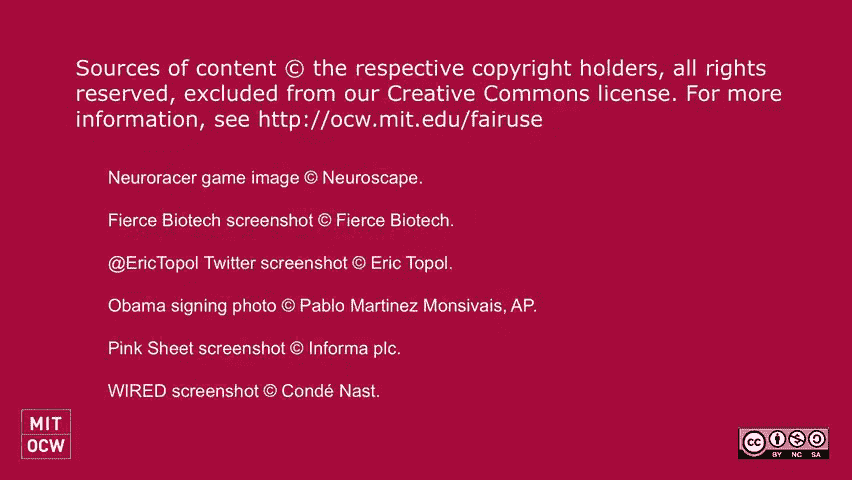

