# 1：医疗保健为何独特？ 🏥


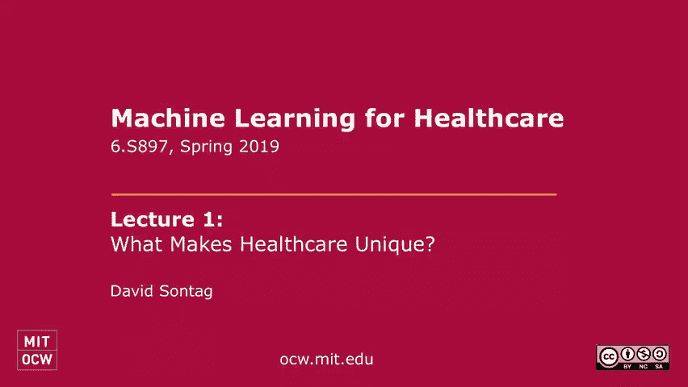


在本节课中，我们将探讨机器学习在医疗保健领域的应用背景、独特挑战以及未来机遇。我们将回顾该领域的历史尝试，分析当前变革的驱动因素，并通过具体案例理解机器学习如何可能改变未来的医疗实践。

---

## 概述：为何关注医疗保健中的机器学习？

美国的医疗保健费用过高，每年花费约3万亿美元，但效果却不尽如人意。慢性病往往诊断过晚、管理不佳，医疗差错时有发生，可能导致本可避免的死亡。医疗保健影响着我们每个人，几乎所有人都有家人或朋友曾受健康问题困扰。因此，我们面临的核心问题是：如何利用机器学习与人工智能，作为改变医疗保健现状的更大拼图的一部分？

个人经历也驱动着对这一领域的兴趣。例如，家人因阿尔茨海默病晚期诊断或血癌治疗策略选择不当而遭受的痛苦，凸显了更早、更精准干预的必要性。机器学习虽非万能解药，但它是推动系统性变革的重要元素之一。本节课将介绍AI在医疗保健中的背景，解释为何现在正是取得重大进展的时机，并举例说明机器学习可能如何塑造未来十年的医疗保健。

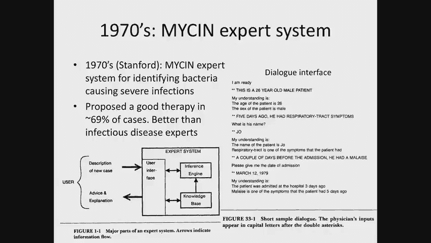

---

## 历史回顾：早期的尝试与挑战

人工智能在医学中的应用并非新概念，其历史可追溯至20世纪70年代甚至更早。

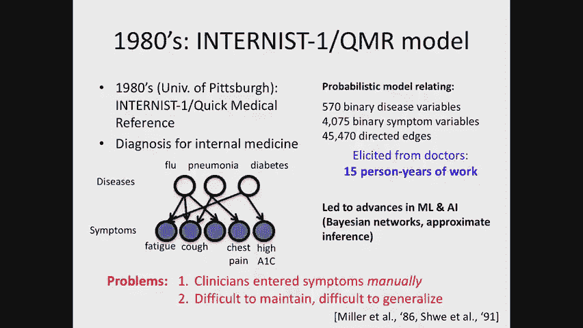

### MYCIN 专家系统

早期尝试之一是斯坦福大学开发的 **MYCIN 系统**，其目标是识别导致感染的细菌并指导治疗。该算法能在69%的病例中提出有效治疗方案，在当时甚至优于顶尖传染病专家。系统采用对话界面与临床医生交互，例如：

```
计算机：我准备好了。
临床医生：这是一个2岁6个月的男性患者...
计算机：病人的年龄是2岁6个月，性别是男性。
```

尽管技术有效，但此类系统并未融入临床护理流程。

### INTERNIST-1 / QMR 系统

20世纪80年代，匹兹堡大学开发了 **INTERNIST-1（快速医学参考，QMR）** 系统，用于初级保健诊断。它将疾病建模为潜在变量（如流感、肺炎），将症状（如咳嗽、疲劳）或实验室结果作为观测变量，形成一个庞大的概率网络（包含超过4万条边）。该模型旨在根据患者症状进行鉴别诊断。

然而，构建该模型需要15人年的巨大努力，且其设计脱离了临床工作流程（如需要医生手动输入结构化数据），导致其难以被广泛采用和维护。此外，模型无法从数据中自动学习，在新环境（如不同地区或专科）应用时需耗费大量资源重新推导。

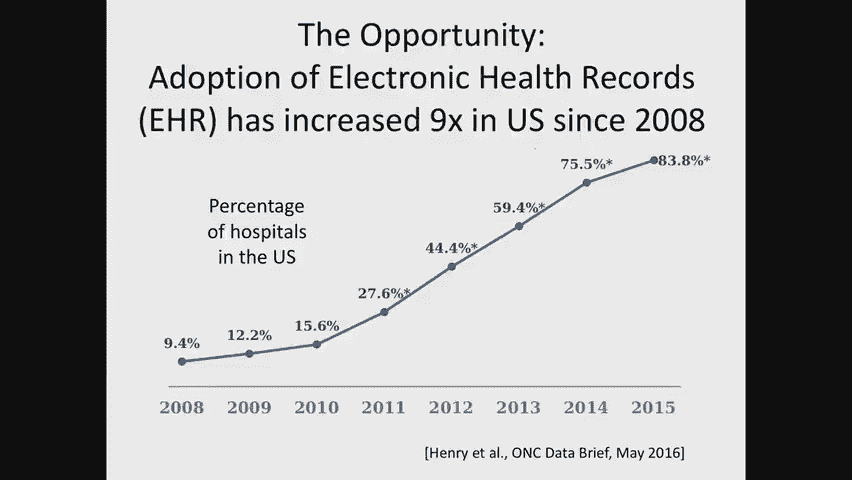

### 数据驱动的医学发现

20世纪80年代，斯坦福大学利用类风湿关节炎患者的**疾病登记数据库**进行数据驱动发现。系统能提出因果假设，进行统计检验，并将发现提交给领域专家验证。其中一个著名发现是“强的松可能会升高胆固醇”，该成果发表于1986年。

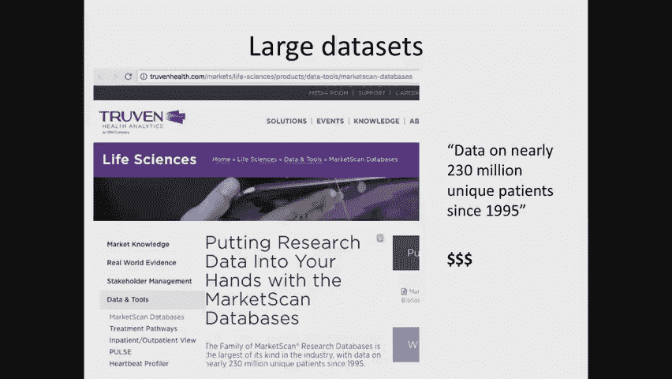

### 20世纪90年代的神经网络应用

进入20世纪90年代，神经网络开始被用于解决各类医学问题（如乳腺癌、心肌梗死预测）。然而，这些研究通常**特征数量少**（依赖手工整理的结构化数据）、**样本量小**（数十至数千例），且模型**泛化能力差**，难以在不同机构间复现。这些因素共同阻碍了技术向临床实践的转化。

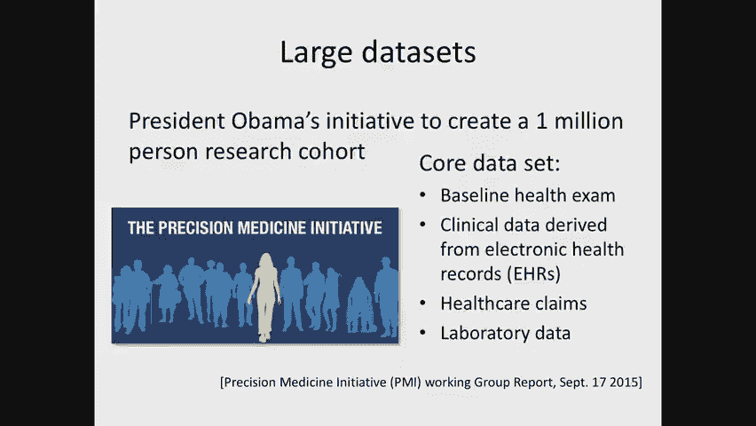

---

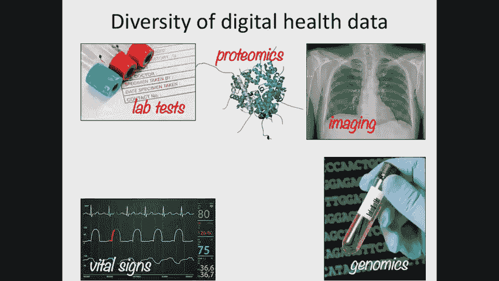

## 当前变革的驱动因素 🚀

尽管历史上面临挑战，但当前我们正处在一个转折点，主要驱动力来自数据、标准化和算法进步。

### 数据的可用性

过去，医疗人工智能大多依赖领域知识而非数据。如今，**电子健康记录（EHR）** 的普及改变了局面。在美国，2009年《经济刺激法案》投入约300亿美元推动医院采用EHR，使其使用率从不足10%大幅提升至超过80%。电子化数据为机器学习提供了基础。

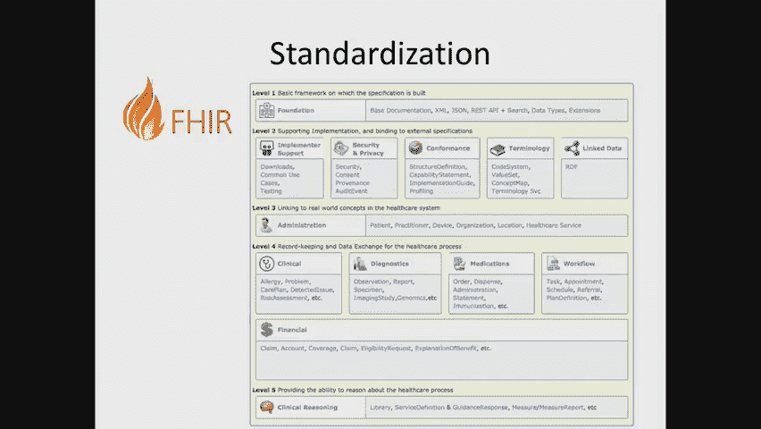

以下是一些重要的数据集示例：

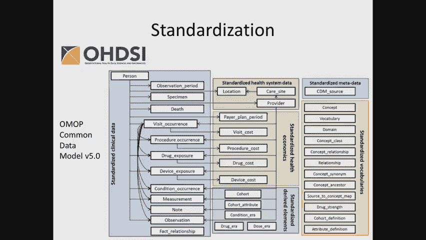

*   **MIMIC-III**：由麻省理工学院创建，包含4万多名重症监护室患者的丰富数据（生命体征、化验结果、用药记录、临床笔记等），是**全球唯一公开的大规模EHR数据集**，本课程将使用它。
*   **IBM MarketScan**：基于保险理赔数据，提供患者健康的纵向视图，但通常需付费获取，限制了其可及性。
*   **“我们所有人”研究计划**：旨在收集100万美国人的多样化健康数据，包括EHR、保险理赔、基因组学等，以支持更广泛的研究。

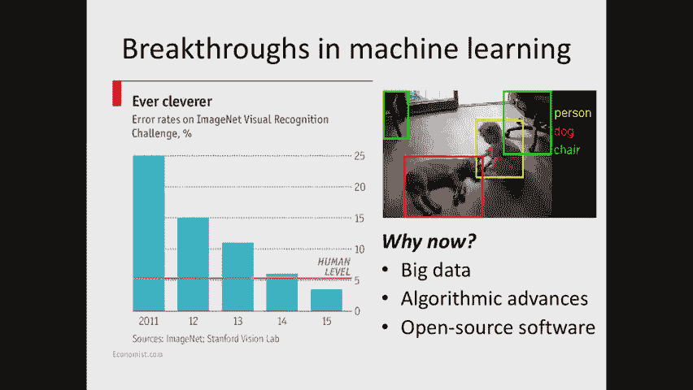

数据来源也日益多元，包括基因组学、蛋白质组学等生物数据，以及社交媒体、手机活动等非传统健康数据。

### 数据标准化

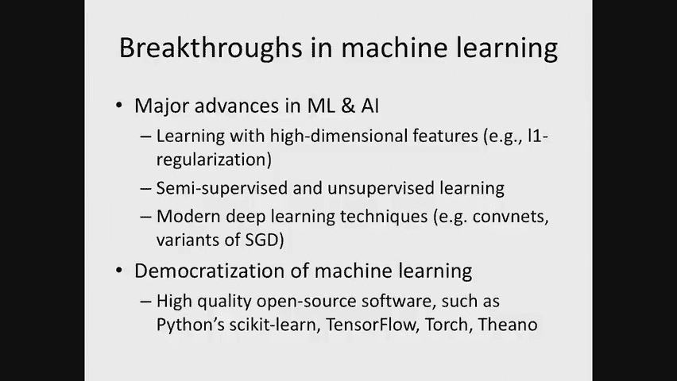

数据标准化是使算法能够跨机构应用的关键。以下是一些重要标准：

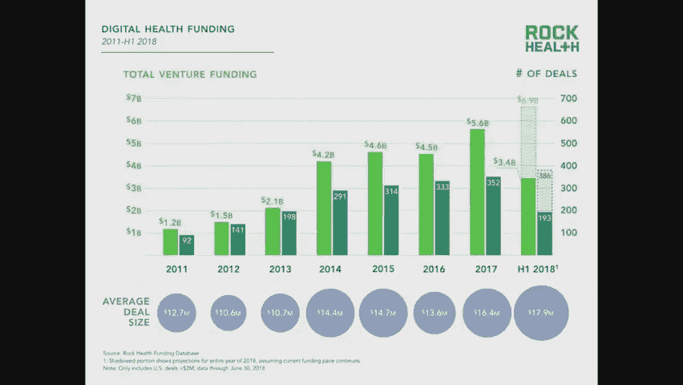

*   **疾病编码**：ICD-10等系统为诊断提供标准化代码。
*   **化验编码**：LOINC系统标准化实验室检验项目。
*   **药品编码**：NDC代码唯一标识每种药物。
*   **医学术语**：UMLS（统一医学语言系统）本体整合了数百万医学概念，有助于从自由文本中提取信息。
*   **数据交换**：FHIR（Fast Healthcare Interoperability Resources）等新兴标准定义了API，便于系统间交换数据。
*   **通用数据模型**：如OMOP，可将不同机构的数据映射到统一格式，便于算法移植。

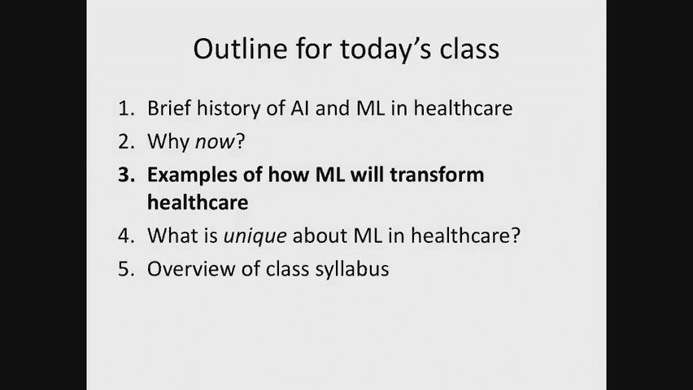

### 机器学习算法的进步

近年来机器学习在其他领域的突破也为医疗保健应用铺平了道路。

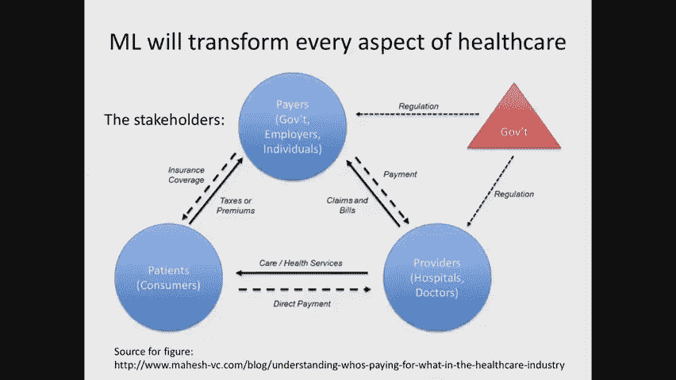

*   **大数据与性能提升**：如图像识别在ImageNet竞赛中的错误率从25%降至5%以下，证明了大数据和先进算法（如CNN）的威力。
*   **算法进展**：
    *   处理高维特征的算法（如带L1正则化的SVM）。
    *   快速优化方法（如随机梯度下降）。
    *   **半监督/无监督学习**：这对医疗至关重要，因为标注数据往往稀缺。
    *   **深度学习**：CNN、RNN等架构在图像、序列数据处理上表现出色。
*   **开源软件**：TensorFlow、PyTorch等框架加速了研究和开发。

### 行业兴趣与投资

巨大的社会影响和潜在经济收益吸引了大量投资。科技巨头（如DeepMind Health、IBM Watson）和数百家初创公司正致力于开发医疗AI工具。数据被视为核心资产，引发了并购潮（如IBM收购Merge、Flatiron Health）。

---

## 机器学习改变医疗保健的示例 💡

机器学习可在医疗生态系统的多个环节（提供者、支付方、患者）发挥作用。

### 在临床提供方（医院/诊所）的应用

以下是在急诊科等场景中应用的例子：

*   **临床决策支持**：算法可自动从EHR提取信息，推理患者状况，用于分诊、早期预警或触发最相关的临床指南。例如，系统识别患者可能符合“蜂窝织炎诊疗路径”并提示医生，医生确认后即进入标准化处理流程。
*   **减少专家依赖**：利用CNN分析胸部X光片或心电图，辅助或初步完成肺炎、心律失常等诊断，缓解放射科、心内科医生资源压力，并可能惠及资源匮乏地区。
*   **改善数据质量**：通过自然语言处理技术，自动从分诊护士的记录中预测并推荐标准化的“主诉”，提高了数据质量和录入效率。

### 慢性病管理与精准医疗

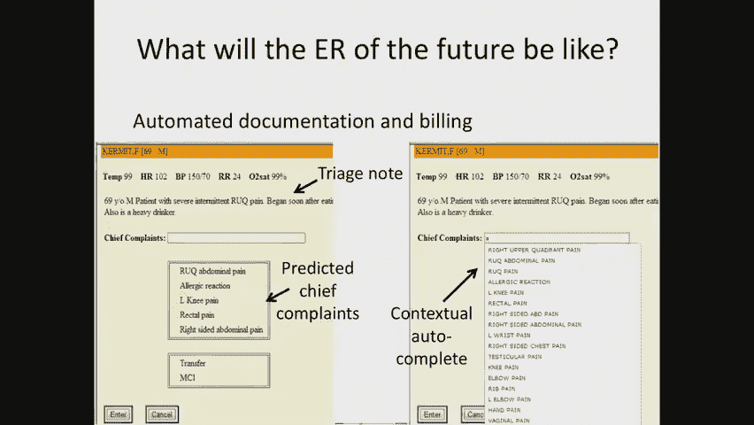

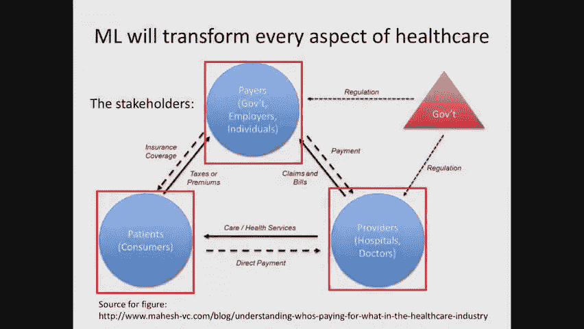

对于糖尿病、癌症等慢性病，机器学习能帮助更好地预测进展和优化治疗。

*   **疾病轨迹预测**：超越eGFR等粗略指标，利用多维度数据（化验、基因表达等）精细预测患者病情发展。
*   **治疗选择**：构建模型预测患者对不同治疗方案（A或B）的潜在反应，辅助实现**精准医疗**。这本质上是一个**因果推理**问题。
*   **远程监测与跟踪**：使用无线信号（如Emerald系统）监测老年人是否跌倒；结合手机照片预测食物对血糖的影响，优化胰岛素泵的自动调节。

### 医学发现

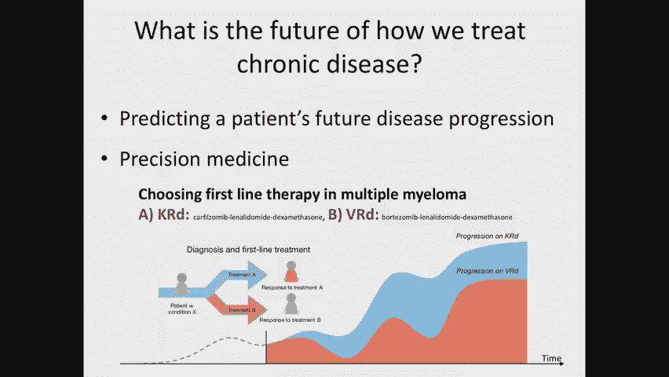

机器学习还能推动基础医学发现。

*   **疾病亚型发现**：利用聚类算法（如K-means）从患者数据中发现新的疾病亚型（如哮喘的不同亚型）。
*   **药物发现**：预测可能有效的抗体或化合物，加速新药研发。

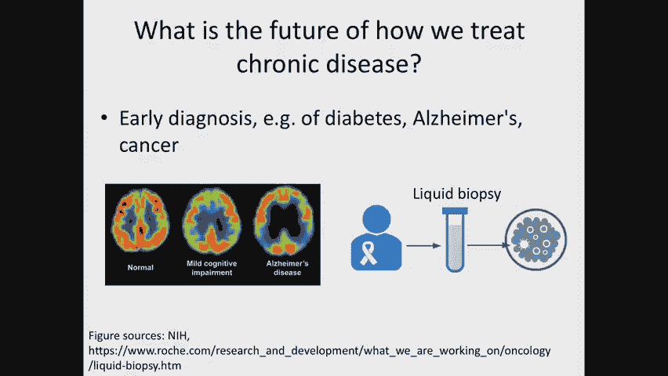

---

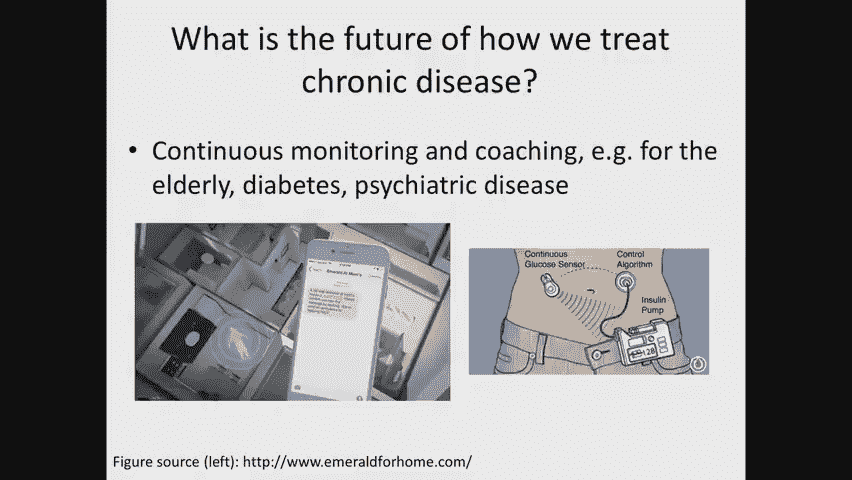

## 医疗保健中机器学习的独特挑战 ⚠️

将机器学习应用于医疗保健面临一系列特殊挑战，与通用机器学习课程所学有所不同。

### 问题本质的挑战

1.  **高风险性**：决策关乎生死，要求算法极度**稳健、安全**。需要发展形式化验证方法，确保算法行为符合预期，并建立部署后的监控制衡机制。
2.  **公平性与责任**：算法被用于风险分层、资源分配（如决定哪些患者获得上门护理）。必须警惕算法因数据偏差而加剧**健康不平等**。
3.  **标签稀缺**：许多重要预测目标（如疾病亚型、长期结局）缺乏高质量标注数据，因此**无监督、半监督学习**至关重要。
4.  **因果性问题**：很多核心问题（如“哪种治疗更好？”）是**因果推断**问题，而非单纯的预测问题。
5.  **数据稀缺性**：即使是常见病，特定罕见表现的患者样本也很少。需要利用**迁移学习**、**领域知识融合**等方法。
6.  **大量缺失与删失数据**：患者数据因换工作、换保险公司而断裂；只有事件发生时才有记录；生存分析中存在**删失数据**（只知道患者在某个时间点前未发生事件）。需要专门方法处理。

### 实施与后勤挑战

1.  **数据隐私与访问**：健康数据高度敏感，去标识化困难，导致数据共享协议谈判漫长，公共数据集稀少，**代码可复现性**成为重大挑战。
2.  **系统集成困难**：医院使用的商业EHR系统（如Epic, Cerner）并非为集成外部AI算法设计，导致**部署落地**非常困难。

---

## 课程目标与总结 🎯

本节课我们一起回顾了机器学习在医疗保健领域的漫长历史与当前复兴的驱动力。我们看到了早期系统因脱离工作流程、难以维护而失败，也看到了如今因数据电子化、标准化和算法进步而带来的新机遇。

通过具体案例，我们了解到机器学习不仅能辅助诊断，还能在临床决策支持、慢性病管理、远程监测和医学发现等多个层面产生深远影响。

然而，医疗保健领域的机器学习充满独特挑战：高风险性要求稳健与安全；公平性不容忽视；因果性问题、标签与数据稀缺、大量缺失数据等都需要我们发展新方法。此外，数据隐私和系统集成等实际障碍也亟待解决。

本课程的目标是帮助大家：
*   获得处理医疗保健数据的直觉。
*   学会将医疗保健问题形式化为机器学习挑战。
*   理解并非所有先进算法（如深度学习）都适合所有医疗问题。
*   领会安全、稳健部署机器学习算法的微妙之处。

这是一个年轻且快速发展的领域，充满开放的研究问题，期待大家共同探索。

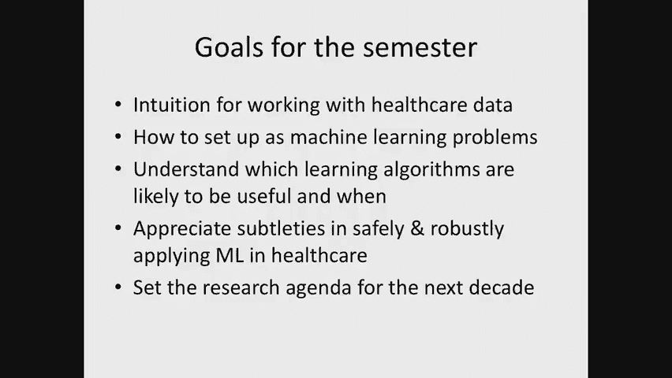

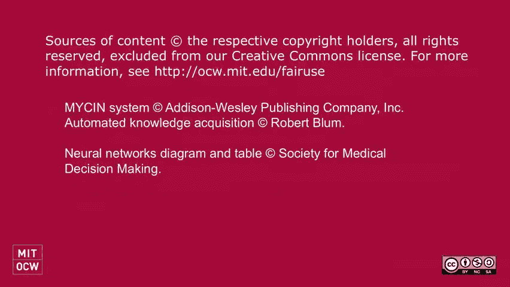


---