# 2：临床护理概述 🏥

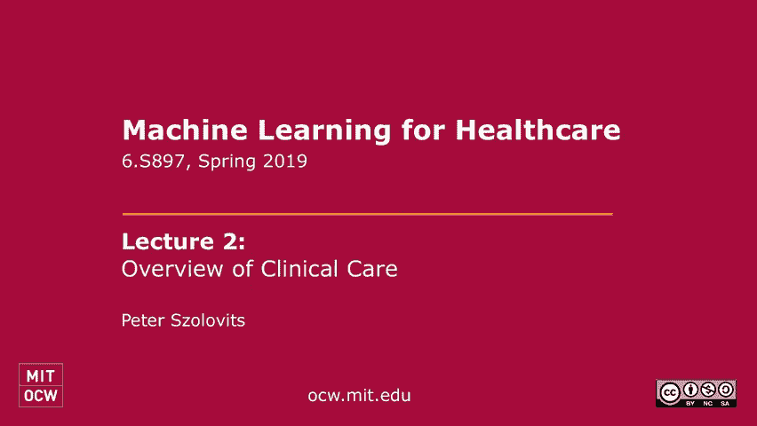

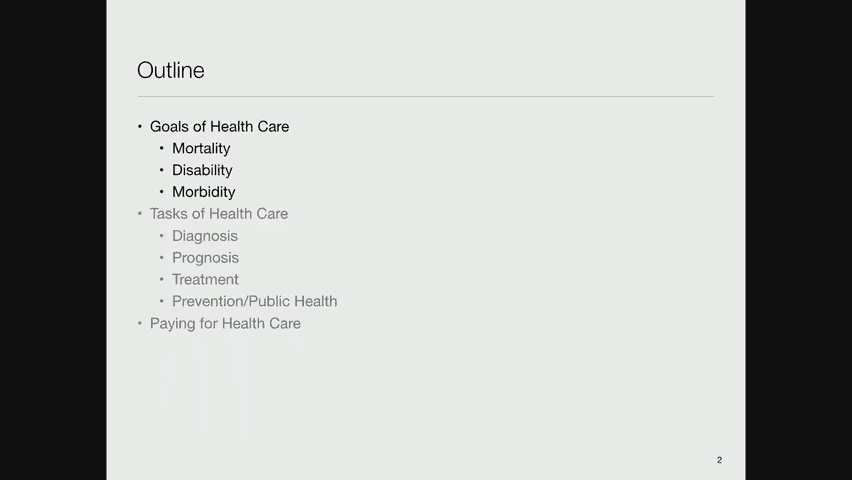

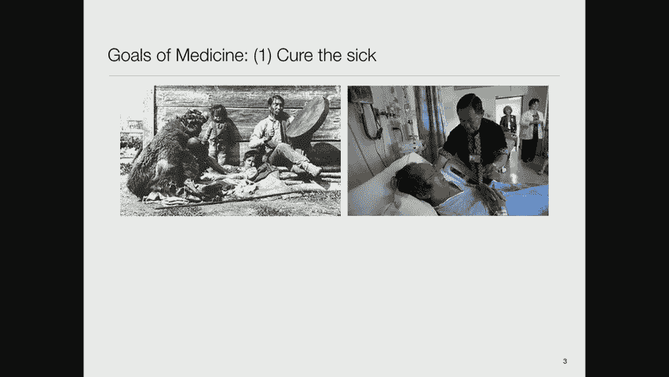

在本节课中，我们将学习临床护理的基本概念、目标、实践过程以及医疗保健系统面临的挑战。我们将从历史视角出发，探讨医疗保健如何从传统治疗发展到现代高科技医学，并理解衡量健康、生活质量以及医疗成本的核心问题。

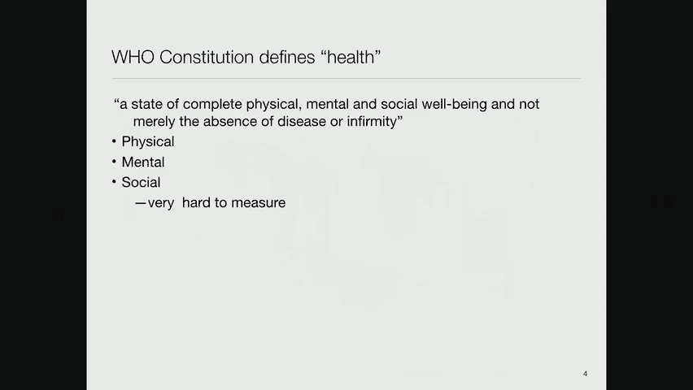

## 医疗保健的目标与演变

医疗保健的目标是维持和改善人们的健康。为了理解这个目标，我们首先需要看看医学实践是如何演变的。

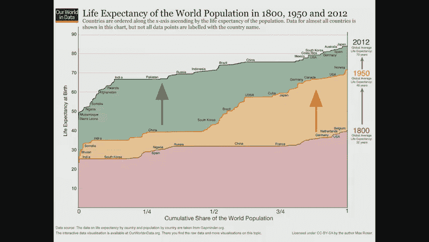

很久以前，人们就开始探讨疾病的成因和治疗方法。由于缺乏现代科学方法，早期理论可能显得简单。例如，萨满会利用对药用植物的知识和护理经验来治疗病人。这是一种有效的医疗保健形式，尽管没有太多书面记录。在现代，医生与治疗者之间的互动仍然被认为是医学实践的重要组成部分。

未来学家和医生们强调，治疗师的角色不仅仅是做出正确诊断，还包括说服病人信任并遵循建议。安慰剂效应表明，积极的心态对康复有积极作用。

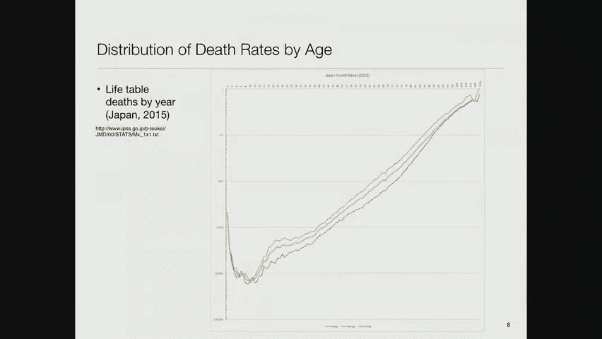

现代医学则呈现出高科技的一面，例如重症监护室（ICU），病人被各种设备和监控仪器包围，以维持生命。这被认为是当代临床护理的版本。

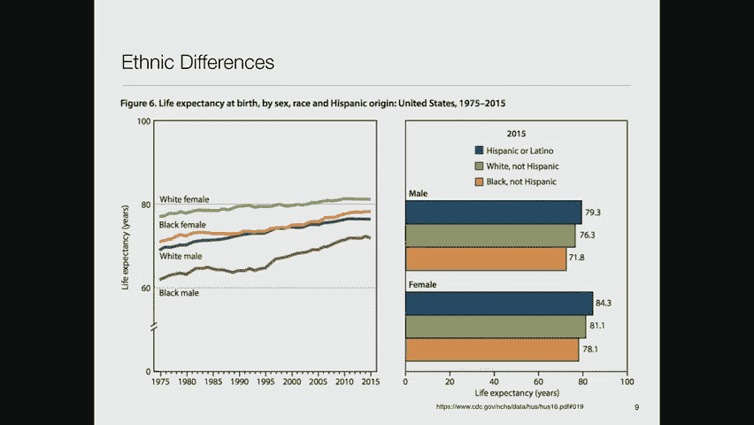

## 什么是健康？🤔

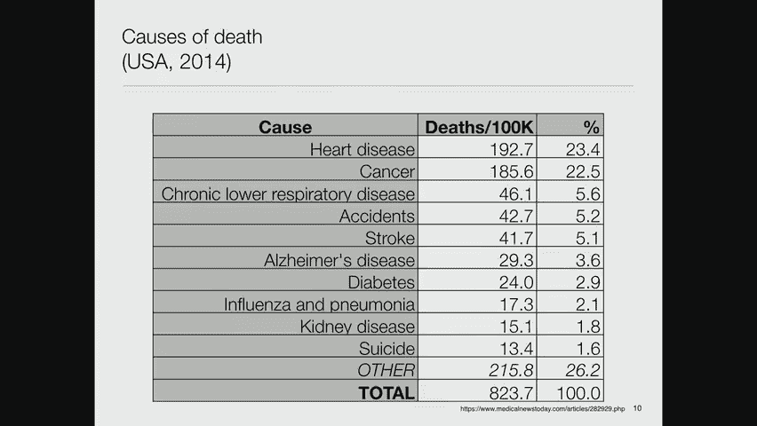

如果医学的目标是让人保持健康，那么首先需要定义“健康”。世界卫生组织（WHO）提供了一个全面的定义：健康是身体、精神和社会福祉的完满状态，而不仅仅是没有疾病或虚弱。

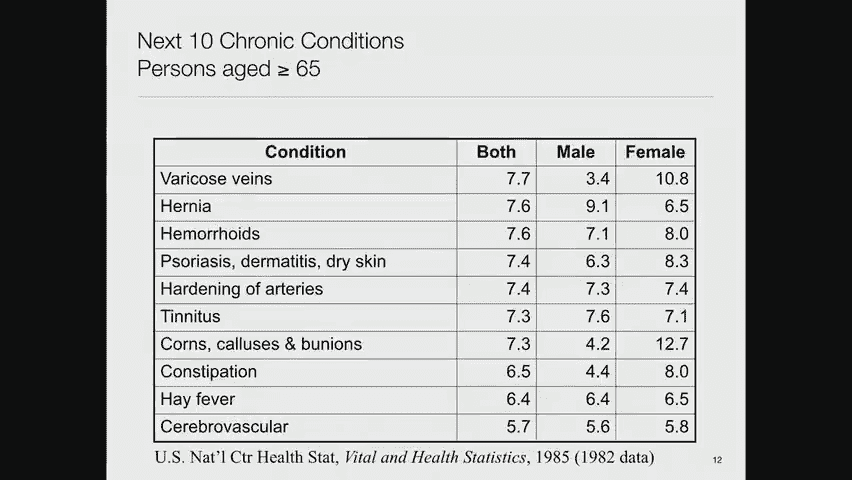

这个定义可以进一步分类为：
*   **身体健康**
*   **心理健康**
*   **社会健康**

其中，社会健康尤其难以衡量。

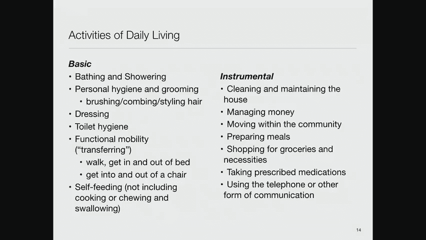

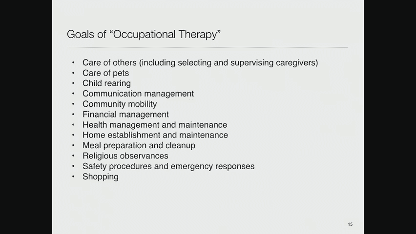

衡量健康最直接的指标之一是**预期寿命**。数据显示，从1800年至今，全球预期寿命有了显著增长。例如，在1800年的印度，预期寿命约为25岁，而在当时的欧洲富裕国家约为40岁。到1950年，挪威的预期寿命达到70多岁，美国为60多岁。如今，许多国家的预期寿命已大幅提高。

然而，不同地区和人群之间存在显著差异。例如，在美国，白人和黑人之间的预期寿命存在差距，这种差距可能与社会经济或医疗条件有关。

## 人们如何死亡？💀

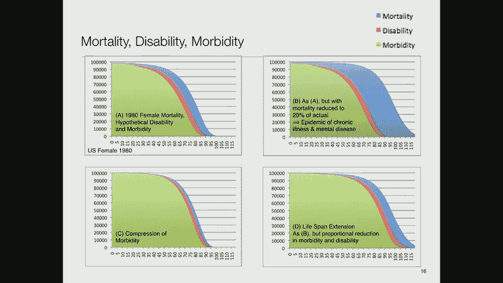

了解主要的死亡原因有助于明确医疗保健的重点。在美国2014年的数据中（近年变化不大），主要死因包括：
*   约四分之一死于**心脏病**。
*   约五分之一死于**癌症**。
*   其他原因包括慢性下呼吸道疾病、事故、糖尿病、流感及肺炎、肾病、自杀等。

值得注意的是，这些死因大多是**慢性、非传染性疾病**。这与1850年时许多人死于感染的情况形成了鲜明对比。随着预期寿命延长，人们更多地受到慢性病的困扰。

## 生活质量与衡量 🧓

除了生存，生活质量同样重要。一个常用的评估模型是计算生命的总价值，公式可以表示为：

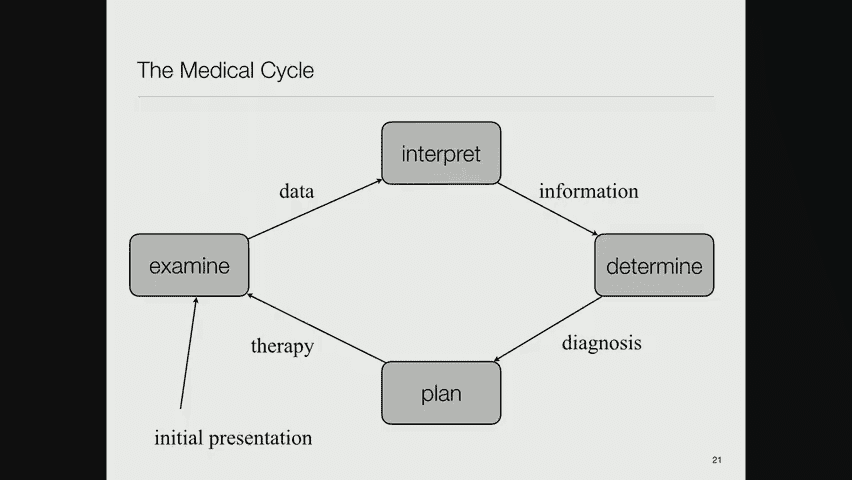

`生命价值 = ∫（从时间0到死亡时间 T）[生活质量函数 Q(t) × 折现因子 D(t)] dt`

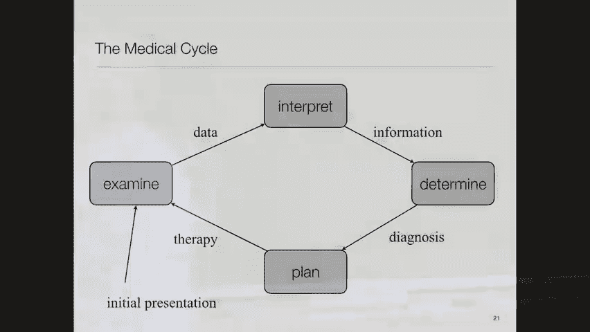

其中：
*   `Q(t)` 衡量在时间 `t` 的生活质量。
*   `D(t)` 是折现因子，反映人们对未来健康结果的偏好（通常更看重当下的健康）。

如何衡量生活质量呢？常用的一种方法是评估**日常生活活动**能力，例如：
*   能否洗澡、穿衣、如厕。
*   能否行走、上下床。
*   能否自己进食、管理财务等。

这些指标常用于评估老年人的生活自理能力。

我们可以用几条曲线来描述人群的健康状态：
*   **生存曲线**：显示一段时间后还有多少人存活。
*   **发病率曲线**：显示存活的人中有多少人没有慢性病困扰。
*   **残疾曲线**：显示有多少人无法自理，需要辅助生活。

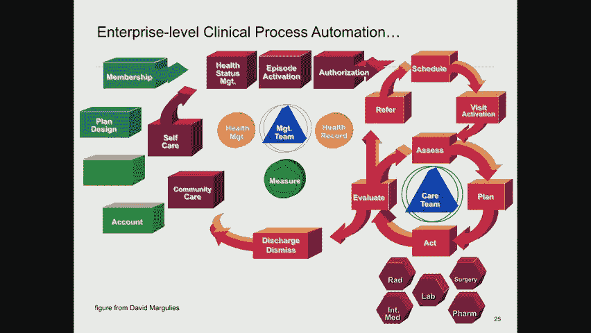

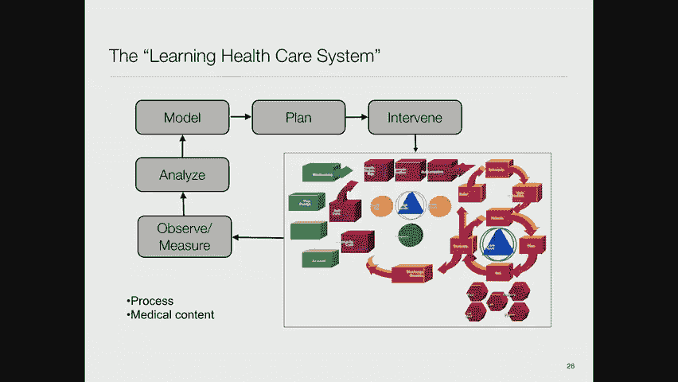

理想的医疗目标不仅是延长寿命（将生存曲线右移），更是压缩发病率（让发病率曲线更接近生存曲线），即让人们健康地活得更久，而不是在残疾或病痛中延长生命。

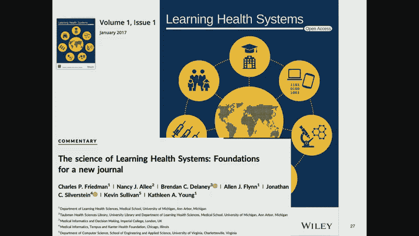

## 医疗实践的传统任务 🩺

传统的医疗实践围绕三个核心任务展开：
1.  **诊断**：确定病人患有什么疾病。
2.  **预后**：预测疾病可能的发展过程和结果。
3.  **治疗**：采取干预措施来改善预后。

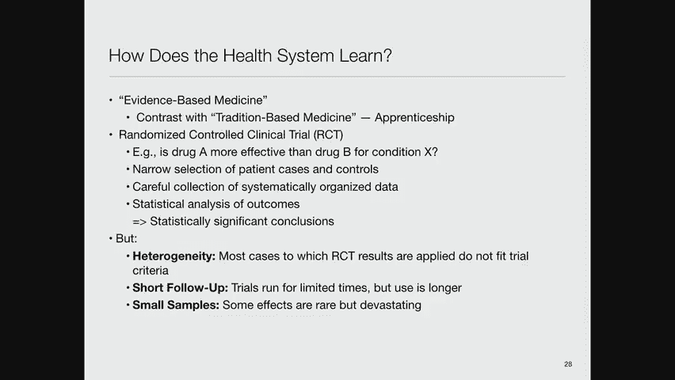

这个过程通常是循环的：
1.  病人陈述病情（主诉）。
2.  医生进行检查，生成数据（如观察、测量）。
3.  解释数据，形成初步诊断假设。
4.  基于诊断制定治疗计划。
5.  实施治疗。
6.  观察结果，收集新数据。
7.  根据反馈重新评估诊断和治疗计划，进入下一个循环。

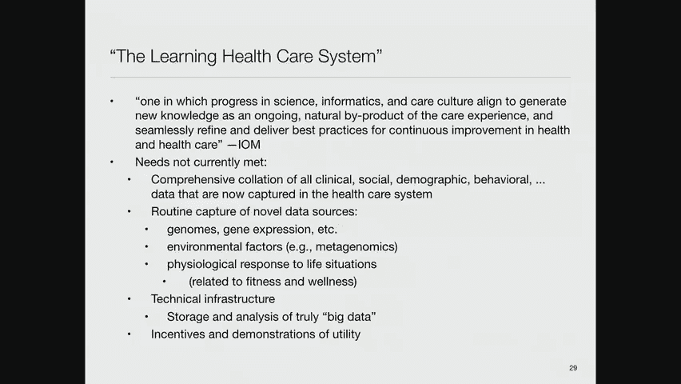

这个循环的速度因病情的紧急程度而异，可能是几小时（住院），也可能是几个月（慢性病管理）。这种持续观察和调整的过程是医疗护理的关键特征。

## 学习型医疗保健系统 🔄

医疗保健不仅发生在单个病人身上，整个系统也在学习和改进。这涉及多个层面：
*   **个体护理循环**：如上所述，针对单个病人的诊断-治疗循环。
*   **健康管理循环**：病人出院后在社区中的健康管理和可能的再入院循环。
*   **系统改进循环**：观察整个医疗系统的运行，分析数据，建模，计划改进措施，实施干预，并评估效果，从而使系统变得更好。

这就是“学习型医疗保健系统”的理念：将科学进步和信息学知识，作为护理过程中持续产生的副产品，无缝地用于完善和交付最佳实践。

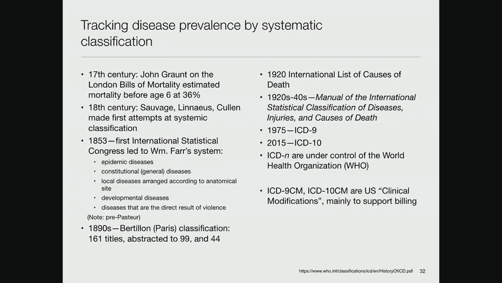

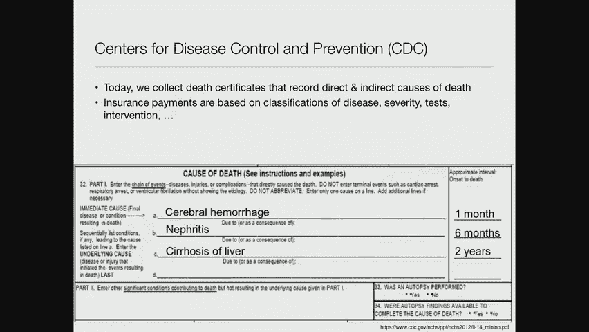

然而，实现这一点面临挑战。传统的“金标准”是**随机对照试验**，通过随机分配病人到不同治疗组来比较效果。但在真实世界的临床实践中，治疗选择不是随机的，而是基于医生判断，这导致了数据偏差。因此，我们需要强大的技术基础设施来捕获和分析真实世界的大数据。

## 公共卫生与疾病分类 🦠

医疗保健的另一重要方面是预防疾病和促进公共健康。这包括追踪疾病流行情况、控制感染、隔离患者等。

对疾病进行统一分类是公共卫生工作的基础。国际疾病分类（ICD）系统由世界卫生组织维护，用于统计死因和进行流行病学研究。历史上，约翰·斯诺医生通过绘制伦敦霍乱死亡地图，发现疫情与一个受污染的水泵有关，这是早期流行病学的经典案例。

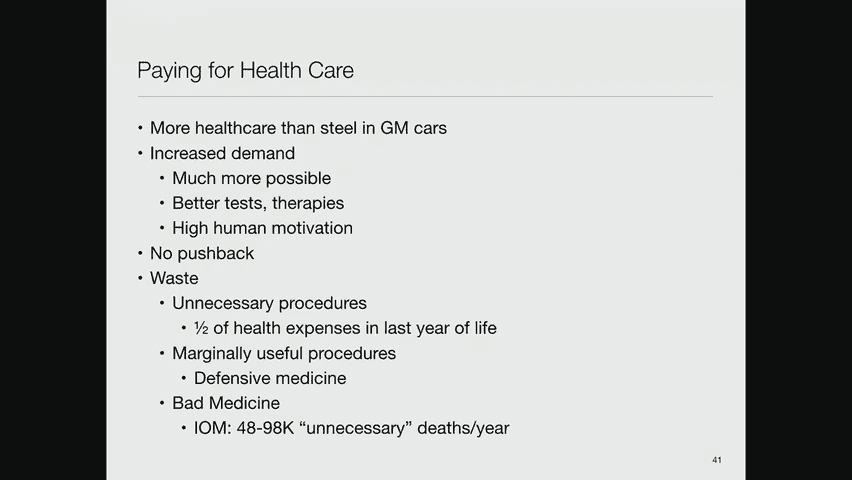

隔离是控制传染病的传统手段，但需谨慎使用，因为它涉及复杂的伦理、人权和后勤问题（如废物处理）。

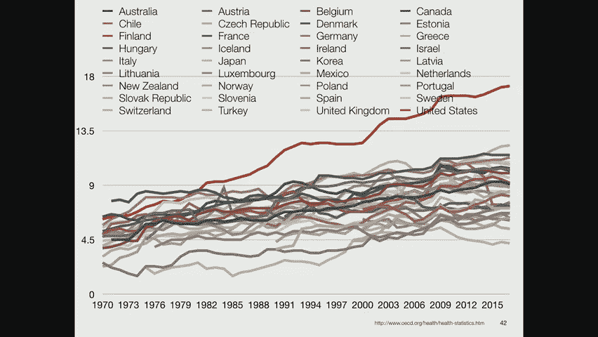

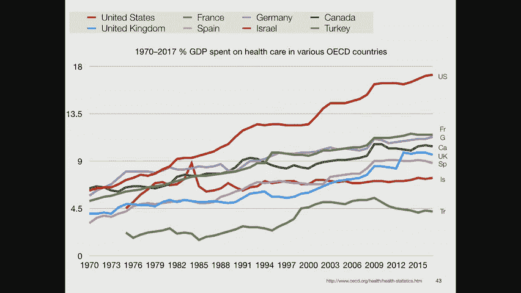

## 医疗保健的费用 💸

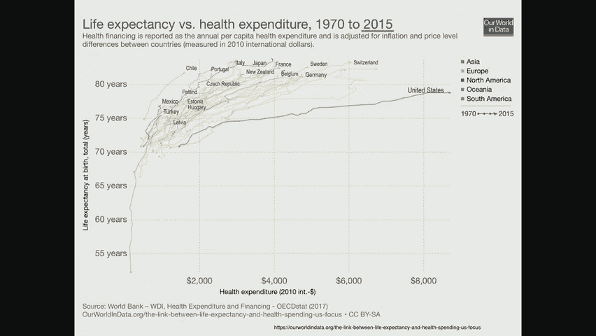

医疗费用是医疗系统面临的核心挑战之一。人们对健康有近乎无限的需求，而医疗技术的进步（如昂贵的影像设备、新药）又推高了成本。

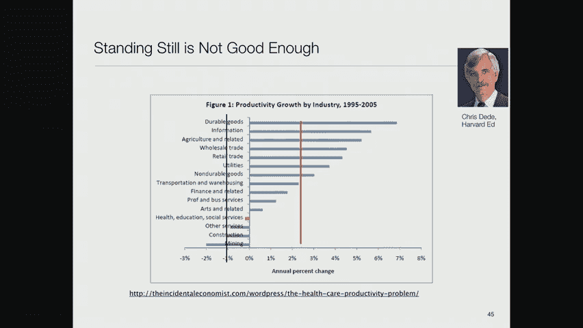

数据显示，美国的医疗保健支出占GDP的比例远高于其他发达国家，但其在预期寿命等方面的健康产出却并非最高，这表明可能存在效率问题或浪费。

为了控制成本，曾尝试过多种方法，如**管理式医疗**（通过审核减少不必要的服务）、**按人头付费**（给医生或医院固定年度费用来管理病人健康，激励其控制成本而非增加服务）等。但这些方法也带来了新的问题，如可能激励医生减少必要服务。

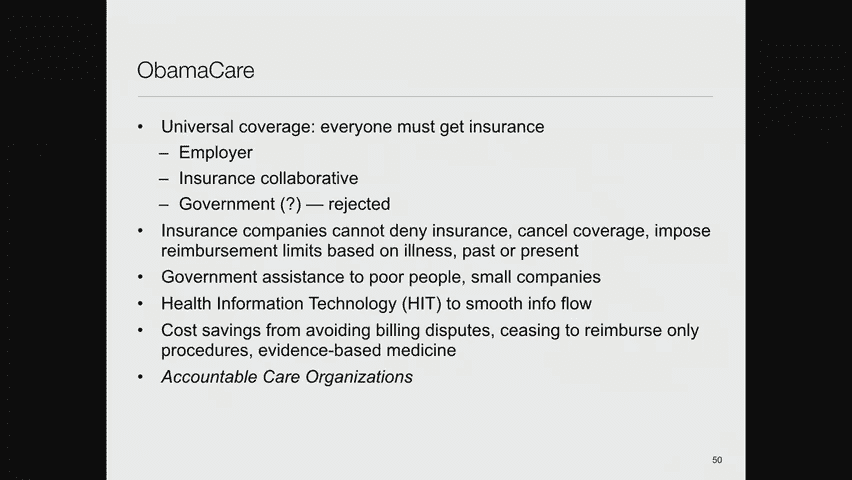

近年来，政策试图将支付与医疗质量挂钩，例如减少对出院后短期内再入院医院的报销，以激励更好的出院后护理。

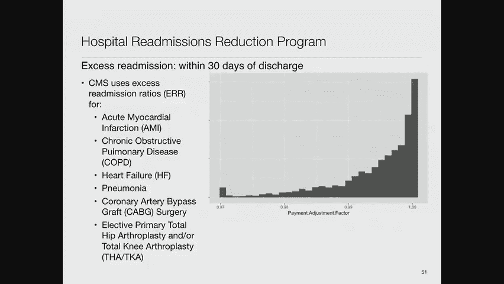

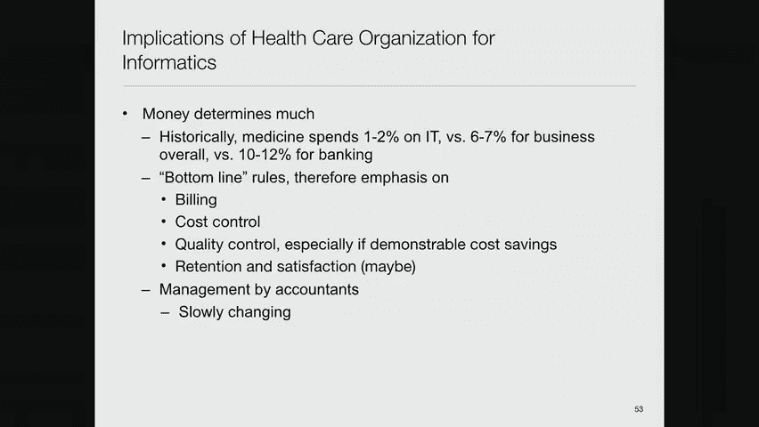

## 总结

本节课我们一起学习了临床护理的广阔图景。我们探讨了医疗保健从古至今的目标演变，理解了健康的多维度定义以及用预期寿命和生活质量衡量的方法。我们分析了当前主要的疾病负担（慢性病），并详细拆解了诊断、预后、治疗的循环护理过程。此外，我们还了解了学习型医疗保健系统的理念、公共卫生的角色以及医疗费用这一驱动系统运作和变革的核心挑战。这些基础知识为我们后续深入探讨医疗数据分析和改进医疗系统奠定了基础。