# 3：深入临床数据 🏥

在本节课中，我们将深入学习临床数据的构成、特点以及处理数据时可能遇到的挑战。我们将通过具体的例子，了解数据中可能存在的陷阱，并探讨如何从复杂的医疗信息中提取有价值的内容。

---

## 数据中的陷阱：心率分布之谜

上一节我们介绍了医学数据的重要性，本节中我们来看看一个具体的数据分析案例，它揭示了数据中可能隐藏的陷阱。

几年前，在研究MIMIC-III数据库时，我查看了CareVue系统中患者心率的分布。这个数据库包含了贝斯以色列女执事医疗中心重症监护室约12年间的入院数据。

一个技术难题是，在这段时间的中期，医院的重症监护室从一个旧信息系统（CareVue）切换到了一个新系统（MetaVision）。这两个系统并不完全兼容。

观察来自CareVue的旧数据时，心率分布图显示了一个有趣的现象：**分布图上有两个峰值**。这并不常见。

为了探究原因，我分别查看了两个系统的心率数据。来自CareVue的数据确实呈现双峰分布，而来自MetaVision的数据则呈现更常见的单峰分布。

这引发了一个问题：为什么在系统切换后，一部分人的心率似乎“变快”了？关键在于，哪部分人的心率更快？

查看统计数据发现，CareVue中的平均心率是108，而MetaVision中是87。但平均值在双峰分布中意义不大。

于是，我尝试只观察成年患者（年龄在1岁到90岁之间）。这时，两个系统的分布看起来非常接近。这意味着，成年患者群体在两个数据集中的年龄构成是相似的。

然而，如果不排除非常年轻或非常年长的患者，就会在CareVue数据中看到一个巨大的峰值出现在0岁。原因是，旧系统（CareVue）也被用于新生儿重症监护室，而新系统（MetaVision）没有，因此没有捕捉到婴儿的数据。

事实上，如果观察整个人群的年龄与心率，会看到两个奇怪的群体：我们讨论的成年人，以及心率更高的婴儿。此外，数据中还有一批“300岁”的老人。

“300岁”是一个数据 artifact（人工痕迹）。根据美国《健康保险携带和责任法案》（HIPAA）的规定，为了保护个人健康信息，不允许记录90岁或以上患者的具体年龄。因为97岁的老人数量很少，如果透露年龄，很容易被识别出来。

因此，数据库中所有90岁或以上的患者都被标记为300岁。这就像我年轻时在加州大学洛杉矶分校做程序员，我们用999.9来表示缺失数据一样。如果不加辨别地将这些数据纳入分析，就会得到错误的结果。

在成年患者中，两个系统的心率数据看起来是相似的。蓝点和红点之间的趋势线表明，随着年龄增长，心率有轻微下降，且两个数据集的趋势一致。

至于“300岁以上”的数据点，那是因为年龄是在测量心率时计算的。如果患者入院时被标记为300岁，并在医院住了六个月，那么到测量时，年龄就变成了300.5岁。

婴儿的心率确实更高。而“老年人”的数据点之所以超过300岁，可能是因为患者出院后又再次入院，系统记录了更多数据。

这个案例的教训是：**查看数据时必须非常小心**，因为数据中可能包含各种有趣的人工痕迹，很容易误导分析者。

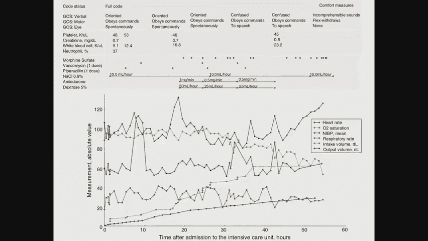

---

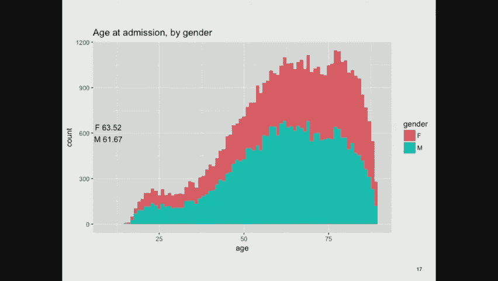

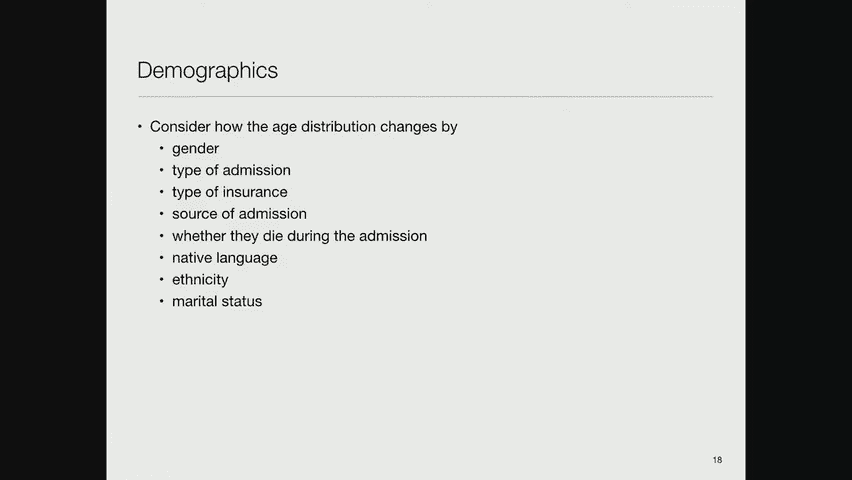

## 临床数据的类型目录

理解了数据陷阱后，我们来看看临床数据包含哪些主要类型。以下是医院电子健康记录中典型的数据类别：

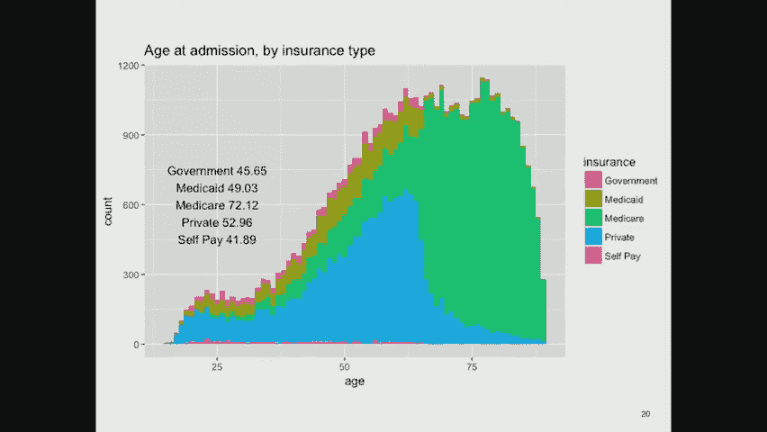

*   **人口统计学数据**：保险类型、语言、宗教、生活状况、家庭结构、地点、工作等。
*   **生命体征**：体重、身高、脉搏、呼吸频率、体温、血压等。这些是就诊时的标准测量项目。
*   **药物**：处方药、非处方药、非法药物。患者有时会对医疗提供者隐瞒信息。药物协调是一个重要领域，旨在厘清患者实际服用的药物，但记录往往不准确。
*   **实验室测试**：主要是血液和尿液成分分析，也包括其他体液如粪便、唾液、脑脊液、腹水、关节液、骨髓液、肺部分泌物等。
*   **病理学报告**：对身体组织（如活检样本或手术切除物）的定性和定量检查。
*   **微生物学数据**：识别患者体内的微生物，并进行抗生素敏感性测试，以确定有效的药物剂量。
*   **液体出入量**：跟踪患者体内液体的摄入和排出，对于管理脱水或液体过量至关重要。
*   **医疗记录**：
    *   **出院摘要**：住院结束时撰写的总结，包括入院原因、治疗过程、主要发现及出院后计划。
    *   **主治医师记录**、住院医师记录、护士记录、各专科会诊记录、转诊医生记录等。
    *   **急诊科记录**：通常是患者与医疗系统的首次接触记录。
*   **账单数据**：为计费而收集的大量数据，采用标准化格式描述患者状况和所接受的治疗。
*   **管理数据**：如患者所在的服务单元、在医院内的转移记录等。
*   **影像数据**：X光、超声、MRI、PET扫描、视网膜扫描、内窥镜图像、皮肤照片等。机器学习技术在解读这些数据方面取得了巨大进展。
*   **量化自我数据**：来自活动追踪器的数据，如步数、海拔变化、锻炼记录、生命体征、正念状态、情绪、睡眠、疼痛、性活动等。还有“N-of-1实验”的概念，即患者像科学家一样，系统地尝试并记录各种干预措施的效果。

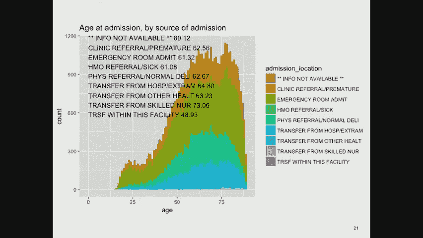

---

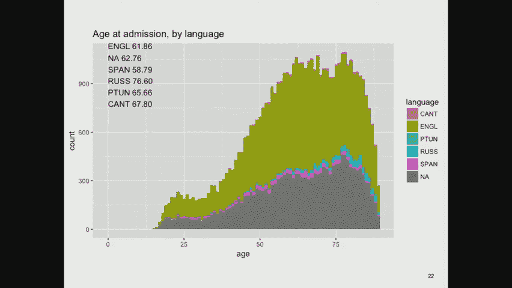

## 数据实例：患者病情概览

为了更直观地理解这些数据如何呈现，我们来看一个来自MIMIC-III数据库的患者案例幻灯片。

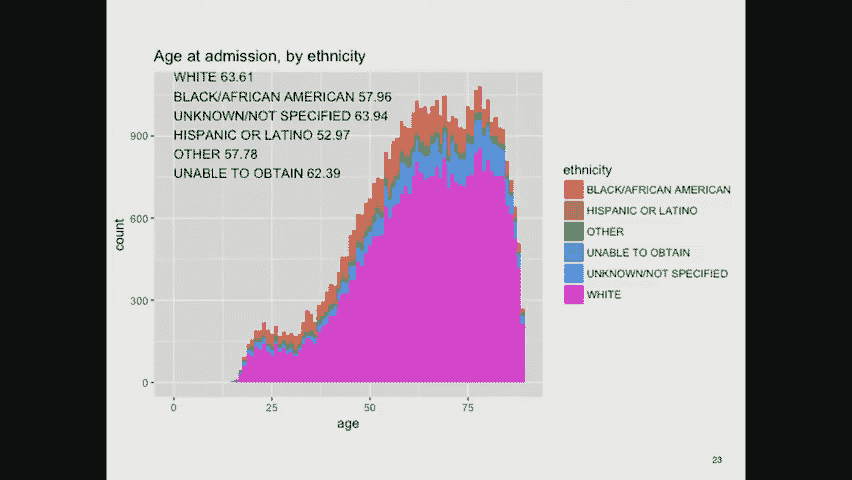

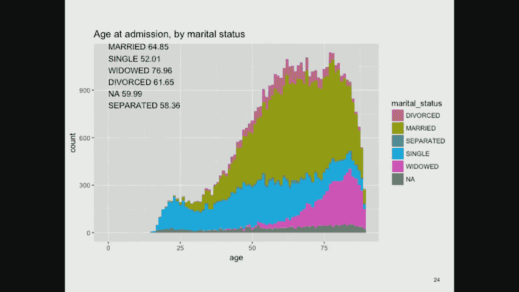

这张幻灯片概述了一位患者的情况：
*   **代码状态**：患者最初希望全力抢救（“Full Code”），最终转为仅接受舒适护理（“Comfort Measures Only”）。
*   **格拉斯哥昏迷评分（GCS）**：用于量化意识水平。该患者从清醒逐渐恶化到仅能发出无意义的声音，对刺激仅有屈曲反应。
*   **生命体征与实验室数据**：展示了血小板、肌酐、白细胞计数等指标随时间的变化趋势。
*   **药物**：包括万古霉素（抗生素）、哌拉西林、氯化钠、地塞米松和葡萄糖等。
*   **测量值**：心率在后期显著升高，血氧饱和度从良好水平下降到不合理的低值（约60%-50%，正常应高于92%）。

所有这些信息共同描绘出该患者病情急剧恶化并最终死亡的画面。

---

## 数据探索：人口统计学分析

现在，让我们对数据库中的数据进行一些基本探索。我们可以分析患者的人口统计学特征。

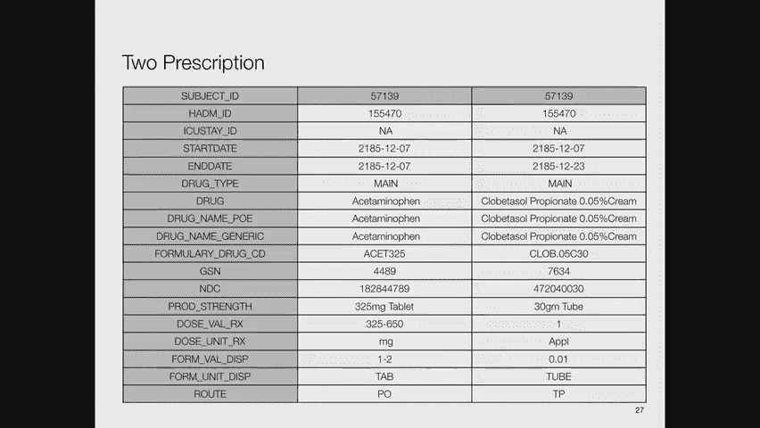

如果查看数据库中最后一次实验室测量时的患者年龄，会发现重症监护室的患者以老年人居多，年轻人较少。女性和男性的年龄分布曲线相似。

**人口统计学因素通常包括以下变量**：
*   **入院类型**：急诊、择期护理等。不同入院类型的年龄分布似乎差异不大。
*   **保险类型**：支付方的年龄分布差异很大。私人保险在65岁左右急剧下降，这是因为医疗保险通常覆盖65岁及以上的人群。自费患者比例很小，因为医疗费用极其昂贵。
*   **入院来源**：来自诊所、急诊室、健康维护组织推荐、专业护理机构或院内转移。来自专业护理机构的患者通常更年长。
*   **语言**：说俄语的患者平均年龄最大，这可能与移民模式有关。
*   **种族**：总体而言，非裔美国人和西班牙裔患者比白人患者更年轻。这反映了医疗保健中存在的差异和偏见问题。
*   **婚姻状况**：单身患者的入院年龄似乎更小。

一个有趣的问题是：**能否仅从这些人口统计学特征预测医院死亡率？**

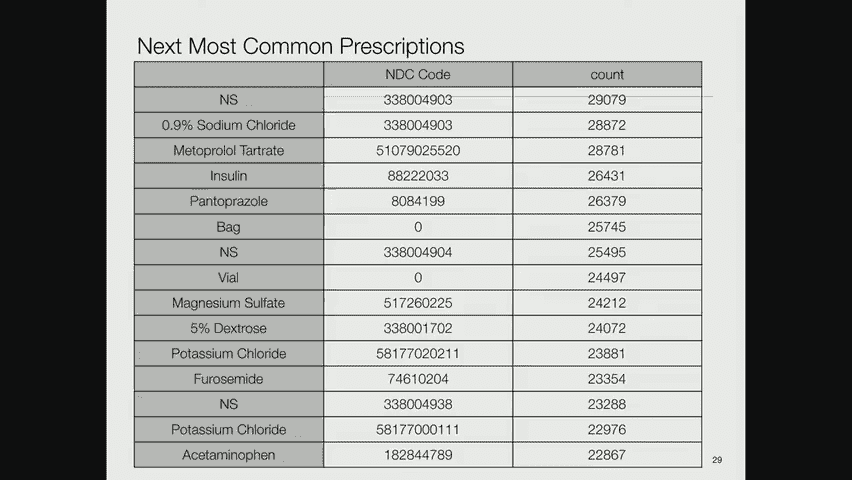

使用R语言工具进行逻辑回归分析发现，唯一非常重要的预测因素是**年龄**（老年人死亡风险更高）。如果种族信息“无法获取”，死亡风险也更高，原因尚不明确。其他因素（如语言、婚姻状况）的预测作用不显著。

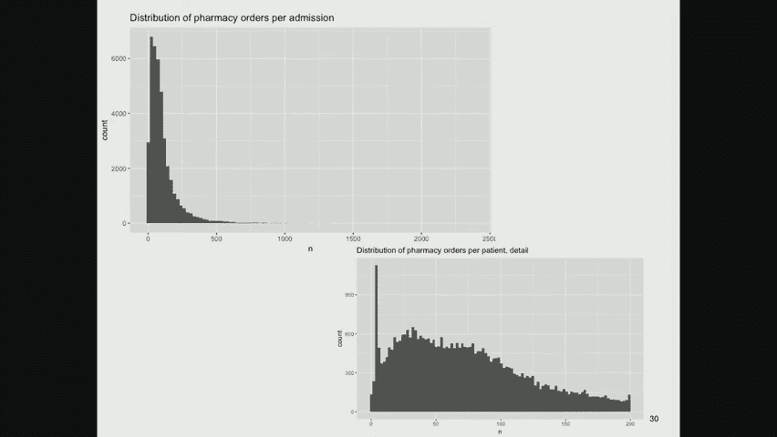

---

## 数据标准化与编码的挑战

从CareVue到MetaVision的系统转换问题，实际上是医疗数据领域一个更大挑战的缩影：**缺乏统一标准**。每家医院都有自己的记录方式。

例如，在MIMIC数据库中查看处方时，同一次入院可能会有不同的编码系统：
*   医院内部的私有处方代码。
*   来自药物供应商的商业编码系统代码。
*   美国食品药品监督管理局（FDA）分配的国家药品代码（NDC）。
*   还有人类可读的描述。

**NDC代码**可能是最好的编码系统之一，其结构通常为：前4-5位是标签商（制造商或分销商），中间4位是产品代码（剂型、规格），最后2位是包装代码。然而，由于号码耗尽，现在出现了新旧代码转换的难题。

此外，还有国际人用药品注册技术要求协调理事会开发的**MedDRA编码系统**、常见操作术语代码以及**HCPCS代码**等。医院可能还会使用来自行业标准（如First Databank的GSN号码）的代码，造成了冗余。

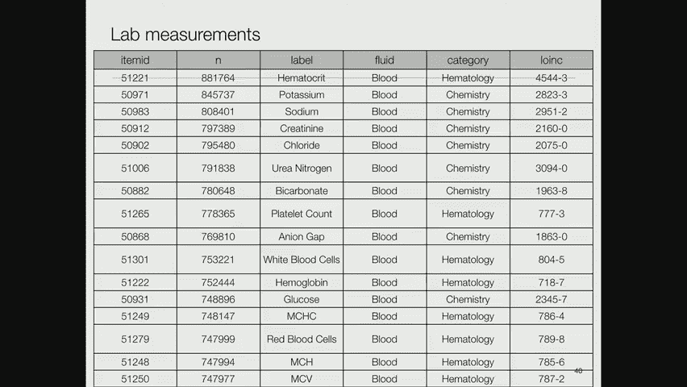

**关于手术操作**，数据库中有多个表格，使用不同的编码系统记录手术事件，如ICD-9代码、CPT代码和更新的ICD-10代码。CPT代码归美国医学会所有，受版权保护，使用需付费。

**实验室测量**也有其编码系统，如LOINC（逻辑观察标识符名称与代码），它是HL7（一个致力于医疗信息标准化的组织）标准的一部分。LOINC旨在为每种实验室测试提供唯一的、有层次结构的名称。

**图表事件**（如护士在床边录入的数据）包括心率、血氧饱和度、呼吸频率等。在合并数据库中，来自不同系统的相同测量可能被赋予不同标签，这给分析带来了机械性挑战。

**输入输出事件**（记录患者的液体摄入和排出）同样存在来自不同系统、标签可能不一致的问题。

---

## 从数据中挖掘模式：以昼夜变化为例

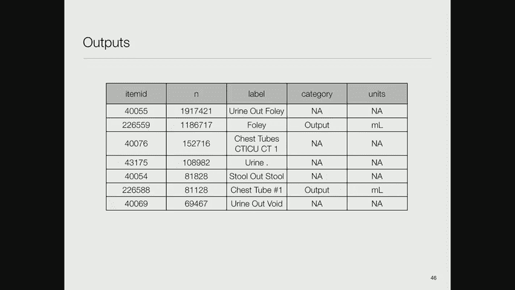

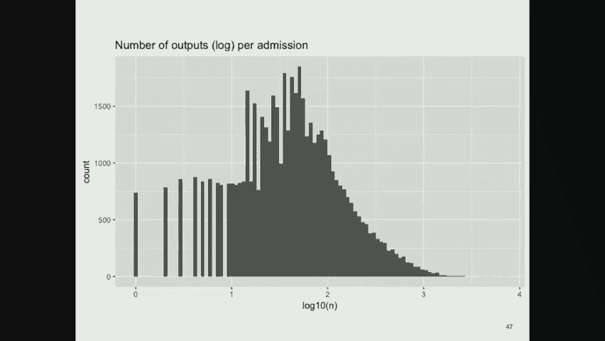

有一篇有趣的论文探讨了实验室检测结果的昼夜变化模式。研究者发现，在夜间进行的实验室测试，其异常结果的比例更高。这可能是因为在夜间抽血的患者本身病情就更重。

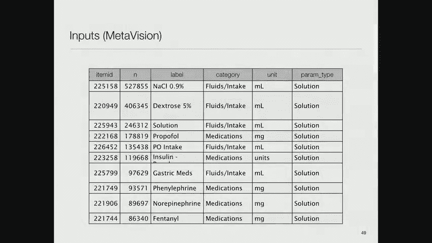

我尝试在MIMIC数据库中复现这项研究，但很大程度上失败了，因为我们没有足够的相关数据（例如白细胞计数的测量次数不多）。

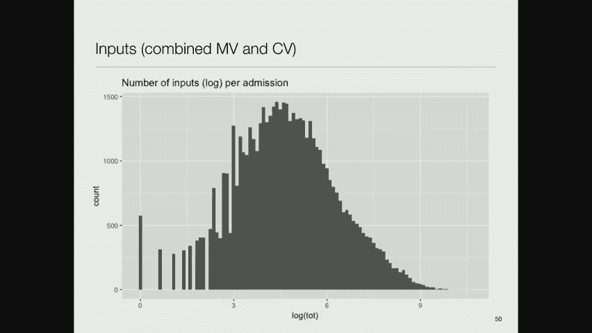

如果观察每小时异常白细胞计数值的比例，确实可以看到在凌晨5点左右异常比例更高，下午3点左右较低，这与那篇论文的发现一致。

然而，建立一个简单的逻辑回归模型来预测死亡率时，只有少数特定小时的数据显示出显著性，这看起来更像是噪音而非有效信号。不同测量值的分布（如存活者与死亡者之间）差异不大，且数据量可能不足。

观察其他实验室指标（如血尿素氮、二氧化碳等），会发现其异常比例随时间确实存在变化。这种变化可能源于人体的昼夜生理节律，也可能源于医疗实践的常规安排。

使用实验室提供的“正常/低/高”标志（这取决于设备校准）进行分析，也能观察到类似的现象：高值比例在夜间上升，低值比例在夜间下降。

但测量完成时间的分布，在正常和异常结果之间有很多相似之处，并未显示出强烈的模式。

---

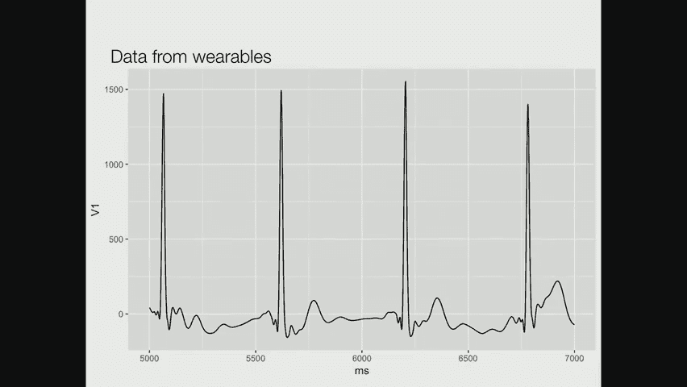

## 新兴数据源与笔记的价值

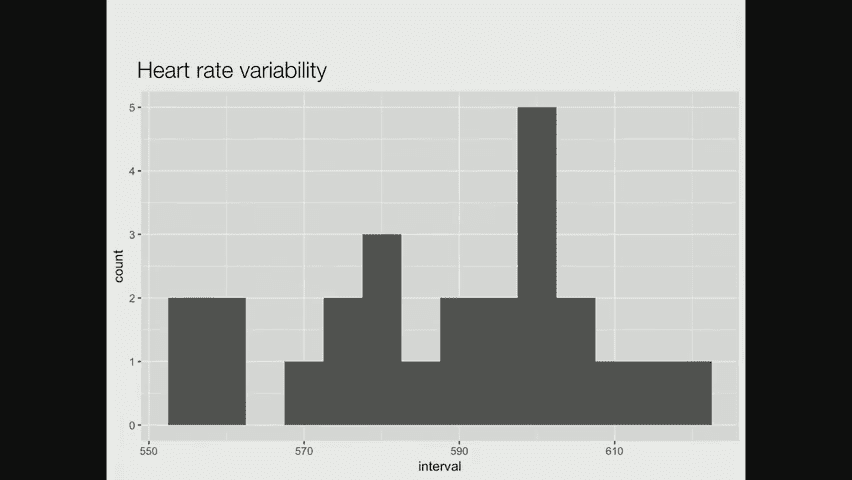

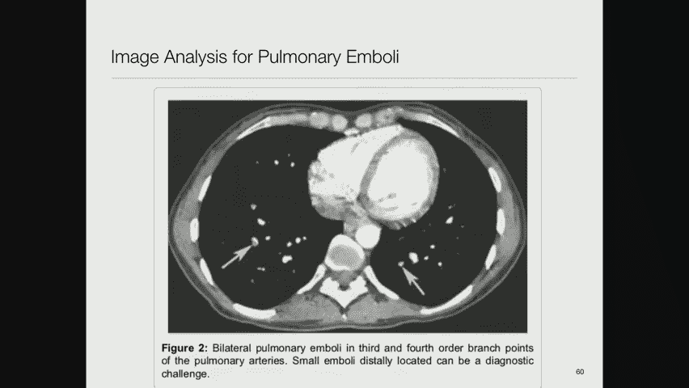

除了传统临床数据，**新兴数据源**如可穿戴设备（如智能手表）能提供连续的心率、心率变异性等信息，为健康评估提供了新维度。

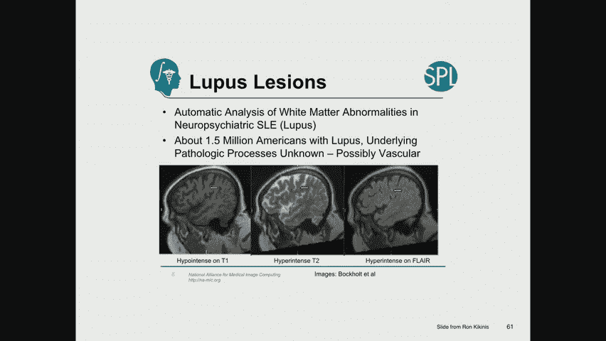

**影像数据**的分析也取得了突破。例如，有研究使用深度学习技术识别肺部CT图像中的肺栓塞，其性能据称优于放射科医生。还有技术能自动分析脑部MRI图像中的白质病变，以识别狼疮。

本节课最后想重点讨论的是**临床笔记**。文本笔记中包含了大量无法从原始数据中直接获取的人类理解和语境信息。

上学期，我的学生进行了一项练习，向参与者提供患者数据（包括类似之前的可视化摘要和去标识化的临床笔记），让他们预测患者死亡率。结果发现，参与者利用笔记做出的预测略优于随机猜测。反馈机制能帮助他们学习并提高预测准确性。

我个人在参与练习时也发现，护理笔记和出院摘要中的信息比实验室数据的趋势线更有用。部分原因是我更习惯阅读文字，部分原因是人类在笔记中记录的理解层次是原始数据无法替代的。

在MIMIC数据库中，有各种类型的笔记：护理笔记、放射学报告、心电图报告、医生记录和出院摘要等。出院摘要通常非常长（可达数万个字符），是对整个住院过程的总结。护理笔记和医生记录则相对较短。

一段简短的护理笔记可能记录患者的血压状况、药物滴注、伤口感染情况等，为交接班和医疗法律记录提供了重要信息。

一份典型的出院摘要则包含入院原因、既往病史、体格检查结果、相关实验室结果、医院病程、各系统回顾、出院时状况、出院带药、出院后处置计划、随访指示等，信息量巨大。

---

## 关于标准化的最后说明

在之前的课程中，你们已经了解了**OMOP通用数据模型**，这是一种标准化临床数据表示的方法。未来MIMIC数据库的新版本可能会采用OMOP格式。

另一个重要标准是**FHIR**，它旨在简化不同医疗信息系统之间的数据交换。尽管现实中存在商业壁垒，但该标准正得到越来越广泛的部署。

医疗领域存在大量的术语标准，如用于诊断的ICD-9/10、用于药物的NDC/RxNorm、用于实验室的LOINC、用于精神疾病的DSM-5等。**统一医学语言系统**整合了约180个不同的术语集，提供了一个一站式查询资源。

---

## 总结与要点

本节课中，我们一起深入探讨了临床数据的复杂面貌。

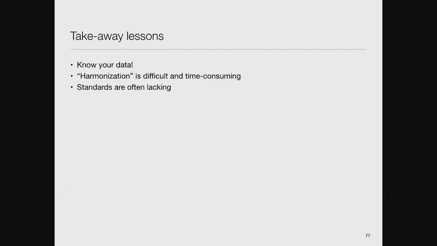

**核心要点总结如下**：
1.  **了解你的数据至关重要**。第一个关于心率的故事表明，对不了解的数据进行机器学习很可能导致错误结论。
2.  **数据标准化既困难又耗时**。缺乏统一标准导致每家机构都发展出自己的表示方法，造成了互操作性问题。
3.  **数据清理是主要工作**。大约十年前，我的一个博士生在论文中提到，他花了大约一半的时间清理数据。这大致反映了该领域的现状。

虽然处理临床数据充满挑战，但它是从医疗信息中提取价值的基础。在接下来的课程中，我们将学习如何利用这些数据构建模型，并展示可以实现的成果。