# 4：风险分层（第一部分） 🏥

在本节课中，我们将要学习**风险分层**的基本概念、应用场景以及如何利用机器学习方法解决相关问题。我们将从一个具体的案例研究——2型糖尿病的早期发现——入手，探讨风险分层在实践中的应用、面临的挑战以及评估方法。课程的后半部分将包含与行业专家的访谈，分享实际应用中的经验与见解。

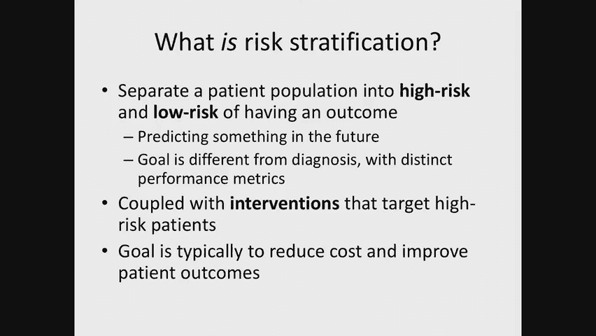

## 什么是风险分层？

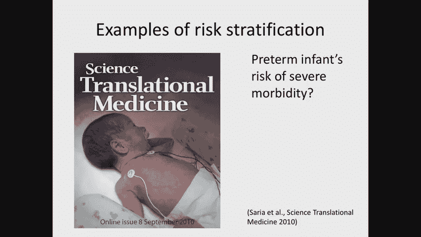

风险分层是一种将患者群体划分为不同风险类别的方法，例如高风险患者、低风险患者或中间风险患者。我们进行风险分层的目的，通常是为了根据预测结果采取相应的干预措施。例如，对于高风险患者，我们可以尝试采取预防措施，以防止不良结果的发生。

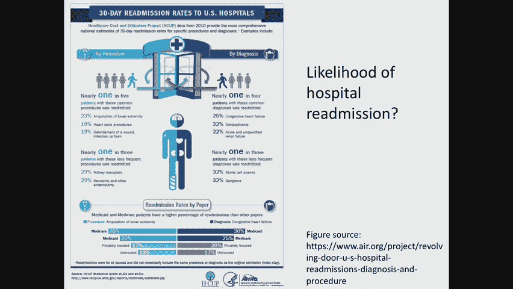

上一节我们介绍了风险分层的核心目标，本节中我们来看看它与诊断的区别。

风险分层与诊断有很大不同。诊断通常有非常严格的性能标准，误诊可能导致严重后果。而风险分层本质上更为模糊，我们更关注如何将患者尽可能准确地归入不同的风险类别。我们通常更关心**阳性预测值**等指标，即我们标记为高风险的患者中，实际高风险的比例是多少。此外，风险分层所使用的数据也更为多样化，可能包括患者人口统计学、社会经济信息等，这些信息虽然可能不用于无偏诊断，但会极大地影响风险状况的评估。

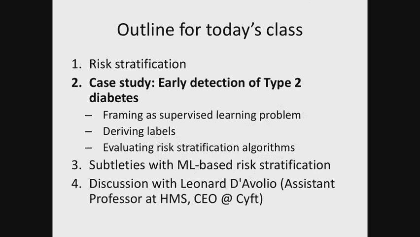

风险分层在很大程度上是为了降低美国医疗保健环境的成本。以下是几个风险分层的例子：

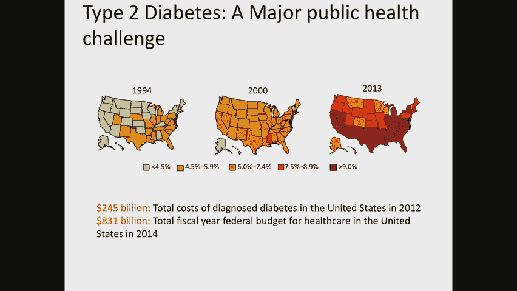

*   **预测早产儿患严重疾病的风险**：例如，传统的阿普加评分。新的研究正在探索如何使用机器学习方法提高预测婴儿发病率的能力。
*   **预测急诊科心脏疾病患者是否需要入院**：例如，1984年的一项研究使用逻辑回归模型，旨在通过快速识别低风险患者来降低成本。
*   **预测患者再住院的可能性**：美国政府对此高度关注，并对再住院率高的医院进行处罚。通过预测高风险患者，可以改变出院管理方式（如家访、加强沟通），以降低再入院率。

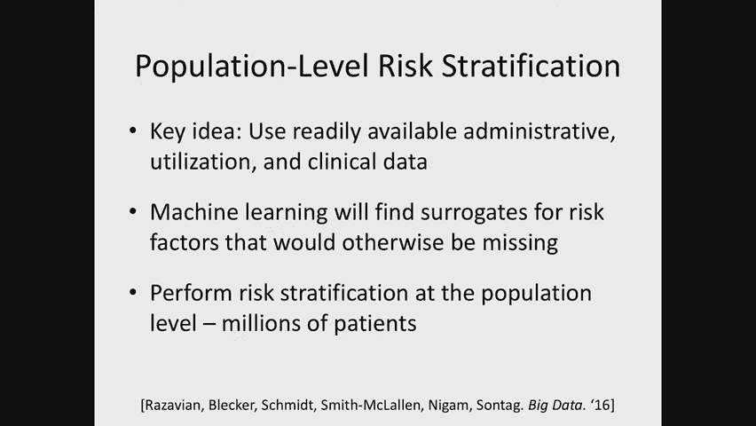

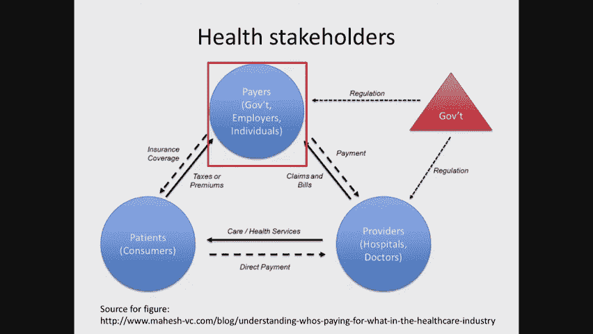

## 传统方法与机器学习方法

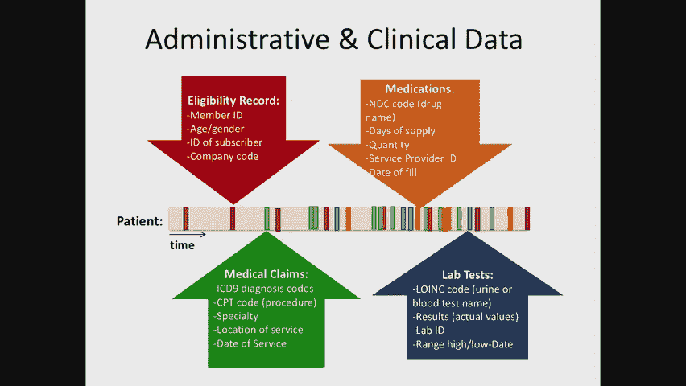

自从1984年的文章以来，风险分层的方法发生了显著变化。

传统的风险分层方法基于**评分系统**，如阿普加评分。这些规则通过仔细研究推导，在医疗系统中被广泛使用。然而，它们通常需要手动计算，使用频率可能不高。

在过去的五到十年里，行业迅速转向基于**机器学习**的方法。这些方法可以处理更高维的特征，解决早期方法的一些关键挑战，并且更容易适应临床工作流程。它们可以获得更高的精度（可能因为使用了更多特征），并且开发速度更快。机器学习方法使得研究人员能够利用现有大数据集，预测即使是罕见的结果。

然而，这些新方法也带来了新的风险，我们将在课程中讨论。

这些模型正在被广泛商业化。例如，Optum公司开发了预测慢性阻塞性肺疾病相关住院率的模型，可以对患者群体进行分层，并深入查看高风险患者的具体情况。

## 案例研究：2型糖尿病的早期发现 🩺

我们现在进入一个关于早期发现2型糖尿病的案例研究。

这个问题非常重要，因为据估计美国有20.5%的2型糖尿病患者未被确诊。如果我们能识别出当前患病或有患病风险的患者，就可以尝试进行干预，例如减肥计划或药物治疗。

传统方法（如芬兰糖尿病风险评分）通过一系列手动计算的问题来评估风险。但这些评分并未产生预期的影响，部分原因是它们未被充分使用。

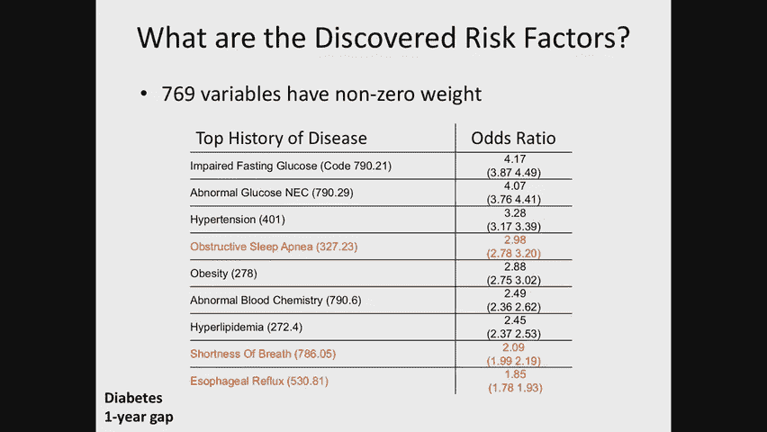

我们考虑的改变是：能否利用健康保险公司的数据，使用机器学习方法，自动对数百万患者进行风险评估，从而识别高危人群并进行干预？本案例基于我实验室过去几年的研究工作。

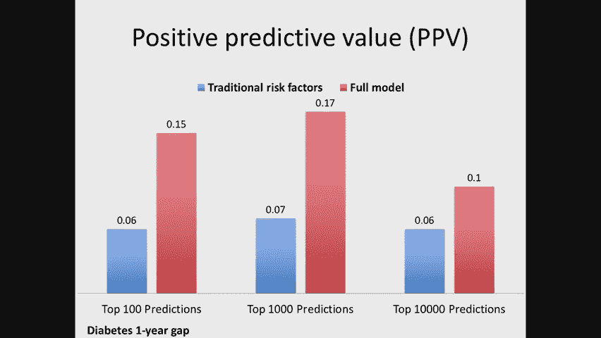

这是一个在**支付方**层面进行风险分层的例子。

用于这个问题的数据是**管理数据**，通常来自健康保险公司。数据包括：
*   **资格记录**：患者参保时间。
*   **医疗索赔**：诊断代码、程序代码、就诊专家类型、服务地点和时间。
*   **药房记录**：药物处方、国家药品编码、供应天数、补充次数。
*   **实验室测试**：测试项目及结果。

该研究人群来自费城，拥有实验室数据的患者约13.5万人。数据中包含大量诊断代码（如高血压）和实验室测试（如肝酶、血红蛋白A1c）。

### 构建机器学习问题

现在，让我们思考如何将风险分层问题构建为机器学习问题。

我们将问题简化为**二分类**。我们假设当前时间是2009年1月1日，利用过去的数据构建特征，预测未来某个时间窗口内患者是否会新发2型糖尿病。

我们可以定义不同的预测间隔（如0年、1年、2年间隔）。研究中通常包含一个间隔（如1年），以避免**标签泄漏**。因为临床医生可能已经怀疑患者患病并开始干预，但我们的算法尚未从数据中捕捉到这些信号。我们更希望找到那些患病风险更出人意料的患者。

数据存在严重的**删失**问题：
*   **左删失**：在特征构建窗口期之前没有患者数据。
*   **右删失**：在预测时间窗口之后没有患者数据（例如患者更换了保险公司）。

对于左删失，我们使用患者过去两年内的任何可用数据，数据较少的患者其特征向量会更稀疏。对于右删失，在这种二分类设置中处理起来更具挑战性。研究中通过改变纳入和排除标准（例如排除标签未知的患者）来忽略它。但这可能引入偏差，例如，患者因确诊糖尿病而更换保险公司，导致其被排除，从而影响模型的普遍性。

### 机器学习算法与评估

该论文使用的机器学习算法是**L1正则化逻辑回归**。使用L1正则化的原因之一是它能进行特征选择，有助于防止过拟合，并且可能找到一个只使用少量特征的简洁风险模型（这与传统评分理念一致）。另一个原因是**可解释性**，便于理解模型使用了哪些特征做预测，也便于在只有部分特征的新环境中部署模型。

以下是研究中使用的特征构建方法：
*   考虑到大量数据缺失，特征多为二元指示器（是否看过某类专家、是否服用过某种药物等）。
*   对于实验室数据，不仅记录是否进行过测试，还衍生出结果是否过低、过高、正常、数值是否上升、下降、波动等特征。
*   为了纳入时间信息，分别为过去6个月、过去24个月以及所有历史数据计算这些特征，并将它们拼接起来，最终形成一个约42,000维的特征向量。

接下来，我们简要讨论如何评估这类模型。

评估风险分层模型的标准与诊断模型有所不同。我们经常使用的一种方法是**阳性预测值**。即，在模型给出预测后，查看排名前N（如100、1000、10000）的患者中，实际患上糖尿病的有多少比例。我们可能对不同层级感兴趣，因为可以根据干预措施的成本和风险来针对不同数量的患者。例如：
*   **低成本干预**（如发送提醒短信）：可以针对前10,000名患者。研究中的模型在此层级实现了约10%的阳性预测值。
*   **高成本干预**（如专人上门随访）：可能只针对前100名患者。研究中的模型在此层级实现了约15%的阳性预测值，而传统方法则低于一半。

## 总结

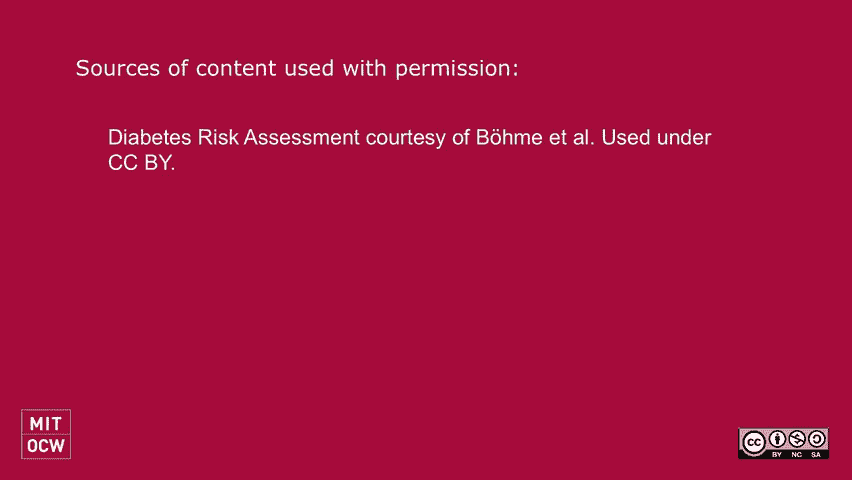

本节课中，我们一起学习了风险分层的基本概念及其在医疗保健中的应用。我们比较了传统的评分系统与现代的机器学习方法，并通过一个2型糖尿病早期发现的案例，深入探讨了如何将临床问题构建为机器学习问题、如何处理数据挑战（如删失）、以及如何评估模型性能（重点关注阳性预测值）。我们还了解到，在实际应用中，除了技术本身，理解临床工作流程、利益相关者动机以及建立信任同样至关重要。在接下来的课程中，我们将继续探讨生存分析等更深入的技术细节。