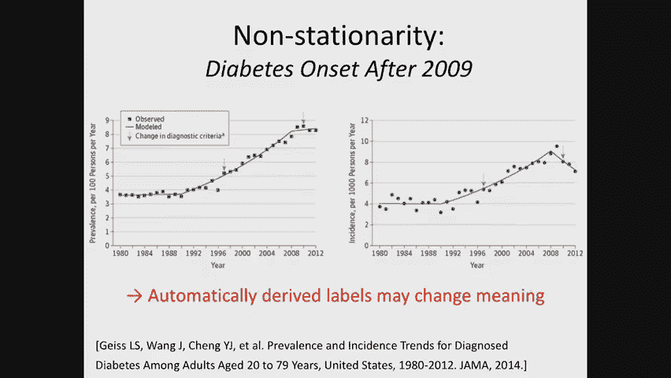
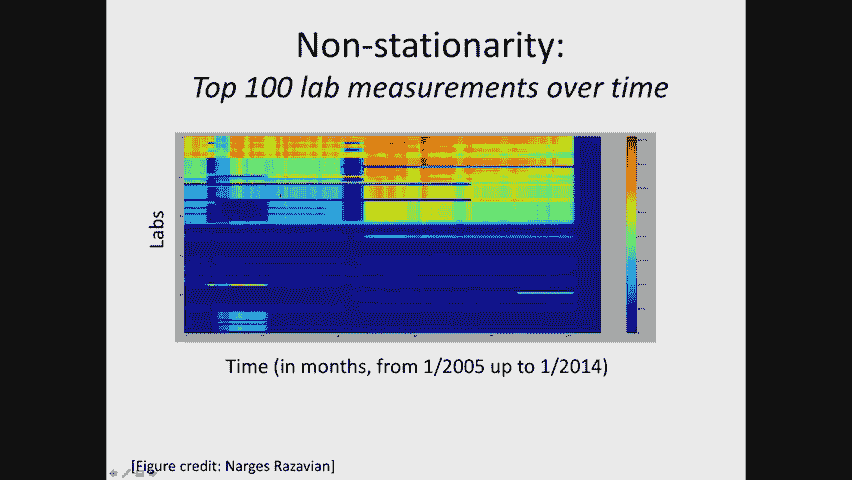
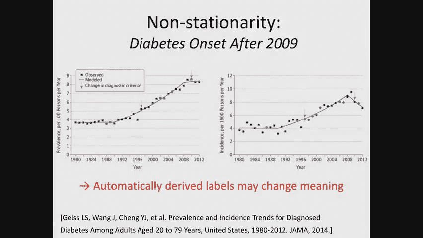
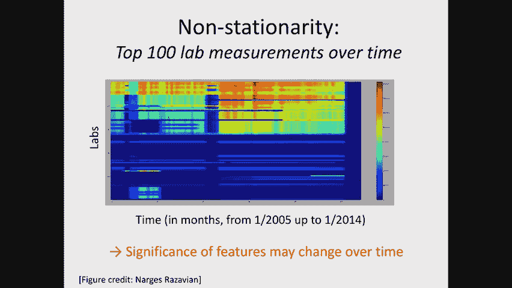
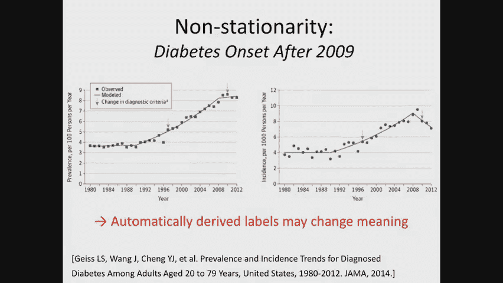
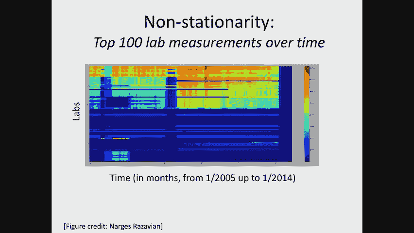
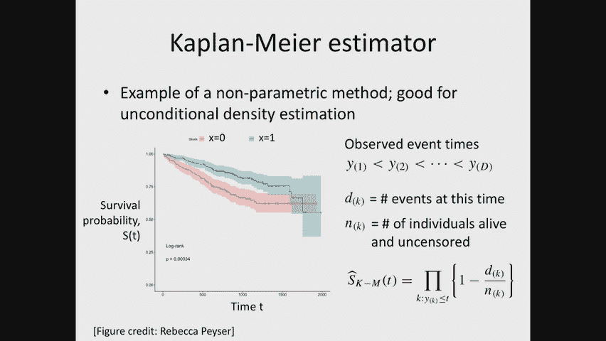
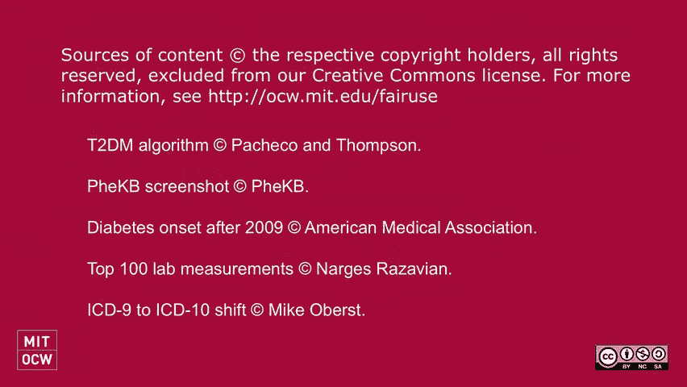

# 5：风险分层（第二部分）📊

在本节课中，我们将继续深入探讨风险分层。我们将学习如何从数据中驱动标签、如何评估风险分层模型，并讨论将机器学习应用于医疗保健风险分层时可能遇到的一些微妙问题。最后，我们将引入生存建模的概念，以更优雅地处理事件发生时间预测的问题。

---

## 标签驱动：如何知道谁得了糖尿病？🏷️

上一节我们介绍了风险分层的基本概念。本节中，我们来看看如何从原始数据中确定“谁在特定时间窗口内患上了糖尿病”，即如何驱动标签。

在二型糖尿病风险分层的例子中，目标是利用健康保险索赔数据，预测未来一到三年内可能新确诊为二型糖尿病的患者。但核心问题是：我们如何知道某人是否在那个时间窗口内患上了糖尿病？

### 标签来源的挑战

简单地查看患者是否服用了糖尿病药物（如二甲双胍、胰岛素）是不够的。原因包括：
*   某些药物可能用于治疗其他疾病。
*   患者可能被诊断为糖尿病，但尚未开始治疗。
*   患者可能自费购药，因此在保险索赔数据中没有记录。

因此，我们需要更可靠的方法来定义“阳性病例”。

### 获取标签的传统方法

传统上，获取可靠标签通常分为两步：

**第一步：手动标记（图表回顾）**
*   抽取数百名患者的数据。
*   人工审查其电子健康记录（EHR），包括医生笔记、实验室结果、用药记录等，以判断患者是否患有糖尿病。
*   这一步对于理解数据缺陷和建立基本事实至关重要。

**第二步：将标签推广到全体人群**
通常有两种方法：
1.  **制定简单规则**：例如，定义“如果患者有糖尿病药物记录或异常的糖化血红蛋白（HbA1c）检测结果，则视为糖尿病患者”。但这类规则往往精确度高（阳性预测值高），但召回率低（会漏掉很多患者）。
2.  **使用机器学习模型推导标签**：这是一个“用机器学习解决机器学习问题”的过程。
    *   利用第一步中手动标记的少量数据，训练一个模型。该模型的输入是患者的各种数据（实验室结果、药物等），目标是预测“该患者当前是否患有糖尿病”。
    *   然后用这个训练好的模型，对整个患者人群进行预测，从而为每个人生成一个概率性的标签。
    *   最后，使用这些生成的标签，去解决我们最初的风险预测机器学习任务。

为了进行图表回顾，尤其是在处理健康保险索赔数据时，通常需要构建可视化工具来浏览和理解患者随时间变化的数据轨迹。

---

## 模型评估：如何衡量好坏？📈

在得到标签并训练模型后，我们需要评估模型的性能。本节中，我们来看看常用的评估指标及其注意事项。

### 受试者工作特征曲线与曲线下面积

对于输出概率值的二分类模型，常用**受试者工作特征曲线**（ROC曲线）进行评估。
*   X轴是**假阳性率**（FPR）。
*   Y轴是**真阳性率**（TPR）。
*   通过调整分类阈值，可以得到一条曲线。曲线越靠近左上角，模型性能越好。

为了用一个数字概括ROC曲线的性能，我们计算**ROC曲线下面积**（AUC）。
*   AUC = 1 表示完美模型。
*   AUC = 0.5 表示随机猜测模型（对应从(0,0)到(1,1)的对角线）。
*   AUC有一个重要的数学等价定义：它等于“模型将随机选取的一个阳性样本排在随机选取的一个阴性样本之前”的概率。这说明了AUC本质上是一个**排序指标**，并且对类别不平衡不敏感。

然而，AUC的缺点是它关注整个曲线，而我们实际应用时可能只关心曲线的某一部分（例如，只关注高阈值部分，因为我们只想干预风险最高的少数人）。为此，可以使用**部分AUC**等指标。

### 概率校准

当模型输出概率时，我们不仅关心排序，还关心概率值本身的准确性，即**校准**。
*   校准良好的模型意味着：如果模型预测100个患者的发病概率为70%，那么其中大约70人最终会发病。
*   可以通过**校准曲线图**来评估：将预测概率分箱（如0-0.1, 0.1-0.2...），计算每个箱内患者的实际阳性事件发生率，并绘制其与预测概率中值的关系。理想情况下，点应落在对角线上。
*   如果某个概率区间的数据点很少，则该点估计的置信区间会很大，解读时需谨慎。

---

## 微妙之处与挑战：现实世界并不完美⚠️

将机器学习应用于真实医疗数据时，会遇到许多在理想实验室环境中不存在的挑战。本节中，我们探讨几个关键问题。

### 数据的非平稳性

医疗数据会随时间发生变化，这称为**非平稳性**。它会导致模型性能下降。
*   **疾病定义变化**：例如，糖尿病诊断标准改变，导致不同年份被标记为“糖尿病患者”的人群特征发生变化。
*   **检测技术变化**：新的实验室检测方法出现，或某项检测因保险报销政策变化而使用率激增，导致特征分布改变。
*   **编码系统变更**：如从ICD-9疾病编码系统切换到ICD-10，导致特征空间发生剧烈变化。
*   **数据源问题**：电子病历系统更换、数据合同中断等，导致特定时间段数据缺失。

**应对策略**：在模型评估时，采用**时间外验证**。即使用历史数据（如2007-2009年）训练，在未来的数据（如2014-2016年）上测试。这能有效暴露因非平稳性导致的性能衰减。对于编码变更等问题，当前主流做法是人工映射，但如何自动学习稳健的表征是一个开放的研究方向。

### 受干预结果污染

风险分层模型预测的结果，可能受到历史干预措施的影响，导致因果推断错误。
*   **经典案例**：预测肺炎患者死亡风险时，模型发现“有哮喘史的肺炎患者死亡风险更低”。这并非因为哮喘有保护作用，而是因为这类患者通常会接受更积极的重症监护（干预），从而改善了预后。
*   **问题本质**：我们使用特征X预测结果Y，但忽略了中间发生的治疗干预T。Y的好坏可能由T导致，而非直接由X决定。如果根据有偏的预测（认为哮喘患者风险低）而减少干预，可能造成伤害。

**当前应对方法（尚不完美）**：
1.  **修改模型**：对于可解释的模型（如规则列表），人工移除不合理的规则。但这在高维复杂模型中难以实现。
2.  **重新定义结果**：预测干预前的**替代指标**（如乳酸水平），而非最终结果（如死亡）。
3.  **形式化为删失问题**：将接受治疗的患者视为“删失”，因为不知道如果他们未接受治疗会怎样。这引出了下一部分的生存分析。

更根本的解决方案是使用**因果推断**框架来形式化该问题，这将在后续课程中深入讨论。

### 深度学习在EHR数据上的局限

尽管深度学习在图像、文本等领域取得巨大成功，但在电子健康记录（EHR）风险预测任务上，其相对于精心设计的线性模型（如L1正则化逻辑回归）的优势往往很小，甚至不显著。
*   **可能原因**：
    *   EHR数据具有多时间尺度、大量缺失、多变量观测的特性，与自然语言等规整序列数据不同。
    *   现有特征（如特定实验室指标）是数十年医学研究的结晶，本身信息量就很大且相对独立。
    *   简单模型在面对数据分布变化（非平稳性）时可能更具鲁棒性。
*   **启示**：不应盲目应用最复杂的模型，特征工程、领域知识以及模型的简单性和可解释性仍然至关重要。

---

## 重新思考：从分类到生存分析⏳

我们之前将风险分层视为“未来某个时间窗口内是否发生事件”的二分类问题。本节中，我们来看看将其重新定义为预测“事件发生时间”的问题，并介绍生存分析的基本概念。

### 二分类方法的局限
1.  **数据利用不足**：必须排除在观察窗口内被删失的患者。
2.  **评估不公**：若患者在时间窗口外（如3年零1天）发病，模型预测会被判为错误，尽管它几乎正确。

### 生存分析框架

生存分析直接对事件发生时间T进行建模，并妥善处理**删失数据**（即只知道患者在某个时间点之后仍未发生事件，但不知道具体何时发生）。

数据形式变为三元组 `(X, T, Δ)`：
*   `X`: 特征。
*   `T`: 观察到的时间（可能是事件发生时间，也可能是删失时间）。
*   `Δ`: 指示变量（Δ=1表示T是事件发生时间；Δ=0表示T是删失时间）。

我们关注两个函数：
*   **生存函数 S(t|X) = P(T > t | X)**：表示患者在时间t之后仍然存活的概率。
*   **风险函数**：表示在存活到时间t的条件下，在接下来瞬间发生事件的概率。

### 卡普兰-迈耶估计量

这是一种非参数方法，用于估计**总体**的生存函数（不考虑特征X）。
*   公式：
    *   `t_i`：第i个事件发生时间。
    *   `d_i`：在时间`t_i`发生事件的人数。
    *   `n_i`：在时间`t_i`之前仍存活且未被删失的人数（风险集）。
*   该估计量可以直观地理解为，在每个观察到事件发生的时间点，根据当时“暴露在风险中”的人数更新生存概率。

我们可以分别为不同亚组（如男/女）计算卡普兰-迈耶曲线，并比较其生存差异。要构建考虑特征X的预测模型，则需要使用参数或半参数生存模型（如Cox比例风险模型），这将在后续课程中介绍。

---

## 总结🎯

本节课中，我们一起学习了风险分层的后续关键内容：
1.  **标签驱动**：了解了从医疗数据中获取可靠标签的挑战和两种主要方法（规则与机器学习），并认识到手动验证和领域知识的重要性。
2.  **模型评估**：掌握了ROC曲线、AUC和概率校准等核心评估指标，理解了它们的含义、计算方式及适用场景。
3.  **现实挑战**：探讨了将机器学习应用于医疗风险分层时面临的三大微妙问题：**数据非平稳性**、**受干预结果污染**以及**深度学习在EHR数据上的当前局限**。我们认识到在现实世界中部署模型必须考虑这些因素。
4.  **生存分析入门**：为了更精细地预测事件发生时间并处理删失数据，我们引入了生存分析的基本框架，并介绍了非参数的卡普兰-迈耶估计量。

通过本课，你应该对风险分层任务的完整流程、评估方法以及实际应用中必须小心的“陷阱”有了更全面的认识。生存分析为我们提供了超越简单二分类的、更强大的建模工具。