# 6：生理时间序列建模 📈


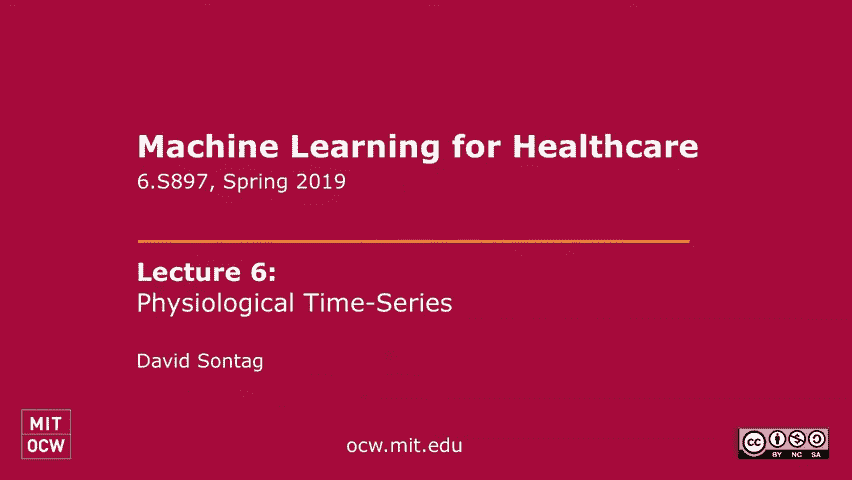


在本节课中，我们将学习如何对生理时间序列数据进行建模。我们将首先回顾生存分析，然后深入探讨两个具体的生理时间序列建模案例：一个是在重症监护室（ICU）中监测病人，另一个是检测心房颤动（AF）。我们将看到，根据可用数据的多少，可以采用从结合领域知识的统计模型到数据驱动的深度学习方法等不同策略。

## 生存分析回顾 📊

上一节我们介绍了风险分层的概念。本节中，我们来看看如何将其形式化为生存分析问题，而不是一个简单的分类问题。

生存分析旨在预测事件发生的时间（例如死亡、出院），同时处理数据中常见的“删失”情况（即我们只知道事件发生在某个观察时间点之后，但不知道确切时间）。

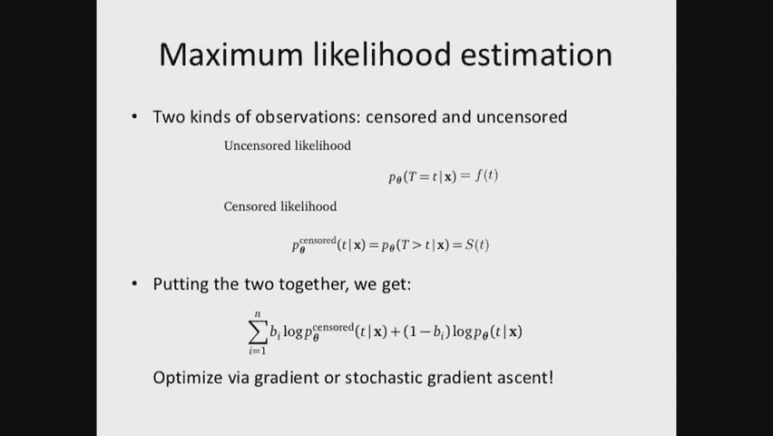

### 核心概念与公式


*   **事件时间 T**： 我们关心的随机变量，表示事件发生的时间。
*   **概率密度函数 f(t)**： 事件在时间 `t` 发生的概率密度。通常我们将其视为条件密度 `f(t | x)`，其中 `x` 是患者的特征。
*   **生存函数 S(t)**： 事件在时间 `t` 之后发生的概率，即 `T > t` 的概率。它是 `1` 减去累积分布函数。
    *   **公式**： `S(t) = P(T > t) = 1 - ∫_{0}^{t} f(u) du`
*   **删失数据**： 对于某些个体，我们只观察到他们被跟踪到时间 `c`，而不知道事件是否在 `c` 之后发生。这种数据称为右删失数据。


### 参数化生存模型

在参数化方法中，我们需要为密度函数 `f(t)` 假设一个具体的参数形式（如指数分布、威布尔分布）。模型的参数（如指数分布的率参数 λ）可以通过特征 `x` 经由一个模型（如神经网络）来学习。

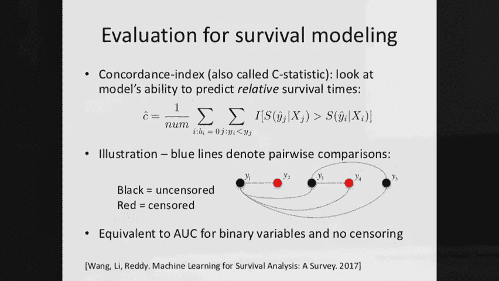

### 最大似然估计

为了从包含删失和未删失的数据中学习模型，我们使用最大似然估计。似然函数结合了两种类型观测的概率。

*   对于**未删失**的观测（事件时间 `t_i` 已知），其贡献为概率密度 `f(t_i)`。
*   对于**删失**的观测（只知删失时间 `c_i`），其贡献为生存概率 `S(c_i)`，即事件在 `c_i` 之后发生的概率。

**似然函数公式**：
`L = ∏_{i: 未删失} f(t_i) * ∏_{i: 删失} S(c_i)`
对应的对数似然为：
`log L = ∑_{i} [ (1 - δ_i) * log f(t_i) + δ_i * log S(c_i) ]`
其中 `δ_i` 是指示函数（`δ_i = 1` 表示第 `i` 个观测被删失）。

### 模型评估：C统计量

评估生存模型性能的一个常用指标是C统计量（一致性指数）。它衡量的是模型预测的事件发生顺序与实际观察到的顺序的一致性。

**直观理解**： 对于任何一对可比较的个体（例如，一个个体的事件发生在另一个个体的（删失或未删失）时间之前），我们希望模型赋予先发生事件的个体更高的风险概率（或更低的生存概率）。

**公式**：
`C = (∑_{i,j} I[ S(t_i | x_i) < S(t_j | x_j) ]) / (可比较的对数)`
其中，`I[...]` 是指示函数，求和遍历所有可比较的个体对 `(i, j)`。

其他评估方法还包括：关注未删失数据的均方误差、计算保留数据的似然值，或将问题转化为二元分类问题（例如，预测是否在3个月内发生事件）后再使用分类指标。

---

## 案例一：ICU中的生理时间序列与伪差识别 🏥

上一节我们回顾了生存分析的基础。本节中，我们来看看第一个生理时间序列建模的例子：在ICU中监测病人并识别测量伪差。

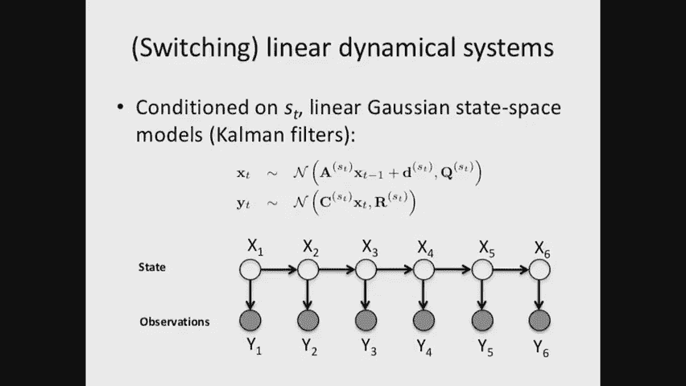

在ICU中，病人身上连接着多种探头，持续监测心率、血氧、体温等生理信号。这些信号常因探头脱落、重新校准、药物干预等产生伪差。识别并纠正这些伪差对于准确评估病人状态、减少误报警至关重要。


### 核心方法：切换线性动态系统


我们面临的情况是：几乎没有标记数据（不知道真实生理状态和伪差发生的确切时间），但对系统的动态有一定领域知识。因此，采用了一个结合领域知识的概率图模型——切换线性动态系统。

**模型组件**：
1.  **隐状态 `x_t`**： 表示在时间 `t` 病人的真实生理状态（如真实心率）。我们假设其随时间演变遵循一个线性动态系统（或自回归过程），例如：`x_t = A * x_{t-1} + ε`，其中 `ε` 是高斯噪声。
2.  **切换状态 `s_t`**： 表示在时间 `t` 是否发生伪差（如探头脱落）。`s_t` 本身也可以是一个马尔可夫链，模拟伪差持续或切换的概率。
3.  **观测值 `y_t`**： 表示在时间 `t` 实际监测到的信号。它依赖于真实状态 `x_t` 和切换状态 `s_t`。
    *   当 `s_t` 表示“正常”时，`y_t` 接近 `x_t`（带有小噪声）。
    *   当 `s_t` 表示“伪差”（如探头脱落）时，`y_t` 与 `x_t` 无关，可能遵循另一个分布（如信号丢失、或按已知物理规律衰减）。

**领域知识的融入**：
*   对正常心率动态，使用高阶自回归过程建模，以捕捉其平滑性与短期波动。
*   对特定伪差（如温度探头脱落后的冷却），使用指数衰减模型来参数化 `y_t` 在给定 `s_t` 和 `x_t` 下的条件分布。

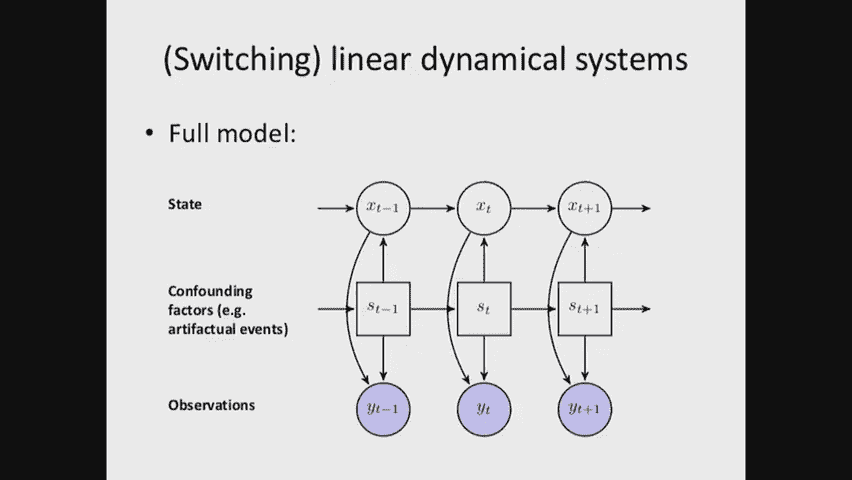


**学习与推断**：
由于 `x_t` 和 `s_t` 是隐变量，我们只有观测数据 `y_t`。论文采用期望最大化（EM）算法进行无监督学习：
*   **E步**： 在给定当前模型参数下，推断隐变量 `x_t` 和 `s_t` 的后验分布。
*   **M步**： 基于E步推断出的隐变量分布，更新模型参数以最大化数据的边际似然。
由于精确推断是NP难的，论文采用了近似推断方法（如高斯和近似），并展示了其优于蒙特卡洛近似。

**结果**： 该方法能有效识别出如血样采集、温度探头脱落等伪差事件，其ROC曲线表现显著优于基线方法，展示了在数据稀缺但领域知识丰富时，精心设计的概率模型的有效性。

---

## 案例二：基于深度学习的心房颤动检测 ❤️

上一节我们看到了在数据稀缺时如何利用领域知识建模。本节中，我们来看看另一个极端：当拥有大量数据时，如何用数据驱动的方法解决生理时间序列问题——检测心房颤动。

心房颤动是一种常见的心律失常，增加中风等风险。传统检测方法依赖于信号处理提取特征（如RR间期、波形形态），再结合规则或机器学习分类器。

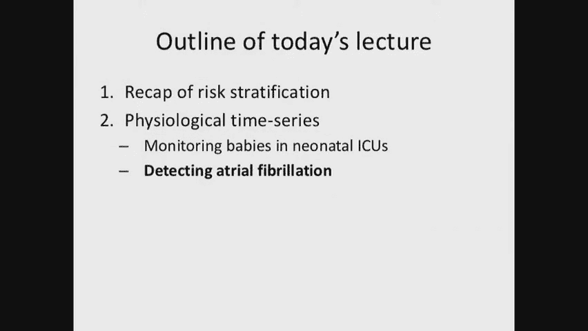

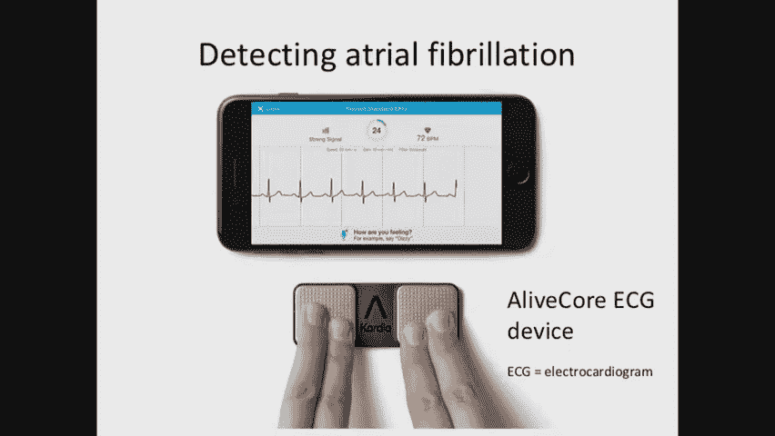

### 从传统方法到深度学习

以下是该领域方法演进的一个简述：

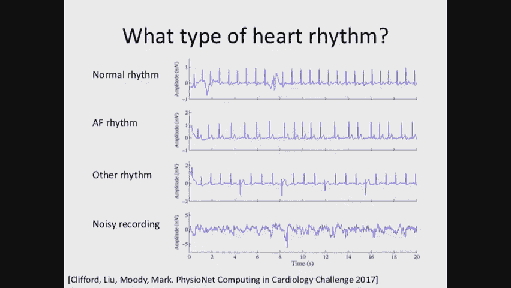


1.  **基于规则的信号处理（2002年）**： 对心电图信号滤波、寻峰，计算RR间期等特征，根据阈值规则判断。
2.  **马尔可夫模型（1970年）**： 对正常和房颤的RR间期序列分别建立马尔可夫模型，通过比较序列似然来检测。
3.  **传统机器学习（1991年）**： 提取大量专家定义的特征（如RR间期不规则性度量），输入神经网络等模型进行分类。
4.  **深度卷积神经网络（2019年，斯坦福研究）**： **直接端到端处理原始心电图信号序列**，无需手动设计特征。

### 深度学习方法详解

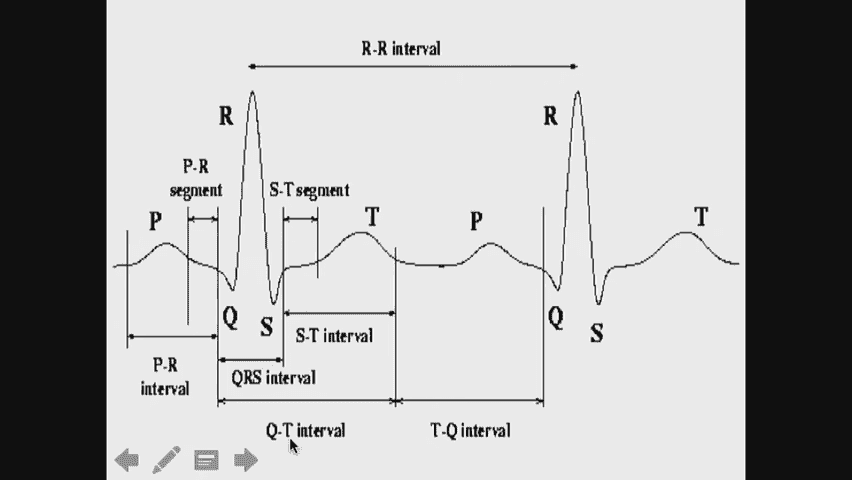


斯坦福大学在《自然·医学》上的研究采用了深度一维卷积神经网络（CNN），关键点包括：

*   **数据规模大**： 使用来自5万多名患者的9万多条记录，远超以往研究。
*   **任务更精细**： 不仅区分正常、房颤，还扩展到14种不同心律类别。
*   **模型架构**：
    *   **输入**： 原始的一维心电图信号片段。
    *   **核心**： 多层一维卷积层。每层使用多个滤波器在信号上滑动，计算局部点积，以自动提取不同层次的波形模式特征。
        *   **代码示意（一维卷积）**：
            ```python
            # 假设 signal = [1, 2, 3, 4, 5], filter = [0.5, -0.5]
            # 卷积结果（‘valid’模式）为：
            # result[0] = 1*0.5 + 2*(-0.5) = -0.5
            # result[1] = 2*0.5 + 3*(-0.5) = -0.5
            # result[2] = 3*0.5 + 4*(-0.5) = -0.5
            # result[3] = 4*0.5 + 5*(-0.5) = -0.5
            ```
    *   **结构**： 包含卷积层、池化层（降采样）、全连接层以及残差连接（允许信息跨层传递）。
*   **评估**：
    *   **序列度量**： 评估模型对长时间序列上每一秒心律分类的准确性。
    *   **集合度量**： 评估模型判断整个记录中是否存在房颤的准确性（更贴近临床诊断需求）。

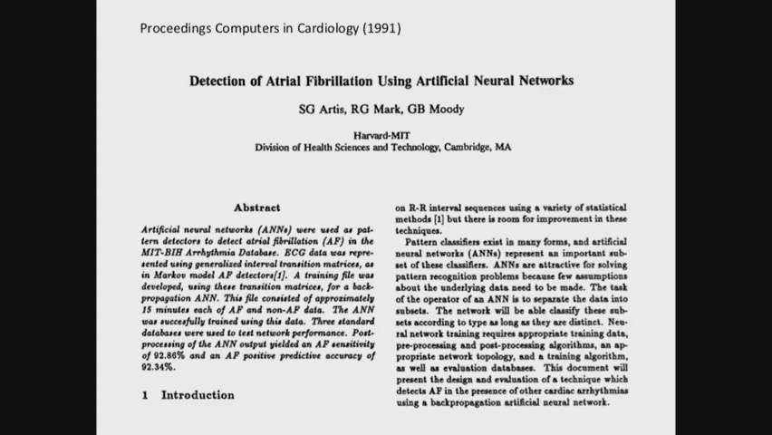

**结果**： 该深度模型的诊断性能与心脏病专家小组相当甚至更优，展示了在大数据支持下，端到端深度学习模型能够自动学习到有判别力的特征，超越依赖手工特征的传统方法。这类技术正被应用于智能手表等消费级设备中。

---

## 总结 🎯

本节课中我们一起学习了生理时间序列建模的两种主要范式。

*   在**数据稀缺但领域知识丰富**的场景（如ICU伪差识别），我们可以构建**结合领域知识的概率图模型**（如切换线性动态系统）。通过融入对系统动态和伪差机制的了解，并利用无监督学习算法（如EM），即使没有大量标记数据，也能取得良好效果。
*   在**拥有大量标记数据**的场景（如房颤检测），我们可以采用**数据驱动的深度学习方法**（如一维CNN）。端到端的学习方式能自动从原始数据中提取复杂特征，在任务性能上达到甚至超越传统基于手工特征的方法，尤其在任务复杂度高、数据量充足时优势明显。

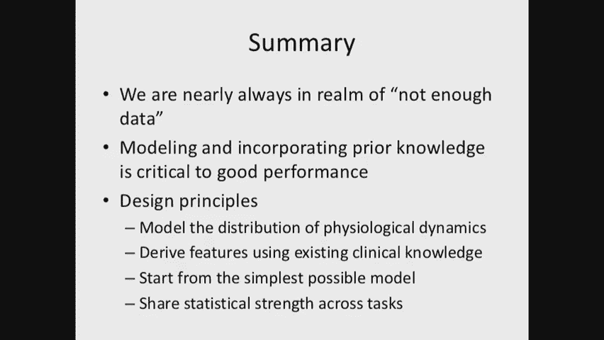

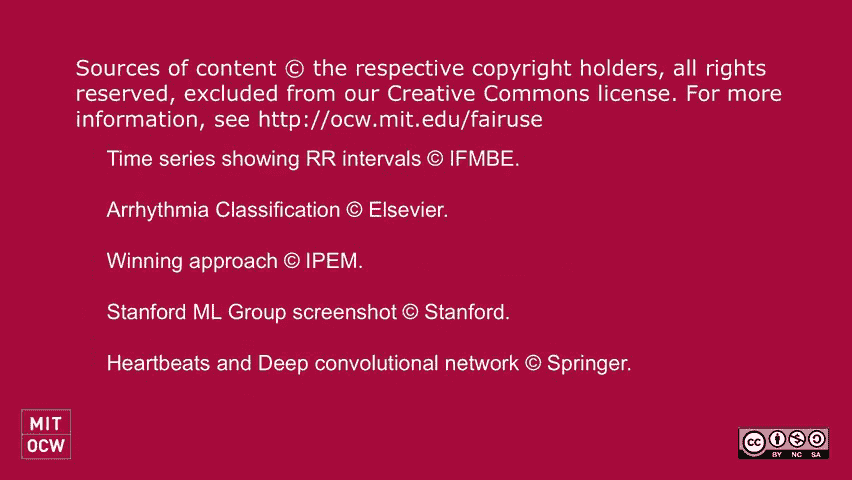


在实际应用中，需要根据具体问题的数据可用性、领域知识深度以及对模型可解释性的要求，来选择合适的建模路径。