# 7：自然语言处理在医疗保健中的应用 🏥

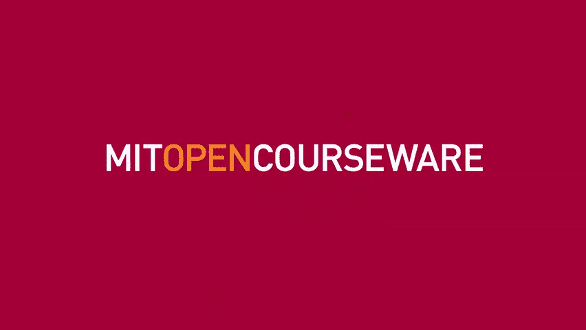

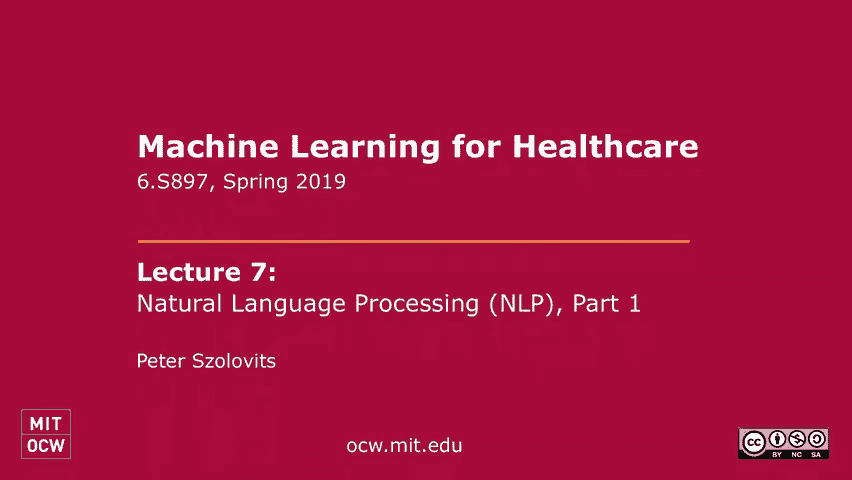


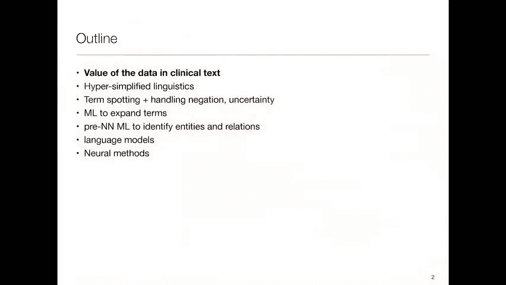

在本节课中，我们将要学习自然语言处理在医疗保健领域，特别是在临床文本分析中的作用。我们将探讨为什么临床文本至关重要，并介绍几种从这些文本中提取有价值信息的方法，包括术语定位和更复杂的机器学习技术。

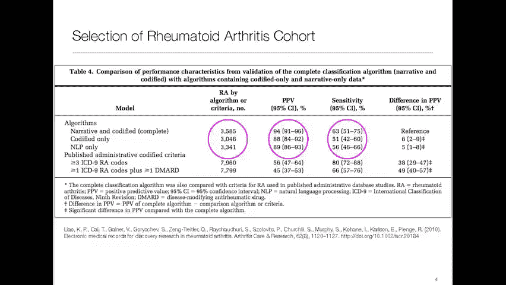

---

## 为什么我们关心临床文本？ 📝

上一节我们介绍了课程概述，本节中我们来看看为什么临床文本分析如此重要。临床文本，如医生的笔记和出院总结，包含了关于患者状况的丰富细节。然而，这些信息通常以非结构化的叙述形式存在，难以直接用于计算分析。

这里有一个来自MIMIC数据库的出院总结示例：
```
盲人先生是一位79岁的白人男性，有糖尿病和下壁心肌梗死病史。他于11月13日接受了扩大的憩室开放修复术。随后，他出现了呕血和呼吸窘迫，因此被插管。
```
从这段文本中，我们可以提取出关于“盲人先生”病情的多个关键事实。为了利用这些信息，我们需要将其从自然语言转化为机器可读的结构化数据。

---

## 传统方法的局限性：账单代码 📊

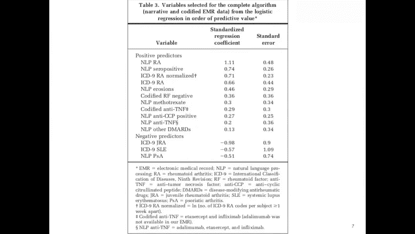

在深入NLP方法之前，我们需要了解传统方法的局限性。医疗记录中常用的账单代码（如ICD-9）是为了向保险公司收费而设计的，并非为了精确描述患者病情。

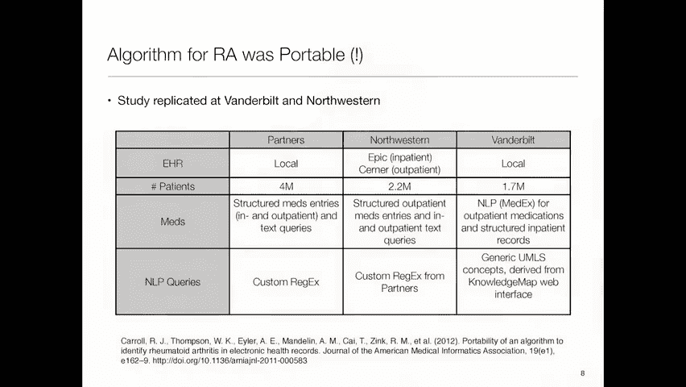

例如，一项2010年左右的研究试图通过账单代码识别类风湿性关节炎患者。结果发现，仅凭一个账单代码，其阳性预测值（PPV）非常低。即使要求有三个相关账单代码，PPV也仅提升至27%。这是因为患者可能因排除某种疾病而接受多项检查，从而累积了多个相同疾病的账单代码，但实际上并未患病。

因此，仅依赖编码数据（如账单代码、实验室值）不足以获得高精度的患者队列。这凸显了从叙述性文本中提取信息的必要性。

---

## 利用自然语言处理提升预测能力 🔍


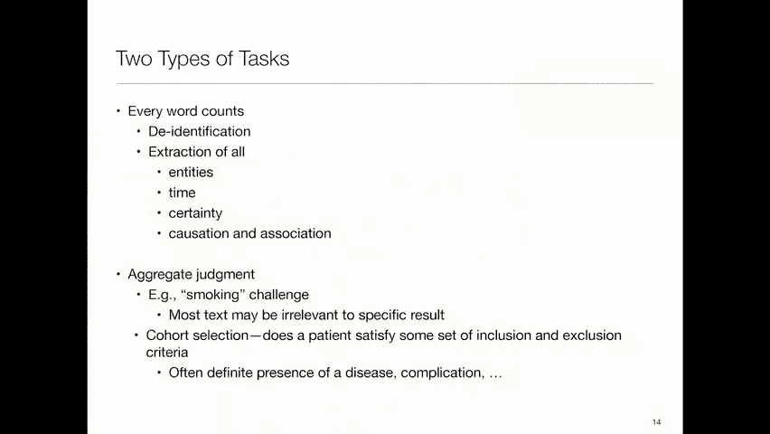

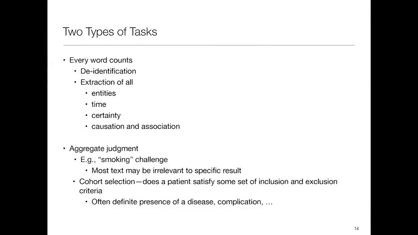

既然我们认识到编码数据的局限性，本节中我们来看看如何利用自然语言处理来提升预测能力。

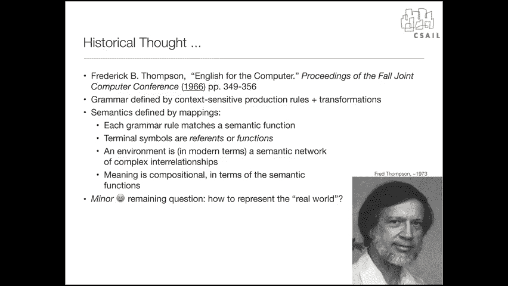

在该类风湿性关节炎的研究中，研究者构建了一个预测模型。他们使用了来自电子病历的多种数据源：
*   **编码数据**：实验室值、处方、人口统计数据。
*   **叙述文本**：护理笔记、放射学报告、出院摘要等。

他们使用了一个名为“HighTech”的系统（在当时是先进的）从文本中提取实体，并进行了以下处理：
1.  **实体提取**：识别疾病、药物、实验室发现等。
2.  **列表扩展**：手动添加表达相同概念的不同说法。
3.  **否定检测**：识别文本中的否定含义（例如，“患者**没有**胸痛”）。

**核心模型**：研究者使用**逻辑回归**来构建预测模型。模型的预测因子是NLP提取的特征和编码特征的组合。

**公式示例（逻辑回归）**：
`P(RA=1) = σ(β₀ + β₁*(NLP_RA_mention) + β₂*(Lab_RF_positive) + ...)`
其中，`σ`是sigmoid函数，`β`是回归系数，`NLP_RA_mention`等是特征。

**结果**：仅使用NLP特征，模型达到了约89%的PPV；结合编码数据后，PPV提升至约94%。这证明了临床叙述文本具有巨大的价值。

---

## 方法的通用性与挑战 🌐

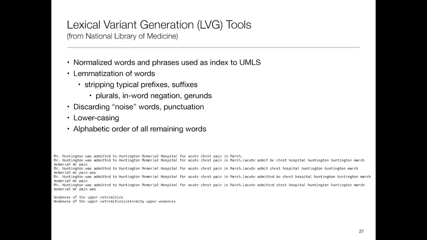

上一节我们看到了NLP在一个医疗系统中的成功应用，本节中我们来看看这种方法在不同机构间的通用性，以及临床文本分析面临的普遍挑战。


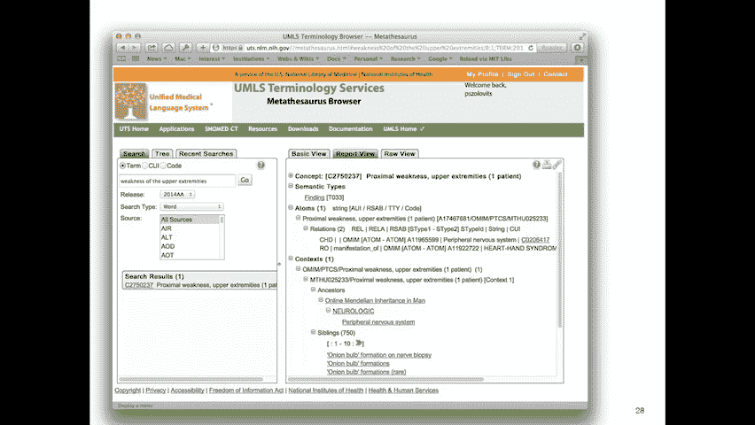

同一研究在范德比尔特大学和西北大学进行了复现。尽管不同医院的电子病历系统、数据提取方式和本地术语存在差异，但模型的性能表现相似，显示出该方法具有一定的通用性。然而，性能估计方式的不同导致了PPV值的差异，这提醒我们需要谨慎评估算法。

临床文本分析本身面临诸多挑战：
*   **非标准缩写与笔迹**：例如，“SOB”可能表示“呼吸急促”（Shortness Of Breath），而非其字面意思。
*   **去识别化**：在共享数据前，需要移除受保护的健康信息（PHI），但需小心区分PHI和重要医学术语（如“亨廷顿病”）。
*   **信息提取**：需要确定实体的时间、确定性以及实体间的关系（如“药物治疗疾病”）。
*   **文本摘要**：由于电子病历中常见的复制粘贴，文本存在大量重复，如何生成简洁的摘要是一大挑战。
*   **任务差异**：有些任务需要逐字审查（如去识别化），而有些只需总体判断（如判断患者是否吸烟）。

---

## 从语言学到术语定位：实践方法的演变 ⚙️

早期，人们曾尝试用计算语言学的方法完整地解析临床文本，就像分析普通英语一样，但这种方法在实践中非常困难且不实用。

因此，更实用的“术语定位”方法成为了主流。以下是其核心思路：

1.  **构建术语列表**：与医学专家合作，列出所有可能指示目标病症的单词和短语。
2.  **文本搜索**：在临床笔记中搜索这些术语。
3.  **处理否定**：使用规则排除被否定的提及（例如，“无胸痛”）。

一个经典的否定检测算法是NegEx。它的工作原理很简单：
*   如果在UMLS术语的**前5个或后5个词内**出现特定的否定短语（如“否认”、“排除”、“未见”），则认为该提及被否定。
*   需要处理例外情况（如“革兰氏阴性”中的“阴性”不是否定词）。

尽管简单，但这类规则方法非常有效。

---

## 关键资源：统一医学语言系统 🗃️

为了系统化地进行术语定位，我们需要一个标准的医学术语库。这就是**统一医学语言系统**。

UMLS是一个庞大的元词库，它整合了来自许多生物医学词表和分类系统的概念。它的作用是：
*   **概念归一化**：将不同术语（如“心肌梗塞”、“心脏病发作”、“急性心梗”）映射到同一个概念标识符（CUI）。
*   **提供语义网络**：每个概念都有语义类型（如“疾病或综合征”、“药物”）并处于层级关系中。

**代码示例（伪代码）**：
```python
# 假设使用一个UMLS映射工具
text = “患者主诉上肢无力。”
concepts = umls_mapper.lookup(text)
# 输出可能包括：CUI_C1234567 (概念：近端肢体无力)， 语义类型： ‘发现’
```

使用UMLS，我们可以大大扩展术语列表的覆盖范围，并更规范地处理临床文本。

---

## 总结与展望 🎯

本节课中我们一起学习了自然语言处理在医疗保健中的关键应用。我们从临床文本的价值出发，探讨了传统编码数据的局限，并深入介绍了通过术语定位和机器学习（如逻辑回归）从叙述文本中提取信息的实用方法。我们还了解了UMLS这一重要资源，以及该方法在不同机构间复现所展现的通用性。

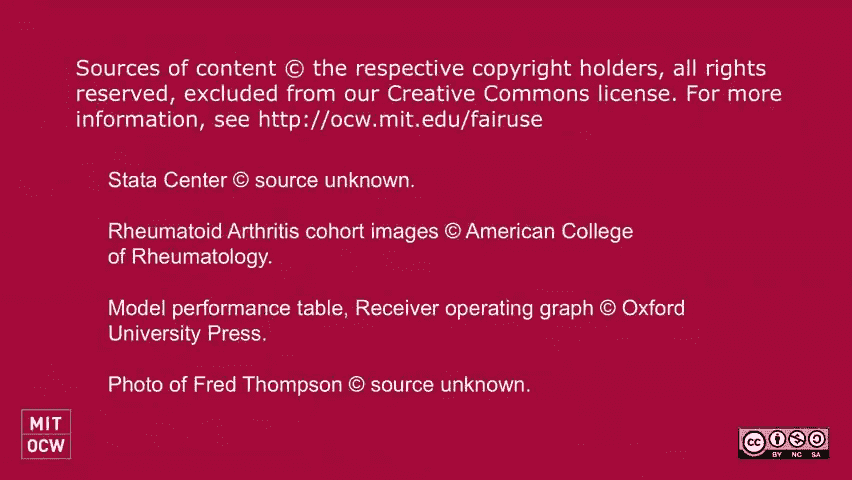


尽管挑战依然存在，例如文本的复杂性、系统间的差异以及向临床工作流程集成的难度，但NLP在改善患者队列识别、辅助临床研究和未来潜在的决策支持方面，前景十分广阔。随着电子病历的普及和计算能力的提升，我们正朝着更智能地利用医疗文本数据的方向稳步前进。