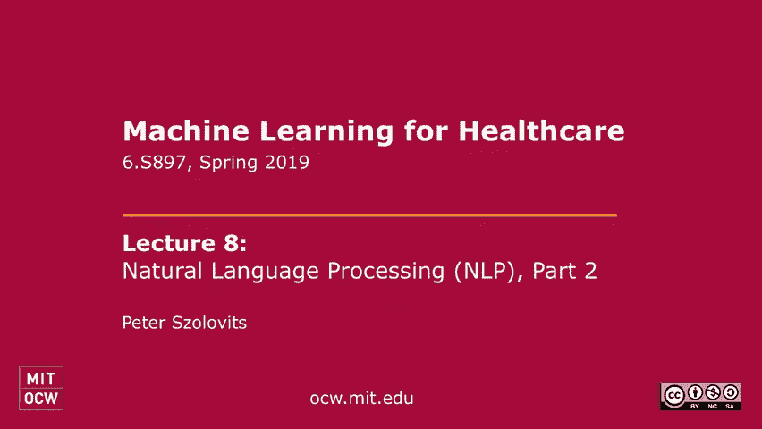
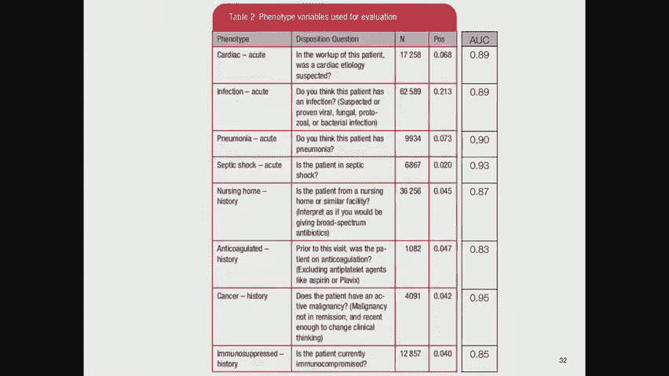
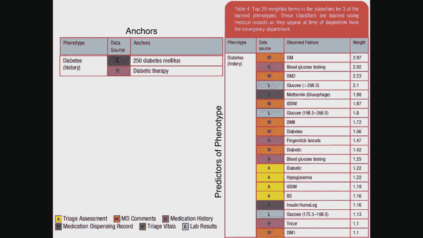
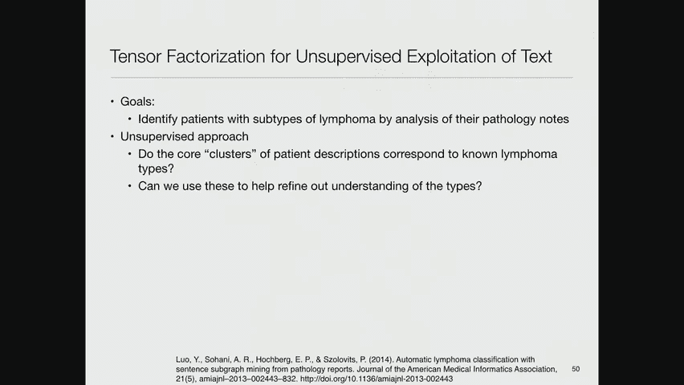
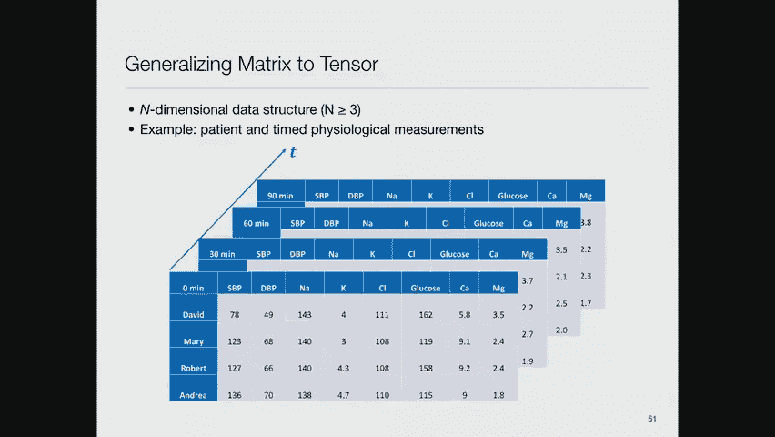
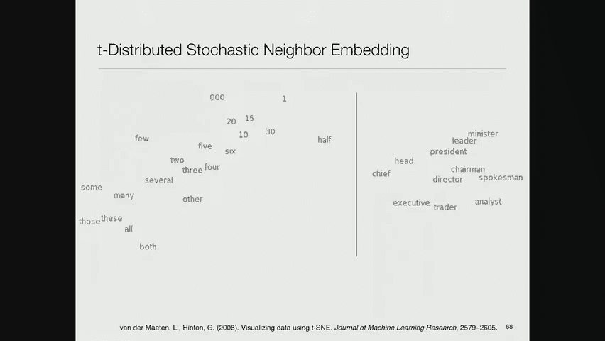
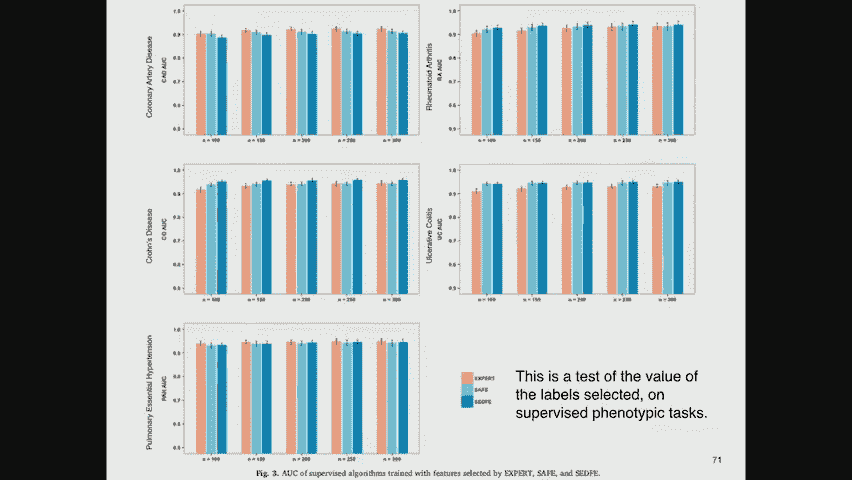
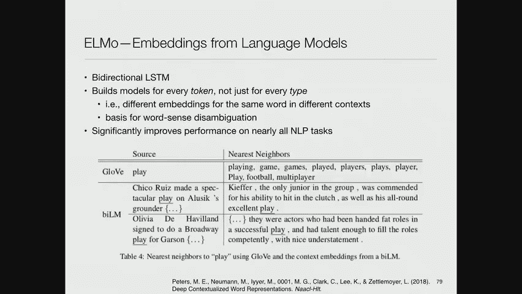

# 8：自然语言处理 (NLP) 在临床数据中的应用 🏥

在本节课中，我们将学习自然语言处理技术如何应用于临床数据分析。我们将从传统方法开始，逐步过渡到更现代的深度学习模型，了解它们如何帮助我们从医疗文本中提取有价值的信息。

## 从短语匹配到机器学习模型

上一节我们介绍了使用简单短语匹配来识别临床数据中的关键信息。本节中我们来看看如何将这种方法复杂化，并引入机器学习。

一篇来自大卫·桑塔格实验室的论文提出了更复杂的版本。他们的起始方式相同：首先确定具有高预测价值的“锚”术语（例如，特定疾病代码或治疗药物），这些术语在患者笔记中出现时能高度准确地指示目标表型。

然后，他们建立了一个模型，试图根据医疗记录中的所有其他信息来预测这些锚术语在文本中的出现。这是一种“银标准”训练方式。模型从这些高质量的锚中学习，并自动发现大量与锚术语相关的其他代理术语，从而扩大了识别范围。

以下是该模型的技术细节：
*   **表示方法**：本质上使用了词袋表示。
*   **上下文处理**：掩盖了目标词周围的三个词，以消除短期依赖。
*   **模型**：使用L2正则化的逻辑回归模型来预测术语出现。
*   **扩展**：将新发现的预测性特征纳入搜索词汇表。

他们从锚术语构建表型估计器，并为每个新预测器计算校准分数。最终，他们构建了一个联合估计器。评估显示，在八种有标注数据的表型上，模型性能（AUC）在0.83到0.95之间。虽然其他几十种表型缺乏验证数据，但预期性能相似。这表明该方法能有效扩展识别能力。

## 实体识别与去标识化

上一节我们讨论了如何识别特定表型。本节中我们来看看NLP的另一个关键应用：实体识别，特别是用于保护患者隐私的去标识化。

考虑句子：“亨廷顿先生在位于亨廷顿大道的亨廷顿医院接受了亨廷顿病的治疗。” 其中“亨廷顿”一词在不同上下文中指代不同实体。如果目标是去除可识别个人身份的健康信息，你需要移除“亨廷顿先生”，但保留“亨廷顿病”，并可能根据研究目的决定是否保留医院和街道名称。

在2000年代中期，我们采用了一种“厨房水槽”方法来解决这个问题：
*   **标记与特征提取**：对文本进行标记，并为每个标记派生多种特征，包括：词汇本身、词性、大小写模式、周围标点、所在文档章节。
*   **模式与词典**：识别与临床术语匹配的词典条目，以及用于检测电话号码、社保号、地址等的模式。
*   **句法分析**：使用链接语法解析器获取单词间的句法关系，并将这些关系作为特征。

我们将所有特征（包括词汇、上下文、句法链接特征）输入一个支持向量机模型。尽管产生了数百万个特征，但模型能有效筛选，最终在识别PHI方面达到了约98.5%的精确率和95.25%的召回率，优于基于规则的方法。此方法不仅适用于去标识化，也可用于识别疾病、药物等实体。

## 利用主题建模预测再入院风险

上一节我们介绍了基于特征工程的实体识别。本节中我们来看看如何使用无监督的主题建模来辅助临床预测任务，例如预测精神病患者的30天再入院风险。

我们与精神科医生合作，试图预测精神病患者30天内的再入院情况。基线模型使用了年龄、性别、保险类型（作为社会经济地位代理）、共病指数等特征。

为了改进预测，我们尝试从临床笔记中提取信息：
1.  **TF-IDF特征**：计算术语频率-逆文档频率，选取最具信息量的1000个词作为特征。
2.  **主题建模（LDA）**：使用潜在狄利克雷分配模型，将所有笔记视为词袋，自动发现了75个主题。这些主题是无监督生成的，但事后可由专家解释（例如，与“酗酒”、“精神病”相关的主题）。

研究发现，仅使用基线社会人口学和临床变量时，不同风险组间的差异不大。而加入75个主题特征后，模型能更好地区分高风险和低风险再入院患者组，预测性能（AUC）得到显著提升，达到约0.7。虽然这不是极高的预测精度，但提供了有用的增量信息。

另一项更大规模的研究也使用了类似思路，通过分析临床笔记中与情绪“正价性”和“负价性”相关的术语，来预测患者的自杀风险或意外死亡风险，并观察到了明显的风险分层。

## 张量分解与无监督疾病分类

上一节我们看到了主题建模在预测中的应用。本节中我们来看一种不同的无监督方法：张量分解，用于对淋巴瘤病理报告进行分类。

该研究的目标是仅根据病理报告的文本内容（隐藏诊断结论），通过无监督学习对淋巴瘤类型进行聚类。这很重要，因为淋巴瘤的分类标准时常修订，数据驱动的方法可能帮助发现新的分类特征。

方法的核心是张量分解：
*   **张量构建**：将数据表示为三维张量。例如，一个维度是患者，第二个维度是报告中出现的单词，第三个维度是从句法解析中提取的“语言概念子图”（表示实体间的关系）。
*   **分解原理**：类似于矩阵分解（`数据矩阵 ≈ 矩阵A × 矩阵B`），张量分解旨在找到核心张量和多个因子矩阵，使得它们的乘积能最佳地重建原始张量（最小化重建损失）。

研究首先对句子进行解析，构建表示实体关系的图，并分解为频繁子图。然后将患者-单词-子图关系构建成张量并进行分解。这种方法（称为TF）的宏观平均精确率和召回率约为0.75，优于仅使用单词或子图的非负矩阵分解方法。它有效地利用了单词、子图和患者之间的三方关系。

## 语言建模：从N-gram到现代嵌入

上一节我们探讨了特定的无监督学习方法。本节中我们转向NLP的核心基础之一：语言建模，并回顾其从传统方法到现代深度学习的演进。

语言建模的核心任务是：给定一个词序列，预测下一个词的概率分布。一个好的语言模型能捕捉语言的规律性。困惑度是衡量语言模型好坏的标准，困惑度越低，模型越确定。

传统方法是N-gram模型：
*   **原理**：基于马尔可夫假设，用前N-1个词来预测第N个词。
*   **示例**：在大型语料库上统计N-gram频率，可以用于随机生成文本。例如，基于莎士比亚作品训练的4-gram模型可以生成看似合理的“莎士比亚风格”文本。

然而，N-gram模型面临数据稀疏问题，且无法捕捉深层语义。现代方法转向词嵌入：
*   **Word2Vec**：通过神经网络学习词的分布式向量表示。它有两种模型：连续词袋模型（用上下文预测中心词）和跳字模型（用中心词预测上下文）。其神奇之处在于，词向量空间中的几何关系可以对应语义关系（例如，`vector(‘King’) - vector(‘Man’) + vector(‘Woman’) ≈ vector(‘Queen’)`）。
*   **ELMo**：解决了Word2Vec一词一义的问题。它使用双向LSTM，根据词的上下文生成不同的词向量表示，从而处理一词多义。
*   **BERT**：基于Transformer架构。它使用“掩码语言模型”任务进行预训练（随机掩盖输入中的一些词，让模型预测它们），并加入了“下一句预测”任务。BERT在多种NLP基准任务上取得了巨大提升。
*   **GPT-2**：同样基于Transformer，但采用自回归方式（根据上文生成下文）进行训练。它在海量文本和多任务上训练，拥有多达15亿参数，能够生成极其逼真、连贯的文本。

这些现代语言模型通过在大规模语料上预训练，获得了强大的语言表示能力，可以微调后用于各种下游任务，如文本分类、问答、实体识别等。

## 自动扩展临床概念集

上一节我们介绍了强大的通用语言模型。本节我们回到临床领域，看一个结合了嵌入思想和外部知识源来扩展临床概念集的自动化方法。

目标是开发一种完全自动化、稳健的无监督特征选择方法，用于识别与目标表型相关的概念，且仅利用公开医学知识源，而非特定医院的EHR数据。

方法步骤如下：
1.  **构建医学词嵌入**：使用约500万篇Springer医学文章训练Skip-gram模型，为每个词生成500维向量。
2.  **计算表型嵌入**：取目标表型名称及其在UMLS中的定义，汇总其中单词的词向量（按逆文档频率加权），得到该表型的向量表示。
3.  **从知识源收集相关概念**：从维基百科、Medscape等五个来源，使用命名实体识别技术提取与表型相关的概念。
4.  **筛选与扩展**：保留至少在三个来源中出现的概念以增强置信度。然后，选择K个与表型嵌入余弦距离最近的概念。
5.  **构建表型估计器**：将表型表示为这些相关概念向量的线性组合。

在冠状动脉疾病、类风湿关节炎等五种表型上的实验表明，这种自动扩展方法获得的特征集，其性能与专家精心策划的特征集相当，但所需的人工干预大大减少。

## 基于深度学习的去标识化器

上一节我们看到了如何利用外部知识。本节中我们来看一个更复杂的、基于深度学习的去标识化器架构示例。

该去标识化器采用多层神经网络架构：
1.  **字符级双向RNN**：在单词的字符序列上运行，以捕捉拼写错误和医学术语的词根结构。
2.  **词嵌入层**：连接字符RNN的输出与预训练的词向量。
3.  **词级双向RNN**：将上述连接向量输入另一层双向RNN，以捕捉上下文信息。
4.  **前馈神经网络与CRF**：对每个词，将RNN输出通过前馈网络计算其属于各类PHI（如姓名、地址）的概率分布。顶层使用条件随机场层来考虑标签间的序列依赖关系（例如，姓名后很可能跟日期）。

该模型通过优化F1分数，在去标识化任务上达到了约99.2%的精确率和99.3%的召回率。需要指出的是，尽管性能很高，但HIPAA法规要求理论上移除所有PHI，任何不完美的技术都可能在法律和实际发布中面临审查。

## Transformer架构与注意力机制

上一节我们介绍了基于RNN的深度学习模型。本节中我们深入探讨当前NLP的基石：Transformer架构及其核心——注意力机制。

传统的序列到序列模型（如用于翻译的LSTM）存在瓶颈：需要将整个输入句子编码成一个固定长度的向量。注意力机制的引入允许解码器在生成每个输出词时，“关注”输入句子中最相关的部分。

Vaswani等人进一步提出了《Attention Is All You Need》，认为注意力机制本身足以构建强大模型，从而发明了Transformer：
*   **核心**：自注意力机制。它计算句子中每个词与其他所有词的相关性权重。
*   **多头注意力**：并行使用多组注意力机制，让模型同时关注不同方面的信息（类似于CNN中的多个滤波器）。
*   **位置编码**：由于Transformer不包含循环，需要额外注入单词的位置信息（通常使用正弦/余弦函数）。
*   **架构**：编码器和解码器均由多层（如6层）相同的模块堆叠而成，每个模块包含多头自注意力层和前馈神经网络层，并伴有残差连接和层归一化。

Transformer完全基于注意力，并行化效率高，能更好地处理长程依赖，成为BERT、GPT等现代预训练模型的基础架构。

## 总结

本节课中我们一起学习了自然语言处理在临床数据分析中的应用演进。我们从基于规则和词典的简单短语匹配开始，探讨了利用机器学习（如逻辑回归、SVM）从电子病历中自动扩展特征的方法。我们了解了主题建模和张量分解等无监督学习技术在风险预测和疾病分类中的应用。随后，我们深入回顾了语言建模的发展，从传统的N-gram模型到现代的词嵌入（Word2Vec, ELMo）和基于Transformer的预训练模型（BERT, GPT-2）。最后，我们看到了这些先进技术如何被应用于临床领域的具体任务，如自动化概念集扩展和复杂的去标识化。尽管当前最先进的模型在工程上非常成功，但它们与人类理解语言和进行推理的方式之间的关系，仍是一个有趣的科学问题。