# 9：将技术转化为临床实践 🏥

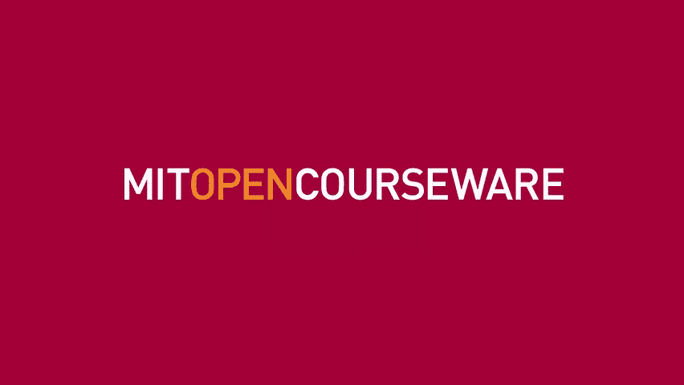

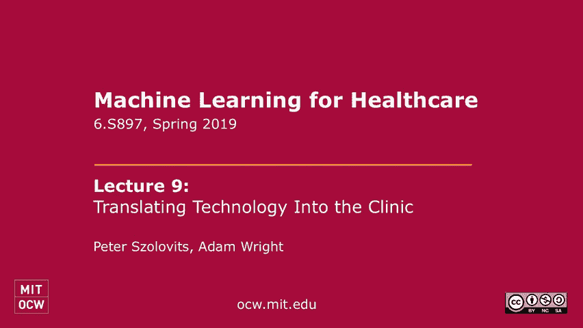

在本节课中，我们将探讨如何将人工智能和信息技术转化为临床实践。我们将回顾技术采用的周期，分析历史上的成功与失败案例，并讨论当前在医疗系统中部署决策支持系统所面临的挑战和机遇。

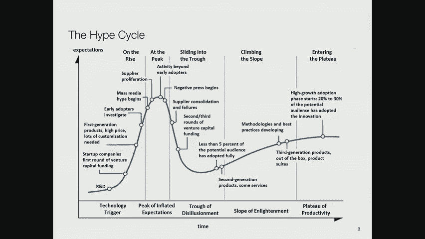

## 技术采用的“炒作循环” 📈

上一节我们介绍了课程概述，本节中我们来看看技术采用的普遍模式，即“炒作循环”。

技术采用遵循一个可预测的模式，称为“炒作循环”。这个循环始于研发阶段，产生了一些有趣的想法。随后，风险资本家和早期采用者对此感到兴奋，期望值迅速攀升至顶峰。媒体开始宣称这将是一场革命。然而，技术往往无法达到这些过高的期望，导致期望值急剧下降，进入“幻灭的低谷”。一些公司会失败或整合。最终，经过调整和现实检验，技术开始稳步发展，达到“启蒙的斜坡”，并最终进入“生产力高原”，成为被广泛接受和使用的成熟产品。

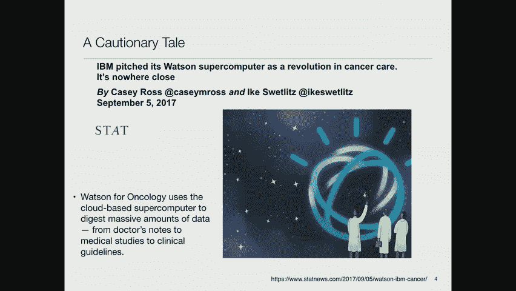

## 历史案例：专家系统与IBM沃森 🤖

上一节我们介绍了技术采用的普遍规律，本节中我们来看看两个具体的历史案例。

在20世纪80年代，专家系统曾经历类似的炒作周期。当时，许多公司投入巨资构建专家系统，例如坎贝尔汤公司建立的用于指导清洗汤缸的系统。然而，这些系统并未带来预期的革命性变化，资金随之枯竭，进入了所谓的“AI冬天”。但事实上，许多专家系统技术（如Microsoft Excel中的帮助系统）已悄然融入日常产品中。

另一个著名案例是IBM的沃森（Watson）系统。在游戏节目《危险边缘》中获胜后，IBM试图将其应用于医疗领域，特别是癌症治疗，即“沃森肿瘤学”。营销宣传承诺该系统将通过阅读所有医学文献和病历，为患者提供最佳治疗方案。然而，该系统在实际应用中遇到了巨大挑战。它并未能真正从数据中推导出新知识，而是很大程度上依赖于纪念斯隆·凯特林癌症中心的肿瘤学家手动编写的规则库。最终，像M.D.安德森癌症中心这样的合作伙伴终止了合作，项目未能达到预期目标。

## 成功的临床决策支持：CPOE系统 ✅

上一节我们看到了过度炒作导致的失败，本节中我们来看看一个更务实且成功的应用：计算机化医生医嘱录入系统。

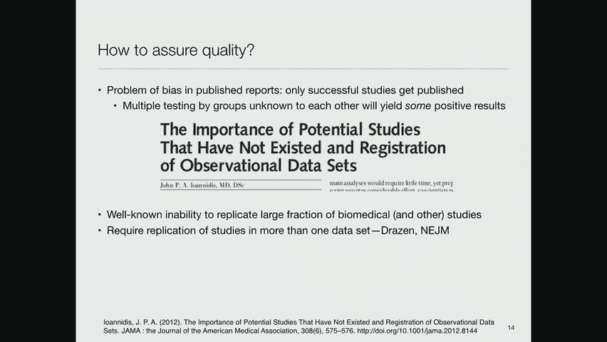

CPOE系统旨在通过计算机界面影响临床医生的行为。例如，当医生开具一种昂贵药物时，系统可以提示存在一种更便宜但同等有效的替代药物。研究表明，这类系统可以显著降低用药错误率、减少药物不良事件并缩短住院时间。其核心优势在于能自动提示药物相互作用、过敏和过量风险，并可通过更新数据库保持信息时效性。

然而，CPOE系统的采用速度比预期缓慢。阻力之一在于它增加了医护人员的行政负担。例如，药剂师在采用CPOE的医院中，花在“分配任务”（非临床工作）上的时间增加了，而用于直接临床咨询的时间减少了。

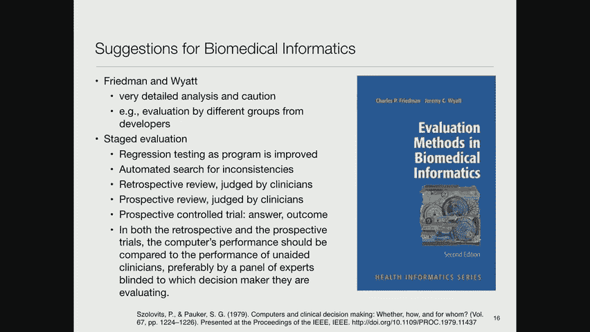

## 医疗技术的传播速度与障碍 🐢⚡

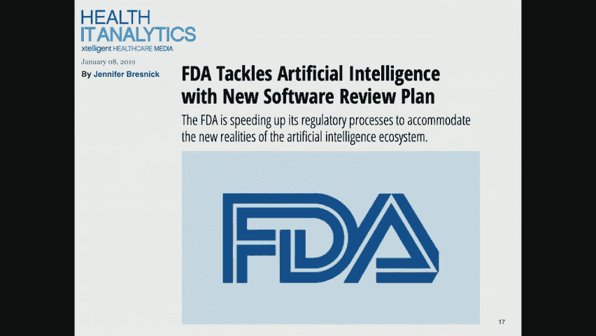

上一节我们讨论了CPOE系统的利弊，本节中我们来看看不同医疗技术的传播速度有何差异。

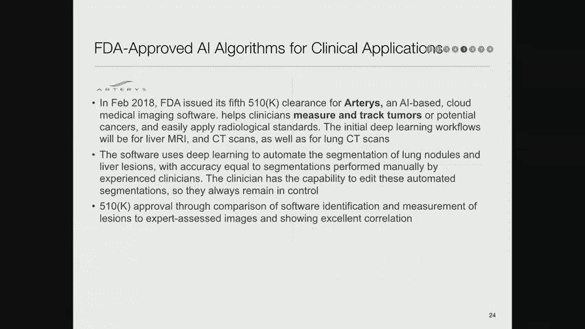

不同医疗技术的传播速度差异很大。例如，他汀类药物（用于降低胆固醇）在大约五到六年内达到了近乎100%的采用率。冠状动脉支架的采用也非常迅速。相比之下，磁共振成像等昂贵技术的采用则因成本和监管限制而较慢。即使是像β受体阻滞剂（可降低二次心脏病发作风险）这样便宜有效的药物，其临床实践中的采用率也可能只有一半左右。

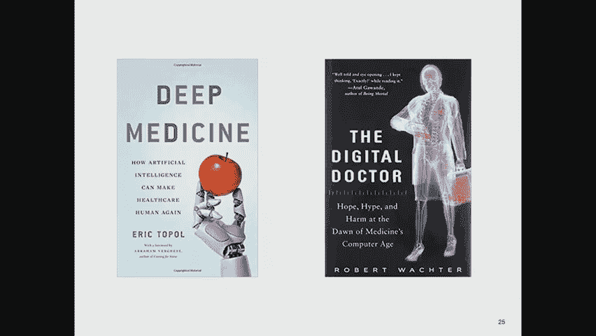

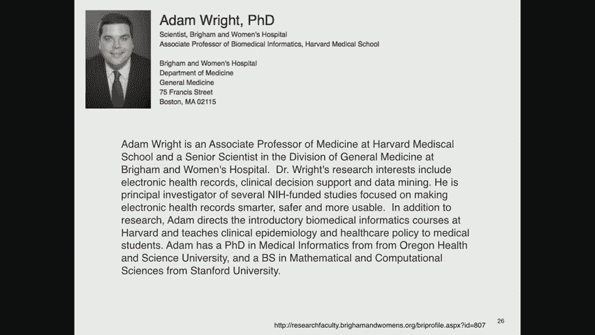

技术的快速传播往往依赖于“内部倡导者”，即那些积极说服同事采用新技术的专业人士。

## 确保研究质量与可重复性 🔬

在我们把这些技术强加给世界之前，如何确保它们的质量呢？这是一个棘手的问题。

有研究表明，相当一部分生物医学研究结果难以复现。当一项研究在独立数据集上无法复现时，基于此制定的政策就可能存在问题。这通常是由于“发表偏倚”——只有那些有显著阳性结果的研究才容易被发表，而阴性结果则被埋没。

针对这个问题，有学者建议进行**研究注册**，即预先声明研究计划，无论结果如何都进行报告。这有助于评估显著结果究竟是真实的效应，还是统计上的偶然发现。另一种方案是像《新英格兰医学杂志》考虑的那样，要求研究结果必须在两个独立数据集上得到复现才能发表。

## 评估临床AI系统：分阶段方法 📊

上一节我们讨论了研究质量的问题，本节中我们来看看如何系统性地评估临床AI系统。

对临床AI系统的评估应采取分阶段、渐进的方法：
1.  **回归测试**：使用一组固定案例进行自动化测试，确保系统更新不会导致性能下降。
2.  **不一致性检查**：构建工具自动检测模型中的逻辑不一致性。
3.  **临床医生回顾性评估**：在大量历史数据上运行程序，由临床医生判断其建议是否正确。
4.  **前瞻性非干预性试验**：实时运行系统但不将结果告知临床医生，事后评估其准确性。
5.  **前瞻性对照试验**：比较使用系统建议的临床医生与未使用系统的临床医生在患者健康结果上的差异。这是证明系统价值的“终极考验”。

## FDA对AI医疗设备的监管 🏛️

食品和药物管理局（FDA）如何监管这些基于AI的医疗设备呢？

FDA将大多数提供临床决策支持的软件视为“动态教科书”，其责任在于使用它的专业临床医生，因此传统上不予直接监管。然而，一旦软件直接向患者提供建议（无专业中介），就会受到FDA监管。

近年来，FDA开始将AI驱动的软件作为医疗设备进行监管。目前已有数十款软件获得批准，主要集中在医学影像分析领域，例如：
*   **骨折检测**：分析X光图像寻找桡骨远端骨折迹象。
*   **糖尿病视网膜病变筛查**：通过视网膜照片检测病变。
*   **中风预警**：分析CT扫描寻找脑血管堵塞迹象。
*   **肿瘤追踪**：在影像中跟踪肿瘤变化。

FDA正在尝试建立灵活的监管框架，以鼓励创新同时确保安全。

## 访谈：Adam Wright博士的经验分享 💬

现在，让我们转向Adam Wright博士，听听他在医疗系统内部部署决策支持系统的第一手经验。

Adam Wright是哈佛医学院副教授，在布莱根妇女医院领导临床决策支持工作。他的团队负责确保决策支持系统正常运行。

以下是Adam分享的关键点：

**部署的决策支持类型**
*   **基于规则的系统**：早期从药物相关决策支持开始，如药物相互作用警报、剂量支持、过敏检查。
*   **预防护理提醒**：如提醒进行巴氏涂片检查或他汀类药物治疗。
*   **基于机器学习的预测模型**：例如预测患者再入院风险或住院跌倒风险，并触发相应干预措施。

**挑战与考量**
*   **阈值设定**：如何为风险评分设定行动阈值是一个复杂的成本效益分析问题，需权衡干预成本与不良事件后果。
*   **警报疲劳**：如果系统产生过多不精确的警报，临床医生会开始忽略它们，甚至指示下级医生覆盖警报。
*   **工作流程整合**：确定在复杂的医疗团队中，谁应该在何时接收何种信息非常困难。
*   **数据质量与可及性**：电子健康记录中的数据并非总是结构化或准确的，这限制了复杂模型的输入。
*   **模型泛化与再训练**：在一个机构训练的模型可能需要在另一个机构的数据上进行验证和重新校准才能有效工作。

**技术集成与互操作性**
*   集成方式多样，包括使用EHR内置规则引擎、通过数据仓库进行批量处理、利用HL7消息或Web服务进行实时交互，以及开发基于SMART on FHIR等标准的应用程序。
*   新的法规正在推动EHR供应商开放应用程序编程接口，这有望降低第三方应用集成的门槛。
*   然而，专有接口与开放标准在功能和数据完整性上仍存在差距。

**评估与迭代**
*   团队通过多种方式评估系统效果：监测临床医生对建议的遵从率、进行前后对比研究，甚至在重要情况下进行随机对照试验。
*   目标是证明系统能真正改善临床结果，而不仅仅是增加干扰。
*   需要建立“知识管理”流程，定期更新模型和规则库，防止其过时。

**未来展望**
Adam对互操作性改善和API开放感到乐观，这使创新应用更易部署。他认为，对于高风险临床决策，人类医生的专业知识在可预见的未来仍不可或缺；但在一些低风险、预测性的任务上，闭环或半闭环的自动化系统是可行且安全的。

---

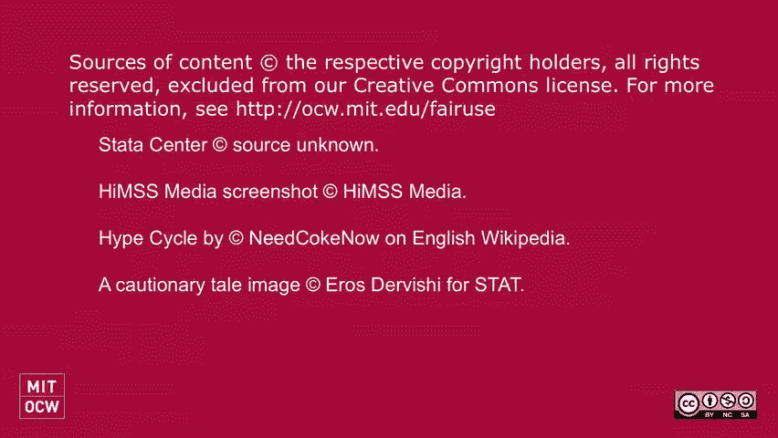

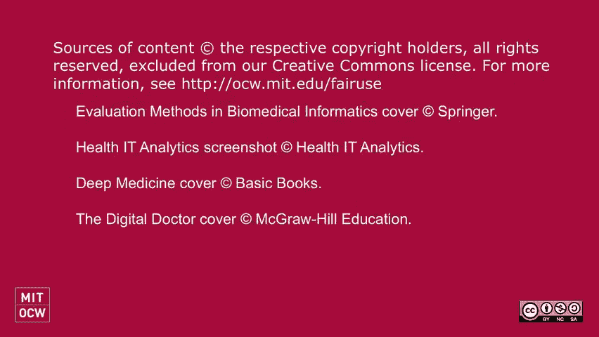

在本节课中，我们一起学习了将技术转化为临床实践的复杂历程。我们回顾了技术采用的“炒作循环”，分析了IBM沃森等案例的教训，也看到了CPOE系统带来的切实益处。我们探讨了研究可重复性的重要性、评估临床AI系统的分阶段方法，以及FDA的监管框架。最后，通过Adam Wright博士的分享，我们了解了在真实医疗系统中部署决策支持系统所面临的实际挑战、集成技术和持续评估的必要性。成功的关键在于保持务实、关注工作流程、确保数据质量，并始终以改善患者结局为核心目标。