# 10：机器学习在心血管医学中的应用 🫀

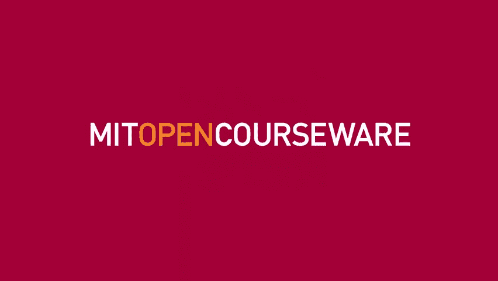

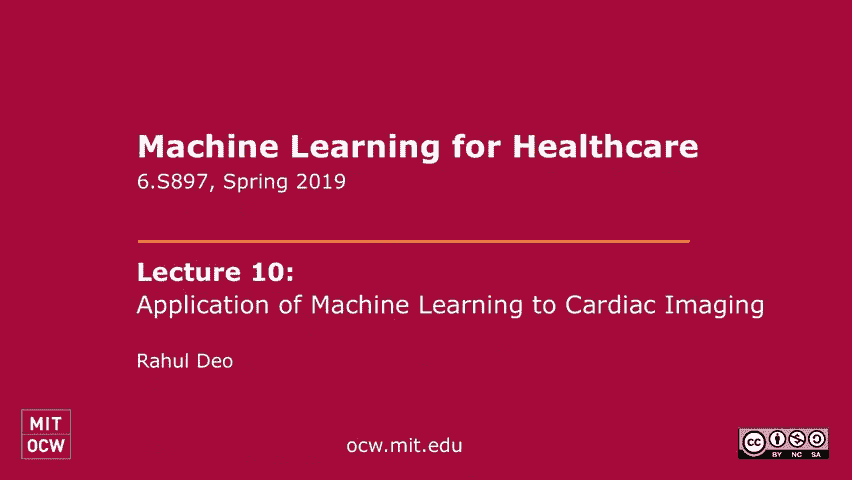

在本节课中，我们将学习机器学习，特别是计算机视觉技术，如何应用于心血管医学领域。我们将从心脏的基础结构和功能讲起，了解主要的诊断方法，并探讨如何将机器学习自动化引入临床实践。课程将涵盖数据获取的挑战、图像分类与分割等核心任务，并展望未来在疾病早期检测和生物学研究中的应用前景。

## 心脏结构与功能概述

心脏的主要功能是作为一个泵，将含氧血液输送到全身循环系统，为大脑、肾脏、肌肉等组织供氧。这是一个高效的器官，每分钟泵出约五升血液，在运动时可增加五到七倍。心脏必须保持非常规律的节律，一生中大约跳动20亿次。

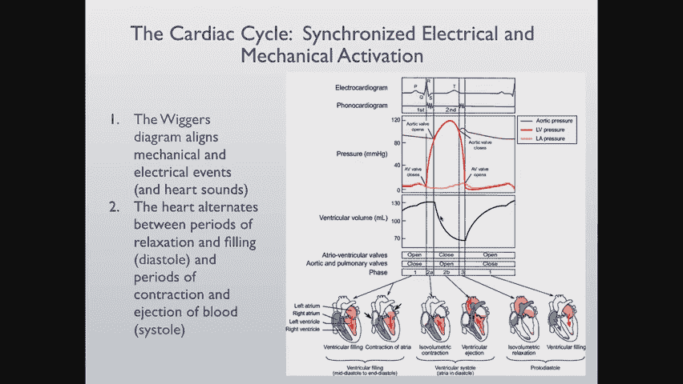

为了理解疾病，我们需要先了解心脏的解剖结构。血液从上、下腔静脉流入右心房，通过三尖瓣进入右心室，右心室将血液泵入肺部进行氧合。含氧血液从左心房流出，通过二尖瓣进入左心室，左心室作为主力泵，将血液通过主动脉输送到全身。

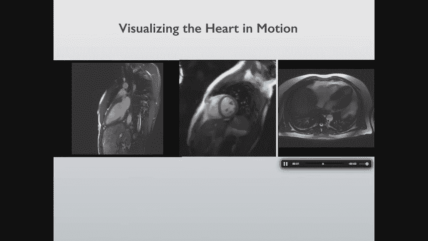

心脏的电传导系统与机械泵血功能紧密耦合。窦房结发出的电信号传导至心房（心电图P波），经过房室结延迟（PR间期），再扩散至心室（QRS波群），最后复极化（T波）。这种电-机械耦合是心脏生理学的核心。

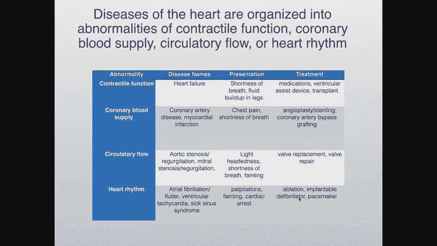

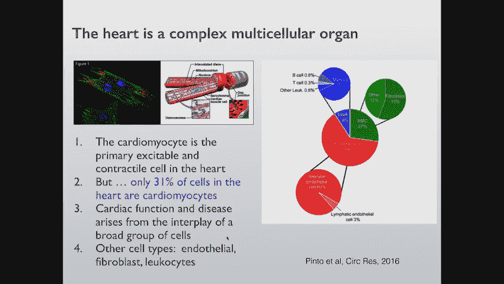

## 心脏疾病分类

医生根据心脏功能异常来组织疾病定义。以下是主要的疾病类别：

*   **心力衰竭**：心脏泵血功能异常，表现为呼吸急促、腹部和腿部积液。治疗包括药物、辅助设备甚至移植。
*   **冠心病/心肌梗死**：冠状动脉堵塞导致心肌缺血或坏死，表现为胸痛、呼吸急促。治疗包括血管成形术、支架植入或搭桥手术。
*   **瓣膜疾病**：心脏瓣膜异常导致血液反流（反流）或狭窄（狭窄），表现为头晕、呼吸急促、晕厥。治疗需要修复或置换瓣膜。
*   **心律失常**：如心房颤动（心房颤抖）或心室功能不全，表现为心悸、昏厥甚至猝死。治疗包括起搏器、除颤器植入或消融手术。

传统的疾病分类侧重于泵功能和电活动，但心脏包含多种细胞类型（心肌细胞、内皮细胞、成纤维细胞等），未来可能需要更复杂的生物学视角来理解疾病。

## 心脏成像与诊断方法

心脏病学诊断高度依赖成像技术，不同技术的成本和用途各异：

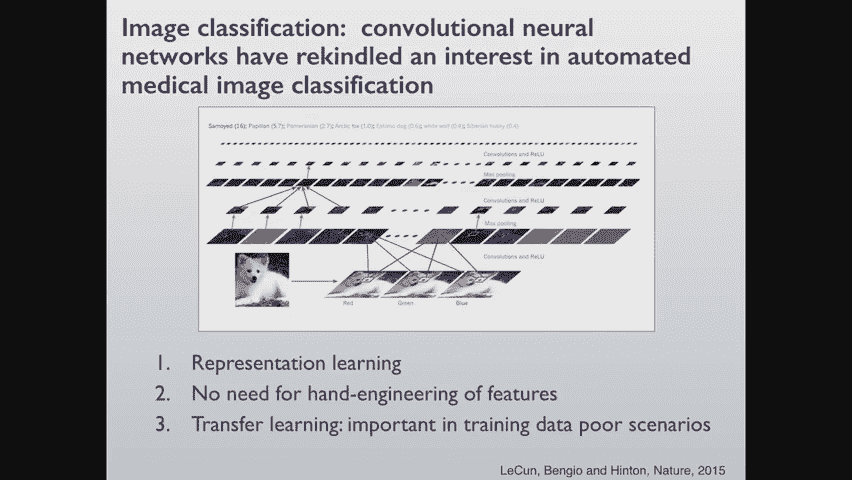

*   **心电图 (ECG)**：成本较低，用于诊断急性心脏病发作、心律失常等。
*   **超声心动图 (Echocardiogram)**：使用声波成像，用于量化心脏结构和功能，诊断心力衰竭、瓣膜病等。
*   **心脏磁共振 (MRI)**：成像质量高但非常昂贵，用途与超声心动图类似。
*   **血管造影 (Angiography)**：通过X射线或CT扫描可视化冠状动脉血流，用于定位堵塞并指导支架植入。
*   **核素显像 (PET/SPECT)**：使用放射性示踪剂检测心肌血流异常。

临床决策（如是否植入除颤器、进行血管成形术或瓣膜置换）常常依赖于这些成像检查的结果。然而，创新面临一个挑战：新风险模型的建立依赖于现有付费收集的数据，这限制了全新生物标志物的探索。

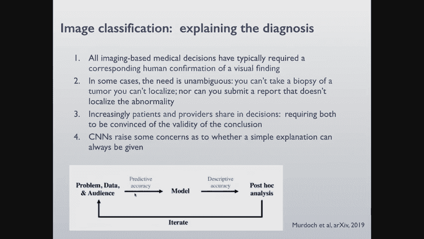

## 数据获取与挑战

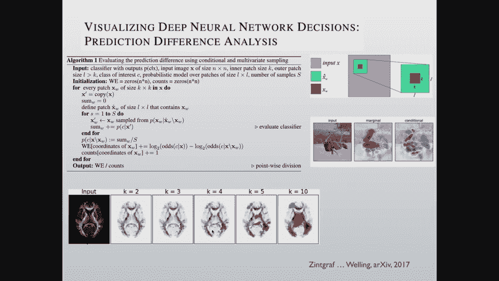

医学成像数据通常以DICOM（医学数字成像和通信）标准存储，包含图像数据和元数据头文件。虽然有Python库可以处理这些数据，但获取大规模数据集用于机器学习非常困难。

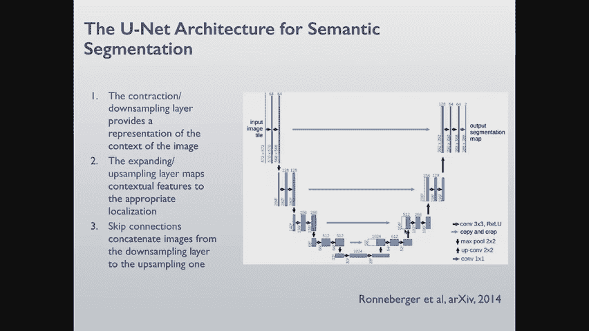

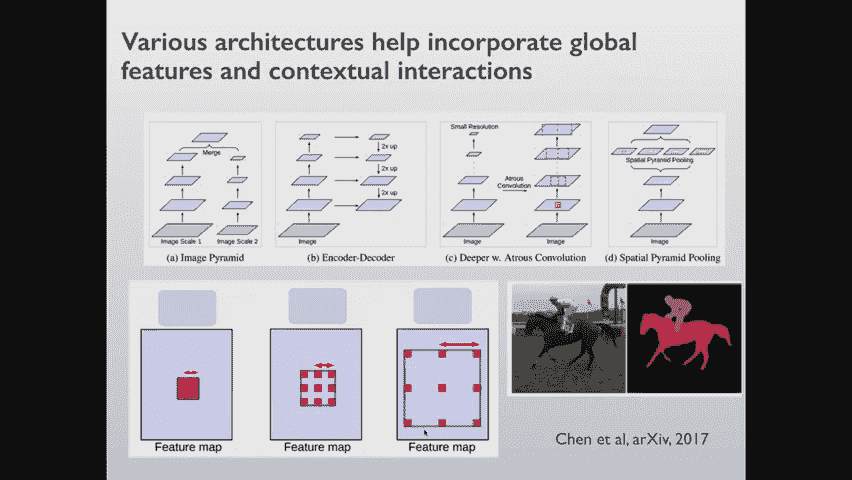

挑战主要来自以下几个方面：

*   **临床系统设计**：医院系统为临床操作而设，并非为方便大数据提取而设计。
*   **隐私与信息**：图像常嵌入患者姓名、出生日期等可识别信息，去除困难。
*   **供应商锁定**：供应商可能使数据导出变得困难，以防止用户更换系统。
*   **数据关联**：成像数据与临床标签（如疾病诊断）通常分开存储，需要复杂的关联工作。
*   **数据规模**：即使在大中心，特定模态的数据量也可能有限（例如，PET扫描约8000例，超声心动图约30-50万例）。
*   **心脏与呼吸运动**：心脏持续运动，一些成像技术时间分辨率不足，导致图像模糊，常需使用心电门控等技术对齐不同心跳周期的图像。

## 计算机视觉在心脏成像中的应用

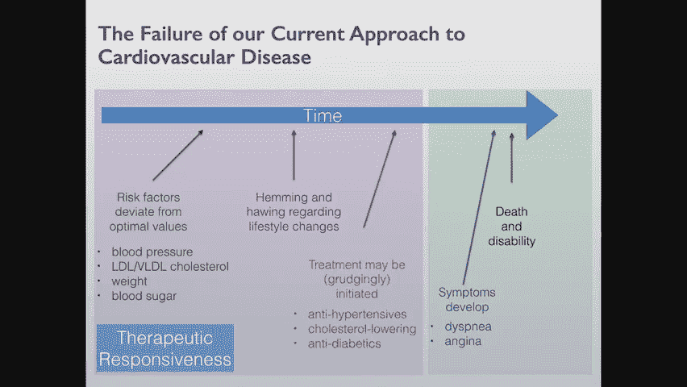

上一节我们介绍了心脏成像的数据基础，本节中我们来看看计算机视觉技术如何应用于这些数据。临床图像解读涉及大量手工测量和视觉诊断，自动化潜力巨大。我们主要关注三个领域：图像分类、语义分割和图像配准。

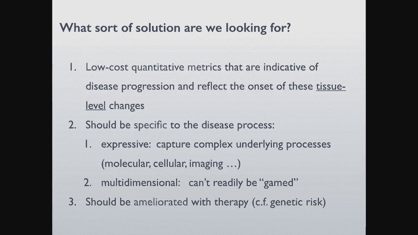

### 图像分类

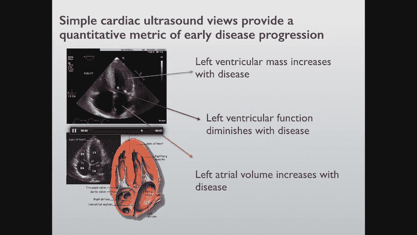

图像分类任务是为图像分配标签（例如，诊断某种疾病）。在卷积神经网络出现之前，医学图像分类领域进展有限。尽管自动化分类可能提高效率，但其临床整合面临挑战：

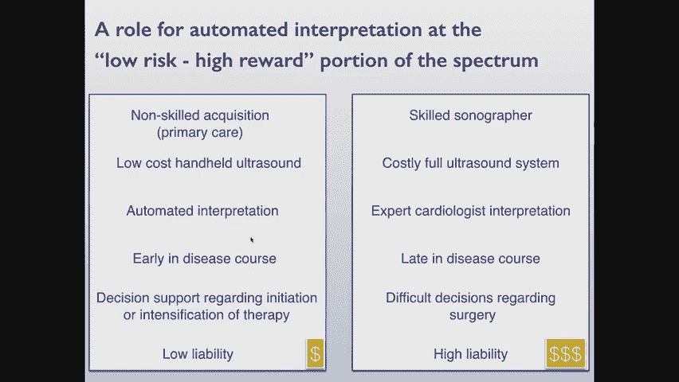

*   **责任归属**：放射科医生是医疗责任的主要承担者，不愿将诊断任务完全移交。
*   **临床应用场景**：自动化系统可能更适合分诊（对急诊检查进行优先级排序）或资源匮乏环境下的辅助诊断。
*   **解释性需求**：医学决策需要可视化证据和共同决策，仅提供分类标签往往不够。

为了提供解释性，研究者尝试了多种方法，例如通过梯度计算或遮挡技术来可视化驱动分类决策的图像区域。然而，生成令临床医生和患者满意的解释仍是一个难题。

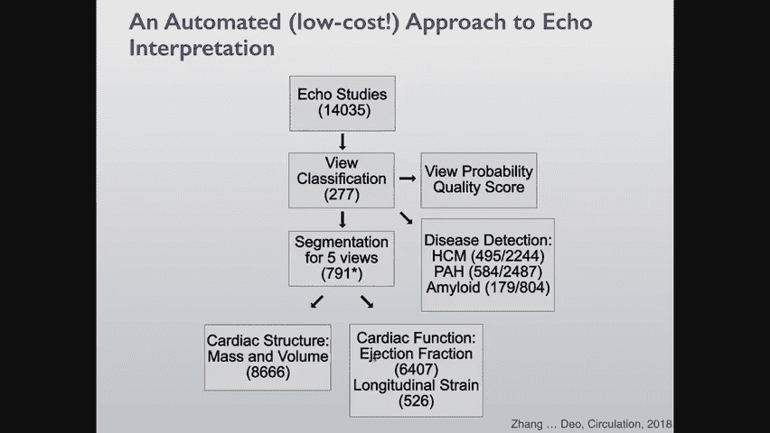

### 语义分割

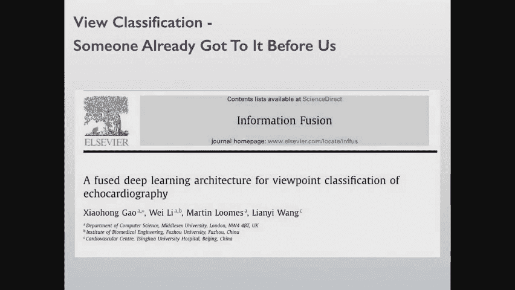

语义分割任务是将图像中的每个像素分配给特定的类别标签（例如，区分左心室、左心房等结构）。在临床实践中，医生需要手动勾画心脏结构来测量面积、体积等指标，这是一个繁琐的过程。

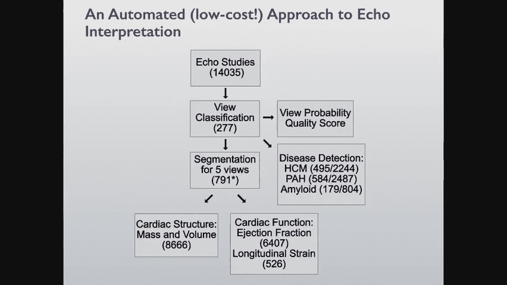

U-Net架构因其编码-解码结构和跳跃连接在医学图像分割中非常流行。然而，像素级分类有时会产生不符合解剖常识的错误（例如，出现孤立的“小卫星”心室区域）。解决这一问题可能需要引入更大的感受野（如使用空洞卷积）或结合全局上下文信息。

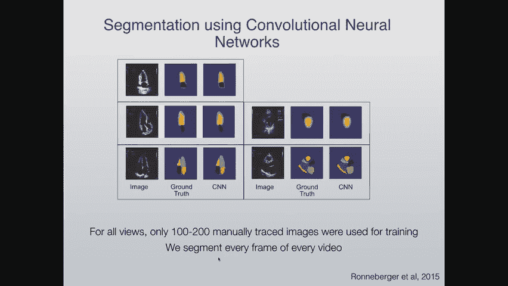

### 图像配准

图像配准是将不同时间、不同模态或不同心跳周期获取的图像对齐到同一坐标系的过程。这对于融合多模态信息（如PET与CT）或分析动态心脏功能至关重要。传统方法使用优化算法，现代方法则开始探索使用条件变分自编码器等深度学习模型来学习几何变换。

## 自动化超声心动图分析流程

我们开发了一个旨在全自动化处理超声心动图原始数据的流程。目标是从机器输出的原始研究开始，自动完成以下所有步骤：

1.  对不同切面视图进行分类。
2.  进行图像质量评分。
3.  分割五个主要视图中的心脏结构。
4.  直接检测特定疾病。
5.  计算所有标准的定量测量值（如射血分数、心室容积）。

我们使用改进的U-Net架构进行分割，并对偏离中心区域的预测施加惩罚，以减少错误。与传统方法（医生仅手动追踪2帧图像）相比，我们的算法可以处理每个心脏周期的每一帧，提供了更丰富的数据。

评估模型性能面临“金标准”难题。我们通过Bland-Altman图等方法与人工测量对比，发现当出现较大偏差时，往往是人工测量出错。我们还通过寻找心脏结构间已知的生理相关性（如心肌增厚与左心房增大相关）来间接验证自动化测量的合理性。

## 疾病直接检测与未来展望

除了测量，我们还构建了模型直接检测特定疾病：

*   **肥厚型心肌病**：心肌异常增厚，是年轻运动员猝死的主要原因之一。
*   **心脏淀粉样变**：一种现在有药可治的疾病，但漏诊率高。
*   **二尖瓣脱垂**：瓣叶在收缩期向左心房脱垂。

对于二尖瓣脱垂，我们通过分析整个视频并自动确定心脏周期时相，专注于脱垂发生的特定阶段进行分类，取得了良好效果。

展望未来，机器学习在心血管医学中的应用可能朝以下方向发展：

*   **常规测量自动化**：这已在进行中，并将成为标准。
*   **床旁快速诊断**：在紧急情况下（如评估心功能或心包积液）实现快速自动化分析。
*   **降低技能门槛**：通过结合视图分类、质量评估和自动化解读，使初级保健医生能使用手持设备进行心脏超声检查。
*   **疾病监测与亚型分类**：利用自动化流程获取更大规模、更频繁的序列数据，用于监测疾病进展、治疗反应和发现新的疾病亚型。

## 从成像到生物学：一个“勇敢的想法”

我们之前讨论的重点是成像，但生物学呢？我们如何在那里获得见解？冠心病（CAD）的研究面临独特挑战：无法对病变血管进行安全活检，组学检测成本高昂，疾病发展周期长，且现有大数据研究缺乏丰富的生物学表型数据。

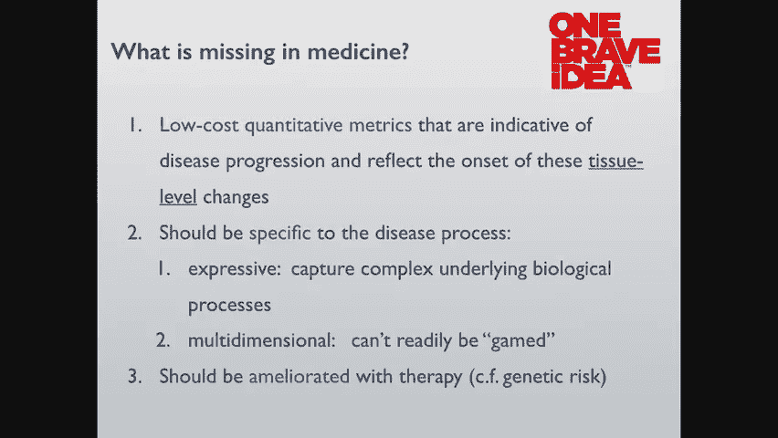

为此，我们启动了一个新项目，专注于循环血细胞。选择它们的理由很充分：它们参与动脉粥样硬化过程，易于获取，且包含丰富的细胞类型信息。我们采用计算机视觉方法分析血涂片图像，使用荧光染料标记不同细胞器，从而低成本地大幅扩展细胞表型空间。我们还可以引入各种扰动来揭示潜在的细胞特征。

这种方法成本低、可重复、表达力强，并且有望对治疗产生反应。我们计划每月收集数千名患者的样本，达到深度学习所需的规模。同时，我们关联这些患者的电子病历、心电图、基因组学等数据，希望用这种低成本的“表达型”检测桥接现有的成像和临床数据，最终推动对冠心病生物学机制的更深理解和更早干预。

## 总结

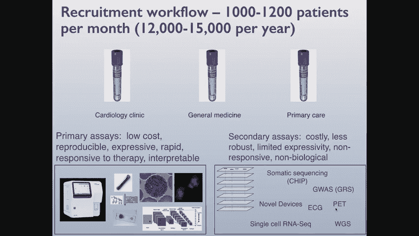

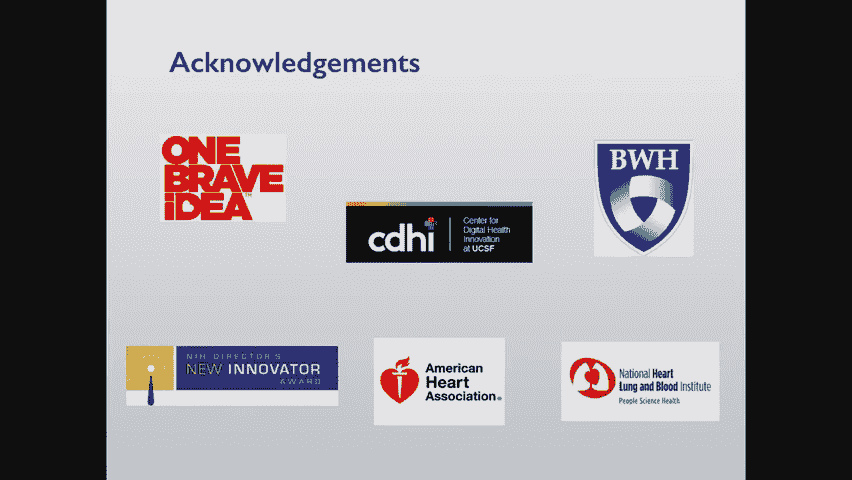

本节课我们一起学习了机器学习在心血管医学中的应用。我们从心脏的基础知识出发，了解了临床诊断的现状与挑战，深入探讨了图像分类、分割和配准等计算机视觉任务如何应用于心脏超声等影像。我们看到了全自动化分析流程的潜力与评估难题，也探讨了直接进行疾病检测的模型。最后，我们展望了未来在降低检查门槛、实现疾病监测以及转向更本质的生物学研究方面的广阔前景。将技术创新与临床实际需求结合，是推动该领域发展的关键。