# 11：鉴别诊断 🩺

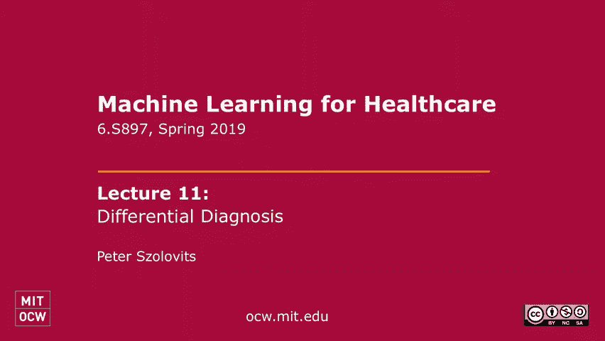

在本节课中，我们将学习医学诊断推理的核心概念与历史发展。我们将从简单的流程图方法开始，逐步探讨概率模型、决策分析以及现代机器学习方法在鉴别诊断中的应用。

## 概述

诊断是对某一现象的性质和原因的鉴定。鉴别诊断则是对某一特定疾病或状况的鉴别，需要将其与其他表现出类似临床特征的疾病区分开来。当医生面对病人时，他们通常会列出病人可能有的问题，并通过一个过程试图找出确切的原因。本节课将重点讨论这些诊断推理的模型和方法。

## 诊断推理的早期模型

上一节我们介绍了诊断的基本概念，本节中我们来看看历史上一些早期的、更简单的诊断推理模型。

### 流程图与分诊工具

在缺乏复杂计算模型的年代，人们使用流程图来辅助诊断。例如，在1973年，麻省理工学院健康中心针对女性尿路感染投诉，使用了一张颜色编码的流程表。护士会根据病人的回答勾选一系列选项，最终根据流程图的分支逻辑给出建议：立即送医、次日复诊或自行服药缓解。

这种方法本质上是一个分诊工具，用于判断问题的紧急程度。其优势在于规则明确、易于操作。然而，这类方法通常非常具体、脆弱，需要大量努力来建立共识，且不一定能长期有效。

### “穿孔卡片”诊断法

另一种有趣的早期设想是“穿孔卡片”诊断法。每张卡片代表一种疾病，卡片边缘的孔洞代表不同的症状（如呼吸急促、左脚踝疼痛）。诊断时，将针穿过代表病人症状的孔洞，摇晃卡片堆，符合该症状的疾病卡片便会掉落。

这种方法的一个明显缺陷是，当病人有多种症状时，可能没有卡片能同时匹配所有条件，导致诊断失败。尽管后来有人尝试在计算机上实现类似逻辑，但其根本局限性使其未能成为主流。

## 概率模型在诊断中的应用

上一节我们看了一些基于规则的方法，本节中我们来看看如何将概率论，特别是贝叶斯定理，应用于诊断推理。

### 朴素贝叶斯模型

一个更复杂的模型是朴素贝叶斯模型。该模型假设病人一次只患一种疾病（即疾病状态是互斥且完备的），并且各种临床表现（症状、体征）在给定疾病条件下是相互独立的。

基于这些假设，我们可以应用贝叶斯规则。贝叶斯规则的基本形式是：在观察到某些证据（症状）后，更新我们对假设（疾病）成立可能性的信念。

公式表示为：
`P(Disease | Symptoms) ∝ P(Symptoms | Disease) * P(Disease)`
其中 `P(Disease)` 是先验概率，`P(Symptoms | Disease)` 是似然。

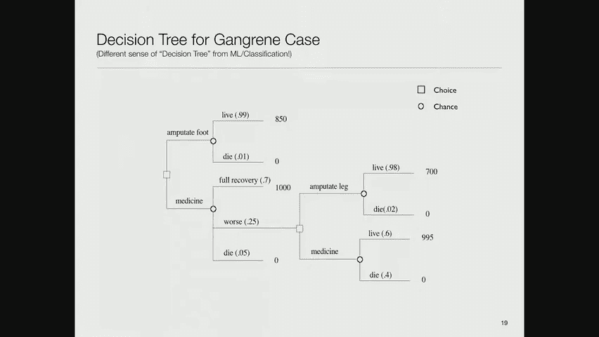

### 似然比与对数赔率

医学界在实践中常使用似然比（Likelihood Ratio, LR）和对数赔率来简化计算，避免直接进行概率乘法。

*   **似然比（LR）**：`LR = P(Symptom | Disease) / P(Symptom | No Disease)`
*   **后验赔率** = **先验赔率** × **似然比1** × **似然比2** × ...

由于乘法计算不便，常取对数将其转化为加法：
`log(后验赔率) = log(先验赔率) + log(LR1) + log(LR2) + ...`

许多临床评分系统（如格拉斯哥昏迷评分）本质上就是在对数尺度上累加不同条件的贡献。

### 评估诊断测试：ROC曲线

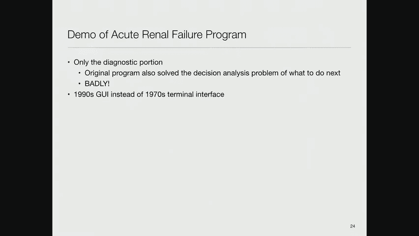

在讨论概率模型时，我们需要工具来评估诊断测试的效能。接收者操作特征曲线（ROC曲线）就是这样一个工具。

ROC曲线描绘了在不同判定阈值下，诊断测试的**真阳性率（敏感性）**与**假阳性率（1-特异性）**之间的关系。曲线下面积（AUC）用于量化测试的整体区分能力：AUC=0.5表示没有区分力（如同抛硬币），AUC越接近1表示区分能力越好。

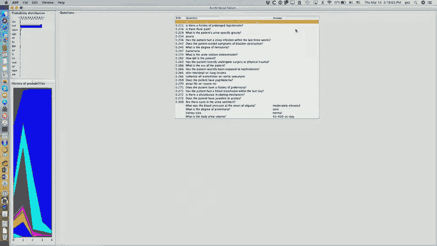

## 决策分析与理性选择

上一节我们介绍了如何用概率描述不确定性，本节中我们来看看如何在不确定条件下做出理性的治疗决策。

### 期望效用理论

理性决策的原则是：以最大化期望效用的方式行事。在医疗决策中，每个行动（如治疗与否）都有其成本、风险和潜在收益（效用）。效用可以用生存率、生活质量（如质量调整寿命年）、医疗费用等来衡量。

### 临床决策树实例

考虑一位老年患者足部坏疽的案例。决策选项包括：立即截肢，或先尝试药物治疗。药物治疗可能成功，也可能失败；若失败，则可能面临更高位的截肢或死亡风险。

通过构建决策树，我们可以为每个机会节点（代表不确定结果）计算期望效用，并通过“回滚”决策树来比较不同初始决策的期望效用，从而选择期望效用最高的方案。

然而，这种分析的挑战在于概率和效用值的估计往往不稳定。因此，进行敏感性分析至关重要，即观察当关键参数（如患者对截肢后生活的效用评估）变化时，最优决策是否改变。

## 交互式诊断程序的发展

上一节我们看到了如何为单一决策建模，本节中我们来看看如何构建能主动询问信息以缩小诊断范围的交互式系统。

### 急性少尿症诊断程序

一个早期的典范是1967年开发的急性少尿症（肾功能衰竭）诊断程序。该系统将问题分为两类：廉价的初步问题（如血压、尿液检查）和昂贵/有创的确认性检查。

其核心算法是**信息增益最大化**。系统持续计算当前疾病概率分布的熵，并选择能最大程度降低期望熵的问题进行提问。这能高效地聚焦于最可能的疾病集合。

当某个疾病的概率超过阈值（如95%）时，系统会切换到决策分析模式，评估是否进行有创检查及选择何种治疗方案。

### INTERNIST-I / QMR 系统

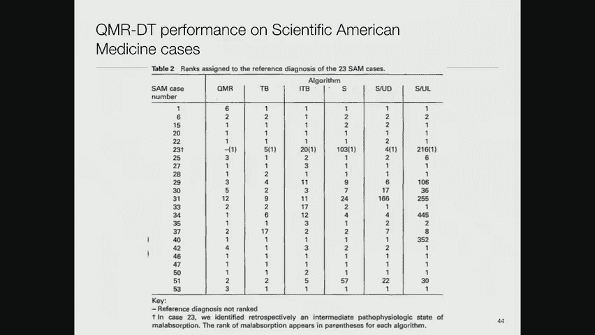

一个更宏大的项目是INTERNIST-I及其后继者QMR（快速医学参考）系统。它包含了约500-750种疾病和3500-5500种临床表现。每种疾病与一系列表现关联，并附有两个经验性评估值：
*   **唤起强度（Evoking Strength）**：0-5分，表示该表现对该疾病的提示强度。
*   **频率（Frequency）**：1-5分，表示该疾病患者出现该表现的普遍程度。

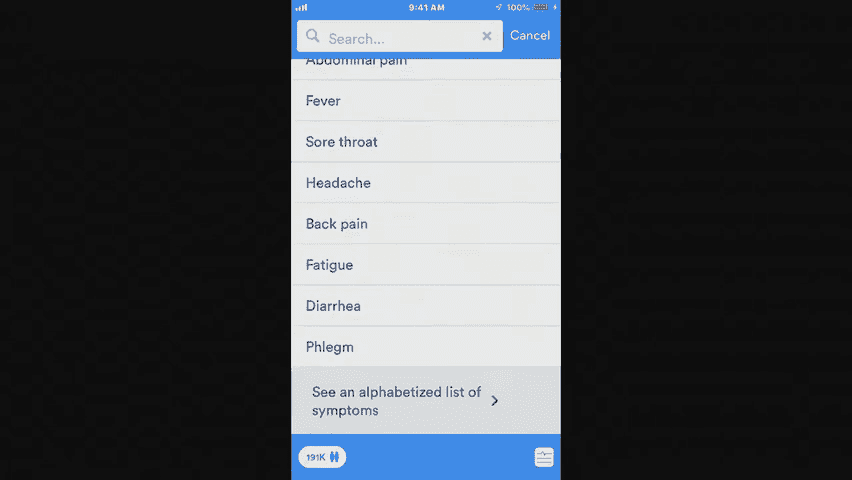

诊断时，系统根据输入的表现计算每种疾病的分数，形成“鉴别诊断”列表。它采用启发式策略管理提问：
*   **聚焦策略**：当某个假设得分很高时，询问该疾病强烈预测的表现以确认它。
*   **排除策略**：当鉴别诊断列表很长时，询问能排除多个竞争假设的表现。

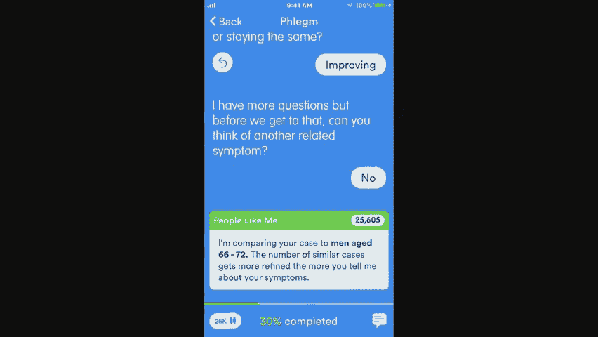

尽管早期评估显示其诊断准确性未达顶尖，但它作为交互式知识库和诊断辅助工具，为医生提供了有价值的参考。

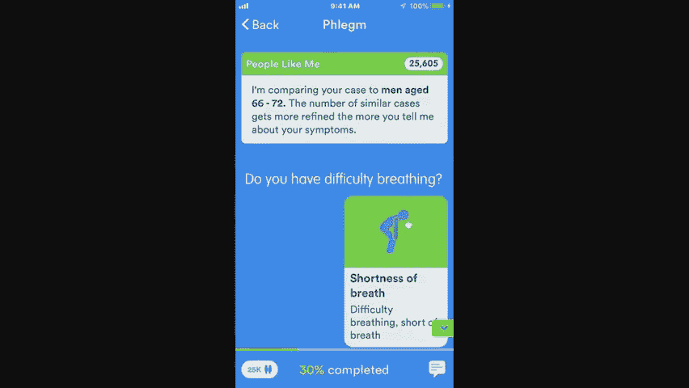

## 现代方法与挑战

上一节我们回顾了基于规则和概率的经典系统，本节中我们来看看现代机器学习方法如何改变诊断推理，以及面临的新挑战。

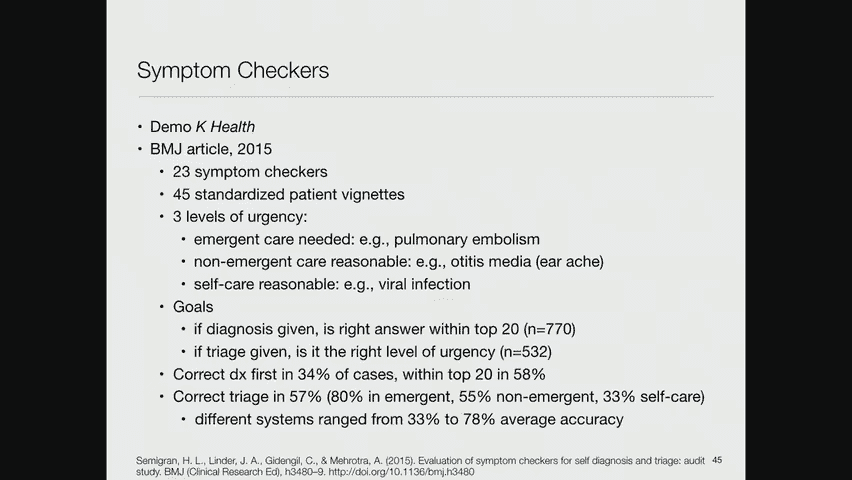

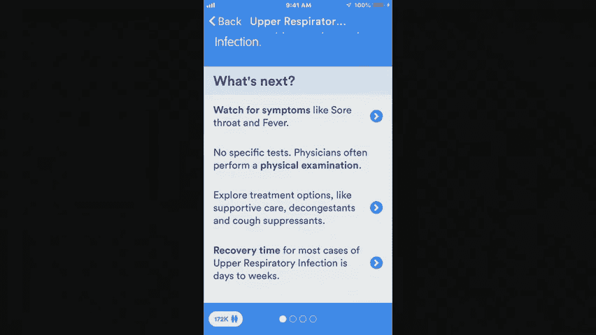

### 从贝叶斯网络到症状检查器

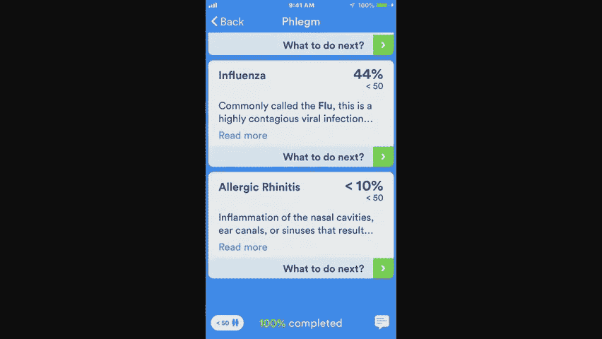

随着贝叶斯网络技术的发展，研究者将QMR等系统的知识库重新表述为贝叶斯网络，利用“因果独立性”等假设进行更严格、更快速的概率推理，取得了不错的效果。

如今，基于类似原理的“症状检查器”应用程序已十分普及。它们通过交互式提问，利用算法优化问题序列，试图为用户提供可能的诊断和分诊建议（如自我护理、看医生或去急诊）。

### 有限理性与元层次推理

在实际临床中，决策常受时间、资源限制。**有限理性**理论指出，人们并非总是进行完全理性的计算，而是依赖启发式和快速直觉。

**元层次推理**关注“应该进行多少推理”以及“采用哪种推理策略”本身。例如，在时间紧迫的重症监护场景，是否应立即给呼吸困难的病人上呼吸机？一个快速的行动可能救命，但也可能带来严重感染风险。建模时需要同时考虑治疗行动的效用和计算/延迟本身的成本。

### 强化学习新视角

最近的研究将诊断过程重新表述为一个**强化学习**问题。
*   **状态**：当前已确认和排除的临床表现集合。
*   **动作**：询问一个特定表现，或给出一个最终诊断。
*   **奖励**：给出正确诊断获得正奖励，错误诊断获得负奖励，并且鼓励用更少的问题得到诊断。

先进的模型（如名为“Mango”的系统）结合了深度Q网络和**奖励塑造**（例如，对可能得到肯定回答的提问给予额外奖励），以及**特征重构**（共同训练模型以预测未问及的表现），在模拟数据上展现了高效的学习和诊断性能。

然而，这些模型大多仍在模拟或有限数据上进行测试，将其应用于真实、复杂的临床环境并验证其安全性与有效性，是当前的重要挑战。

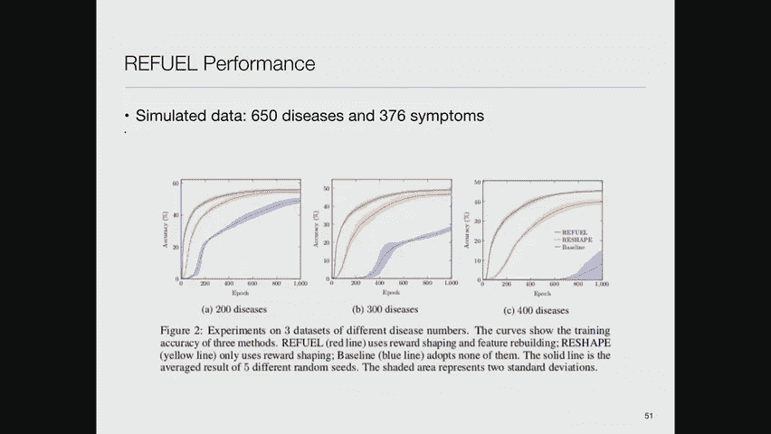

## 总结

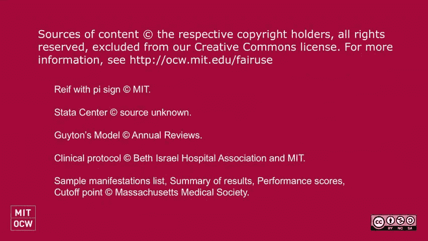

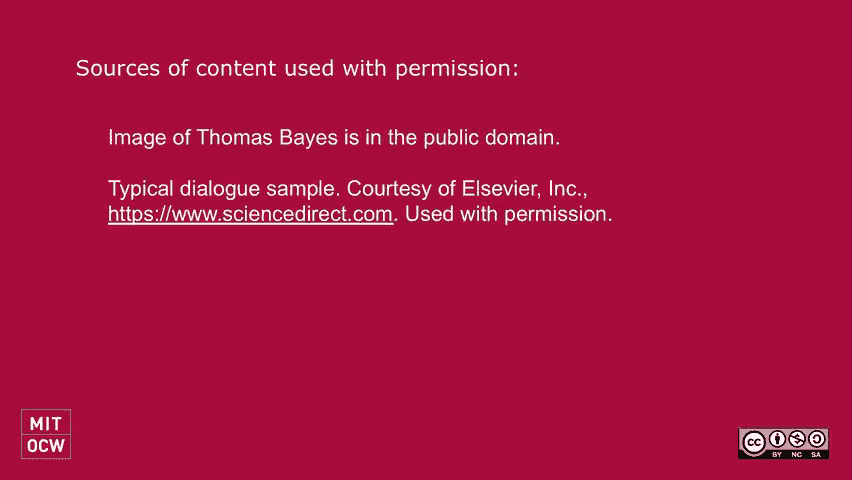

本节课我们一起学习了医学鉴别诊断推理的演进历程。我们从基于流程图的简单规则系统开始，探讨了朴素贝叶斯概率模型和决策分析在量化诊断与治疗选择中的应用。随后，我们深入了解了INTERNIST-I/QMR等大型交互式诊断系统的设计与启发式策略。最后，我们展望了现代机器学习方法，特别是强化学习，为构建更自适应、更高效的诊断助手带来的新机遇与挑战。诊断推理的核心，始终是在不确定性中，整合信息，权衡利弊，为患者寻求最优的医疗决策路径。