# 12：机器学习在病理学中的应用 🧬🔬

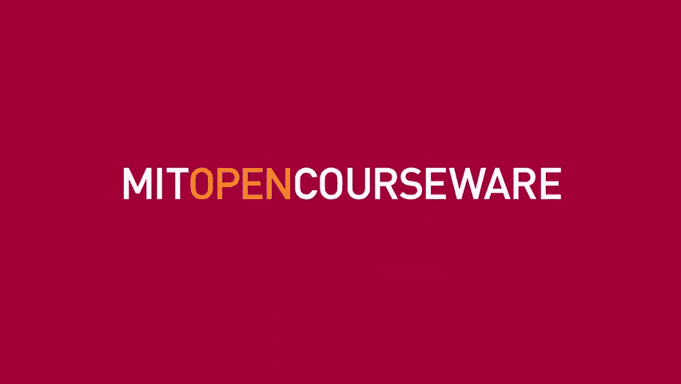

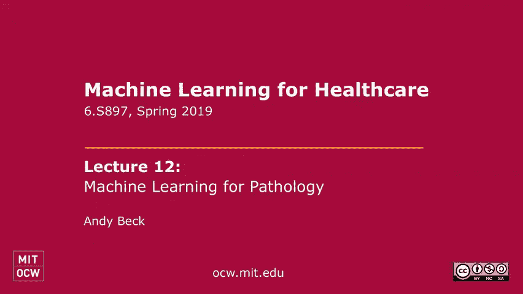

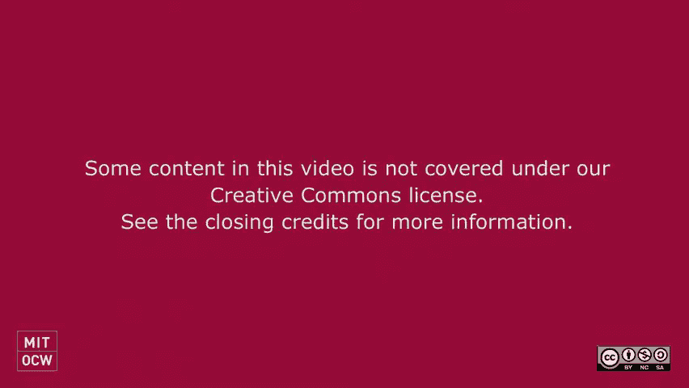

在本节课中，我们将学习机器学习，特别是深度学习，如何应用于病理学领域。我们将探讨其核心任务、面临的挑战、具体应用案例以及未来的发展方向。

---

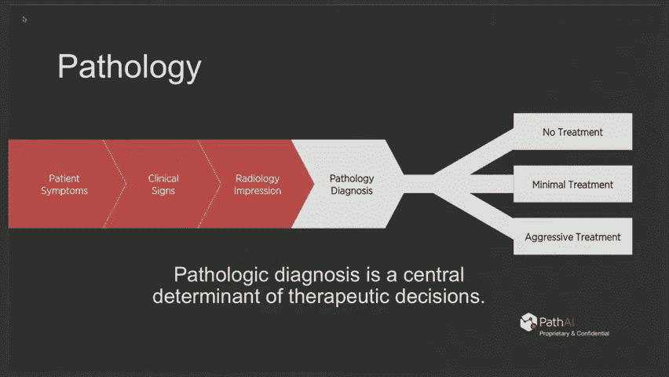

## 什么是病理学？🧫

上一节我们介绍了课程概述，本节中我们来看看病理学的定义及其在医疗决策中的核心作用。

病理学是医学的一个分支，专注于通过检查组织样本来诊断疾病。当患者就诊时，医生会收集各种数据。如果担心存在结构性病变（如癌症），通常会进行组织活检。病理学报告对于后续的治疗决策（如手术、化疗）至关重要。

病理学是高度视觉化的学科。病理学家观察染色的组织切片，分析细胞形态、组织结构等，以区分正常组织与疾病，并确定疾病亚型。此外，特殊染色可用于检测特定病原体或蛋白质表达，进一步增加了诊断的复杂性。

---

## 历史与挑战：为何需要机器学习？📜

上一节我们了解了病理学的基本概念，本节中我们来看看该领域的历史挑战以及引入机器学习的原因。

将人工智能或机器学习应用于病理学并非新鲜事，相关研究已有四十多年历史。早期研究试图通过测量细胞大小等简单特征（形态测定）来识别癌细胞。然而，这些方法基于小数据集和简单模型，难以规模化。

病理学实践面临的核心挑战是观察者间和观察者内的变异性。研究表明，不同病理学家对同一病例的诊断一致性可能很低，甚至同一位病理学家在间隔一段时间后也可能做出不同判断。这种不一致性可能导致重大的临床决策错误。

因此，需要一种计算方法来实现**详尽、定量、高效**的分析，减少人为错误，提高诊断的标准化和准确性。

---

## 机器学习在病理学中的优势 🚀

上一节我们看到了传统病理学的局限性，本节中我们来看看机器学习方法带来的独特优势。

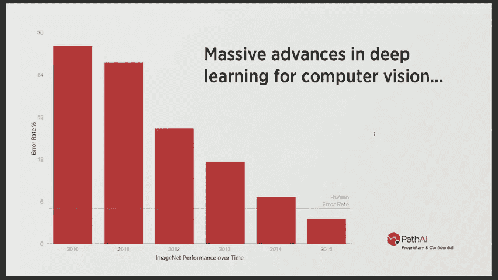

以下是机器学习应用于病理学图像分析的几个关键优势：

*   **详尽分析**：计算机可以分析整张切片上的每一个细胞，而人类受限于时间和精力，只能抽样观察。
*   **定量精准**：计算机能精确计算细胞数量、比例等，提供客观的量化数据。
*   **高效并行**：分析过程可以大规模并行化，显著提升效率。
*   **新见解发现**：通过数据驱动的方式，机器学习可以发现人类未曾注意到的、与预后或治疗反应相关的新的图像特征模式。

机器学习并不会取代病理学家，而是像航空领域的自动驾驶系统一样，改变他们的工作方式。未来的病理学家可能更像整合多源数据（包括AI输出）的顾问医生。

---

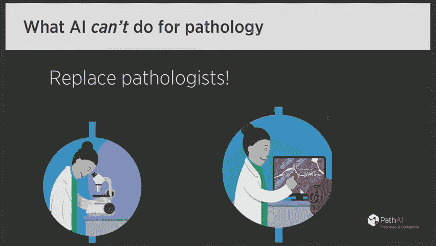

## 核心方法与技术 💻

上一节我们探讨了机器学习的优势，本节中我们深入了解一下其核心方法与技术流程。

病理学的核心任务之一是图像分析。现代方法主要使用**深度卷积神经网络**来处理这些巨大的数字病理图像（通常为千兆像素级）。由于无法将整张图像直接输入网络，标准流程是：

1.  **图像分块**：将整张切片图像分割成数百万个小补丁（Patch）。
2.  **模型训练与推理**：将每个补丁输入CNN模型进行分类（例如，判断是否为肿瘤细胞）。
3.  **结果整合与可视化**：将所有补丁的预测结果整合，并在原图上生成热图，直观显示关注区域。

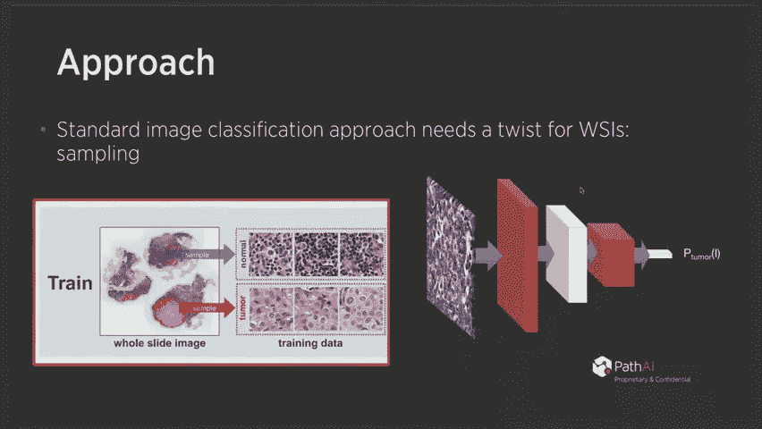

**代码示例：简化的图像分块逻辑**
```python
# 伪代码示例：将大图像分割成重叠或非重叠的补丁
def extract_patches(whole_slide_image, patch_size=256, stride=256):
    patches = []
    height, width = whole_slide_image.shape[:2]
    for y in range(0, height - patch_size + 1, stride):
        for x in range(0, width - patch_size + 1, stride):
            patch = whole_slide_image[y:y+patch_size, x:x+patch_size]
            patches.append(patch)
    return patches
```

一个关键的优化点是**采样策略**。在训练时，并非所有补丁都同等重要。采用智能采样（例如，针对模型当前易出错的区域进行过采样）可以显著提升模型性能和泛化能力。

---

## 应用案例一：乳腺癌淋巴结转移检测 🎯

上一节我们介绍了核心技术流程，本节中我们来看一个具体的成功应用案例。

检测乳腺癌是否转移到淋巴结是一项重要但耗时且容易出错的任务。CAMELYON16挑战赛提供了约300张训练切片和130张测试切片，要求参赛系统自动检测淋巴结切片中的转移灶。

参赛团队采用的方法正是上述的分块+CNN分类流程。最终，最好的全自动系统错误率低于**1%**，显著优于病理学家在时间受限的临床环境中的表现（错误率更高，尤其是假阴性）。

在实际应用中，AI系统可以生成热图，高亮显示最可疑的转移区域，引导病理学家重点关注，从而**将病理学家的错误率降低85%**。这不仅能提高诊断准确性，还能将病理学家从繁琐的测量、计数工作中解放出来，使其专注于更高层次的诊断决策和报告整合。

---

## 应用案例二：精准免疫治疗预测 🧪

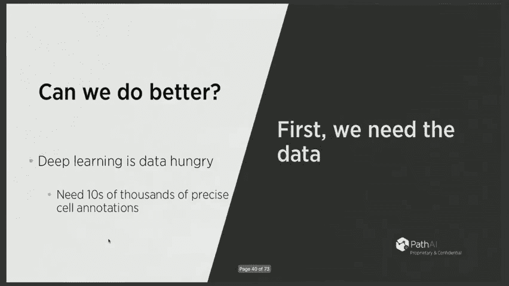

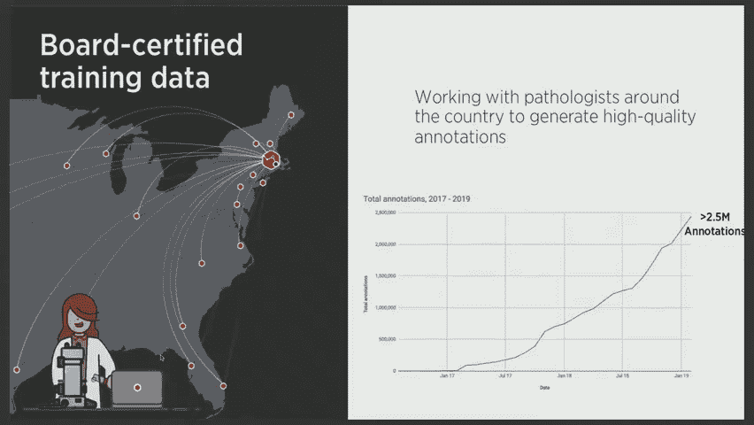

上一节我们看到了AI在检测任务中的价值，本节中我们探索一个更前沿的预测性应用。

免疫疗法通过抑制PD-1/PD-L1等信号通路来激活患者自身的免疫系统攻击癌细胞。确定哪些患者可能受益的关键生物标志物之一是肿瘤细胞或免疫细胞是否表达PD-L1蛋白。

然而，病理学家在人工评分PD-L1表达时的一致性很低（观察者间一致性可低至**8.6%**）。Path AI等公司开发了系统，能够：
1.  识别组织区域（癌上皮、间质等）。
2.  对每个细胞进行分类（癌细胞、淋巴细胞等）。
3.  定量计算表达PD-L1蛋白的细胞比例。

这为患者分层提供了更精确、可重复的依据。更进一步，研究正在探索直接从常规H&E染色图像中，通过深度学习提取特征，预测患者对免疫治疗的反应，从而发现新的预测性生物标志物。

---

## 多模态数据整合 🧬🔗

上一节我们专注于图像分析，本节中我们来看看如何将病理图像与其他数据类型整合。

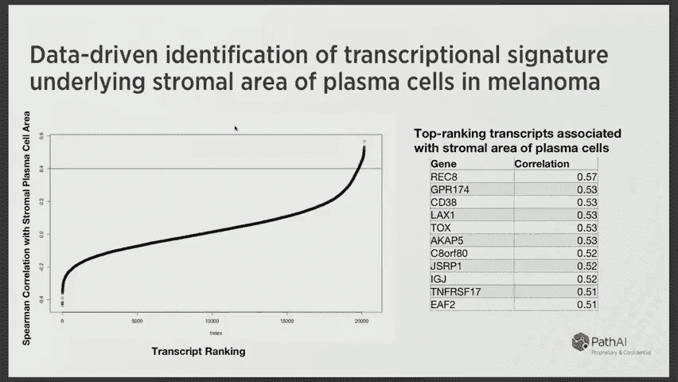

病理图像反映的是组织和细胞的**形态表型**，而基因组、转录组等数据揭示的是底层的**分子机制**。将两者结合可以产生更强大的洞察。

例如，在黑色素瘤研究中，可以从病理图像中提取数百个定量特征，并找出其中与患者生存率最相关的特征子集。随后，可以分析这些图像特征与全基因组基因表达的相关性，从而发现与之关联的关键基因通路。这些通路可能是新的药物靶点或诊断标志物。

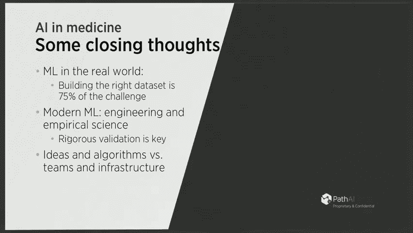

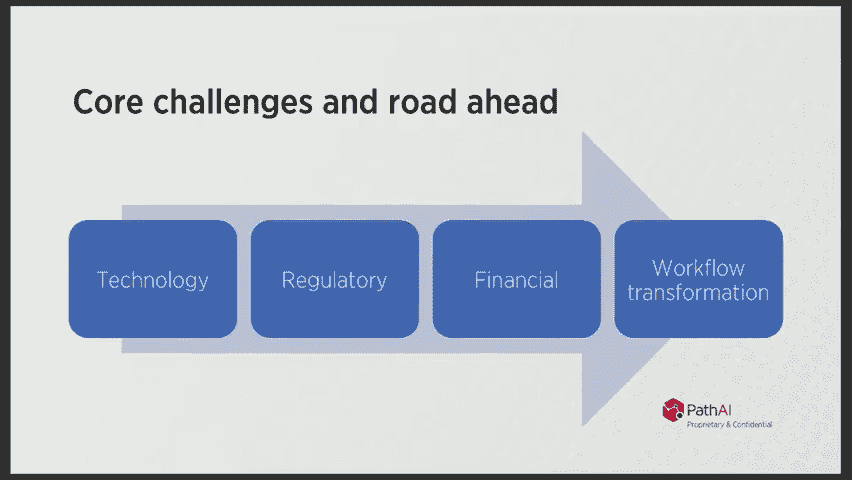

这种**“图像表型 -> 临床结局 -> 分子特征”** 的集成分析方法是可扩展的，能够系统性地发现新的生物学关联。

---

## 总结与未来展望 🌟

本节课中我们一起学习了机器学习在病理学中的应用全景。

**总结要点如下：**
*   **需求驱动**：病理学诊断存在变异性，需要更标准化、定量化的方法。
*   **技术成熟**：深度卷积神经网络（CNN）非常适合处理高分辨率的病理图像，通过分块策略解决图像过大的问题。
*   **价值显著**：AI在具体任务（如转移灶检测、生物标志物定量）上已展现出超越人类专家的准确性和一致性，并能与病理学家协同工作，提升整体诊断质量。
*   **未来方向**：未来的发展在于构建高质量、大规模的训练数据集，开发更鲁棒的模型，并将其与基因组学等多模态数据整合，最终实现从诊断到精准治疗预测的闭环。

将AI应用于病理学视觉任务已取得惊人进展，这得益于**数字数据的普及、大规模计算资源的可用性以及深度学习算法的突破**。我们正处在将这些工具引入常规临床实践的前夜，它们有望深刻改变病理学的工作流程，最终造福患者。


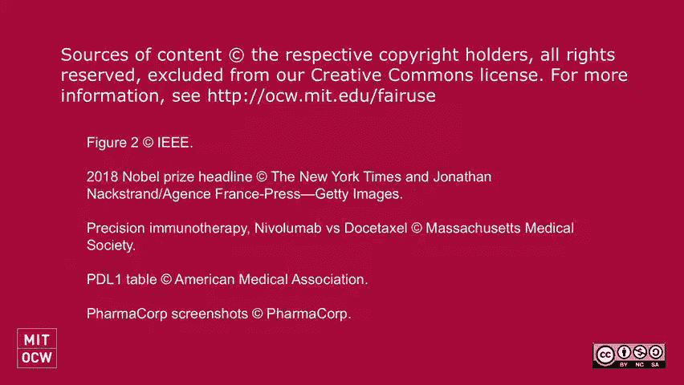

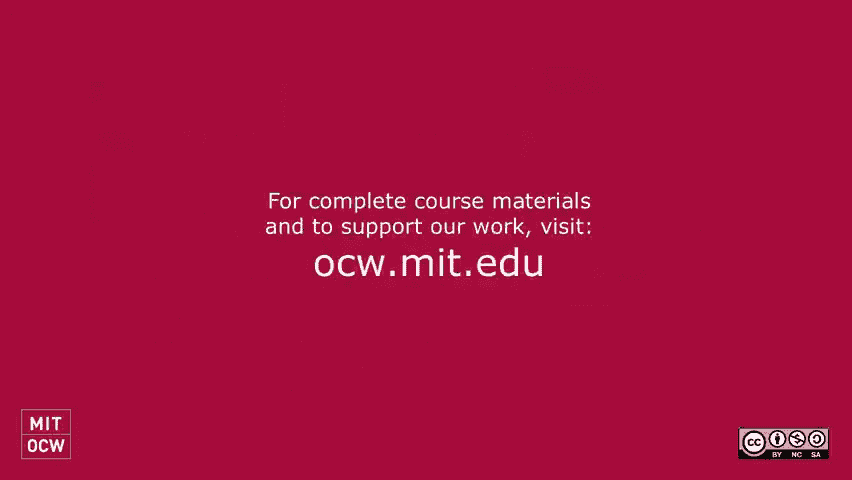

---
*注：本教程根据公开讲座内容整理，旨在教育分享。临床应用需经过严格的验证和监管审批。*