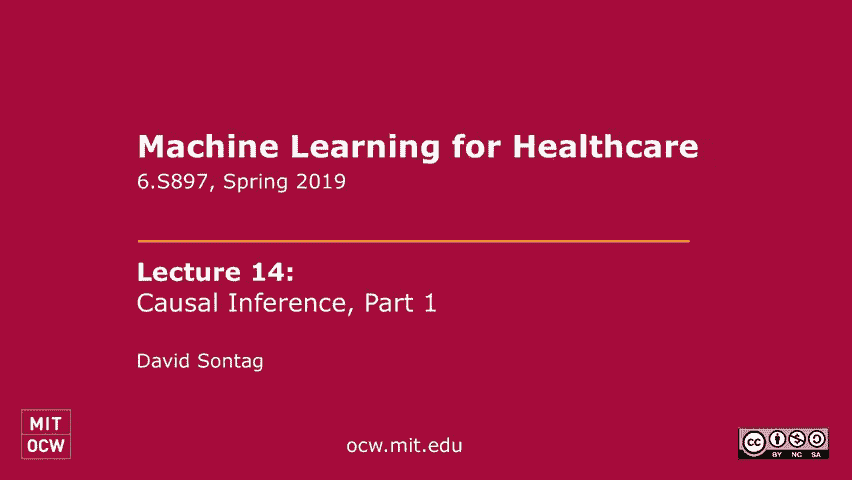
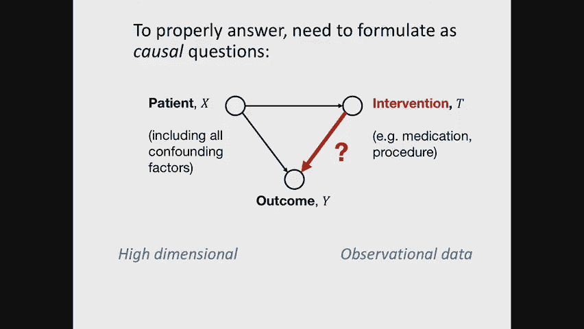
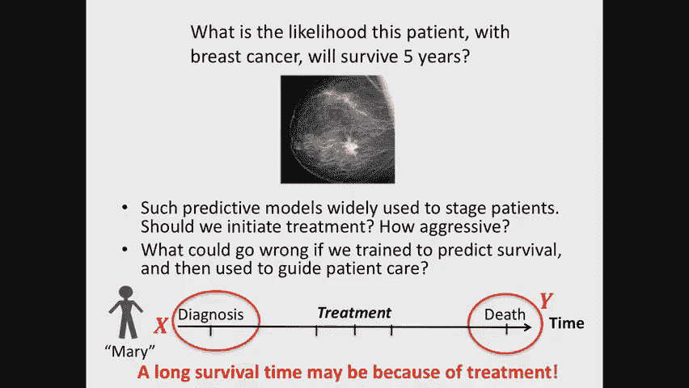
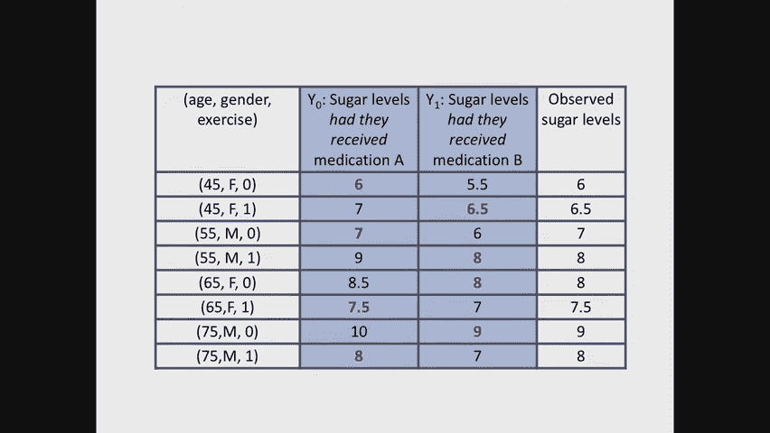
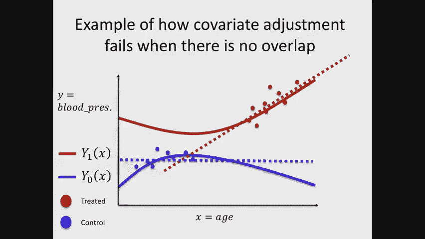

# 14：第一部分 - 因果推断基础 🧠

在本节课中，我们将要学习因果推断的基本概念。我们将探讨为什么在医疗保健等领域，仅仅依靠相关性进行预测是不够的，以及如何从观测数据中回答因果问题。我们将介绍潜在结果框架、关键假设，并学习一种基础的因果效应估计方法——协变量调整。

---

## 概述：从预测到因果

到目前为止，我们讨论的都是纯粹的预测性问题。对于预测，相关性可能就足够了。我们利用数据中的模式来预测结果，而不关心因果方向。

然而，在许多实际场景中，我们真正关心的是因果问题。例如，在医疗保健中，我们不仅想预测谁会患糖尿病，更想知道如何**预防**糖尿病。这涉及到干预的效果，是一个因果问题。

如果我们错误地将预测模型用于指导干预，可能会造成严重后果。例如，一个模型可能预测某类患者存活时间长，但这是因为他们在数据中接受了有效治疗。如果新患者未接受治疗，基于模型的预测就会完全错误。

因此，我们需要一套数学语言和工具来严谨地思考并回答因果问题。

---

## 因果推断的基本设定

与传统的机器学习（输入X，输出Y）不同，因果推断需要考虑三个量：
*   **X**： 个体在干预前的协变量（如年龄、病史、图像数据）。
*   **T**： 干预或处理（如给予哪种药物，剂量多少）。为简化，我们常假设T是二元的（例如，治疗A vs 治疗B）。
*   **Y**： 结果（如血压、生存时间）。

我们通常假设已知因果图的方向：X影响T，X和T共同影响Y。我们的目标是量化T对Y的**因果效应**，而不仅仅是关联。

> **注意**： 本周我们讨论的是**静态处理策略**，即基于基线信息X做出一次治疗决策T，然后观察结果Y。下周我们将讨论更复杂的动态策略。

---

## 潜在结果与因果问题

为了形式化因果效应，我们引入**潜在结果**的概念：
*   **Y(1)**： 如果个体接受处理（T=1）时会发生的结果。
*   **Y(0)**： 如果个体接受对照（T=0）时会发生的结果。

对于任何一个个体，我们只能观察到其中一个潜在结果（事实结果），另一个是**反事实结果**（未被观察到）。这就是**因果推断的根本问题**。

我们关心的核心量是：
*   **条件平均处理效应**： 对于具有特定特征X=x的个体，处理与对照的期望结果之差。
    `CATE(x) = E[Y(1) - Y(0) | X=x]`
*   **平均处理效应**： 在整个人群中的平均效应。
    `ATE = E[Y(1) - Y(0)]`

---

## 从观测数据中估计因果效应的挑战

直接从观测数据计算ATE是困难的。例如，简单地比较治疗组和对照组的平均结果（`E[Y|T=1] - E[Y|T=0]`）通常会得到有偏的估计，因为治疗分配T往往与影响结果Y的协变量X相关（即存在**混杂**）。

上一节我们介绍了因果推断的基本问题和目标，本节中我们来看看要做出有效的因果推断必须依赖哪些关键假设。

---

## 关键假设

要从观测数据中一致地估计因果效应，我们需要两个核心假设：

### 1. 可忽略性（无未观测混杂）

给定观测到的协变量X，处理分配T与潜在结果`Y(1)`, `Y(0)`独立。
`(Y(1), Y(0)) ⟂ T | X`
这意味着，在控制了X之后，谁接受处理、谁接受对照就像是随机分配的。**所有同时影响处理T和结果Y的因素都必须被观测并包含在X中**。如果存在未观测的混杂因子H，此假设被违反，因果估计将是有偏的。

### 2. 重叠性（共同支持）

对于任何可能的协变量取值x，个体既有可能被分配到处理组，也有可能被分配到对照组。
`0 < P(T=1 | X=x) < 1`
这意味着，对于数据中的每一类人，我们都观察到了两种处理下的结果（或至少有可能观察到）。如果某类人只接受一种处理，我们无法可靠估计该类人的反事实结果。

> **倾向得分**： `P(T=1|X=x)`被称为倾向得分，在因果推断中扮演重要角色。

---

## 估计方法之一：协变量调整

在满足上述假设的前提下，我们可以开始估计因果效应。调整公式为我们提供了理论基础：
`ATE = E_X [ E[Y | X, T=1] - E[Y | X, T=0] ]`

这个公式指出，ATE可以通过先在各协变量层（X=x）内计算处理效应，再对总体求期望来获得。

**协变量调整法**（又称结果建模、响应面建模）正是基于此公式的一种直观方法：

1.  **机器学习步骤**： 使用数据`(X, T, Y)`训练一个预测模型`f(X, T)`，旨在估计`E[Y | X, T]`。这可以是一个回归模型或任何复杂的机器学习模型。
2.  **效应估计步骤**： 对于数据集中的每个个体i（或总体分布中的样本），计算其反事实预测：
    *   预测如果接受处理的结果：`Ŷ_i(1) = f(X_i, T=1)`
    *   预测如果接受对照的结果：`Ŷ_i(0) = f(X_i, T=0)`
3.  **计算ATE**： 平均所有个体的个体处理效应预测值。
    `ATÊ = 1/N Σ [Ŷ_i(1) - Ŷ_i(0)]`

这种方法将因果推断问题**简化**为一个标准的监督学习问题。然而，这种简化有其风险：我们拟合模型`f`的目标是最小化预测Y的误差，但这并不能保证模型能准确捕捉**处理T对Y的因果效应**。模型可能会忽略T，仅用X来预测Y，尤其是在高维数据正则化的情况下。

---

## 一个简单的数值例子

以下例子展示了天真比较与因果估计的区别：

| 年龄 | 性别 | 运动 | 治疗 (T) | 观测血糖 (Y) | Y(0) | Y(1) |
| :--- | :--- | :--- | :--- | :--- | :--- | :--- |
| 75 | 男 | 是 | A | **6.0** | 6.0 | 5.5 |
| 45 | 女 | 否 | B | **6.5** | 7.0 | 6.5 |
| 60 | 男 | 是 | A | **5.0** | 5.0 | 4.5 |
| 30 | 女 | 是 | B | **5.5** | 6.0 | 5.5 |

*   **天真估计**： 比较治疗组均值。
    `E[Y|T=B] - E[Y|T=A] = (6.5+5.5)/2 - (6.0+5.0)/2 = 6.0 - 5.5 = 0.5`
    结论：药物B的血糖更高（效果更差）。
*   **因果估计 (ATE)**： 比较潜在结果均值。
    `E[Y(1)] - E[Y(0)] = (5.5+6.5+4.5+5.5)/4 - (6.0+7.0+5.0+6.0)/4 = 5.5 - 6.25 = -0.75`
    结论：药物B能更有效地降低血糖（效果更好）。

这个差异源于治疗分配不是随机的（例如，年长男性更可能接受治疗A），导致了混杂偏差。

---

## 总结

本节课中我们一起学习了：
1.  **因果问题的重要性**： 在医疗等领域的决策中，我们需要理解干预的因果效应，而不仅仅是预测。
2.  **基本框架**： 引入了协变量X、处理T、结果Y的三元组和**潜在结果**`Y(1)`, `Y(0)`的概念。
3.  **核心假设**： **可忽略性**和**重叠性**是从观测数据中进行因果推断的基石。
4.  **估计方法**： 介绍了**协变量调整法**，它通过构建结果预测模型`f(X, T)`来估算反事实结果，进而计算平均处理效应。
5.  **挑战**： 将因果问题转化为机器学习问题存在风险，因为优化预测精度不一定能保证准确估计处理效应，特别是在高维情境下。

在下一讲中，我们将探讨另一种重要且常用的因果估计方法——基于倾向得分的逆概率加权法，并继续深入讨论因果推断中的挑战。