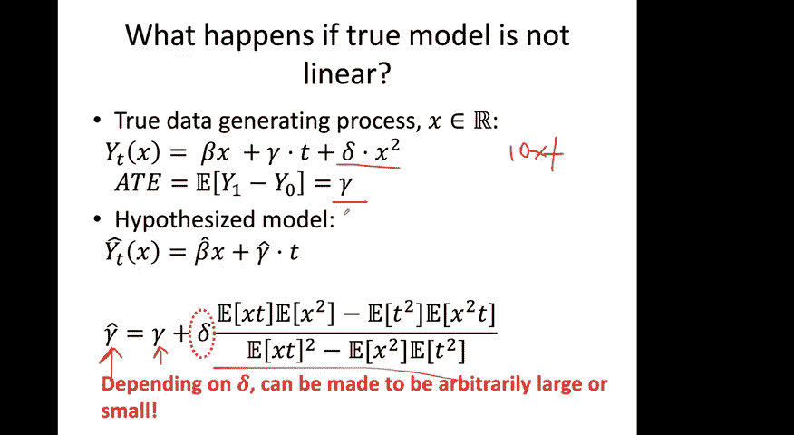
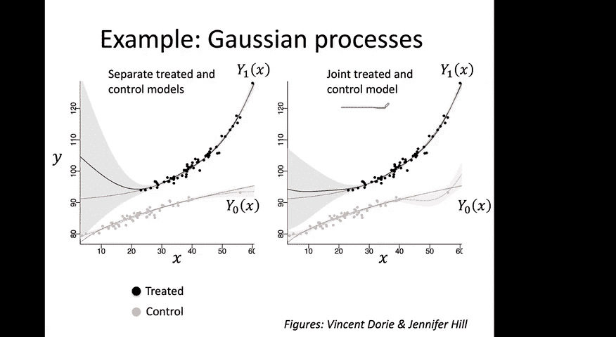
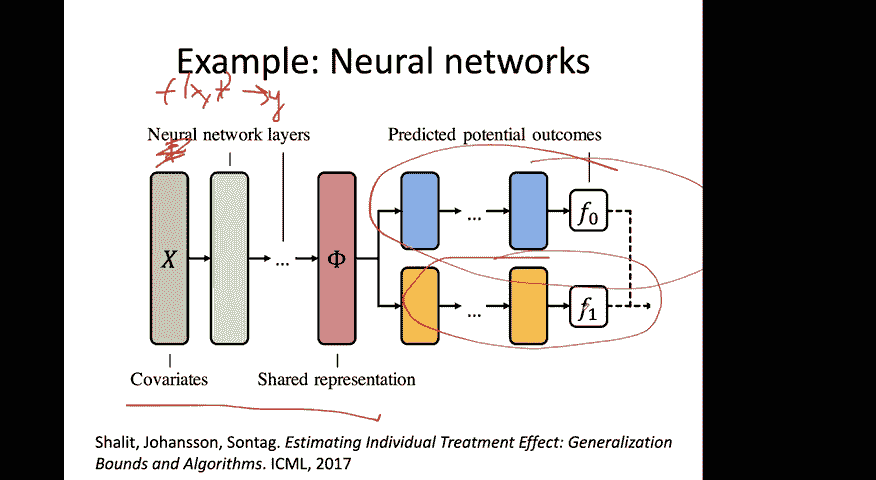
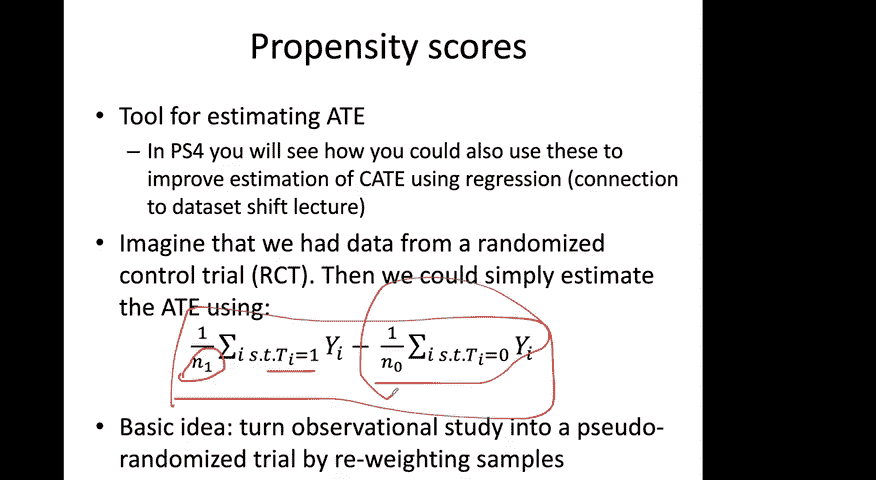
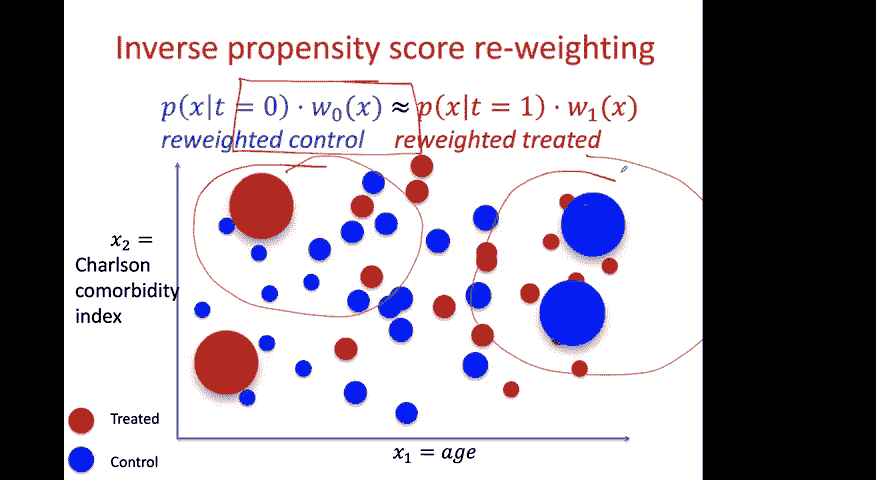
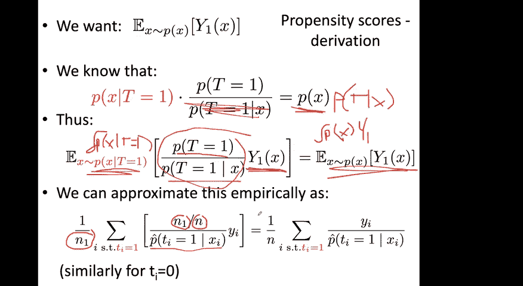
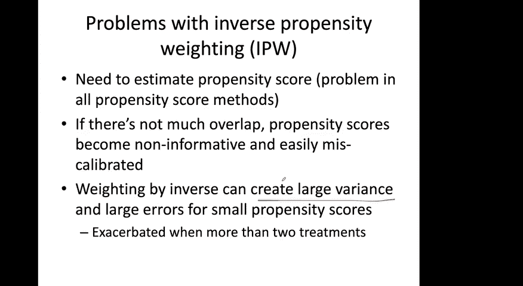
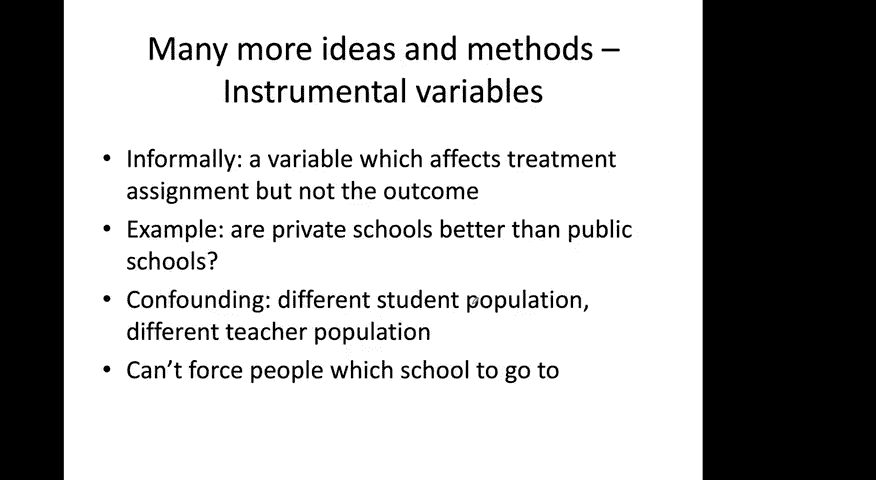
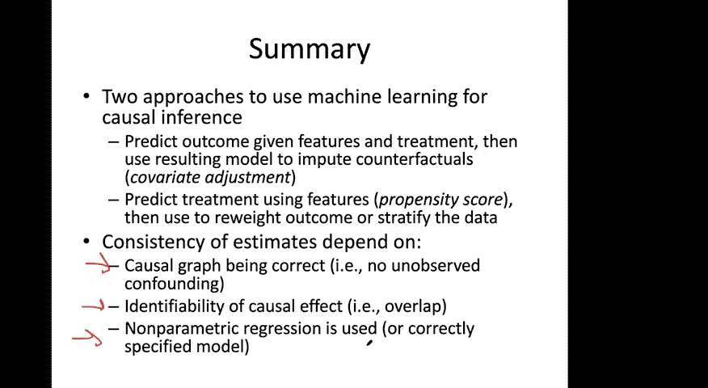
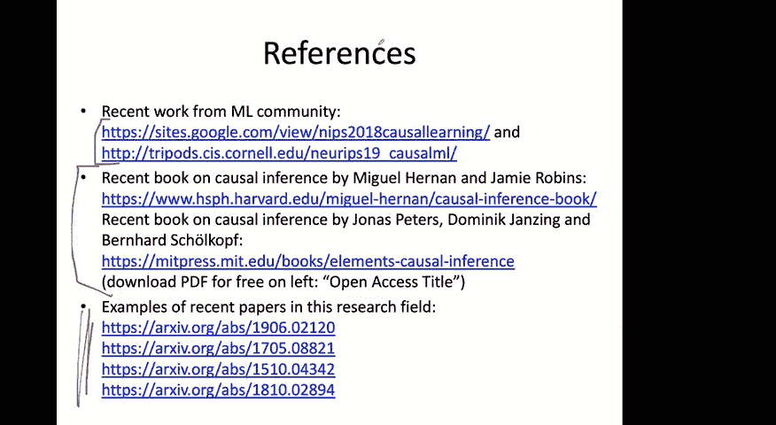

# 15：因果推断（第二部分）🔬

在本节课中，我们将继续学习因果推断。我们将深入探讨两种从观测数据中推断因果效应的方法：协变量调整和倾向评分法。课程将解释这些方法的核心概念、数学原理、各自的优缺点以及它们之间的联系。

---

## 概述 📋

在上一节课中，我们介绍了因果推断的基本设置和潜在结果框架。本节课，我们将聚焦于两种具体的推断方法。首先，我们会回顾并深入探讨协变量调整方法，分析模型选择的重要性及其潜在陷阱。接着，我们将介绍倾向评分法，这是一种通过数据重加权来模拟随机对照试验思路的技术。理解这两种方法将为我们从复杂的观测数据中得出可靠因果结论奠定基础。

---

## 从协变量调整到模型选择 🧠

上一节我们介绍了因果推断的基本设置，本节中我们来看看第一种具体方法——协变量调整。在无隐藏混淆的假设下，条件平均处理效应可以通过学习一个预测模型 `f` 来估计，该模型以协变量 `X` 和处理 `T` 为输入，预测结果 `Y`。

条件平均处理效应的计算公式为：
`CATE(x) = E[Y(1) | X=x] - E[Y(0) | X=x]`
在满足假设的情况下，这等价于：
`CATE(x) = E[Y | T=1, X=x] - E[Y | T=0, X=x]`

拟合模型 `f` 后，对个体 `x` 的CATE估计可通过计算 `f(x, T=1) - f(x, T=0)` 得到。

然而，此方法的核心挑战在于模型 `f` 的选择。模型的形式假设至关重要。为了说明这一点，我们考虑一个简单例子。

假设真实的潜在结果由以下线性模型生成：
`Y(t) = βX + γt + ε_t`，其中 `E[ε_t] = 0`。
在此模型中，平均处理效应 `ATE` 恰好是系数 `γ`。如果我们正确地指定了线性模型形式，那么通过模型拟合得到的 `γ` 的估计值 `\hat{γ}` 就是ATE的良好估计。

但是，如果真实数据生成过程包含非线性项，例如：
`Y(t) = βX + γt + δX² + ε_t`，
而我们错误地假设了线性模型并进行了拟合，那么 `\hat{γ}` 的估计将是有偏的，其偏差为 `δ * E[X²]`。这可能导致关于治疗效果的结论完全错误。

这个例子凸显了在协变量调整中，对潜在结果模型做出错误假设的危险性。因此，我们希望使用更灵活、假设更少的模型。

以下是机器学习中常用于因果推断的非参数或半参数模型：

*   **高斯过程**：可用于对连续值潜在结果进行建模。一种方法是将 `Y(1)` 和 `Y(0)` 视为两个独立的高斯过程分别拟合；另一种方法是将 `X` 和 `T` 共同作为特征，拟合一个联合高斯过程模型。
*   **神经网络**：可以构建共享底层表示的架构。例如，网络初始层共享，用于学习协变量 `X` 的表示，然后在后续使用不同的“头”网络来分别预测 `T=1` 和 `T=0` 时的结果。这种架构通常比简单地将 `X` 和 `T` 一并输入网络效果更好。

---

## 匹配法：一种直观的替代方案 👥

除了直接建模，还有一种直观的因果推断方法称为匹配法。其核心思想是为数据集中每个个体寻找一个“双胞胎”——即协变量 `X` 相似但接受了不同处理的个体，用该双胞胎的观测结果来估计反事实结果。

具体来说，假设我们有一个距离度量 `d`。对于个体 `i`，其最近邻匹配 `j(i)` 定义为：
`j(i) = argmin_{j: t_j ≠ t_i} d(x_i, x_j)`
即，寻找与 `i` 的协变量最接近但处理状态不同的个体。

基于此，个体 `i` 的条件平均处理效应估计值为：
`\hat{CATE}_i = (2t_i - 1) * (Y_i - Y_{j(i)})`
当 `t_i=1` 时，此项为 `Y_i - Y_{j(i)}`，用 `j(i)` 的 `Y(0)` 来估计 `i` 的反事实；当 `t_i=0` 时，则相反。

整个数据集的平均处理效应估计即为所有个体 `\hat{CATE}_i` 的平均值。

匹配法有其吸引力：
1.  **可解释性**：结论基于具体的相似个体对比，便于领域专家审查。
2.  **非参数性**：不依赖于对结果模型的具体参数形式假设。

但匹配法也面临挑战：
1.  **依赖距离度量**：距离函数的好坏直接影响估计质量。
2.  **高维数据**：在高维协变量空间中难以找到真正接近的邻居。
3.  **有限样本偏差**：在样本量有限时，最近邻估计可能是有偏的。

有趣的是，匹配法可以看作是协变量调整的一个特例，其中函数族 `f` 被指定为最近邻分类器。在满足一定条件下，当数据量趋于无穷时，匹配法也能给出渐近无偏的估计。

---

## 倾向评分法：模拟随机试验 ⚖️

现在，我们转向第二种核心方法——倾向评分法。其基本思想是通过对观测数据进行重新加权，使其在处理组和对照组之间的协变量分布看起来平衡，从而模拟随机对照试验的环境。

倾向评分定义为给定协变量 `X` 时，个体接受处理 `T=1` 的条件概率：
`e(x) = P(T=1 | X=x)`
我们可以使用逻辑回归等机器学习方法来估计倾向评分 `\hat{e}(x)`。需要注意的是，该方法要求模型能输出校准良好的概率估计。

获得倾向评分后，平均处理效应的估计量（逆概率加权估计量）为：
`\hat{ATE} = 1/N * Σ_{i=1}^N [ (t_i * Y_i) / \hat{e}(x_i) - ((1-t_i) * Y_i) / (1 - \hat{e}(x_i)) ]`

**直觉理解**：如果一个个体协变量 `X` 使其接受处理 `T=1` 的概率很低（`e(x)` 小），但事实上他/她确实接受了处理，那么这个样本在数据中就很“稀有”。逆概率加权 (`1/e(x)`) 会赋予这个样本更大的权重，以抵消这种选择偏差，使得加权后的处理组协变量分布与全样本分布一致。对照组同理。

在随机对照试验的特殊情况下，`e(x) = 0.5`，该估计量简化为处理组均值与对照组均值之差，与我们熟知的RCT估计量一致。

倾向评分法的优点在于它不需要对结果模型 `Y` 进行建模，避免了因错误指定结果模型而带来的偏差。但其缺点是对倾向评分估计的准确性非常敏感，特别是在缺乏重叠的区域（即 `e(x)` 接近0或1），会导致权重极大，估计方差很高。常用的启发式方法是“裁剪”，即设定倾向得分的上下限（如[0.05, 0.95]），但这可能引入偏差。

---

## 总结与对比 🎯

本节课我们一起学习了两种从观测数据中进行因果推断的主要方法。

*   **协变量调整法**：直接对结果 `Y` 进行建模。其有效性严重依赖于对潜在结果模型形式的正确设定。使用灵活的机器学习模型（如神经网络、高斯过程）可以减轻模型误设的风险。
*   **倾向评分法**：对处理分配机制 `T` 进行建模，并通过逆概率加权来调整数据分布。其有效性依赖于倾向评分估计的准确性和重叠假设的满足程度。

两种方法都需要基于上节课的核心假设：无未观测混淆、因果图正确以及重叠性。缺乏重叠对两种方法都是严峻挑战：对协变量调整而言，它导致某些区域无法估计；对倾向评分而言，它导致极端权重和高方差。

在实践中，还存在结合两者优点的“双稳健估计量”，只要倾向评分模型或结果模型其中之一设定正确，就能得到一致估计，这提供了额外的稳健性。

理解这些方法的原理、假设和局限，是应用因果推断解决实际医学或社会科学问题的关键第一步。