# 16：强化学习（第一部分）🎮

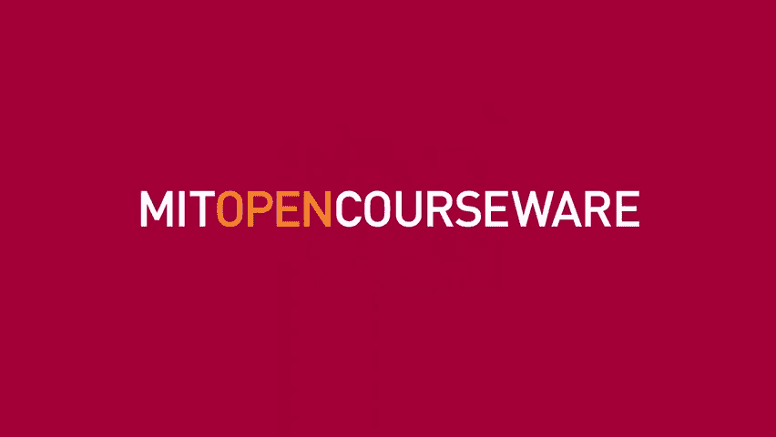

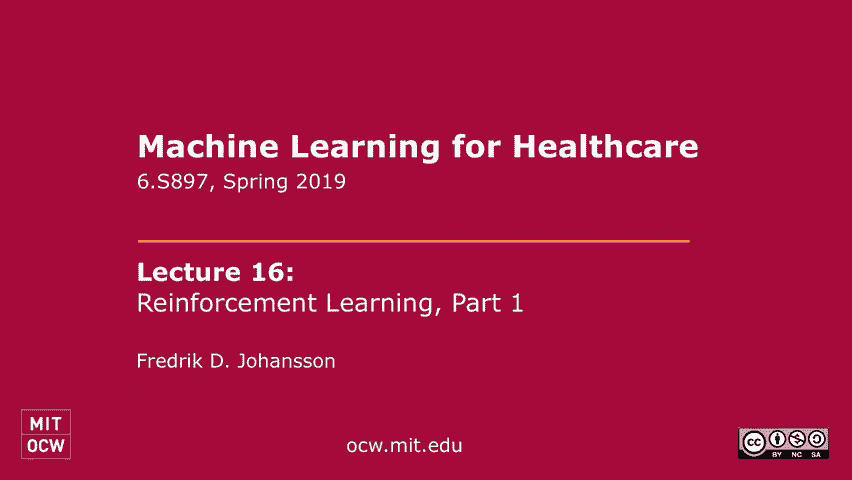

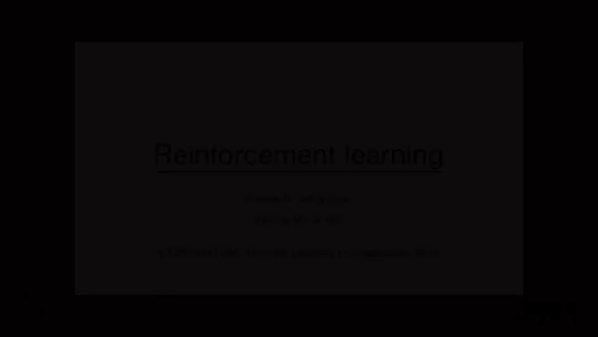

在本节课中，我们将学习强化学习的基本概念，特别是如何将其应用于顺序决策问题，例如医疗环境中的患者管理。我们将从回顾上周的因果推理内容开始，逐步过渡到更复杂的、涉及多个时间步骤的决策过程。

---

## 概述 📋

上周我们讨论了因果推理，专注于单一步骤的治疗选择。我们知道，许多医学决策涉及跨时间的多个顺序决定。这将是本周讨论的焦点。本次讲座将介绍强化学习的基础，这是一种用于解决顺序决策问题的方法。

---

## 从因果推理到顺序决策 🔄

上一节我们介绍了因果推理，本节中我们来看看如何将其扩展到顺序决策。

我们之前介绍了四个量：两个潜在结果（代表在不同治疗选择下的结果）、一组协变量 `X` 和治疗 `T`。我们感兴趣的是给定协变量 `X` 时，治疗 `T` 对结果 `Y` 的影响，即条件平均处理效应（CATE）。

我们上周尝试用各种方法识别这个量。然而，一个问题没有过多出现，那就是我们如何使用这个量。我们可能只对其绝对规模感兴趣，但也可能有兴趣设计一个治疗患者的策略。今天我们将重点讨论策略，特别是根据我们对患者的了解，输出选择或操作。

一个很自然的策略是说：如果效果是积极的，我们就治疗患者；如果效果是负面的，我们就不治疗。当然，积极与否是相对于结果的有用性而言的。然而，我们也可以考虑更复杂的策略，例如考虑立法、药物成本或副作用。我们今天不打算深入讨论这些，但在思考时可以记住这一点。

---

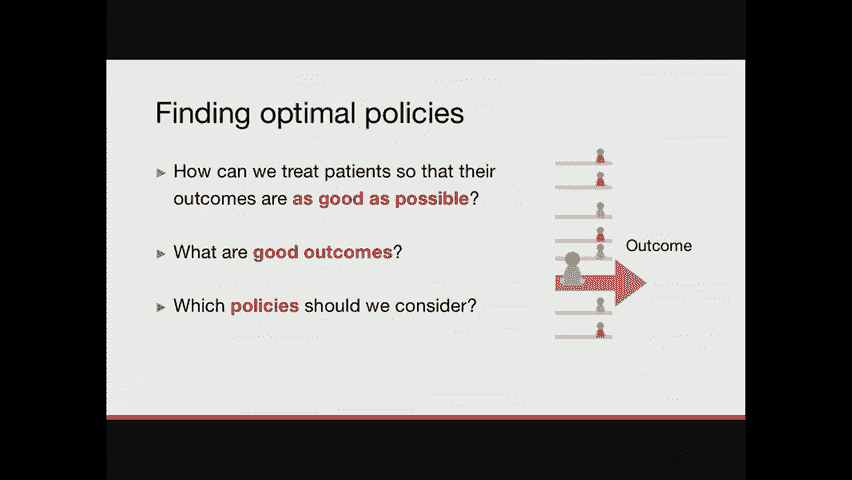

## 顺序决策示例：败血症管理 🏥

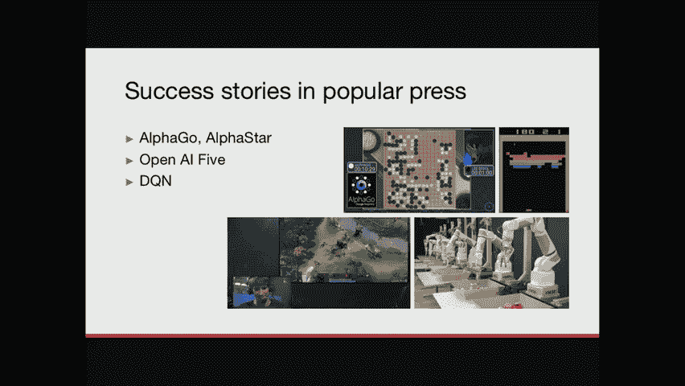

大卫提到，我们现在应该从单一治疗的单步设置转向顺序设置。我的第一个例子是败血症管理。

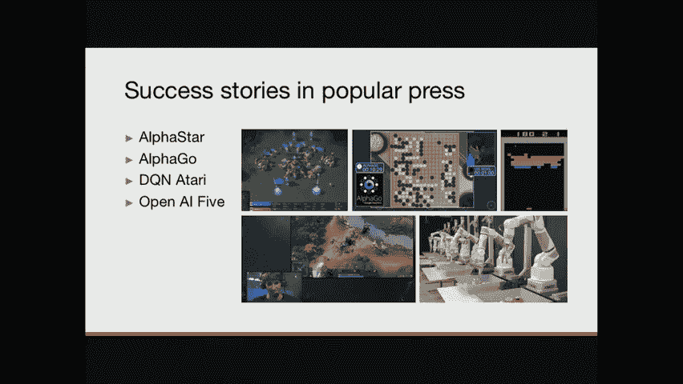

败血症是感染的并发症，可能产生灾难性后果，导致器官衰竭并最终死亡。它是重症监护室死亡的主要原因之一。因此，能够管理和治疗这种情况非常重要。

治疗败血症时，主要目标是修复感染本身。如果不治疗感染，情况会继续恶化。但即使找到了正确的抗生素，感染性休克或炎症的来源也需要管理很多不同的情况，例如发烧、呼吸困难、低血压、高心率等。这些都是症状，不是根源，但我们仍需管理它们，以确保患者存活和舒适。

当我说败血症管理时，我指的是随着时间的推移管理这些指标。患者在医院里，我们上次讨论过潜在结果和单一治疗选择。我们可以在败血症环境中考虑这一点：一个病人进来，或者已经在医院，可能出现呼吸困难，这意味着他们的血氧很低。我们可能想让他们接受机械通气，以确保获得足够的氧气。这可以看作是一个单一的选择：是否给病人用机械通气。

但我们需要考虑的是，在我们做出选择后会发生什么，这个选择会带来什么进一步的副作用。因为我们希望确保患者在住院期间舒适健康。今天我们将转向顺序决策，特别是早期选择的性质可能排除以后的某些选择。我们将很快看到一个例子。

我们会有兴趣提出一个反复做决定的策略，以优化我们关心的结果，例如将死亡风险降至最低，或者确保患者的生命体征在正确的范围内。本质上，现在可以想象为：在任何时候都有给予药物或干预的选择，并且存在这样做的最佳策略。

---

## 顺序决策的级联效应 ⛓️

在脓毒症患者的管理中，一个潜在的选择是让他们接受机械通气，因为他们不能自己呼吸。这样做的副作用是，他们可能会因为插管而感到不适。因此，你可能需要给病人镇静。这是一种由前一个动作触发的动作：如果我们不给病人进行机械通气，也许我们就不会考虑给他们镇静。

当我们给病人打镇静剂时，我们冒着降低他们血压的风险。因此，我们可能也需要管理这一点：如果他们的血压太低，也许我们需要给血管升压剂或液体来提高血压。这可以看作是一个选择的例子，其后果是级联的。

随着时间的推移，我们将面临患者住院期的结束，希望我们成功地管理了患者，结果是好的。我在这里说明的是，对于我们医院或医疗保健系统中的任何一个病人，我们只观察一个轨迹。决策空间的范围本质上非常大。在重症监护室，我们做出的决定数量通常比在随机试验中测试的要多得多。

将所有不同的轨迹想象成随机对照试验中不同的“臂”。进行这样的试验是不可行的。因此，我们今天谈论强化学习的一个重要原因是：学习策略，而不是因果效应。在顺序设置中，可能的行动轨迹空间太大了。

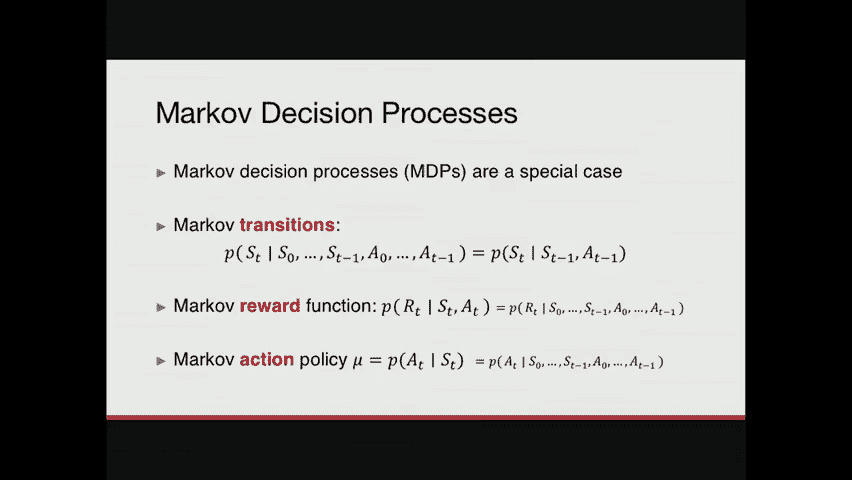

话虽如此，我们现在试图找到本质上导致好结果的策略（例如，选择橙色路径）。我们还需要推理什么是好的结果，对我们代理（例如，医生或算法）的好奖励是什么。我们作为机器学习者产生的策略可能不适合医疗保健环境，我们必须以某种方式将自己限制在现实的事情上。我今天不会太关注这个问题，它将在明天的讨论中提出，以及评估用于医疗保健系统的东西的概念。

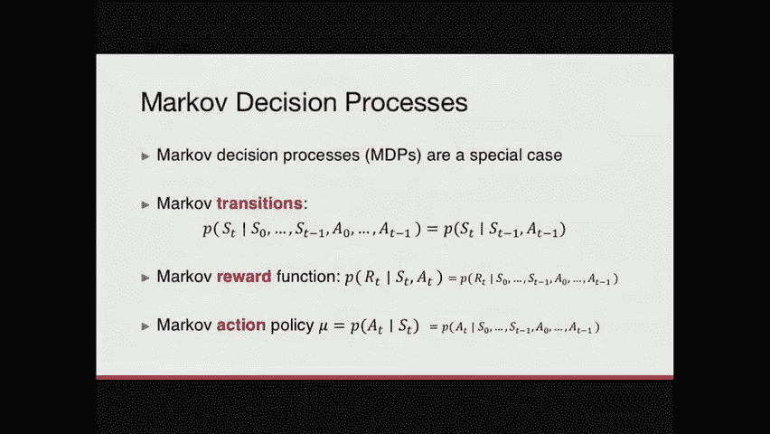

---

## 强化学习的成功案例 🏆

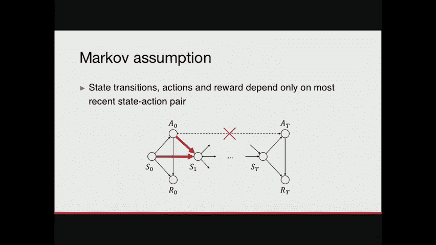

我将首先简短地提及一些成功的故事。这些不是来自医疗保健环境，而是来自各种电子游戏。这些都是很好的例子，说明当强化学习起作用时，计算机程序最终可以击败人类冠军，例如在围棋或星际争霸中。

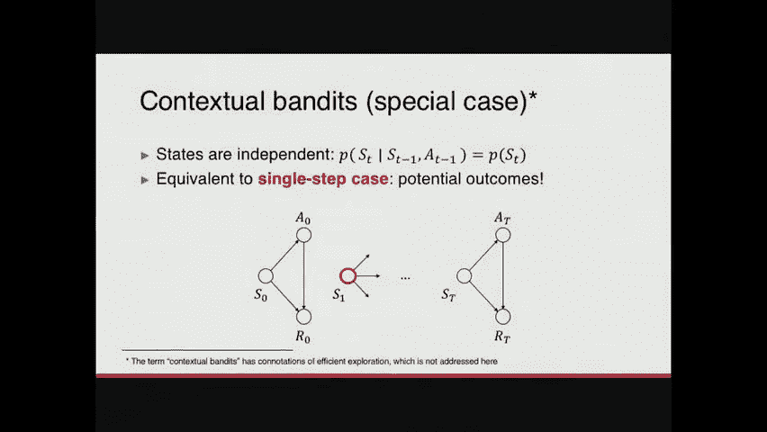

但有一件事我想让你记住：在整个演讲中，这些场景与医疗保健环境有很大的不同。我们稍后再讨论这个问题。

---

## 强化学习的基本框架 🧩

从广义上讲，这些成功案例可以概括在下面的框架中。强化学习的三个重要量是：
1.  **环境的状态**：游戏的状态、病人的状态、我们想要优化的东西的状态。
2.  **动作**：玩家或代理可以采取的行动。
3.  **奖励**：推动学习本身的回报或结果。

例如，在井字游戏中，状态表示圆和十字的当前位置。我的工作是选择一个可能的行动（一个自由的方块）来放置我的十字。每一个选择都将带领我进入游戏的新状态。我们有一个轨迹或状态的转变。我们努力优化某件事的回报或结果。如果我采取了一个糟糕的行动，导致输掉游戏，我的奖励就是负的。强化学习的基本思路是从未来中学习，避免以糟糕的状态结束。

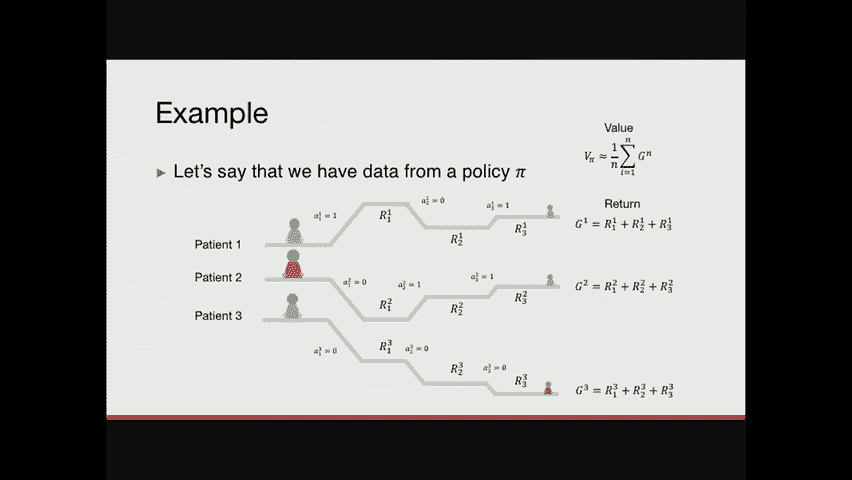

如果我们把这个类比转移到医疗保健环境，我们可以把病人的状态想象成游戏板，我们开出的治疗处方或干预措施就像是游戏中的动作，病人的结果（例如死亡率或生命体征）就像是游戏中输了或赢了的奖励。

医疗保健不是游戏，但它们有很多共同的数学结构。这就是为什么我在这里做类比。这些量（状态 `S`、动作 `A` 和奖励 `R`）会形成一个叫做**决策过程**的东西，这就是我们接下来要讨论的。

---

## 马尔可夫决策过程（MDP） 📈

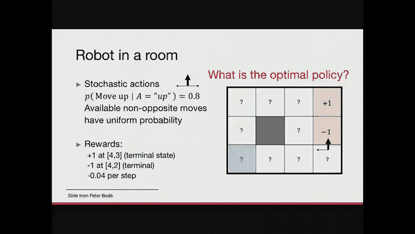

决策过程本质上是描述我们访问的数据的世界，或者我们管理代理的世界。通常有一个**代理**的概念（例如医生），随着时间的推移反复采取行动。时间索引 `T` 表示时间的索引。代理在时间 `t` 采取行动 `A_t`，并在任何时候获得该行动的奖励 `R_t`。

**环境**是提供奖励的原因。例如，如果我是医生（代理），我对我的病人采取行动，病人就是环境，回应我的干预。**状态** `S_t` 是病人的状态，但也可能更广泛，包括机器设置、药物可用性等。状态可能是部分观察到的，我可能并不真正了解与我相关的病人的一切。

有两种不同的形式化：当你知道关于状态 `S` 的一切时（完全可观察），以及当你不完全知道时（部分可观察）。在本次讲座的大部分时间里，我们将专注于完全可观察的情况。

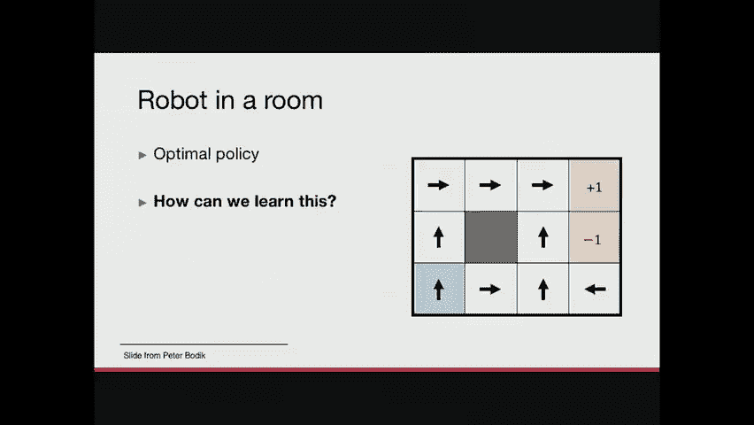

---

### MDP 的具体示例：机械通气

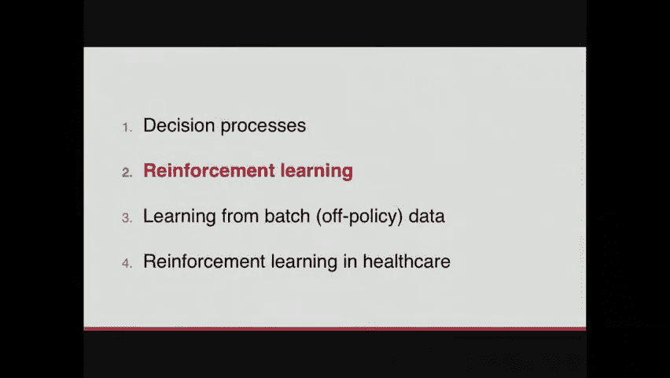

回到我之前给你看的例子：强制机械通气。在这种情况下，他们有一个有趣的奖励结构：他们试图优化的东西是与病人生命体征有关的奖励，以及他们是否保持机械通气。这篇论文的想法是，你不想让病人不必要地接受机械通气，因为它有副作用。

在任何时间点，我们可以考虑给病人开关呼吸机，也处理给他们开的镇静剂。在这个例子中，他们考虑的**状态**包括病人的人口统计信息（不随时间改变）、生理测量、呼吸机设置、意识水平、镇静剂剂量等。**动作**包括给病人插管或拔管，以及给药和镇静剂。

这又是一个决策过程的例子。这个过程是这些量（状态、动作、奖励）随时间的分布。

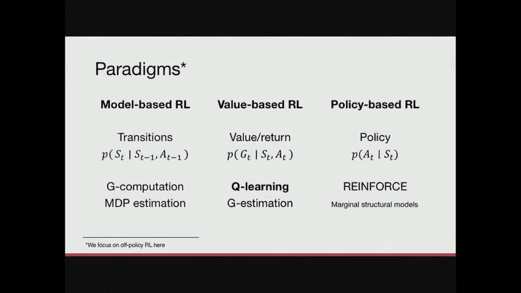

---

### 行为策略与目标策略

我们观察到的东西通常被称为**行为策略**（用 `μ` 表示）。如果我们去医院看看现在发生了什么，这将是行为策略。这就是我们要学习的。

到目前为止，决策过程非常普遍。但当人们研究顺序过程时，他们所做的一个主要限制是看一个**马尔可夫决策过程**。它们有一个特定的条件独立结构，我将在下一张幻灯片中演示。

马尔可夫假设本质上说：我们关心的所有量（下一个状态、奖励）仅取决于当前状态和动作，而不依赖于更早的历史。数学上，这意味着：
`P(S_{t+1}, R_{t+1} | S_t, A_t, History_{<t}) = P(S_{t+1}, R_{t+1} | S_t, A_t)`

这是一个很强的假设。确保马尔可夫假设更有可能的方法是在你的状态中包含更多的东西，包括历史摘要等。

对决策过程的更强限制是假设状态本身随时间独立。这有时被称为**上下文强盗**。但本质上，如果我们假设状态是独立同分布的，那么我们就回到了上周的内容：针对不同病人的模型，每个时间步骤的动作不依赖于历史。这表明上周的内容是本周的一个特例。它还暗示了强化学习问题比潜在结果问题更复杂。

我们上周做的因果效应估计，只对几个变量的影响感兴趣（单一治疗选择）。在这种情况下，我们将研究我们在前进的道路上采取的这些不同行动的影响。目标可以是即时奖励的即时影响，也可以是一个动作对状态轨迹本身的影响。

---

## 强化学习的目标 🎯

我告诉了你我们现在生活的世界（有状态 `S`、动作 `A` 和奖励 `R`），但我还没有告诉你我们试图解决的目标。大多数强化学习的目标是找到一个有良好回报的策略。我们将在这节课中使用的概念是**回报**和**价值**。

*   **回报** `G_t`：从时间 `t` 开始，遵循策略 `π` 所看到的未来奖励的总和。
*   **价值** `V^π(s)`：从状态 `s` 开始，遵循策略 `π` 的预期回报。
*   **策略的价值** `V^π`：对人口中所有病人的预期回报的平均值。

作为一个例子，我们可以想到三个不同的病人，他们从不同的状态开始，根据同样的策略 `π` 被治疗。因为他们在不同的状态，他们会在不同的时间有不同的动作。在每一个动作之后，我们得到了奖励，最后我们可以总结这些奖励，那就是我们的回报。每个病人对自己的轨迹都有一个值。策略的价值就是这些轨迹的平均值。

这就是我们试图优化的：我们想找到一个策略 `π`，使 `V^π` 最大化。

---

### 示例：网格世界机器人

这里有一个例子：房间里的机器人。这个世界的规则是：如果你告诉机器人向上，他有 `1/8` 的概率上升，以均匀的概率去其他地方。奖励是：在绿色盒子里加一，在红色盒子里减一。这些是终止状态。机器人每走一步就会得到负 `0.04` 的奖励。所以你想提高效率：你想去绿色的盒子，但也想快点做。

我想让你做的是找出什么是最好的策略：在这些不同的方框中，箭头应该以何种方式指向？我们知道转换是随机的，所以你可能需要考虑到这一点。但本质上要弄清楚如何有一个策略给我最大的预期回报。

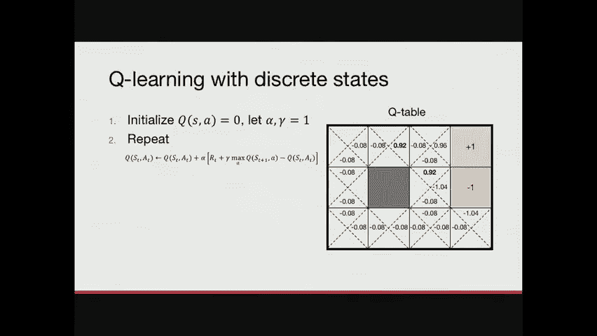

（经过讨论和观众参与，我们得到了一个接近最优的策略，其核心思想是尽可能远离红色盒子，并高效地走向绿色盒子。）

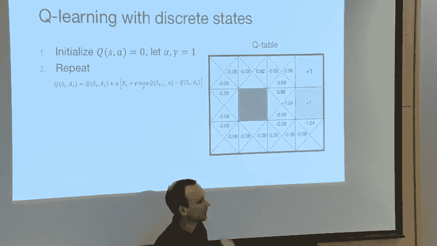

---

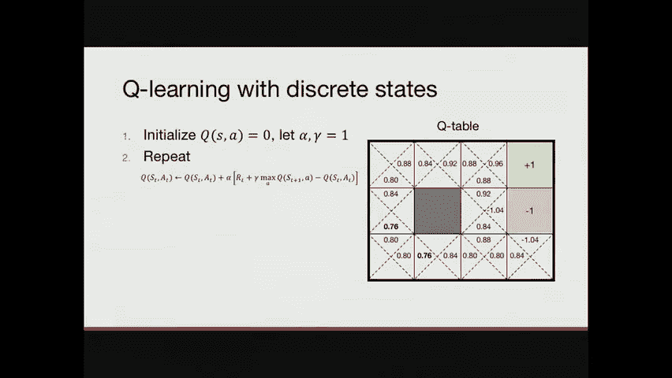

## 如何学习策略？🤖

我们有一个策略的例子，我们有一个决策过程的例子。但是我们怎么做？就班级而言，这是一个黑盒实验。强化学习就是试着想出一个策略，以一种严格的方式。

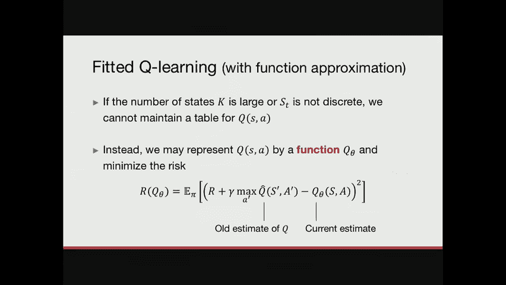

强化学习有三种非常常见的范式，根据它们专注于建模的内容来划分：
1.  **基于模型的RL**：专注于为环境创建一个模型，特别是状态转移模型。
2.  **基于价值的RL**：专注于估计回报或价值函数。
3.  **基于策略的RL**：专注于直接建模和优化策略。

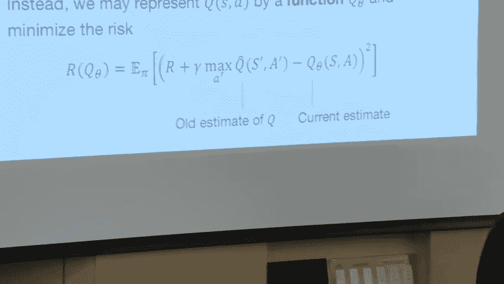

我们今天将专注于**基于价值的RL**。基于价值的RL最主要的实例是 **Q学习**。Q学习是**动态规划**的一个例子。一般的想法是递归的：你知道什么是好的终止状态，然后你想知道如何到达那里，以及如何到达之前的状态等等。

---

### Q学习与动态规划

Q学习试图估计 **Q函数** `Q^π(s, a)`，它代表从状态 `s` 开始并采取动作 `a`，之后遵循策略 `π` 的预期回报。Q学习与确定性策略有关：如果我们有一个Q函数，最优策略 `π*` 是在每个状态选择具有最高Q值的动作：
`π*(s) = argmax_a Q^π(s, a)`

最好的Q函数称为 `Q*`，它满足**贝尔曼最优性方程**：
`Q*(s, a) = R(s, a) + γ * max_{a'} Q*(s', a')`
其中 `s'` 是采取动作 `a` 后到达的下一个状态，`γ` 是折扣因子（通常小于1，表示未来奖励的现值较低）。

这个方程说：最优状态-动作值等于立即奖励加上下一个状态的最大Q值的折扣值。

问题是我们如何找到 `Q*`？Q学习的一个好处是，当状态和动作空间是小而离散的，您可以将Q函数表示为一张表。Q学习对离散状态的作用是从某个地方开始（例如，Q值全为零），然后重复以下的不动点迭代更新：
`Q(s, a) ← Q(s, a) + α * [R(s, a) + γ * max_{a'} Q(s', a') - Q(s, a)]`
其中 `α` 是学习率。

我们通过一个网格世界的具体例子，演示了Q值如何从终止状态（+1）开始，通过迭代更新，逐渐传播到整个状态空间，从而学习到最优策略。

---

### 函数近似

如果我有成千上万的状态和成千上万的行动呢？那是一张大桌子，不仅在内存上不好，统计上也不好。如果我们想观察任何关于状态-动作对的事情，我必须在那种状态下做那个动作。在医院治疗病人时，你不会在每个状态都尝试一切，通常你也不会有无限多的病人。

这就是**函数近似**的作用。如果你不能将数据表示为表，你可能想用参数函数近似Q函数。这正是我们能做的。我们可以类比上周所做的回归。

拟合Q学习的理念是，用函数近似代替表格表示。我们试图寻找一个函数 `Q_θ`，使得以下损失最小：
`L(θ) = E[(R + γ * max_{a'} Q_θ(s', a') - Q_θ(s, a))^2]`
这类似于一个回归问题，其中目标值是 `R + γ * max_{a'} Q_θ(s', a')`。

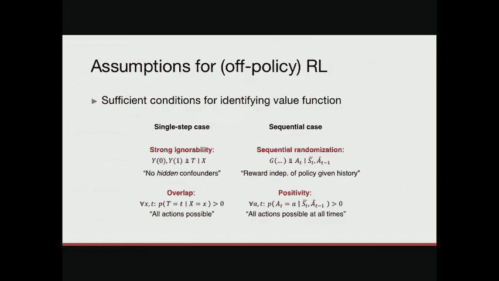

但这里有一个问题：这个目标值 `Q_θ` 本身也是我们估计的。所以通常情况下，我们在更新目标Q和当前Q之间交替。但我还没有告诉你如何评估这个期望（即如何获得数据 `(s, a, r, s')` 元组）。

---

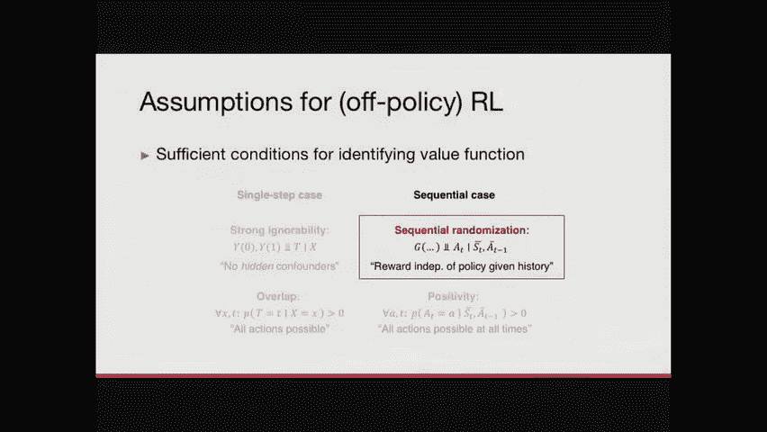

## 离线策略学习与评估 📊

在强化学习中，有几种不同的方法可以获得数据：
1.  **在线探索**：你按照当前的策略与环境交互（例如，玩电子游戏）。在医疗保健中，这相当于尝试你目前的治疗想法，看看会发生什么。这可能有问题，尤其是如果你的策略一开始就很差。
2.  **随机试验**：你在一个人群上随机化动作。在顺序设置中，这需要随机化一系列动作，与你以前看到的临床试验不同。
3.  **离线策略学习/评估**：你观察来自医疗保健系统的历史数据（例如，电子健康记录），其中患者已经被某种行为策略 `μ` 治疗过。你试图根据这些信息提取一个好的策略 `π`。这就是我们接下来要关注的。

当我们从离线策略数据中学习时，我们必须小心。这与上周的混淆问题是一样的。我们观察到的轨迹根据创造它们的临床医生的策略而有偏差，我们想弄清楚不同策略的价值。

和上次一样，我们需要做出类似的假设，但更强：
*   **顺序忽略性**：在轨迹的任何一点，给定到该点为止观察到的历史（状态和动作），当前的动作与潜在的未来回报无关。这比马尔可夫假设要弱，因为它允许依赖整个历史，但要求我们观察历史上所有的混杂因素。
*   **正性**：在轨迹的任何一点上，任何行动都应该是可能的，以便我们估计任何可能策略的价值。我们知道这不会是真的。在实践中，我们不会在每一个可能的点上考虑每一个可能的行动。这告诉我们，我们不能估计每一份可能策略的价值，只能估计与数据支持一致的策略的价值（即，那些在数据中至少以某种概率出现过的行动序列）。

---

## 回顾与挑战 🧐

最后，回顾一下潜在结果的故事。这是一步决定的想法：病人安娜进来了，我们有治疗A或B的选择，我们想知道在她的特征 `X` 下，哪个治疗会导致更好的结果 `Y`。忽略性假设说，给定 `X`，潜在结果 `Y(0)`, `Y(1)` 独立于治疗 `T`。

如果我们再加一个时间点，事情就变得更复杂。如果行动影响未来的状态，或者未来的状态影响未来的奖励，我们就有了一个顺序决策过程。顺序忽略性假设要求我们能够充分地总结历史 `H_t`，使得给定 `H_t`，当前动作与未来回报独立。

问题是历史 `H_t` 通常是一件很大的事情。我们如何表示它？我们可以看一个固定长度的窗口，或者尝试学习一个摘要函数。但这是无法避免的。未观察到的混淆也是一个问题，就像在一步设置中一样，但在顺序设置中，混杂结构可能更复杂。

我们之前看过的游戏（围棋、星际争霸）成功的一个重要原因是**完全可观察性**和**几乎无限的探索**。在这些设置中，我们可以通过模拟和自玩来无限探索动态。但在医疗保健中，我们只有有限的病人样本，目前的算法对数据效率要求很高。此外，在现实世界的应用程序中，我们通常有测量误差和噪声。

---

## 总结 📝

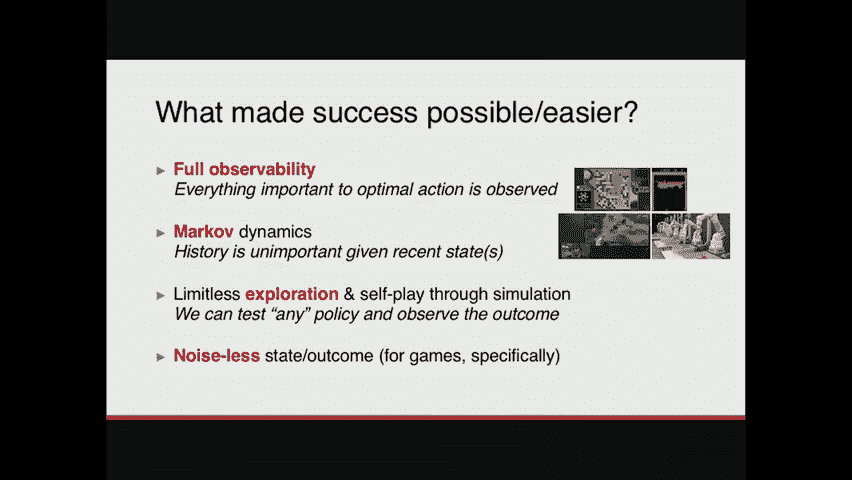

本节课中我们一起学习了：
1.  如何将因果推理从单步决策扩展到顺序决策。
2.  强化学习的基本框架：状态、动作、奖励、回报和价值。
3.  马尔可夫决策过程（MDP）及其假设。
4.  基于价值的强化学习，特别是Q学习和动态规划的思想。
5.  如何使用函数近似来处理大的状态-动作空间。
6.  离线策略学习的挑战，包括顺序忽略性和正性假设。
7.  将强化学习应用于医疗保健等现实世界问题时的关键差异和困难（如部分可观察性、有限数据、测量噪声）。

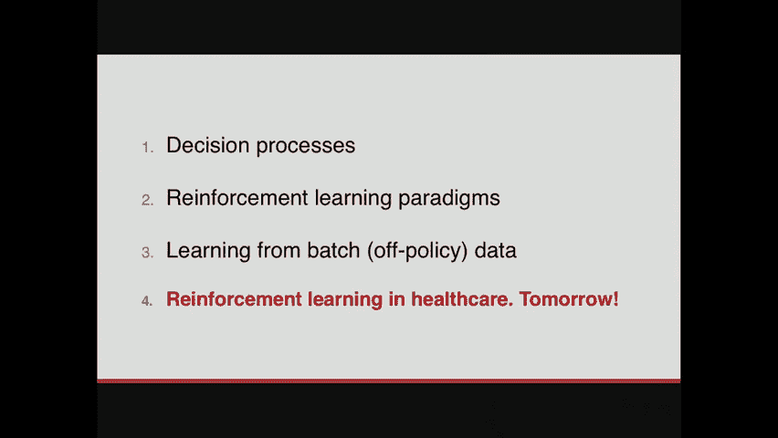

强化学习为顺序决策问题提供了强大的框架，但在将其应用于像医疗保健这样的高风险领域时，需要格外小心数据的局限性、假设的有效性以及评估的严谨性。在接下来的课程中，我们将更深入地讨论这些实际挑战。