# 17：因果推断与动态治疗策略评估 🧠

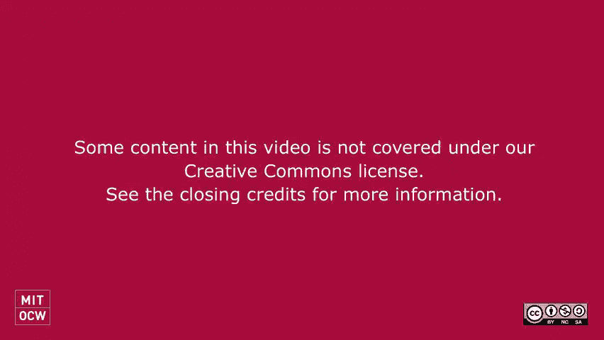

在本节课中，我们将继续探讨强化学习的主题，并深入讨论因果推断在动态治疗策略评估中的应用。我们将学习如何评估策略的价值，并介绍G方法在处理治疗混杂反馈时的应用。

---

## 强化学习目标回顾 🎯

上一节我们介绍了强化学习的基本目标，即优化期望奖励。本节中，我们来看看这一目标的具体含义及其潜在问题。

强化学习的目标是优化期望奖励，即找到最优策略π*：

\[
\pi^* = \arg\max_{\pi} V(\pi)
\]

其中，\( V(\pi) \) 是策略π的值，定义为期望奖励的总和：

\[
V(\pi) = \mathbb{E}\left[ \sum_{t} R_t \right]
\]

这里的期望考虑了环境随机性和策略随机性。奖励函数可以在每个时间点定义，也可以仅在最后一步定义。

然而，仅优化期望奖励可能存在问题。例如，如果奖励代表病人的生死，我们可能不仅关心平均奖励，还希望避免高方差或最坏情况的发生。因此，在实际应用中，可能需要考虑其他优化标准，如最坏情况奖励或奖励的分位数。

---

## 策略评估方法 🔍

在强化学习中，我们学习了策略迭代和Q学习。现在，我们来看看如何评估策略的价值。

一种评估策略价值的方法是计算 \( V(\pi) \) 的估计值 \( \hat{V}(\pi) \)。在Q学习中，可以通过初始状态下的最大Q值来估计：

\[
\hat{V}(\pi) = \max_a Q(s_0, a)
\]

这种方法依赖于Q函数的准确性。然而，在因果推断场景中，我们可能需要不同的评估方法。

---

## 因果推断中的策略评估 📊

在因果推断中，我们通常关注平均治疗效果（ATE）或条件平均治疗效果（CATE）。本节中，我们将探讨如何在因果推断框架下评估策略。

假设我们通过协变量调整方法估计条件平均治疗效果 \( \hat{\tau}(x) \)，并基于此构建策略π(x)：

\[
\pi(x) = \begin{cases} 
1 & \text{if } \hat{\tau}(x) > 0 \\
0 & \text{otherwise}
\end{cases}
\]

策略π的价值可以通过以下公式估计：

\[
\hat{V}(\pi) = \frac{1}{n} \sum_{i=1}^n \left[ \pi(x_i) \cdot \hat{f}(x_i, 1) + (1 - \pi(x_i)) \cdot \hat{f}(x_i, 0) \right]
\]

其中，\( \hat{f}(x, a) \) 是对潜在结果的估计。

然而，这种方法依赖于对潜在结果的准确估计。另一种方法是使用逆倾向加权（IPW）估计器，直接评估策略价值而不估计潜在结果。

---

## 逆倾向加权估计器 ⚖️

逆倾向加权估计器提供了一种不依赖潜在结果估计的策略评估方法。以下是其具体形式：

\[
\hat{V}_{\text{IW}}(\pi) = \frac{1}{n} \sum_{i=1}^n \frac{\mathbb{I}(A_i = \pi(x_i)) \cdot Y_i}{P(A_i | x_i)}
\]

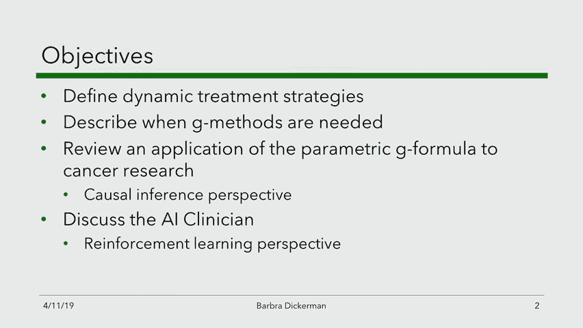

其中，\( \mathbb{I}(\cdot) \) 是指示函数，\( P(A_i | x_i) \) 是倾向得分。

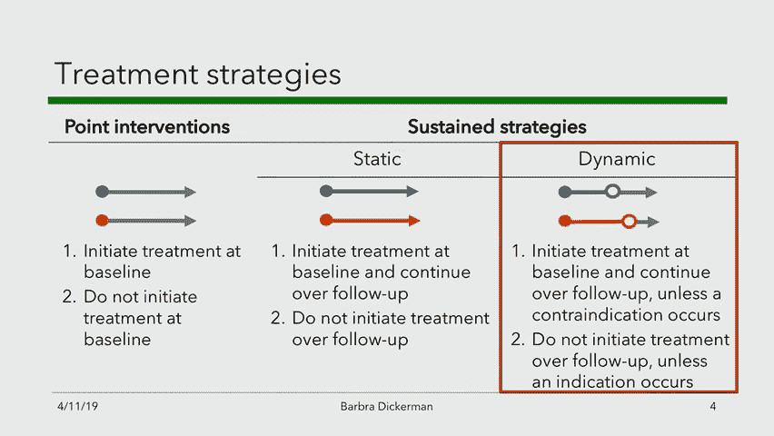

这种方法的优点在于它绕过了对潜在结果的估计，但需要准确的倾向得分。在随机对照试验中，倾向得分通常是已知的；在观测数据中，则需要通过逻辑回归等方法估计。

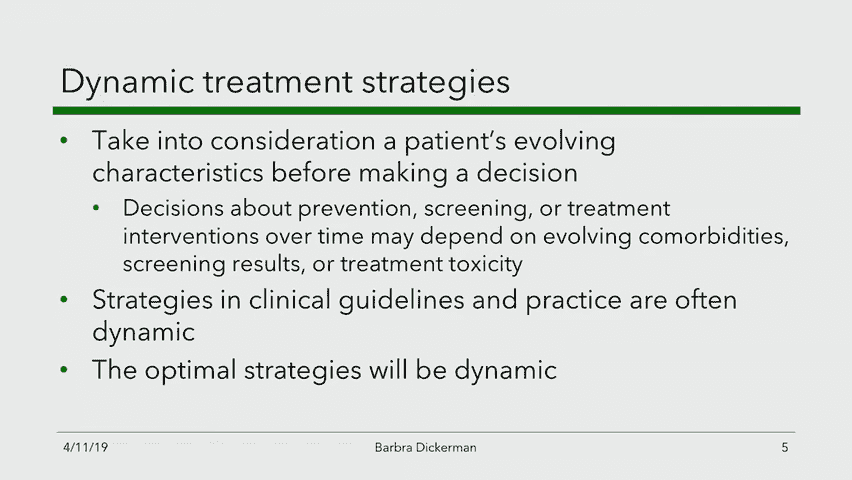

然而，逆倾向加权估计器可能面临方差过大的问题，特别是当倾向得分很小时。为了解决这个问题，可以采用剪裁倾向得分或使用双鲁棒估计器。

---

## 动态治疗策略评估 🏥

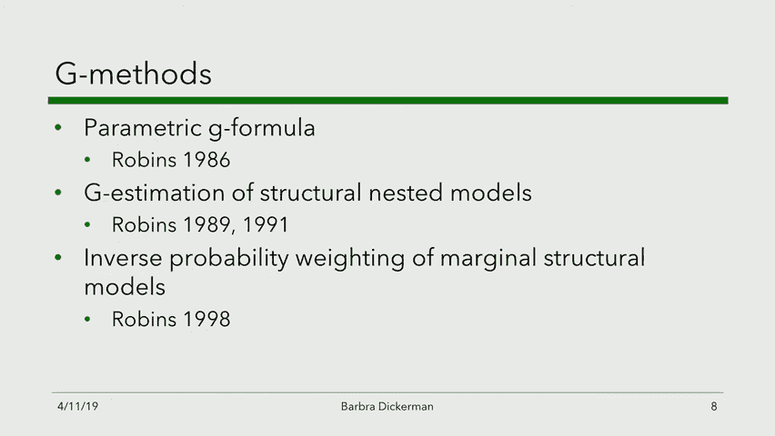

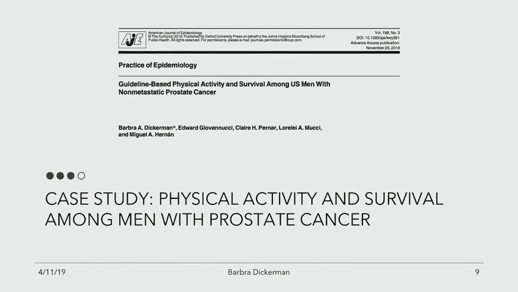

在临床环境中，动态治疗策略根据患者随时间变化的特征调整治疗。本节中，我们将介绍G方法在评估动态治疗策略中的应用。

动态治疗策略的评估面临治疗混杂反馈的挑战。当时间依赖性混杂因素受先前治疗影响时，传统统计方法可能导致选择偏差。G方法（如参数G公式、G估计和逆概率加权）专门设计用于处理这种情况。

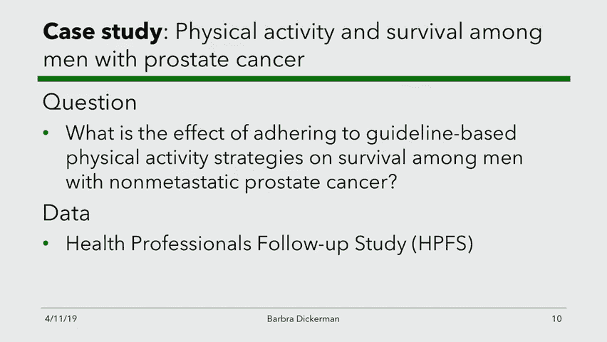

以下是参数G公式的基本步骤：

1. 拟合参数回归模型，包括治疗、混杂因素和结果变量。
2. 使用蒙特卡洛模拟，生成在指定策略下的数据副本。
3. 估计每种策略下的累积风险。

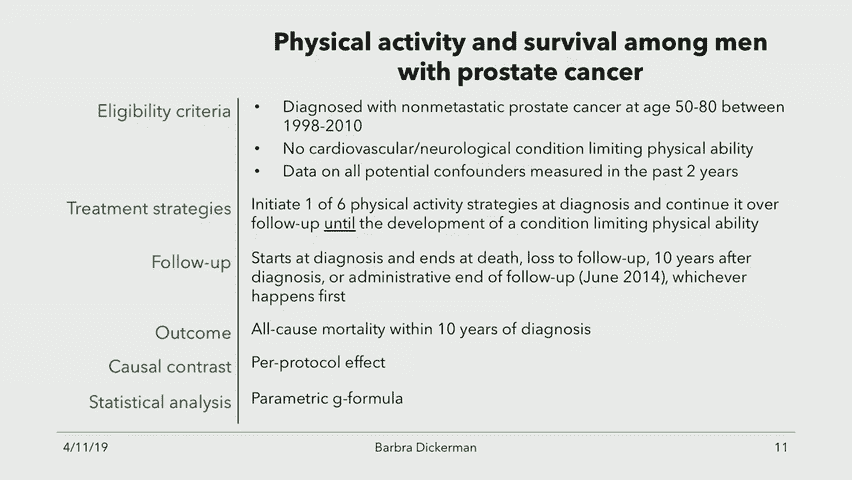

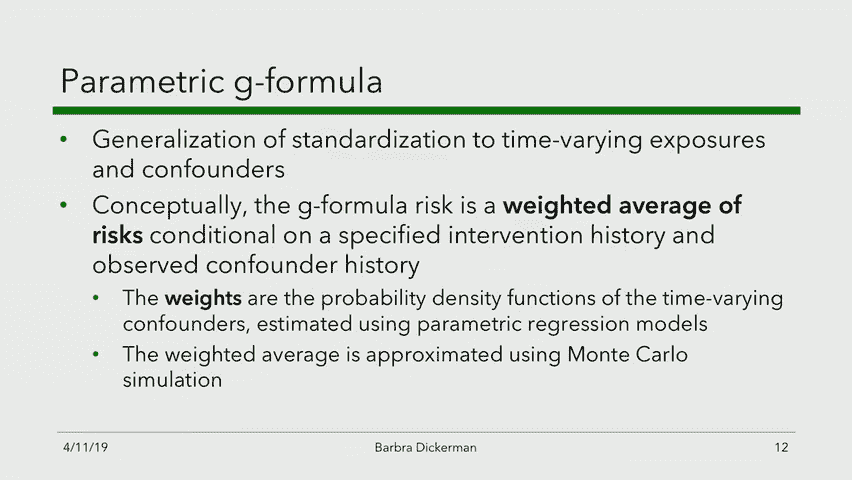

参数G公式允许我们在治疗混杂反馈存在的情况下，估计动态治疗策略的效果。

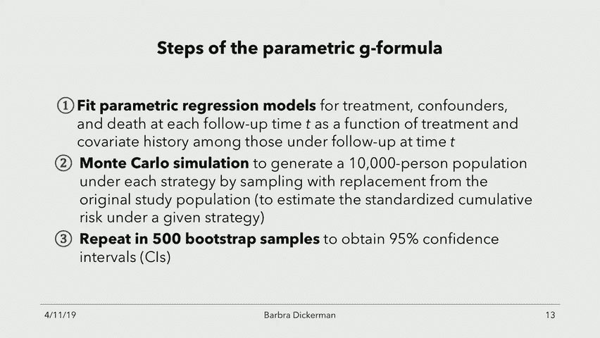

---

## 实例分析：前列腺癌患者的体育活动干预 🏃‍♂️

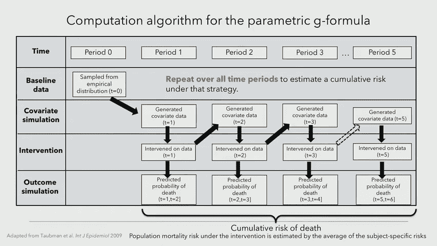

为了具体说明G方法的应用，我们以一项前列腺癌患者的体育活动干预研究为例。该研究旨在评估遵循指南的体育活动对患者生存的影响。

研究使用参数G公式分析观测数据，并模拟了六种不同的体育活动策略。结果显示，遵循指南的体育活动可以显著降低死亡风险。此外，研究还进行了敏感性分析，以评估未测量混杂因素的影响。

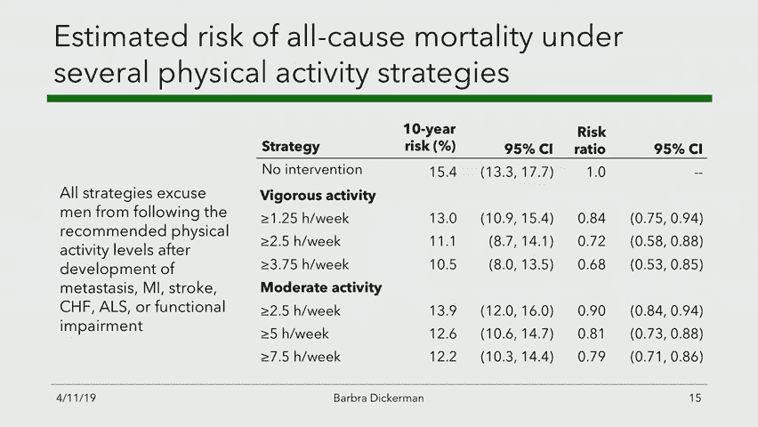

通过阴性结果控制分析，研究发现体育活动对问卷无反应几乎没有影响，这支持了体育活动对生存的因果效应。

---

## 总结与展望 🌟

本节课中，我们一起学习了强化学习中的策略评估方法，以及因果推断在动态治疗策略评估中的应用。我们介绍了逆倾向加权估计器和G方法，并通过实例分析了前列腺癌患者的体育活动干预。

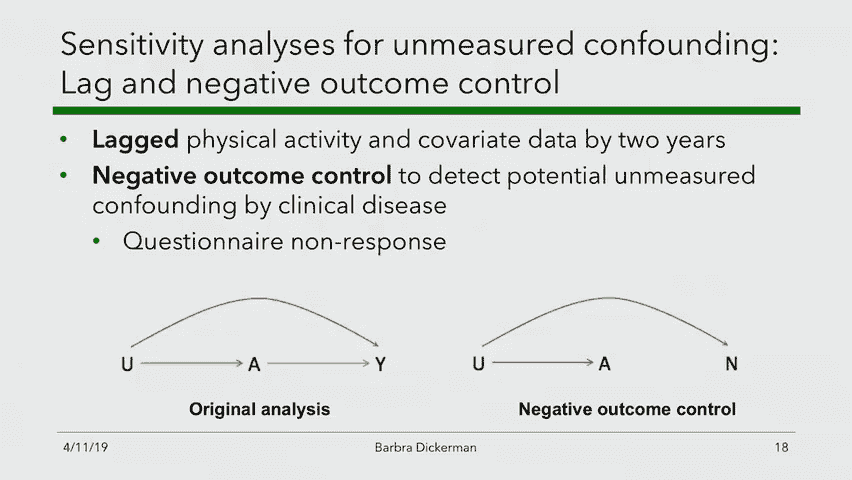

这些方法为我们提供了强大的工具，用于评估和优化动态治疗策略。然而，仍有许多未探索的方向，例如如何结合领域知识进行敏感性分析，以及如何进一步优化策略以适应个体特征。

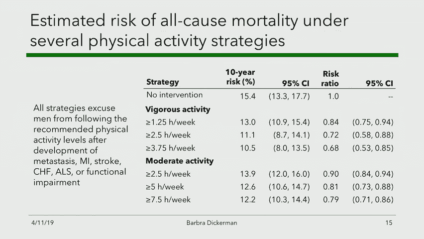

希望本节课的内容能帮助你更好地理解强化学习与因果推断在临床决策中的应用。