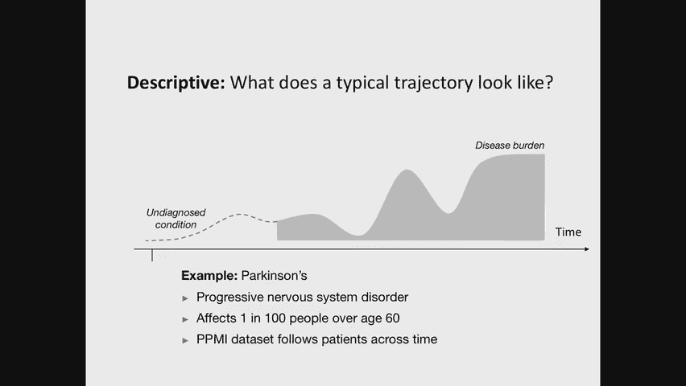
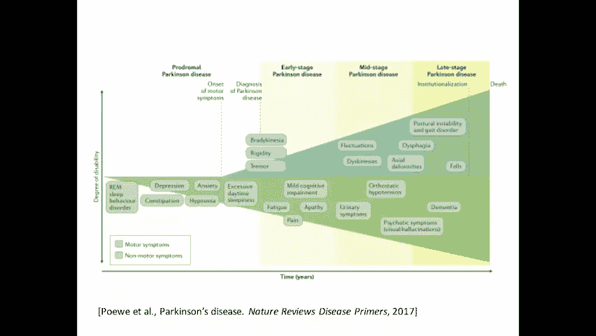
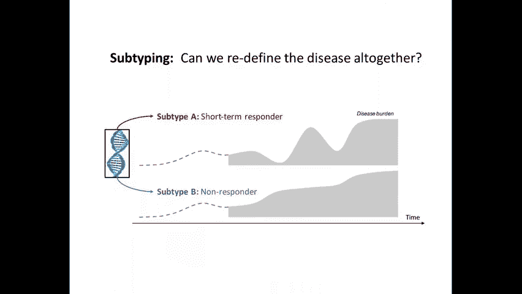
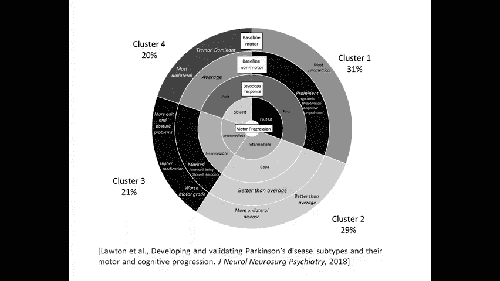
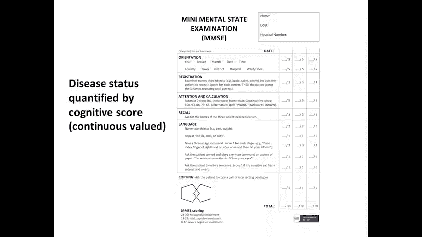
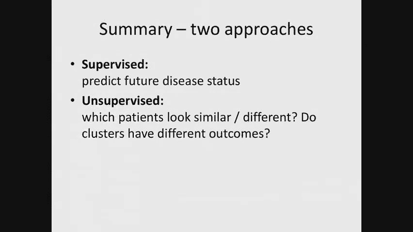
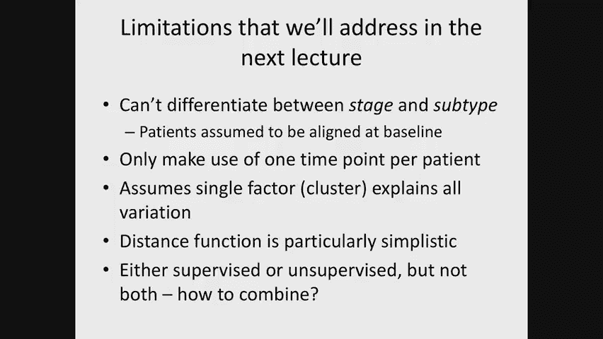
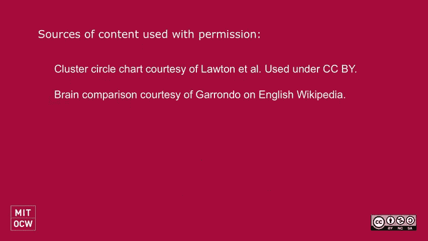

# 18：疾病进展建模 🏥


在本节课中，我们将学习如何对疾病进展进行建模。我们将探讨两种核心方法：一种是用于预测未来疾病状态的**监督学习方法**，另一种是用于发现疾病亚型的**无监督学习方法**。课程内容将涵盖这些方法的基本概念、应用实例以及各自的局限性。

---

## 概述：我们想要回答的问题 🤔





在研究疾病进展模型时，我们通常希望回答三类问题：
1.  **预后问题**：预测特定患者未来的疾病状态。
2.  **描述性问题**：理解疾病在人群中的典型发展轨迹。
3.  **疾病亚分型问题**：识别患者群体中具有不同疾病特征或进展模式的亚组。

想象一个患者的疾病轨迹图：X轴是时间，Y轴是疾病负担（如症状严重程度）。患者可能经历诊断、治疗、复发等阶段。我们的目标就是量化、预测和理解这些轨迹。



---



## 第一部分：预后与监督学习 📈

上一节我们概述了疾病建模的目标，本节中我们来看看如何利用基线信息预测患者的未来状况。



预后问题本质上是一个**监督机器学习问题**。我们拥有患者在基线（时间零点）时的特征数据（记为向量 **X**），目标是预测其在未来多个时间点（如6、12、18个月后）的疾病状态（记为 **Y_t**）。

### 面临的挑战与多任务学习

直接为每个未来时间点训练独立的预测模型会面临数据稀疏、标签噪声和样本量随时间减少等问题。

以下是解决此问题的一种思路：使用**多任务学习**方法，联合学习多个时间点的预测模型，并鼓励模型参数之间具有相似性。

**核心思想公式化**：
假设我们要预测 `T` 个时间点。我们为每个时间点 `t` 定义一个线性预测模型，其权重向量为 **w_t**。损失函数可以写为：

```
总损失 = Σ_t (预测Y_t的损失) + λ * Σ_{相邻t} ||w_t - w_{t+1}||^2
```

其中：
*   第一项是各个时间点预测误差的总和。
*   第二项是正则化项，它惩罚相邻时间点模型权重之间的差异，鼓励平滑性。
*   `λ` 是控制平滑强度的超参数。

这种方法通过共享不同预测任务间的信息，能在数据有限时提升模型性能。

### 案例研究：阿尔茨海默病预测

一项研究使用多任务学习（具体为凸融合稀疏群套索模型）预测阿尔茨海默病患者的认知评分（如MMSE分数）。模型输入包括基线时的MRI特征、遗传信息和认知测试分数。

**结果**：与为每个时间点训练独立模型相比，多任务学习模型（通过正则项绑定权重）的预测性能（R²）显著提升，证明了在数据稀疏时共享跨时间信息的好处。

**模型权重可视化**：分析不同时间点的重要特征发现，有些特征在所有时间点都重要，而有些特征仅对预测近期或远期状态重要，这增进了我们对疾病驱动因素随时间变化的理解。

---

## 第二部分：疾病亚分型与无监督学习 🔍

上一节我们介绍了用于预测的监督方法，本节中我们来看看如何利用无监督学习发现疾病亚型。

无监督学习的目标有两个：
1.  **获得新知**：发现数据中自然存在的患者亚组（亚型），这可能有助于理解疾病机制、指导临床试验设计或制定简洁的临床决策规则。
2.  **缓解过拟合**：在数据稀缺的医疗场景中，先进行无监督学习提取结构，再用于监督任务，可以更好地利用有限数据，减少对噪声标签的过拟合。

我们将使用最简单的无监督算法——**K均值聚类**。

**K均值算法步骤简述**：
1.  随机初始化 `K` 个聚类中心。
2.  **分配步骤**：将每个数据点分配到最近的聚类中心。
3.  **更新步骤**：重新计算每个聚类中所有点的均值，作为新的聚类中心。
4.  重复步骤2和3，直到分配不再变化。

### 案例研究：哮喘亚型发现

一项研究运用K均值聚类分析了多个哮喘患者数据集，旨在发现不同的哮喘亚型。

**数据与预处理**：特征包括人口统计学、肺功能测量、生物标志物等。连续特征进行Z-score标准化，分类特征进行独热编码。

**聚类结果**：在初级护理患者数据中，算法识别出三个主要亚型：
*   **早发症状主导型**：患者非常年轻，哮喘发作频繁且严重。
*   **肥胖相关型**：以超重女性为主，哮喘症状相对较轻。
*   **炎症主导型**：介于两者之间。

**结果验证与推广**：
*   在更严重的二级护理患者数据中重新聚类，前两个亚型再次出现，增加了亚型可靠性的信心。
*   在一个小型随机对照试验数据中，研究者根据已发现的亚型对患者分组，再分析不同治疗策略的效果。虽然整体人群的平均治疗效果为零，但在不同亚型内部，治疗反应存在显著差异。这揭示了**治疗效果的异质性**，即疗法可能只对特定亚型患者有效。

这个案例表明，无监督聚类可以发现具有临床意义的患者亚型，并能揭示在整体分析中被掩盖的治疗效果差异。

---

## 总结与当前方法的局限 📝

本节课我们一起学习了疾病进展建模的两种基本方法：
1.  **监督学习方法（多任务学习）**：用于利用基线数据预测患者未来的疾病轨迹。
2.  **无监督学习方法（K均值聚类）**：用于发现患者群体中潜在的疾病亚型。



然而，这些方法存在几个主要局限：
1.  **未区分疾病阶段与亚型**：基线聚类可能混淆疾病严重程度（阶段）和真正的疾病亚型。
2.  **仅使用单时间点数据**：忽略了纵向数据中蕴含的丰富时间动态信息。
3.  **假设单一变异因素**：简单聚类无法刻画患者间多维度、多因素的复杂差异。
4.  **监督与无监督分离**：能否将两者优势结合，构建更统一的模型？






在下节课（P19）中，我们将转向**概率建模方法**，以更自然的方式处理时间对齐、多时间点利用和多因素变异等问题，并探索结合监督与无监督学习的框架。