# 19：疾病进展建模 🧬


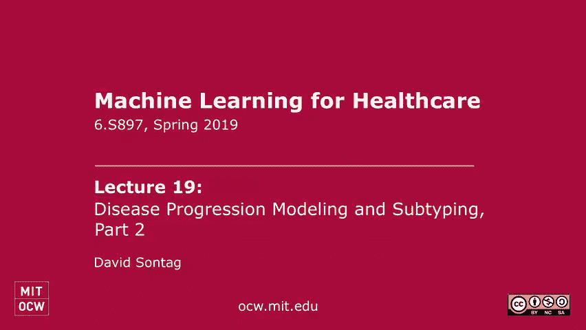


在本节课中，我们将学习如何仅利用横截面数据（即每个个体在单一时间点的观测数据）来推断疾病的发展阶段。我们将探讨其中的核心挑战、基本假设，并介绍两种不同的建模方法：基于概率图模型的方法和基于伪时间排序的方法。

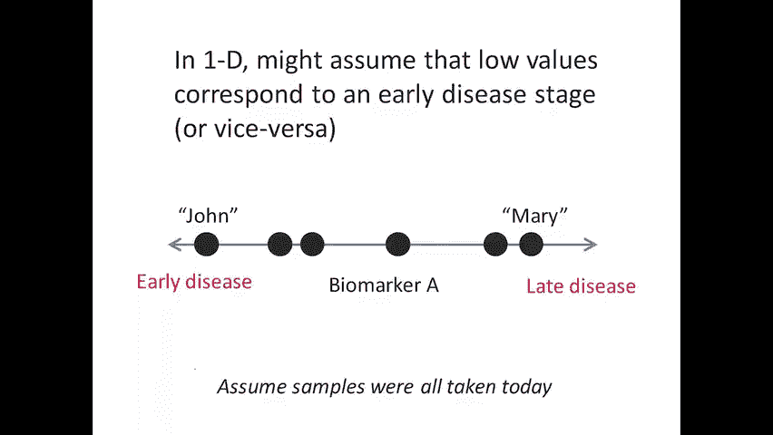

---

## 从直觉开始：一维数据的排序

想象我们有一维数据，每个数据点代表一个个体，我们只在某个时间点观察他们。假设我们确切知道要观察哪个生物标志物。例如，这可能是一个抗体表达水平。

你可以将每个人沿着这条线放置。你可能会猜测，在线的一侧是疾病早期，另一侧是疾病晚期。为什么这是一个合理的猜测？

另一种猜想是什么？为什么不和你的邻居讨论一下，看看能否想出一些替代的猜想？我们的目标是：我们每个人都有一个观测值，每个人都处于疾病的某个未知阶段。我们想对个体进行分类，将其划分为疾病早期和晚期。我给出了一个如何做到这一点的猜想。另一个合理的猜测是什么？


也许区别在于他们患有相同疾病的不同亚型。但在这个例子中，我想坚持一个简单的故事。让我们假设这种疾病只有一种亚型。给定这些数据点，对病人进行分类的另一种方法是什么？也许早期疾病就在这里，当情况恶化时，这个生物标志物开始变得异常，可能向右或向左移动。


根据我们对从人体测量的常见生物标志物及其对疾病进展反应方式的了解，我认为这可能不是一个很自然的猜想，除非你有多种疾病亚型。例如，向右移动的标记对应一种疾病亚型，向左移动对应另一种疾病亚型。另一个猜测会是什么？你们可能错过了简单的一个：可能只有一个高值区域和一个低值区域。完全正确，谢谢。所以这可能是早期疾病，那可能是晚期疾病。


我们都在同一条船上。我们有一些想法，人们可能需要做出哪些假设才能在这里做任何事情。例如，我们可能不得不对连续性做出一些假设：生物标志物可能会逐渐发展，从早到晚，它可能会变得更大，也可能会变小。

如果这真的是我们之前谈到的场景，我们说过早期疾病可能在这里，晚期疾病可能发生在任何一侧。那样的话，人们可以很容易地争辩说，根据我们这里的信息，疾病阶段无法识别，因为你不知道过渡点应该在哪里。是这里吗？这里？这里？事实上，这里也出现了同样的问题：你不知道早期疾病是往这边走还是往那边走。

有什么方法可以解开这个纠缠？假设它只朝这个方向或那个方向，我们怎么才能弄清楚哪个是哪个？我们是否有其他数据？例如，他们还剩多少时间？或者仅仅是年龄？如果我们从一个非常粗略的假设开始：疾病阶段与年龄相关，并且进入研究的人群来自不同的疾病阶段。仅凭这两个假设，你就可以看看这里个体的平均年龄和那里个体的平均年龄。你会说平均年龄较大的是晚期疾病。或者，如果你知道每个数据点对应的死亡时间，你可以比较这些人的平均死亡时间。

我只是想给你一些直觉，说明这在什么情况下是可能的。

---

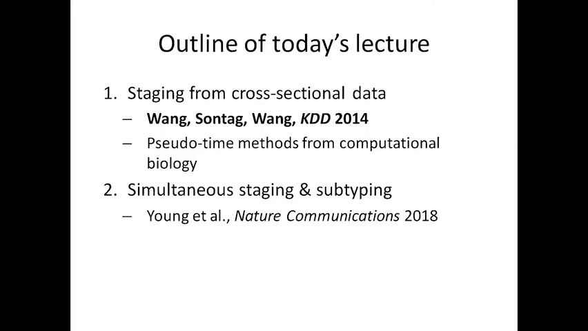

## 挑战升级：二维数据

如果你的数据是这样的呢？现在你有两个生物标志物，维度上升了。我们想知道哪里很早，哪里很晚，这开始变得更具挑战性。

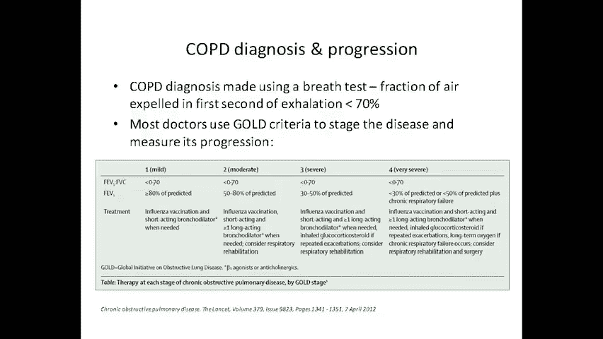

我想让你拥有的直觉是：我们将不得不对疾病的进展做出一些假设，就像我们刚才讨论的那些。我们也必须在某种程度上走运。例如，一个幸运的方法是拥有大量的数据。如果你有海量数据，并且做一个额外的假设：你的数据存在于某个低维流形上，流形的一边是早期疾病，另一边是晚期疾病。那么你可能会从数据中发现那个流形。你可能会猜想流形是这样的（用手勾勒出的轨迹）。但为了做到这一点，你当然需要有足够的数据。

所以现在将是一个权衡：只有横截面数据可能没问题，只要你有很多数据来填满空间，真正识别那个流形。另一种可能很好的方法是：也许你没有纯粹的横截面数据，可能每个病人身上都有两三个样本。然后你可以给这些样本颜色编码。例如，绿色是病人A的第一个、第二个、第三个时间点；红色是病人B的两个时间点；蓝色是病人C的三个时间点。现在，即使数据不密集，我们无法画出曲线，但我们可以开始了解顺序了。我们仍然能够计算出流形可能看起来像这样。

我试图建立关于何时可能从横截面数据建模疾病进展的直觉。但这是一个开放的领域。今天，我会告诉你一些算法，试图建立在做疾病进展建模时的一些直觉。但它们会非常容易崩溃，当我给你的这些假设不成立时，它们就会崩溃。当你的数据是高维的时候，它们就会崩溃。当你的数据看起来像这样，你不仅仅有一个单一的亚型，而是有多个亚型时，它们就会崩溃。这是一个非常活跃的研究领域，我认为在未来几年我们可以取得很大进展。

---

## 案例研究：慢性阻塞性肺疾病（COPD）

我将从我自己工作中的一个案例研究开始，我们在慢性阻塞性肺疾病（COPD）的背景下开发了一个从横截面数据中学习的算法。

COPD是一种通常由空气污染或吸烟引起的肺部疾病。它有一个相当好的分期机制，使用肺活量测定仪测量个体在任何一个时间点的肺功能。例如，第一阶段只包括接种疫苗和必要时使用短效支气管扩张剂；第四阶段则建议吸入糖皮质激素、长期吸氧等。

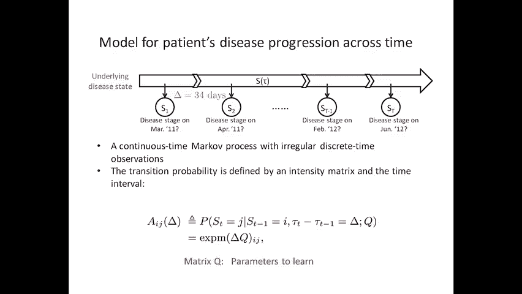

这是一种被合理理解的疾病，因为有很好的分期机制。当我们想了解如何以数据驱动的方式进行疾病分期时，我们应该首先从合成数据开始，或者从治疗一种我们对其真正分期有所了解的疾病开始。这样我们就可以看看我们的算法在这些情况下会恢复什么，是否符合我们的预期。这就是为什么我们选择COPD。

在这项工作中，我们使用电子病历（EMR）中的数据，特别是病人记录的诊断代码。我们假设我们没有肺活量测定仪数据。一般的方法是建立一个疾病进展的生成模型。

在高层次上，这是一个马尔可夫模型。它指定了病人数据随时间的演变分布，根据一些表示疾病阶段和共病的隐藏变量。这些变量总是被假定为未观察到的。我们不会假设我们有很多纵向数据。挑战将是：我们能否利用一到三年的数据，并将其缝合在大量病人身上，以获得这种疾病20年进展的可能图景？


我们要做的是学习这个概率模型的参数，然后从参数中推断病人的实际疾病阶段，从而对他们进行排序，或者模拟来自这个模型的数据，看看20年的轨迹会是什么样子。


---

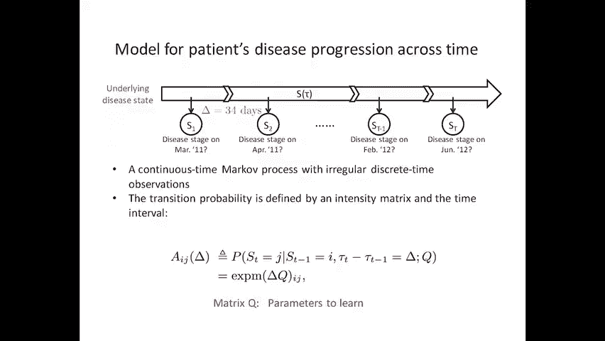

### 模型组件详解

这是病人在任何一个时间点的疾病进展模型。变量 `s_t` 表示病人在时间 `t` 的疾病阶段。我们有一个随机变量，用于我们对病人数据的每一次观察。注意，观察可能发生在非常不规则的时间间隔。

`s_t` 表示模型中的一个离散疾病阶段，可能取值从1到10，其中1表示早期，10表示晚期。这个模型要讨论的是从一个疾病阶段转换到下一个疾病阶段的概率分布。

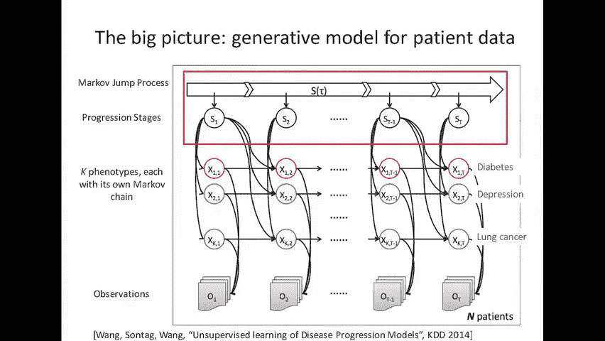

因为阶段之间的时间间隔不均匀，我们必须有一个考虑到时间间隔的转移分布。我们使用连续时间马尔可夫过程。形式上，从时间 `t-1` 的阶段 `i` 转换到时间 `t` 的阶段 `j` 的概率，给定时间间隔 `Δt`，由矩阵指数给出：

```
P(s_t = j | s_{t-1} = i, Δt) = [exp(Q * Δt)]_{i,j}
```

其中 `Q` 是一个矩阵，给出了我们想要学习的参数。

这与典型的隐马尔可夫模型（HMM）形成对比。在典型的HMM中，转移概率通过查找表参数化。这里的故事不同，因为我们不知道时间间隔。直觉上，如果两次观察之间经过了很长时间，我们想允许一个加速的过程，你可能跳过许多阶段。直觉上，这是通过矩阵 `Q` 乘以 `Δt` 的缩放来实现的。

参数的数量实际上是状态数的平方。到目前为止有什么问题吗？这个模型的 `Q` 对所有病人都是一样的。你可能会想象，如果有疾病亚型，每个亚型的 `Q` 可能不同。

你可以预先指定要建模的阶段数。有很多方法可以尝试选择该参数。例如，你可以使用机器学习中的典型模型选择技术。类似于当一个人做主题聚类时，如果你使用非常少的主题数量，你倾向于学习一些非常粗粒度的主题；如果你用更多的主题，你往往会学到更细致入微的概念。同样的故事也会发生在这里。

那么我们知道疾病的分期吗？这在这里很关键。我假设这里的 `s` 变量都是隐变量。我们学习该模型的方式是通过最大似然估计，在那里我们忽略了隐藏的变量，就像你在任何EM类型算法中所做的那样。

---

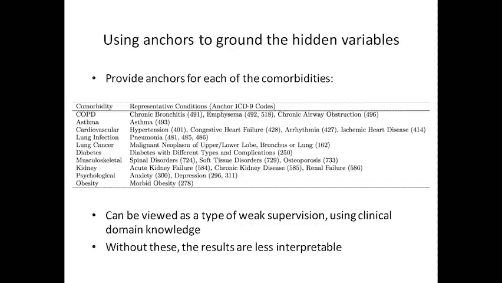

### 水平切片：共病与观测

现在我要讲一个水平切片，即其中一个时间点。你会得到这个模型。这些 `x` 也是隐变量，我们预先指定它们来表征不同的轴，我们想通过它来了解病人的疾病进展。

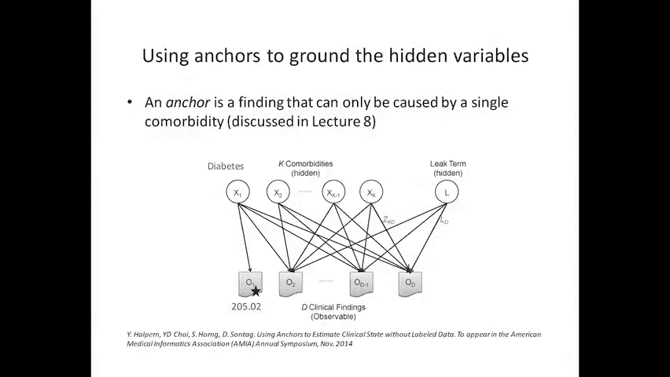

例如，我们可能想了解每个疾病阶段真正独特的地方：病人的内分泌功能如何？精神状况如何？是否患肺癌？等等。我们要问的是，我们希望能够从这个模型中读出，根据这些轴线，病人通常什么时候发展成糖尿病、变得抑郁、患上肺癌等。


挑战是我们从未在数据中观察到这些数量。相反，我们所观察到的只是实验室测试结果、诊断代码或已执行的程序等，我称之为临床发现。诊断代码给你关于病人疾病状况的信息，但它们和诊断不是一回事，因为有太多的噪音和偏见。

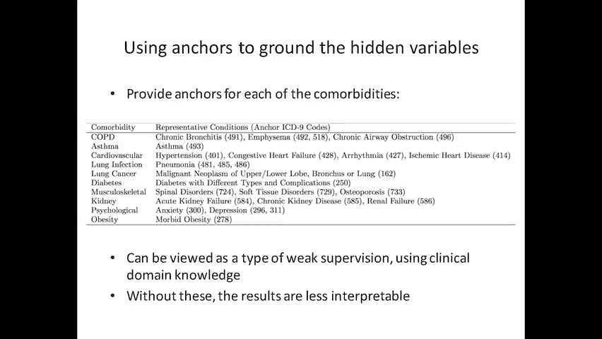

我们要对原始数据建模的方式是使用所谓的噪声或网络。我们假设存在某种生成分布：你看到的观察（如诊断代码）很可能被观察为一个函数，表示病人是否有这些表型或合并症的可能性。概率可以由这些边缘权重来指定。

例如，糖尿病的诊断代码很可能在患者数据中观察到，如果病人真的有糖尿病。但它可能不会记录在每一次访问中。所以这将是一个噪声过程，噪声率将被边缘捕获。

学习算法的一部分是学习转移分布（如Q矩阵），另一部分是学习这种噪声分布的所有参数（即这些边缘权重）。

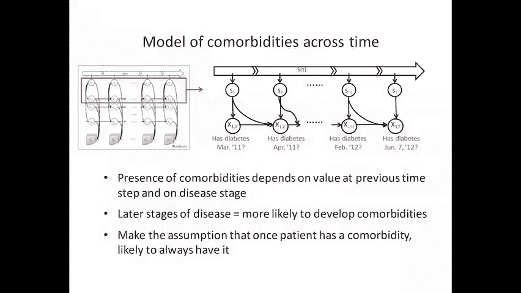

一个关键问题是：如果我想根据这些轴从模型中读出，但这些轴从未在数据中被明确观察到，我如何使学习算法为这些隐变量赋予意义？否则，如果我们让他们不受约束，你做了最大似然估计，就像在任何因子分析类型模型中一样，你可能会发现一些因素，但它们可能不是你关心的因素。

所以我们引入的隐变量，我们使用了一种叫做“锚定”的技术。领域专家会为每一种共病指定一个或多个锚。这些锚是我们将要推测的观察结果，只能由相应的隐藏变量产生。例如，治疗2型糖尿病的诊断代码，只从 `x_1`（糖尿病）有一条边。我们明确地将所有其他从共病到该诊断代码的边缘权重设为零。

我们并不预先指定这个边缘权重是多少，我们要考虑到这可能很吵，它并不总是被观察到。但我们要说，这不能用任何其他共病来解释。因此，对于每一种我们想建模的共病或表型，我们将指定少量锚。这对应于图上的一种稀疏性假设。

我们实际上通过一个迭代的过程来得出了这个锚集合。我们指定了一些隐藏变量具有锚，但也让其中一些没有锚定（自由变量）。我们运行学习算法，发现有一些表型似乎真的以病人的疾病为特征。然后为了深入挖掘，我们与领域专家合作，迭代地发现了所有我们想建模的有趣变量。

---

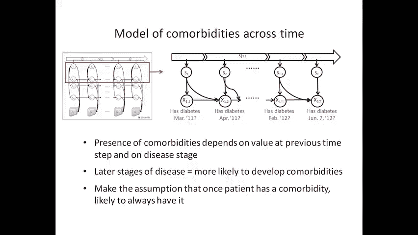

### 垂直切片：表型与疾病阶段的关系

现在我要告诉你这些表型与观察到的疾病阶段有何关系。我们假设，给定疾病阶段 `s`，这些马尔可夫链中的每一个（`x_1` 到 `x_t`）都有条件地相互独立。所以疾病阶段 `s` 把一切都联系在一起。

图形模型显示，中间没有边连接，比如说，糖尿病变量和抑郁症变量。假设这些条件之间的所有相关性都是由疾病阶段变量介导的。这是我们必须做出的一个关键假设。

如果我们不做那个假设，会出什么问题？如果我们有一个看起来像 `x_1` 和 `x_2` 之间有边的完整图，并且有边连接到 `s` 变量。在这种情况下会发生什么？如果我们不假设 `x` 在给定 `s` 时条件独立，那么实际上你甚至不需要阶段变量 `s`，你可以在这些 `x` 变量上拟合任何分布。模型可以学会简单地忽略 `s` 变量。这完全不是我们的目标。

通过假设这些 `x` 变量之间的条件独立性，它会迫使所有的相关性必须由 `s` 变量介导。它将消除一些否则会存在的不可识别性。这是一个微妙但非常重要的一点。

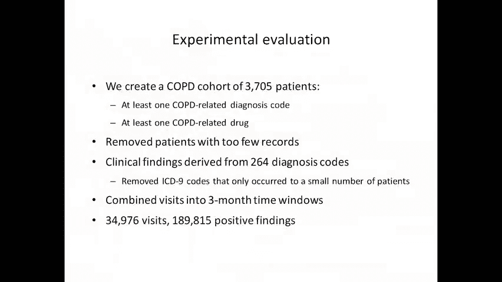

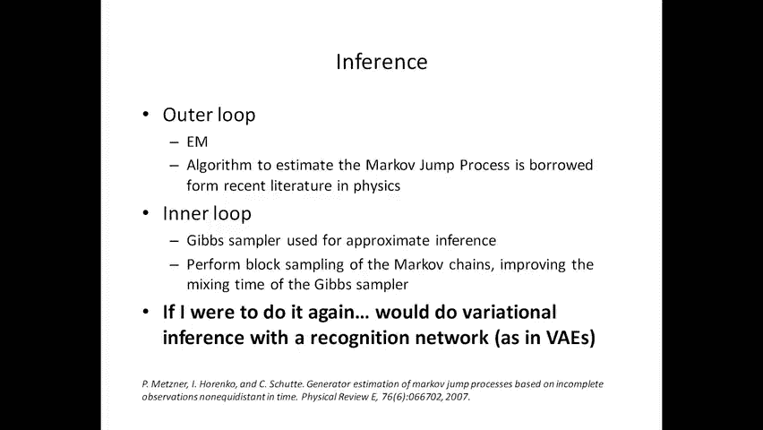

我们要参数化条件分布。首先，我假设这些 `x` 都是二进制的：病人要么有糖尿病，要么没有。我假设一旦你已经有了共病，那你一直都有。我还要做一个假设：疾病的后期更有可能发展成共病。从数学上把它形式化为：

```
P(x_t = 1 | s_t, x_{t-1} = 0) >= P(x_t = 1 | s_{t-1}, x_{t-1} = 0)  当 s_t > s_{t-1}
```

随着你在疾病阶段的进一步发展，你更有可能观察到这些并发症之一。这是我们在学习算法中加入的一个假设。这只是模型参数上的线性不等式，因此可以在凸优化问题中加入此约束。


---

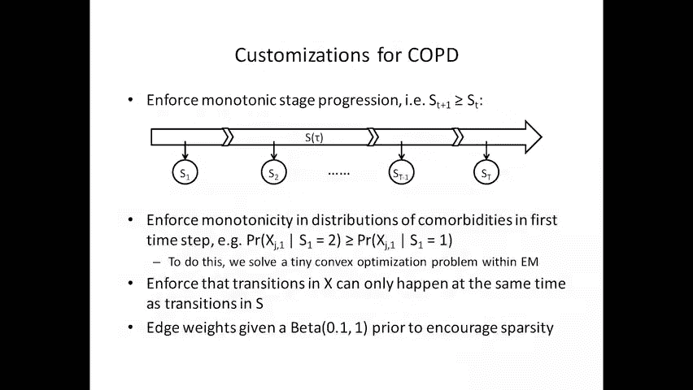

## 学习与评估

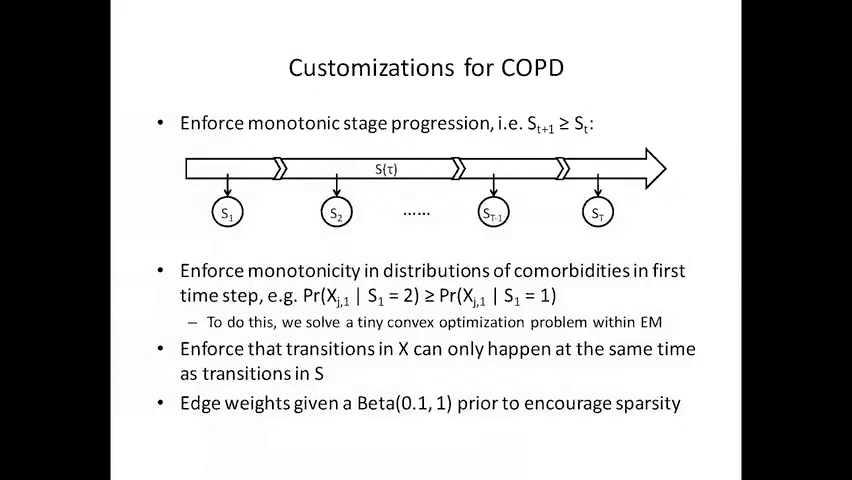

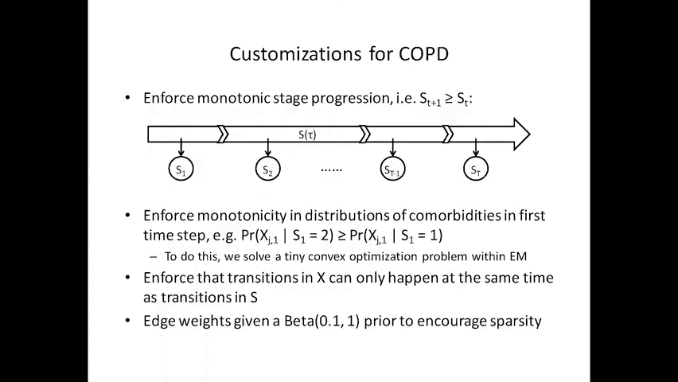

我们使用了近4000名患者的数据集来评估，每个病人只观察了一到三年。我们观察到的是264个诊断代码在任何三个月间隔内的存在或不存在。总共有近20万个诊断代码的观察。

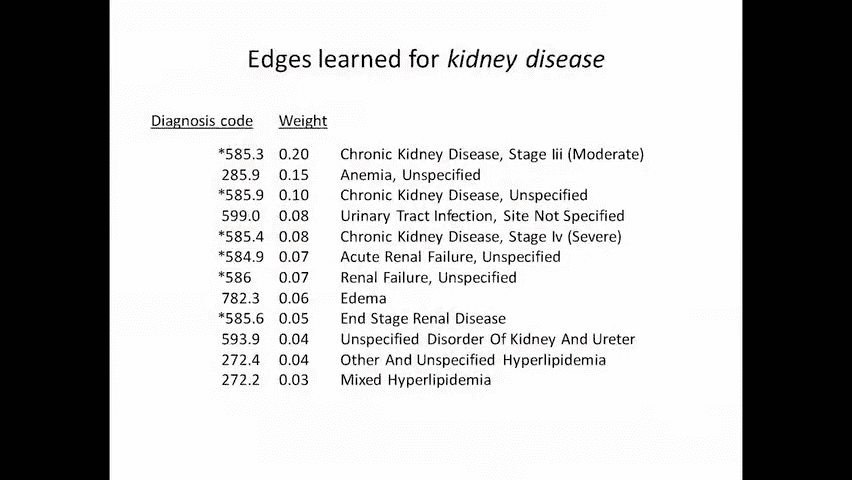

我们使用的学习算法是期望最大化（EM）。在E步中，我们必须做近似推理，因为这个模型不容易处理。我们使用了Gibbs采样器，并结合动态规划算法提高了马尔可夫链的混合速率。在M步中，学习连续时间马尔可夫过程的参数有解析闭形式解。

如果今天再这样做，我会考虑用变分推断来学习具有识别网络的似然下限，类似于变分自动编码器。

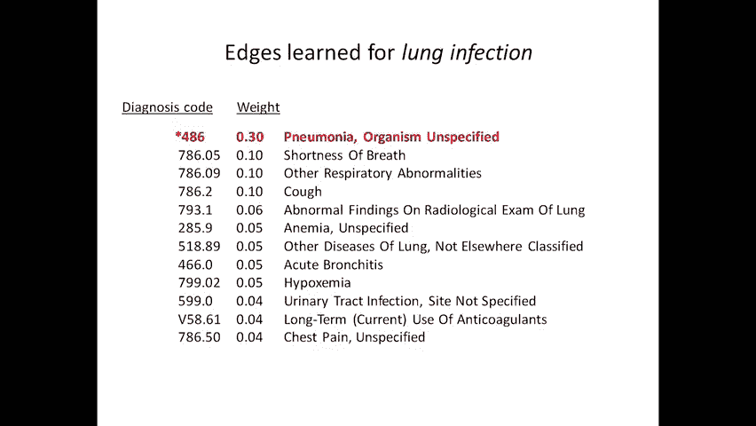

我们还强制了单调的阶段进展，并对共病和诊断代码之间的图进行了稀疏正则化。

---

### 学习结果

以下是一个人学到的。首先，我展示为肾病表型选择的锚变量。你会注意到几件事：权重都远小于一，这意味着观察病人的诊断代码时有噪音。你还看到许多其他的诊断代码可以被肾病共病解释，如贫血、尿路感染等，这与医学文献一致。

另一个例子是肺癌。我们为肺炎指定的只有一个锚，但学习算法自动关联了许多其他东西。

那么你如何知道基本真相？这就是学习算法正在做的。这些权重是学会的。这看起来很像你在文本语料库上进行主题建模时看到的：你会发现一个主题（类似于一个共病），以及一个词主题分布（类似于诊断代码的分布）。

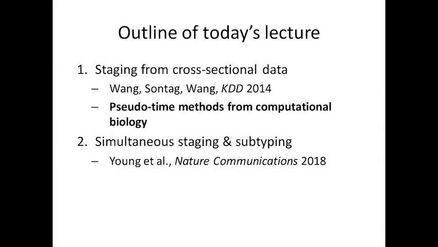

人们可以用这个模型来回答几个最初的问题。第一个是：给定病人的数据，推断病人何时开始患上这些共病，以及在数据收集的三年时间范围内，病人在任何一个时间点处于疾病的什么阶段。模型可以推断病人从第一阶段开始，大约半年后过渡到COPD第二阶段。

使用这个模型可以做的另一件事是根据模型进行模拟，回答“这种疾病20年的轨迹看起来像什么”的问题。这里我展示十年的轨迹。我们扔掉了所有的诊断代码，只关心我们猜测的病人到底发生了什么（那些在训练中没有观察到的 `x` 变量）。

我们推测，肾脏疾病在疾病的第一阶段非常罕见，并随着从第二阶段过渡到第三、四期而缓慢增加，然后在疾病的第五和第六阶段真的变得普遍。在疾病的第六阶段，超过60%的人有肾病。

这里的时间间隔是根据模型学习到的参数，从一个阶段过渡到下一个阶段所需的平均时间来选择的。你可以看到阶段一、二、三、四之间的转换需要很长时间，而从第四阶段到第六阶段之间的转换时间很短。

对于其他共病：橙色/黄色是糖尿病，黑色是肌肉骨骼状况，红色是心血管疾病。有趣的是，学习算法得出的推论是：即使在COPD的第一阶段（轨迹的早期），也有大量心血管疾病患者。这是可以从医学文献中看到的东西。这只是一个合理性检查，表明模型对一种常见疾病的学习符合医学知识。

这就是我想说的关于基于横截面数据的疾病进展概率模型方法。

---

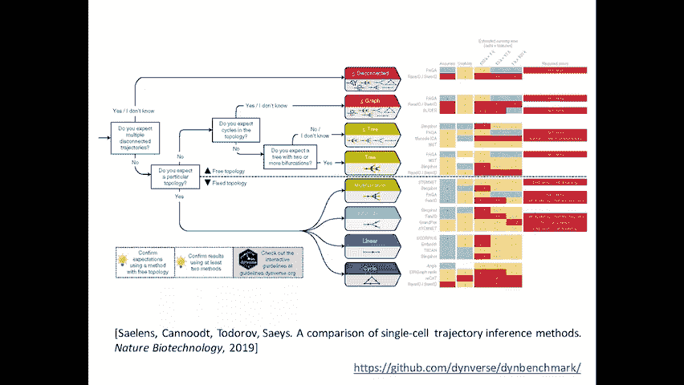

## 伪时间方法

接下来我想谈谈伪时间方法。这是一种非常不同的方法，试图将患者（或细胞）纳入疾病的早期和晚期阶段。这些方法在过去五年里真正普及了，由于生物界单细胞测序实验的爆炸式增长。

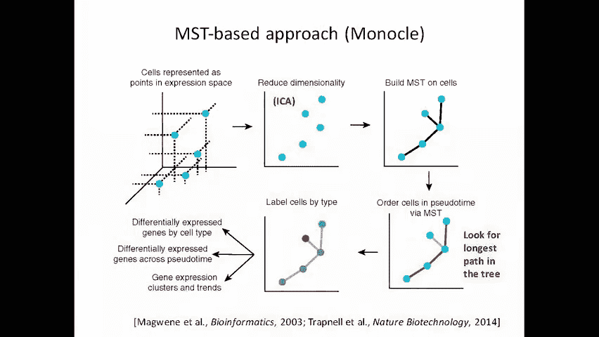

单细胞测序旨在理解每个细胞中表达的是什么。在一个非常高的水平上，你取一个固体组织，分离出单个细胞，提取RNA，进行条形码标记、混合、测序，然后解析每个细胞的RNA表达。

这些伪时间算法的目标是获取那种类型的数据，然后试图将细胞排列到某个轨迹上。在现实世界中，细胞随着时间的推移而进化。考虑到你有横截面数据（一组处于不同阶段的细胞），你能以某种方式将它们排列到它们处于不同分化阶段的地方吗？这就是我们想要的目标。

一旦你把细胞排列成阶段，你就可以回答一些非常有趣的科学问题。例如，你可以问各种不同的基因在哪些时间点表达。你可以看到基因A在细胞分化的早期表达非常高，在最后表达不多。这可能会给你新的生物学见解。

这些方法可以立即应用于疾病进展模型。把每个细胞想象成现在的病人，观察数据是该细胞的基因表达。在我们的医疗数据中，观察可能是症状。目标是给出这些横截面观察来对它们进行分类。一旦你进行了排序，你就可以回答科学问题。

有许多不同的方法来解决这个问题。本月早些时候刚刚发表的一篇论文比较了这些不同的轨迹推断方法。这些算法所做的一些假设包括：是否存在多个断开的轨迹（对应不同亚型）？轨迹的拓扑结构是线性的、分叉的，还是循环的？

在临床环境中，分叉可能意味着病人在疾病早期看起来一样，但突然发生了一些事情，导致一些病人往这边走，有些病人走那条路。例如，也许这些病人得到了治疗A，那些病人得到了治疗B。我们甚至可能没有关于病人接受了什么治疗的好数据。那么您可能希望能够直接从数据中发现分叉，然后回到数据的原始来源，找出在这个时间点上是什么区分了这些病人。

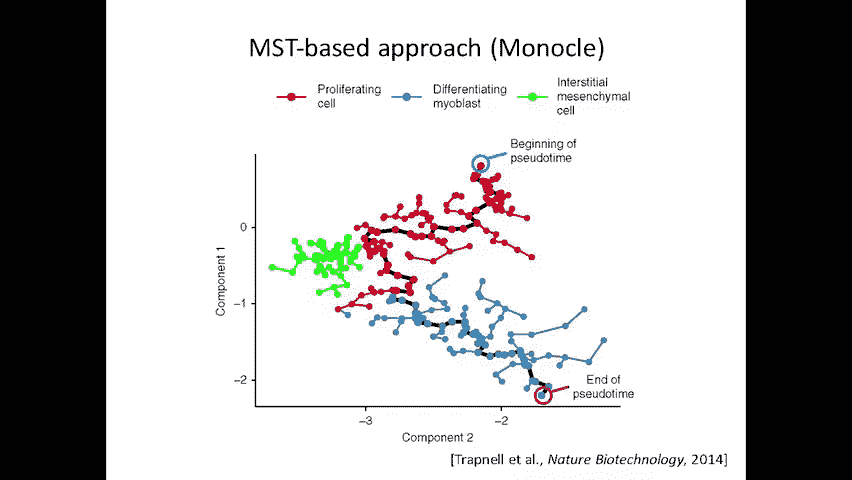

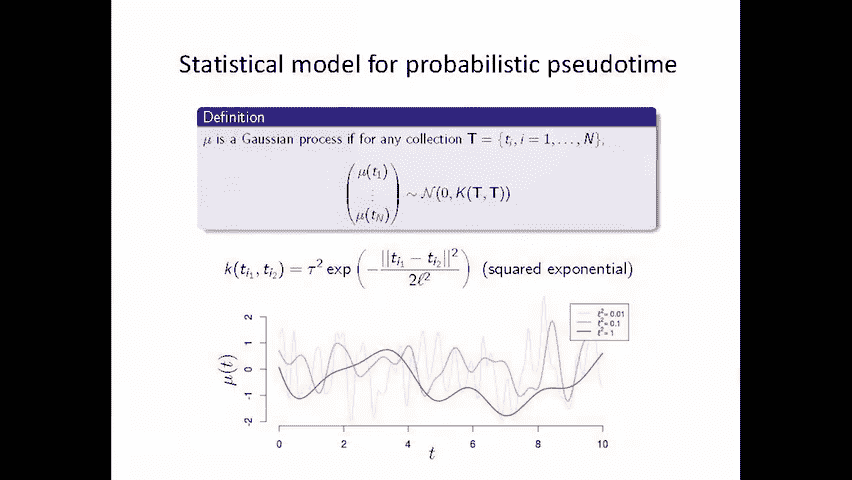

---

### 方法一：最小生成树（Monocle）

我选择两种方法作为代表性例子。第一种是基于构建最小生成树的方法，例如2014年发表的Monocle算法。

该算法的工作方式如下：
1.  **降维**：从横截面数据开始。第一步是进行降维（如主成分分析PCA或独立分量分析ICA）。本文采用独立分量分析。
2.  **构建图**：在低维空间（通常是二维）中表示所有数据点（细胞）。在每对节点之间绘制一条边，边的权重是两点之间的欧几里得距离。
3.  **最小生成树**：找到该加权图的最小生成树（连接所有节点的树，且总边权重最小）。
4.  **寻找最长路径**：在那棵树上寻找最长的路径。在树上找到最长路径是容易的（不是NP难）。路径的一侧对应于早期阶段，另一侧对应于晚期阶段。该方法可以处理分叉。
5.  **确定起点/终点**：你需要某种方法来区分起点和终点。一些附带信息（如已知的早期/晚期标记）可能变得有用。

这是一个概念上非常简单的方法。

---

### 方法二：高斯过程（GP）

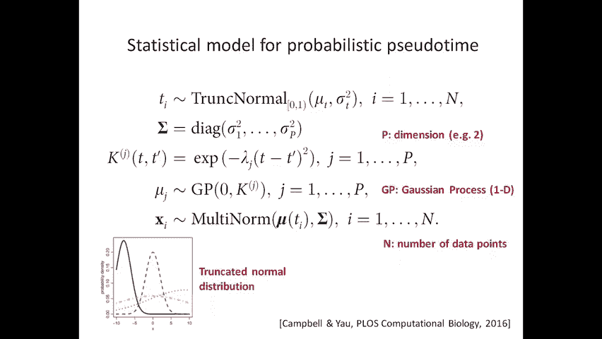

接下来我想谈谈一种不同的方法，它试图回到我们之前在讲座中使用的概率方法。这种新方法基于高斯过程。


高斯过程（GP）是函数的分布。对于任何有限的时间点集合 `{t_1, ..., t_n}`，函数在这些点的值 `[f(t_1), ..., f(t_n)]` 的联合