# 20：精准医学 🧬

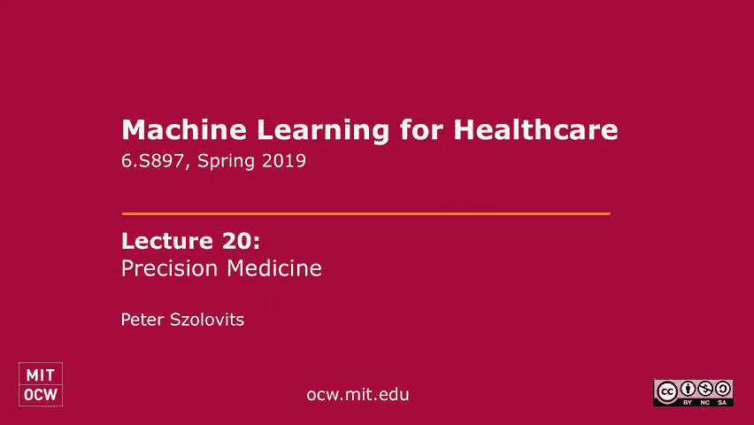

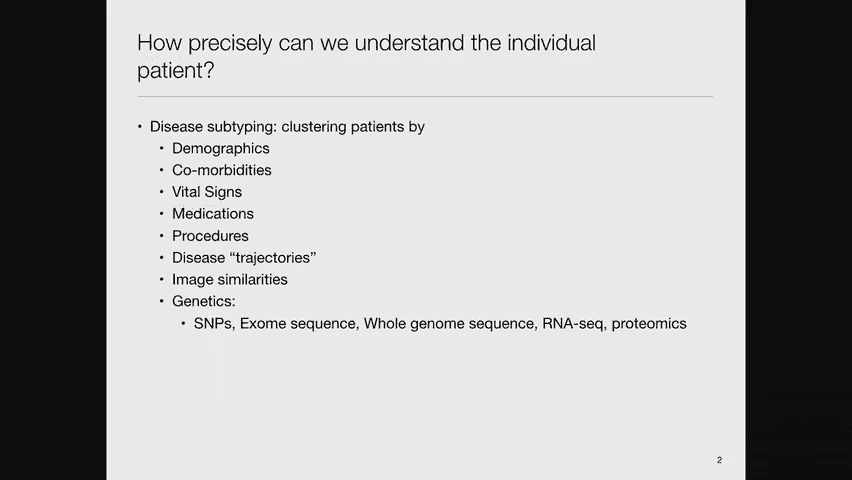

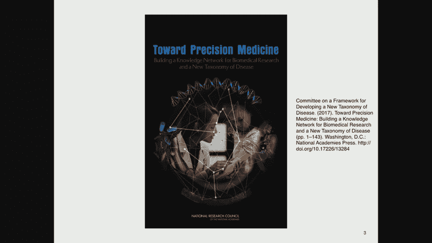

在本节课中，我们将要学习精准医学的核心概念、技术基础以及如何利用遗传学等分子数据进行疾病亚型分析和个性化治疗。我们将从精准医学的定义出发，探讨其兴起的原因，并深入讲解遗传学基础、数据分析方法以及当前的研究挑战。

---

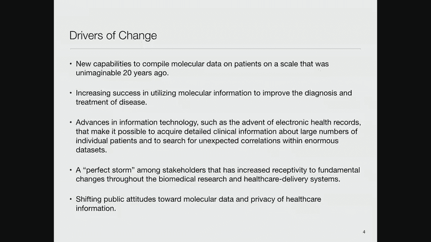

## 什么是精准医学？

精准医学旨在根据个体的基因、环境和生活方式等特征，为其提供量身定制的疾病预防、诊断和治疗方案。其核心在于对疾病进行更精细的亚型划分，而非将一种疾病视为单一实体。

上一节我们介绍了精准医学的目标，本节中我们来看看如何实现疾病的亚分型。

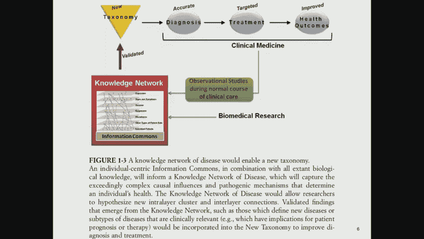

疾病亚分型通常通过聚类分析实现。我们可以在多种数据上进行聚类，例如：
*   人口统计数据
*   共病情况
*   生命体征
*   用药与治疗程序
*   疾病发展轨迹
*   图像相似性
*   遗传学数据

当前，遗传学数据是精准医学的重点，因为人类基因组计划带来了巨大希望：随着我们对基因如何影响疾病的了解加深，将有助于我们为各种疾病找到精确的治疗方法。

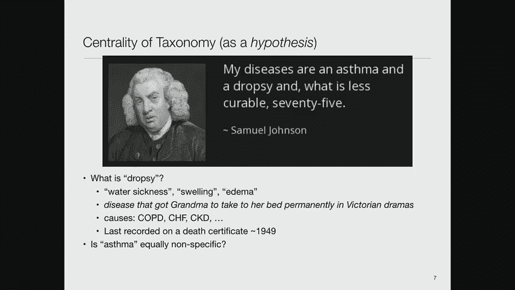

---

## 精准医学为何在当下兴起？

精准医学的理念并非全新，但其在近年来的蓬勃发展得益于多种因素的结合。

以下是一些关键的驱动因素：
*   **分子数据获取能力**：如今以极大规模获取患者分子数据的能力是20年前难以想象的。第一个人类基因组测序耗资约30亿美元，而现在成本已降至1000美元以下。
*   **诊断与治疗的成功**：利用分子信息改进诊断和治疗已取得越来越多成功案例。
*   **大数据处理能力**：我们拥有了更强大的能力来处理所谓的大数据。
*   **利益相关者的迫切需求**：美国医疗系统费用持续上升，但质量并未同比提高，这使得各方都迫切寻求新的解决方案。
*   **公众态度的转变**：公众对收集和使用个人分子数据的态度变得更加开放，因为他们看到了潜在益处可能大于风险。

---

## 数据整合与知识公地

一份来自美国国家科学院国家研究委员会的报告提出了一个愿景：像“谷歌地图”整合地理信息一样整合医疗数据。

在谷歌地图中，经纬度坐标系可以叠加邮政编码、建筑、人口普查区、交通等各种信息。在医疗领域，对应的“坐标系”是**个体患者**。

以下是需要整合的各类患者数据：
*   微生物组数据
*   表观基因组数据
*   基因组数据
*   临床体征与症状
*   环境暴露数据

基于此愿景，美国国立卫生研究院（NIH）启动了“我们所有人”研究计划，旨在招募100万志愿者，持续收集其遗传、临床、环境等多维度数据，以构建一个代表美国人口多样性的“知识公地”，为生物医学研究奠定基础。

---

## 疾病分类的演变与挑战

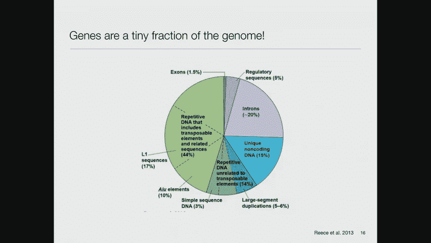

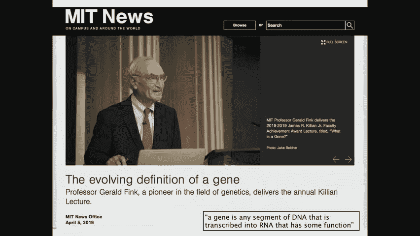

疾病定义本身并非一成不变。历史上，“水肿”曾被视为一种疾病，但现在它被理解为多种潜在疾病（如肺病、心衰、肾病）所表现出的症状。同样，现今定义的“哮喘”未来也可能被细分为多种具有不同根源的亚型。

精准医学的目标正是要深入探究这些症状背后的精确原因。

上一节我们讨论了疾病定义的复杂性，本节中我们来看看如何利用数据空间来识别异常。

我们可以将每位患者的所有数据投射到一个高维的“精准医学模态空间”中。数据在这个空间中通常不会均匀分布，而是聚集在低维流形上。

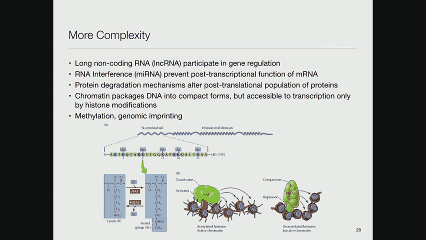

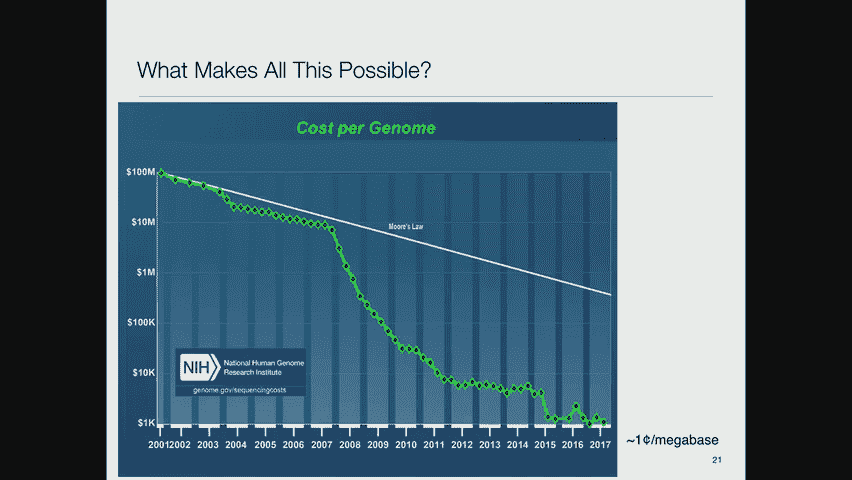

分析的关键在于识别这些数据簇。如果一个患者落在某个簇的中心，可能代表其对该簇所代表的亚型是“典型”的；若落在簇的边缘或之外，则可能意味着有异常情况发生，值得深入调查。

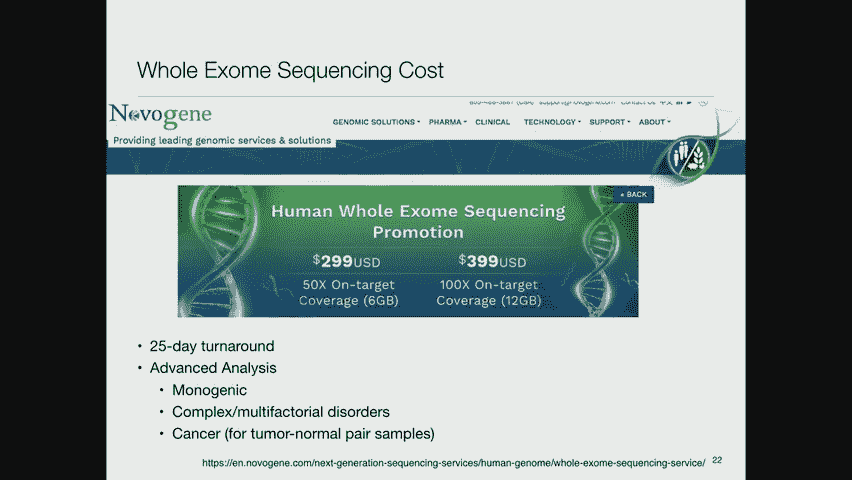

---

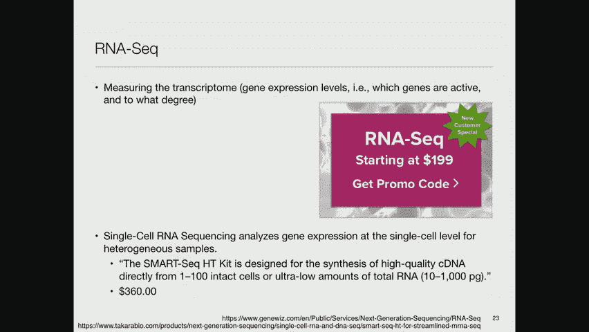

## 遗传学基础回顾 🧬

理解精准医学需要基础的遗传学知识。遗传信息传递的核心流程遵循中心法则。

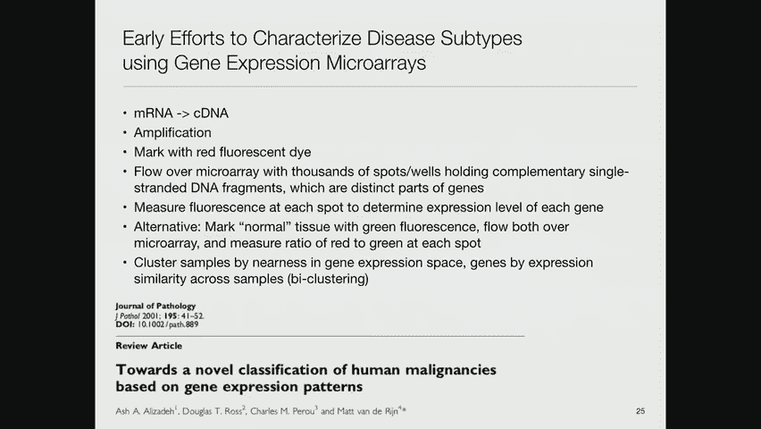

**中心法则**描述了遗传信息流动的方向：
`DNA --(转录)--> RNA --(翻译)--> 蛋白质`

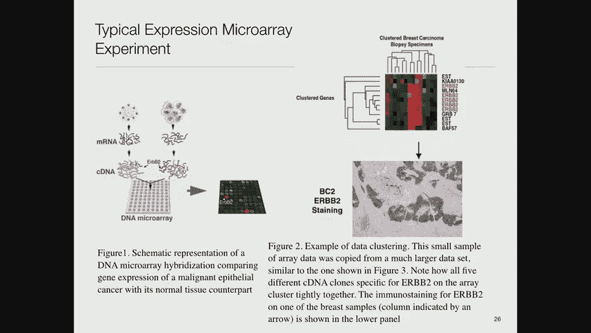

以下是关键概念和步骤：
1.  **DNA结构**：DNA是双螺旋结构，由碱基对（A-T, C-G）组成。
2.  **基因**：基因是遗传的基本单位，是DNA上编码特定功能产物（RNA或蛋白质）的片段。
3.  **转录**：以DNA为模板合成RNA的过程。
4.  **翻译**：以RNA为模板，在核糖体内合成蛋白质的过程。
5.  **基因调控**：启动子、增强子、抑制子等区域通过调控转录速率来控制基因表达水平。

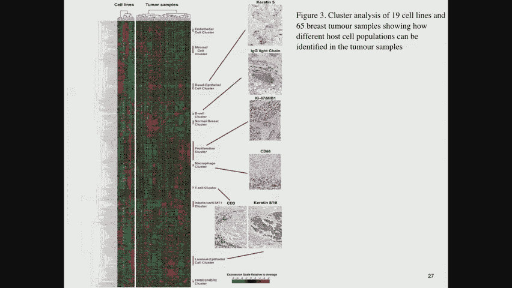

人类基因组中只有约1.5%的DNA是编码蛋白质的外显子。其余大部分非编码DNA的功能尚未完全明确，但它们绝非“垃圾DNA”，可能参与基因调控等关键功能。

现代观点认为，任何被转录成RNA并具有功能的DNA片段都可被视为基因，其产物不一定必须是蛋白质。

---

## 技术进步与成本下降

基因测序成本的下降速度甚至超过了摩尔定律，这是推动精准医学发展的关键。

第一个人类基因组测序耗时多年，耗资约30亿美元。如今，全基因组测序成本已降至数百美元。仅对蛋白质编码区（外显子组）进行测序，成本可低至299美元。甚至对单个细胞的RNA进行测序也已成为可能，成本约每个细胞3.5美元。

许多公司还提供高级分析服务，将测序数据与数据库关联，分析遗传模式，并为临床决策（尤其是在癌症治疗中）提供用药指导建议。

---

## 利用基因表达数据进行疾病分型

微阵列和测序技术允许我们大规模测量基因表达水平，从而对疾病进行分子层面的分型。

一项开创性研究（Alizadeh et al., 2000）对淋巴瘤样本进行基因表达聚类分析，成功区分了已知的淋巴瘤亚型，证明了该方法的有效性。

另一项针对乳腺癌的研究（Sorlie et al., 2001）将样本聚类为5个亚型，后续分析显示这些亚型具有显著不同的患者生存率。这表明仅基于基因表达数据的聚类，就能发现具有临床意义的疾病分类。

---

## 全基因组关联研究（GWAS）与表型全关联研究（PheWAS）

为了寻找基因与表型（疾病或特征）之间的关联，主要有两种分析思路。

**全基因组关联研究（GWAS）**：从特定表型出发，在全基因组范围内寻找与之相关的遗传变异（如单核苷酸多态性SNP）。结果常以“曼哈顿图”展示，每个点代表一个基因位点与表型关联的显著性。由于同时检验数百万个假设，需要进行多重检验校正（如Bonferroni校正）。

**表型全关联研究（PheWAS）**：与GWAS思路相反，从特定遗传变异出发，在全表型范围内寻找与之相关的疾病或特征。这有助于发现一个基因变异可能参与的多种生物学过程或疾病。

需要注意的是，GWAS发现的许多遗传变异虽然具有统计学显著性，但其效应量（如比值比）往往很小（例如1.1），远低于吸烟导致肺癌的效应量（比值比约为8）。因此，解释和应用这些发现时需要谨慎。

---

## 从遗传变异到基因表达：eQTL与贝叶斯网络

遗传变异如何影响表型？一个重要的中间环节是基因表达。表达数量性状基因座（eQTL）研究关注遗传变异与基因表达水平之间的关联。

我们可以建立**贝叶斯网络**模型来刻画多变量间的因果关系。例如，模型可以描述：遗传变异（G）影响基因表达水平（E），进而影响疾病状态（D）。通过比较不同模型结构（如 G->E->D, G->D->E, G->E & G->D）对数据的拟合程度，可以推断最可能的潜在关系网络。

---

## 大规模生物数据库与未来方向

英国生物银行（UK Biobank）等大型前瞻性队列研究收集了数十万参与者的基因、影像、行为、电子健康记录等多维度数据，为大规模GWAS、PheWAS等研究提供了宝贵资源。

**基因集富集分析（GSEA）** 是一种重要的分析策略。它认为基因通常以通路或功能集的形式协同作用。GSEA不关注单个基因，而是检验预先定义的基因集合（如参与某个代谢通路的所有基因）是否在与表型相关的基因列表中显著富集。这有助于从系统层面理解生物学机制。

目前，精准医学的数据分析仍大量依赖于聚类、矩阵分解（如非负矩阵分解）、贝叶斯网络等经典机器学习方法。尽管深度学习在其它领域取得巨大成功，但在解析复杂基因-表型关系方面，尚未出现公认的、性能显著超越传统方法的“杀手级”深度神经网络应用。这仍是未来重要的探索方向。

---

## 总结

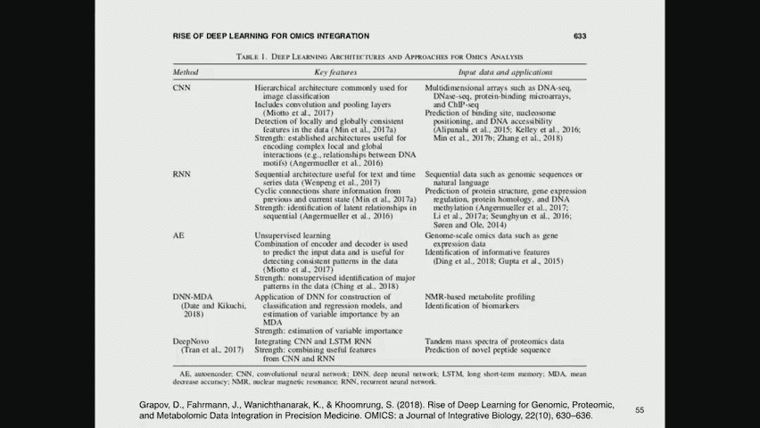

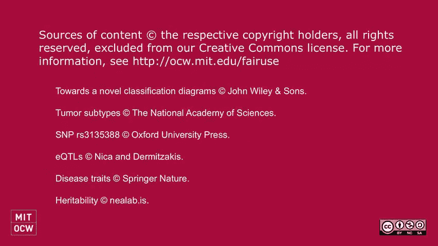

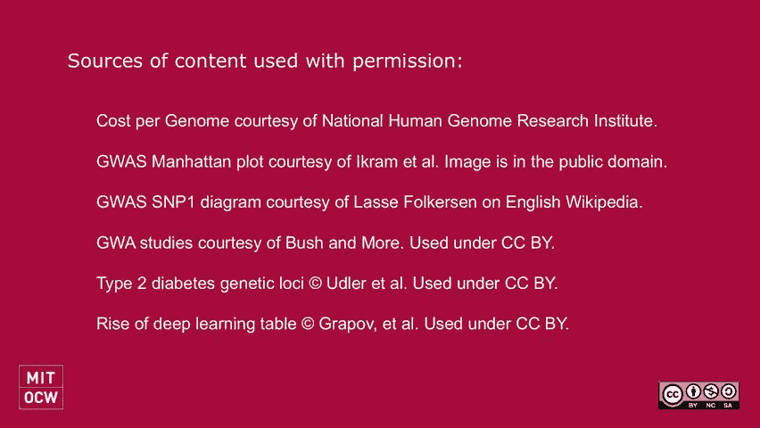

本节课中我们一起学习了精准医学的核心理念与技术基础。我们了解到，精准医学通过整合多组学数据（尤其是遗传学数据），利用聚类、GWAS、PheWAS、贝叶斯网络等分析方法，旨在实现对疾病的精细分型和个性化治疗。尽管面临效应量小、数据整合复杂等挑战，但随着测序成本下降和大规模生物数据库的建立，精准医学正在逐步从概念走向临床实践，为改善医疗效果带来了新的希望。