# 21：自动化临床工作流 🏥

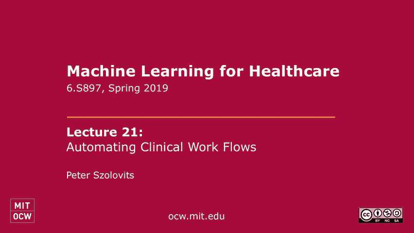

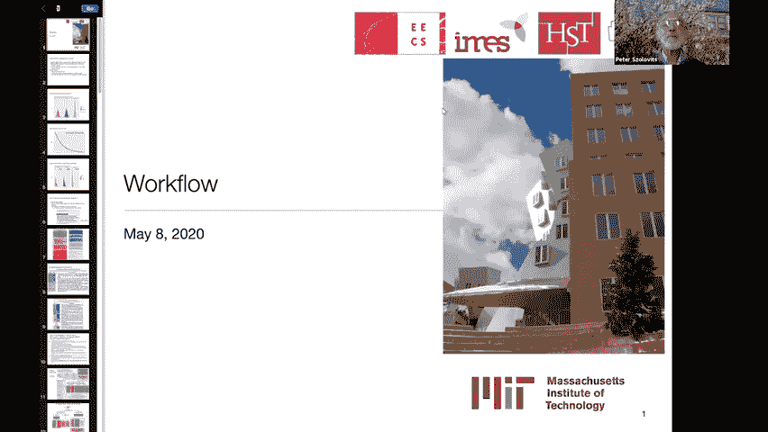

在本节课中，我们将要学习如何通过自动化工作流来改善医疗保健系统。我们将探讨从制定临床指南到利用数据挖掘和机器学习技术来标准化和优化医疗实践的各种方法。

---

## 工作流的重要性与目标

当我开始在这个领域工作时，我并没有意识到工作流这个话题的存在。但在埋头苦干了几十年后，我意识到这是医疗保健中一个显而易见且需要注意的关键方面。

我们在这门课上的目标是改善医疗保健。那么，如何才能做好呢？

在20世纪70年代，当我们开始这项工作时，有一个想法是：我们想了解世界上最好的专家做得最好的是什么。我们希望通过封装他们关于如何做诊断、如何做预后和治疗选择的专业知识，来提高其他非世界级专家的医生的表现。通过在计算机系统中捕获世界级的专业知识，帮助人们找出如何做得更好。这里的真正目标是提高医疗保健系统中每个人的平均表现。我们常说，要把大家的行医水平都提升到更接近世界一流专家的水平。

然而，事实证明，提高平均表现并非最重要的事。后来出现了另一个想法：真正糟糕的是低于平均水平的表现。如果你的表现低于平均水平会导致病人死亡，而你高于平均水平的表现只会在他们的结果中产生适度的差异，那么关注那些最糟糕的医生并让他们以更好的方式行事显然更为重要。

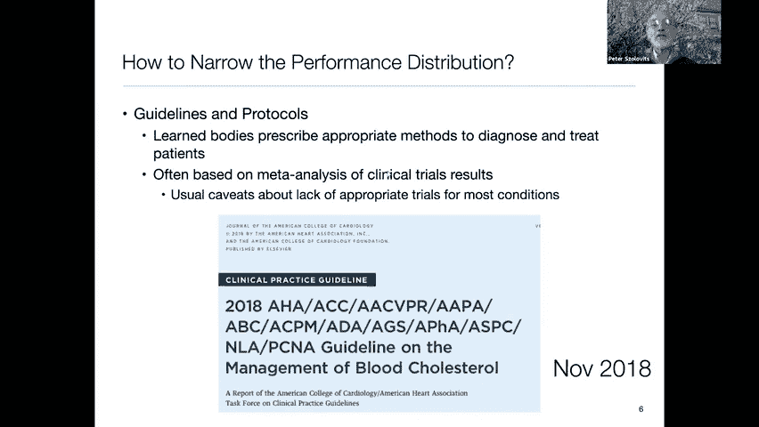

因此，诞生了“协议”的概念。该协议主张用相似的方法治疗相似的病人。其核心价值是减少方差。那么，提高平均值与减少方差，哪一个更好呢？这取决于你的损失函数。如果你的损失函数是不对称的，即表现不佳或低于平均水平带来的负面影响远大于表现高于平均水平带来的正面影响，那么减少方差的协议思想就至关重要。这几乎是医疗系统所采用的方法。

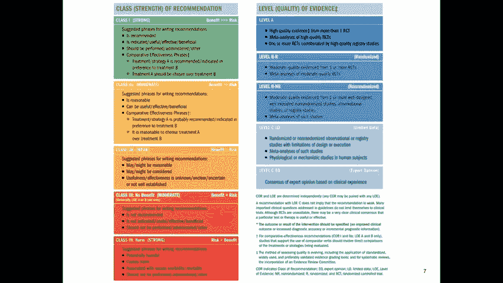

为了帮助你想象，假设在某种任意的尺度上（例如从0到8），我们有一个通常的正态分布。左边是表现不佳的行为，右边是世界级专家的表现（可能在6或7），而表现很差的医生可能在0到1之间，普通医生则在4左右。

这里有两种情况：
1.  第一种情况是我们把普通医生的表现提高一点点。
2.  第二种情况是我们显著地减少方差，使这个正态分布变得更窄，平均值不变，但消除了表现极端的离群值。

在第二种情况下会发生什么？你需要看看成本函数。假设有一个成本函数，在零水平上表演的人成本极高，而在八级水平上表演的人成本几乎为零，成本呈指数级下降。这表明，如果你能把人们的表现聚集在一个更窄的范围内，你的总成本会下降。在一个假设模型中，通过缩小分布，可以将总成本降低到比单纯提高平均水平更低的水平。

这并不能证明这是正确的想法，但证据可能在于这样一个事实：医疗系统已经采用了这一点，并决定让所有的医生表现得更像普通医生，是改善医疗保健的最佳实际方法。

---

## 如何缩小绩效分布：指南与协议

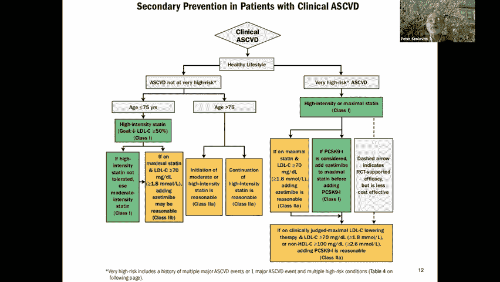

那么，如何缩小绩效分布呢？一种方法是制定指导方针和协议。由一个博学的机构规定诊断和治疗病人的适当方法。

例如，2018年11月，美国心脏病学会和美国心脏协会临床实践指南特别工作组发布了血液胆固醇管理的指南。高胆固醇是危险的，会导致心脏病发作和中风，因此降低人们的胆固醇水平是共识。

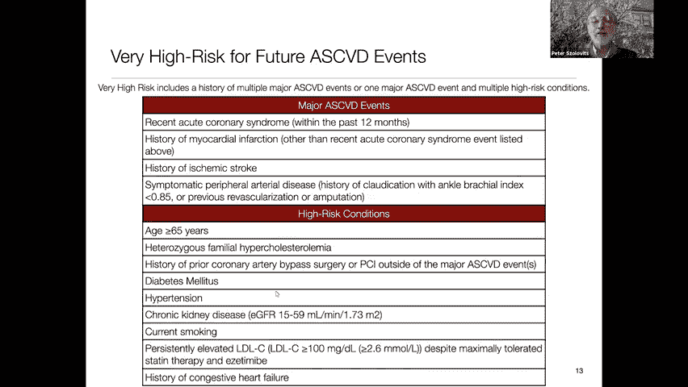

他们做的第一件事是，提出了一个颜色编码的概念，说明推荐有多强烈，以及另一种阴影编码，说明证据的水平。

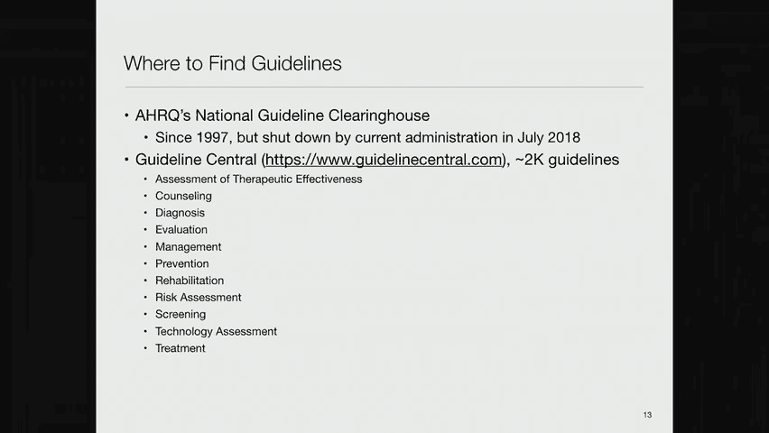

以下是推荐力度的分类：
*   **I类（强烈推荐）**：使用“推荐”、“指示”、“有用”、“有效”、“有益”、“应该执行”等词。
*   **IIa类（获益远大于风险）**：使用“这是合理的”、“它可能很有用”等词。
*   **IIb类（获益可能等于或略大于风险）**：使用“可能是合理的”、“可以考虑”等词。
*   **III类：无获益（风险等于获益）**：使用“不推荐”等词。
*   **III类：有害（风险大于获益）**：使用“有潜在的危害”、“造成伤害”等词。

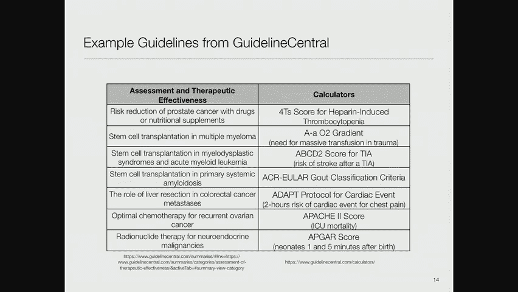

以下是证据水平的分类：
*   **A级（高质量证据）**：来自多项随机对照临床试验或高质量RCT的荟萃分析，并得到高质量登记研究的证实。
*   **B级（中等质量证据）**：来自单项随机试验或非随机研究。
*   **C级（低质量证据）**：基于临床经验的专家意见共识，但没有任何形式的分析。

在这份胆固醇指南中，有关于测量低密度脂蛋白和非高密度脂蛋白胆固醇的建议。对推荐的信心是A级，基于高质量证据。它建议在20岁或以上的成年人中，无论是否空腹，都可以进行血脂测量。

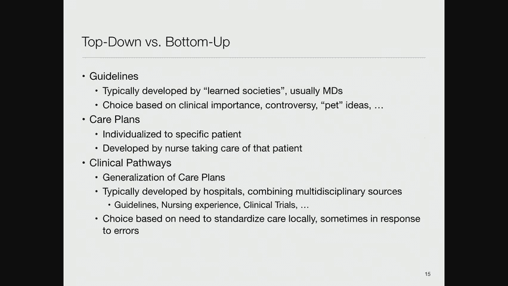

另一个例子是关于继发性动脉粥样硬化性心血管疾病的预防（针对已经生病的人）。其中一条建议是：对于75岁或以下的冠状动脉疾病临床病例，应开始或继续高强度他汀类药物治疗，目标是减少50%或更多的低密度脂蛋白。

这很大程度上是学术团体现在试图影响医学实践的方式，目的是减少差异，让每个人都以标准化的方式行事。

你可能看过关于阿图尔·加万德（Atul Gawande）的文章，他是波士顿的外科医生，因提倡使用核对表而声名鹊起。他说，外科医生应该像飞行员一样，在手术前通过一个检查清单来确保所有系统正常工作。这在外科手术中意味着确保拥有所有必要的设备，并知道在各种潜在紧急情况下该怎么办。

我从一篇论文中摘录了这些总结建议：
1.  在所有人中强调心脏健康的生活方式。
2.  在已经生病的人身上，使用高强度他汀类药物治疗以降低低密度脂蛋白。
3.  对于高风险患者，使用每分升70毫克的阈值。

这些是总结建议，希望医生阅读这些文章后，在与病人互动时能记住并遵循。论文中还抽象出了流程图，指导医生根据患者的年龄和风险评估进行分类，并对不同类别给出不同的治疗建议。

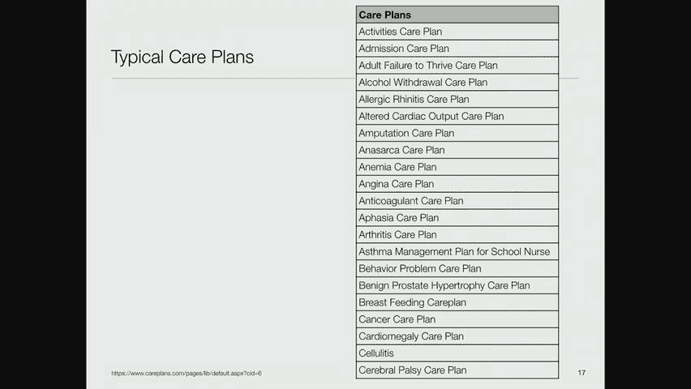

然而，当这样的论文发表时，医生实际遵循这些建议的情况有多好呢？答案是不太好。通常需要很多年，这些建议才能被大多数医疗社区接受。例如，大约二十年前，有建议说任何心脏病发作的人都应该接受β受体阻滞剂治疗，即使他们现在没有症状，因为这能减少约35%的重复心脏病发作。但花了十几年时间，大多数医生才开始向病人提出这种建议。

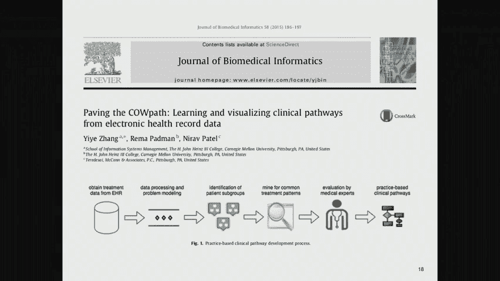

---

## 指南的存储与获取：国家交换所

有一个叫做AHRQ（医疗保健研究与质量局）的机构。在本届政府之前，他们运营着一个国家指南交换中心（National Guideline Clearinghouse），发布由不同当局制定的、可供下载和使用的指南。在政府关闭该中心后，指南中心（Guidelines Central）试图接管其中的一些角色。他们的网站上发布了大约2000条指南。

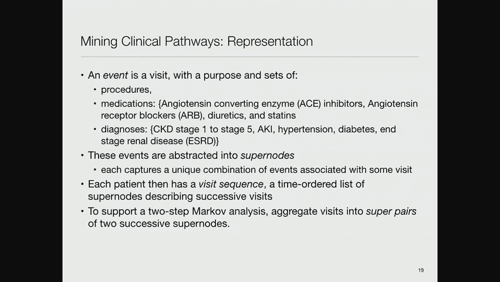

以下是一些例子：
*   通过药物或营养补充剂降低前列腺癌的风险。
*   干细胞移植治疗多发性骨髓瘤。
*   骨髓增生异常综合征和急性髓系白血病的干细胞移植。

他们还发布了许多风险计算器。执业医生或医院可以去获取这些指南，并鼓励或强制医生使用它们来确定诊疗活动。

这是一种自上而下的活动，通常由学术团体将专家聚集在一起思考正确的做法，然后告诉世界其他地方怎么做。

---

## 自下而上的活动：护理计划与临床路径

但也有一种自下而上的活动，例如护理计划。护理计划实际上是一个护理学术语。在医院里，真正持续照顾病人的是护士。护士们开发了一套方法来确保他们照顾好病人，其中之一就是制定这些护理计划。

临床路径则是试图将护士在照顾个人时使用的护理计划进行概括，找出照顾特定病人群体的典型方式。

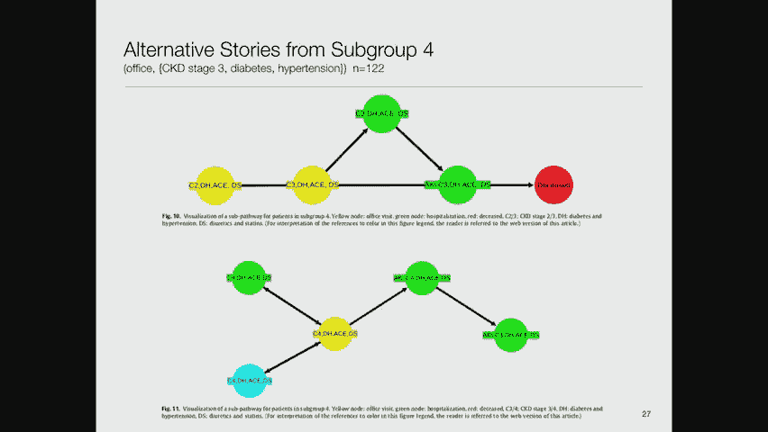

我将以密歇根大学护理中心的一个护理计划为例。这是一个教育组织，试图帮助护士找出如何成为好护士。护理计划通常包含以下列：
*   **评估**：客观、主观和医学诊断数据。
*   **护理诊断**：例如“组织完整性受损”。
*   **预期结果**：护士试图实现的具体目标。
*   **计划**：包括病人教育等。
*   **干预措施**：护士计划做的事情。
*   **原理**：解释为什么这些干预措施能实现目标。
*   **成果评价**：记录实际实现的结果。

有许多网站提供针对各种病症的模板化护理计划，例如入院护理计划、酒精戒断护理计划等。这是一种尝试列出标准化护理计划的方法。

---

## 从数据中挖掘临床路径：机器学习方法

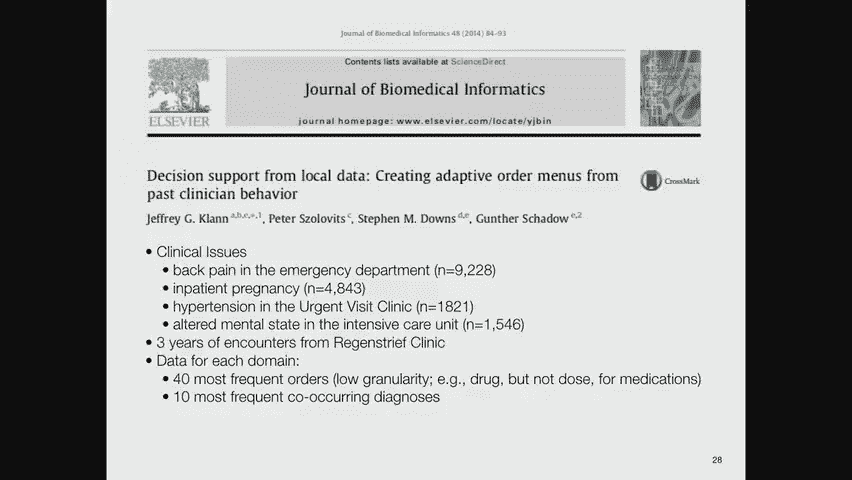

现在，张和他的同事们对一篇论文很感兴趣。他们所做的是：从电子健康记录中获取治疗数据，然后从这些数据中识别患者亚组，接着挖掘常见的治疗模式，再让医学专家评估这些模式，最后这些模式就成为临床路径。这是护理计划对特定亚人群患者的概括。

他们的想法是定义一些抽象概念：
1.  **事件**：一次就诊（如看医生或去医院），包含一套程序、药物和诊断。
2.  **超级节点**：将单次就诊中的事件组合抽象成一个节点。
3.  **就诊序列**：每个病人都有一个由这些超级节点按时间顺序组成的序列。
4.  **超级对节点**：为了捕捉最近两次就诊的信息（而不仅仅是最后一次），他们将连续两次就诊的超级节点组合成一个“超级对”节点，这样马尔可夫链中的每个节点就代表了病人最近两次就诊的情况。

他们最终得到了大约3500个不同的超级对节点。然后，他们使用一个距离函数（基于最长公共子序列）对这些就诊序列进行分层聚类，将患者分成不同的亚组。他们为肾病患者想出了三个主要组别。

然后，他们可以估计这些超级对节点状态之间的转移矩阵，并根据数据的支持程度来观察不同的轨迹。他们可以根据每个状态有多少病例来设置阈值，以确定是否认真对待到或从该状态的转换。

然而，这项研究的一个批评是数据量太少。他们得出的许多组别中病人数量相对较少。一旦有了这些转移矩阵，他们就可以展示某个特定患者群组的典型诊疗模式。例如，一个包含14名严重慢性肾病患者的群组，其典型模式可能显示病人经历了办公室就诊、服药、住院、教育访问，然后不幸死亡。

但即使在一个亚组中，也可以发现非常不同的模式。例如，另一个模式可能显示病人在教育和医生访问之间来回，并存活下来。我认为这是个好主意，但在使用的技术上可能会有改进空间，当然，更多的数据会很有帮助。

---

## 群体智慧：订单推荐系统

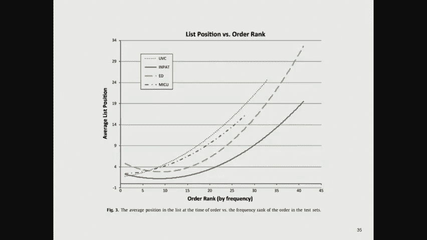

这里有一个类似的想法，来自杰夫·克兰在里根医院的博士学位研究。他借鉴了亚马逊推荐系统的概念，将其应用到医疗订单上。他记录了里根医院的所有医嘱，建立了一个近似亚马逊推荐系统的模型，提示医生：“其他要求进行以下一系列测试的医生也要求了这项额外的测试，你没有点，也许你应该考虑。”或者反过来提示可能不必要的检查。

他专注于四个不同的临床问题：急诊科背痛、急诊科高血压、紧急护理诊所高血压，以及重症监护室精神状态改变。他使用了里根医院三年的就诊数据，对于每个领域，将自己限制在40个最频繁的订单和10种最常见的共病诊断。

这种方法的一个明显陷阱是：如果医生群体都采用某种并非最佳实践的传统方法，那么推荐系统只会强化这种错误。例如，塞梅尔维斯（Semmelweis）发现让医生洗手可以大幅降低产褥热死亡率，但他的同行们拒绝接受，因为“医生的手是治愈之手”的观念根深蒂固。这是一个群体智慧导致不良结果的案例。

尽管如此，这种方法的吸引力在于，因为它从真实数据中归纳出来，所以倾向于处理更复杂的病例，而不是那种可以简单制定指南的刻板病例。他使用了贝叶斯网络模型来表示可能的医嘱和证据（已完成的订单结果）。匹兹堡大学的“四元组”（Tetrad）系统实现了贪婪等价搜索（Greedy Equivalence Search），用于在贝叶斯网络空间中搜索能很好表示数据的网络结构。

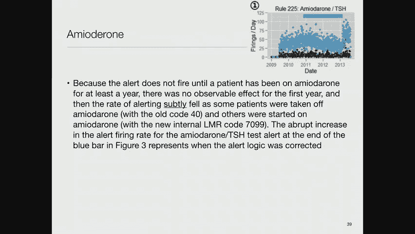

得到的贝叶斯网络节点对应于各种干预措施和条件。然后，可以将特定病人的数据输入网络，固定某些节点的值，并进行贝叶斯推理，计算未观测节点的概率，从而推荐尚未进行的高概率干预措施。这类似于顺序诊断，但模型更复杂。

界面被称为迭代治疗建议算法（Iterative Treatment Recommendation Algorithm），向医生显示病人的问题和当前医嘱，并建议可能要求的新医嘱。他们能够证明，该算法在预测医生下一步实际会做什么方面做得相当好，通常能将正确的建议排在前十名左右。

---

## 决策支持系统的实施与监控挑战

现在，我想谈谈决策支持系统实施中的挑战。亚当·赖特曾积极尝试部署决策支持系统。他有一个有趣的插曲：在演示一个用于监测长期使用胺碘酮患者甲状腺和肝功能（TSH和ALT）的警报系统时，他输入了一个假想病例，但警报没有响。调查发现，在2009年，医院系统中胺碘酮的内部代码从40改成了70，但警报规则逻辑从未更新以反映这一变化。因此，随着时间推移，使用新代码开药的患者不再触发警报，直到2013年才发现并修复了这个错误。

另一个例子是儿童铅筛查规则。对两岁儿童的筛查率从每天三四百人下降到零，几年后才被发现。调查发现，规则中增加了两个不完整的条款（与性别和吸烟状况有关），导致规则几乎从不触发。医院的更改日志系统也崩溃了，丢失了日志数据。

这些故事促使他们思考如何持续监控此类问题。他们引入了变点检测（Change Point Detection）的概念。他们建立了一个包含季节性的动态线性模型（因为医疗活动有周内周期）。模型假设输出是输入的某个函数加上高斯噪声，状态根据某种进化方程演变。

他们建立了一个多过程动态线性模型，即数据可能由一组动态线性模型中的一个生成。他们考虑了三种基本模型：稳定模型、附加离群值模型和水平移动模型。通过计算这些模型在给定数据下控制数据生成的概率，可以得到一个“变点得分”。

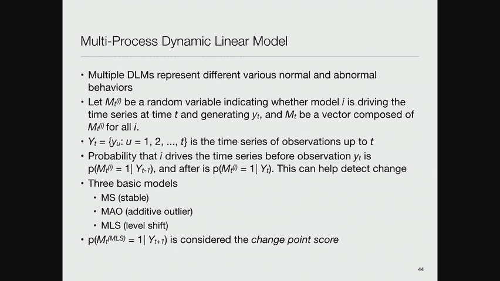

他们在医院实施了这一监控系统，现在不仅能收到临床警报，还能收到关于“某个规则触发频率低于预期”的监控警报。他们证明，他们的算法在检测此类问题方面比其他方法更有效。

---

## 沟通在工作流中的核心作用

在剩下的时间里，我想谈谈其他一些与工作流有关的问题。我们已经讨论过警报，但关于这些警报系统实际上如何工作，有一系列有趣的研究。

贝斯以色列女执事医疗中心有一个聪明的想法：升级警报。例如，如果病人的血钾水平危及生命，系统会向医生发送寻呼机警报。如果医生在20分钟内没有响应，系统会向医生的上级发送警报。如果上级在一小时内没有响应，则会向医院负责人发送警报。这确保了重要警报不会被忽略，但也带来了“过度警觉”和医生反感的问题。

沟通在医疗保健中至关重要。恩里科·科伊拉（Enrico Coiera）曾指出，医疗保健基本上是一项团队运动，大量的行动是关于沟通的，而不仅仅是决策。一项研究显示，医生在查房时，关于病人信息，有25%的时间会查看笔记，50%的时间会询问护士。另一项研究显示，诊所里大约60%的时间花在工作人员之间的交谈上。

科伊拉和格雷夫斯在1998年的一项研究中观察了医院工作人员的沟通模式。在一个班次（约三个半小时）内，高级住院医师有多达24个不同的沟通事件，平均每小时约7个。他们87%的时间用于面对面、电话或寻呼机交流，只有13%的时间用于处理电脑和病人笔记。

因此，考虑引入新的沟通渠道（如语音邮件、电子邮件、Slack等）或政策（如减少不必要的打断），从同步沟通转向异步沟通，可能对改善工作流很重要。

---

## 防止遗漏：工作流引擎的构想

最后一个话题是如何防止遗漏任务。医疗保健中最大的错误往往不是因为做出了错误的决定，而是因为有人忘记跟进某事。

部分受到贝斯以色列医院寻呼机升级警报的启发，我认为我们真正需要的是一个工作流引擎，它本质上是一个离散事件模拟器。这种引擎会维护一个时间表，按时间顺序执行任务。关键的是，当一个任务执行时，它可以在未来的时间点上安排另一个任务（例如，安排第二天的随访）。如果某个时间点没有安排应有的任务（例如“完成Y”），引擎就会触发通知或提醒某人。

据我所知，目前还没有医院电子记录系统具备这样的主动工作流引擎能力，但我认为这是一个好主意。

---

## 未来的愿景：个人健康守护天使

我想用一个仍然困扰着我们的问题来结束。1994年，我和一些同事提出了“守护天使宣言”（Guardian Angel Manifesto）的想法。这个想法是让病人更多地参与他们自己的护理，因为他们可以跟踪许多系统未能很好跟踪的事情。

构想是：从你父母怀你的时候开始，直到你死后的尸检，会有一个计算进程持续运行。它将负责收集所有关于你的相关医疗保健数据，成为你的电子病历。它还会是活跃的，帮助你与提供者沟通，帮助你了解自身状况，提醒你注意事项，为你安排事务等。

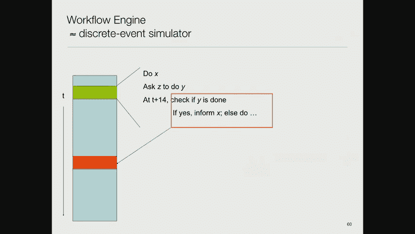

在2000年代中期，谷歌副总裁亚当·博斯沃思（Adam Bosworth）启动了“谷歌健康”（Google Health）项目，更侧重于个人健康记录。他们进行了试点，并与一些合作伙伴（如克利夫兰诊所、CVS等）合作。然而，三年后他们关闭了它。

失败的原因之一是，除了少数合作伙伴，数据无法自动输入系统。这意味着用户必须手动输入整个病史，而医生也不太可能去查看一个外部URL提供的记录。因此，这至今仍是一个尚未实现的愿景，但它仍然是个好主意。

---

## 总结

本节课中，我们一起学习了临床工作流自动化的多个方面。我们从提高平均表现与减少方差的理论权衡开始，探讨了通过制定临床指南和协议来标准化医疗实践的方法。接着，我们了解了自下而上的护理计划和从数据中挖掘临床路径的机器学习技术。我们还看到了基于群体智慧的订单推荐系统，以及决策支持系统在实施和持续监控中面临的挑战。我们认识到沟通在医疗团队协作中的核心作用，并探讨了构建主动工作流引擎以防止任务遗漏的构想。最后，我们展望了未来个人健康“守护天使”系统的愿景。理解并优化这些工作流，对于构建更安全、高效和以患者为中心的医疗系统至关重要。