# 22：机器学习监管入门 🏛️

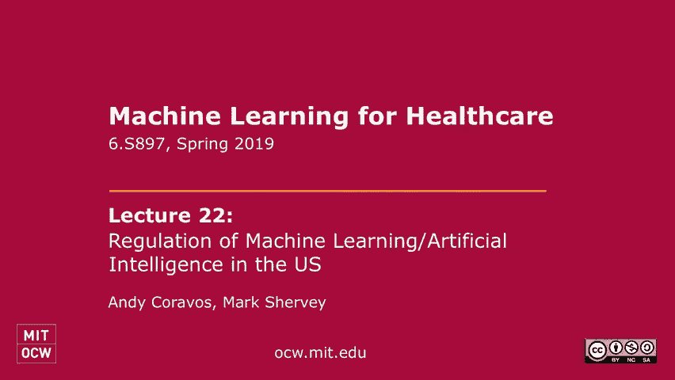

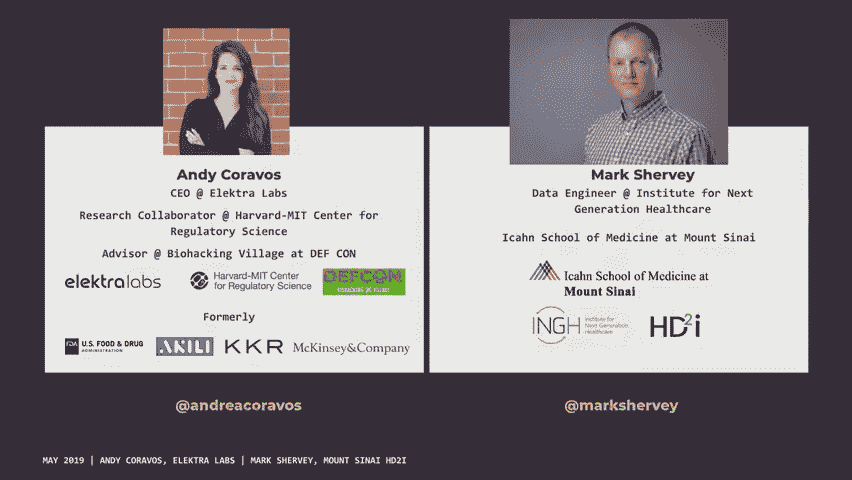

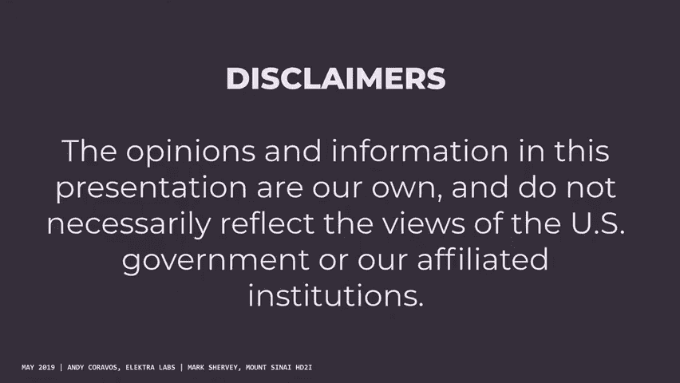

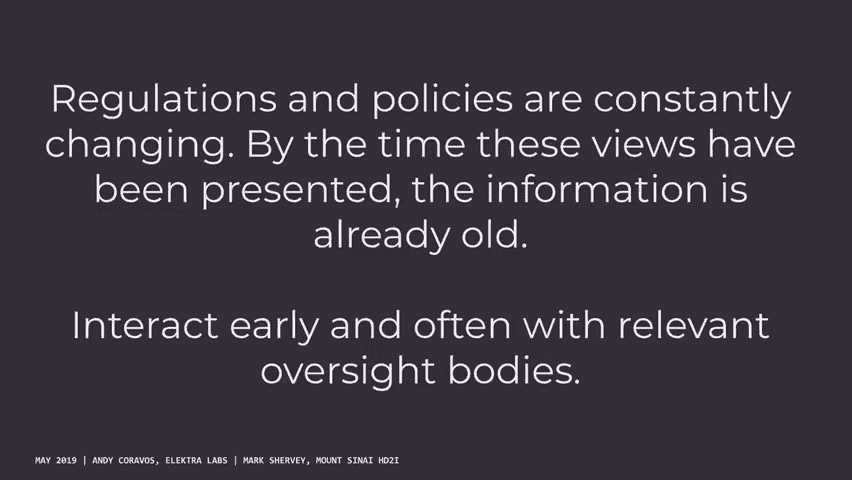

在本节课中，我们将学习机器学习与人工智能在医疗健康领域的监管框架，特别是美国食品药品监督管理局（FDA）的监管路径以及机构审查委员会（IRB）的伦理审查流程。我们将探讨如何界定一个产品是否属于医疗器械、不同的审批路径，以及研究人员在开发涉及人类受试者的算法时应遵循的伦理准则。

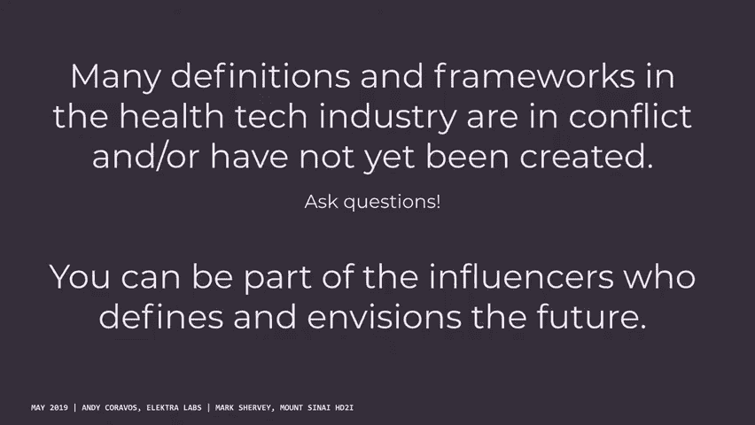

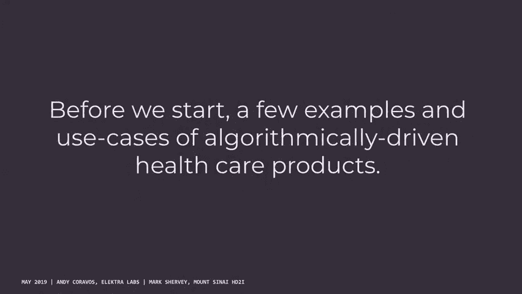

---

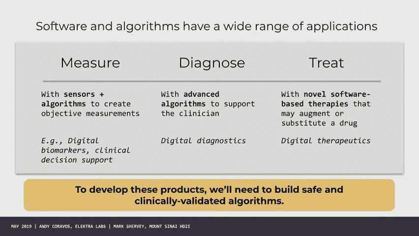

## 概述：监管的必要性与挑战

随着算法驱动的健康产品日益增多，明确其监管路径至关重要。监管旨在确保产品的安全性与有效性，同时促进创新。然而，对于软件和算法这类快速迭代的产品，传统的监管模式面临挑战。

上一节我们概述了课程目标，本节中我们来看看监管的核心机构及其职责。

## 核心监管机构

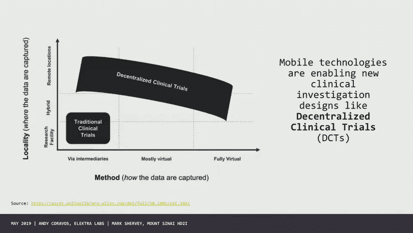

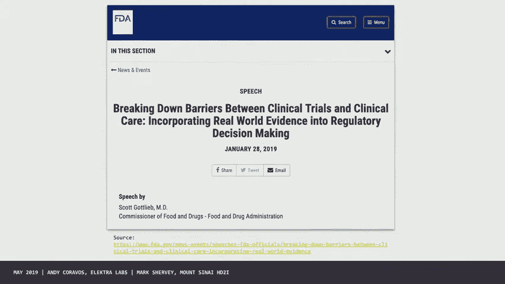

在医疗健康领域，多个机构共同参与对软件和算法的监督。

以下是主要涉及的机构及其职责：

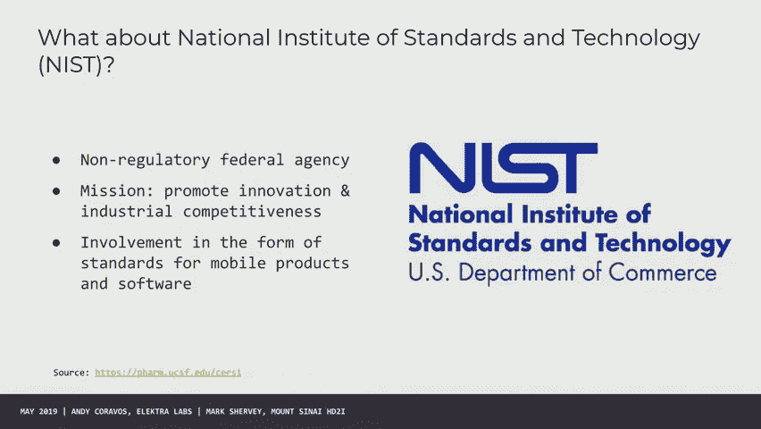

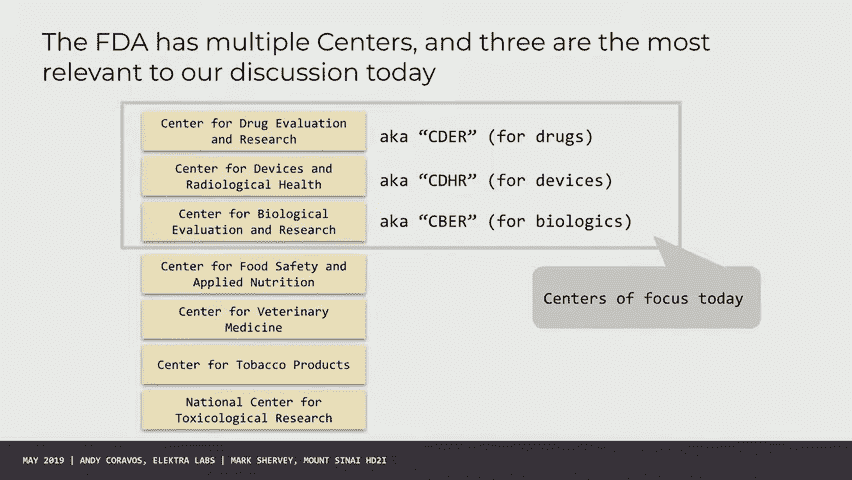

*   **美国食品药品监督管理局（FDA）**：负责医疗产品的安全性和有效性，促进创新并确保患者能获得高质量产品。其监管核心在于对产品声明的管理。
*   **卫生与公众服务部（ONC）**：负责卫生信息技术，关注数据的存储与互操作性。
*   **联邦通信委员会（FCC）**：监管产品的连接性，例如无线通信设备。
*   **联邦贸易委员会（FTC）**：侧重于消费者保护，打击欺骗性商业行为。在数字健康领域，FTC常处理涉及数据隐私和误导性宣传的问题。

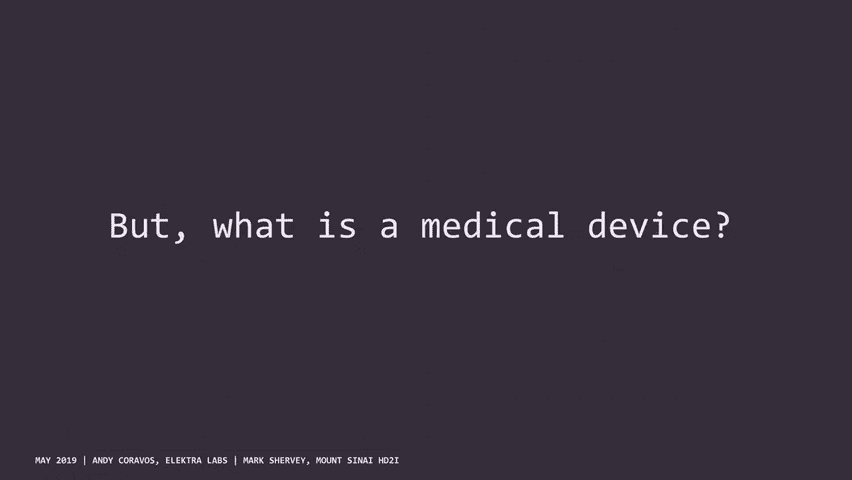

这些机构间的管辖界限有时会模糊，特别是当同一款产品兼具数据存储、诊断建议或治疗功能时。

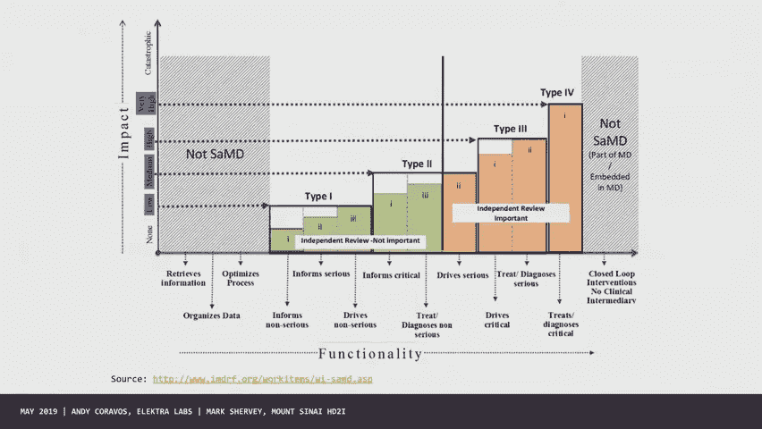

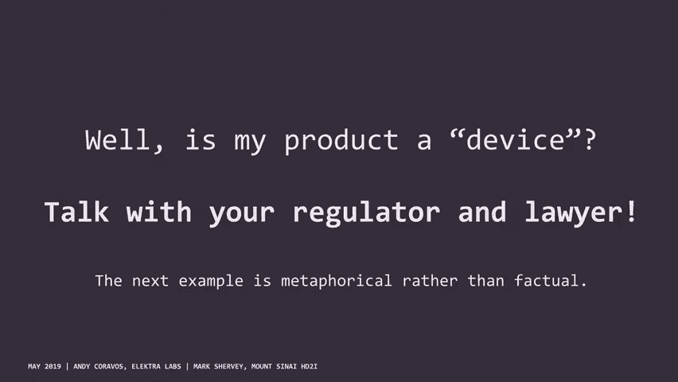

## 什么是医疗器械？

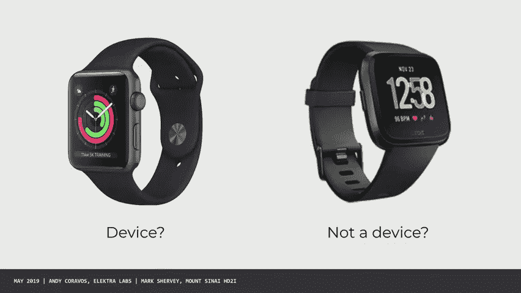

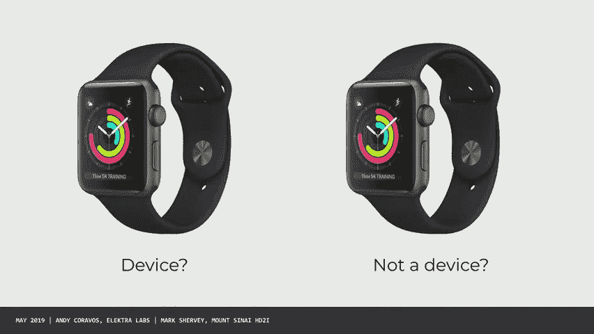

根据FDA的定义，医疗器械几乎涵盖了不属于其他中心（如药品、生物制品）管辖的、用于诊断、治疗、预防疾病或影响人体结构功能的任何工具、装置或软件。

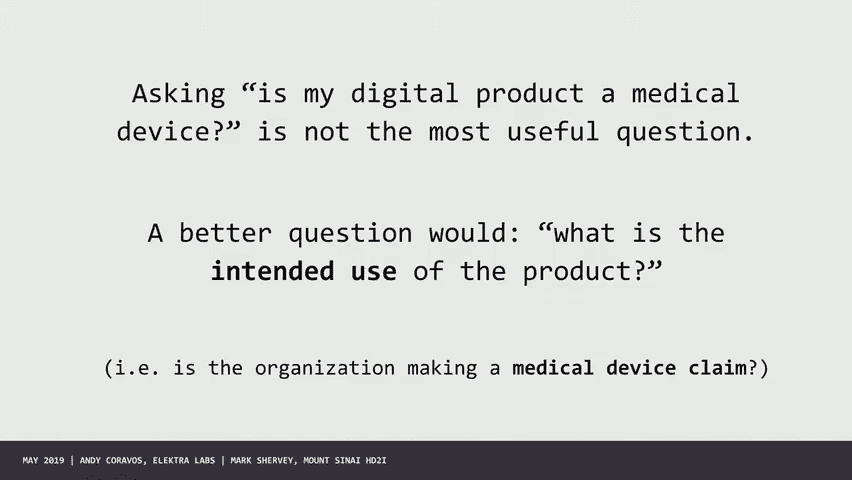

**核心概念**：一个产品是否被认定为医疗器械，关键不在于其硬件或代码本身，而在于制造商的 **“预期用途”** 和所作出的 **医疗声明**。例如，完全相同的智能手表应用，如果声称能检测心房颤动（AFib），就可能被视为医疗器械；如果仅显示心率数据，则可能不是。

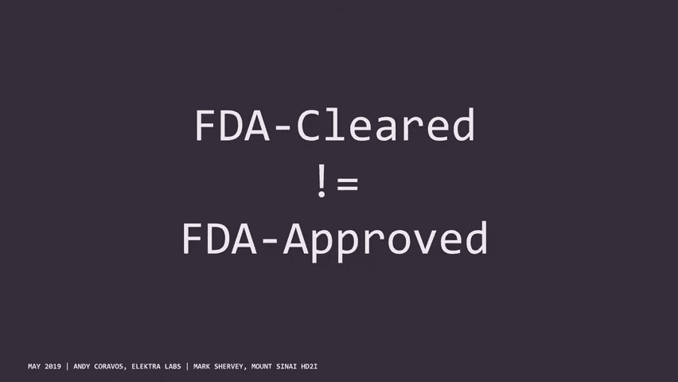

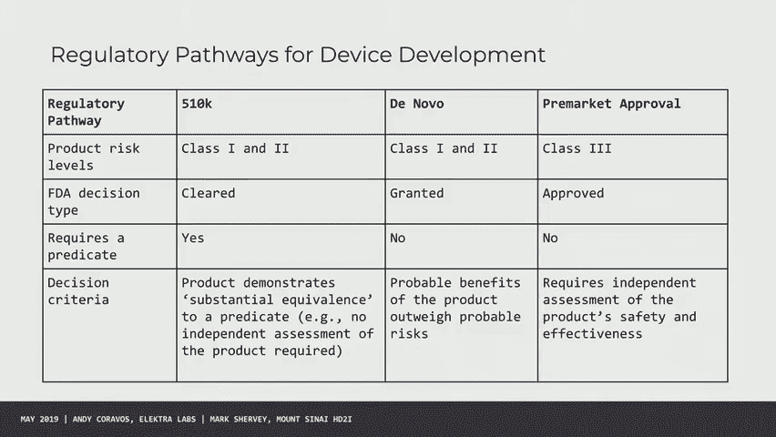

## 软件作为医疗器械（SaMD）

FDA提出了“软件作为医疗器械”的概念，特指那些没有硬件组件、其本身 intended use 符合医疗器械定义的软件。

理解产品在技术栈中的位置有助于思考监管策略。许多产品由多层组成：硬件传感器、信号处理算法、诊断算法和用户界面。FDA正在探索将硬件验证与上层软件创新解耦的模块化监管思路。

## FDA医疗器械审批路径

FDA为医疗器械设置了基于风险分层的审批路径。

以下是三种主要途径：

1.  **510(k) 上市前通知**：适用于中低风险设备，需证明新产品与已合法上市的“谓词设备”实质性等效。
2.  **De Novo 分类请求**：适用于中低风险、且无谓词设备的新型器械。通过后，可为后续类似产品建立新的分类标准。
3.  **上市前批准（PMA）**：适用于高风险器械，需要提供严格的科学证据来证明其安全性和有效性。

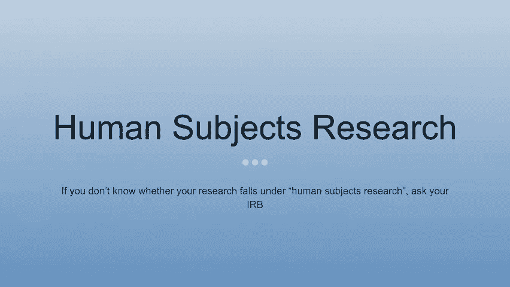

上一节我们介绍了不同的审批路径，本节中我们来看看一个与监管并行的、保护研究参与者的重要体系。

## 机构审查委员会（IRB）与人类受试者研究

IRB负责审查和监督涉及人类受试者的生物医学和行为研究，其首要目标是保护参与者的权利、安全和福祉。

### 何时需要IRB？

当研究活动同时满足以下两个条件时，通常需要IRB审查：
1.  是“系统性调查”，旨在发展或贡献“可推广的知识”。
2.  涉及“人类受试者”，即研究者通过干预或互动获取个体可识别私人信息或生物标本。

**核心概念**：**可识别私人信息（PHI）** 的界定非常关键。除了姓名、地址等直接标识符，像邮政编码（需前三位）、精确日期、超过89岁的年龄等信息，在特定组合下也可能导致个体被重新识别。

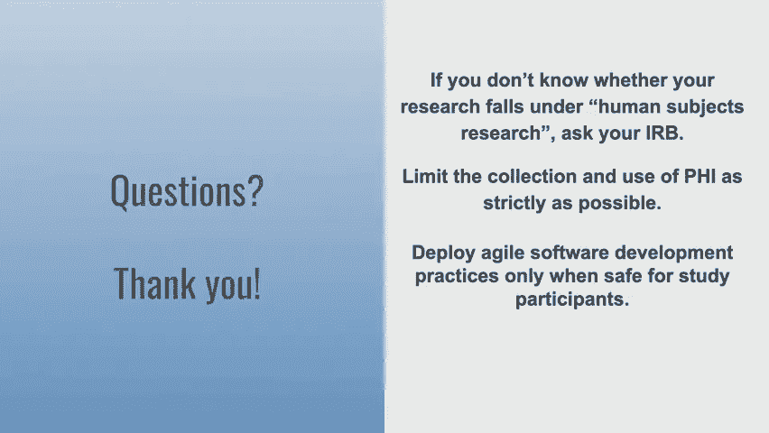

### IRB审查级别

IRB审查通常分为三个级别：

*   **豁免审查**：适用于风险极低的研究，例如对完全匿名化数据集的分析。
*   **快速审查**：适用于风险不高于最小风险的研究，通常由一位IRB委员审查。
*   **全面审查**：适用于风险高于最小风险的研究，需全体IRB会议讨论。

在敏捷软件开发实践中，需要特别注意区分“项目活动”（如一般性的软件功能开发）和“研究活动”（涉及人类受试者的数据收集与分析），并与IRB密切合作，确保在快速迭代中不损害参与者权益。

## 如何参与监管进程？

作为开发者和研究者，你可以积极影响监管政策的形成。

以下是参与监管进程的几种方式：

*   **提交公众评论**：在FDA等机构发布指南草案征求公众意见时，任何人都可以提交评论。来自技术社区的实践性意见极具价值。
*   **加入专业社区**：参与如“数字医学学会”等新兴专业组织，共同探讨监管新范式。
*   **思考新模型**：在学术或公共平台提出针对算法监管的新框架设想，例如借鉴临床试验的思维来管理算法在不同人群中的表现。
*   **公共服务**：通过“总统创新研究员”等项目进入政府机构工作，从内部推动系统改进。

## 总结与行动呼吁

本节课中我们一起学习了机器学习在医疗健康领域面临的主要监管框架。我们了解了FDA如何根据产品的“预期用途”来界定其是否为医疗器械，并熟悉了510(k)、De Novo和PMA等审批路径。同时，我们明确了在进行涉及人类数据的研究时，必须严格遵守IRB的伦理审查程序以保护参与者。

当前监管规则仍在快速演变中，你的专业知识对于构建合理、有效的监管环境至关重要。我们强烈鼓励你将本节课的思考，特别是对《人工智能/机器学习软件作为医疗器械的行动计划》草案的见解，转化为具体的公众评论并提交。你的声音将被听到，并能帮助塑造未来的技术监管格局。

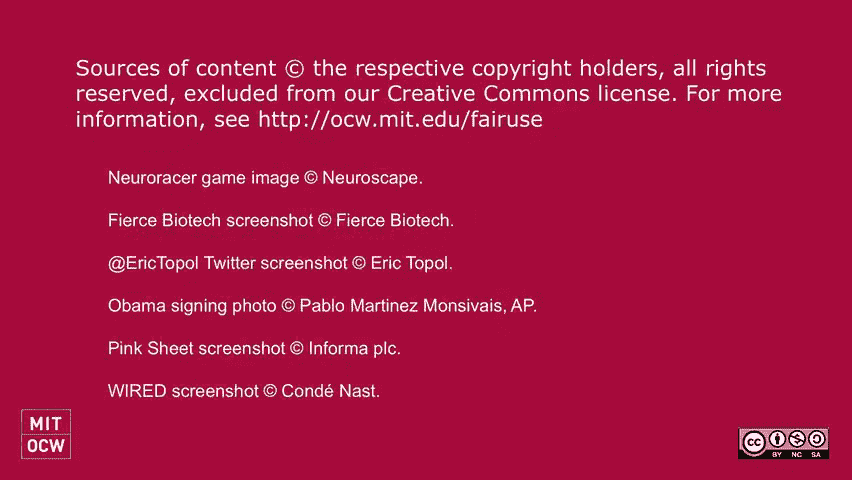

---
**免责声明**：本教程内容基于公开演讲整理，旨在教育目的，不构成法律或监管建议。政策法规不断变化，具体实践请务必咨询相关领域的法律与合规专家。