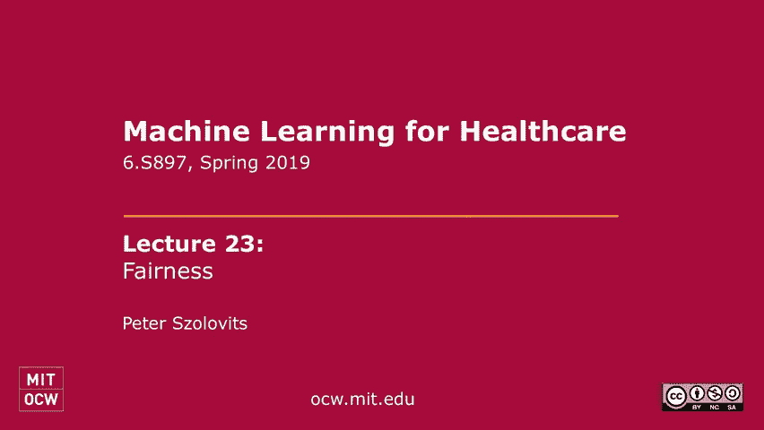
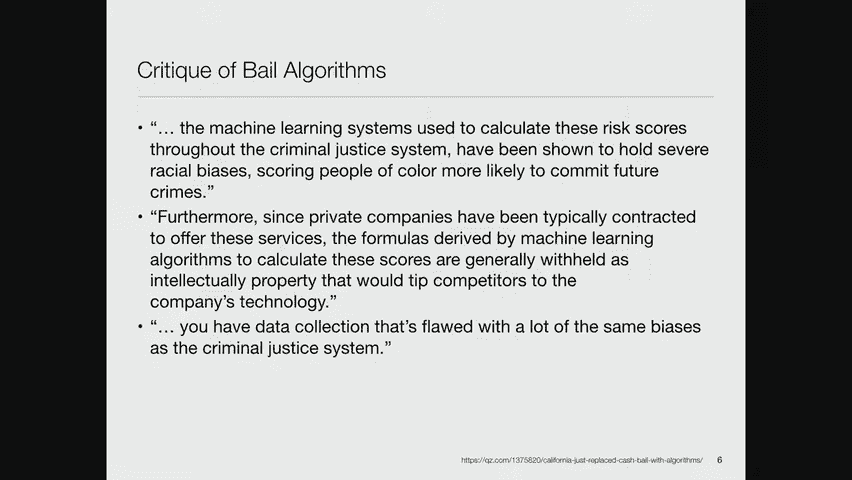
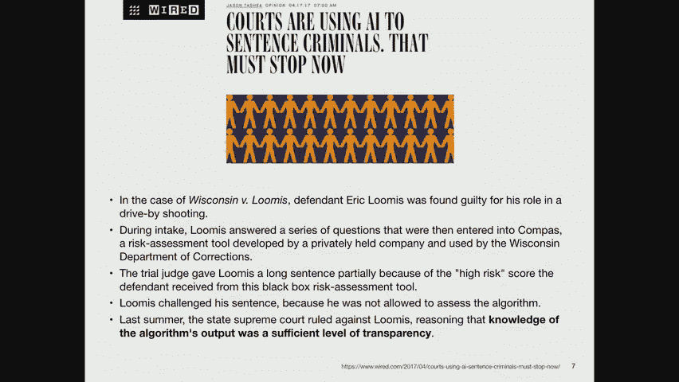
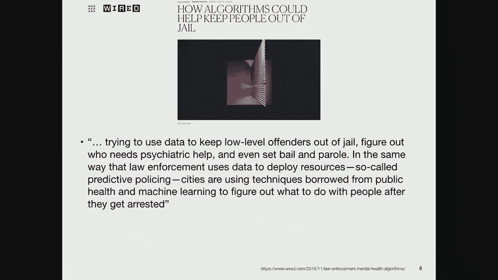
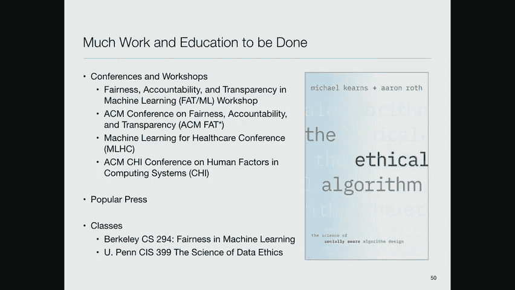
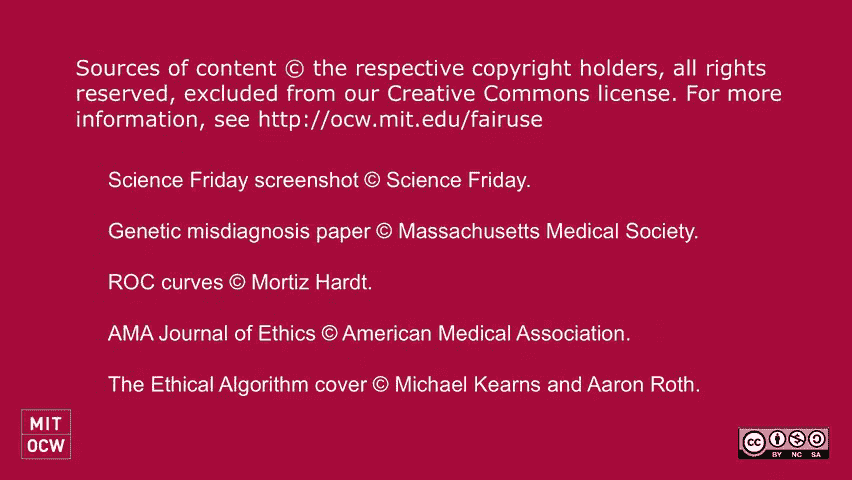

# 23：机器学习中的公平性 ⚖️

在本节课中，我们将要学习机器学习中一个至关重要且日益受到关注的议题：公平性。我们将探讨算法决策在司法、医疗、招聘等领域的应用，理解其中可能存在的偏见，并学习几种衡量和实现算法公平性的技术性概念。

一年多前，我接到一个电话，来自美国国家科学院、工程院和医学院的一个委员会。这是一个由德高望重的学者组成的机构。他们的研究机构被称为国家研究委员会，下设许多不同的委员会，其中之一是科学、技术与法律委员会。这是一个非常有趣的委员会，由大卫·巴尔的摩主持，他曾是麻省理工学院的教授，后来成为加州理工学院的校长，并且是一位诺贝尔奖得主。委员会成员还包括美国哥伦比亚特区巡回上诉法院的法官，这是仅次于最高法院的重要法院。这些成员都是极具影响力的人物。

我们讨论的主题包括区块链与分布式账本、信任、人工智能与决策。我受邀谈论的部分是大数据时代的隐私与知情同意。其他议题还包括法学院中的科学课程、新兴的科学技术与法律问题、利用诉讼针对持不同观点的科学家的问题，以及如何向持怀疑态度的公众传达生命科学进步。这旨在应对当前时代的反科学基调。

我们小组聚焦于人工智能与决策。小组成员包括斯坦福大学的法学教授汉克·格里利，他在这方面做了大量工作；审前司法研究所的Charisse Birdie，她关注法律问题，即许多公司使用软件来预测被告在审前获得保释后是否会按时出庭；斯坦福大学的放射学教授Matt Lundgren，他在构建用于检测肺部疾病的卷积神经网络模型方面做了出色工作；以及犹他大学的教授Suresh Venkata Subramanian，他最初是理论家，后来开始思考隐私与公平问题。我们每个人都做了简短发言，并进行了非常有趣的讨论。

有一件事让我非常惊讶。有人向那位上诉法院法官提问，他是否会雇佣像我们这样兼具计算方法和法律背景的人做他的法庭书记员。他的回答是否定的。他说，法官的角色不是成为专家，而是平衡问题双方的论点。他担心，如果一个书记员有很强的技术背景和观点，可能会使他的决定产生偏见。这让我想起，学习法律是学习如何辩论和取胜，而非寻找绝对真相。法律哲学认为，真相会在双方的激烈辩论中浮现。律师的职责就是尽全力为自己的论点辩护。法学院甚至教导学生，应该能够站在任何案件的任何一方并提出令人信服的论点。法官的这番话强化了这一概念，我觉得很有趣。

---

## 自动化决策的广泛应用 🧑‍⚖️

上一节我们介绍了公平性问题在司法领域的背景，本节中我们来看看自动化决策更广泛的应用。

司法领域是公众最关注的自动化决策应用之一。算法被用于确定各种服务的资格、评估在何处部署卫生检查员和执法人员，以及划定选区界线。所有关于不公正选区划分的讨论，都涉及使用机器学习技术来定制选区，以最大化某一政党获得多数席位的可能性。

这些技术也被用于保释、假释和量刑决定。支持者认为，算法可以为人性判断带来清晰度和精确度，从而减少人类偏见的影响。法官和陪审团都可能存在偏见，通过将决策过程形式化，或许能取得更好的结果。

然而，利用技术决定谁的自由被剥夺以及根据什么条件，也引发了人们对透明度和可解释性的重大关切。我们下周将讨论透明度和可解释性，但今天的重点是公平性。

去年十月有一篇文章提到，在加州，被捕者是否获得保释的决定将部分由计算机算法做出，而非完全由人决定。县官员和法官仍有一定的自由裁量权，但在出现令人震惊的结果之前，算法可能会被常规使用。

对这些保释算法的批评基于许多因素。例如，两个情况完全相同的人，仅仅因为种族不同（一个是白人，一个是黑人），黑人获得保释的机会就低得多。你可能会问，如果算法是从数据中学习的，这怎么可能？这是因为一个复杂的反馈循环：算法从历史数据中学习，如果历史上法官更不愿意允许非裔美国人保释，那么算法就会学会并延续这种偏见。

第二个非常可怕的问题是，这些算法是由私人公司开发的。他们不会公开算法细节，你付钱只能得到答案，而不知道计算过程或训练数据。这使它成为一个真正的黑匣子。

---

## 数据缺陷与算法偏见 🔄

数据收集系统的缺陷与司法系统本身的缺陷是相同的。不仅有算法决定你是否能获得保释（这在你审判前是一个相对临时的问题），还有算法对量刑等问题提出建议，例如预测罪犯出狱后再犯的可能性，从而建议更长的刑期。

威斯康星州有一个特殊案例，州最高法院裁定，了解算法的输出结果就足以满足透明度要求，不构成对被告权利的侵犯。许多人认为这是一个令人愤慨的决定，很可能会被上诉并推翻。

另一方面，算法也可能帮助人们远离监狱。例如，有文章讨论用算法分析案件，识别那些真正需要精神治疗而非监禁的人，从而将他们从刑罚系统转入治疗系统。这是使用算法的积极一面。

---

## 算法在招聘中的应用 💼

不仅仅是司法领域，关于算法能否比人类更好地进行招聘的讨论也持续了很久。大公司拥有大量的招聘决策和结果数据（哪些是好员工，哪些不是），因此很容易想到使用算法来筛选求职者，并决定面试哪些人。

我有个人的故事。在加州理工学院读本科时，我曾是本科招生委员会的成员。当时学校每年只招收约230名学生，我们会面试前一半的申请者。有一天，一位教授提出一个思想实验：我们应该拒绝已录取的230人，转而录取接下来的230人，看看教授们是否会注意到差异，因为学生能力的分布可能相当平坦。我们认为这不公平、不道德，且浪费了我们的筛选时间，因此没有这样做。

后来，这位教授建立了一个线性回归模型，用申请者的SAT成绩、推荐信等数据来预测他们大二的平均成绩。模型拟合得相当好，但一个令人不安的发现是：如果你的SAT语文成绩特别好，作为加州理工学院的大二学生，你的成绩预测反而可能更差。我们认为因为某人擅长某事而惩罚他是不公平的，尤其是对于一所追求博雅教育的学校。

这是一个例子，说明即使意图良好，算法也可能产生意想不到的、不公平的结果。

---

## 定义“公平”的挑战 🤔

那么，我们所说的“公平”究竟是什么意思？如果我们想为算法定义公平性，我们希望算法具有哪些特性？这是一个难以精确定义的概念。

一个良好的起点可能是：不同人群的错误率应该相似。或者说，模型不应强化我们期望社会中不存在的因果关系。另一个典型的公平观念是：相似的人应受到相似的对待，且这种相似性应独立于敏感属性（如种族、性别）。但这给“相似性”的距离函数带来了很大压力：两个人在哪些方面相似？哪些特征你显然不想使用？定义这个函数是一个挑战。

让我展示一个更技术性的思考方式。我们都知道选择偏差、抽样偏差、报告偏差等传统偏见。但我参与的一个例子涉及遗传学：一项主要针对欧洲人的研究发现，某种基因变异与肥厚型心肌病（一种可致年轻人心力衰竭的疾病）高度相关。因此，携带该变异的人被告知预期寿命很短。

但后来发现，许多非洲裔美国人携带这种变异却没有患病。问题在于，最初建立预测模型的人群是欧洲血统，而非非洲血统。同样的故事最近再次上演：一项研究发现，在欧洲人群中发现的骨质疏松遗传风险因素，无法提高对中国人群骨折风险的预测。技术上，偏见从何而来？

康斯坦丁·阿尔费里斯在2006年提出一个分析：在一个完美的世界里，有无数可能的模型可以解释数据关系。我们选择一些模型族进行拟合，并使用梯度下降等技术寻找最优解。设 `O` 为所有可能模型族中的最优模型，`L` 为特定学习机制能学到的最佳模型，`A` 为实际学到的模型。那么，**偏差** 大致是 `O - L`（学习方法相对于目标的局限性），**方差** 是 `L - A`（特定学习过程导致的误差）。

你可能会说，但机器学习的目的不就是“区分”吗？在法律意义上，“歧视”与统计学上的“区分”不同。一些区分的依据是合理的（如与工作相关），一些是不合理的（如基于种族）。一个教训是：歧视是特定领域的。你不能定义一个普遍适用的歧视概念，因为它与具体决策场景中哪些特征在道德上无关紧要密切相关。

从历史上看，政府试图通过法律规范某些领域，如信贷（《平等信贷机会法》）、就业（《民权法》）、住房（《公平住房法》）。法律承认一些受保护的类别：种族、肤色、性别、宗教、国籍、公民身份、年龄、怀孕、家庭状况、残疾、退伍军人身份，以及某些司法管辖区的性取向。

关于歧视有两种法律学说：**差别待遇**（不同对待）和**差别影响**（不同结果）。差别影响学说认为，无论机制如何，如果不同种族或性别群体的结果存在显著差异，就初步证明存在歧视。法院通常认为需要约20%的差异才能构成差别影响。辩护的关键在于证明这种差异是“与工作相关的”或“业务必需的”。

有趣的是，差别待遇（强调程序公平和机会平等）和差别影响（强调结果平等）常常是相互冲突的。机会平等并不总是导致结果平等。

---

## 形式化公平性概念 📐

莫里茨·哈特在一场讲座中将问题形式化。考虑一个决策问题，我们有一个模型。设：
*   `X` 是个人特征集合。
*   `A` 是受保护的特征集合（如种族、性别）。
*   `R` 是分类器或评分函数，是 `X` 和 `A` 的函数。
*   `Y` 是我们感兴趣预测的结果。

文献中出现了三个主要的公平性标准：

1.  **独立性**：评分函数 `R` 独立于受保护属性 `A`。即 `P(R|A) = P(R)`。这意味着评分必须在整个数据集上通用，不能区分不同受保护类别的人。操作上，可以通过检查不同组间获得特定结果的概率的绝对差或比率（如“四五法则”，即80%的比率）来衡量。但独立性概念有问题：它可能导致在信息较少的组中随机决策，或者当受保护属性是结果的完美预测器时无法满足。

2.  **分离性**：在给定结果 `Y` 的条件下，评分函数 `R` 与受保护属性 `A` 独立。即 `P(R|Y, A) = P(R|Y)`。这承认受保护属性可能与目标变量相关，但要求模型对不同组中具有相同结果的人给予相似的评分。例如，某种药物对某些亚群效果更好，FDA批准针对这些亚群营销是合理的。分离性允许 `R` 和 `Y` 相关，即使是完美预测器，并激励减少所有组的错误。

3.  **充分性**：在给定评分函数 `R` 的条件下，结果 `Y` 与受保护属性 `A` 独立。即 `P(Y|R, A) = P(Y|R)`。这要求不同组的正预测值和负预测值具有一致性。如果评分函数是概率，并且对于获得某个评分的所有实例，其中正例的比例与该评分值相符，则称该评分函数是**校准良好**的。

一个可怕的消息是：可以证明，除了某些平凡情况，这三个标准中的任何两个都无法同时被满足。它们互不相容。谷歌有一个很好的可视化工具，展示了采用不同公平性概念在合成人群上导致的权衡。

教程中还指出另一个问题：可能存在不同的因果模型（如受保护属性直接影响结果，或通过中介变量影响），它们能产生完全相同的观测数据分布，但从公平性角度解读却完全不同。这使我们无法仅从数据中区分哪种模型（或哪种公平性干预）是正确的。

---

## 现实研究案例：医疗领域的公平性 🏥

我想通过几个现实研究案例来结束。其中一项基于艾琳的工作，发表在《美国医学协会杂志-伦理学》上。

我们研究了机器学习模型在识别和减少普通医疗与精神健康护理差距方面的潜力。我们分析了来自麻省总医院和麦克莱恩医院的数据，探究是否存在基于种族、性别和保险类型（作为社会经济地位的代理）的偏见。我们使用主题建模（LDA）从临床笔记中提取特征，并预测30天再入院率。

研究发现，不同亚人群的主题分布存在差异：
*   白人患者更多讨论焦虑和慢性疼痛。
*   黑人、西班牙裔和亚裔患者更多讨论精神病性症状。
*   男性患者更多讨论药物滥用。
*   女性患者更多讨论抑郁。
*   有私人保险（较富有）的患者焦虑和抑郁程度较高。
*   有公共保险（较贫穷）的患者药物滥用问题更多。

在预测性能（错误率）方面，我们也发现了差异：
*   在ICU数据中，模型对男性的预测错误率显著低于女性。
*   对私人保险患者的预测结果优于公共保险患者。
*   在精神健康数据中，差异不那么明显，可能因为数据量较小。

这表明，在我们拥有的数据和所建模型中，确实存在群体偏见。

---

## 案例研究：医疗不信任与治疗差异 🤝

最后是威利的研究，关于模拟重症监护数据中医疗不信任的影响。

数据显示，非裔美国人患者使用机械通气的平均时间显著长于白人患者。在另一个更大的eICU数据集中也观察到了类似模式。威利提出的问题是：这种差异是否源于患者与医生之间信任程度的差异，而非纯粹的生理或社会经济因素？

他的方法是首先识别有明显“不信任”标志的病例（如违背医嘱离院、拒绝尸检、拒绝签署同意书、用药依从性差）。然后，他利用这些明确标注的病例训练一个逻辑回归模型，来预测那些没有明显标志的病例的“不信任”倾向。

模型发现，与“不信任”相关的因素包括：患者躁动、被约束、疼痛等。与较低不信任相关的因素包括：患者警觉、有医疗代理人、家属沟通多等。

分析表明，在预测机械通气和升压药使用差异时，高信任度患者与低信任度患者之间的差距，比黑人与白人患者之间的差距更为显著。这暗示，导致治疗差异的根本特征可能不是种族本身，而是与种族相关的**医疗不信任**。历史事件（如塔斯基吉梅毒实验）可能导致某些群体对医疗系统更不信任。进一步分析表明，这种不信任并非单纯由疾病严重程度解释。

---

## 总结与展望 📚

本节课中，我们一起学习了机器学习中的公平性这一复杂而重要的议题。

我们探讨了算法在司法、招聘等领域的应用及其潜在的偏见问题。我们了解到，定义“公平”具有挑战性，并且存在多种形式化的公平性概念（如独立性、分离性、充分性），但它们常常相互冲突，无法同时满足。我们还通过医疗领域的研究案例，看到了偏见在现实数据中的体现，以及如何通过技术手段进行探索和度量。

公平性是一个需要持续研究和讨论的丰富领域，涉及技术、伦理、法律和社会等多个层面。许多大学已经开始开设相关课程，并将伦理观念注入技术教育中。宾夕法尼亚大学的迈克尔·卡恩斯和亚伦·罗斯即将出版《道德算法》一书，预计会引起广泛关注。

在这一领域还有很多工作要做，既要发展技术方法，也要理解社会需求，并将两者匹配起来。