# 24：数据集偏移的鲁棒性 🛡️

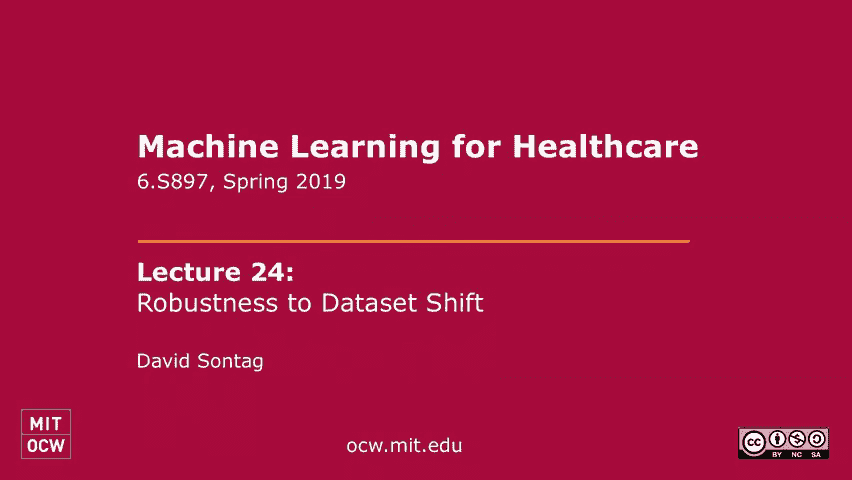

在本节课中，我们将要学习机器学习模型在面对数据集偏移时的鲁棒性问题。数据集偏移是指模型训练时使用的数据分布与模型实际应用时的数据分布不一致的情况。我们将探讨两种主要的数据集偏移类型：对抗性扰动和自然数据变化，并介绍一些应对策略，包括迁移学习和表示学习方法。

---

## 数据集偏移概述

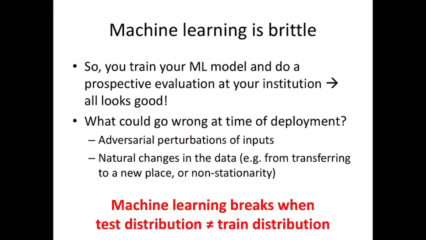

上一节我们介绍了课程主题，本节中我们来看看什么是数据集偏移。考虑以下场景：你是一名数据科学家，在一家医院（例如大众综合医院）精心构建了一个机器学习任务。你确保数据定义清晰，预测标签明确。你在训练数据上训练模型，在测试集上验证，模型泛化良好。你进行图表审查，确保预测内容符合预期。你甚至进行了前瞻性部署，让机器学习算法驱动临床决策支持，一切看起来都很顺利。

这个阶段之后会发生什么？当你进行部署时，当你的相同模型不仅明天被使用，下周、下个月、下一年也被使用时会发生什么？如果你的模型在这家医院运行良好，然后另一家机构（例如妇女医院、旧金山的医院或美国的一些农村医院）想使用同样的模型，它在短期内、长期内或在新的机构中会继续有效吗？这就是我们将在今天的课上讨论的问题。

为什么你的机器学习算法在这种设置下可能无法工作？这是因为当我们进行机器学习时，我们所做的一个核心假设是：你的训练数据与测试数据来自相同的分布。因此，如果你现在转向数据分布已经发生变化的设置，即使你根据原始数据计算的准确率看起来很不错，也没有理由期望它在数据分布发生变化的新设置中继续表现良好。

---

## 数据集偏移的示例

上一节我们了解了数据集偏移的概念，本节中我们来看看一些具体的例子。

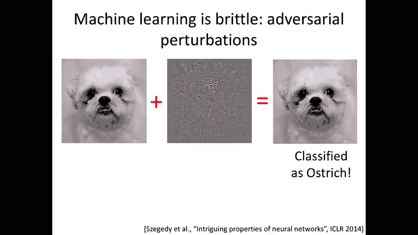

### 标签定义变化

下面是一个简单的例子，说明数据分布发生变化意味着什么。假设我们的输入数据是 `X`，我们试图预测一些标签 `Y`。`Y` 可能表示病人是否患有或被新诊断为2型糖尿病。你学习一个从 `X` 预测 `Y` 的模型。

现在假设你去了一个新的机构，他们对2型糖尿病的定义发生了变化。也许他们的数据中没有单独编码2型糖尿病，只编码了笼统的“糖尿病”，将1型和2型糖尿病混在一起。1型糖尿病通常是青少年糖尿病，与2型糖尿病是截然不同的疾病。所以现在“糖尿病”的概念是不同的，用例也可能略有不同。很明显，你用来预测2型糖尿病的模型可能无法很好地预测这个新标签。

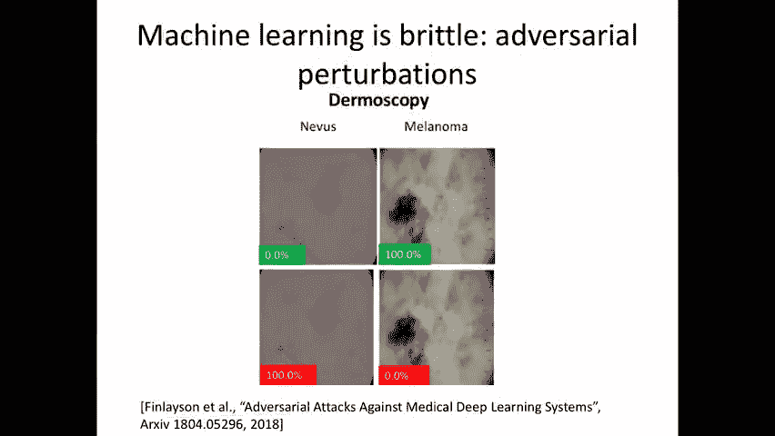

这是一个典型的数据集偏移例子。在这种情况下，给定 `X` 的 `Y` 的分布发生了变化。即使对于同一个人，在两个机构中 `Y` 的分布 `P(Y|X)` 也可能不同。这是一种类型的数据集偏移。

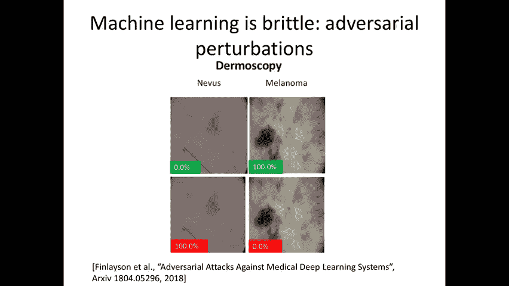

### 协变量偏移

另一种非常不同的数据集偏移是，我们假设 `P(Y|X)` 在两个分布中相等，唯一可能改变的是 `X` 的分布 `P(X)`。这种类型的数据集偏移被称为**协变量偏移**，它将是今天讲座的重点。

---

## 对抗性扰动示例

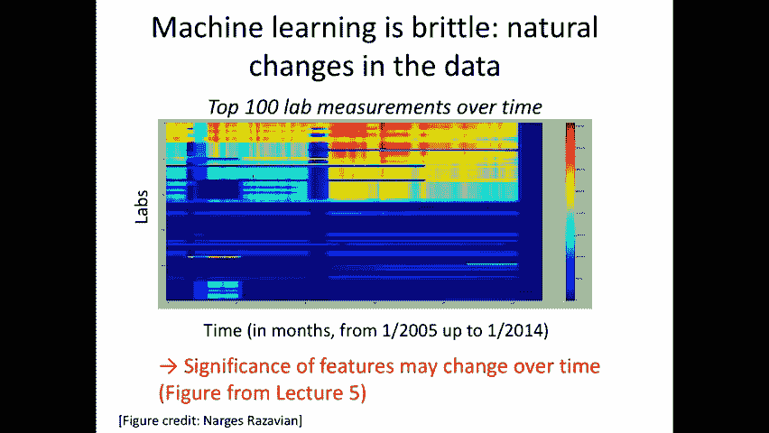

上一节我们看了标签定义变化，本节中我们来看看协变量偏移的一个具体子类：对抗性扰动。

你们都见过卷积神经网络在图像分类问题中的应用。你可以输入一张狗的照片，它显然被分类为狗。但是，你可以对图像进行微小的修改，在每个像素上添加一个非常小的噪声 `ε`，从而创建一个新图像。对人眼来说，这两个图像看起来一模一样。然而，当你将原本在无扰动数据上训练的机器学习分类器应用于这个新图像时，它可能被错误地分类为“鸵鸟”。

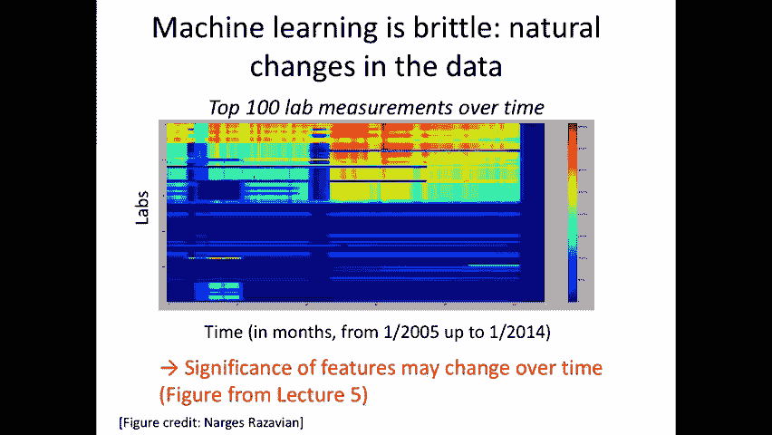

这一观察发表在2014年一篇名为《神经网络的有趣特性》的论文中，并引发了机器学习社区对对抗性扰动的浓厚兴趣。问题在于：如果你稍微干扰输入，这会如何改变分类器的输出？这能被用来攻击机器学习算法吗？反过来，一个人又该如何防御它？

这是一种数据集偏移，因为实际的标签没有改变（它仍然应该被归类为狗），但输入的分布略有不同，因为我们允许在每个输入中添加一些噪声。在这种情况下，噪声实际上不是随机的，而是对抗性的。

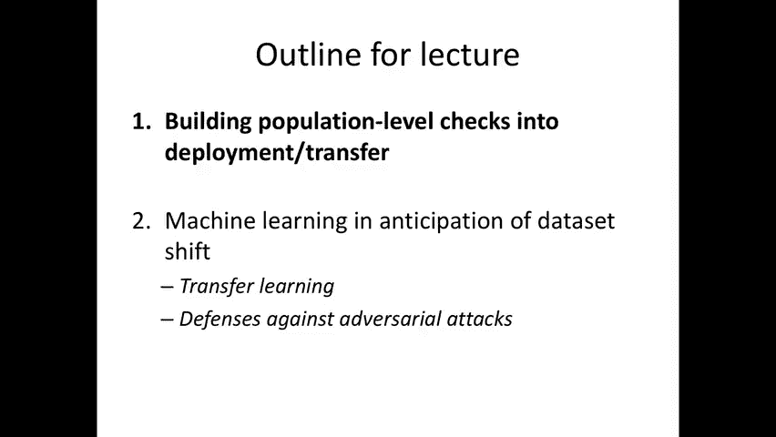

---

## 对抗性扰动在医疗领域的应用

我们为什么要关心这类事情？在这门课程中，是因为我希望这种对抗性的数据集偏移（虽然不自然）也将开始出现在计算机视觉和非计算机视觉问题中，包括医学领域。

例如，考虑皮肤病学中的图像分类问题。你得到一张图像作为输入，希望将其分类为某种特定类型的皮肤病（如黑色素瘤）。研究表明，通过对输入进行微小的扰动，可以完全改变分配给它的标签。

一篇论文讨论了如何恶意使用这些算法来谋利。例如，想象一家健康保险公司决定，为了报销病人昂贵的皮肤活检费用，临床医生或护士必须首先拍摄疾病的照片，并将该照片与该程序的账单一起提交。保险公司可能使用机器学习算法来自动检查该程序是否合理。如果不是，它可能会被标记。现在，恶意用户可能会扰乱输入，使得尽管病人的皮肤看起来完全正常，机器学习算法仍可能将其归类为异常，从而可能通过该程序获得报销。

显然这是一个恶意环境的例子。尽管如此，我们希望能够做的是在系统中建立制衡机制，使得这种情况不可能发生。因为对人类来说，很明显不应该被如此微小的干扰所欺骗。那么，你如何构建不那么容易被欺骗的算法？

---

## 自然数据变化示例

上一节讨论了人为的对抗性扰动，本节中我们来看看数据因自然原因发生变化的情况。

这个图表来自第五讲，当时我们在风险分层的背景下谈论非平稳性。X轴是时间，Y轴是不同类型的实验室测试结果。颜色表示在某个时间点、某个人群中订购了多少这些实验室测试。我们希望看到的是，如果数据是平稳的，每一行都应该是均匀的颜色。但相反，我们看到在某些时间点（例如每隔几个月），一些实验室测试似乎从未进行过。这很可能是由于数据问题，或者实验室测试提供商的数据丢失，系统出了点问题。

但也会有一些设置，例如，一种实验室测试从未被使用，直到它突然被使用。这可能是因为这是一种新的测试，刚刚被发明或批准，并在那个时间点获得报销。这是一个非平稳性的例子，当然，这也可能导致数据分布的变化。

第三个例子是跨越不同机构。一个极端的例子是美国的医院相对于中国的医院，临床记录将用完全不同的语言书写。一个不那么极端的例子可能是波士顿的两家不同的医院，用于某些临床术语的首字母缩写或速记可能因当地实践而不同。

那么，我们该怎么办？在剩下的演讲中，我将首先简要谈谈人们如何建立人口水平检查来了解发生了什么变化。然后，今天讲座的大部分内容，我们将讨论如何开发迁移学习算法，以及如何思考对抗攻击的防御。

---

## 评估算法在新机构的适用性

在我展示第一张幻灯片之前，我想讨论一下：假设你开发了一个机器学习算法，并且它在你的机构运行良好。现在你想知道，这个算法在其他机构行得通吗？你打电话给另一个机构的合作数据科学家，你应该问他们什么问题，以试图理解你的算法是否也能在那里工作？

以下是一些需要考虑的问题：
*   他们定期收集什么样的实验室测试信息？
*   他们有什么样的病人数据？
*   他们是否有类似的数据类型或特征可用于他们的患者群体？

例如，人口可能有差异。波士顿可能会有年轻人和老年人，或者在马萨诸塞州中部，年龄分布的变化会如何影响算法的泛化能力？年轻人的健康模式可能与老年人有很大的不同。也许有些疾病在年龄较大的人群中更流行。所以，如果你的模型是在一群非常年轻的人身上训练的，那么它可能无法很好地泛化到老年人群。

另一个例子与仪器校准有关。特别是在结肠镜检查领域，如果你在收集结肠的视频数据，不同相机设置的不同曝光，或者医生使用的不同技术，都可能导致数据本身的差异。目前还不清楚在一个过程或一种仪器上训练的算法是否会推广到另一个。

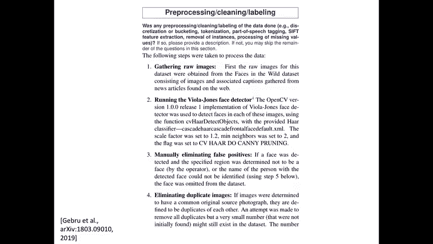

这些都是很好的例子。当一个人读到一篇来自临床社区的关于开发一种新的风险分层工具的论文时，你将永远看到一张所谓的“表1”。这张表格描述了研究中使用的人口特征，例如平均年龄、性别、种族、服用的药物、实验室测试结果等。

当你去一个新机构时，新机构接收的不仅仅是算法，还有这张描述算法学习群体的表格。他们可以利用这些知识和一些领域知识来思考：这个模型推广到这个新机构有意义吗？它可能不会的原因是什么？你甚至可以在对新人口进行任何前瞻性评估之前就这样做。

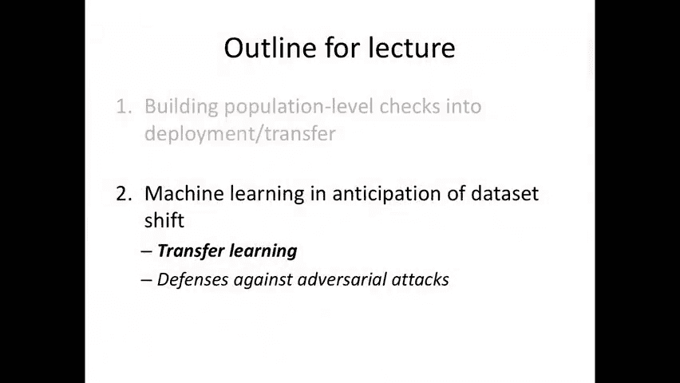

在你们的项目中，几乎所有人都应该有类似于表1的东西，因为这是该领域任何研究的重要组成部分：你正在研究的人口是什么？

---

## 数据集文档

近年来，这个问题确实引起了人们的注意，与我上周讨论的“公平与机器学习”话题密切相关。因为你可能会问，基于某些群体构建的分类器是否会推广到另一个人群？如果它所学习的人群非常有偏见（例如，可能都是白人），你可能会问，这个分类器在包括不同种族人群的另一个人群中会很好地工作吗？

这催生了一个概念，最近发表了一份工作草案，称为“数据集的数据表”。这里的目标是标准化描述，引出关于是什么数据集真正影响了你的模型的问题。

我将通过一个例子简单介绍几个元素。一个用于人脸识别研究的数据集的数据表可能包括：数据集的创建动机、组成、数据是如何预处理或清理的。例如，对于此数据集，它将经历以下过程：首先获得原始图像，然后运行人脸探测器，描述面部是如何被检测到的，以及如何删除重复项。

如果你回想一下本学期早些时候医学成像（如病理学和放射学）的例子，必须在那里进行类似的数据集构造。每一步都会产生一些偏见，需要仔细描述，以理解学习到的分类器的偏差是什么。

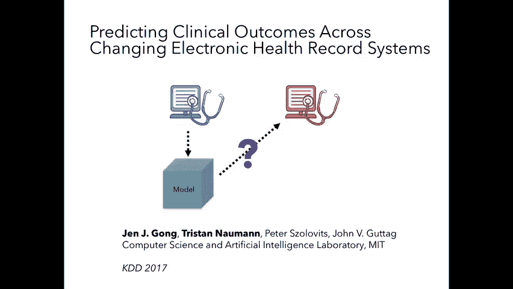

---

## 迁移学习方法

我现在要继续讨论一些更技术性的问题。我们正在做机器学习，现在，种群可能不同，我们该怎么办？我们能不能改变学习算法，希望你的算法能更好地转移到一个新的机构？或者如果我们从那个新机构得到一点数据，我们能利用新机构的少量数据，或者未来一个时间点的数据，重新训练我们的模型，使其在略有不同的分布中表现出色吗？这就是**迁移学习**的整个领域。

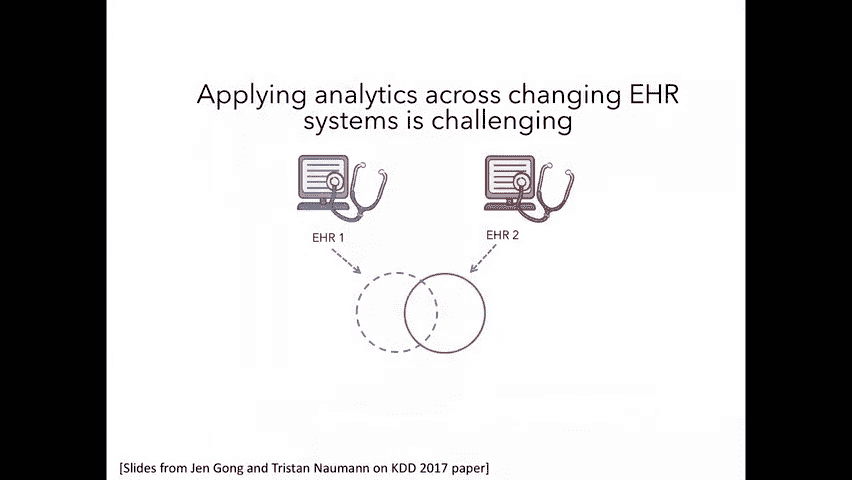

假设你有来自分布 `P(X, Y)` 的数据，也许我们有一点来自不同分布 `Q(X, Y)` 的数据。在协变量移位假设下，我们假设 `Q(X, Y) = P(Y|X) * Q(X)`，即给定 `X` 的 `Y` 的条件分布没有改变，唯一可能改变的是你在 `X` 上的分布。假设我们从新的分布 `Q` 中提取了一些少量的数据，我们如何利用它来重新训练我们的分类器，让它为新的机构做得很好？

我将通过四种不同的方法来做到这一点，从最容易理解的线性模型开始，然后继续深度模型。

---

### 方法一：多任务学习与正则化

第一种方法是你已经在本课程中见过几次的东西：我们将把迁移看作是一个多任务学习问题，其中一个任务的数据比另一个任务少得多。

如果你还记得当我们谈到疾病进展模型时，我们引入了正则化权重向量的概念，这样他们就可以互相靠近。当时我们谈论的是预测未来不同时间点疾病进展的权重向量。我们可以在这里使用完全相同的想法。

你把你的线性分类器（在一个非常大的语料库上训练）的权重称为 `w_old`。然后你解决一个新的优化问题，即最小化损失函数，其中损失是在新训练数据 `D`（从 `Q` 分布中提取）上计算的。然后，增加一个正则化项，要求新的权重 `w` 应该保持在 `w_old` 附近。

公式表示为：
`min_w L(w; D) + λ * ||w - w_old||^2`

其中 `λ` 是一个系数。如果你拥有的新机构数据量非常大，那你就不需要这个正则化项，你可以忽略以前学过的分类器，把一切都修改到新机构的数据上。但像这样的方法特别有价值，如果有少量的数据集移动，并且你只有来自那个新机构的非常少量的标记数据。这样你就可以稍微改变一下你的权重向量。

如果系数 `λ` 很大，它会说新的 `w` 不能离旧的 `w` 太远，所以允许你稍微调整以适应你拥有的少量数据。例如，如果有一个特征在旧数据中能预测，但在新数据集中不再存在（例如，它总是等于零），那么新权重向量中该特征的权重将被设置为零，权重可以被重新分配到其他一些特征。

这是最简单的迁移学习方法，在你尝试更复杂的事情之前，总是先尝试这个。

---

### 方法二：手动特征对齐

第二种方法也涉及线性模型，但在这里，我们不再假设原始特征集仍然有用。当你从第一个机构（例如MGH）学习模型，想把它应用到一些新机构（例如UCSF）时，特征集可能发生了很大变化，使得原始特征对新特征集毫无用处。

一个非常极端的例子可能是我之前给出的设置：你的模型是用英语训练的，你想在中文数据上测试。如果你使用词袋模型，这显然是一个无法泛化的例子，因为你的特征完全不同。

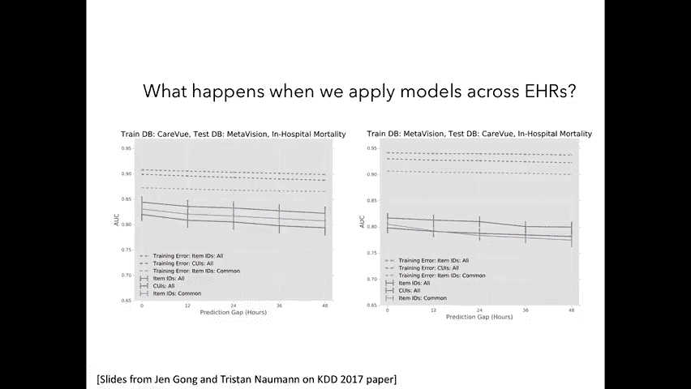

那么在那种情况下你会怎么做？你能做的最简单的事是什么？翻译。假设你有一些机器翻译能力，将中文翻译成英文（因为最初的分类器是用英文训练的）。然后你的新特征是翻译函数和原始特征的组合。然后你可以想象做一些微调，如果你现在有少量的数据。

最简单的方法可能是查字典。如果这个词在另一种语言中有类比，你就翻译它。但在你的语言中总会有一些词没有很好的翻译，所以你可能会想象最简单的方法是翻译，但把没有很好类比的词去掉，并强制分类器只使用共享的词汇。

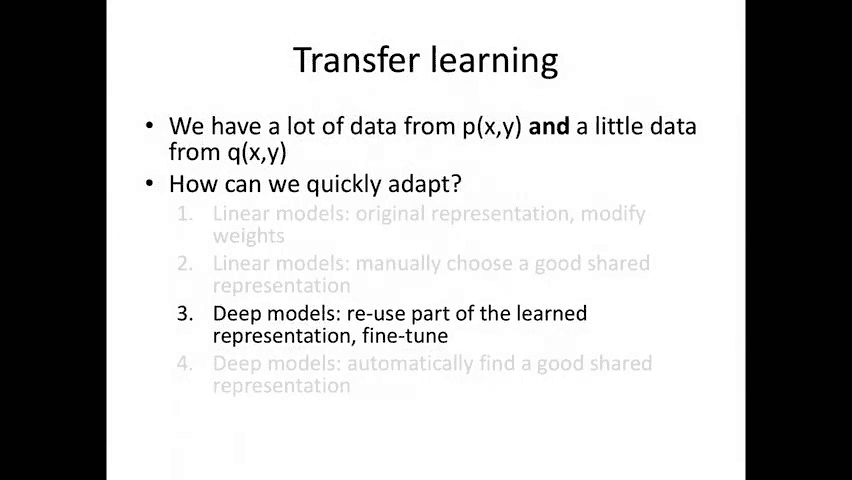

我们在这里讨论的一切都是手动选择决策的例子。所以我们将手动为数据选择一个新的表示形式，这样我们在源数据集和目标数据集之间就有了一些共享的特性。

让我们以电子健康记录（EHR）为例。EHR 1 和 EHR 2 中的概念可能映射到不同的编码。这就像英语到西班牙语的打字翻译。另一个改变可能是某些概念被删除了，比如你在EHR 1里有实验室测试结果，但EHR 2里没有。或者，可能会有新的概念，因此新机构可能拥有旧机构所没有的新类型的数据。

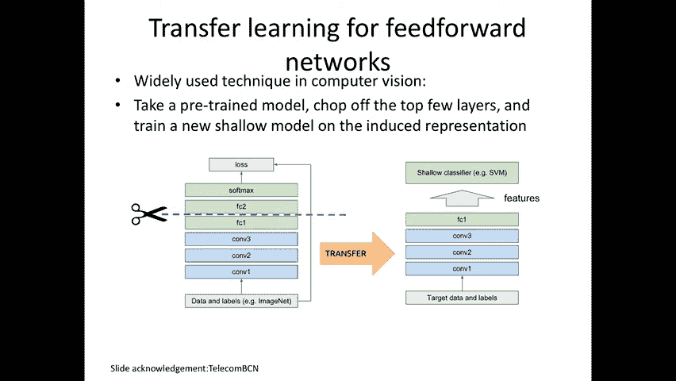

一种方法是从EHR 2中获得少量数据，用它来训练，扔掉EHR 1中的原始数据。当然，如果你只从目标分布中获得少量数据，这将是一个非常糟糕的方法。第二种明显的方法是在EHR 1上训练并直接应用，对于那些已经不存在的概念，就接受性能可能不佳。第三种方法（我们之前提到的）就是在这两个特征集的交集处学习一个模型。

一项研究采用了第三种方法。他们说我们要手动重新定义特征集，以找到尽可能多的共同点。这确实涉及到很多领域知识。他们看到的环境是预测医院死亡率或住院时间等结果。使用的模型是“事件袋”模型。他们记录病人直到预测时间点的纵向病史，查看发生的不同事件（如CVP警报、疼痛存在、给予肝素药物等）。每个事件被编码为一个特征。

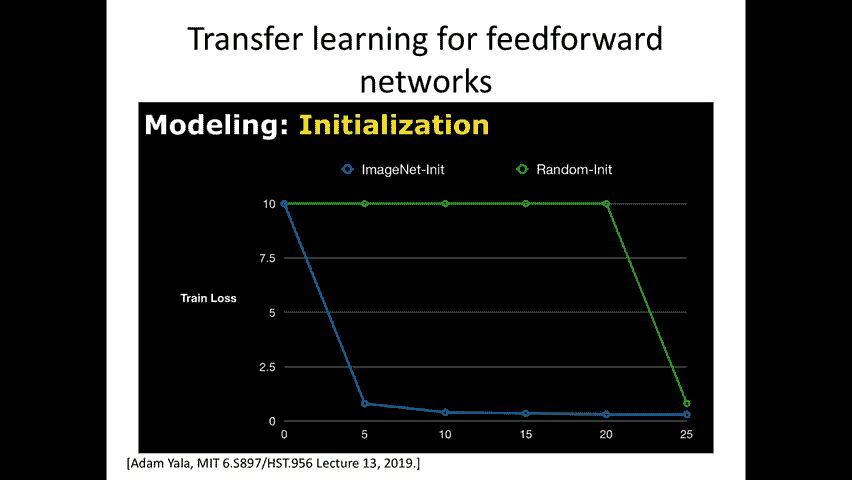

当一个人去新机构（EHR 2）时，事件的编码方式可能完全不同。一个人不能仅仅使用原始的特征表示。但人们可以尝试的不是想出一个新的特征集，而是想出一种可以从每个不同数据集导出的特征集。例如，因为MIMIC中的每个事件都有相应的文字描述（如“缺血性中风”、“出血性中风”），人们可以尝试用英语对特征的描述，将其映射成一种共同语言，例如统一医学语言系统（UMLS）。

我们现在要在一个更大的特征集上学习模型，其中“缺血性中风”被编码为一个更一般的概念（如“中风”）。希望即使一些更具体的数据没有出现在新机构的数据中，更多的一些更一般的概念确实出现在那里。然后你要在这个扩展的翻译词汇表上学习你的模型。在新的机构里，你也将使用同样的通用数据模型。通过这种方式，人们希望在你的特征集中有更多的重叠。

为了评估这一点，作者观察了MIMIC中两个不同的时间点，医院使用了两种不同的电子健康记录系统。他们使用这种手动对齐的方法，然后在这个新编码的基础上学习一个线性模型，并通过观察损失了多少性能来比较结果。

结果表明，使用更丰富的原始特征集可以获得更好的预测性能，但必须担心泛化问题。而使用翻译后的通用词汇，虽然在源数据上评估时性能略有下降，但它泛化得更好。当你试图将模型从一个系统推广到另一个系统时，使用翻译词汇的版本显示出明显更好的性能。

---

### 方法三：深度表示迁移

有一个问题：我们如何自动地尝试这样的方法？我们如何自动找到数据的新表示形式，这些表示形式可能会从源分布泛化到目标分布？

说到这一点，我们现在要开始思考基于表示学习的方法，其中深度模型特别能够做到这一点。深度神经网络可以切断网络的一部分，并重用这个新位置中数据的一些内部表示。

具体做法是：数据在底部输入，经过许多卷积层和一些全连接层。你决定将在机构A训练好的模型在某个层（例如最后一个全连接层之前）切断。然后，数据的“新表示”就是经过这些层后得到的输出。你把目标分布的数据（可能只有少量）输入到这个截断的网络中，得到它们的表示。然后，你在这些新的表示形式上学习一个简单的模型（例如，使用支持向量机学习一个浅层分类器），或者你可以添加更多的深度神经网络层，然后进行微调。

这些方法都尝试过，在某些情况下，一种方法比另一种更好。我们在本课程中已经见过，在第十三讲中，Adam Yala 在他的方法中尝试了两种方式：使用在ImageNet上预训练的模型进行初始化并微调，以及随机初始化。在他的案例中，他有足够的数据，实际上不需要使用ImageNet预训练模型，随机初始化最终也能达到非常相似的性能。但使用ImageNet初始化然后微调，能更快地达到目标性能。

然而，在医学成像的许多其他应用中，这些技巧变得必不可少，因为你在新的测试用例中没有足够的数据。所以，一个人可以利用从ImageNet任务中学到的过滤器（尽管这与医学成像问题截然不同），然后使用同样的过滤器，加上一套新的顶层，以便对你关心的问题进行微调。

这将是试图在一个深度架构中找到可迁移表示的最简单方法。但你可能会问，如何对时间序列数据、自然语言数据或健康保险索赔序列数据做同样的事情？为此，你真的需要考虑递归神经网络（RNN）。

递归神经网络是一种循环架构，你把一些向量作为输入（例如，在语言建模中，该向量可能是一个独热编码，表示该位置的单词）。它被输入一个循环单元，该单元将之前的隐藏状态与当前输入组合，产生一个新的隐藏状态。你读入完整的输入序列，然后可能根据最后一步的隐藏状态进行分类。

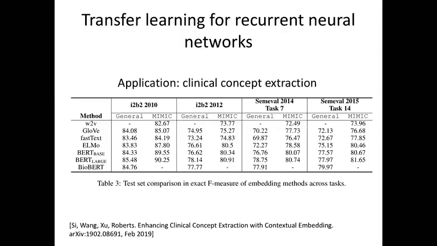

一个简单的循环单元公式是：
`s_t = f(W_s * s_{t-1} + W_x * x_t)`
其中 `s_t` 是当前隐藏状态，`s_{t-1}` 是前一个隐藏状态，`x_t` 是当前输入，`W_s` 和 `W_x` 是权重矩阵，`f` 是非线性激活函数。

`W_x` 矩阵的维度是（隐藏状态维度 x 词汇表大小）。如果你有大量的词汇量，这个矩阵会非常大，很快就会导致对稀有单词的过拟合。一个解决方案是使用 `W_x` 矩阵的低秩表示，特别是引入一个低维瓶颈。你可以让原始输入 `x_t`（一个独热编码）乘以一个嵌入矩阵 `W_e`，得到一个低维向量 `x'_t`（词嵌入）。然后你的循环单元只接受 `x'_t` 作为输入。这样，嵌入矩阵 `W_e`